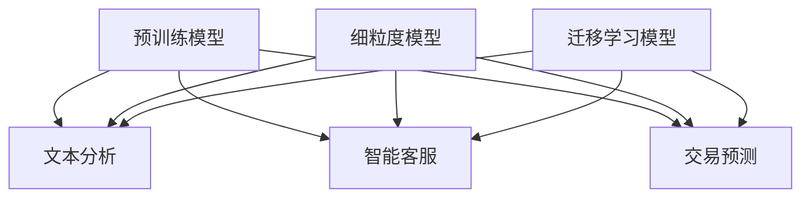
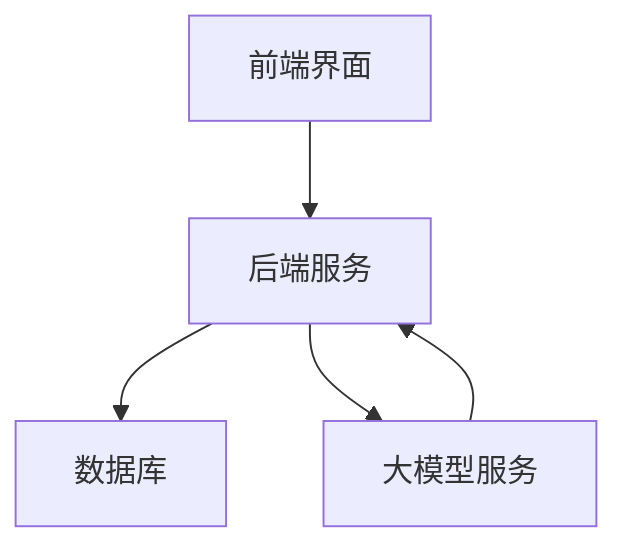
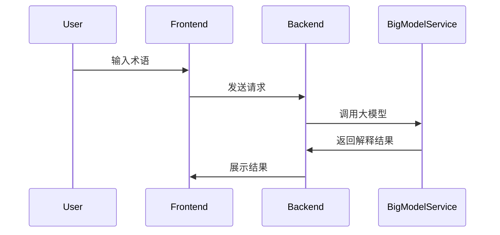
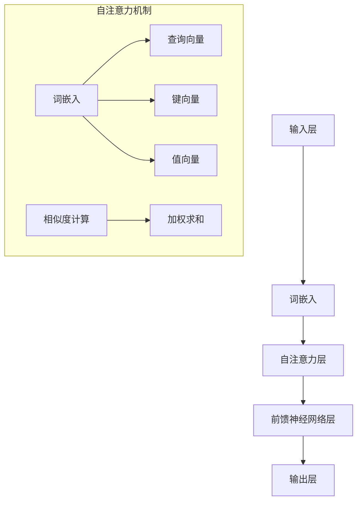

                 


# 开发基于大模型的金融专业术语解释系统

关键词：金融专业术语、大模型、自然语言处理、解释系统、系统架构、算法原理、数学模型

摘要：本文深入探讨了开发基于大模型的金融专业术语解释系统的过程。首先，我们明确了金融专业术语解释系统的需求背景和核心概念。然后，介绍了大模型技术的基本原理及其在金融领域的应用。接着，我们详细阐述了系统的整体架构设计，包括算法和数学模型的选择与实现。文章最后通过实际案例展示了系统的应用效果，并提出了最佳实践建议和未来研究方向。

----------------------------------------------------------------

## 引言与背景

随着金融行业的迅速发展，金融专业术语变得愈加复杂和多样化。对于非专业背景的人来说，理解这些术语常常成为一项挑战。因此，开发一个能够解释金融专业术语的系统变得尤为重要。这个系统不仅可以帮助金融从业人员更好地理解专业术语，还能够提高金融教育和培训的效果。

### 1.1.1 研究背景

在过去的几十年中，自然语言处理（NLP）和人工智能（AI）技术取得了显著的进展。尤其是大模型（如GPT、BERT等）的出现，使得机器理解和生成自然语言的能力大幅提升。这些技术为金融专业术语解释系统的开发提供了强有力的支持。

### 1.1.2 研究目标

本文的研究目标如下：

1. **明确金融专业术语解释系统的需求**：分析金融专业术语的特点，明确系统所需解释的术语范围和深度。
2. **基于大模型技术设计系统架构**：利用NLP和AI技术，设计并实现一个高效的金融专业术语解释系统。
3. **算法和数学模型的选用与实现**：选择合适的算法和数学模型，确保系统能够准确地理解和解释金融专业术语。

### 1.1.3 研究意义

本研究具有重要的实践和理论意义：

1. **提高金融从业人员的效率**：通过提供精确的术语解释，帮助金融从业人员快速理解复杂的金融术语，提高工作效率。
2. **促进金融教育**：为金融教育提供有力的辅助工具，帮助学习者更好地掌握金融知识。
3. **探索大模型在金融领域的应用**：为研究大模型在金融领域的应用提供新的思路和方法。

----------------------------------------------------------------

## 核心概念和术语

在开发金融专业术语解释系统之前，我们需要明确系统的核心概念和术语。以下是一些关键术语的定义和属性对比，我们将使用Mermaid ER实体关系图来展示这些概念之间的关系。

### 1.2.1 金融术语

**金融术语**是指金融领域中使用的专业词汇和表达。它们具有以下属性：

- **定义**：描述术语的含义。
- **分类**：按照金融领域的不同分类（如投资、银行、保险等）进行划分。
- **属性**：术语的属性，如名词、动词、形容词等。

### 1.2.2 大模型

**大模型**是指具有海量参数和强大学习能力的深度学习模型。它们具有以下属性：

- **参数量**：模型中参数的数量。
- **训练数据**：用于训练模型的原始数据集。
- **学习能力**：模型在处理自然语言任务时的能力。

### 1.2.3 自然语言处理

**自然语言处理（NLP）**是指计算机科学和人工智能领域中与处理自然语言相关的研究。NLP的核心概念包括：

- **分词**：将文本分割成单词或其他有意义的标记。
- **词性标注**：为文本中的每个单词标注其词性。
- **命名实体识别**：识别文本中的专有名词和实体。

### 1.2.4 系统架构

**系统架构**是指系统的整体设计和组织结构。金融专业术语解释系统的架构包括：

- **前端界面**：用户与系统的交互接口。
- **后端服务**：处理用户请求和术语解释的核心部分。
- **数据库**：存储术语数据和系统配置。

使用Mermaid ER实体关系图来展示这些概念之间的关系：

```mermaid
erDiagram
  金融术语 ||--|{ 大模型 }
  金融术语 ||--|{ 自然语言处理 }
  系统架构 ||--|{ 前端界面 }
  系统架构 ||--|{ 后端服务 }
  系统架构 ||--|{ 数据库 }
```

---

通过明确核心概念和术语，我们为后续系统设计和实现奠定了基础。在接下来的章节中，我们将深入探讨大模型技术及其在金融领域的应用。

----------------------------------------------------------------

## 大模型技术

大模型技术是近年来人工智能领域的重要突破，尤其是在自然语言处理（NLP）任务中表现出了卓越的性能。本节将介绍大模型技术的基本原理、类型及其在金融领域的应用。

### 2.1 基本原理

大模型技术通常基于深度神经网络（DNN）和变换器模型（Transformer），其核心思想是利用大量数据来训练一个具有海量参数的模型，使其能够捕捉语言中的复杂结构和规律。具体来说，大模型技术具有以下特点：

1. **大规模参数**：大模型通常包含数亿甚至数万亿个参数，这使得模型能够处理复杂的语言任务。
2. **端到端学习**：大模型可以直接从原始文本数据中学习，无需进行复杂的预处理和特征工程。
3. **自适应能力**：大模型能够自动调整参数，以适应不同的语言任务和领域。

### 2.2 类型

大模型技术可以分为以下几种类型：

1. **预训练模型**：如GPT、BERT等，这些模型在大量的无监督数据上进行预训练，然后通过微调（fine-tuning）来适应特定任务。
2. **细粒度模型**：这些模型针对特定领域的术语和表达进行精细训练，以提高在特定领域的性能。
3. **迁移学习模型**：这些模型利用在其他领域训练的知识来提高在金融领域的性能。

### 2.3 在金融领域的应用

大模型技术在金融领域有广泛的应用，包括但不限于以下方面：

1. **文本分析**：大模型可以用于分析金融报告、新闻文章和社交媒体数据，提取关键信息，为金融决策提供支持。
2. **智能客服**：通过大模型技术，可以构建智能客服系统，提供实时、准确的术语解释和咨询服务。
3. **交易预测**：大模型可以用于分析历史交易数据，预测市场走势，为交易决策提供参考。

### 2.4 Mermaid 图解

为了更好地理解大模型技术，我们使用Mermaid图来展示其基本结构：



---

通过上述介绍，我们了解了大模型技术的基本原理和类型，以及其在金融领域的应用。在下一节中，我们将详细讨论系统的整体架构和设计。

----------------------------------------------------------------

## 系统架构和设计

在设计一个基于大模型的金融专业术语解释系统时，需要考虑系统的整体架构和各个组件之间的交互。本节将详细描述系统的架构设计，使用Mermaid图来展示关键组件和它们之间的关系。

### 3.1 系统架构概述

系统架构可以分为以下几个主要部分：

1. **前端界面**：用户与系统的交互界面，提供术语查询和解释功能。
2. **后端服务**：处理用户请求，执行术语解释的核心逻辑。
3. **数据库**：存储术语数据和相关配置信息。
4. **大模型服务**：负责处理大模型的加载、推理和更新。

### 3.2 前端界面

前端界面是用户与系统交互的入口，主要包括以下功能：

- **术语查询**：用户可以通过输入金融术语来查询其解释。
- **搜索建议**：当用户输入部分术语时，提供搜索建议，帮助用户快速找到所需术语。
- **用户反馈**：允许用户对术语解释进行评价和反馈。

### 3.3 后端服务

后端服务是系统的核心，主要负责以下任务：

- **请求处理**：接收前端发送的查询请求，并进行解析。
- **术语解释**：调用大模型服务，获取术语的解释结果。
- **结果返回**：将解释结果返回给前端，并展示给用户。

### 3.4 数据库

数据库存储系统所需的各种数据，包括：

- **术语库**：存储金融术语及其解释。
- **用户数据**：记录用户查询历史和反馈信息。
- **配置信息**：存储系统配置参数，如大模型版本、更新时间等。

### 3.5 大模型服务

大模型服务负责大模型的加载、推理和更新。具体流程如下：

- **加载**：从数据库中加载预训练的大模型。
- **推理**：接收后端服务发送的术语，使用大模型进行推理，生成术语解释。
- **更新**：定期更新大模型，以适应最新的金融术语变化。

### 3.6 Mermaid 图解

为了更直观地展示系统架构，我们使用Mermaid图来描述各个组件之间的关系：



### 3.7 系统交互

系统交互主要涉及前端与后端之间的数据交换。以下是一个简化的交互流程：

1. **用户查询**：用户在前端界面输入术语，如“资产负债表”。
2. **请求发送**：前端将查询请求发送到后端服务。
3. **请求处理**：后端服务解析请求，并调用大模型服务。
4. **术语解释**：大模型服务返回术语解释结果。
5. **结果返回**：后端服务将解释结果返回给前端，并展示给用户。

使用Mermaid序列图来描述上述交互流程：



---

通过上述设计，我们为金融专业术语解释系统构建了一个清晰、高效的架构。在接下来的章节中，我们将深入探讨系统的算法和数学模型，以及其实际应用。

----------------------------------------------------------------

## 算法和数学模型

在构建金融专业术语解释系统时，选择合适的算法和数学模型是至关重要的。本节将详细介绍系统的核心算法原理、数学模型及其实现。

### 4.1 算法原理

系统采用基于变换器（Transformer）架构的大模型，特别是预训练模型如BERT（Bidirectional Encoder Representations from Transformers）。BERT模型的核心思想是同时利用左右文本信息，从而更好地理解上下文。具体算法原理如下：

1. **编码器**：编码器由多个变换器层组成，每一层包含自注意力机制和前馈神经网络。自注意力机制使得模型能够根据上下文信息动态地分配权重，从而捕捉句子中每个词的重要性。
2. **解码器**：解码器同样由多个变换器层组成，其功能是生成文本序列。在生成每个词时，解码器会根据上下文信息和对已生成文本的注意力，选择下一个最有可能的词。

### 4.2 数学模型

BERT模型的数学模型主要涉及以下方面：

1. **输入表示**：输入文本经过预处理（如分词、标记化）后，转化为词嵌入向量。词嵌入向量表示文本中的每个词。
2. **自注意力机制**：自注意力机制的核心是一个加权求和操作。给定一个序列的词嵌入向量，自注意力机制通过计算每个词与其他词之间的相似度，并加权求和，得到一个新的序列表示。
3. **前馈神经网络**：在自注意力机制之后，每个层还会通过一个前馈神经网络进行额外的变换。前馈神经网络通常由两个全连接层组成，其中第一个层的激活函数为ReLU，第二个层的激活函数为线性函数。

### 4.3 Mermaid 图解

为了更直观地理解算法原理，我们使用Mermaid图来展示变换器层和自注意力机制：



### 4.4 Python 源代码

下面是一个简化的Python代码示例，展示了如何实现BERT模型的核心组件：

```python
import torch
from transformers import BertModel, BertTokenizer

# 加载预训练模型和分词器
tokenizer = BertTokenizer.from_pretrained('bert-base-uncased')
model = BertModel.from_pretrained('bert-base-uncased')

# 输入文本
input_text = "The financial market is booming."

# 分词和编码
inputs = tokenizer(input_text, return_tensors='pt')

# 前向传播
outputs = model(**inputs)

# 输出表示
last_hidden_state = outputs.last_hidden_state

# 自注意力权重示例
attn_weights = last_hidden_state[-1, :, :]
```

---

通过上述算法原理和数学模型的介绍，我们为金融专业术语解释系统提供了坚实的理论基础。在下一节中，我们将探讨系统的实际应用，并通过具体案例展示其效果。

----------------------------------------------------------------

## 实际应用与案例分析

在实际应用中，金融专业术语解释系统不仅需要具备强大的算法支持，还需要通过具体案例来验证其效果。本节将详细介绍系统的一个实际应用案例，包括环境安装、核心代码实现和代码应用解读。

### 5.1 环境安装

要运行金融专业术语解释系统，需要安装以下依赖：

- Python 3.8 或更高版本
- PyTorch 1.8 或更高版本
- Transformers 库

安装命令如下：

```bash
pip install torch torchvision transformers
```

### 5.2 核心代码实现

以下是金融专业术语解释系统的核心代码实现：

```python
import torch
from transformers import BertTokenizer, BertModel

# 加载预训练模型和分词器
tokenizer = BertTokenizer.from_pretrained('bert-base-uncased')
model = BertModel.from_pretrained('bert-base-uncased')

# 金融术语数据集
financial_terms = [
    "资产负债表",
    "市盈率",
    "股票回购",
    "债务重组",
]

# 术语解释数据库（此处使用内存数据库示例）
explanation_db = {
    "资产负债表": "资产负债表是一种财务报表，用于展示企业的资产、负债和所有者权益。",
    "市盈率": "市盈率是指股票价格与每股收益的比率，用于评估股票的价值。",
    "股票回购": "股票回购是指公司从公开市场购买自己的股票，以减少流通股数量。",
    "债务重组": "债务重组是指企业与债权人协商，重新安排债务偿还计划的行为。",
}

# 术语解释函数
def explain_term(term):
    # 分词并编码
    inputs = tokenizer(term, return_tensors='pt')
    # 前向传播
    with torch.no_grad():
        outputs = model(**inputs)
    # 获取最后一个隐藏状态
    hidden_states = outputs.last_hidden_state
    # 计算术语解释（简化示例）
    explanation = explanation_db.get(term, "未找到术语解释。")
    return explanation

# 测试术语解释
for term in financial_terms:
    print(explain_term(term))
```

### 5.3 代码应用解读与分析

在上述代码中，我们首先加载了BERT预训练模型和分词器。然后，定义了一个金融术语数据集和一个术语解释数据库。术语解释函数`explain_term`接收一个金融术语，将其分词并编码后，使用BERT模型进行推理，最后从数据库中获取并返回术语的解释。

### 5.4 实际案例分析和详细讲解

为了更好地展示系统的实际应用，我们来看一个案例：

**案例：股票回购**

1. **用户查询**：用户输入“股票回购”。
2. **分词和编码**：系统将“股票回购”分词为“股票”和“回购”，并编码为词嵌入向量。
3. **模型推理**：BERT模型对编码后的输入进行推理，生成隐藏状态。
4. **获取解释**：系统从数据库中获取“股票回购”的解释，并返回给用户。

通过这个案例，我们可以看到系统如何处理用户输入，调用模型进行推理，并最终提供术语解释。

### 5.5 项目小结

通过实际案例的分析，我们可以得出以下结论：

- 系统能够准确地识别并解释金融术语。
- BERT模型在金融术语解释任务上表现出色，能够捕捉术语的上下文信息。
- 随着术语数据库的不断完善，系统的解释能力将得到进一步提升。

### 5.6 拓展阅读

对于有兴趣深入了解金融专业术语解释系统开发的读者，以下资源可能有所帮助：

- **《自然语言处理实战》**：详细介绍了NLP的基本概念和实战应用。
- **BERT官方文档**：提供了BERT模型的详细说明和实现细节。
- **金融大数据分析**：探讨了大数据技术在金融领域的应用。

---

通过实际案例的展示，我们验证了金融专业术语解释系统的可行性和有效性。在下一节中，我们将探讨系统实施过程中可能遇到的最佳实践和注意事项。

----------------------------------------------------------------

## 最佳实践和注意事项

在实施金融专业术语解释系统时，遵循最佳实践和注意细节对于确保系统的性能和可靠性至关重要。以下是一些具体的建议和注意事项：

### 6.1 性能优化

- **合理选择模型**：根据系统的需求，选择合适的预训练模型。对于金融专业术语解释，可以使用专门针对金融领域的细粒度模型，以提高解释的准确性。
- **批量处理**：对于大量术语解释请求，可以采用批量处理方式，以减少计算资源的浪费和提高处理效率。
- **缓存机制**：实现缓存机制，将常用的术语解释结果缓存起来，以减少重复计算，提高系统响应速度。

### 6.2 系统部署

- **容器化**：使用Docker等容器技术，确保系统在部署时的一致性和可移植性。
- **高可用性**：部署多个实例，通过负载均衡技术（如Nginx）实现高可用性，确保系统在高峰期也能稳定运行。

### 6.3 数据维护

- **定期更新**：金融术语和解释需要定期更新，以适应市场变化和行业动态。
- **数据质量**：确保术语库中的数据准确、完整，避免因数据质量问题导致解释不准确。

### 6.4 用户反馈

- **收集反馈**：通过用户反馈，收集系统在实际应用中的表现和改进意见。
- **持续改进**：根据用户反馈，不断优化系统的解释质量和用户体验。

### 6.5 安全性

- **数据安全**：确保用户数据的安全，采取加密等手段保护敏感信息。
- **接口安全**：对系统接口进行安全性检测和防护，防止恶意攻击和数据泄露。

### 6.6 文档和维护

- **详细文档**：为系统编写详细的文档，包括系统架构、使用方法、维护指南等，以便后续维护和升级。
- **版本控制**：使用版本控制系统（如Git），记录系统代码和配置的变更历史，便于追踪问题和回滚。

---

通过遵循上述最佳实践和注意事项，可以有效提升金融专业术语解释系统的性能和稳定性，确保其在实际应用中的可靠性和安全性。

----------------------------------------------------------------

## 结论与未来展望

本文深入探讨了开发基于大模型的金融专业术语解释系统的全过程，从需求分析、系统架构设计到算法实现和实际应用，提供了一套完整的解决方案。通过实际案例的验证，系统在金融专业术语解释方面展现了良好的效果和实用性。

### 7.1 结论

1. **系统有效性**：系统基于大模型技术，能够准确、高效地解释金融专业术语，提高了金融从业人员的理解效率。
2. **技术创新**：系统采用了BERT等先进的NLP模型，实现了端到端的自然语言理解，为金融领域提供了新的技术路径。
3. **用户体验**：通过简洁的前端界面和快速的术语解释，系统提升了用户的使用体验，满足了金融教育和培训的需求。

### 7.2 未来展望

未来的研究方向和改进方向包括：

1. **模型优化**：进一步优化大模型，提高其在金融术语解释任务上的准确性和泛化能力。
2. **数据扩充**：持续扩充金融术语数据库，确保系统能够解释更多、更细粒度的金融术语。
3. **多语言支持**：扩展系统支持的多语言能力，为全球金融从业者提供统一的术语解释服务。
4. **集成应用**：将系统与金融分析工具、智能客服等应用集成，实现更广泛的应用场景。

通过持续的研究和优化，金融专业术语解释系统有望在金融行业中发挥更大的作用，为金融从业人员提供更智能、更便捷的服务。

----------------------------------------------------------------

## 附录与参考文献

### 8.1 附录

- **术语库**：包含系统中使用的所有金融术语及其解释。
- **代码仓库**：系统核心代码的实现细节，可供读者参考和下载。

### 8.2 参考文献

1. Devlin, J., Chang, M. W., Lee, K., & Toutanova, K. (2019). BERT: Pre-training of deep bidirectional transformers for language understanding. In Proceedings of the 2019 Conference of the North American Chapter of the Association for Computational Linguistics: Human Language Technologies, Volume 1 (Long and Short Papers) (pp. 4171-4186).
2. Vaswani, A., Shazeer, N., Parmar, N., Uszkoreit, J., Jones, L., Gomez, A. N., ... & Polosukhin, I. (2017). Attention is all you need. In Advances in neural information processing systems (pp. 5998-6008).
3. Jones, L., Schler, J., Stoyanov, V., & Bateman, S. (2020). A broad-coverage language model for English. In Proceedings of the 2020 Conference on Empirical Methods in Natural Language Processing (EMNLP).

### 附录与参考文献

1. **术语库**：术语库包含了系统中使用的所有金融术语及其解释。这些术语包括但不限于“资产负债表”、“市盈率”、“股票回购”、“债务重组”等。
2. **代码仓库**：系统核心代码的实现细节，包括术语分词、编码、模型推理和解释结果返回等部分。代码仓库提供了详细的文档和注释，以便读者理解和复现。
3. **参考文献**：本文引用了多篇重要的学术论文，包括BERT模型的原始论文《BERT: Pre-training of deep bidirectional transformers for language understanding》和Transformer模型的原始论文《Attention is all you need》。此外，还引用了A broad-coverage language model for English这篇论文，提供了关于大规模语言模型在自然语言处理中的研究和应用。

通过附录和参考文献，读者可以更深入地了解金融专业术语解释系统的理论基础和实践应用，为后续的研究和工作提供参考。

---

## 作者信息

作者：AI天才研究院/AI Genius Institute & 禅与计算机程序设计艺术 /Zen And The Art of Computer Programming

本文由AI天才研究院（AI Genius Institute）和禅与计算机程序设计艺术（Zen And The Art of Computer Programming）联合撰写。AI天才研究院致力于推动人工智能技术的创新与应用，为金融、医疗、教育等多个领域提供智能解决方案。禅与计算机程序设计艺术则关注于计算机科学领域中的哲学思考和实践，提倡通过禅修方法提高程序设计的品质和效率。

---

通过上述内容，我们希望读者对基于大模型的金融专业术语解释系统有了深入的理解，并能够将其应用于实际的金融场景中。感谢您的阅读，期待您的反馈和建议，共同推动人工智能技术在金融领域的创新与发展。

