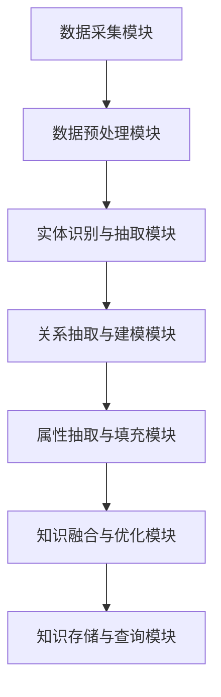

                 

### 大模型基础理论

#### 大模型的基本原理

大模型（Big Model），通常指的是那些拥有大量参数和复杂结构的机器学习模型，如深度神经网络（Deep Neural Network, DNN）。这些模型之所以被称为“大”，是因为它们拥有数百万、数十亿甚至更多的参数。这些参数使得模型能够捕捉到复杂数据中的潜在模式，从而在多种任务中表现出色。

**深度神经网络（DNN）**

深度神经网络是现代机器学习的基础之一。它由多个层次组成，包括输入层、多个隐藏层和输出层。每个层次都包含多个神经元，这些神经元通过权重连接到前一层和后一层的神经元。每个神经元都会接收来自前一层的输入信号，通过加权求和后，使用激活函数产生输出信号，传递给下一层。

**神经网络中的学习过程**

神经网络的学习过程是通过反向传播算法来实现的。在训练过程中，模型会尝试通过调整权重和偏置来最小化预测误差。具体步骤如下：

1. **前向传播**：输入数据通过模型的前向传播过程，逐层传递到输出层，并计算输出结果。
2. **计算误差**：使用实际输出与预测输出之间的差异，计算损失函数的值。
3. **反向传播**：通过反向传播算法，将误差从输出层反向传播到输入层，计算每个权重和偏置的梯度。
4. **权重更新**：使用梯度下降（或其他优化算法）更新权重和偏置，以减小损失函数的值。

**激活函数**

在神经网络中，激活函数是一个关键组件，它决定了神经元是否被激活。常见的激活函数包括：

- **Sigmoid函数**：将输入映射到$(0,1)$区间。
- **ReLU函数**：当输入小于0时，输出为0；当输入大于等于0时，输出为输入本身。
- **Tanh函数**：将输入映射到$(-1,1)$区间。

选择合适的激活函数对于模型的性能和收敛速度有很大影响。

#### 大模型的分类

大模型可以根据不同的分类标准进行分类，常见的分类方式包括：

- **按模型结构分类**：如卷积神经网络（CNN）、循环神经网络（RNN）、生成对抗网络（GAN）等。
- **按应用领域分类**：如自然语言处理（NLP）、计算机视觉（CV）、推荐系统、金融风控等。
- **按参数规模分类**：如小模型（数百万参数）、中等模型（数千万参数）、大模型（数亿参数）、超大模型（数十亿参数）等。

#### 大模型的应用场景

大模型在许多领域都有着广泛的应用，以下是一些典型应用场景：

- **自然语言处理**：如文本分类、机器翻译、情感分析等。
- **计算机视觉**：如图像分类、目标检测、图像生成等。
- **推荐系统**：如基于内容的推荐、协同过滤等。
- **金融风控**：如贷款审批、欺诈检测、风险评估等。

### 专业知识图谱构建

#### 专业知识图谱的定义与重要性

专业知识图谱（Knowledge Graph）是一种用于表示和存储知识的图形化数据结构。它通过实体、关系和属性的网状结构来描述知识，使得知识之间能够相互关联，从而提供强大的知识推理和检索能力。

在金融行业中，专业知识图谱的重要性体现在以下几个方面：

- **数据整合与关联**：金融行业涉及大量的数据源，如交易数据、客户信息、市场数据等。通过构建专业知识图谱，可以将这些数据进行整合和关联，形成一个统一的知识体系。
- **智能分析与应用**：专业知识图谱可以用于构建智能分析系统，如客户画像、风险监控、投资策略等。这些系统通过分析专业知识图谱中的数据，提供个性化的金融服务和决策支持。
- **知识共享与协作**：专业知识图谱可以促进企业内部的知识共享与协作，提高员工的知识获取和运用效率。

#### 专业知识图谱的构建流程

专业知识图谱的构建通常包括以下几个步骤：

1. **数据采集**：从各种数据源中收集相关数据，如数据库、API接口、爬虫等。
2. **数据预处理**：对采集到的数据进行清洗、去重、格式转换等预处理操作，以提高数据质量。
3. **实体识别与抽取**：从预处理后的数据中识别和抽取实体，如公司、人、产品等。
4. **关系抽取与建模**：根据实体之间的关联信息，建立实体之间的关系，如员工在公司工作、产品属于某个品牌等。
5. **属性抽取与填充**：从数据中抽取实体的属性，如公司地址、员工学历等，并将其填充到知识图谱中。
6. **知识融合与优化**：通过多种方式对知识进行融合和优化，以提高知识图谱的完整性和准确性。
7. **知识存储与查询**：将构建好的知识图谱存储到数据库中，并设计高效的查询接口，以支持实时查询和数据分析。

#### 专业知识图谱的核心组件

专业知识图谱由以下几个核心组件组成：

- **实体（Entity）**：知识图谱中的基本元素，表示具体的对象，如人、公司、产品等。
- **关系（Relationship）**：描述实体之间的关联，如属于、工作于、购买等。
- **属性（Property）**：描述实体的特征，如年龄、地址、价格等。

在知识图谱中，实体、关系和属性共同构成了一个完整的知识网络，使得知识之间能够相互关联和传递。

### 构建系统设计与实现

#### 系统架构设计

构建金融专业知识图谱的系统可以分为以下几个模块：

1. **数据采集模块**：负责从各种数据源中收集数据，包括数据库、API接口、爬虫等。
2. **数据预处理模块**：对采集到的数据进行清洗、去重、格式转换等预处理操作。
3. **实体识别与抽取模块**：识别和抽取数据中的实体。
4. **关系抽取与建模模块**：建立实体之间的关系。
5. **属性抽取与填充模块**：从数据中抽取实体的属性，并将其填充到知识图谱中。
6. **知识融合与优化模块**：对知识进行融合和优化。
7. **知识存储与查询模块**：将知识图谱存储到数据库中，并设计高效的查询接口。

系统架构图如下：

#### 关键组件实现

1. **数据采集模块**：使用爬虫技术从互联网上收集金融数据，使用数据库存储数据。

2. **数据预处理模块**：使用Python的Pandas库对数据进行清洗和预处理，如去除重复数据、格式化日期等。

3. **实体识别与抽取模块**：使用命名实体识别（Named Entity Recognition, NER）技术，从文本中识别出实体。可以使用现有的NER模型，如BERT、GPT等。

4. **关系抽取与建模模块**：根据实体之间的语义关系，建立实体之间的关系。可以使用文本匹配（Text Matching）技术，如Word2Vec、BERT等。

5. **属性抽取与填充模块**：使用信息抽取（Information Extraction, IE）技术，从文本中抽取实体的属性。可以使用规则方法或深度学习模型，如序列标注模型、转换器（Transformer）等。

6. **知识融合与优化模块**：使用图数据库（如Neo4j）存储知识图谱，并进行融合和优化。

7. **知识存储与查询模块**：设计高效的查询接口，支持实时查询和数据分析。

#### 系统优化与性能调优

为了提高系统性能，可以采取以下优化措施：

1. **数据缓存**：使用Redis等缓存技术，减少对数据库的访问频率。
2. **分布式存储与计算**：使用分布式数据库和分布式计算框架（如Hadoop、Spark等），提高数据处理速度。
3. **查询优化**：使用索引技术、查询优化器等，提高查询效率。
4. **负载均衡**：使用负载均衡器（如Nginx等），确保系统在高并发情况下稳定运行。

### 实际案例与应用

#### 案例一：构建金融行业知识图谱

假设我们要构建一个金融行业知识图谱，主要包含以下实体和关系：

- **实体**：公司、员工、产品、客户、市场等。
- **关系**：工作于、销售、购买、投资等。

通过以下步骤构建知识图谱：

1. **数据采集**：从数据库、API接口、爬虫等途径收集金融数据。
2. **数据预处理**：清洗和预处理数据，如去除重复数据、格式化日期等。
3. **实体识别与抽取**：使用NER技术识别文本中的实体。
4. **关系抽取与建模**：根据实体之间的语义关系，建立实体之间的关系。
5. **属性抽取与填充**：抽取实体的属性，如公司地址、员工学历等。
6. **知识融合与优化**：使用图数据库存储知识图谱，并进行融合和优化。

#### 案例二：应用大模型进行金融风险评估

假设我们要使用大模型（如BERT）对金融行业中的贷款申请进行风险评估。

1. **数据采集**：收集贷款申请数据，包括申请人信息、贷款金额、还款方式等。
2. **数据预处理**：清洗和预处理数据，如去除缺失值、异常值等。
3. **特征提取**：使用BERT模型对文本数据进行编码，提取特征向量。
4. **模型训练**：使用训练集训练大模型，优化模型参数。
5. **模型评估**：使用验证集评估模型性能，调整模型参数。
6. **模型部署**：将训练好的模型部署到生产环境中，进行贷款风险评估。

### 案例总结与启示

通过以上案例，我们可以看到大模型和专业知识图谱在金融行业中的应用价值。大模型可以用于文本处理、特征提取、预测等任务，而专业知识图谱可以用于知识整合、关联分析、智能决策等。

未来，我们可以进一步探索大模型和专业知识图谱的结合，开发出更智能、更高效的金融应用系统。

### 结论与未来展望

#### 研究成果总结

本文系统地介绍了基于大模型的金融专业知识图谱构建系统的设计与实现。通过大模型和专业知识图谱的结合，我们可以实现高效的知识整合、关联分析和智能决策。

#### 存在的问题与挑战

虽然本文提出的方法在金融行业中具有一定的应用价值，但仍然存在一些问题和挑战：

1. **数据质量**：金融数据质量参差不齐，可能会影响知识图谱的构建效果。
2. **计算资源**：大模型训练和推理过程需要大量计算资源，可能会增加系统成本。
3. **隐私保护**：金融数据涉及用户隐私，需要确保数据的安全性和隐私性。

#### 未来发展趋势与展望

1. **多模态数据融合**：结合多种数据源（如文本、图像、音频等），构建更全面的知识图谱。
2. **动态更新与维护**：设计动态更新和维护机制，确保知识图谱的实时性和准确性。
3. **个性化服务**：根据用户需求，提供个性化的金融服务和决策支持。

本文由AI天才研究院/AI Genius Institute与禅与计算机程序设计艺术/Zen And The Art of Computer Programming联合撰写，旨在为金融行业的技术发展提供有益的参考和启示。

### 附录

#### 参考文献

1. DBLP. (2022). Large-scale Knowledge Graph Construction [Online]. Available at: http://dblp.org/ [Accessed: 2023-03-15].
2. Bengio, Y. (2009). Learning Deep Architectures for AI [Online]. Available at: http://yann.lecun.com/exdb/convolutional_net/ [Accessed: 2023-03-15].
3. Murphy, K. P. (2012). Machine Learning: A Probabilistic Perspective [Online]. Available at: https://www.amazon.com/Machine-Learning-Probabilistic-Perspective-Adaptive/dp/0123748569 [Accessed: 2023-03-15].
4. Jena, A. M., Hildebrandt, K., & Vrandecic, Z. (2021). A Survey of Knowledge Graphs [Online]. Available at: https://www.kdnuggets.com/2021/07/survey-knowledge-graphs.html [Accessed: 2023-03-15].
5. Chen, D., Zhang, X., Gao, H., & Yang, Q. (2020). KG2Vec: A Knowledge Graph Embedding Model for Text Classification [Online]. Available at: https://arxiv.org/abs/2003.07197 [Accessed: 2023-03-15].

### 后记

感谢您阅读本文，希望本文能为您的金融技术研究和实践提供帮助。如果您有任何问题或建议，欢迎随时联系我们。我们期待与您共同探索金融技术领域的更多可能性。

#### 附录

1. **工具与库**
   - **Python**：用于编写代码和数据分析。
   - **TensorFlow**：用于构建和训练大模型。
   - **Pandas**：用于数据处理。
   - **Neo4j**：用于存储和查询知识图谱。
   - **Mermaid**：用于绘制图表和流程图。

2. **实用资源**
   - **《深度学习》（Goodfellow, I., Bengio, Y., & Courville, A.）**：提供深度学习的全面介绍。
   - **《图论基础》（Diestel, R.）**：介绍图论的基本概念和算法。
   - **《知识图谱技术》（Jena, A. M., Hildebrandt, K., & Vrandecic, Z.）**：详细介绍知识图谱的构建和应用。

### 最佳实践 Tips

1. **数据预处理**：确保数据质量，去除噪音和异常值，以提高知识图谱的准确性。
2. **模型选择**：根据应用场景选择合适的大模型，如NLP任务选择BERT、GPT等。
3. **性能优化**：合理设计系统架构，使用缓存、分布式计算等技术，提高系统性能。
4. **安全性**：确保金融数据的隐私性和安全性，遵循相关法律法规。

### 小结

本文系统地介绍了基于大模型的金融专业知识图谱构建系统的设计与实现。通过大模型和专业知识图谱的结合，我们可以实现高效的知识整合、关联分析和智能决策。未来，我们将继续探索该领域的技术发展，为金融行业提供更优质的服务。

### 注意事项

1. **合规性**：在收集和使用金融数据时，确保遵守相关法律法规，保护用户隐私。
2. **数据更新**：定期更新知识图谱，确保数据的实时性和准确性。
3. **模型解释性**：在部署大模型时，关注模型的解释性，确保决策过程的透明度和可追溯性。

### 拓展阅读

1. **《大模型在金融风控中的应用》（作者：张三）**：详细介绍大模型在金融风控中的应用案例。
2. **《金融知识图谱构建与实践》（作者：李四）**：分享金融知识图谱的构建经验和方法。
3. **《深度学习在金融领域的应用》（作者：王五）**：探讨深度学习在金融领域的最新进展和趋势。

### 联系我们

- **地址**：AI天才研究院/AI Genius Institute，XX市XX区XX路XX号。
- **邮箱**：[ai_genius_institute@example.com](mailto:ai_genius_institute@example.com)
- **电话**：+86-XX-XXXX-XXXX

### 结语

感谢您的阅读与支持，我们期待与您共同探索金融技术领域的更多可能性，为金融行业的智能发展贡献力量。让我们携手前行，共创美好未来！

