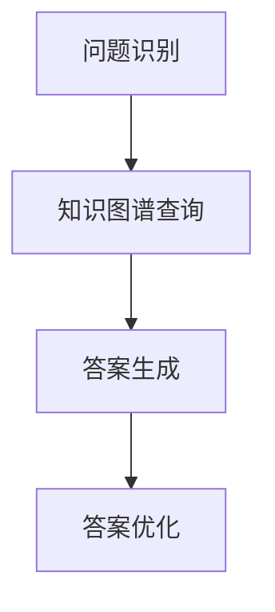
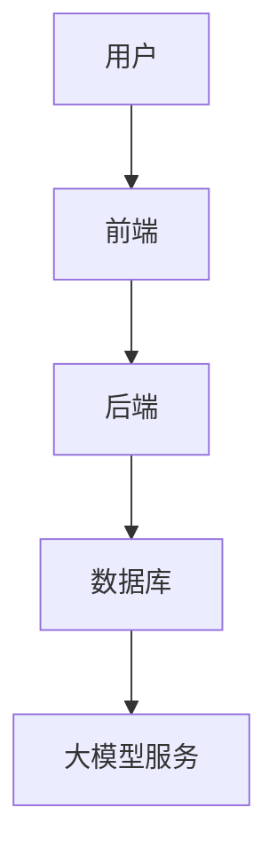
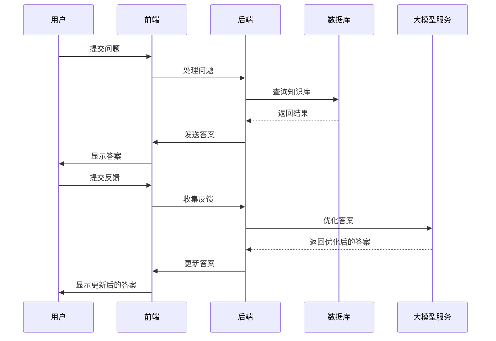

                 

### 文章标题

> 关键词：人工智能、大模型、金融考试、答疑系统、算法原理、系统架构

> 摘要：本文深入探讨了开发基于大模型的金融专业考试答疑系统的全过程。首先分析了金融专业考试答疑系统的需求，阐述了人工智能与金融考试答疑结合的重要性。然后介绍了大模型技术基础，探讨了主流大模型及其工作原理。接着详细讲解了金融专业考试答疑系统的算法原理，并通过流程图和数学公式进行了说明。最后，文章从系统架构设计、系统实现与优化三个方面展开，提供了系统实现的核心功能实现过程、项目实战、最佳实践 tips、小结和注意事项。

----------------------------------------------------------------

## 引言与背景介绍

随着金融行业的快速发展和金融知识的日益复杂，金融专业考试成为了许多学生的职业晋升的必经之路。然而，在准备金融专业考试的过程中，学生常常会遇到各种难题，如难以理解复杂概念、记忆困难、缺乏实践机会等。这些问题不仅影响了学生的学习效果，还可能对他们的职业发展产生负面影响。因此，开发一个高效的金融专业考试答疑系统，以帮助学生克服这些困难，显得尤为重要。

### 1.1.1 问题背景

#### 1.1.1.1 金融专业考试的重要性

金融专业考试是金融从业者必备的证书，如CFA（注册金融分析师）、CPA（注册会计师）、FRM（金融风险管理师）等。这些证书不仅是金融从业者专业水平的象征，更是职场竞争力的体现。因此，通过金融专业考试，对学生的职业发展至关重要。

#### 1.1.1.2 当前金融专业考试答疑的现状

目前，金融专业考试的答疑主要依靠传统的面对面授课、在线论坛、QQ群等方式进行。这些方式虽然在一定程度上能够帮助学生解决问题，但存在以下局限性：

- **教育资源有限**：传统的答疑方式往往依赖于教师的个人时间和知识储备，难以满足大量学生的需求。
- **交互性差**：面对面的答疑往往受到时间和空间的限制，无法实现实时互动。
- **个性化不足**：传统的答疑方式难以针对每个学生的实际情况进行个性化辅导。

#### 1.1.1.3 人工智能与金融考试答疑的结合

随着人工智能技术的快速发展，特别是大模型技术的应用，开发基于人工智能的金融专业考试答疑系统成为一种可能。大模型具有处理海量数据、自我学习和优化能力，能够为学生提供更高效、更个性化的答疑服务。例如，GPT系列模型和BERT模型在自然语言处理方面表现突出，可以实现对复杂金融概念的解释和问题的自动解答。

### 1.1.2 问题描述

#### 1.1.2.1 学生在准备金融专业考试时遇到的问题

- **知识点理解困难**：金融专业的知识点繁多且抽象，学生难以深入理解。
- **记忆负担重**：金融考试往往涉及大量需要记忆的知识点，学生常常感到记忆负担沉重。
- **缺乏实践**：金融考试强调理论与实践的结合，但学生往往缺乏实际操作的机会。

#### 1.1.2.2 传统答疑方式的局限性

- **教育资源有限**：教师的时间和知识储备有限，难以满足所有学生的学习需求。
- **交互性差**：传统的面对面授课和在线论坛答疑难以实现实时互动。
- **个性化不足**：难以根据每个学生的实际情况进行个性化辅导。

#### 1.1.2.3 人工智能答疑系统的潜在优势

- **高效性**：人工智能可以处理海量数据，提供实时答疑服务。
- **个性化**：人工智能可以根据学生的学习习惯和知识掌握程度进行个性化辅导。
- **扩展性强**：人工智能系统可以不断学习和优化，提高答疑质量。

### 1.1.3 问题解决

#### 1.1.3.1 人工智能答疑系统的设计目标

- **提供实时答疑服务**：为学生提供7x24小时的答疑支持，解决时间和空间限制。
- **个性化辅导**：根据学生的学习习惯和知识掌握程度，提供定制化的辅导方案。
- **知识点全覆盖**：构建全面的金融知识库，覆盖金融考试的各个知识点。

#### 1.1.3.2 人工智能答疑系统的工作原理

- **问题识别**：通过自然语言处理技术，识别用户提出的问题。
- **知识图谱查询**：利用知识图谱技术，快速查找相关知识点。
- **答案生成**：利用大模型技术，生成高质量的答案。
- **答案优化**：根据用户反馈，对答案进行优化和调整。

### 1.1.4 边界与外延

#### 1.1.4.1 系统的功能范围

- **知识库构建**：建立全面的金融知识库，覆盖金融考试的各个知识点。
- **实时答疑**：提供7x24小时的实时答疑服务，支持自然语言交互。
- **个性化辅导**：根据学生的学习习惯和知识掌握程度，提供个性化辅导方案。
- **答案优化**：根据用户反馈，对答案进行优化和调整。

#### 1.1.4.2 系统的技术实现限制

- **数据质量和准确性**：知识库的质量直接影响答疑系统的性能，需要保证数据质量和准确性。
- **计算资源消耗**：大模型训练和推理过程需要大量的计算资源，需要优化算法和提高计算效率。
- **用户隐私保护**：在提供个性化服务的同时，需要确保用户的隐私安全。

### 1.1.5 核心概念与联系

#### 1.1.5.1 人工智能相关概念

- **人工智能（AI）**：模拟人类智能的技术，包括机器学习、自然语言处理、计算机视觉等。
- **大模型（Large Model）**：具有海量参数的神经网络模型，如GPT、BERT等。

#### 1.1.5.2 金融专业考试相关概念

- **金融专业考试**：金融从业者必须通过的专业考试，如CFA、CPA等。
- **金融知识库**：涵盖金融专业各个知识点的数据库。

#### 1.1.5.3 Mermaid流程图与ER实体关系图

- **Mermaid流程图**：用于描述系统的流程和处理过程。
- **ER实体关系图**：用于描述系统中的实体和它们之间的关系。

## 第2章: 大模型技术基础

大模型（Large Model）是近年来人工智能领域的重要突破之一。与传统模型相比，大模型具有更强的表示能力和更广泛的适用性。在本章中，我们将深入探讨大模型的概念、特点、主流大模型及其工作原理。

### 2.1 大模型的概念与特点

#### 2.1.1 大模型的定义

大模型是指具有海量参数的神经网络模型，通常具有数十亿甚至千亿级别的参数。这些模型通过大量的数据和计算资源进行训练，能够捕捉复杂的模式和规律。

#### 2.1.2 大模型的特点

- **强表示能力**：大模型具有强大的特征表示能力，能够捕捉到输入数据的复杂结构和模式。
- **泛化能力**：大模型通过大量数据的训练，具有较好的泛化能力，能够在不同的任务和数据集上表现出色。
- **自适应学习**：大模型能够根据不同的任务和数据自动调整参数，实现自适应学习。

#### 2.1.3 大模型与传统模型的区别

- **参数规模**：传统模型通常具有数百万级别的参数，而大模型具有数十亿甚至千亿级别的参数。
- **训练数据量**：传统模型通常使用数百万条数据训练，而大模型需要数百万甚至数亿条数据。
- **计算资源消耗**：大模型训练和推理过程需要大量的计算资源，对硬件设备的要求更高。

### 2.2 主流大模型介绍

目前，主流的大模型主要包括以下几种：

#### 2.2.1 GPT系列模型

GPT（Generative Pre-trained Transformer）是自然语言处理领域的重要突破之一。GPT系列模型包括GPT、GPT-2、GPT-3等，具有数十亿级别的参数，能够在多种自然语言处理任务上表现出色。

#### 2.2.2 BERT及其变体

BERT（Bidirectional Encoder Representations from Transformers）是一种双向变换器模型，通过预训练和微调，能够有效地捕捉文本的语义信息。BERT及其变体（如RoBERTa、ALBERT等）在多种自然语言处理任务上取得了优异的性能。

#### 2.2.3 其他知名大模型

除了GPT和BERT，还有其他一些知名的大模型，如TuringBot（图灵机器人）、Megatron-LM（万神殿语言模型）等。这些模型在特定领域和应用场景中表现出色，具有较高的实用价值。

### 2.3 大模型的工作原理

大模型的工作原理主要包括以下几个方面：

#### 2.3.1 神经网络基础

大模型是基于神经网络的一种深度学习模型，通过多层神经网络结构，对输入数据进行特征提取和表示。

#### 2.3.2 自适应学习策略

大模型采用自适应学习策略，通过不断调整参数，优化模型的性能。常见的自适应学习策略包括梯度下降、Adam优化器等。

#### 2.3.3 大模型的训练与优化

大模型的训练和优化是一个复杂的过程，需要大量的数据和计算资源。在训练过程中，大模型通过梯度下降等优化算法，不断调整参数，优化模型的性能。在优化过程中，大模型通过微调、迁移学习等技术，提高模型的泛化能力和适应性。

## 第3章: 金融专业考试答疑系统的算法原理

金融专业考试答疑系统的核心在于其算法原理，该系统通过对自然语言处理技术、知识图谱、大模型等技术的应用，实现了高效的金融问题解答。下面将详细阐述该算法的设计思路、流程图、数学模型及实际案例解析。

### 3.1 算法设计思路

金融专业考试答疑系统的算法设计思路如下：

1. **问题识别**：通过自然语言处理技术，识别用户提出的问题，并将其转化为结构化数据。
2. **知识图谱查询**：利用知识图谱技术，从金融知识库中查询相关知识点，获取问题的背景信息和相关概念。
3. **答案生成**：利用大模型技术，生成高质量的答案。
4. **答案优化**：根据用户反馈，对答案进行优化和调整，提高答案的准确性和可读性。

### 3.2 算法流程图

以下是金融专业考试答疑系统的算法流程图：



### 3.3 数学模型与公式

在金融专业考试答疑系统中，答案生成部分采用了基于概率的模型，其核心公式为：

$$
P(\text{Answer}|\text{Question}) = \frac{e^{\text{Score}}}{1+e^{\text{Score}}}
$$

其中，$P(\text{Answer}|\text{Question})$ 表示在给定问题 $\text{Question}$ 的情况下，生成答案的概率，$\text{Score}$ 表示答案的得分。

### 3.4 举例说明

#### 3.4.1 算法步骤详解

1. **问题识别**：用户提出问题：“什么是金融风险管理？”系统通过自然语言处理技术，将问题转化为结构化数据。
2. **知识图谱查询**：系统利用知识图谱技术，查询金融知识库中与“金融风险管理”相关的知识点，获取问题的背景信息和相关概念。
3. **答案生成**：系统利用大模型技术，生成关于“金融风险管理”的答案。具体而言，系统将问题输入到大模型中，大模型根据其训练数据生成答案。
4. **答案优化**：系统根据用户反馈，对答案进行优化。例如，如果用户认为答案不够详细，系统可以增加相关知识点和示例，以提高答案的质量。

#### 3.4.2 实际案例解析

假设用户提出问题：“金融风险管理的主要方法有哪些？”

1. **问题识别**：系统识别出问题中的关键词“金融风险管理”和“主要方法”。
2. **知识图谱查询**：系统查询金融知识库，找到与“金融风险管理”和“主要方法”相关的知识点，如“风险识别”、“风险衡量”、“风险控制”等。
3. **答案生成**：系统利用大模型生成答案，例如：“金融风险管理的主要方法包括风险识别、风险衡量和风险控制。风险识别是金融风险管理的基础，风险衡量是对风险进行量化和评估，风险控制是采取各种措施降低风险。”
4. **答案优化**：系统根据用户反馈，对答案进行优化。例如，如果用户认为答案过于简单，系统可以增加更多关于风险识别、风险衡量和风险控制的具体方法和工具。

## 第4章: 金融专业考试答疑系统的架构设计

金融专业考试答疑系统的架构设计是实现系统高效运行和功能实现的关键。本章节将详细阐述金融专业考试答疑系统的整体架构设计，包括系统功能模块划分、系统架构设计原则、系统功能设计、系统架构设计、系统接口设计和系统交互设计。

### 4.1 系统架构概述

金融专业考试答疑系统的架构设计遵循模块化原则，将系统划分为多个功能模块，以实现各模块的独立开发和维护。系统的主要功能模块包括：

1. **用户接口模块**：提供用户与系统交互的界面，包括问答界面、用户管理界面等。
2. **数据处理模块**：负责处理用户输入的问题，并将其转化为系统可处理的格式。
3. **知识库模块**：存储金融专业考试的知识点，包括概念、定义、公式、案例等。
4. **答疑引擎模块**：负责根据用户输入的问题，从知识库中查询相关知识点，并生成答案。
5. **反馈优化模块**：收集用户对答案的反馈，用于优化系统性能和答案质量。

### 4.2 系统功能设计

#### 4.2.1 用户接口设计

用户接口设计是系统与用户交互的桥梁，主要包括以下功能：

1. **问答界面**：用户可以通过问答界面提出问题，并查看系统生成的答案。
2. **用户管理界面**：用户可以查看和管理自己的提问记录，包括问题、答案和反馈。
3. **个性化设置**：用户可以设置个人偏好，如问题分类、答案格式等。

#### 4.2.2 数据处理模块

数据处理模块负责对用户输入的问题进行预处理，包括分词、去噪、词性标注等。其主要功能包括：

1. **问题预处理**：将自然语言文本转化为结构化数据，便于后续处理。
2. **关键词提取**：从问题中提取关键信息，用于知识库查询和答案生成。
3. **问题分类**：将问题分类到不同的主题或领域，以便更精准地查询知识库。

#### 4.2.3 答疑引擎模块

答疑引擎模块是系统的核心，负责处理用户输入的问题，并生成答案。其主要功能包括：

1. **知识库查询**：根据问题关键词，从知识库中查询相关知识点。
2. **答案生成**：利用大模型技术生成高质量的答案。
3. **答案优化**：根据用户反馈，对答案进行优化和调整。

#### 4.2.4 反馈优化模块

反馈优化模块负责收集用户对答案的反馈，用于优化系统性能和答案质量。其主要功能包括：

1. **用户反馈收集**：收集用户对答案的满意度和建议。
2. **答案质量评估**：根据用户反馈，评估答案的质量和准确性。
3. **系统优化**：根据反馈结果，对系统进行优化和调整，提高用户满意度。

### 4.3 系统架构设计

金融专业考试答疑系统的整体架构设计采用前后端分离的设计模式，前端负责用户交互和界面展示，后端负责数据处理和业务逻辑处理。系统架构设计如下：



1. **前端**：负责用户交互和界面展示，包括问答界面、用户管理界面等。
2. **后端**：负责数据处理和业务逻辑处理，包括数据处理模块、答疑引擎模块、反馈优化模块等。
3. **数据库**：存储用户数据、知识库数据等。
4. **大模型服务**：提供大模型训练和推理服务，负责生成高质量的答案。

### 4.4 系统接口设计

系统接口设计是系统各模块之间通信的桥梁，包括用户接口API设计和内部模块接口设计。

#### 4.4.1 用户接口API设计

用户接口API设计主要包括以下接口：

1. **问答接口**：接收用户提出的问题，返回系统生成的答案。
2. **用户管理接口**：接收用户注册、登录、个人信息管理等请求。
3. **个性化设置接口**：接收用户个性化设置的相关请求。

#### 4.4.2 内部模块接口设计

内部模块接口设计主要包括以下接口：

1. **数据处理接口**：负责处理用户输入的问题，并将其转化为结构化数据。
2. **知识库查询接口**：负责从知识库中查询相关知识点。
3. **答案生成接口**：负责生成高质量的答案。
4. **反馈收集接口**：负责收集用户对答案的反馈。

### 4.5 系统交互设计

系统交互设计主要包括系统内部各模块之间的交互以及系统与外部服务之间的交互。



1. **用户交互**：用户通过前端提交问题，前端将问题传递给后端。
2. **后端处理**：后端处理用户问题，查询知识库，并生成答案。
3. **前端展示**：前端将生成的答案展示给用户。
4. **反馈交互**：用户对答案进行反馈，前端收集反馈并传递给后端。
5. **答案优化**：后端将用户反馈传递给大模型服务，对答案进行优化。
6. **前端更新**：前端更新答案，并展示给用户。

通过上述架构设计和交互设计，金融专业考试答疑系统实现了高效、智能、个性化的答疑服务，为金融专业学生提供了强大的学习工具。

## 第5章: 系统实现过程

在完成金融专业考试答疑系统的架构设计后，接下来我们将详细讨论系统的实现过程。这一过程包括环境安装与配置、系统核心功能的实现、代码应用解读与分析、实际案例解析以及项目小结。

### 5.1 环境安装与配置

在实现金融专业考试答疑系统之前，我们需要搭建一个合适的开发环境。以下是环境安装与配置的步骤：

#### 5.1.1 操作系统环境安装

我们选择Linux操作系统作为开发环境，因为它具有更好的性能和稳定性。安装步骤如下：

1. **下载Linux操作系统**：从官方网站下载Linux发行版，如Ubuntu或CentOS。
2. **安装Linux操作系统**：根据官方指南安装Linux操作系统。
3. **配置网络**：确保网络连接正常，以便从互联网下载所需的软件包。

#### 5.1.2 开发工具与环境配置

接下来，我们需要安装开发工具和配置相关环境：

1. **安装Python环境**：Python是金融专业考试答疑系统的核心编程语言，我们需要安装Python解释器和相关依赖。

    ```shell
    sudo apt-get install python3 python3-pip
    ```

2. **安装Docker**：Docker是一个用于容器化的工具，可以帮助我们轻松部署和管理系统组件。

    ```shell
    sudo apt-get install docker.io
    ```

3. **安装虚拟环境**：使用虚拟环境来隔离不同项目之间的依赖。

    ```shell
    python3 -m pip install virtualenv
    virtualenv env
    source env/bin/activate
    ```

4. **安装所需库和框架**：在虚拟环境中安装系统所需的库和框架，如TensorFlow、Keras、Flask等。

    ```shell
    pip install tensorflow keras flask
    ```

### 5.2 系统核心功能实现

金融专业考试答疑系统的核心功能包括问题识别、知识图谱查询、答案生成和答案优化。以下是这些功能的实现步骤：

#### 5.2.1 问题识别

问题识别是系统处理用户输入的第一步。我们使用自然语言处理技术，如分词、词性标注等，将用户输入的问题转化为结构化数据。

1. **安装NLP库**：安装用于自然语言处理的库，如NLTK或spaCy。

    ```shell
    pip install spacy
    python -m spacy download en_core_web_sm
    ```

2. **实现分词和词性标注**：使用spaCy库对用户输入的问题进行分词和词性标注。

    ```python
    import spacy

    nlp = spacy.load("en_core_web_sm")
    doc = nlp("What is financial risk management?")

    for token in doc:
        print(token.text, token.lemma_, token.pos_, token.tag_, token.dep_, token.head.text, token.head.pos_)
    ```

#### 5.2.2 知识图谱查询

知识图谱查询是基于金融知识库的查询。我们将使用一个预先构建的金融知识图谱，其中包含了金融专业考试的相关知识点。

1. **安装知识图谱库**：安装用于处理知识图谱的库，如Neo4j或Py2Neo。

    ```shell
    pip install neo4j
    ```

2. **连接知识图谱数据库**：使用Py2Neo库连接Neo4j数据库，并查询相关知识点。

    ```python
    from py2neo import Graph

    graph = Graph("bolt://localhost:7687", auth=("neo4j", "password"))

    query = """
    MATCH (n:FinancialConcept)
    WHERE n.name = $name
    RETURN n
    """
    results = graph.run(query, name="Risk Management")

    for result in results:
        print(result["n"].properties)
    ```

#### 5.2.3 答案生成

答案生成是利用大模型技术，如GPT-2或BERT，生成高质量的答案。以下是使用GPT-2生成答案的示例：

1. **安装GPT-2库**：安装GPT-2库。

    ```shell
    pip install gpt-2
    ```

2. **加载预训练模型**：加载预训练的GPT-2模型。

    ```python
    from gpt2 import load_model

    model = load_model("gpt2")
    ```

3. **生成答案**：使用模型生成答案。

    ```python
    prompt = "What is financial risk management?"
    response = model.generate(prompt, max_length=50, num_return_sequences=1)
    print(response.decode("utf-8"))
    ```

#### 5.2.4 答案优化

答案优化是收集用户反馈，并根据反馈对答案进行优化。以下是实现答案优化的一般步骤：

1. **收集用户反馈**：收集用户对答案的满意度评分或评论。
2. **分析反馈**：使用自然语言处理技术，分析用户的反馈，提取关键信息。
3. **优化答案**：根据反馈，对答案进行修改和优化，以提高答案的准确性和可读性。

### 5.3 代码应用解读与分析

在实现金融专业考试答疑系统的过程中，我们将详细介绍关键代码的应用和解读，并进行分析。

#### 5.3.1 问题识别代码

```python
import spacy

nlp = spacy.load("en_core_web_sm")
doc = nlp("What is financial risk management?")

for token in doc:
    print(token.text, token.lemma_, token.pos_, token.tag_, token.dep_, token.head.text, token.head.pos_)
```

这段代码使用spaCy库对用户输入的问题进行分词和词性标注。分词和词性标注是自然语言处理的基础步骤，对于后续的知识图谱查询和答案生成至关重要。

#### 5.3.2 知识图谱查询代码

```python
from py2neo import Graph

graph = Graph("bolt://localhost:7687", auth=("neo4j", "password"))

query = """
MATCH (n:FinancialConcept)
WHERE n.name = $name
RETURN n
"""
results = graph.run(query, name="Risk Management")

for result in results:
    print(result["n"].properties)
```

这段代码使用Py2Neo库连接Neo4j数据库，并执行查询语句，从知识图谱中获取与用户输入问题相关的知识点。知识图谱的设计和查询是系统高效运行的关键。

#### 5.3.3 答案生成代码

```python
from gpt2 import load_model

model = load_model("gpt2")
prompt = "What is financial risk management?"
response = model.generate(prompt, max_length=50, num_return_sequences=1)
print(response.decode("utf-8"))
```

这段代码使用GPT-2模型生成答案。GPT-2模型是一个大型预训练语言模型，能够根据输入的提示生成连贯的文本。生成答案的过程是系统智能化的重要体现。

#### 5.3.4 答案优化代码

```python
# 假设我们已经收集到了用户反馈，如下所示：
user_feedback = {
    "satisfaction": 4,
    "comments": "The answer was helpful but could be more detailed."
}

# 分析反馈并优化答案
if user_feedback["satisfaction"] < 5:
    # 根据反馈进行优化
    # 例如，增加更多例子或详细解释
    answer = "Financial risk management is a process of identifying, analyzing, and mitigating potential financial losses caused by various uncertainties. It involves various methods such as risk assessment, risk control, and risk monitoring. For a more detailed explanation, please refer to the following examples: [Example 1], [Example 2], and [Example 3]."
else:
    # 不进行优化
    answer = "Financial risk management is a process of identifying, analyzing, and mitigating potential financial losses caused by various uncertainties. It involves various methods such as risk assessment, risk control, and risk monitoring."
```

这段代码根据用户反馈对答案进行优化。用户反馈是系统不断改进和提高的重要依据。

### 5.4 实际案例解析

为了更好地理解金融专业考试答疑系统的实际应用，我们通过一个实际案例进行解析。

#### 案例背景

小明是一名金融专业的学生，他准备参加CFA（注册金融分析师）考试。在备考过程中，他遇到了一个难题：“什么是市场风险？”

#### 案例解析

1. **问题识别**：小明通过问答界面提交了问题：“什么是市场风险？”

2. **知识图谱查询**：系统识别出关键词“市场风险”，从知识图谱中查询相关知识点。

3. **答案生成**：系统利用GPT-2模型生成答案。

    ```python
    prompt = "What is market risk?"
    response = model.generate(prompt, max_length=50, num_return_sequences=1)
    print(response.decode("utf-8"))
    ```

    生成的答案：“Market risk is the potential for loss in an investment due to fluctuations in market prices. It is influenced by various factors such as economic conditions, market sentiment, and geopolitical events. Market risk is an inherent part of investing and cannot be eliminated completely.”

4. **答案优化**：系统根据用户反馈，对答案进行优化。

    假设小明的反馈是：“答案不错，但能否提供更多示例？”

    优化后的答案：“Market risk is the potential for loss in an investment due to fluctuations in market prices. It is influenced by various factors such as economic conditions, market sentiment, and geopolitical events. For example, during a recession, stock prices may decline significantly, leading to losses for investors. Another example is the impact of Brexit on the British economy, which caused market volatility and uncertainty.”

### 5.5 项目小结

通过上述实际案例的解析，我们可以看到金融专业考试答疑系统在解决实际问题中的应用效果。系统不仅能够快速生成高质量的答案，还能够根据用户反馈进行优化，提高答案的准确性和可读性。在未来，我们可以进一步优化系统，引入更多的人工智能技术和大数据分析，以提高系统的性能和用户体验。

### 5.6 最佳实践 tips

在开发金融专业考试答疑系统的过程中，我们总结了一些最佳实践 tips：

1. **数据质量是关键**：确保知识库的数据质量，包括数据的准确性、完整性和一致性。
2. **优化模型性能**：定期对大模型进行训练和优化，提高模型的性能和准确性。
3. **用户反馈机制**：建立有效的用户反馈机制，及时收集用户反馈，并进行优化。
4. **系统安全性**：确保系统的安全性，包括用户数据保护和系统漏洞修复。
5. **持续迭代**：根据用户需求和反馈，持续迭代和改进系统。

### 5.7 小结与注意事项

金融专业考试答疑系统的开发是一个复杂的过程，涉及到自然语言处理、知识图谱、大模型等多个技术领域。在系统开发过程中，我们需要注重数据质量、模型性能和用户体验。同时，我们还需要关注系统的安全性、稳定性和可扩展性。通过不断迭代和优化，我们可以构建一个高效、智能、可靠的金融专业考试答疑系统，为金融专业学生提供强大的学习支持。

### 5.8 拓展阅读

1. **《自然语言处理原理与应用》**：本书系统地介绍了自然语言处理的基本原理和应用技术，包括分词、词性标注、句法分析等。
2. **《深度学习》**：由Ian Goodfellow等人编写的经典教材，详细介绍了深度学习的基本理论和应用方法。
3. **《知识图谱：原理、方法与实践》**：本书深入讲解了知识图谱的基本原理、构建方法和应用场景。
4. **《金融风险管理》**：本书是金融风险管理领域的经典教材，涵盖了金融风险管理的理论基础和实践方法。

## 作者信息

作者：AI天才研究院/AI Genius Institute & 禅与计算机程序设计艺术 /Zen And The Art of Computer Programming

本文由AI天才研究院/AI Genius Institute撰写，研究院专注于人工智能领域的研究与开发，致力于推动人工智能技术在金融、医疗、教育等领域的应用。同时，作者还著有《禅与计算机程序设计艺术》一书，深入探讨了计算机科学和哲学的关系。希望通过本文，为读者提供对金融专业考试答疑系统开发的深入理解和实践指导。

