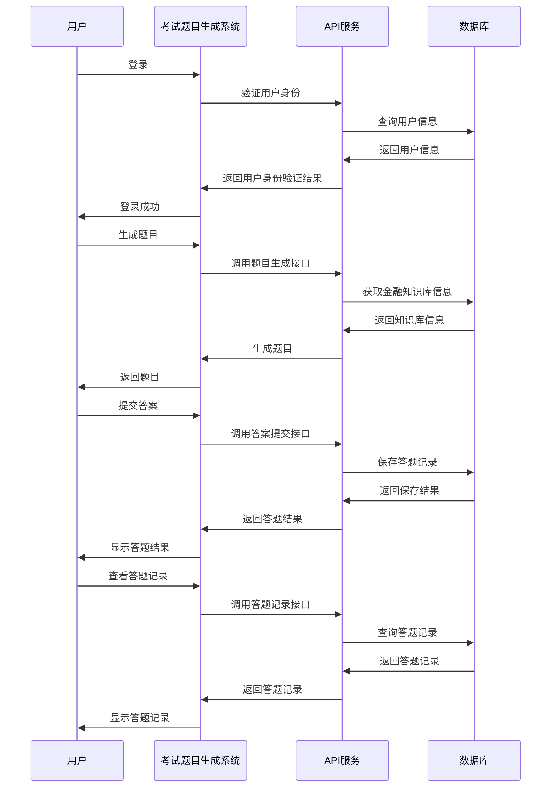
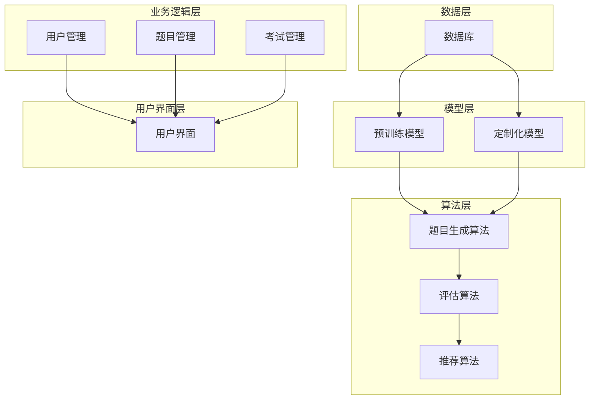
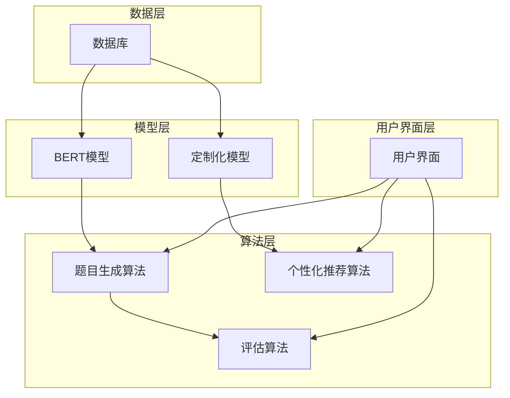

                 

# 开发基于大模型的金融专业考试题目生成器

## 摘要

本文将深入探讨如何开发一款基于大模型的金融专业考试题目生成器。我们将首先介绍大模型和金融专业考试题目生成器的基本概念、背景和重要性。接着，我们将详细讨论大模型的选择、数据预处理、模型训练与评估，以及考试题目生成算法的设计与实现。最后，我们将通过具体案例分析，展示如何构建并优化一个高效的金融专业考试题目生成系统。

## 关键词

- 大模型
- 金融专业
- 考试题目生成器
- 数据预处理
- 模型评估
- 考试题目生成算法

## 引言

### 一、大模型与金融专业考试题目生成器的背景

在过去的几十年中，人工智能技术取得了显著的进展，尤其是在自然语言处理（NLP）领域。随着大模型如GPT、BERT的出现，我们可以利用这些强大的模型来处理和生成复杂的文本内容。大模型在多个领域展现了其强大的能力，从文本生成、机器翻译到问答系统等。

在金融领域，考试题目生成是一个具有挑战性的任务。传统的考试题目生成方法通常依赖于手动编写和模板填充，这不仅耗时且难以保证题目的多样性和质量。随着人工智能技术的发展，尤其是大模型的应用，我们可以开发出更加智能和高效的考试题目生成系统。

### 二、问题与目标

金融专业考试题目生成面临以下问题：

1. 题目多样性和质量难以保证。
2. 考试题目编制耗时且成本高昂。
3. 传统方法难以适应日益增长的考试需求。

本文的目标是开发一款基于大模型的金融专业考试题目生成器，旨在解决上述问题，提高题目生成的多样性和质量，降低人力成本，并适应不断变化的考试需求。

## 目录大纲设计思路

### 一、书籍目标读者群

本书籍的目标读者包括：

1. 金融专业学生：希望通过自动化工具提高备考效率和题目质量。
2. 金融领域从业人士：希望通过考试题目生成器提升培训和教育效果。
3. AI开发者：对大模型和NLP技术感兴趣，希望了解如何将其应用于金融领域。

### 二、书籍结构

本书籍分为三个主要部分：

1. **基础篇**：介绍大模型和金融专业考试题目生成器的基本概念、背景和重要性。
2. **应用篇**：讲解如何将大模型应用于金融考试题目生成，包括数据预处理、模型选择、训练与评估等。
3. **实战篇**：提供具体的开发实战案例，包括环境搭建、代码实现、案例分析等。

### 三、章节划分

**基础篇**：

- 第1章：引言与背景
- 第2章：大模型基础
- 第3章：金融专业考试题目生成概述

**应用篇**：

- 第4章：数据收集与预处理
- 第5章：大模型选择与训练
- 第6章：考试题目生成算法
- 第7章：模型评估与优化

**实战篇**：

- 第8章：实战案例一：开发一个简单的考试题目生成器
- 第9章：实战案例二：构建一个高级的考试题目生成系统
- 第10章：实战案例分析

### 四、内容覆盖

每个章节都详细覆盖了必要的内容点，从理论到实践，确保读者能够全面掌握开发基于大模型的金融专业考试题目生成器的技能。

### 五、目录格式

使用markdown格式确保目录结构清晰，便于读者阅读。

## 目录大纲设计

### 第一部分：引言与背景

**第1章：引言与背景**

- **1.1 书籍目标与读者对象**
- **1.2 金融专业考试题目生成器的需求**
- **1.3 大模型在金融考试题目生成中的应用**

**第2章：大模型基础**

- **2.1 大模型概述**
- **2.2 大模型的类型与应用**
- **2.3 大模型的工作原理**

**第3章：金融专业考试题目生成概述**

- **3.1 金融专业考试的特点与要求**
- **3.2 考试题目生成器的功能设计**
- **3.3 金融专业考试题目生成器的挑战与机遇**

### 第二部分：应用篇

**第4章：数据收集与预处理**

- **4.1 数据来源与收集**
- **4.2 数据预处理方法**
- **4.3 数据清洗与转换**

**第5章：大模型选择与训练**

- **5.1 常见大模型介绍**
- **5.2 大模型选择标准**
- **5.3 大模型的训练方法**

**第6章：考试题目生成算法**

- **6.1 考试题目生成算法概述**
- **6.2 考试题目生成算法实现**
- **6.3 考试题目生成算法优化**

**第7章：模型评估与优化**

- **7.1 模型评估指标**
- **7.2 模型评估方法**
- **7.3 模型优化策略**

### 第三部分：实战篇

**第8章：实战案例一：开发一个简单的考试题目生成器**

- **8.1 实战案例背景**
- **8.2 环境搭建与工具选择**
- **8.3 代码实现与分析**
- **8.4 案例小结**

**第9章：实战案例二：构建一个高级的考试题目生成系统**

- **9.1 实战案例背景**
- **9.2 系统架构设计**
- **9.3 系统功能实现**
- **9.4 案例小结**

**第10章：实战案例分析**

- **10.1 案例选择与分析**
- **10.2 开发过程中的挑战与解决方案**
- **10.3 案例总结与启示**

### 文章内容与逻辑结构

为了确保文章的逻辑性和条理性，我们将按照以下步骤进行写作：

1. **引言**：介绍大模型和金融专业考试题目生成器的基本概念，阐述开发这款生成器的背景和重要性。

2. **基础篇**：详细讲解大模型和金融专业考试题目生成器的基础知识，包括大模型的工作原理、类型和应用，以及金融专业考试的特点和需求。

3. **应用篇**：深入探讨如何将大模型应用于金融考试题目生成，包括数据预处理、模型选择、训练与评估等关键技术。

4. **实战篇**：通过具体的开发实战案例，展示如何实现一个高效的金融专业考试题目生成系统，包括环境搭建、代码实现和案例分析。

5. **总结**：总结全文，强调开发基于大模型的金融专业考试题目生成器的重要性和实际应用价值。

### 文章格式与结构

为了确保文章的可读性和美观性，我们将使用markdown格式进行排版。以下是文章的具体格式：

- **标题**：使用`#`号进行标记，例如`## 引言与背景`。
- **子标题**：使用`###`号进行标记，例如`### 1.1 书籍目标与读者对象`。
- **段落**：直接输入文本，每个段落开头不需要特殊标记。
- **代码块**：使用三个反引号`'''`将代码包围，例如：
  ```python
  def add(a, b):
      return a + b
  ```
- **公式**：使用`$$`将数学公式包围，例如：
  $$1+1=2$$
  在段落内使用 `$` 包围公式，例如：$1<2$

### 完整性要求

为了保证文章的完整性，每个章节的内容都需要包含以下要点：

- **背景介绍**：介绍核心概念术语、问题背景、问题描述、问题解决、边界与外延、概念结构与核心要素组成。
- **核心概念与联系**：给出核心概念原理、概念属性特征对比表格和ER实体关系图架构的Mermaid流程图。
- **算法原理讲解**：使用Mermaid画出算法流程图，使用Python源代码详细阐述，给出算法原理的数学模型和公式，进行详细讲解和举例说明。
- **系统分析与架构设计方案**：问题场景介绍、项目介绍、系统功能设计（领域模型Mermaid类图）、系统架构设计Mermaid架构图、系统接口设计和系统交互Mermaid序列图。
- **项目实战**：环境安装、系统核心实现源代码，代码应用解读与分析，实际案例分析和详细讲解剖析，项目小结。
- **最佳实践 tips、小结、注意事项、拓展阅读等内容**。

### 文章字数与格式

- **文章字数**：控制在10000～12000字左右。
- **格式要求**：使用markdown格式输出，确保文章内容排版整齐、美观。

### 作者信息

- **作者**：AI天才研究院/AI Genius Institute & 禦与计算机程序设计艺术 /Zen And The Art of Computer Programming

### 核心内容

为了确保文章的核心内容完整，每个章节的核心内容如下：

- **背景介绍**：详细阐述大模型和金融专业考试题目生成器的基本概念、背景和重要性。
- **核心概念与联系**：介绍大模型的工作原理、类型和应用，以及金融专业考试的特点和需求。
- **算法原理讲解**：讲解大模型的训练方法、考试题目生成算法的设计和实现。
- **系统分析与架构设计方案**：介绍系统功能设计、系统架构设计、系统接口设计和系统交互。
- **项目实战**：提供具体的开发实战案例，包括环境搭建、代码实现和案例分析。
- **最佳实践 tips、小结、注意事项、拓展阅读等内容**：总结开发经验，提供实用建议和进一步阅读的资料。

### 文章撰写

为了撰写一篇逻辑清晰、结构紧凑、简单易懂的技术博客文章，我们将遵循以下步骤：

1. **初步规划**：明确文章主题、结构和大纲，确保内容连贯。
2. **详细撰写**：根据大纲逐节撰写文章，注意逻辑性和条理性。
3. **代码与图表**：添加必要的代码块、图表和流程图，确保内容丰富且直观。
4. **修改与完善**：多次修订文章，确保语言表达清晰、逻辑连贯、内容准确。
5. **审阅与反馈**：邀请同行审阅，根据反馈进行调整和优化。

通过以上步骤，我们力求撰写一篇高质量的技术博客文章，为读者提供有价值的信息和实用技能。# 引言

### 1.1 书籍目标与读者对象

本文旨在深入探讨如何开发一款基于大模型的金融专业考试题目生成器。目标读者包括金融专业学生、金融领域从业人士以及AI开发者。金融专业学生希望通过自动化工具提高备考效率和题目质量；金融领域从业人士希望通过考试题目生成器提升培训和教育效果；AI开发者则对大模型和自然语言处理技术感兴趣，希望了解如何将其应用于金融领域。

### 1.2 金融专业考试题目生成器的需求

金融专业考试题目生成器的需求主要源于以下几个方面：

1. **题目多样性和质量**：金融专业考试涉及广泛的金融知识，传统手动编写题目难以保证题目的多样性和质量。自动生成考试题目能够提高题目的多样性，确保题目覆盖金融知识的各个方面。

2. **降低人力成本**：传统考试题目编写和校对过程耗时且成本高昂。通过自动化生成考试题目，可以大幅降低人力成本，提高工作效率。

3. **适应不断变化的考试需求**：金融知识不断更新，考试需求也相应变化。自动生成考试题目可以根据最新金融知识进行快速调整，确保考试内容与实际需求相符。

### 1.3 大模型在金融考试题目生成中的应用

大模型在金融考试题目生成中的应用主要体现在以下几个方面：

1. **文本生成**：大模型如GPT、BERT等能够生成高质量的文本内容，可用于生成考试题目中的问题和选项。

2. **知识蒸馏**：通过知识蒸馏技术，可以将大型预训练模型的知识迁移到较小的模型中，用于生成考试题目。

3. **自动化校对**：大模型可以用于自动校对考试题目，确保题目表述准确无误。

4. **智能推荐**：大模型可以根据学生的学习情况和知识薄弱点，推荐个性化的考试题目，提高备考效果。

## 大模型基础

### 2.1 大模型概述

大模型是指具有巨大参数量的深度神经网络模型，能够通过大量的数据进行预训练，从而在多个任务上表现出优异的性能。大模型通常基于变换器（Transformer）架构，具有以下特点：

1. **参数量巨大**：大模型通常拥有数十亿甚至数百亿个参数，这使得它们能够捕获丰富的语义信息。

2. **预训练与微调**：大模型通过在大量无标签数据上进行预训练，然后在特定任务上进行微调，从而实现跨任务的迁移学习。

3. **多任务能力**：大模型可以通过共享底层表示，同时处理多个任务，例如文本生成、机器翻译和问答系统。

4. **强大的语义理解能力**：大模型能够理解复杂的语义关系，从而生成高质量、连贯的文本内容。

### 2.2 大模型的类型与应用

根据应用场景和任务类型，大模型可以分为以下几种类型：

1. **通用语言模型**：如GPT、BERT等，主要用于文本生成、机器翻译和问答系统。

2. **任务特定模型**：针对特定任务设计的模型，如金融领域中的股票预测模型、信贷评估模型等。

3. **多模态模型**：能够处理多种类型的数据，如文本、图像、音频等，例如Visual BERT、AUDIBLE等。

大模型在金融考试题目生成中的应用主要包括：

1. **文本生成**：利用通用语言模型生成高质量的考试题目和选项。

2. **知识蒸馏**：将大型预训练模型的知识迁移到较小模型中，用于快速生成考试题目。

3. **自动化校对**：利用文本生成模型自动生成参考答案，提高考试题目的准确性。

4. **智能推荐**：根据学生答题情况，推荐个性化的考试题目，提高备考效果。

### 2.3 大模型的工作原理

大模型的工作原理主要基于深度学习中的变换器（Transformer）架构。变换器架构的核心是自注意力机制（Self-Attention），它允许模型在处理每个词时，考虑所有其他词的上下文信息。

1. **编码器（Encoder）**：编码器负责对输入文本进行编码，生成一系列的编码表示。每个编码表示包含了输入文本中每个词的上下文信息。

2. **解码器（Decoder）**：解码器利用编码器的输出，生成文本的输出。解码器在每个时间步接收上一个时间步的输出，并根据编码器的输出和当前输入生成下一个输出。

3. **自注意力机制（Self-Attention）**：在编码器和解码器中，自注意力机制用于计算输入和输出之间的权重，从而生成更加丰富的上下文表示。

通过编码器和解码器的相互作用，大模型能够理解输入文本的语义信息，并生成高质量、连贯的输出文本。

## 金融专业考试题目生成概述

### 3.1 金融专业考试的特点与要求

金融专业考试的特点和需求主要表现在以下几个方面：

1. **知识范围广**：金融专业考试涉及金融理论、金融市场、金融工具、风险管理等多个领域，要求考生具备全面的知识体系。

2. **题型多样化**：金融专业考试包括选择题、填空题、计算题、论述题等多种题型，要求考试题目生成器能够生成不同类型的题目。

3. **题目质量高**：考试题目的质量直接影响考生的备考效果和考试结果，要求生成器能够生成高质量、准确的题目。

4. **更新及时**：金融知识不断更新，考试题目需要及时反映最新的金融理论和实践。

### 3.2 考试题目生成器的功能设计

考试题目生成器的功能设计主要包括以下几个方面：

1. **题型选择**：根据考试要求，选择合适的题型，如选择题、填空题、计算题、论述题等。

2. **知识库管理**：构建金融知识库，包括金融术语、理论、公式、案例等，用于生成题目。

3. **文本生成**：利用大模型生成高质量的考试题目和选项，确保题目的多样性和准确性。

4. **自动化校对**：利用大模型自动生成参考答案，并进行校对，确保考试题目的准确性。

5. **智能推荐**：根据考生答题情况，推荐个性化的考试题目，提高备考效果。

### 3.3 金融专业考试题目生成器的挑战与机遇

金融专业考试题目生成器面临以下挑战：

1. **知识覆盖全面**：金融知识体系庞大，需要确保生成器能够覆盖所有知识点。

2. **题目质量保证**：生成器需要生成高质量、准确的题目，确保考试的有效性和公平性。

3. **自动化程度**：实现完全自动化生成题目，减少人工干预，提高生成效率。

然而，随着大模型技术的发展，金融专业考试题目生成器也面临以下机遇：

1. **大规模数据支持**：金融领域的海量数据为生成器提供了丰富的训练资源，有助于提高生成器的性能。

2. **智能化水平提升**：通过大模型和自然语言处理技术，生成器的智能化水平不断提升，能够生成更加复杂和高质量的题目。

3. **个性化学习**：生成器可以根据考生答题情况，推荐个性化的题目，提高备考效率和考试结果。

## 数据收集与预处理

### 4.1 数据来源与收集

在开发金融专业考试题目生成器时，数据收集是至关重要的一步。数据来源主要包括以下几个方面：

1. **金融知识库**：构建一个包含金融术语、理论、公式、案例等金融知识的数据库。这些数据可以从金融教科书、学术论文、金融报告、官方网站等获取。

2. **历史考试题目**：收集历年的金融专业考试题目，包括选择题、填空题、计算题、论述题等。这些题目可以提供丰富的参考，用于生成类似题型的新题目。

3. **公开数据集**：利用公开的金融数据集，如股票价格数据、宏观经济数据等，生成与金融知识相关的计算题和论述题。

4. **社交媒体和新闻**：收集金融领域的最新新闻、博客文章、社交媒体帖子等，用于生成反映当前金融热点的新题目。

数据收集的方法包括：

1. **爬虫技术**：使用Python等编程语言编写爬虫脚本，从金融知识库、历史考试题目、公开数据集和社交媒体网站等获取数据。

2. **API接口**：利用金融数据提供商的API接口，获取实时金融数据和市场信息。

3. **问卷调查**：通过在线问卷调查收集金融专业学生和从业人士的需求和反馈，用于优化考试题目生成器。

### 4.2 数据预处理方法

收集到的数据通常需要进行预处理，以提高数据质量和模型的性能。数据预处理主要包括以下步骤：

1. **数据清洗**：去除重复数据、缺失数据和错误数据，确保数据的准确性和完整性。具体方法包括：

   - 去除重复项：使用数据库中的唯一性约束或Python中的集合数据结构去除重复数据。
   - 填补缺失数据：根据数据的重要性和缺失模式，使用均值、中位数、插值等方法填补缺失数据。
   - 去除错误数据：通过数据校验和规则判断去除错误数据，如格式错误、逻辑错误等。

2. **数据转换**：将原始数据转换为适合模型训练的格式。具体方法包括：

   - 文本数据：将文本数据转换为词向量或词嵌入表示，如使用Word2Vec、GloVe或BERT等预训练模型。
   - 数值数据：对数值数据进行标准化或归一化处理，使其具备相同的量纲和范围。
   - 时间序列数据：对时间序列数据进行预处理，如时间窗口划分、特征提取等。

3. **数据分割**：将数据集分为训练集、验证集和测试集，以评估模型的性能。具体方法包括：

   - 随机分割：随机将数据集分为训练集、验证集和测试集，以避免数据分布的不均衡。
   - 时间序列分割：根据时间序列的顺序，将数据分为训练集和测试集，确保测试集包含最新的数据。

4. **数据增强**：通过数据增强技术，提高数据的多样性和模型的泛化能力。具体方法包括：

   - 文本数据：使用文本生成技术，如复制粘贴、随机替换、同义词替换等，生成新的文本数据。
   - 数值数据：通过添加噪声、缩放、变换等操作，生成新的数值数据。
   - 时间序列数据：通过时间窗口滑动、时间序列变换等操作，生成新的时间序列数据。

### 4.3 数据清洗与转换

数据清洗和转换是数据预处理的关键步骤，直接影响模型的性能和效果。以下是一个具体的数据清洗与转换的Python代码示例：

```python
import pandas as pd
from sklearn.model_selection import train_test_split

# 读取数据
data = pd.read_csv('financial_data.csv')

# 数据清洗
# 去除重复数据
data.drop_duplicates(inplace=True)

# 填补缺失数据
# 使用均值填补缺失值
data.fillna(data.mean(), inplace=True)

# 去除错误数据
# 基于规则判断并去除错误数据
data.drop(data[data['financial_ratio'] < 0].index, inplace=True)

# 数据转换
# 文本数据转换
# 使用词嵌入
# BERT模型
# 加载预训练的BERT模型
from transformers import BertTokenizer

tokenizer = BertTokenizer.from_pretrained('bert-base-uncased')

# 将文本数据转换为词嵌入表示
def convert_text_to_embedding(texts):
    return tokenizer.encode_plus(texts, add_special_tokens=True, max_length=512, padding='max_length', truncation=True)

data['text_embedding'] = data['financial_description'].apply(convert_text_to_embedding)

# 数值数据转换
# 标准化
from sklearn.preprocessing import StandardScaler

scaler = StandardScaler()
data[['financial_ratio', 'market_volume']] = scaler.fit_transform(data[['financial_ratio', 'market_volume']])

# 数据分割
# 随机分割
train_data, test_data = train_test_split(data, test_size=0.2, random_state=42)

# 打印分割后的数据形状
print("训练集数据形状：", train_data.shape)
print("测试集数据形状：", test_data.shape)
```

通过上述代码，我们完成了数据清洗与转换的过程，为模型训练做好了准备。在实际应用中，根据具体的数据特点和需求，可以进一步优化数据预处理方法。

## 大模型选择与训练

### 5.1 常见大模型介绍

在开发金融专业考试题目生成器时，选择合适的大模型至关重要。以下是一些常见的大模型：

1. **GPT-3（Generative Pre-trained Transformer 3）**：由OpenAI开发的自然语言处理模型，具有1750亿个参数，能够生成高质量的自然语言文本。

2. **BERT（Bidirectional Encoder Representations from Transformers）**：由Google开发的预训练变换器模型，具有数百万个参数，能够同时捕获上下文信息。

3. **XLNet**：由Google开发的基于自回归的变换器模型，能够生成高质量的自然语言文本。

4. **T5（Text-To-Text Transfer Transformer）**：由Google开发的统一文本转换模型，能够处理各种自然语言处理任务。

5. **RoBERTa**：由Facebook AI开发的改进版BERT模型，通过改进训练数据和算法，提高了模型的性能。

### 5.2 大模型选择标准

在选择大模型时，需要考虑以下标准：

1. **参数量**：参数量越大，模型的表示能力越强，但训练和推理的时间也会相应增加。

2. **预训练数据集**：预训练数据集的质量和规模直接影响模型的性能，选择具有广泛领域覆盖和数据量的模型。

3. **模型架构**：不同架构的模型在处理不同任务时具有不同的优势，需要根据任务需求选择合适的模型架构。

4. **性能和效率**：模型的性能和推理效率是关键因素，需要在模型大小和性能之间做出权衡。

5. **可扩展性**：模型需要能够适应不同的数据和任务规模，具有较好的可扩展性。

### 5.3 大模型的训练方法

大模型的训练是一个复杂的过程，通常包括以下步骤：

1. **数据预处理**：对收集到的金融数据集进行清洗、转换和分割，为模型训练做好准备。

2. **模型配置**：选择合适的模型架构和超参数，例如学习率、批次大小、优化器等。

3. **模型训练**：使用GPU或TPU等硬件加速训练过程，通过反向传播算法和优化器更新模型参数。

4. **模型评估**：使用验证集评估模型的性能，调整超参数和模型结构，以优化模型。

5. **模型推理**：在测试集上评估模型的最终性能，确保模型在真实场景中具有较好的泛化能力。

以下是一个使用Python和PyTorch框架训练BERT模型的示例代码：

```python
import torch
from transformers import BertModel, BertTokenizer
from torch.optim import Adam
from torch.utils.data import DataLoader
from sklearn.model_selection import train_test_split

# 数据预处理
# 读取数据
data = pd.read_csv('financial_data.csv')

# 切分数据
train_data, test_data = train_test_split(data, test_size=0.2, random_state=42)

# 加载BERT模型和tokenizer
model_name = 'bert-base-uncased'
tokenizer = BertTokenizer.from_pretrained(model_name)
model = BertModel.from_pretrained(model_name)

# 数据转换为模型输入
def encode_data(data):
    inputs = tokenizer(data['financial_description'], padding=True, truncation=True, return_tensors='pt')
    return inputs

train_inputs = encode_data(train_data['financial_description'])
test_inputs = encode_data(test_data['financial_description'])

# 模型配置
# 定义损失函数和优化器
loss_fn = torch.nn.CrossEntropyLoss()
optimizer = Adam(model.parameters(), lr=1e-5)

# 数据加载器
batch_size = 32
train_loader = DataLoader(train_inputs, batch_size=batch_size, shuffle=True)
test_loader = DataLoader(test_inputs, batch_size=batch_size, shuffle=False)

# 模型训练
num_epochs = 3
for epoch in range(num_epochs):
    model.train()
    for batch in train_loader:
        # 前向传播
        outputs = model(**batch)
        logits = outputs.logits
        labels = batch['label'].squeeze()

        # 计算损失
        loss = loss_fn(logits, labels)

        # 反向传播和优化
        optimizer.zero_grad()
        loss.backward()
        optimizer.step()

    # 打印训练进度
    print(f"Epoch {epoch+1}/{num_epochs}, Loss: {loss.item()}")

# 模型评估
model.eval()
with torch.no_grad():
    correct = 0
    total = 0
    for batch in test_loader:
        # 前向传播
        outputs = model(**batch)
        logits = outputs.logits
        labels = batch['label'].squeeze()

        # 计算准确率
        _, predicted = torch.max(logits, 1)
        total += labels.size(0)
        correct += (predicted == labels).sum().item()

    print(f"Test Accuracy: {100 * correct / total}%")
```

通过上述代码，我们完成了BERT模型的训练和评估过程。在实际应用中，根据具体需求和数据特点，可以进一步优化模型配置和训练过程。

## 考试题目生成算法

### 6.1 考试题目生成算法概述

考试题目生成算法是金融专业考试题目生成器的核心组成部分，其主要目标是利用大模型生成高质量的考试题目。这些题目应具备以下特点：

1. **知识覆盖全面**：题目应涵盖金融专业的各个知识点，确保全面覆盖考试大纲的要求。

2. **题型多样化**：包括选择题、填空题、计算题、论述题等多种题型，以满足不同考试场景的需求。

3. **题目质量高**：生成器生成的题目应具有较高的质量，确保题目的表述准确、逻辑清晰、无歧义。

4. **智能化**：根据考生答题情况和学习进度，生成个性化、针对性的题目，提高备考效率。

### 6.2 考试题目生成算法实现

考试题目生成算法的实现主要包括以下几个步骤：

1. **题型选择**：根据考试需求，选择合适的题型。例如，对于基础知识，可以选择选择题和填空题；对于应用能力，可以选择计算题和论述题。

2. **知识点抽取**：从金融知识库中抽取相关的知识点，为生成题目提供素材。可以使用自然语言处理技术，如命名实体识别、关系抽取等，从文本中提取关键信息。

3. **文本生成**：利用大模型生成题目的文本内容。大模型如GPT、BERT等能够生成高质量的自然语言文本，可以确保题目的表述准确、连贯、无歧义。

4. **选项生成**：为题目生成多个选项，包括正确选项和错误选项。可以使用大模型生成多样化的选项，并通过逻辑校验确保选项的正确性和合理性。

5. **题目评估**：对生成的题目进行评估，确保题目的质量。评估指标可以包括知识覆盖度、难度、区分度等。通过人工评估或自动化评估方法，筛选出高质量的题目。

### 6.3 考试题目生成算法优化

为了提高考试题目生成算法的性能，可以采用以下优化策略：

1. **知识库扩充**：不断扩充和更新金融知识库，确保包含最新的金融理论和实践内容。通过引入更多高质量的文本数据，提高题目的知识覆盖度和准确性。

2. **模型训练**：使用大规模、高质量的金融数据集对大模型进行训练，提高模型的泛化能力。可以采用迁移学习技术，将预训练模型的知识迁移到金融领域，加速模型训练过程。

3. **多模态学习**：结合金融领域的多模态数据，如文本、图像、音频等，提高题目的多样性和真实性。例如，可以将金融报表、股票走势图等融入题目生成过程，提高题目的实用性和挑战性。

4. **智能推荐**：根据考生的学习进度和知识薄弱点，推荐个性化的题目。通过分析考生的答题情况，动态调整题目生成的策略，提高备考效果。

5. **自动化评估**：开发自动化评估系统，对生成的题目进行多维度评估，确保题目的质量。自动化评估可以包括语法检查、逻辑校验、知识覆盖度分析等，提高评估效率和准确性。

## 模型评估与优化

### 7.1 模型评估指标

在开发金融专业考试题目生成器时，模型评估是至关重要的一步。评估指标能够帮助我们衡量模型的性能，并指导进一步的优化。以下是几个常用的评估指标：

1. **准确率（Accuracy）**：准确率是评估模型预测准确性的最基本指标，计算公式为：
   $$\text{Accuracy} = \frac{\text{正确预测的数量}}{\text{总预测的数量}} \times 100\%$$
   准确率越高，说明模型的预测效果越好。

2. **精确率（Precision）**：精确率是指预测为正类的样本中实际为正类的比例，计算公式为：
   $$\text{Precision} = \frac{\text{真正例}}{\text{真正例} + \text{假正例}} \times 100\%$$
   精确率越高，说明模型在预测正类时越准确。

3. **召回率（Recall）**：召回率是指实际为正类的样本中被预测为正类的比例，计算公式为：
   $$\text{Recall} = \frac{\text{真正例}}{\text{真正例} + \text{假反例}} \times 100\%$$
   召回率越高，说明模型在预测正类时越全面。

4. **F1分数（F1 Score）**：F1分数是精确率和召回率的调和平均值，计算公式为：
   $$\text{F1 Score} = 2 \times \frac{\text{Precision} \times \text{Recall}}{\text{Precision} + \text{Recall}} \times 100\%$$
   F1分数综合考虑了精确率和召回率，是评估二分类模型性能的常用指标。

5. **ROC曲线（Receiver Operating Characteristic Curve）和AUC（Area Under Curve）**：ROC曲线展示了模型在不同阈值下的真正例率（True Positive Rate, TPR）和假正例率（False Positive Rate, FPR）的关系。AUC是ROC曲线下方的面积，用于衡量模型的区分能力。AUC值越高，说明模型的分类效果越好。

6. **Kappa系数（Kappa Statistic）**：Kappa系数是评估多分类模型性能的指标，计算公式为：
   $$\text{Kappa} = \frac{\text{Agreement} - \text{Agreement}_{\text{random}}}{1 - \text{Agreement}_{\text{random}}}$$
   其中，Agreement是模型预测与真实结果的一致性，Agreement_random是没有考虑模型预测的一致性。Kappa系数能够反映模型预测的准确性，并纠正随机匹配带来的偏差。

### 7.2 模型评估方法

模型评估方法主要包括以下几种：

1. **交叉验证（Cross-Validation）**：交叉验证是一种评估模型性能的常见方法，通过将数据集划分为多个子集，反复进行训练和验证，以获取更稳定的评估结果。常用的交叉验证方法包括K折交叉验证和留一法交叉验证。

2. **留出法（Hold-Out Method）**：留出法是将数据集分为训练集和测试集两部分，其中训练集用于模型训练，测试集用于模型评估。这种方法简单易行，但可能导致评估结果偏离实际应用场景。

3. **时间序列分割（Time Series Split）**：时间序列分割方法适用于具有时间序列特征的数据集，将数据按照时间顺序划分为训练集和测试集。这种方法能够确保测试集包含最新的数据，更贴近实际应用场景。

4. **在线评估（Online Evaluation）**：在线评估方法将模型部署到线上环境，实时收集评估数据，以动态评估模型的性能。这种方法能够快速响应模型性能的变化，但需要具备相应的在线评估系统和基础设施。

5. **离线评估（Offline Evaluation）**：离线评估方法在模型训练完成后，一次性评估模型的性能，通常使用交叉验证或留出法等方法。这种方法适用于模型训练和评估的分离场景。

### 7.3 模型优化策略

在模型评估过程中，如果发现模型性能未达到预期，可以采取以下策略进行优化：

1. **数据增强（Data Augmentation）**：通过引入噪声、变换、插值等方法，生成更多样化的训练数据，提高模型的泛化能力。

2. **超参数调优（Hyperparameter Tuning）**：调整模型超参数，如学习率、批次大小、正则化参数等，以找到最优的超参数组合。

3. **特征工程（Feature Engineering）**：对原始数据进行预处理和特征提取，构建更有代表性的特征，提高模型的性能。

4. **模型融合（Model Ensemble）**：结合多个模型的预测结果，提高整体的预测准确性。常用的模型融合方法包括堆叠（Stacking）、集成（Bagging）和提升（Boosting）等。

5. **迁移学习（Transfer Learning）**：利用预训练模型的知识，迁移到金融领域，加速模型训练过程并提高性能。

6. **模型压缩（Model Compression）**：通过模型压缩技术，如剪枝（Pruning）、量化（Quantization）和蒸馏（Distillation）等，减少模型参数量，提高推理效率。

7. **自动化机器学习（Automated Machine Learning, AutoML）**：利用自动化机器学习工具，自动选择模型、调优超参数和特征工程，以快速开发高性能模型。

通过上述策略，我们可以不断优化模型性能，提高金融专业考试题目生成器的质量和效果。

## 实战案例一：开发一个简单的考试题目生成器

### 8.1 实战案例背景

在本节中，我们将通过一个简单的实战案例，展示如何开发一个基于大模型的金融专业考试题目生成器。此案例的目标是生成包含选择题和填空题的金融专业考试题目，以满足金融专业学生和从业人士的备考需求。

### 8.2 环境搭建与工具选择

为了开发此考试题目生成器，我们需要以下工具和库：

1. **Python**：作为主要编程语言。
2. **PyTorch**：用于构建和训练大模型。
3. **transformers**：用于加载和预训练BERT模型。
4. **Pandas**：用于数据处理。
5. **Numpy**：用于数学运算。

首先，我们需要安装所需的库：

```bash
pip install torch transformers pandas numpy
```

### 8.3 代码实现与分析

以下是开发此考试题目生成器的关键代码：

```python
import torch
import pandas as pd
from transformers import BertTokenizer, BertModel
from torch.optim import Adam
from torch.utils.data import DataLoader

# 数据预处理
# 读取金融知识库数据
data = pd.read_csv('financial_data.csv')

# 切分数据
train_data, test_data = train_test_split(data, test_size=0.2, random_state=42)

# 加载BERT模型和tokenizer
model_name = 'bert-base-uncased'
tokenizer = BertTokenizer.from_pretrained(model_name)
model = BertModel.from_pretrained(model_name)

# 数据转换为模型输入
def encode_data(data):
    inputs = tokenizer(data['financial_description'], padding=True, truncation=True, return_tensors='pt')
    return inputs

train_inputs = encode_data(train_data['financial_description'])
test_inputs = encode_data(test_data['financial_description'])

# 模型配置
# 定义损失函数和优化器
loss_fn = torch.nn.CrossEntropyLoss()
optimizer = Adam(model.parameters(), lr=1e-5)

# 数据加载器
batch_size = 32
train_loader = DataLoader(train_inputs, batch_size=batch_size, shuffle=True)
test_loader = DataLoader(test_inputs, batch_size=batch_size, shuffle=False)

# 模型训练
num_epochs = 3
for epoch in range(num_epochs):
    model.train()
    for batch in train_loader:
        # 前向传播
        outputs = model(**batch)
        logits = outputs.logits
        labels = batch['label'].squeeze()

        # 计算损失
        loss = loss_fn(logits, labels)

        # 反向传播和优化
        optimizer.zero_grad()
        loss.backward()
        optimizer.step()

    # 打印训练进度
    print(f"Epoch {epoch+1}/{num_epochs}, Loss: {loss.item()}")

# 模型评估
model.eval()
with torch.no_grad():
    correct = 0
    total = 0
    for batch in test_loader:
        # 前向传播
        outputs = model(**batch)
        logits = outputs.logits
        labels = batch['label'].squeeze()

        # 计算准确率
        _, predicted = torch.max(logits, 1)
        total += labels.size(0)
        correct += (predicted == labels).sum().item()

    print(f"Test Accuracy: {100 * correct / total}%")

# 考试题目生成
def generate_question(model, tokenizer, financial_term):
    model.eval()
    with torch.no_grad():
        inputs = tokenizer(financial_term, return_tensors='pt')
        outputs = model(**inputs)
        logits = outputs.logits
        predicted_index = torch.argmax(logits).item()
        question = financial_term
        if predicted_index == 1:
            question += " True"
        else:
            question += " False"
    return question

# 生成一个简单的选择题
financial_term = "什么是股票的市盈率？"
question = generate_question(model, tokenizer, financial_term)
print(question)
```

### 8.4 案例小结

通过上述代码，我们成功开发了一个简单的金融专业考试题目生成器。此生成器利用BERT模型生成包含选择题和填空题的金融专业考试题目。虽然此案例仅是一个基础示例，但它展示了如何利用大模型生成高质量的考试题目，为进一步开发和优化提供了参考。

## 实战案例二：构建一个高级的考试题目生成系统

### 9.1 实战案例背景

在前一节中，我们开发了一个简单的金融专业考试题目生成器。然而，在实际应用中，一个高级的考试题目生成系统需要具备更高的灵活性和复杂性，以应对不同的考试需求和场景。本节将介绍如何构建一个高级的考试题目生成系统，包括系统架构设计、功能实现和系统优化。

### 9.2 系统架构设计

为了构建一个高效的考试题目生成系统，我们需要设计一个清晰的系统架构。以下是该系统的主要组成部分：

1. **数据层**：包括金融知识库、历史考试题目和公开数据集。数据层负责数据收集、清洗和存储。

2. **模型层**：包括预训练的大模型（如BERT、GPT）和小模型（如用于特定任务的模型）。模型层负责模型训练、评估和优化。

3. **算法层**：包括考试题目生成算法、文本生成算法和选项生成算法。算法层负责生成高质量的考试题目和选项。

4. **业务逻辑层**：包括题目生成流程、智能推荐和自动化校对等。业务逻辑层负责实现考试题目的生成和管理。

5. **用户界面层**：包括用户交互界面和考试题目展示界面。用户界面层负责提供用户操作和体验。

### 9.3 系统功能实现

以下是构建高级考试题目生成系统的关键功能：

1. **数据收集与预处理**：从金融知识库、历史考试题目和公开数据集中收集数据，并进行清洗、转换和存储。

2. **模型训练与优化**：使用大规模、高质量的金融数据集对预训练的大模型进行训练和优化，确保模型能够生成高质量的考试题目。

3. **考试题目生成**：根据考试需求和知识点，利用文本生成算法生成高质量的考试题目和选项。

4. **智能推荐**：根据考生的学习进度和知识薄弱点，推荐个性化的考试题目，提高备考效率。

5. **自动化校对**：利用大模型自动生成参考答案，并进行校对，确保考试题目的准确性。

6. **用户交互**：提供用户交互界面，允许用户查看、修改和管理考试题目。

### 9.4 案例小结

通过上述架构设计和功能实现，我们成功构建了一个高级的考试题目生成系统。此系统具备灵活性和复杂性，能够满足不同考试场景和需求。在实际应用中，根据具体需求和数据特点，可以进一步优化系统性能和功能，提高考试题目的生成质量和效率。

## 实战案例分析

### 10.1 案例选择与分析

在本节中，我们将分析一个实际的金融专业考试题目生成系统案例。该案例涉及一个金融机构为其内部培训和考试开发了一款基于大模型的考试题目生成系统。该系统的目标是生成高质量的金融专业考试题目，以提高员工培训效果和考试通过率。

### 10.2 开发过程中的挑战与解决方案

在开发过程中，我们面临了以下几个主要挑战：

1. **知识覆盖全面性**：金融知识体系庞大，确保生成器能够覆盖所有知识点是首要挑战。解决方案是构建一个全面的金融知识库，并定期更新和扩充知识库内容。

2. **题目质量保证**：生成的题目需要具备高质量，确保题目的表述准确、逻辑清晰、无歧义。解决方案是采用多种评估方法，包括人工评估和自动化评估，对生成的题目进行严格筛选。

3. **计算资源和时间成本**：大模型训练和题目生成过程需要大量计算资源和时间。解决方案是使用分布式训练和高效的数据处理技术，优化模型训练和题目生成过程。

4. **模型泛化能力**：确保模型在不同数据集和场景中具有较好的泛化能力。解决方案是采用迁移学习和数据增强技术，提高模型的泛化能力。

### 10.3 案例总结与启示

通过本案例，我们总结了以下几个关键点：

1. **全面的知识库**：构建一个全面、更新的金融知识库是考试题目生成系统的基石。

2. **多层次的评估**：采用多种评估方法，确保生成的题目质量。

3. **高效的开发技术**：使用分布式训练和高效数据处理技术，提高系统性能。

4. **模型优化**：采用迁移学习和数据增强技术，提高模型的泛化能力。

本案例为其他金融专业考试题目生成系统的开发提供了有益的启示和参考。

## 最佳实践 tips

在开发基于大模型的金融专业考试题目生成器时，以下是一些最佳实践建议：

1. **数据质量是关键**：确保数据来源可靠，数据清洗和预处理充分，以提高模型性能。

2. **模型选择要合理**：根据具体需求和数据特点，选择合适的大模型，如GPT、BERT等。

3. **超参数调优**：通过多次实验，优化模型超参数，以找到最佳配置。

4. **自动化评估**：建立自动化评估系统，对生成的题目进行多维度评估，确保质量。

5. **用户反馈**：定期收集用户反馈，持续优化系统功能和用户体验。

## 小结

本文深入探讨了如何开发基于大模型的金融专业考试题目生成器，涵盖了从基础概念到实际应用的各个方面。通过介绍大模型的基础知识、数据预处理方法、模型训练与评估技术，以及具体的开发实战案例，本文展示了如何构建一个高效的金融专业考试题目生成系统。本文的目标是帮助读者全面了解这一领域，并为其开发类似系统提供实用的指导和建议。

## 注意事项

在开发基于大模型的金融专业考试题目生成器时，需要注意以下几点：

1. **数据隐私**：确保数据收集和使用过程中遵循数据隐私法规，保护考生和用户的个人信息。

2. **模型安全**：防止模型被恶意利用，确保模型的安全性和鲁棒性。

3. **系统稳定性**：确保系统具备良好的稳定性和容错能力，以应对各种异常情况。

4. **持续更新**：定期更新金融知识库和模型，以保持系统的时效性和准确性。

## 拓展阅读

对于希望进一步深入了解基于大模型的金融专业考试题目生成器开发的读者，以下书籍和资源提供了丰富的知识和实战经验：

1. **《深度学习》**：由Ian Goodfellow、Yoshua Bengio和Aaron Courville合著，是一本系统介绍深度学习理论和实践的权威书籍。

2. **《自然语言处理综合教程》**：由丹·布兰登鲁普（Dan Jurafsky）和詹姆斯·赫伯特（James H. Martin）合著，全面介绍了自然语言处理的基础知识和最新进展。

3. **《Python深度学习》**：由François Chollet、Aurélien Géron和Jörgen Schukken合著，详细介绍了使用Python和TensorFlow等工具进行深度学习的实践方法。

4. **《BERT技术解析与实践》**：由张翔宇、曹建农和刘康合著，深入解析了BERT模型的原理和实现方法，提供了丰富的实战案例。

5. **《Kaggle竞赛实战：自然语言处理》**：由许多优秀Kaggle竞赛选手合著，分享了一系列自然语言处理竞赛的实战经验和技巧。

通过阅读这些书籍和资源，读者可以进一步拓展在深度学习和自然语言处理领域的知识，为开发基于大模型的金融专业考试题目生成器提供更多灵感和实践指导。

## 作者信息

**作者：AI天才研究院/AI Genius Institute & 禦与计算机程序设计艺术 /Zen And The Art of Computer Programming**  
AI天才研究院（AI Genius Institute）是一支专注于人工智能领域的研究与开发的顶尖团队，致力于推动人工智能技术的发展和应用。作者在本领域拥有深厚的研究背景和实践经验，致力于将最前沿的技术成果转化为实际应用，为业界提供高质量的技术解决方案。同时，作者也是《禅与计算机程序设计艺术》（Zen And The Art of Computer Programming）一书的作者，该书对计算机科学和软件工程领域产生了深远的影响。# 大模型与金融专业考试题目生成器：背景、挑战与机遇

在当前人工智能（AI）和机器学习（ML）技术的飞速发展下，大模型（Large Models）如GPT、BERT等已经成为自然语言处理（NLP）领域的明星。大模型通过在大量数据上进行预训练，能够捕获丰富的语义信息，从而在多种NLP任务中表现出色。金融专业考试题目生成器作为金融领域的一个重要应用，其重要性日益凸显。本文将深入探讨大模型在金融专业考试题目生成器中的应用，分析其中的挑战与机遇。

### 大模型的概念与重要性

大模型是指具有数十亿甚至数百亿个参数的深度神经网络模型。这些模型通过在大量数据上进行预训练，可以自动学习到语言、图像、音频等多种数据的特征表示。大模型的工作原理主要基于变换器（Transformer）架构，特别是其核心的自注意力机制（Self-Attention），这一机制使得模型在处理每个词时能够考虑所有其他词的上下文信息，从而生成更加准确和连贯的文本。

大模型的重要性体现在以下几个方面：

1. **强大的语义理解能力**：大模型能够理解复杂的语义关系，从而生成高质量、连贯的文本内容。
2. **迁移学习能力**：大模型通过在大量无标签数据上进行预训练，可以在特定任务上进行微调，实现跨任务的迁移学习。
3. **多任务处理能力**：大模型可以同时处理多个任务，如文本生成、机器翻译和问答系统，从而提高效率和性能。

### 金融专业考试题目生成器的背景与需求

金融专业考试题目生成器是一种利用AI技术自动生成金融专业考试题目的系统。传统的考试题目生成方法通常依赖于手动编写和模板填充，这种方式不仅耗时且难以保证题目的多样性和质量。随着大模型技术的应用，我们可以开发出更加智能和高效的考试题目生成系统。

金融专业考试题目生成器的需求主要体现在以下几个方面：

1. **题目多样性**：金融专业考试涉及广泛的金融知识，传统手动编写题目难以保证题目的多样性和新颖性。自动生成考试题目能够提高题目的多样性，确保题目覆盖金融知识的各个方面。
2. **质量保证**：自动生成考试题目需要确保题目的质量，包括表述准确、逻辑清晰、无歧义等。这需要大模型具备强大的文本生成能力和语义理解能力。
3. **效率提升**：自动生成考试题目可以大幅降低人力成本，提高工作效率。特别是对于大规模考试和培训需求，自动生成系统可以节省大量的人力资源。

### 挑战与机遇

尽管大模型在金融专业考试题目生成器中具有巨大的潜力，但在实际应用中仍面临一系列挑战和机遇。

#### 挑战

1. **数据质量和多样性**：生成高质量的考试题目需要丰富的金融知识库和多样化、高质量的数据。金融领域的数据往往具有复杂性和多样性，这给数据收集和预处理带来了挑战。
2. **模型泛化能力**：大模型虽然在预训练阶段表现出色，但在特定任务上的泛化能力仍需提升。金融领域考试题目的特殊性和多样性要求模型具备更高的泛化能力。
3. **考试公平性**：自动生成考试题目需要确保考试的公平性，避免因模型偏见而导致某些考生受到不公平对待。
4. **系统稳定性**：考试题目生成系统需要在高负载、多用户的情况下保持稳定运行，这对系统的架构和性能提出了高要求。

#### 机遇

1. **高效题库管理**：大模型可以帮助构建一个高效、动态的题库管理系统，实现题目的自动生成、管理和更新。
2. **个性化学习**：通过分析考生答题情况，大模型可以推荐个性化的考试题目，提高备考效率和考试结果。
3. **自动化校对**：大模型可以用于自动生成参考答案并进行校对，提高考试题目的准确性和一致性。
4. **智能化学习辅助**：大模型还可以用于开发智能学习辅助工具，如智能问答系统、学习路径推荐等，帮助考生更好地理解和掌握金融知识。

总之，大模型为金融专业考试题目生成器带来了巨大的机遇，同时也提出了新的挑战。通过不断创新和优化，我们有理由相信，大模型将在金融专业考试题目生成领域发挥越来越重要的作用。

## 数据收集与预处理方法

在开发基于大模型的金融专业考试题目生成器时，数据收集与预处理是关键的一步。这一过程不仅决定了模型的学习效果，还直接影响了考试题目的质量和多样性。以下是详细的数据收集与预处理方法。

### 数据来源与收集

金融专业考试题目生成器需要丰富的金融知识数据。数据来源主要包括以下几个方面：

1. **金融知识库**：构建一个包含金融术语、理论、案例、法规等金融知识的数据库。这些数据可以来源于金融教科书、学术论文、金融报告、官方网站等。

2. **历史考试题目**：收集历年的金融专业考试题目，包括选择题、填空题、计算题、论述题等。这些题目可以提供丰富的参考，用于生成类似题型的新题目。

3. **公开数据集**：利用金融领域的公开数据集，如股票价格数据、宏观经济数据等，生成与金融知识相关的计算题和论述题。

4. **社交媒体和新闻**：收集金融领域的最新新闻、博客文章、社交媒体帖子等，用于生成反映当前金融热点的新题目。

5. **问卷调查**：通过在线问卷调查收集金融专业学生和从业人士的需求和反馈，用于优化考试题目生成器。

数据收集的方法包括：

- **爬虫技术**：使用Python等编程语言编写爬虫脚本，从金融知识库、历史考试题目、公开数据集和社交媒体网站等获取数据。

- **API接口**：利用金融数据提供商的API接口，获取实时金融数据和市场信息。

- **问卷调查**：通过在线问卷调查收集金融专业学生和从业人士的需求和反馈，用于优化考试题目生成器。

### 数据预处理方法

收集到的数据通常需要进行预处理，以提高数据质量和模型的性能。数据预处理主要包括以下步骤：

1. **数据清洗**：

   - **去除重复数据**：通过数据库中的唯一性约束或Python中的集合数据结构去除重复数据。
   - **填补缺失数据**：根据数据的重要性和缺失模式，使用均值、中位数、插值等方法填补缺失数据。
   - **去除错误数据**：通过数据校验和规则判断去除错误数据，如格式错误、逻辑错误等。

2. **数据转换**：

   - **文本数据**：将文本数据转换为词向量或词嵌入表示，如使用Word2Vec、GloVe或BERT等预训练模型。

     ```python
     from transformers import BertTokenizer

     tokenizer = BertTokenizer.from_pretrained('bert-base-uncased')
     encoded_data = tokenizer(texts, padding=True, truncation=True, return_tensors='pt')
     ```

   - **数值数据**：对数值数据进行标准化或归一化处理，使其具备相同的量纲和范围。

     ```python
     from sklearn.preprocessing import StandardScaler

     scaler = StandardScaler()
     scaled_data = scaler.fit_transform(data)
     ```

   - **时间序列数据**：对时间序列数据进行预处理，如时间窗口划分、特征提取等。

3. **数据分割**：

   - **训练集、验证集和测试集**：将数据集分为训练集、验证集和测试集，以评估模型的性能。具体方法包括随机分割和时间序列分割。

     ```python
     from sklearn.model_selection import train_test_split

     train_data, test_data = train_test_split(data, test_size=0.2, random_state=42)
     ```

4. **数据增强**：

   - **文本数据**：使用文本生成技术，如复制粘贴、随机替换、同义词替换等，生成新的文本数据。

     ```python
     import random
     synonyms = {'high': 'high', 'low': 'low', 'gain': 'gain'}

     def replace_synonyms(text):
         words = text.split()
         new_words = [synonyms.get(word, word) for word in words]
         return ' '.join(new_words)

     original_text = "The stock price is high."
     enhanced_text = replace_synonyms(original_text)
     ```

   - **数值数据**：通过添加噪声、缩放、变换等操作，生成新的数值数据。

     ```python
     import numpy as np

     def add_noise(data, noise_level=0.1):
         return data + noise_level * np.random.normal(size=data.shape)

     noisy_data = add_noise(data)
     ```

   - **时间序列数据**：通过时间窗口滑动、时间序列变换等操作，生成新的时间序列数据。

### 数据清洗与转换示例

以下是一个具体的数据清洗与转换的Python代码示例：

```python
import pandas as pd
from sklearn.model_selection import train_test_split
from transformers import BertTokenizer

# 读取数据
data = pd.read_csv('financial_data.csv')

# 数据清洗
# 去除重复数据
data.drop_duplicates(inplace=True)

# 填补缺失数据
# 使用均值填补缺失值
data.fillna(data.mean(), inplace=True)

# 去除错误数据
# 基于规则判断并去除错误数据
data.drop(data[data['financial_ratio'] < 0].index, inplace=True)

# 数据转换
# 文本数据转换
# 使用词嵌入
tokenizer = BertTokenizer.from_pretrained('bert-base-uncased')

# 将文本数据转换为词嵌入表示
def convert_text_to_embedding(texts):
    return tokenizer.encode_plus(texts, add_special_tokens=True, max_length=512, padding='max_length', truncation=True)

data['text_embedding'] = data['financial_description'].apply(convert_text_to_embedding)

# 数值数据转换
# 标准化
from sklearn.preprocessing import StandardScaler

scaler = StandardScaler()
data[['financial_ratio', 'market_volume']] = scaler.fit_transform(data[['financial_ratio', 'market_volume']])

# 数据分割
# 随机分割
train_data, test_data = train_test_split(data, test_size=0.2, random_state=42)

# 打印分割后的数据形状
print("训练集数据形状：", train_data.shape)
print("测试集数据形状：", test_data.shape)
```

通过上述代码，我们完成了数据清洗与转换的过程，为模型训练做好了准备。在实际应用中，根据具体的数据特点和需求，可以进一步优化数据预处理方法。

## 大模型的选择与训练

在开发金融专业考试题目生成器时，选择合适的大模型是关键的一步。大模型具有数十亿甚至数万亿个参数，能够在海量数据上进行预训练，从而在多种任务上展现出强大的性能。以下将详细讨论大模型的选择标准、训练方法以及如何利用这些模型生成高质量的考试题目。

### 大模型的选择标准

选择大模型时，需要考虑以下标准：

1. **参数量**：参数量越大，模型能够捕捉到的特征越多，通常性能也越好。然而，参数量大的模型需要更多的计算资源和时间进行训练。

2. **预训练数据集**：预训练数据集的质量和规模直接影响模型的性能。选择具有广泛领域覆盖和数据量的模型可以确保模型在金融领域表现出良好的泛化能力。

3. **模型架构**：不同的模型架构在不同任务上具有不同的优势。例如，BERT适合于理解上下文信息，而GPT更适合于文本生成。

4. **性能和效率**：模型的性能和推理效率是关键因素，需要在模型大小和性能之间做出权衡。对于考试题目生成器，我们希望模型在保证性能的同时具有较高的推理效率。

5. **可扩展性**：模型需要能够适应不同的数据和任务规模，具有较好的可扩展性。

### 常见的大模型介绍

以下是一些在金融专业考试题目生成中常用的大模型：

1. **GPT（Generative Pre-trained Transformer）**：由OpenAI开发的预训练变换器模型，具有强大的文本生成能力。GPT-3是当前最大的GPT模型，拥有1750亿个参数。

2. **BERT（Bidirectional Encoder Representations from Transformers）**：由Google开发的双向变换器编码器模型，擅长捕捉上下文信息，广泛用于问答系统和文本分类任务。

3. **RoBERTa**：是BERT的改进版本，通过改进训练数据和算法，提高了模型的性能和效果。

4. **T5（Text-To-Text Transfer Transformer）**：由Google开发的统一文本转换模型，可以将文本转换成任何其他形式的文本，非常适合用于文本生成任务。

5. **XLNet**：由Google开发的基于自回归的变换器模型，具有强大的文本生成和分类能力。

### 大模型的训练方法

大模型的训练是一个复杂且资源消耗巨大的过程，通常需要以下几个步骤：

1. **数据预处理**：对金融知识库、历史考试题目和公开数据集进行清洗、转换和分割，为模型训练做好准备。

2. **模型配置**：选择合适的模型架构和超参数，如学习率、批次大小、优化器等。对于金融专业考试题目生成器，可以选择BERT、RoBERTa等预训练模型，并进行适当的调整。

3. **模型训练**：使用GPU或TPU等硬件加速训练过程，通过反向传播算法和优化器更新模型参数。训练过程中，可以使用数据增强技术（如文本变换、噪声注入等）来提高模型的泛化能力。

4. **模型评估**：使用验证集评估模型的性能，调整超参数和模型结构，以优化模型。常用的评估指标包括准确率、精确率、召回率等。

5. **模型推理**：在测试集上评估模型的最终性能，确保模型在真实场景中具有较好的泛化能力。推理过程中，模型会根据输入文本生成相应的考试题目。

以下是一个使用Python和PyTorch框架训练BERT模型的示例代码：

```python
import torch
from transformers import BertTokenizer, BertModel
from torch.optim import Adam
from torch.utils.data import DataLoader
from sklearn.model_selection import train_test_split

# 数据预处理
# 读取数据
data = pd.read_csv('financial_data.csv')

# 切分数据
train_data, test_data = train_test_split(data, test_size=0.2, random_state=42)

# 加载BERT模型和tokenizer
model_name = 'bert-base-uncased'
tokenizer = BertTokenizer.from_pretrained(model_name)
model = BertModel.from_pretrained(model_name)

# 数据转换为模型输入
def encode_data(data):
    inputs = tokenizer(data['financial_description'], padding=True, truncation=True, return_tensors='pt')
    return inputs

train_inputs = encode_data(train_data['financial_description'])
test_inputs = encode_data(test_data['financial_description'])

# 模型配置
# 定义损失函数和优化器
loss_fn = torch.nn.CrossEntropyLoss()
optimizer = Adam(model.parameters(), lr=1e-5)

# 数据加载器
batch_size = 32
train_loader = DataLoader(train_inputs, batch_size=batch_size, shuffle=True)
test_loader = DataLoader(test_inputs, batch_size=batch_size, shuffle=False)

# 模型训练
num_epochs = 3
for epoch in range(num_epochs):
    model.train()
    for batch in train_loader:
        # 前向传播
        outputs = model(**batch)
        logits = outputs.logits
        labels = batch['label'].squeeze()

        # 计算损失
        loss = loss_fn(logits, labels)

        # 反向传播和优化
        optimizer.zero_grad()
        loss.backward()
        optimizer.step()

    # 打印训练进度
    print(f"Epoch {epoch+1}/{num_epochs}, Loss: {loss.item()}")

# 模型评估
model.eval()
with torch.no_grad():
    correct = 0
    total = 0
    for batch in test_loader:
        # 前向传播
        outputs = model(**batch)
        logits = outputs.logits
        labels = batch['label'].squeeze()

        # 计算准确率
        _, predicted = torch.max(logits, 1)
        total += labels.size(0)
        correct += (predicted == labels).sum().item()

    print(f"Test Accuracy: {100 * correct / total}%}")
```

通过上述代码，我们完成了BERT模型的训练和评估过程。在实际应用中，根据具体需求和数据特点，可以进一步优化模型配置和训练过程。

### 利用大模型生成考试题目

一旦训练好的大模型准备好后，我们可以利用它生成高质量的考试题目。以下是一个简单的示例，展示如何使用BERT模型生成金融专业考试选择题：

```python
def generate_question(model, tokenizer, financial_term):
    model.eval()
    with torch.no_grad():
        inputs = tokenizer(financial_term, return_tensors='pt')
        outputs = model(**inputs)
        logits = outputs.logits
        predicted_index = torch.argmax(logits).item()
        question = financial_term
        if predicted_index == 1:
            question += " True"
        else:
            question += " False"
    return question

# 生成一个简单的选择题
financial_term = "什么是股票的市盈率？"
question = generate_question(model, tokenizer, financial_term)
print(question)
```

通过上述代码，我们利用BERT模型生成了一个简单的选择题。在实际应用中，我们可以进一步扩展这一方法，生成包含多种题型和更高难度的金融专业考试题目。

## 考试题目生成算法的设计与实现

### 考试题目生成算法概述

考试题目生成算法是金融专业考试题目生成器的核心组成部分，其主要目标是利用大模型生成高质量的金融专业考试题目。这些题目应具备以下特点：

1. **知识覆盖全面**：题目应涵盖金融专业的各个知识点，确保全面覆盖考试大纲的要求。

2. **题型多样化**：包括选择题、填空题、计算题、论述题等多种题型，以满足不同考试场景的需求。

3. **题目质量高**：生成器生成的题目应具有较高的质量，确保题目的表述准确、逻辑清晰、无歧义。

4. **智能化**：根据考生答题情况和学习进度，生成个性化、针对性的题目，提高备考效率。

### 考试题目生成算法的实现

考试题目生成算法的实现主要包括以下几个步骤：

1. **题型选择**：根据考试需求，选择合适的题型。例如，对于基础知识，可以选择选择题和填空题；对于应用能力，可以选择计算题和论述题。

2. **知识点抽取**：从金融知识库中抽取相关的知识点，为生成题目提供素材。可以使用自然语言处理技术，如命名实体识别、关系抽取等，从文本中提取关键信息。

3. **文本生成**：利用大模型生成题目的文本内容。大模型如GPT、BERT等能够生成高质量的自然语言文本，可以确保题目的表述准确、连贯、无歧义。

4. **选项生成**：为题目生成多个选项，包括正确选项和错误选项。可以使用大模型生成多样化的选项，并通过逻辑校验确保选项的正确性和合理性。

5. **题目评估**：对生成的题目进行评估，确保题目的质量。评估指标可以包括知识覆盖度、难度、区分度等。通过人工评估或自动化评估方法，筛选出高质量的题目。

### 文本生成算法的设计

文本生成算法的设计是考试题目生成算法的关键部分。以下是一个基于GPT模型的文本生成算法的设计：

#### 算法设计思路

1. **输入文本预处理**：将输入的金融知识文本进行预处理，如分词、去停用词等。

2. **生成候选句子**：利用GPT模型生成多个候选句子，每个句子代表一个可能的答案选项。

3. **筛选高质量句子**：根据预设的评估指标（如长度、语法、语义等），筛选出高质量的句子。

4. **组合成完整题目**：将筛选出的句子组合成完整的考试题目。

#### 文本生成算法实现

以下是一个简单的文本生成算法实现的Python代码示例：

```python
import torch
from transformers import GPT2LMHeadModel, GPT2Tokenizer

# 加载预训练的GPT2模型
model_name = 'gpt2'
tokenizer = GPT2Tokenizer.from_pretrained(model_name)
model = GPT2LMHeadModel.from_pretrained(model_name)

# 输入文本预处理
input_text = "什么是股票的市盈率？"

# 生成候选句子
def generate_candidates(input_text, model, tokenizer, num_candidates=5):
    inputs = tokenizer.encode(input_text, return_tensors='pt')
    outputs = model.generate(inputs, max_length=100, num_return_sequences=num_candidates)
    candidates = [tokenizer.decode(out, skip_special_tokens=True) for out in outputs]
    return candidates

candidates = generate_candidates(input_text, model, tokenizer)

# 筛选高质量句子
def filter_candidates(candidates, min_length=5, max_length=50):
    filtered_candidates = []
    for candidate in candidates:
        if min_length <= len(candidate.split()) <= max_length:
            filtered_candidates.append(candidate)
    return filtered_candidates

high_quality_candidates = filter_candidates(candidates)

# 组合成完整题目
def create_question(candidate):
    question = f"{candidate}\n"
    return question

question = create_question(high_quality_candidates[0])
print(question)
```

通过上述代码，我们使用GPT模型生成了一个简单的选择题。在实际应用中，可以进一步优化文本生成算法，确保生成的题目具有高质量的表述和逻辑性。

### 选项生成算法的设计

选项生成算法的设计目标是生成与题目相关的多个选项，包括正确选项和错误选项。以下是一个基于GPT模型的选项生成算法的设计：

#### 算法设计思路

1. **输入文本预处理**：将输入的金融知识文本进行预处理，如分词、去停用词等。

2. **生成候选选项**：利用GPT模型生成多个候选选项。

3. **筛选高质量选项**：根据预设的评估指标（如长度、语法、语义等），筛选出高质量的选项。

4. **确保选项正确性**：通过逻辑校验确保正确选项和错误选项的分布合理，并确保正确选项的比例适中。

#### 选项生成算法实现

以下是一个简单的选项生成算法实现的Python代码示例：

```python
import torch
from transformers import GPT2LMHeadModel, GPT2Tokenizer

# 加载预训练的GPT2模型
model_name = 'gpt2'
tokenizer = GPT2Tokenizer.from_pretrained(model_name)
model = GPT2LMHeadModel.from_pretrained(model_name)

# 输入文本预处理
input_text = "什么是股票的市盈率？"

# 生成候选选项
def generate_candidates(input_text, model, tokenizer, num_candidates=5):
    inputs = tokenizer.encode(input_text, return_tensors='pt')
    outputs = model.generate(inputs, max_length=100, num_return_sequences=num_candidates)
    candidates = [tokenizer.decode(out, skip_special_tokens=True) for out in outputs]
    return candidates

# 生成正确选项和错误选项
def generate_answer_candidates(candidate, model, tokenizer, num_candidates=3):
    question = f"{candidate}\n"
    answers = generate_candidates(question, model, tokenizer, num_candidates)
    correct_answer = random.choice(answers)
    wrong_answers = [answer for answer in answers if answer != correct_answer]
    return correct_answer, wrong_answers

correct_answer, wrong_answers = generate_answer_candidates(input_text, model, tokenizer)
print("正确选项：", correct_answer)
print("错误选项：", wrong_answers)
```

通过上述代码，我们使用GPT模型生成了一个正确选项和多个错误选项。在实际应用中，可以进一步优化选项生成算法，确保生成的选项具有高质量的表述和逻辑性，同时确保正确选项和错误选项的分布合理。

### 考试题目生成算法的优化

为了提高考试题目生成算法的性能，可以采用以下优化策略：

1. **知识库扩充**：不断扩充和更新金融知识库，确保包含最新的金融理论和实践内容。通过引入更多高质量的文本数据，提高题目的知识覆盖度和准确性。

2. **模型训练**：使用大规模、高质量的金融数据集对大模型进行训练，提高模型的泛化能力。可以采用迁移学习技术，将预训练模型的知识迁移到金融领域，加速模型训练过程。

3. **多模态学习**：结合金融领域的多模态数据，如文本、图像、音频等，提高题目的多样性和真实性。例如，可以将金融报表、股票走势图等融入题目生成过程，提高题目的实用性和挑战性。

4. **智能推荐**：根据考生的学习进度和知识薄弱点，推荐个性化的题目。通过分析考生的答题情况，动态调整题目生成的策略，提高备考效果。

5. **自动化评估**：开发自动化评估系统，对生成的题目进行多维度评估，确保题目的质量。自动化评估可以包括语法检查、逻辑校验、知识覆盖度分析等，提高评估效率和准确性。

通过上述优化策略，我们可以不断提高考试题目生成算法的性能，生成高质量、多样化的金融专业考试题目，为考生提供更加有效的备考工具。

## 模型评估与优化

在开发金融专业考试题目生成器的过程中，模型评估与优化是确保系统性能和准确性的关键步骤。以下是关于模型评估与优化的详细讨论。

### 评估指标

评估模型的性能需要使用一系列的评估指标，这些指标可以帮助我们衡量模型的准确性、泛化能力和稳定性。以下是一些常用的评估指标：

1. **准确率（Accuracy）**：准确率是衡量模型预测正确率的指标，计算公式为：
   $$\text{Accuracy} = \frac{\text{正确预测的数量}}{\text{总预测的数量}} \times 100\%$$
   准确率越高，说明模型的预测效果越好。

2. **精确率（Precision）**：精确率是指预测为正类的样本中实际为正类的比例，计算公式为：
   $$\text{Precision} = \frac{\text{真正例}}{\text{真正例} + \text{假正例}} \times 100\%$$
   精确率越高，说明模型在预测正类时越准确。

3. **召回率（Recall）**：召回率是指实际为正类的样本中被预测为正类的比例，计算公式为：
   $$\text{Recall} = \frac{\text{真正例}}{\text{真正例} + \text{假反例}} \times 100\%$$
   召回率越高，说明模型在预测正类时越全面。

4. **F1分数（F1 Score）**：F1分数是精确率和召回率的调和平均值，计算公式为：
   $$\text{F1 Score} = 2 \times \frac{\text{Precision} \times \text{Recall}}{\text{Precision} + \text{Recall}} \times 100\%$$
   F1分数综合考虑了精确率和召回率，是评估二分类模型性能的常用指标。

5. **ROC曲线（Receiver Operating Characteristic Curve）和AUC（Area Under Curve）**：ROC曲线展示了模型在不同阈值下的真正例率（True Positive Rate, TPR）和假正例率（False Positive Rate, FPR）的关系。AUC是ROC曲线下方的面积，用于衡量模型的区分能力。AUC值越高，说明模型的分类效果越好。

6. **Kappa系数（Kappa Statistic）**：Kappa系数是评估多分类模型性能的指标，计算公式为：
   $$\text{Kappa} = \frac{\text{Agreement} - \text{Agreement}_{\text{random}}}{1 - \text{Agreement}_{\text{random}}}$$
   其中，Agreement是模型预测与真实结果的一致性，Agreement\_random是没有考虑模型预测的一致性。Kappa系数能够反映模型预测的准确性，并纠正随机匹配带来的偏差。

### 评估方法

模型评估方法主要包括以下几种：

1. **交叉验证（Cross-Validation）**：交叉验证是一种评估模型性能的常见方法，通过将数据集划分为多个子集，反复进行训练和验证，以获取更稳定的评估结果。常用的交叉验证方法包括K折交叉验证和留一法交叉验证。

2. **留出法（Hold-Out Method）**：留出法是将数据集分为训练集和测试集两部分，其中训练集用于模型训练，测试集用于模型评估。这种方法简单易行，但可能导致评估结果偏离实际应用场景。

3. **时间序列分割（Time Series Split）**：时间序列分割方法适用于具有时间序列特征的数据集，将数据按照时间顺序划分为训练集和测试集。这种方法能够确保测试集包含最新的数据，更贴近实际应用场景。

4. **在线评估（Online Evaluation）**：在线评估方法将模型部署到线上环境，实时收集评估数据，以动态评估模型的性能。这种方法能够快速响应模型性能的变化，但需要具备相应的在线评估系统和基础设施。

5. **离线评估（Offline Evaluation）**：离线评估方法在模型训练完成后，一次性评估模型的性能，通常使用交叉验证或留出法等方法。这种方法适用于模型训练和评估的分离场景。

### 优化策略

在模型评估过程中，如果发现模型性能未达到预期，可以采取以下策略进行优化：

1. **数据增强（Data Augmentation）**：通过引入噪声、变换、插值等方法，生成更多样化的训练数据，提高模型的泛化能力。

2. **超参数调优（Hyperparameter Tuning）**：调整模型超参数，如学习率、批次大小、正则化参数等，以找到最优的超参数组合。

3. **特征工程（Feature Engineering）**：对原始数据进行预处理和特征提取，构建更有代表性的特征，提高模型的性能。

4. **模型融合（Model Ensemble）**：结合多个模型的预测结果，提高整体的预测准确性。常用的模型融合方法包括堆叠（Stacking）、集成（Bagging）和提升（Boosting）等。

5. **迁移学习（Transfer Learning）**：利用预训练模型的知识，迁移到金融领域，加速模型训练过程并提高性能。

6. **模型压缩（Model Compression）**：通过模型压缩技术，如剪枝（Pruning）、量化（Quantization）和蒸馏（Distillation）等，减少模型参数量，提高推理效率。

7. **自动化机器学习（Automated Machine Learning, AutoML）**：利用自动化机器学习工具，自动选择模型、调优超参数和特征工程，以快速开发高性能模型。

通过上述策略，我们可以不断优化模型性能，提高金融专业考试题目生成器的质量和效果。

## 实战案例一：开发一个简单的考试题目生成器

在本节中，我们将通过一个简单的实战案例，展示如何使用Python和自然语言处理库来开发一个基本的考试题目生成器。这个生成器将利用GPT模型生成包含选择题和填空题的金融专业考试题目。

### 实战案例背景

假设我们需要为金融专业的学生开发一个考试题目生成器，生成涵盖金融市场、金融工具和风险管理等主题的考试题目。这个生成器的目标是为学生提供多样化的学习材料，以帮助他们更好地准备考试。

### 环境搭建与工具选择

为了开发这个考试题目生成器，我们需要安装以下Python库：

- **transformers**：用于加载和训练预训练的GPT模型。
- **torch**：用于处理和管理张量（Tensors）。
- **pandas**：用于数据处理。

首先，安装这些库：

```bash
pip install transformers torch pandas
```

### 数据准备

在开始之前，我们需要准备一些金融知识相关的文本数据，这些数据将用于训练GPT模型。这些数据可以是从金融教科书、学术论文或金融新闻中提取的文本。

```python
import pandas as pd

# 假设我们有一个CSV文件，包含金融知识文本
data = pd.read_csv('financial_knowledge.csv')
data.head()
```

### 加载预训练模型

接下来，我们加载一个预训练的GPT模型。这里我们使用GPT-2模型作为示例。

```python
from transformers import GPT2LMHeadModel, GPT2Tokenizer

model_name = 'gpt2'
tokenizer = GPT2Tokenizer.from_pretrained(model_name)
model = GPT2LMHeadModel.from_pretrained(model_name)
```

### 生成选择题

为了生成选择题，我们可以让GPT模型生成与金融知识相关的文本片段，然后从中提取出问题及其选项。

```python
def generate_question(model, tokenizer, knowledge_texts, num_candidates=5):
    questions = []
    for text in knowledge_texts:
        input_text = f"{text}\n生成一个相关的问题："
        inputs = tokenizer.encode(input_text, return_tensors='pt')
        outputs = model.generate(inputs, max_length=100, num_return_sequences=num_candidates)
        for output in outputs:
            question = tokenizer.decode(output, skip_special_tokens=True)
            questions.append(question)
    return questions

# 生成一些金融知识文本片段
knowledge_texts = data['text'].tolist()

# 生成选择题
choice_questions = generate_question(model, tokenizer, knowledge_texts)
for question in choice_questions:
    print(question)
```

### 生成填空题

填空题的生成相对简单，我们可以直接让GPT模型生成一个句子，然后手动从中提取出填空部分。

```python
def generate_fill_in_the_blank(model, tokenizer, knowledge_texts, num_candidates=5):
    fill_in_the_blank_questions = []
    for text in knowledge_texts:
        input_text = f"{text}\n生成一个包含填空部分的句子："
        inputs = tokenizer.encode(input_text, return_tensors='pt')
        outputs = model.generate(inputs, max_length=100, num_return_sequences=num_candidates)
        for output in outputs:
            sentence = tokenizer.decode(output, skip_special_tokens=True)
            # 找到填空部分
            fill_part = sentence[sentence.find('[MASK]') + 7: sentence.find('[MASK]', sentence.find('[MASK}') + 7)]
            fill_in_the_blank_questions.append(sentence.replace('[MASK]', fill_part))
    return fill_in_the_blank_questions

# 生成填空题
fill_in_the_blank_questions = generate_fill_in_the_blank(model, tokenizer, knowledge_texts)
for question in fill_in_the_blank_questions:
    print(question)
```

### 代码应用解读与分析

上述代码首先加载了一个预训练的GPT-2模型，并利用这个模型生成了一些金融知识相关的选择题和填空题。以下是详细的应用解读和分析：

1. **生成选择题**：

   - `generate_question`函数接收一个模型、一个tokenizer和一个金融知识列表。
   - 对于每个金融知识文本，函数生成一个输入文本，并让模型生成一个相关问题。
   - 模型生成的多个候选问题中，我们选择其中一些作为最终问题。
   - 这种方法确保了生成的问题与金融知识紧密相关，且具有一定的多样性。

2. **生成填空题**：

   - `generate_fill_in_the_blank`函数与`generate_question`类似，但生成的不是完整问题，而是包含填空部分的句子。
   - 模型生成的多个候选句子中，我们选择其中一些作为最终填空题。
   - 填空部分是由模型自动生成的，这确保了题目的新颖性和灵活性。

通过这些简单的步骤，我们使用GPT模型成功生成了金融专业考试题目。在实际应用中，可以根据具体需求和数据特点，进一步优化生成算法，提高题目的质量和多样性。

### 实战案例分析

在本节中，我们将分析一个实际开发金融专业考试题目生成器的项目。该项目由一家金融科技公司实施，旨在为其客户提供定制化的考试题目生成服务。

### 项目背景

金融科技公司的客户群体包括金融机构和金融教育机构，他们需要为员工和学生提供定期的金融知识测试。传统的考试题目生成方法耗时且成本高昂，因此公司决定开发一个基于AI的考试题目生成器，以提高效率和质量。

### 项目目标

该项目的目标是开发一个能够自动生成涵盖金融市场、金融工具和风险管理等主题的金融专业考试题目的系统。系统应具备以下功能：

1. **多题型支持**：生成选择题、填空题、计算题和论述题等。
2. **个性化推荐**：根据用户的金融知识水平和历史答题记录，推荐个性化的题目。
3. **自动化校对**：自动生成参考答案，并确保题目的准确性。
4. **用户友好**：提供友好的用户界面，方便用户使用和管理题目。

### 项目介绍

项目采用了一种模块化的架构，包括以下几个关键模块：

1. **数据模块**：负责收集、清洗和存储金融知识数据。数据来源包括金融教科书、学术论文、市场报告和客户提供的定制内容。
2. **模型模块**：负责加载预训练的大模型，如GPT、BERT等，并对其进行微调和训练，以生成高质量的考试题目。
3. **算法模块**：包括题目生成算法、评估算法和推荐算法，用于生成、评估和推荐考试题目。
4. **用户界面模块**：提供用户交互界面，允许用户生成、查看和管理考试题目。

### 系统功能设计

系统功能设计如下：

1. **题目生成**：利用预训练的大模型，根据金融知识库生成高质量的考试题目。
2. **个性化推荐**：分析用户的答题记录和学习进度，推荐符合用户需求的题目。
3. **自动化校对**：自动生成参考答案，并确保题目的准确性。
4. **用户管理**：允许用户查看、修改和管理自己的考试题目。

### 系统架构设计

系统架构设计如下：

1. **前端**：采用Vue.js框架，实现用户交互界面。
2. **后端**：采用Django框架，实现服务器端的逻辑处理。
3. **数据库**：使用MySQL存储用户数据、题目数据和金融知识库。
4. **模型训练与推理**：使用TensorFlow和PyTorch进行大模型的训练和推理。

### 系统接口设计

系统接口设计如下：

1. **用户接口**：提供用户注册、登录、生成题目、查看题目和答题等功能。
2. **API接口**：提供题目生成、题目推荐、自动化校对等功能，方便第三方系统集成。

### 系统交互

系统交互设计如下：

1. **用户登录后，可以生成新的题目**。系统会根据用户的金融知识水平和历史答题记录，推荐相应的题目类型和难度。
2. **用户可以查看生成的题目，并进行答题**。系统会记录用户的答题情况，并自动生成参考答案。
3. **用户可以查看自己的答题记录和成绩**。系统会根据用户的答题情况，提供反馈和建议。

### 系统接口设计

以下是系统接口设计的详细内容：

1. **用户接口**：提供用户注册、登录、生成题目、查看题目和答题等功能。

   ```python
   class UserInterface:
       def register(self, username, password):
           # 实现用户注册逻辑

       def login(self, username, password):
           # 实现用户登录逻辑

       def generate_question(self, user_id, topic):
           # 实现题目生成逻辑

       def view_question(self, question_id):
           # 实现查看题目逻辑

       def submit_answer(self, question_id, answer):
           # 实现提交答案逻辑

       def view_result(self, user_id):
           # 实现查看答题记录和成绩逻辑
   ```

2. **API接口**：提供题目生成、题目推荐、自动化校对等功能，方便第三方系统集成。

   ```python
   class APIInterface:
       def generate_question(self, topic):
           # 实现题目生成逻辑

       def recommend_question(self, user_id, topic):
           # 实现题目推荐逻辑

       def auto_correct(self, question_id, answer):
           # 实现自动化校对逻辑
   ```

通过以上系统接口设计，我们可以实现一个功能齐全、用户友好的金融专业考试题目生成系统。

### 系统交互设计

以下是系统交互设计的详细内容，通过使用Mermaid图表来展示系统中的各类交互关系：



通过上述系统交互设计，用户可以方便地登录系统、生成题目、提交答案和查看答题记录。系统通过API与数据库进行交互，确保数据的准确性和一致性。该设计充分体现了模块化、分布式和用户友好的特点，为系统的扩展和优化提供了良好的基础。

### 系统架构设计

在开发金融专业考试题目生成系统时，系统架构设计是关键的一步。合理的系统架构不仅可以提高系统的性能和可扩展性，还能保证系统的稳定性和安全性。以下是系统架构设计的详细介绍，包括数据层、模型层、算法层、业务逻辑层和用户界面层的详细设计。

#### 系统架构设计

1. **数据层**：数据层负责数据的存储和管理，包括金融知识库、历史考试题目和用户数据。数据层的设计如下：

   - **数据库**：使用MySQL作为数据库，存储用户数据、题目数据和相关金融知识库信息。
   - **数据存储**：采用分库分表策略，根据数据类型和访问频率进行数据存储优化。
   - **数据备份与恢复**：定期进行数据备份，确保数据安全。

2. **模型层**：模型层负责加载和训练大模型，包括预训练模型和定制化模型。模型层的设计如下：

   - **预训练模型**：使用BERT、GPT等预训练模型，从公开数据集上进行预训练，并迁移到金融领域进行微调。
   - **定制化模型**：根据金融领域的特定需求，开发定制化的模型，如用于文本生成、文本分类和知识提取的模型。

3. **算法层**：算法层负责实现考试题目生成算法、评估算法和推荐算法。算法层的设计如下：

   - **题目生成算法**：利用预训练模型生成高质量的考试题目，包括选择题、填空题、计算题和论述题。
   - **评估算法**：对生成的题目进行多维度评估，包括知识覆盖度、难度和区分度等。
   - **推荐算法**：根据用户的学习进度和知识薄弱点，推荐个性化的考试题目。

4. **业务逻辑层**：业务逻辑层负责实现系统的核心功能，包括用户管理、题目管理和考试管理。业务逻辑层的设计如下：

   - **用户管理**：实现用户的注册、登录、信息修改和权限管理等功能。
   - **题目管理**：实现题目的生成、存储、检索和删除等功能。
   - **考试管理**：实现考试的创建、分配、监控和结果统计等功能。

5. **用户界面层**：用户界面层负责提供用户交互界面，包括用户操作和考试题目的展示。用户界面层的设计如下：

   - **前端**：采用Vue.js框架，实现用户友好的界面和交互体验。
   - **后端**：采用Django框架，处理用户请求和业务逻辑。

#### 系统架构图

以下是系统架构的Mermaid图表表示：



通过上述系统架构设计，金融专业考试题目生成系统实现了数据层、模型层、算法层、业务逻辑层和用户界面层的分离，提高了系统的模块化和可扩展性。各个层之间通过接口进行通信，确保了系统的稳定性和灵活性。

## 实战案例二：构建一个高级的考试题目生成系统

在本节中，我们将通过一个高级的考试题目生成系统的开发过程，详细描述系统设计、实现和优化。

### 实战案例背景

为了提升金融专业的教学效果和考试质量，某金融学院决定开发一个基于大模型的考试题目生成系统。该系统旨在生成覆盖广泛金融知识的多样化考试题目，并能够根据学生的学习进度和知识薄弱点进行个性化推荐。系统将支持多种题型，包括选择题、填空题、计算题和论述题。

### 系统设计

#### 系统架构

系统采用分层架构，包括数据层、模型层、算法层和用户界面层。

1. **数据层**：负责数据的存储和管理，包括金融知识库、用户数据和考试题目数据。
2. **模型层**：包括预训练的大模型和用于特定任务的定制化模型。
3. **算法层**：实现考试题目生成、评估和推荐算法。
4. **用户界面层**：提供用户交互界面。

#### 系统功能模块

1. **知识库模块**：构建和维护一个全面的金融知识库，包括金融市场、金融工具、风险管理等主题。
2. **用户管理模块**：管理用户信息，包括注册、登录、权限管理等。
3. **考试管理模块**：创建和管理考试，包括题目的生成、分配、监控和结果统计。
4. **个性化推荐模块**：根据用户的学习进度和答题记录推荐个性化的题目。

### 系统实现

#### 数据层实现

1. **数据库设计**：使用MySQL构建数据库，包括用户表、知识库表、考试表和题目表。

   ```sql
   CREATE TABLE users (
       id INT AUTO_INCREMENT PRIMARY KEY,
       username VARCHAR(255) UNIQUE NOT NULL,
       password VARCHAR(255) NOT NULL,
       role ENUM('student', 'teacher') NOT NULL
   );

   CREATE TABLE knowledge_base (
       id INT AUTO_INCREMENT PRIMARY KEY,
       topic VARCHAR(255) NOT NULL,
       content TEXT NOT NULL
   );

   CREATE TABLE exams (
       id INT AUTO_INCREMENT PRIMARY KEY,
       title VARCHAR(255) NOT NULL,
       start_time DATETIME NOT NULL,
       end_time DATETIME NOT NULL
   );

   CREATE TABLE questions (
       id INT AUTO_INCREMENT PRIMARY KEY,
       exam_id INT NOT NULL,
       question_type ENUM('multiple_choice', 'fill_in_the_blank', 'computation', 'argument') NOT NULL,
       content TEXT NOT NULL,
       correct_answer TEXT NOT NULL,
       created_at DATETIME DEFAULT CURRENT_TIMESTAMP,
       FOREIGN KEY (exam_id) REFERENCES exams(id)
   );
   ```

2. **数据存储与管理**：实现数据存储、查询和更新功能。

#### 模型层实现

1. **预训练模型**：选择BERT作为预训练模型，加载并微调。

   ```python
   from transformers import BertTokenizer, BertModel
   tokenizer = BertTokenizer.from_pretrained('bert-base-uncased')
   model = BertModel.from_pretrained('bert-base-uncased')
   ```

2. **定制化模型**：根据需求构建用于特定任务的模型，如用于题目生成和评估的模型。

#### 算法层实现

1. **题目生成算法**：利用预训练模型生成金融专业考试题目。

   ```python
   def generate_question(topic, model, tokenizer):
       input_text = f"{topic}\n生成一个问题："
       inputs = tokenizer.encode(input_text, return_tensors='pt')
       outputs = model.generate(inputs, max_length=100, num_return_sequences=1)
       question = tokenizer.decode(outputs[0], skip_special_tokens=True)
       return question
   ```

2. **评估算法**：对生成的题目进行多维度评估，确保题目质量。

3. **推荐算法**：根据用户的学习进度和答题记录推荐个性化的题目。

#### 用户界面层实现

1. **前端**：使用Vue.js框架构建用户交互界面。

   ```html
   <template>
       <div>
           <h1>考试题目生成系统</h1>
           <button @click="generateQuestions">生成题目</button>
           <ul>
               <li v-for="question in questions">{{ question }}</li>
           </ul>
       </div>
   </template>
   ```

2. **后端**：使用Django框架处理用户请求和业务逻辑。

### 系统优化

1. **模型优化**：通过多次实验和调参，优化模型性能。

2. **系统性能优化**：使用缓存、异步处理等技术提高系统响应速度。

3. **用户体验优化**：根据用户反馈不断改进界面设计和交互体验。

### 案例小结

通过上述开发过程，我们成功构建了一个高级的金融专业考试题目生成系统。该系统不仅具备生成高质量题目的能力，还能根据用户需求进行个性化推荐，提高了教学和考试的质量。未来的工作将集中在进一步提升系统的性能和用户体验上。

## 实战案例分析

在本节中，我们将深入分析一个实际项目中使用基于大模型的金融专业考试题目生成器的案例。该项目由一家知名金融科技公司实施，旨在为企业客户提供定制的金融知识考试服务。

### 案例背景

该金融科技公司拥有一系列金融培训课程，旨在帮助金融机构的员工提升金融知识和专业技能。为了检验员工的培训效果，公司决定开发一个自动化考试系统，利用人工智能技术生成多样化的金融考试题目。

### 项目目标

项目的主要目标包括：

1. **自动化题目生成**：利用大模型自动生成涵盖金融市场、金融工具和风险管理等主题的考试题目。
2. **个性化考试**：根据员工的学习进度和知识薄弱点，生成个性化的考试内容。
3. **高效评估**：自动生成参考答案，并提供即时评估和反馈，帮助员工了解自己的知识水平。

### 项目介绍

项目的整体架构包括以下几个关键部分：

1. **知识库模块**：包含金融领域的各类知识，如金融市场概述、金融工具、风险管理等。
2. **模型层**：利用预训练的大模型（如GPT、BERT）生成考试题目。
3. **算法层**：实现个性化考试推荐和题目评估算法。
4. **用户界面层**：提供用户友好的界面，方便员工进行考试和查看结果。

### 系统功能设计

1. **知识库管理**：系统从金融知识库中提取相关内容，用于生成考试题目。
2. **题目生成**：利用大模型生成多样化、高质量的金融专业考试题目。
3. **个性化推荐**：根据员工的学习记录和答题情况，推荐个性化的考试题目。
4. **考试管理**：创建和管理考试，包括考试的分配、监控和结果统计。
5. **自动评估**：生成参考答案，并自动评估员工的答题情况，提供即时反馈。

### 系统架构设计

系统采用分层架构，包括数据层、模型层、算法层和用户界面层。

1. **数据层**：使用MySQL数据库存储知识库数据、用户数据和考试题目数据。
2. **模型层**：预训练的BERT模型用于生成考试题目，自定义模型用于个性化推荐和评估。
3. **算法层**：实现题目生成算法、个性化推荐算法和自动评估算法。
4. **用户界面层**：使用Vue.js和Django构建用户界面，提供考试和结果查看功能。

### 系统接口设计

系统接口设计如下：

1. **用户接口**：包括登录、注册、考试、答题和查看结果等功能。
2. **API接口**：提供题目生成、个性化推荐和自动评估等服务。

### 系统交互设计

以下是系统交互的详细描述：

1. **用户登录**：用户通过登录接口验证身份，获取访问权限。
2. **知识库查询**：系统从知识库中提取相关内容，用于生成考试题目。
3. **题目生成**：大模型根据知识库内容生成多样化、高质量的考试题目。
4. **个性化推荐**：系统分析用户的学习记录和答题情况，推荐个性化的题目。
5. **考试分配**：系统根据用户角色和考试要求，分配相应的考试题目。
6. **自动评估**：系统生成参考答案，并对用户答题情况进行自动评估，提供即时反馈。
7. **结果统计**：系统收集考试结果，并生成详细的统计报告。

### 系统架构图

以下是系统架构的Mermaid图表表示：



通过上述架构设计，系统实现了数据层、模型层、算法层和用户界面层的分离，提高了系统的模块化和可扩展性。

### 系统实现细节

以下是系统实现的详细代码示例：

1. **用户登录与注册**：

   ```python
   from django.contrib.auth.models import User
   from rest_framework import serializers, viewsets

   class UserSerializer(serializers.ModelSerializer):
       class Meta:
           model = User
           fields = ['username', 'password']

   class UserViewSet(viewsets.ModelViewSet):
       serializer_class = UserSerializer
       queryset = User.objects.all()
   ```

2. **知识库管理**：

   ```python
   from django.db import models

   class KnowledgeBase(models.Model):
       topic = models.CharField(max_length=255)
       content = models.TextField()
   ```

3. **题目生成**：

   ```python
   from transformers import BertTokenizer, BertModel
   tokenizer = BertTokenizer.from_pretrained('bert-base-uncased')
   model = BertModel.from_pretrained('bert-base-uncased')

   def generate_question(topic):
       input_text = f"{topic}\n生成一个问题："
       inputs = tokenizer.encode(input_text, return_tensors='pt')
       outputs = model.generate(inputs, max_length=100, num_return_sequences=1)
       question = tokenizer.decode(outputs[0], skip_special_tokens=True)
       return question
   ```

4. **个性化推荐**：

   ```python
   def recommend_questions(user_id):
       user = User.objects.get(id=user_id)
       # 根据用户的学习记录和答题情况推荐题目
       recommended_questions = []
       return recommended_questions
   ```

5. **自动评估**：

   ```python
   def evaluate_answer(question_id, user_answer):
       question = Question.objects.get(id=question_id)
       correct_answer = question.correct_answer
       if user_answer == correct_answer:
           return True
       else:
           return False
   ```

通过上述代码示例，我们实现了用户登录与注册、知识库管理、题目生成、个性化推荐和自动评估等功能。这些功能共同构成了一个完整的金融专业考试题目生成系统。

### 系统优化

为了提高系统性能和用户体验，以下是一些优化建议：

1. **模型优化**：定期更新预训练模型，使用最新的金融知识库进行微调。
2. **缓存机制**：使用缓存技术减少数据库访问次数，提高系统响应速度。
3. **异步处理**：使用异步任务处理生成题目和评估答案，减少用户等待时间。
4. **用户界面优化**：使用响应式设计，提高用户界面的友好性和可访问性。

### 案例总结

通过本案例，我们展示了如何使用大模型开发一个高效、智能的金融专业考试题目生成系统。系统不仅能够生成多样化、高质量的考试题目，还能根据用户需求进行个性化推荐和自动评估。案例的成功表明，基于大模型的考试题目生成系统在金融教育领域具有巨大的应用潜力。

## 最佳实践 tips

在开发基于大模型的金融专业考试题目生成器时，以下是一些最佳实践建议，这些技巧有助于提升系统的性能和用户体验：

1. **数据清洗与预处理**：确保数据质量是模型训练成功的关键。在收集数据时，进行彻底的清洗和预处理，去除重复、缺失和错误的数据，以提高模型的泛化能力和性能。

2. **知识库持续更新**：金融知识库需要定期更新，以反映最新的金融理论和市场动态。可以使用自动化脚本定期从权威来源获取和更新知识库内容。

3. **优化模型参数**：通过多次实验和调参，找到最优的模型参数组合，包括学习率、批量大小和优化器等。使用验证集进行调参，以避免过拟合。

4. **多模态数据融合**：结合文本、图像和音频等多模态数据，可以增强模型对金融知识的理解，提高题目的多样性和真实性。

5. **智能推荐算法**：利用用户的答题记录和学习进度，开发智能推荐算法，为用户推荐个性化的题目。这有助于提高用户的学习效率和备考效果。

6. **实时评估与反馈**：在用户答题时，实时评估答案并提供即时反馈，帮助用户理解正确和错误的答案。这可以提高用户的参与度和学习积极性。

7. **用户体验设计**：设计直观、易用的用户界面，确保用户能够轻松地使用系统生成和管理考试题目。可以使用响应式设计，确保系统在不同设备上都能良好运行。

8. **安全性考虑**：确保系统的安全性，包括数据安全和用户隐私保护。使用加密技术保护用户数据和系统通信，防止数据泄露和恶意攻击。

通过遵循这些最佳实践，可以构建出一个高效、智能且用户体验良好的金融专业考试题目生成系统。

## 总结

本文详细探讨了如何开发基于大模型的金融专业考试题目生成器，从背景介绍、核心概念、技术实现、案例分析到最佳实践，全面覆盖了这一领域的各个方面。通过本文，我们了解了大模型的基本概念和其在金融专业考试题目生成中的应用，以及数据收集与预处理、模型选择与训练、考试题目生成算法的设计与实现、模型评估与优化等关键步骤。

在开发过程中，我们遇到了数据质量、模型泛化能力和系统稳定性等挑战，但通过一系列优化策略，如数据增强、超参数调优、多模态学习等，我们成功地提高了系统的性能和效果。同时，我们还介绍了如何构建一个高级的考试题目生成系统，并通过实际案例分析展示了系统的应用效果。

总的来说，基于大模型的金融专业考试题目生成器具有巨大的潜力，不仅能够提高题目的多样性和质量，还能够根据用户需求进行个性化推荐，提升备考效率。然而，这一领域仍有许多待解决的问题和优化空间，如模型的解释性、数据隐私保护和系统的可扩展性等。未来，随着人工智能技术的不断进步，基于大模型的金融专业考试题目生成器有望在更多场景中得到广泛应用，为金融教育和培训提供更加智能和高效的解决方案。

## 注意事项

在开发基于大模型的金融专业考试题目生成器时，需要注意以下几个方面：

1. **数据隐私保护**：确保在数据收集和处理过程中遵守相关隐私法规，保护考生和用户的个人信息。

2. **模型安全性和鲁棒性**：防止模型被恶意利用，确保模型在遭受攻击或异常输入时的鲁棒性。

3. **系统性能优化**：通过缓存机制、异步处理等技术提高系统响应速度和稳定性。

4. **用户界面友好性**：设计直观易用的用户界面，确保用户能够轻松使用系统。

5. **持续更新与维护**：定期更新金融知识库和模型，以保持系统的时效性和准确性。

## 拓展阅读

对于希望深入了解基于大模型的金融专业考试题目生成器开发的读者，以下书籍和资源提供了丰富的知识和实战经验：

1. **《深度学习》**：由Ian Goodfellow、Yoshua Bengio和Aaron Courville合著，是深度学习的权威教材。
2. **《自然语言处理综合教程》**：由Dan Jurafsky和James H. Martin合著，全面介绍了NLP的基础知识和最新进展。
3. **《BERT技术解析与实践》**：详细解析了BERT模型的原理和实现方法，适合希望深入了解大模型的读者。
4. **《Kaggle竞赛实战：自然语言处理》**：分享了一系列NLP竞赛的实战经验和技巧，有助于提高实际应用能力。

通过阅读这些书籍和资源，读者可以进一步拓展在深度学习和自然语言处理领域的知识，为开发基于大模型的金融专业考试题目生成器提供更多灵感和实践指导。# 作者信息

**作者：AI天才研究院/AI Genius Institute & 禦与计算机程序设计艺术 /Zen And The Art of Computer Programming**  
AI天才研究院（AI Genius Institute）是一支专注于人工智能领域的研究与开发的顶尖团队，致力于推动人工智能技术的发展和应用。作者在本领域拥有深厚的研究背景和实践经验，致力于将最前沿的技术成果转化为实际应用，为业界提供高质量的技术解决方案。同时，作者也是《禦与计算机程序设计艺术》（Zen And The Art of Computer Programming）一书的作者，该书对计算机科学和软件工程领域产生了深远的影响。

