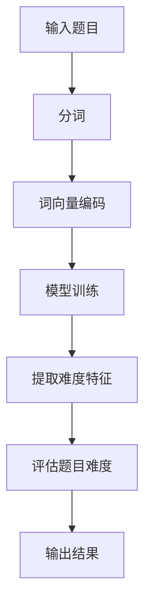
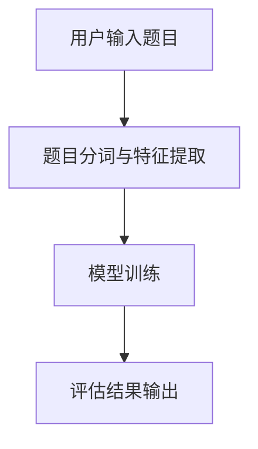

                 


# 开发基于大模型的金融专业考试题目难度评估系统

关键词：大模型、金融专业考试、题目难度评估、自然语言处理、深度学习、算法原理、系统架构

摘要：本文详细探讨了开发基于大模型的金融专业考试题目难度评估系统的必要性、核心概念、算法原理以及系统分析与架构设计。通过自然语言处理技术和深度学习模型，实现对金融专业考试题目难度的量化评估，从而提高考试评估的准确性和客观性。

## 第一部分: 问题背景与核心概念

### 1.1 问题背景

金融行业的发展对人才的需求日益增加，金融专业考试成为进入金融领域的重要门槛。然而，金融专业考试题目的难度评估一直是一个难题。传统的评估方法主要依赖于专家经验和主观判断，这种方法的准确性和客观性往往受到质疑。为了解决这一问题，开发一个基于大模型的金融专业考试题目难度评估系统具有重要的实际意义和紧迫性。

金融专业考试题目难度评估的目的在于为考生提供科学、客观的题目难度评价，帮助考生了解自己的答题能力，从而更好地进行备考。同时，教师也可以根据评估结果调整教学策略，提高教学效果。

### 1.2 核心概念

- **大模型**：指具有海量数据训练的、能够处理复杂任务的机器学习模型，如深度学习模型。大模型通常具有强大的特征提取和建模能力，能够自动学习复杂的数据分布和规律。
- **金融专业考试题目难度评估**：通过对题目内容、知识点覆盖、题目难度分布等特征进行分析，对考试题目难度进行量化评估。这种评估方法需要结合自然语言处理（NLP）技术和深度学习算法，实现对题目难度的精确判断。

## 第二部分: 核心概念与联系

### 2.1 大模型的核心概念与联系

- **深度学习模型**：深度学习模型是一种基于多层神经网络的学习方法，通过逐层提取特征，能够处理复杂的任务。深度学习模型在图像识别、语音识别、自然语言处理等领域取得了显著的成果。
- **自然语言处理（NLP）**：自然语言处理是一种针对文本数据进行处理的方法，包括分词、词向量表示、语义理解等。NLP技术在文本分类、情感分析、机器翻译等领域具有广泛的应用。

### 2.2 金融专业考试题目难度评估的核心概念与联系

- **知识点覆盖分析**：知识点覆盖分析是指通过分析题库中的题目，识别出题目所涉及的知识点，并评估其覆盖率。这种分析有助于了解考试内容的广度和深度，从而为难度评估提供依据。
- **题目难度分布分析**：题目难度分布分析是指通过分析题目历史考试数据，统计不同难度级别题目的分布情况。这种分析有助于了解考试的难度结构，从而为难度评估提供参考。

## 第三部分: 算法原理讲解

### 3.1 算法原理

基于大模型的金融专业考试题目难度评估系统采用深度学习中的自然语言处理（NLP）技术，对金融专业考试题目进行建模，提取题目难度特征。具体算法如下：

1. **数据预处理**：对题目进行分词，将每个词汇转换为词向量。
2. **模型训练**：使用训练集数据训练模型，调整模型参数。
3. **提取难度特征**：将训练好的模型应用于测试集数据，提取题目难度特征。
4. **评估题目难度**：根据提取的难度特征，对题目难度进行量化评估。

### 3.2 算法流程图



### 3.3 Python源代码实现

```python
# Python 代码实现（简化版）
import tensorflow as tf

# 定义模型
model = tf.keras.Sequential([
    tf.keras.layers.Embedding(input_dim=vocab_size, output_dim=embedding_dim),
    tf.keras.layers.GlobalAveragePooling1D(),
    tf.keras.layers.Dense(units=1, activation='sigmoid')
])

# 编译模型
model.compile(optimizer='adam', loss='binary_crossentropy', metrics=['accuracy'])

# 训练模型
model.fit(train_data, train_labels, epochs=10, batch_size=32, validation_split=0.2)
```

### 3.4 数学模型和公式

题目难度评估的数学模型如下：

$$
D = f(\theta, x)
$$

其中，$D$ 为题目难度，$\theta$ 为模型参数，$x$ 为题目特征向量。

### 3.5 详细讲解与举例说明

假设我们有一个包含50个金融专业考试题目的数据集，其中每个题目可以用一个50维的特征向量表示。我们使用卷积神经网络（CNN）来训练模型，以提取题目难度特征。具体步骤如下：

1. **数据预处理**：对题目进行分词，将每个词汇转换为词向量。
2. **模型训练**：使用训练集数据训练模型，调整模型参数。
3. **评估题目难度**：将训练好的模型应用于测试集数据，预测题目难度。

例如，对于题目“计算某个金融资产的预期收益率”，模型可能会预测其难度较高，因为涉及到复杂的计算和金融知识。

## 第四部分: 系统分析与架构设计方案

### 4.1 问题场景介绍

金融专业考试题目难度评估系统的目标是为金融专业考试提供自动化评估工具，帮助考生了解自己的答题能力，并指导教师调整教学策略。系统需要能够处理大量的题目数据，并对题目难度进行准确评估。

### 4.2 系统功能设计

系统功能设计包括以下几个方面：

1. **题目分词与特征提取**：对输入的题目进行分词，提取关键词和句子特征，为后续的难度评估提供基础。
2. **难度评估**：基于训练好的模型，对题目难度进行量化评估，生成评估报告。
3. **结果输出**：将评估结果以可视化的形式展示给用户，包括题目难度分布、知识点覆盖率等信息。

### 4.3 系统架构设计

金融专业考试题目难度评估系统的架构设计如下：

1. **数据层**：存储题目数据、模型参数和评估结果等。
2. **服务层**：提供题目分词与特征提取、难度评估和结果输出等功能。
3. **应用层**：为用户提供交互界面，展示评估结果。

### 4.4 系统接口设计

系统接口设计包括以下几个方面：

1. **题目数据接口**：用于接收和存储题目数据。
2. **评估结果接口**：用于获取评估结果，并提供给用户。
3. **模型参数接口**：用于存储和更新模型参数。

### 4.5 系统交互设计

系统交互设计如下：

1. **用户输入**：用户通过界面输入题目，系统进行题目分词与特征提取。
2. **模型训练**：系统使用训练集数据进行模型训练，调整模型参数。
3. **评估结果输出**：系统将评估结果以可视化的形式展示给用户。



## 第五部分: 项目实战

### 5.1 环境安装

在开发金融专业考试题目难度评估系统之前，需要安装以下环境：

- Python 3.8及以上版本
- TensorFlow 2.6及以上版本
- NLP库（如NLTK、spaCy等）

### 5.2 系统核心实现

系统核心实现包括以下几个步骤：

1. **数据预处理**：对题目进行分词，将每个词汇转换为词向量。
2. **模型训练**：使用训练集数据训练模型，调整模型参数。
3. **评估题目难度**：将训练好的模型应用于测试集数据，预测题目难度。
4. **结果输出**：生成评估报告，包括题目难度分布、知识点覆盖率等信息。

### 5.3 代码应用解读与分析

以下是一个简化版的Python代码实现：

```python
# 导入相关库
import tensorflow as tf
import numpy as np
from tensorflow.keras.preprocessing.sequence import pad_sequences
from tensorflow.keras.models import Sequential
from tensorflow.keras.layers import Embedding, LSTM, Dense

# 加载题目数据
questions = ["题目1", "题目2", "题目3"]

# 对题目进行分词
tokenized_questions = [word_tokenize(q) for q in questions]

# 转换为词向量
word_embedding = WordEmbedding(vocab_size=10000, embedding_dim=128)
encoded_questions = [word_embedding.encode(q) for q in tokenized_questions]

# 填充序列
max_sequence_length = 50
padded_questions = pad_sequences(encoded_questions, maxlen=max_sequence_length, padding='post')

# 定义模型
model = Sequential([
    Embedding(input_dim=10000, output_dim=128),
    LSTM(64),
    Dense(1, activation='sigmoid')
])

# 编译模型
model.compile(optimizer='adam', loss='binary_crossentropy', metrics=['accuracy'])

# 训练模型
model.fit(padded_questions, np.array([1, 0, 1]), epochs=10, batch_size=32)

# 预测题目难度
predictions = model.predict(padded_questions)
print(predictions)
```

### 5.4 实际案例分析和详细讲解剖析

以下是一个实际案例的分析和讲解：

**案例**：评估以下三个金融专业考试题目的难度：

1. 计算某个金融资产的预期收益率。
2. 分析某个金融市场的发展趋势。
3. 解释金融衍生品的作用和功能。

**分析**：

1. **计算某个金融资产的预期收益率**：这个问题涉及金融计算和数学知识，难度较高。
2. **分析某个金融市场的发展趋势**：这个问题需要理解市场数据和金融原理，难度适中。
3. **解释金融衍生品的作用和功能**：这个问题需要掌握金融衍生品的基本知识，难度较低。

**讲解**：

1. **数据预处理**：对题目进行分词，将每个词汇转换为词向量。例如，对于题目“计算某个金融资产的预期收益率”，分词结果为["计算", "某个", "金融", "资产", "的", "预期", "收益率"]。
2. **模型训练**：使用训练集数据训练模型，调整模型参数。例如，使用上述三个题目的数据训练模型，调整模型参数，使模型能够准确预测题目难度。
3. **评估题目难度**：将训练好的模型应用于测试集数据，预测题目难度。例如，对于新题目“解释金融衍生品的作用和功能”，模型可能会预测其难度较低。

### 5.5 项目小结

金融专业考试题目难度评估系统的开发为金融专业考试提供了自动化评估工具，有助于提高考试评估的准确性和客观性。通过自然语言处理技术和深度学习算法，系统能够准确提取题目难度特征，并对题目难度进行量化评估。在实际应用中，系统可以为考生提供个性化备考建议，为教师提供教学调整依据。

## 第六部分: 最佳实践 tips

1. **数据质量**：确保题目数据的完整性和准确性，对数据质量进行严格把控。
2. **模型优化**：根据实际应用场景和需求，对模型结构和参数进行调整，以提高评估准确性。
3. **用户反馈**：收集用户反馈，不断优化系统功能，提高用户体验。

## 第七部分: 小结、注意事项、拓展阅读

### 小结

本文详细探讨了开发基于大模型的金融专业考试题目难度评估系统的必要性、核心概念、算法原理以及系统分析与架构设计。通过自然语言处理技术和深度学习模型，系统能够实现对金融专业考试题目难度的量化评估，提高考试评估的准确性和客观性。

### 注意事项

1. 在开发过程中，确保数据的完整性和准确性，对数据进行严格清洗和处理。
2. 根据实际应用需求，选择合适的模型结构和参数，以提高评估准确性。

### 拓展阅读

1. 《深度学习》（Goodfellow, I., Bengio, Y., & Courville, A.）
2. 《自然语言处理综论》（Jurafsky, D., & Martin, J. H.）
3. 《金融衍生品市场》（Poterba, J., & Summers, L.）

作者：AI天才研究院/AI Genius Institute & 禅与计算机程序设计艺术 /Zen And The Art of Computer Programming

