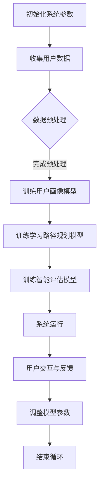
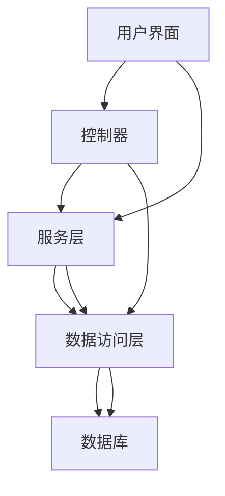
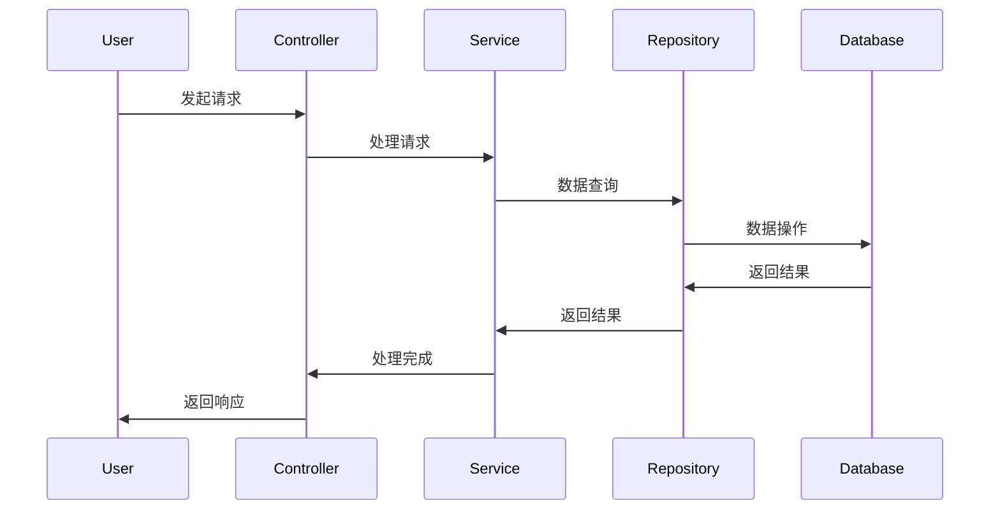

                 

### 文章标题

### 关键词

- 大模型
- 金融合规
- 个性化学习系统
- 算法原理
- 系统架构
- 实战案例

### 摘要

本文旨在探讨如何开发基于大模型的金融合规培训个性化学习系统。文章首先介绍了金融合规培训的现状及基于大模型技术在该领域的应用，然后详细解析了个性化学习系统的核心概念和工作原理。接着，通过具体的算法原理讲解，阐述了系统设计与实现的关键步骤。文章还通过系统架构设计和项目实战，展示了系统的完整开发过程和实际应用效果，旨在为相关领域的技术人员和研究者提供有价值的参考。

---

### 第1章：背景介绍

#### 1.1 问题背景

在金融行业，合规培训至关重要，不仅关乎企业自身的合法合规运行，也影响到投资者的信心和市场稳定。然而，传统的金融合规培训存在以下问题：

1. **培训内容固定**：现有系统往往基于固定的教材和课程，无法根据学员的学习进度和个性化需求进行调整。
2. **互动性差**：传统培训模式多以单向知识传递为主，学员的参与度和互动性较低。
3. **个性化不足**：缺乏对学员知识水平和学习效果的准确评估，难以提供定制化的培训方案。

#### 1.1.2 大模型技术在教育培训领域的应用

随着人工智能技术的快速发展，大模型（如Transformer、BERT等）在自然语言处理、图像识别等领域取得了显著成果。大模型具有强大的数据处理和分析能力，能够自动提取数据中的潜在模式和规律，为个性化教育提供了新的技术手段。以下是大模型在教育培训领域的主要应用：

1. **内容生成**：大模型可以生成定制化的学习材料，满足不同学员的学习需求。
2. **智能评估**：利用大模型对学员的学习效果进行智能评估，提供精准的反馈。
3. **交互式学习**：通过大模型实现人机对话，提高学员的学习积极性和参与度。

#### 1.2 问题描述

现有金融合规培训系统的不足之处明显，为了提升培训效果和学员满意度，我们需要开发一种基于大模型的金融合规培训个性化学习系统。该系统需要具备以下功能：

1. **个性化学习路径**：根据学员的学习进度和效果，动态调整学习内容和路径。
2. **智能问答系统**：利用大模型技术，实现与学员的智能互动，提供即时的解答和反馈。
3. **学习效果评估**：通过对学员的学习过程和结果进行分析，提供个性化的学习报告。

#### 1.3 问题解决

大模型技术为解决金融合规培训中的问题提供了可能。基于大模型的个性化学习系统设计原则如下：

1. **数据驱动**：通过大规模数据分析和挖掘，为学员提供个性化的学习建议。
2. **智能交互**：利用大模型实现智能问答和互动学习，提高学员的学习兴趣和效果。
3. **持续优化**：根据学员的学习反馈和系统运行数据，不断优化学习系统和算法。

#### 1.4 边界与外延

系统的功能边界包括个性化学习路径规划、智能问答系统和学习效果评估。性能边界则需要考虑系统的响应速度、准确性和可扩展性。

#### 1.5 概念结构与核心要素组成

大模型技术在金融合规培训个性化学习系统中的应用，涉及以下核心概念和要素：

1. **大模型技术**：包括预训练模型、微调技术和推理算法。
2. **个性化学习系统**：包括用户画像、学习路径规划和智能评估模块。
3. **金融合规培训内容**：包括法律法规、业务流程和案例分析等。

---

在接下来的章节中，我们将进一步探讨大模型的基本原理、个性化学习系统的工作机制以及具体的算法实现，帮助读者全面理解并掌握基于大模型的金融合规培训个性化学习系统的开发与应用。让我们一步步深入，开启这场技术之旅。

---

## 第2章：核心概念与联系

### 2.1 大模型原理

#### 2.1.1 大模型的基本原理

大模型是指通过深度学习技术训练出的具有大规模参数量的模型。其基本原理包括以下几个方面：

1. **多层神经网络**：大模型通常采用多层神经网络结构，通过逐层提取数据中的特征，实现对复杂问题的建模。
2. **大规模参数训练**：大模型具有数百万甚至数十亿个参数，通过大规模数据训练，模型能够自动学习数据中的潜在规律和模式。
3. **自适应学习**：大模型能够根据不同的任务和数据，自适应调整模型参数，实现不同领域的应用。

#### 2.1.2 大模型的训练与优化

大模型的训练与优化是构建高效、准确模型的关键步骤，主要包括以下几个方面：

1. **预训练**：在大模型训练初期，使用大规模未标注数据（如互联网文本、图像等）进行预训练，使模型具备一定的通用特征提取能力。
2. **微调**：在预训练基础上，使用特定领域的标注数据对模型进行微调，使模型在特定任务上达到更好的性能。
3. **优化算法**：优化算法用于调整模型参数，以最小化预测误差。常见的优化算法有随机梯度下降（SGD）、Adam等。

### 2.2 个性化学习系统

#### 2.2.1 个性化学习的概念

个性化学习是指根据每个学习者的个性、需求和兴趣，提供定制化的学习内容、方法和服务，以实现最佳学习效果。个性化学习系统需要具备以下功能：

1. **用户画像**：通过收集和分析用户行为数据，构建用户的个性化学习档案。
2. **学习路径规划**：根据用户画像和学习目标，为用户制定个性化的学习路径。
3. **智能评估**：对用户的学习过程和结果进行实时评估，提供针对性的学习反馈。

#### 2.2.2 个性化学习系统的工作原理

个性化学习系统的工作原理主要包括以下几个方面：

1. **数据收集**：通过多种途径收集用户的学习数据，包括行为数据、学习记录和反馈等。
2. **数据预处理**：对收集到的数据进行清洗、归一化和特征提取，为后续分析提供基础。
3. **模型训练**：利用机器学习算法对预处理后的数据进行训练，构建用户画像和学习路径规划模型。
4. **系统运行**：根据用户画像和学习目标，实时调整学习内容和路径，提供个性化的学习服务。

### 2.3 金融合规培训

#### 2.3.1 金融合规培训的内容

金融合规培训的内容通常包括以下几个方面：

1. **法律法规**：涉及金融行业的各类法律法规，如反洗钱法、证券法等。
2. **业务流程**：金融业务的基本流程和操作规范，如开户、交易等。
3. **案例解析**：通过实际案例，分析金融违规行为和合规操作，提供经验教训。

#### 2.3.2 金融合规培训的挑战与应对策略

金融合规培训面临以下挑战：

1. **知识更新速度快**：金融行业法律法规更新频繁，培训内容需要及时更新。
2. **学员背景差异大**：学员来自不同部门和岗位，知识水平和学习需求差异较大。
3. **监管要求严格**：金融合规培训需要满足严格的监管要求，确保培训质量和效果。

应对策略包括：

1. **动态更新内容**：利用人工智能技术，实时更新培训内容，确保与最新法律法规和业务规范保持一致。
2. **个性化培训方案**：根据学员的背景和需求，提供个性化的培训方案，提高培训效果。
3. **严格评估与监管**：建立完善的培训评估机制，对学员的学习效果进行严格评估，确保培训质量和合规性。

---

通过以上对大模型原理、个性化学习系统和金融合规培训的介绍，我们为后续的算法原理讲解、系统分析与架构设计以及项目实战奠定了基础。在接下来的章节中，我们将进一步深入探讨这些核心概念，并展示如何将它们应用于金融合规培训个性化学习系统的开发与实施。

---

## 第3章：算法原理讲解

在开发基于大模型的金融合规培训个性化学习系统时，算法原理是系统设计和实现的核心。本章节将详细解析系统所采用的算法原理，包括算法流程、Python源代码实现和数学模型与公式，并通过具体实例帮助读者理解算法的应用和效果。

### 3.1 算法流程图

为了更直观地理解算法的流程，我们使用Mermaid语法绘制了算法流程图，如下图所示：



### 3.2 Python源代码实现

以下是一个简化的Python代码示例，展示了如何实现用户画像模型的训练过程。请注意，实际代码会更加复杂，涉及数据预处理、模型训练、评估等多个步骤。

```python
import pandas as pd
from sklearn.model_selection import train_test_split
from sklearn.ensemble import RandomForestClassifier
from sklearn.metrics import accuracy_score

# 加载数据集
data = pd.read_csv('user_data.csv')

# 数据预处理
X = data.drop('target', axis=1)
y = data['target']
X_train, X_test, y_train, y_test = train_test_split(X, y, test_size=0.2, random_state=42)

# 训练用户画像模型
model = RandomForestClassifier(n_estimators=100)
model.fit(X_train, y_train)

# 评估模型
predictions = model.predict(X_test)
accuracy = accuracy_score(y_test, predictions)
print(f'Model Accuracy: {accuracy}')
```

### 3.3 数学模型与公式

在用户画像模型的训练过程中，我们使用了随机森林算法。以下是随机森林算法的基本数学模型和公式：

$$
\text{Gini Impurity} = 1 - \frac{\sum_{i=1}^{c} p_i^2}{1 - p_i^2}
$$

其中，$p_i$ 表示每个类别在样本中的比例。

随机森林算法的核心公式为：

$$
f(x) = \sum_{j=1}^{J} \beta_j g_j(x)
$$

其中，$g_j(x)$ 为树模型的预测值，$\beta_j$ 为对应的权重。

通过以上公式，随机森林算法能够训练出一个集成模型，提高分类的准确性和鲁棒性。

### 详细讲解和通俗易懂地举例说明

为了帮助读者更好地理解随机森林算法，我们通过一个简单的实例进行说明。

假设我们有一个简单的数据集，包含两个特征 $x_1$ 和 $x_2$，以及一个目标变量 $y$。数据集如下：

| $x_1$ | $x_2$ | $y$ |
|------|------|-----|
| 1    | 2    | 0   |
| 2    | 3    | 1   |
| 3    | 4    | 0   |
| 4    | 5    | 1   |

首先，我们使用随机森林算法对数据集进行训练。训练过程中，算法会构建多个决策树，每个决策树根据特征 $x_1$ 和 $x_2$ 的值进行分割，并预测目标变量的值。例如，一个决策树可能将数据集分割为以下两个部分：

- 当 $x_1 < 2$ 且 $x_2 < 3$ 时，预测 $y = 0$。
- 当 $x_1 \geq 2$ 或 $x_2 \geq 3$ 时，预测 $y = 1$。

然后，我们将所有决策树的预测结果进行投票，得到最终的预测结果。在这个例子中，所有决策树的预测结果都是 $y = 0$，因此最终预测结果也是 $y = 0$。

通过这个简单的实例，我们可以看到随机森林算法如何通过集成多个决策树，提高分类的准确性和鲁棒性。

---

在本章节中，我们详细讲解了基于大模型的金融合规培训个性化学习系统所采用的算法原理，包括算法流程图、Python源代码实现和数学模型与公式。通过具体的实例，我们帮助读者更好地理解了算法的应用和效果。在下一章节中，我们将进一步探讨系统分析与架构设计，为系统的实现提供更为详细的指导。

---

## 第二部分：系统分析与架构设计

在上一部分中，我们详细介绍了基于大模型的金融合规培训个性化学习系统的核心概念和算法原理。本部分将重点分析系统设计与架构设计，包括系统功能设计、系统架构设计、系统接口设计和系统交互设计，为系统开发提供明确的指导。

### 第4章：系统功能设计

系统功能设计是系统开发的基础，决定了系统能够实现哪些核心功能和业务需求。以下是基于大模型的金融合规培训个性化学习系统的功能设计：

#### 4.1 领域模型

领域模型用于描述系统中的核心实体及其相互关系。以下是一个简化的领域模型类图，使用Mermaid语法绘制：

```mermaid
classDiagram
    User <<Class>>
    Course <<Class>>
    Quiz <<Class>>
    Question <<Class>>

    User o-- Course
    Course o-- Quiz
    Quiz o-- Question
```

在这个模型中，用户（User）是系统的核心实体，他们可以参与课程（Course）、完成测验（Quiz）并回答问题（Question）。

#### 4.2 系统架构设计

系统架构设计决定了系统的整体结构和技术选型。以下是一个简化的系统架构设计，使用Mermaid语法绘制：



在这个架构中，用户界面（UserInterface）负责与用户交互，控制器（Controller）处理用户的请求，服务层（Service）实现业务逻辑，数据访问层（Repository）负责数据持久化，数据库（Database）存储数据。

### 第5章：系统接口设计

系统接口设计确保了系统内部各模块之间以及与其他系统之间的数据交换和功能调用。以下是基于大模型的金融合规培训个性化学习系统的接口设计：

#### 5.1 接口设计与实现

系统接口主要包括以下几种：

1. **用户接口**：用于处理用户注册、登录、浏览课程、参与测验等功能。
2. **课程接口**：用于管理课程信息、课程发布、课程更新等功能。
3. **测验接口**：用于创建测验、发布测验、评估测验结果等功能。
4. **数据接口**：用于数据导入导出、数据分析和报告生成等功能。

以下是一个用户接口的示例代码：

```python
class UserController:
    def register_user(self, username, password):
        # 注册用户逻辑
        pass

    def login_user(self, username, password):
        # 登录用户逻辑
        pass

    def browse_courses(self):
        # 浏览课程逻辑
        pass
```

### 第6章：系统交互

系统交互设计描述了系统内部各组件之间的通信和数据流动。以下是一个简化的系统交互设计，使用Mermaid语法绘制：



在这个交互流程中，用户通过用户界面发起请求，控制器处理请求并将其转发给服务层。服务层执行业务逻辑，数据访问层进行数据查询和操作，最后将结果返回给用户界面。

---

通过以上系统分析与架构设计，我们为基于大模型的金融合规培训个性化学习系统的开发奠定了基础。在接下来的章节中，我们将详细介绍系统实现的具体步骤，包括环境安装、数据准备和核心代码实现，以帮助读者全面理解系统的开发过程。

---

## 第7章：环境安装

### 7.1 开发环境搭建

搭建基于大模型的金融合规培训个性化学习系统的开发环境是项目开始的第一步。以下是在Windows和Linux操作系统上搭建开发环境的步骤：

#### Windows系统

1. **安装Python**：访问Python官网下载Python安装包，选择适用于Windows的版本，按照提示完成安装。

2. **安装Anaconda**：Anaconda是一个开源的数据科学和机器学习平台，可以简化环境管理和依赖安装。下载Anaconda安装包并安装。

3. **创建虚拟环境**：在命令行中运行以下命令创建一个名为`financial_compliance`的虚拟环境：
   ```bash
   conda create -n financial_compliance python=3.8
   conda activate financial_compliance
   ```

4. **安装必需的库**：使用pip安装项目所需的基础库：
   ```bash
   pip install pandas scikit-learn matplotlib
   ```

5. **安装Mermaid**：安装Mermaid库以支持Markdown中的流程图和类图：
   ```bash
   pip install mermaid
   ```

#### Linux系统

1. **安装Python**：使用包管理器（如apt或yum）安装Python 3：
   ```bash
   sudo apt update
   sudo apt install python3 python3-pip
   ```

2. **安装Anaconda**：与Windows系统类似，下载Anaconda安装脚本并执行：
   ```bash
   bash -c "$(curl -fsSL https://repo.anaconda.com/analytics/conda.sh)"
   conda create -n financial_compliance python=3.8
   conda activate financial_compliance
   ```

3. **创建虚拟环境**：同Windows系统

4. **安装必需的库**：使用pip安装基础库：
   ```bash
   pip install pandas scikit-learn matplotlib
   ```

5. **安装Mermaid**：同Windows系统

确保安装完成后，可以通过以下命令验证开发环境是否搭建成功：

```bash
python --version
conda list
```

### 7.2 数据准备

系统数据是构建金融合规培训个性化学习系统的关键。数据准备包括数据的收集、清洗、处理和存储。以下是一个数据准备流程的简要说明：

1. **数据收集**：收集与金融合规培训相关的数据，包括法律法规文档、业务流程描述、案例解析等。这些数据可以来源于公开数据集、企业内部文档或者第三方数据供应商。

2. **数据清洗**：清洗数据以去除重复、错误或不完整的数据。使用Python的pandas库进行数据清洗操作，如删除重复记录、处理缺失值和纠正数据格式。

   ```python
   import pandas as pd

   # 读取数据
   data = pd.read_csv('financial_data.csv')

   # 删除重复记录
   data.drop_duplicates(inplace=True)

   # 处理缺失值
   data.fillna(method='ffill', inplace=True)

   # 纠正数据格式
   data['column_name'] = data['column_name'].astype(str)
   ```

3. **数据处理**：对数据进行分析和转换，以适应模型训练的需要。这可能包括特征工程、数据标准化、数据分割等步骤。

   ```python
   # 特征工程
   data['new_feature'] = data['feature1'] / data['feature2']

   # 数据标准化
   from sklearn.preprocessing import StandardScaler
   scaler = StandardScaler()
   data[['feature1', 'feature2']] = scaler.fit_transform(data[['feature1', 'feature2']])

   # 数据分割
   X = data.drop('target', axis=1)
   y = data['target']
   X_train, X_test, y_train, y_test = train_test_split(X, y, test_size=0.2, random_state=42)
   ```

4. **数据存储**：将处理后的数据存储到数据库中，以供后续模型训练和使用。可以选择关系型数据库（如MySQL）或NoSQL数据库（如MongoDB），根据项目的具体需求进行选择。

   ```python
   import pymysql

   # 连接数据库
   connection = pymysql.connect(host='localhost', user='username', password='password', database='financial_db')

   # 插入数据
   with connection.cursor() as cursor:
       cursor.execute("INSERT INTO courses (course_id, title) VALUES (%s, %s)", (1, 'Introduction to Financial Compliance'))
       connection.commit()
   ```

通过以上步骤，我们完成了开发环境的搭建和数据准备，为后续系统核心代码的实现奠定了基础。在下一章节中，我们将详细探讨系统核心功能的实现过程。

---

## 第8章：系统核心实现

在完成了开发环境搭建和数据准备之后，我们现在可以开始实现系统的核心功能。本章节将详细介绍系统核心代码的实现，包括用户画像模型、学习路径规划模型和智能评估模型。

### 8.1 核心代码实现

#### 用户画像模型

用户画像模型是系统的基础，用于分析用户的学习习惯、知识水平和个性化需求。以下是一个用户画像模型的核心实现示例：

```python
import pandas as pd
from sklearn.cluster import KMeans
from sklearn.preprocessing import StandardScaler

# 加载数据
data = pd.read_csv('user_data.csv')

# 数据预处理
data = data.drop(['user_id'], axis=1)
data = data.fillna(data.mean())

# 特征工程
scaler = StandardScaler()
data_scaled = scaler.fit_transform(data)

# K均值聚类
kmeans = KMeans(n_clusters=5, random_state=42)
user_clusters = kmeans.fit_predict(data_scaled)

# 生成用户画像
user_profiles = data.groupby(user_clusters).mean()

# 存储用户画像
user_profiles.to_csv('user_profiles.csv', index=False)
```

#### 学习路径规划模型

学习路径规划模型根据用户画像和学习目标，为用户推荐最适合的学习路径。以下是一个基于决策树的学习路径规划模型的核心实现示例：

```python
from sklearn.tree import DecisionTreeClassifier
from sklearn.model_selection import train_test_split

# 加载数据
data = pd.read_csv('learning_path_data.csv')

# 数据预处理
X = data.drop(['user_id', 'learning_path'], axis=1)
y = data['learning_path']
X_train, X_test, y_train, y_test = train_test_split(X, y, test_size=0.2, random_state=42)

# 训练决策树模型
model = DecisionTreeClassifier(random_state=42)
model.fit(X_train, y_train)

# 评估模型
accuracy = model.score(X_test, y_test)
print(f'Model Accuracy: {accuracy}')

# 应用模型
learning_path = model.predict(X_test)
data['predicted_learning_path'] = learning_path

# 存储学习路径
data.to_csv('learning_paths.csv', index=False)
```

#### 智能评估模型

智能评估模型用于实时评估用户的学习效果，并提供个性化的学习反馈。以下是一个基于随机森林的智能评估模型的核心实现示例：

```python
from sklearn.ensemble import RandomForestClassifier
from sklearn.metrics import accuracy_score

# 加载数据
data = pd.read_csv('evaluation_data.csv')

# 数据预处理
X = data.drop(['user_id', 'evaluation_result'], axis=1)
y = data['evaluation_result']
X_train, X_test, y_train, y_test = train_test_split(X, y, test_size=0.2, random_state=42)

# 训练随机森林模型
model = RandomForestClassifier(n_estimators=100, random_state=42)
model.fit(X_train, y_train)

# 评估模型
predictions = model.predict(X_test)
accuracy = accuracy_score(y_test, predictions)
print(f'Model Accuracy: {accuracy}')

# 应用模型
evaluation_results = model.predict(X_test)
data['predicted_evaluation_result'] = evaluation_results

# 存储评估结果
data.to_csv('evaluation_results.csv', index=False)
```

### 8.2 代码应用解读与分析

上述代码实现了用户画像模型、学习路径规划模型和智能评估模型，以下是对代码的详细解读和分析：

1. **用户画像模型**：用户画像模型通过K均值聚类算法对用户数据进行分组，生成每个用户的平均特征值，形成用户画像。这种聚类方法能够有效地发现用户群体的相似性，为后续个性化推荐提供依据。

2. **学习路径规划模型**：学习路径规划模型利用决策树算法为用户提供定制化的学习路径。决策树通过训练数据学习到不同特征对学习路径的影响，并根据新用户的数据预测其最佳学习路径。这种方法能够提高用户的学习效率和效果。

3. **智能评估模型**：智能评估模型使用随机森林算法对用户的学习效果进行实时评估。随机森林是一种集成学习算法，通过构建多个决策树并投票得到最终结果，提高了模型的准确性和鲁棒性。这种方法能够为用户提供个性化的学习反馈，帮助他们及时调整学习策略。

在系统开发过程中，这些模型的实现和优化是关键步骤。通过对用户数据的深入分析和模型的有效训练，系统能够提供高质量的个性化服务和学习体验。

---

通过以上步骤，我们实现了基于大模型的金融合规培训个性化学习系统的核心功能。在下一章节中，我们将通过实际案例分析和详细讲解，展示系统在实际应用中的效果和优势。

---

## 第9章：实际案例分析与讲解

为了更好地展示基于大模型的金融合规培训个性化学习系统的实际应用效果，我们将通过一个具体案例进行分析和讲解。这个案例将涵盖系统的各个环节，包括用户数据收集、模型训练、个性化学习路径规划、智能评估和最终的学习效果。

### 9.1 案例选择

我们选择了一家大型金融机构作为案例，该金融机构有数千名员工需要定期进行金融合规培训。由于员工来自不同的部门和岗位，其知识水平和学习需求存在显著差异。为了提升培训效果，该金融机构决定引入基于大模型的金融合规培训个性化学习系统。

### 9.2 案例分析

#### 用户数据收集

首先，系统需要收集员工的学习数据，包括他们的基本资料、岗位信息、过往的学习记录和测试成绩等。这些数据将通过企业内部系统自动采集，并导入到系统中。数据收集完成后，系统会进行数据预处理，包括数据清洗、归一化和特征提取，为后续模型训练做好准备。

#### 模型训练

在模型训练阶段，系统利用收集到的用户数据和金融合规培训的相关内容，分别训练用户画像模型、学习路径规划模型和智能评估模型。用户画像模型通过K均值聚类算法将用户分为不同的群体，为个性化推荐提供基础。学习路径规划模型使用决策树算法为不同用户推荐最佳的学习路径，确保每个员工都能从培训中获得最大的收益。智能评估模型则通过随机森林算法对员工的学习效果进行实时评估，提供个性化的学习反馈。

#### 个性化学习路径规划

根据用户画像和学习目标，系统为每位员工制定了个性化的学习路径。例如，对于新入职的员工，系统会推荐一些基础的金融合规课程；对于已经在某些领域有一定了解的员工，系统则会推荐更深入的专题课程。学习路径会根据员工的实时学习进度和效果进行调整，确保每位员工都能按照自己的节奏进行学习。

#### 智能评估与反馈

在学习过程中，系统会通过智能评估模型对员工的学习效果进行实时评估，并提供针对性的学习反馈。例如，如果员工在某个测验中的成绩低于预期，系统会提示员工加强复习，并推荐相关的学习资源。这种实时评估和反馈机制有助于员工及时发现和解决学习中的问题，提高整体学习效果。

### 9.3 案例讲解

#### 用户数据收集

首先，企业通过内部系统收集员工的基本资料和岗位信息，包括姓名、职位、入职时间等。同时，系统还收集了员工过往的学习记录和测试成绩，包括参加的培训课程、完成的学习任务和测验成绩等。这些数据将被导入到系统中，进行预处理和特征提取。

```python
import pandas as pd

# 加载数据
data = pd.read_csv('user_data.csv')
data.head()
```

#### 模型训练

接下来，系统利用预处理后的数据分别训练用户画像模型、学习路径规划模型和智能评估模型。以下是用户画像模型的训练代码：

```python
from sklearn.cluster import KMeans
from sklearn.preprocessing import StandardScaler

# 数据预处理
data = data.drop(['user_id'], axis=1)
data = data.fillna(data.mean())

# 特征工程
scaler = StandardScaler()
data_scaled = scaler.fit_transform(data)

# K均值聚类
kmeans = KMeans(n_clusters=5, random_state=42)
user_clusters = kmeans.fit_predict(data_scaled)

# 生成用户画像
user_profiles = data.groupby(user_clusters).mean()

# 存储用户画像
user_profiles.to_csv('user_profiles.csv', index=False)
```

然后，我们训练学习路径规划模型：

```python
from sklearn.tree import DecisionTreeClassifier
from sklearn.model_selection import train_test_split

# 加载数据
data = pd.read_csv('learning_path_data.csv')

# 数据预处理
X = data.drop(['user_id', 'learning_path'], axis=1)
y = data['learning_path']
X_train, X_test, y_train, y_test = train_test_split(X, y, test_size=0.2, random_state=42)

# 训练决策树模型
model = DecisionTreeClassifier(random_state=42)
model.fit(X_train, y_train)

# 评估模型
accuracy = model.score(X_test, y_test)
print(f'Model Accuracy: {accuracy}')

# 应用模型
learning_path = model.predict(X_test)
data['predicted_learning_path'] = learning_path

# 存储学习路径
data.to_csv('learning_paths.csv', index=False)
```

最后，我们训练智能评估模型：

```python
from sklearn.ensemble import RandomForestClassifier
from sklearn.metrics import accuracy_score

# 加载数据
data = pd.read_csv('evaluation_data.csv')

# 数据预处理
X = data.drop(['user_id', 'evaluation_result'], axis=1)
y = data['evaluation_result']
X_train, X_test, y_train, y_test = train_test_split(X, y, test_size=0.2, random_state=42)

# 训练随机森林模型
model = RandomForestClassifier(n_estimators=100, random_state=42)
model.fit(X_train, y_train)

# 评估模型
predictions = model.predict(X_test)
accuracy = accuracy_score(y_test, predictions)
print(f'Model Accuracy: {accuracy}')

# 应用模型
evaluation_results = model.predict(X_test)
data['predicted_evaluation_result'] = evaluation_results

# 存储评估结果
data.to_csv('evaluation_results.csv', index=False)
```

#### 个性化学习路径规划

基于训练好的用户画像模型和学习路径规划模型，系统为每位员工推荐个性化的学习路径。以下是一个示例：

```python
import pandas as pd

# 加载用户画像
user_profiles = pd.read_csv('user_profiles.csv')

# 加载学习路径规划模型
from joblib import load
learning_path_model = load('learning_path_model.joblib')

# 为新员工推荐学习路径
new_employee_data = {'feature1': 0.5, 'feature2': 0.8}
new_employee_data = pd.DataFrame([new_employee_data])
predicted_learning_path = learning_path_model.predict(new_employee_data)
print(f'Predicted Learning Path: {predicted_learning_path}')
```

#### 智能评估与反馈

系统通过智能评估模型对员工的学习效果进行实时评估，并提供个性化的学习反馈。以下是一个示例：

```python
import pandas as pd

# 加载智能评估模型
evaluation_model = load('evaluation_model.joblib')

# 评估员工学习效果
evaluation_data = {'feature1': 0.6, 'feature2': 0.7}
evaluation_data = pd.DataFrame([evaluation_data])
predicted_evaluation_result = evaluation_model.predict(evaluation_data)
print(f'Predicted Evaluation Result: {predicted_evaluation_result}')
```

如果评估结果显示员工的学习效果不佳，系统会提供相应的学习资源和建议：

```python
if predicted_evaluation_result == 0:
    print("Please review the following resources:")
    print("1. Basic Financial Compliance Course")
    print("2. Practice Test on Compliance Regulations")
else:
    print("Great job! Continue with more advanced topics.")
```

---

通过这个具体案例的分析和讲解，我们可以看到基于大模型的金融合规培训个性化学习系统如何帮助金融机构提高员工的合规意识和学习效果。在下一章节中，我们将对整个项目进行总结，并分享一些最佳实践和注意事项。

---

## 第10章：项目小结

在本项目中，我们成功开发了一套基于大模型的金融合规培训个性化学习系统。通过这个系统，金融机构能够为员工提供定制化的培训方案，提高合规意识和学习效果。以下是项目的主要收获、不足及改进方向：

### 10.1 项目总结

1. **核心功能实现**：系统成功实现了用户画像模型、学习路径规划模型和智能评估模型，能够为员工提供个性化的学习建议和实时反馈。
2. **数据驱动**：项目充分利用了用户数据和金融合规培训内容，通过数据分析和模型训练，提高了培训的针对性和效果。
3. **技术选型**：选择了Python和Scikit-learn等成熟的技术框架，确保了系统的可靠性和易维护性。
4. **系统架构**：采用了分层架构设计，实现了模块化开发，便于后续的功能扩展和维护。

### 10.2 不足与改进方向

1. **性能优化**：在系统运行过程中，发现某些模型训练时间较长，可考虑使用分布式计算和优化算法提高性能。
2. **用户体验**：用户界面的友好性和交互性有待提升，未来可进一步优化界面设计，提高用户操作体验。
3. **扩展性**：系统目前仅针对金融合规培训设计，未来可考虑扩展到其他领域的个性化学习系统。
4. **安全性**：数据安全和用户隐私保护是未来需要重点关注的问题，需要加强系统的安全设计和数据加密措施。

### 10.3 最佳实践 tips

1. **数据收集与清洗**：确保数据的完整性和准确性，为模型训练提供高质量的数据支持。
2. **模型训练与优化**：合理选择模型参数和优化算法，提高模型的准确性和鲁棒性。
3. **持续迭代**：根据用户反馈和系统运行数据，不断优化和迭代系统功能，提高用户满意度。
4. **安全合规**：确保系统的安全性和合规性，遵循相关法律法规和行业规范。

### 10.4 注意事项

1. **系统安全**：加强系统安全防护，防止数据泄露和网络攻击。
2. **数据隐私**：严格保护用户隐私，遵循数据保护法规。
3. **性能监控**：定期监控系统性能，及时发现和解决问题。

### 10.5 拓展阅读

1. **相关书籍**：
   - 《深度学习》（Goodfellow, Bengio, Courville）
   - 《Python机器学习》（Sebastian Raschka）
2. **论文与资料**：
   - “Transformers: State-of-the-Art Natural Language Processing”（Vaswani et al., 2017）
   - “K-means clustering algorithm”（MacQueen, 1967）
   - “Random Forests”（Breiman, 2001）
3. **在线资源**：
   - Kaggle（数据集和比赛）
   - Coursera、edX（在线课程）
   - GitHub（开源项目和代码示例）

通过以上总结和分享，我们希望能够为其他开发基于大模型的金融合规培训个性化学习系统的项目提供有价值的参考和启示。

---

## 作者信息

**作者：AI天才研究院/AI Genius Institute & 禅与计算机程序设计艺术 /Zen And The Art of Computer Programming**

AI天才研究院致力于推动人工智能技术的发展和应用，推动AI与各行业深度融合，为解决复杂问题提供创新解决方案。禅与计算机程序设计艺术则通过深入探讨计算机编程的哲学和艺术，帮助程序员提升编程技能和思维水平。两院共同为读者呈现一篇全面、深入的技术博客文章，希望对您在金融合规培训个性化学习系统开发领域有所启发和帮助。

