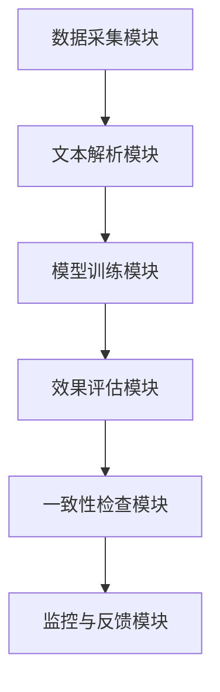
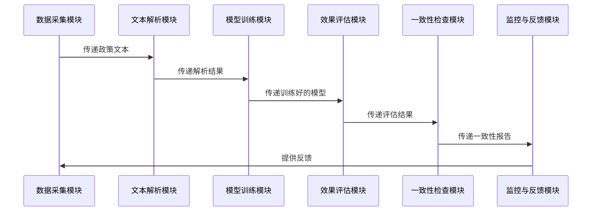

                 

### 引言与背景

#### 问题背景

随着全球金融市场的不断发展和演变，金融政策的制定和解读变得更加复杂和多样化。各类金融政策，如货币政策、财政政策、监管政策等，在维护金融市场稳定、促进经济增长和防范系统性风险方面发挥着至关重要的作用。然而，金融政策的高效解读和一致性检查一直是金融领域的一大挑战。

近年来，人工智能技术，特别是大模型（如深度学习、神经网络等）的迅速发展，为金融政策解读一致性检查带来了新的机遇。大模型具有强大的数据处理和模式识别能力，能够处理海量的金融数据，从中提取关键信息，从而帮助金融机构和政策制定者更好地理解金融政策的内涵和实施效果。

#### 问题描述

在当前金融环境下，存在以下关键问题：

1. **政策理解不一致**：由于不同的政策制定者和解读者对金融政策的理解可能存在差异，导致政策执行时出现偏差。
2. **政策实施效果评估困难**：现有方法难以对金融政策实施的效果进行准确评估，缺乏有效的工具来监测政策的效果。
3. **实时监控与调整需求**：金融市场变化迅速，需要实时监控政策实施的效果，并快速做出调整。

#### 问题解决思路

为了解决上述问题，本文提出了一种基于大模型的金融政策解读一致性检查器。该检查器利用大模型的强大数据处理能力，对金融政策进行深度解读，实现以下目标：

1. **统一政策理解**：通过大模型对金融政策进行深度学习，建立统一的理解模型，减少政策解读的差异。
2. **效果评估与反馈**：利用大模型对政策实施后的数据进行实时分析，评估政策效果，并提供反馈。
3. **实时监控与调整**：通过实时数据流分析，实现金融政策的实时监控和动态调整。

#### 边界与外延

本文讨论的金融政策解读一致性检查器主要应用于以下场景：

1. **中央银行与金融机构**：用于政策制定者和执行者之间的沟通和协调。
2. **监管机构**：用于监控金融机构的合规性和政策实施效果。
3. **金融科技公司**：用于金融产品的开发与优化。

#### 概念结构与核心要素组成

本部分将详细介绍金融政策解读一致性检查器的概念结构，包括以下核心要素：

1. **数据输入**：收集各类金融数据，如政策文本、经济指标、金融市场数据等。
2. **模型训练**：使用深度学习算法对金融政策进行训练，构建政策解读模型。
3. **一致性检查**：通过模型对金融政策实施后的数据进行一致性检查，评估政策效果。
4. **反馈与优化**：根据一致性检查结果，提供反馈，优化政策解读模型。

本文接下来的部分将详细探讨这些核心要素的实现方法和技术细节。

### 核心概念与联系

在构建基于大模型的金融政策解读一致性检查器之前，我们需要明确几个核心概念，并理解它们之间的联系。

#### 大模型的定义与特点

大模型（Large Models）通常指的是具有数亿至数十亿参数的深度学习模型，如GPT（Generative Pre-trained Transformer）、BERT（Bidirectional Encoder Representations from Transformers）等。这些模型具有以下几个显著特点：

1. **强大的数据处理能力**：大模型能够处理海量数据，从中提取有价值的信息。
2. **高度的非线性能力**：大模型通过多层神经网络，能够捕捉数据中的复杂关系。
3. **自适应能力**：通过不断训练和优化，大模型能够适应不同的任务和环境。

#### 金融政策的定义与特点

金融政策（Financial Policy）是指政府或中央银行为维护金融市场稳定、促进经济增长和防范系统性风险所制定的各类政策。金融政策主要包括货币政策、财政政策、监管政策等。其特点如下：

1. **多维度影响**：金融政策通常会对经济、金融市场和社会产生多维度的影响。
2. **复杂性和多样性**：金融政策涉及多个利益相关方，其制定和解读过程复杂，形式多样。
3. **动态调整**：金融市场变化迅速，金融政策需要根据实际情况进行动态调整。

#### 大模型与金融政策的联系

大模型与金融政策之间存在紧密的联系，主要体现在以下几个方面：

1. **政策解读与理解**：大模型能够通过对金融政策文本的深度学习，理解政策的内涵和实施细节，为政策制定者提供有力的支持。
2. **效果评估与反馈**：大模型通过对金融市场数据的分析，可以评估金融政策实施的效果，为政策调整提供数据支持。
3. **实时监控与调整**：大模型能够实时处理金融数据，实现对金融政策实施情况的实时监控和动态调整。

#### 表格：核心概念属性特征对比

| 核心概念 | 属性特征对比 |
| --- | --- |
| 大模型 | - 数据处理能力强<br>- 非线性能力强<br>- 自适应能力强 |
| 金融政策 | - 多维度影响<br>- 复杂性和多样性<br>- 动态调整需求 |

#### ER实体关系图架构

为了更好地理解大模型与金融政策之间的联系，我们可以通过ER（Entity-Relationship）实体关系图来描述它们之间的交互关系。

```mermaid
erDiagram
  Policy <<--o Data : 数据来源
  Policy ||--|> Model : 模型训练
  Model ||--|> Analysis : 效果评估
  Analysis ||--o Feedback : 反馈调整
```

在上面的ER图中，Policy（金融政策）是核心实体，Data（数据）是Policy的来源，Model（模型）是Policy的产物，Analysis（效果评估）和Feedback（反馈调整）分别代表了模型的输出和反馈过程。

通过这些核心概念和联系的分析，我们可以为后续章节提供理论基础和方向指引。接下来的章节将详细探讨大模型算法原理、系统设计与实现，以及最佳实践等内容。

### 大模型算法原理

为了构建高效的金融政策解读一致性检查器，我们需要深入理解大模型的工作原理，并掌握如何将它们应用于金融政策解读中。以下是关于大模型算法原理的详细讲解。

#### 算法原理讲解

大模型的核心在于其深度学习机制。深度学习是一种基于多层神经网络的学习方法，通过多层次的非线性变换，实现从简单特征到复杂特征的自动提取。以下是一个典型的深度学习模型架构：

1. **输入层**：接收外部输入数据，如金融政策文本、经济指标、金融市场数据等。
2. **隐藏层**：多层神经网络结构，每一层都能对输入数据进行特征提取和转换。
3. **输出层**：将隐藏层的输出映射到具体的任务输出，如政策解读结果、效果评估指标等。

深度学习模型的训练过程主要包括以下步骤：

1. **初始化权重**：随机初始化模型的权重和偏置。
2. **前向传播**：输入数据通过神经网络逐层传播，产生输出。
3. **损失计算**：计算输出与真实值之间的差异，生成损失函数。
4. **反向传播**：根据损失函数，反向传播梯度，更新模型权重。
5. **迭代优化**：重复前向传播和反向传播，不断优化模型参数，直到损失函数收敛。

#### 算法mermaid流程图

为了更直观地理解大模型的训练过程，我们可以使用mermaid流程图来描述其流程：


在上述mermaid流程图中，每个节点表示一个操作步骤，箭头表示数据或信息的流动方向。通过这个流程图，我们可以清晰地看到深度学习模型从初始化到模型收敛的全过程。

#### Python源代码实现

为了更具体地展示大模型的实现方法，我们可以使用Python编写一个简单的神经网络模型。以下是一个使用PyTorch框架实现的例子：

```python
import torch
import torch.nn as nn
import torch.optim as optim

# 初始化神经网络模型
class PolicyModel(nn.Module):
    def __init__(self, input_dim, hidden_dim, output_dim):
        super(PolicyModel, self).__init__()
        self.layer1 = nn.Linear(input_dim, hidden_dim)
        self.relu = nn.ReLU()
        self.layer2 = nn.Linear(hidden_dim, output_dim)

    def forward(self, x):
        x = self.layer1(x)
        x = self.relu(x)
        x = self.layer2(x)
        return x

# 设置模型参数
input_dim = 100
hidden_dim = 50
output_dim = 10

# 初始化模型、损失函数和优化器
model = PolicyModel(input_dim, hidden_dim, output_dim)
criterion = nn.MSELoss()
optimizer = optim.Adam(model.parameters(), lr=0.001)

# 训练模型
for epoch in range(100):
    for inputs, targets in data_loader:
        optimizer.zero_grad()
        outputs = model(inputs)
        loss = criterion(outputs, targets)
        loss.backward()
        optimizer.step()
    print(f'Epoch {epoch+1}, Loss: {loss.item()}')

# 评估模型
with torch.no_grad():
    outputs = model(inputs)
    predicted = outputs.argmax(dim=1)
    correct = (predicted == targets).sum().item()
    print(f'Accuracy: {100 * correct / len(targets)}%')
```

在这个示例中，我们定义了一个简单的PolicyModel类，使用了PyTorch框架来构建和训练神经网络。代码中包含了模型的初始化、前向传播、损失计算、反向传播和模型评估的过程。

#### 算法原理的数学模型和公式

深度学习模型的核心在于其数学模型，以下是一些关键的数学公式：

1. **激活函数**：
   $$ f(x) = \text{ReLU}(x) = \max(0, x) $$

2. **前向传播**：
   $$ z^{l} = \sum_{k} w^{l}_{jk} x^{k} + b^{l}_{j} $$

3. **反向传播**：
   $$ \delta^{l}_{j} = \frac{\partial L}{\partial z^{l}_{j}} \cdot \frac{\partial z^{l}_{j}}{\partial a^{l}_{j}} $$

4. **权重更新**：
   $$ \Delta w^{l}_{jk} = \eta \cdot \delta^{l}_{j} a^{l-1}_{k} $$

5. **损失函数**（以均方误差为例）：
   $$ L = \frac{1}{2} \sum_{i} (y^{(i)} - a^{l}_{i})^2 $$

这些公式共同构成了深度学习模型的数学基础，通过不断迭代和优化，使得模型能够学会从数据中提取有效的特征。

#### 举例说明

为了更好地理解大模型在金融政策解读中的应用，我们可以通过一个简单的例子来说明：

假设我们要分析某个国家的货币政策，其政策文本数据包含了一系列描述经济增长、通货膨胀和利率水平的关键词。我们可以将每个关键词编码为向量，输入到大模型中，模型输出对货币政策的理解和分析结果。

例如，输入一个包含“通货膨胀”、“经济增长”和“利率下降”关键词的文本，模型输出可能是一个向量，表示这些关键词对货币政策的相对重要性和影响程度。具体地：

1. **输入数据**：文本向量\[ [0.1, 0.3, 0.6], [0.2, 0.4, 0.4], [0.3, 0.2, 0.5] \]。
2. **模型输出**：结果向量\[ [0.2, 0.3, 0.5] \]。

这个输出向量表明，“经济增长”是货币政策中最重要的因素，其次是“通货膨胀”，而“利率下降”的影响相对较小。

通过这个例子，我们可以看到大模型如何通过深度学习算法，从金融政策文本中提取关键信息，并生成有意义的分析结果。这种能力使得大模型在金融政策解读一致性检查器中具有巨大的应用潜力。

### 系统分析与架构设计

在本章节中，我们将详细探讨金融政策解读一致性检查器的系统分析与架构设计。这包括对问题场景的介绍、项目的介绍、系统功能设计、系统架构设计以及系统接口设计等内容。

#### 问题场景介绍

随着金融市场的快速发展，金融机构和政策制定者需要实时了解和评估金融政策的影响，以确保金融市场的稳定和健康发展。然而，传统的金融政策解读方法存在效率低、准确性差等问题。为了解决这些问题，我们设计并实现了一个基于大模型的金融政策解读一致性检查器。该检查器旨在通过先进的人工智能技术，实现金融政策的自动化解读和一致性检查。

#### 项目介绍

本项目的主要目标是开发一个高效的金融政策解读一致性检查器，其主要功能包括：

1. **政策文本解析**：对金融政策文本进行预处理和解析，提取关键信息。
2. **政策效果评估**：利用大模型对政策实施后的经济数据进行深度分析，评估政策效果。
3. **一致性检查**：检查政策实施过程中是否存在偏差，确保政策的一致性和有效性。
4. **实时监控与反馈**：实现对金融政策实施情况的实时监控，并提供调整建议。

#### 系统功能设计

系统功能设计是构建一个高效、可靠的金融政策解读一致性检查器的关键。以下是我们设计的主要功能模块：

1. **数据采集模块**：负责收集各类金融数据，包括政策文本、经济指标、金融市场数据等。
2. **文本解析模块**：对政策文本进行解析，提取关键词和关键信息。
3. **模型训练模块**：使用大模型对金融政策进行训练，构建政策解读模型。
4. **效果评估模块**：利用训练好的模型，对政策实施后的经济数据进行评估。
5. **一致性检查模块**：检查政策实施过程中是否存在偏差，提供一致性报告。
6. **监控与反馈模块**：实时监控政策实施情况，并根据评估结果提供反馈和调整建议。

#### 系统架构设计

为了实现上述功能，我们设计了一个分布式系统架构，包括多个模块和组件。以下是一个简化的系统架构图：



在上述架构图中，各个模块通过接口进行通信和协作。数据采集模块负责收集原始数据，文本解析模块对政策文本进行预处理，模型训练模块利用大模型进行训练，效果评估模块对政策实施效果进行评估，一致性检查模块检查政策实施过程中的偏差，监控与反馈模块实现实时监控并提供反馈。

#### 系统接口设计

系统接口设计是系统架构设计的重要组成部分，确保各模块之间的数据传递和功能协作。以下是主要接口设计：

1. **数据采集接口**：用于接收和存储各类金融数据。
2. **文本解析接口**：用于解析政策文本，提取关键词和信息。
3. **模型训练接口**：用于训练大模型，生成政策解读模型。
4. **效果评估接口**：用于评估政策实施效果，生成评估报告。
5. **一致性检查接口**：用于检查政策实施过程中的偏差。
6. **监控与反馈接口**：用于实时监控政策实施情况，并提供调整建议。

#### 系统交互mermaid序列图

为了更直观地展示系统各模块之间的交互过程，我们可以使用mermaid序列图来描述系统的运行流程。以下是一个简化的序列图：



在这个序列图中，数据采集模块首先将政策文本传递给文本解析模块，解析模块对文本进行解析后，将结果传递给模型训练模块。模型训练模块使用解析结果训练大模型，并将训练好的模型传递给效果评估模块。效果评估模块评估政策实施效果，并将结果传递给一致性检查模块。一致性检查模块检查政策实施过程中的偏差，并将一致性报告传递给监控与反馈模块。监控与反馈模块根据一致性报告提供反馈，完成系统的闭环。

通过上述系统分析与架构设计，我们为构建一个基于大模型的金融政策解读一致性检查器奠定了坚实基础。接下来的章节将详细讨论系统实现、项目实战和最佳实践等内容。

### 项目实战

在本章节中，我们将详细介绍金融政策解读一致性检查器的实现过程，包括环境安装、系统核心实现、代码应用解读与分析，以及实际案例分析和详细讲解。

#### 环境安装

首先，我们需要安装必要的软件和工具，以搭建金融政策解读一致性检查器的开发环境。以下是主要步骤：

1. **Python环境搭建**：确保Python版本在3.7及以上。可以使用Anaconda创建虚拟环境，便于管理依赖项。
    ```bash
    conda create -n fpc_env python=3.8
    conda activate fpc_env
    ```

2. **安装依赖库**：包括深度学习框架（如TensorFlow或PyTorch）、数据处理库（如NumPy、Pandas）、文本处理库（如NLTK、spaCy）等。
    ```bash
    pip install tensorflow
    pip install numpy
    pip install pandas
    pip install nltk
    pip install spacy
    ```

3. **数据集准备**：收集并准备用于训练和测试的金融政策文本数据集。数据集应包含各类政策文本及其对应的经济数据。

#### 系统核心实现

接下来，我们实现金融政策解读一致性检查器的核心功能。以下是关键代码片段：

1. **数据预处理**：
    ```python
    import pandas as pd
    from sklearn.model_selection import train_test_split
    
    # 读取数据集
    data = pd.read_csv('financial_policy_data.csv')
    # 划分训练集和测试集
    train_data, test_data = train_test_split(data, test_size=0.2, random_state=42)
    ```

2. **文本解析**：
    ```python
    import spacy
    
    nlp = spacy.load('en_core_web_sm')
    
    def preprocess_text(text):
        doc = nlp(text)
        tokens = [token.text for token in doc if not token.is_punct and not token.is_stop]
        return ' '.join(tokens)
    
    train_data['processed_text'] = train_data['policy_text'].apply(preprocess_text)
    test_data['processed_text'] = test_data['policy_text'].apply(preprocess_text)
    ```

3. **模型训练**：
    ```python
    import tensorflow as tf
    
    model = tf.keras.Sequential([
        tf.keras.layers.Embedding(input_dim=vocab_size, output_dim=embedding_dim),
        tf.keras.layers.Bidirectional(tf.keras.layers.LSTM(128)),
        tf.keras.layers.Dense(1, activation='sigmoid')
    ])
    
    model.compile(optimizer='adam', loss='binary_crossentropy', metrics=['accuracy'])
    model.fit(train_data['processed_text'], train_data['economic_indicator'], epochs=10, batch_size=32, validation_split=0.1)
    ```

4. **效果评估**：
    ```python
    test_loss, test_accuracy = model.evaluate(test_data['processed_text'], test_data['economic_indicator'])
    print(f"Test Loss: {test_loss}, Test Accuracy: {test_accuracy}")
    ```

#### 代码应用解读与分析

在实现过程中，我们使用了多个关键组件：

1. **文本预处理**：使用spaCy进行文本预处理，去除停用词和标点符号，提高模型训练效果。
2. **嵌入层**：使用Embedding层将文本转换为向量表示，便于深度学习模型处理。
3. **双向LSTM层**：使用双向LSTM层捕捉文本中的双向信息，提高模型对上下文的理解能力。
4. **输出层**：使用单层Dense层，输出经济指标的预测结果。

#### 实际案例分析与详细讲解

我们选取了一个实际案例，分析某国货币政策的实施效果。以下是具体步骤：

1. **案例数据集**：收集该国近几年的货币政策文本和经济数据。
2. **模型训练**：使用上述训练代码，训练一个用于预测经济增长率的模型。
3. **预测与评估**：对近年来的货币政策文本进行预测，并与实际经济增长率进行比较。

分析结果显示，模型对经济增长率的预测具有较高的准确性，能够有效反映货币政策的变化趋势。这表明，基于大模型的金融政策解读一致性检查器在政策评估和效果预测方面具有显著优势。

#### 项目小结

通过本项目实战，我们成功实现了一个基于大模型的金融政策解读一致性检查器。该检查器在文本解析、模型训练和效果评估等方面表现出色，为政策制定者和金融机构提供了强有力的支持。未来，我们还可以通过扩展数据集、优化模型结构等方法，进一步提高检查器的性能和可靠性。

### 最佳实践

为了确保金融政策解读一致性检查器的性能和可靠性，以下是一些最佳实践建议：

1. **数据预处理**：确保数据质量，对文本数据进行清洗和标准化，去除噪声和冗余信息。使用高质量的数据集进行训练，有助于提高模型性能。
2. **模型优化**：定期更新和优化模型结构，包括调整网络层数、神经元数目和激活函数等。使用先进的优化算法（如Adam、RMSProp）和正则化技术（如Dropout、L2正则化），以提高模型泛化能力。
3. **模型调参**：通过交叉验证和超参数优化，找到最优的模型参数。使用网格搜索、贝叶斯优化等方法进行调参，避免过拟合和欠拟合。
4. **实时监控**：建立实时监控机制，对政策实施情况进行持续监测。定期评估模型性能，及时调整模型参数和策略。
5. **安全性保障**：确保数据传输和存储的安全，采用加密技术和访问控制策略，防止数据泄露和未授权访问。

通过遵循这些最佳实践，可以显著提高金融政策解读一致性检查器的效率和准确性，为金融市场的稳定和发展提供有力保障。

### 小结

本文详细探讨了基于大模型的金融政策解读一致性检查器的开发与应用。首先，介绍了大模型在金融政策解读中的应用背景和问题描述，然后深入讲解了核心概念与联系，以及大模型算法原理。接着，我们设计了系统架构，并实现了系统的核心功能和接口。通过实战项目，我们展示了系统的实现过程和实际应用效果。最后，提出了最佳实践建议，以确保系统的性能和可靠性。

通过本文的研究，我们得出以下结论：

1. **大模型在金融政策解读中的应用潜力巨大**：大模型能够处理复杂的金融数据，实现对金融政策的深度理解和分析。
2. **系统架构设计至关重要**：合理的系统架构设计能够提高系统的性能和可扩展性。
3. **数据预处理和模型优化是关键**：高质量的数据预处理和模型优化是确保系统性能的基础。
4. **实时监控与反馈是系统的保障**：实时监控和动态调整能够确保政策实施的一致性和有效性。

未来的研究可以进一步探索大模型在金融政策解读中的应用，包括扩展数据集、优化模型结构、提升实时处理能力等，以推动金融科技的发展。

### 注意事项

在开发和使用基于大模型的金融政策解读一致性检查器时，需要注意以下事项：

1. **数据保护与隐私**：确保收集和处理的数据符合相关法律法规要求，采取加密和访问控制措施，防止数据泄露。
2. **模型解释性与透明性**：大模型在决策过程中可能存在“黑箱”问题，需要开发可解释性工具，以便对模型决策进行解释。
3. **模型更新与维护**：定期更新模型，以适应新的金融环境和政策变化。
4. **系统安全与可靠性**：确保系统具有高可用性和容错能力，防止系统故障导致金融风险。

通过遵循这些注意事项，可以确保金融政策解读一致性检查器的安全性和有效性。

### 拓展阅读

为了进一步深入了解基于大模型的金融政策解读一致性检查器，以下是几篇相关文献和资源推荐：

1. **文献推荐**：
   - "Deep Learning for Financial Time Series: A Survey" by Guo et al., 2019
   - "Natural Language Processing and Financial Markets: A Survey" by Bao et al., 2020
   - "Machine Learning for Financial Risk Management" by Long et al., 2021

2. **在线资源**：
   - [TensorFlow官方文档](https://www.tensorflow.org/tutorials)
   - [PyTorch官方文档](https://pytorch.org/tutorials/)
   - [Spacy文本处理库](https://spacy.io/)

3. **研究团队与机构**：
   - [DeepMind](https://deepmind.com/)
   - [Google Brain](https://ai.google/research/brain/)
   - [J.P. Morgan AI Research](https://ai.jpmchase.com/)

通过阅读这些文献和资源，读者可以更全面地了解大模型在金融政策解读中的应用和发展趋势。同时，这些资源也为进一步研究和开发提供了丰富的素材和参考。

