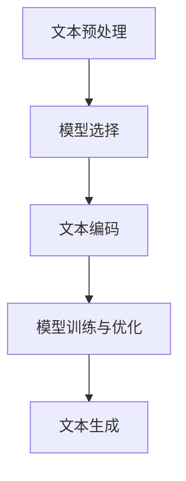
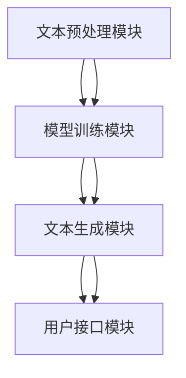

                 

### 开发基于大模型的金融政策解读系统

随着人工智能技术的快速发展，大模型（Large Models）在各个领域的应用越来越广泛。特别是在金融领域，政策解读系统作为金融决策的重要辅助工具，其准确性和效率直接影响到金融机构的运营和风险管理。本文将深入探讨如何开发一个基于大模型的金融政策解读系统，旨在提高政策理解的深度和广度。

#### 一、关键词

- 大模型
- 金融政策解读
- 机器学习
- 自然语言处理
- 系统架构

#### 二、摘要

本文将首先介绍大模型的基本概念及其在金融政策解读中的应用背景。随后，我们将探讨开发金融政策解读系统所需的技术基础，包括机器学习和自然语言处理等。接着，我们将详细分析系统架构设计，包括模块划分、数据流和处理逻辑。文章最后将通过实际案例展示系统开发的过程和应用效果，并提出最佳实践建议。

#### 三、背景与问题

在金融领域，政策解读系统的核心任务是理解和分析大量的政策文本，从中提取关键信息，并对政策的影响进行预测和评估。传统的方法主要依赖于规则和简单的文本匹配技术，这些方法在处理复杂、模糊的政策文本时往往力不从心。

随着深度学习技术的发展，大模型（如GPT-3、BERT等）在自然语言处理领域取得了显著的成果。这些模型具有强大的文本理解和生成能力，能够处理大量的政策文本，提供更加准确和深入的解读。因此，开发一个基于大模型的金融政策解读系统具有重要的现实意义。

然而，开发这样的系统面临一系列挑战：

1. **数据准备**：需要大量的政策文本数据，并且这些数据需要经过清洗、标注和预处理。
2. **模型选择**：选择合适的大模型并对其进行优化，使其能够适应金融政策解读的需求。
3. **系统架构**：设计高效、可扩展的系统架构，确保系统能够快速响应和处理大量的政策文本。
4. **实际应用**：将大模型应用于实际场景，解决实际的问题，并提供有效的解决方案。

#### 四、核心概念与联系

为了开发一个基于大模型的金融政策解读系统，我们需要了解以下几个核心概念：

1. **大模型**：通常是指具有数亿甚至数万亿参数的深度学习模型，如GPT-3、BERT等。这些模型通过大量的数据训练，具有强大的文本理解和生成能力。
2. **自然语言处理（NLP）**：NLP是计算机科学和人工智能领域的一个重要分支，它研究如何让计算机理解和生成人类语言。NLP技术在大模型的应用中发挥着关键作用。
3. **金融政策文本**：金融政策文本是指与金融政策相关的文本数据，包括政策文件、新闻报道、研究论文等。这些文本数据是金融政策解读系统的输入。
4. **机器学习**：机器学习是一种通过数据驱动的方式学习并做出预测或决策的技术。在大模型的应用中，机器学习是实现文本理解和生成的关键。

#### 五、算法原理讲解

为了实现金融政策解读，我们需要使用大模型对政策文本进行处理。以下是算法原理的讲解：

1. **文本预处理**：首先，我们需要对政策文本进行预处理，包括分词、去停用词、词性标注等操作。这些预处理步骤有助于提高大模型对文本的理解能力。

2. **模型选择**：选择合适的大模型，如GPT-3、BERT等。这些模型已经在大规模数据集上训练过，能够提供高质量的文本理解和生成能力。

3. **文本编码**：将政策文本编码为大模型可以理解的形式。通常，这包括将文本转换为词向量或嵌入向量。

4. **模型训练与优化**：使用训练数据对大模型进行训练和优化。在训练过程中，大模型会不断调整其参数，以最小化预测误差。

5. **文本生成**：使用训练好的大模型生成解读文本。这些解读文本可以是政策摘要、关键信息提取或政策影响预测等。

以下是算法原理的mermaid流程图：

#### 六、系统架构与设计

为了实现高效的金融政策解读，我们需要设计一个合理的系统架构。以下是系统架构的设计方案：

1. **模块划分**：将系统划分为多个模块，包括文本预处理模块、模型训练模块、文本生成模块和用户接口模块。

2. **数据流和处理逻辑**：明确各模块之间的数据流和处理逻辑。例如，文本预处理模块负责处理输入的政策文本，模型训练模块负责训练大模型，文本生成模块负责生成解读文本，用户接口模块负责与用户进行交互。

以下是系统架构的mermaid架构图：

#### 七、项目实战

在本项目中，我们将使用Python和PyTorch框架实现一个基于GPT-3的金融政策解读系统。以下是项目实战的步骤：

1. **环境安装**：安装Python、PyTorch和所需的库。

2. **系统核心实现**：编写代码实现文本预处理、模型训练、文本生成和用户接口等功能。

3. **代码应用解读与分析**：对实现的核心代码进行解读和分析，解释其工作原理和关键步骤。

4. **实际案例分析**：使用实际案例展示系统的应用效果，并进行详细讲解。

5. **项目小结**：总结项目的主要成果和经验教训。

#### 八、最佳实践 Tips

1. **数据质量**：确保输入的数据质量，包括文本的准确性、完整性和一致性。

2. **模型选择**：根据具体需求选择合适的大模型，并进行优化。

3. **系统优化**：针对系统的性能和可扩展性进行优化，例如使用分布式训练和高效的数据加载。

4. **用户交互**：设计直观、易用的用户界面，提高用户体验。

#### 九、小结

本文介绍了如何开发一个基于大模型的金融政策解读系统。通过深入分析大模型、自然语言处理、机器学习等技术，并结合实际项目实战，我们展示了系统开发的完整流程。未来，随着人工智能技术的进一步发展，金融政策解读系统将发挥更大的作用，为金融机构提供更准确、高效的决策支持。

#### 十、注意事项

1. **模型参数调整**：在实际应用中，需要根据具体情况进行模型参数的调整。

2. **数据隐私**：在处理金融政策文本时，要注意保护用户隐私。

3. **系统维护**：定期更新和维护系统，确保其稳定运行。

#### 十一、拓展阅读

1. **《深度学习》**：Goodfellow、Bengio和Courville所著的深度学习经典教材，详细介绍了深度学习的基础知识。

2. **《自然语言处理综论》**：Jurafsky和Martin所著的自然语言处理经典教材，涵盖了NLP的各个方面。

3. **《金融科技：理论与实践》**：刘晓峰所著的金融科技教材，介绍了金融科技的基本概念和应用。

#### 十二、作者信息

- 作者：AI天才研究院/AI Genius Institute & 禅与计算机程序设计艺术 /Zen And The Art of Computer Programming

