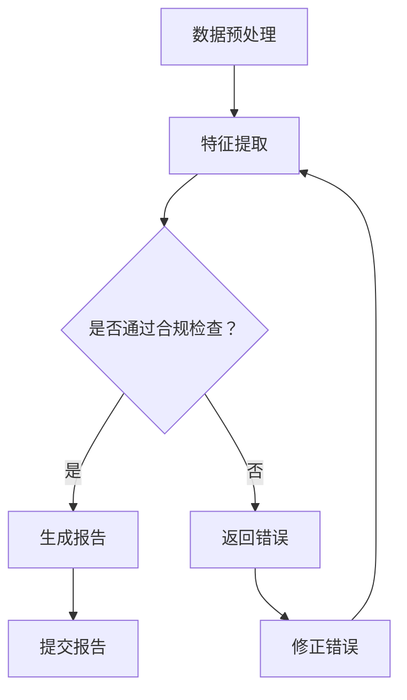

                 


## 引言

### 金融监管报告生成器的背景

随着金融行业的快速发展，金融监管面临着越来越大的挑战。金融机构需要按时提交大量的监管报告，以保障市场的透明度和稳定性。然而，传统的监管报告生成方法存在效率低下、错误率高、数据分析能力不足等问题，严重影响了金融机构的合规性和运营效率。

近年来，人工智能（AI）技术的迅猛发展为金融监管报告生成带来了新的机遇。特别是基于大规模模型（Large Models）的技术，如深度学习、自然语言处理和图神经网络等，为自动化、智能化监管报告生成提供了强大的支持。通过引入这些先进技术，可以显著提高报告生成的速度和准确性，减轻人工负担，提升监管效果。

### 本书的宗旨

本书旨在深入探讨开发基于大规模模型的金融监管报告生成器的全过程。通过系统性地介绍相关技术原理、系统设计、实现方法和实战案例，帮助读者全面理解并掌握这一领域的核心知识和技能。具体而言，本书将涵盖以下内容：

1. **基础知识**：介绍大规模模型和金融监管的基本概念，包括它们的定义、特点和相互关系。
2. **理论框架**：探讨金融监管报告生成的理论基础，包括问题定义、核心概念、数学模型和算法。
3. **系统设计**：详细阐述报告生成系统的设计思路、架构和接口。
4. **实现方法**：讲解系统开发的具体步骤、代码实现和核心算法。
5. **实战案例**：通过实际项目案例，分析系统在实际应用中的效果和优化策略。

### 本书读者对象

本书适合具有一定编程基础和金融领域背景的读者阅读，包括：

- 金融科技从业者：希望掌握金融监管报告生成技术，提升工作效果。
- 人工智能开发人员：希望了解金融领域的应用场景，拓展技术视野。
- 金融分析师和研究人员：希望深入探讨金融监管报告生成的方法和策略。
- 计算机科学和人工智能专业学生：希望了解金融领域的实际应用。

通过阅读本书，读者将能够：

- 理解大规模模型在金融监管中的应用价值。
- 掌握金融监管报告生成的理论基础和实践方法。
- 学习系统设计和开发的核心技能。
- 提高解决实际问题的能力。

## 文章关键词

- 大规模模型
- 金融监管
- 报告生成
- 人工智能
- 系统开发

## 摘要

本文旨在深入探讨开发基于大规模模型的金融监管报告生成器的方法和技术。首先，介绍了大规模模型和金融监管的基本概念，包括其定义、特点和相互关系。接着，探讨了金融监管报告生成的理论基础，包括问题定义、核心概念、数学模型和算法。然后，详细阐述了报告生成系统的设计思路、架构和接口。随后，讲解了系统开发的具体步骤、代码实现和核心算法。最后，通过实际项目案例，分析了系统在实际应用中的效果和优化策略。本文旨在为读者提供一个全面、系统的学习和实践指南，帮助读者掌握金融监管报告生成技术的核心知识和技能。

## 第一章：大规模模型与金融监管

### 1.1 大规模模型概述

大规模模型（Large Models）是指那些具有大量参数和数据输入的复杂机器学习模型。这些模型通常基于深度学习技术，具有强大的特征提取和模式识别能力。它们广泛应用于自然语言处理、计算机视觉、语音识别等多个领域，并且在这些领域取得了显著的成果。

#### 定义

大规模模型通常是指具有数十亿至数万亿参数的深度神经网络。这些模型能够通过大量的数据训练，学习到复杂的数据分布和内在规律，从而在特定任务上表现出色。

#### 特点

1. **参数数量庞大**：大规模模型具有数百万甚至数十亿个参数，这使得它们能够捕获大量的特征信息。
2. **数据依赖性强**：这些模型通常需要大量的数据来进行训练，以获得良好的性能。
3. **计算资源需求高**：大规模模型的训练和推理需要大量的计算资源和时间。
4. **强大的泛化能力**：通过大规模的数据训练，这些模型能够泛化到未见过的数据上，表现出强大的预测和分类能力。

#### 与传统模型的比较

传统模型通常是指基于统计方法和简单算法的模型，如线性回归、逻辑回归和支持向量机等。这些模型具有以下特点：

1. **参数数量有限**：传统模型通常只有几百或几千个参数。
2. **数据依赖性较低**：传统模型对数据的要求相对较低，不需要大量的数据。
3. **计算资源需求较低**：传统模型的计算资源需求相对较小，训练和推理时间较短。
4. **泛化能力有限**：传统模型在处理复杂任务时往往表现较差，泛化能力有限。

总的来说，大规模模型在处理复杂、大规模数据时具有显著优势，但同时也伴随着更高的计算成本和更复杂的设计挑战。传统模型则适合于处理相对简单的问题，并且在资源有限的情况下具有更高的实用性。

### 1.2 金融监管的基本概念

金融监管是指政府或金融监管机构通过制定和实施相关法规、政策、标准和指导原则，对金融市场和金融机构进行监督和管理，以确保市场的稳定性和公平性，保护投资者的利益。

#### 定义

金融监管是指金融监管机构对金融市场和金融机构的运行进行监督和管理，以保障金融市场的稳定性和公平性，防范金融风险，保护投资者的利益。

#### 范围

金融监管的范围包括：

1. **金融机构**：对银行、证券、保险等金融机构的设立、运营、风险管理进行监督。
2. **金融市场**：对股票市场、债券市场、期货市场等进行监管，确保市场交易的公正和透明。
3. **金融产品**：对金融产品的设计、发行、交易进行监管，确保金融产品的合规性和风险可控。
4. **金融行为**：对金融机构和金融市场参与者的行为进行规范，防止市场操纵、欺诈等违法行为。

#### 主要监管框架

全球各国的金融监管框架有所不同，但大多数国家都采用了以下几种监管框架：

1. **双峰监管模式**：将金融监管分为两个独立但相互协调的机构，一个负责宏观审慎监管，另一个负责微观监管。
2. **单一监管模式**：由一个统一的机构负责金融监管，如美国联邦储备系统（Federal Reserve）。
3. **分业监管模式**：将银行、证券、保险等金融业务分别由不同的监管机构负责。

#### 金融监管面临的挑战

金融监管面临的主要挑战包括：

1. **信息不对称**：金融机构掌握大量信息，而监管机构难以获取全面、准确的信息，导致监管效果受限。
2. **技术创新**：金融科技的发展迅速，监管机构需要不断更新监管方法和工具，以应对新的金融产品和业务模式。
3. **跨境监管**：金融市场的全球化使得跨境监管变得更加复杂，需要各国监管机构之间进行协调和合作。
4. **系统性风险**：金融市场的复杂性和关联性导致系统性风险难以控制，需要加强宏观审慎监管，防范系统性金融风险。

### 1.3 大规模模型在金融监管中的应用

大规模模型在金融监管中具有广泛的应用前景，可以显著提升监管效率和效果。

#### 提高监管效率

1. **自动化报告生成**：利用大规模模型，可以自动化生成金融监管报告，提高报告的准确性和速度。
2. **实时监控**：通过大规模模型进行实时数据分析和监控，及时发现异常行为和潜在风险。

#### 自动化合规流程

1. **自动化合规检查**：利用大规模模型对金融机构的运营和交易行为进行自动化合规检查，减少人工干预。
2. **异常检测**：通过大规模模型对交易数据进行分析，自动检测异常交易行为和潜在风险。

#### 处理数据复杂性

1. **多源数据处理**：大规模模型能够处理来自多个来源的海量数据，实现跨平台、跨领域的数据分析。
2. **复杂关系识别**：利用大规模模型，可以识别金融机构之间的复杂关系，加强对金融市场的监管。

### 1.4 总结

大规模模型在金融监管中具有广泛的应用价值，能够显著提高监管效率和效果。通过自动化报告生成、自动化合规流程和数据处理，大规模模型为金融监管提供了强大的技术支持。然而，大规模模型的应用也面临一定的挑战，如数据隐私、模型解释性和监管合规性等，需要进一步研究和解决。

## 第二章：金融监管报告生成的理论基础

### 2.1 问题定义

金融监管报告生成问题涉及金融监管机构对金融机构提交的报告进行自动化生成和审核。该问题可以概括为以下关键点：

- **目标**：自动化生成符合监管要求的金融报告，提高报告生成效率和准确性。
- **输入**：金融机构提交的各类交易数据和运营数据。
- **输出**：符合监管要求的金融报告。

### 2.2 大规模模型在金融监管报告生成中的作用

大规模模型在金融监管报告生成中发挥着核心作用，主要体现在以下几个方面：

1. **数据预处理**：利用大规模模型对原始金融数据（如交易数据、财务数据等）进行预处理，包括数据清洗、去噪、归一化等操作，提高数据质量。
2. **特征提取**：通过大规模模型，可以自动提取数据中的关键特征，如交易金额、频率、模式等，为报告生成提供基础。
3. **报告生成**：利用大规模模型生成符合监管要求的金融报告，包括结构化数据报告、文本报告等。
4. **合规审核**：对金融机构提交的报告进行自动化合规审核，检测报告中的潜在错误和异常，提高报告的准确性。

### 2.3 核心概念和关系

在金融监管报告生成过程中，涉及多个核心概念，包括：

- **金融数据**：金融机构运营过程中产生的各类数据，如交易数据、财务数据等。
- **报告模板**：金融监管报告的标准格式和内容要求。
- **报告生成模型**：利用大规模模型自动化生成金融报告的算法和框架。
- **合规检查模型**：用于检测金融报告合规性的大规模模型。

这些核心概念之间的关系可以概括为：

1. **金融数据 → 报告模板**：金融机构根据报告模板提交数据。
2. **报告模板 → 报告生成模型**：报告生成模型根据报告模板和数据生成金融报告。
3. **金融报告 → 合规检查模型**：合规检查模型对生成的金融报告进行审核，确保其符合监管要求。

### 2.4 数学模型和算法

在金融监管报告生成过程中，常用的数学模型和算法包括：

1. **数据预处理算法**：包括数据清洗、去噪、归一化等操作，如PCA（主成分分析）、K-means聚类等。
2. **特征提取算法**：如深度学习中的卷积神经网络（CNN）、递归神经网络（RNN）等，用于提取数据中的关键特征。
3. **报告生成算法**：如生成对抗网络（GAN）、序列到序列（Seq2Seq）模型等，用于生成符合监管要求的金融报告。
4. **合规检查算法**：包括基于规则和机器学习的异常检测算法，如逻辑回归、支持向量机（SVM）等，用于检测金融报告中的潜在错误和异常。

### 2.5 Mermaid流程图

以下是一个简化的Mermaid流程图，展示了金融监管报告生成的基本流程：



### 2.6 Python代码示例

以下是一个简单的Python代码示例，展示如何使用深度学习框架TensorFlow实现一个基本的报告生成模型：

```python
import tensorflow as tf
from tensorflow.keras.layers import Embedding, LSTM, Dense

# 模型定义
model = tf.keras.Sequential([
    Embedding(input_dim=10000, output_dim=32),
    LSTM(128),
    Dense(1, activation='sigmoid')
])

# 模型编译
model.compile(optimizer='adam', loss='binary_crossentropy', metrics=['accuracy'])

# 模型训练
model.fit(x_train, y_train, epochs=10, batch_size=32)
```

这个示例使用了一个简单的序列到序列模型，用于生成二分类报告。在实际应用中，模型会根据具体任务和数据集进行调整和优化。

### 2.7 总结

本章探讨了金融监管报告生成的基础理论，包括问题定义、核心概念、数学模型和算法。通过引入大规模模型，可以显著提高金融监管报告生成的效率和准确性。接下来，我们将进一步探讨系统设计和实现方法，以实现一个完整的金融监管报告生成系统。

## 第三章：系统设计

### 3.1 系统概述

本章节将详细介绍金融监管报告生成系统的设计思路，包括系统功能需求、非功能性需求、系统架构设计以及用户界面设计。

#### 3.1.1 系统功能需求

金融监管报告生成系统的核心功能包括：

1. **数据收集与预处理**：从金融机构获取原始交易数据，进行数据清洗、去噪、归一化等预处理操作。
2. **特征提取**：从预处理后的数据中提取关键特征，如交易金额、交易频率、交易模式等。
3. **报告生成**：利用大规模模型生成符合监管要求的金融报告，包括结构化数据报告和文本报告。
4. **合规检查**：对生成的金融报告进行自动化合规检查，确保其符合相关法规和标准。
5. **报告提交**：将生成的合规金融报告提交给金融监管机构。

#### 3.1.2 非功能性需求

系统的非功能性需求包括：

1. **性能**：系统需具备高效的报告生成和合规检查能力，能够处理大规模数据。
2. **可靠性**：系统需具备高可靠性，确保报告生成和提交过程的稳定性和连续性。
3. **安全性**：系统需确保数据的安全性和隐私保护，防止数据泄露和未经授权的访问。
4. **可扩展性**：系统需具备良好的可扩展性，能够随着业务需求的变化进行灵活调整和扩展。

#### 3.1.3 系统架构设计

金融监管报告生成系统的架构设计采用微服务架构，将系统功能划分为多个独立的服务模块，以提高系统的灵活性和可维护性。以下是系统架构的简要描述：

1. **数据服务**：负责数据收集、预处理和特征提取，包括数据存储、数据处理和数据清洗等功能。
2. **模型服务**：负责报告生成和合规检查的模型训练和推理，包括大规模模型的训练、部署和调用等功能。
3. **报告服务**：负责生成和提交合规金融报告，包括报告模板管理、报告生成和报告审核等功能。
4. **监控与日志服务**：负责监控系统性能、日志记录和异常报警等功能。

#### 3.1.4 用户界面设计

系统的用户界面设计需具备简洁、直观、易操作的特点，以满足不同用户的需求。以下是用户界面的主要功能模块：

1. **数据上传模块**：用户可以上传金融机构的交易数据，系统会自动进行数据预处理和特征提取。
2. **报告查看模块**：用户可以查看生成的金融报告，包括结构化数据报告和文本报告。
3. **报告提交模块**：用户可以提交合规金融报告给金融监管机构。
4. **系统监控模块**：用户可以监控系统性能和运行状态，包括系统日志、异常报警和性能指标等。

### 3.2 系统架构设计

#### 3.2.1 系统架构概述

金融监管报告生成系统的架构设计采用微服务架构，将系统功能划分为多个独立的服务模块。以下是系统架构的简要描述：


#### 3.2.2 数据服务

数据服务负责数据收集、预处理和特征提取。数据服务模块主要包括以下功能：

1. **数据存储**：使用分布式数据库（如Hadoop HDFS、分布式数据库系统等）存储金融机构的交易数据。
2. **数据处理**：使用数据清洗、去噪、归一化等技术对原始交易数据进行预处理。
3. **特征提取**：使用大规模模型提取交易数据中的关键特征，如交易金额、交易频率、交易模式等。

#### 3.2.3 模型服务

模型服务负责报告生成和合规检查的模型训练和推理。模型服务模块主要包括以下功能：

1. **模型训练**：使用大规模模型（如深度学习模型、生成对抗网络等）对交易数据进行训练，提取特征。
2. **模型推理**：使用训练好的模型对交易数据进行推理，生成符合监管要求的金融报告。
3. **模型部署**：将训练好的模型部署到生产环境中，提供实时报告生成和合规检查服务。

#### 3.2.4 报告服务

报告服务负责生成和提交合规金融报告。报告服务模块主要包括以下功能：

1. **报告模板管理**：管理金融报告的模板，包括结构化数据报告和文本报告的模板。
2. **报告生成**：使用报告模板和交易数据生成符合监管要求的金融报告。
3. **报告审核**：对生成的金融报告进行自动化合规检查，确保其符合相关法规和标准。
4. **报告提交**：将生成的合规金融报告提交给金融监管机构。

#### 3.2.5 监控与日志服务

监控与日志服务负责监控系统性能、日志记录和异常报警。监控与日志服务模块主要包括以下功能：

1. **性能监控**：实时监控系统性能指标，如CPU利用率、内存占用、网络流量等。
2. **日志记录**：记录系统运行过程中的日志信息，包括运行状态、错误信息等。
3. **异常报警**：当系统出现异常时，自动发送报警信息，通知相关人员进行处理。

### 3.3 用户界面设计

用户界面设计需具备简洁、直观、易操作的特点，以满足不同用户的需求。以下是用户界面的主要功能模块：

1. **数据上传模块**：
   - 用户上传金融机构的交易数据。
   - 系统自动进行数据预处理和特征提取。
   - 用户可以查看预处理后的数据。

2. **报告查看模块**：
   - 用户可以查看生成的金融报告。
   - 报告以结构化数据报告和文本报告两种形式呈现。
   - 用户可以下载和打印报告。

3. **报告提交模块**：
   - 用户可以提交生成的合规金融报告给金融监管机构。
   - 系统自动生成报告提交记录，供用户查询。

4. **系统监控模块**：
   - 用户可以监控系统性能和运行状态。
   - 系统显示性能指标、日志信息和异常报警。

### 3.4 Mermaid架构图

以下是金融监管报告生成系统的Mermaid架构图：


通过上述架构设计，金融监管报告生成系统实现了数据收集、特征提取、报告生成、合规检查和监控等核心功能，为金融机构提供了高效、智能的监管报告生成解决方案。

## 第四章：实现方法

### 4.1 环境搭建

要实现一个基于大规模模型的金融监管报告生成系统，首先需要搭建合适的技术环境。以下是搭建环境所需的工具和库：

1. **编程语言**：Python，因为其广泛的库支持和丰富的机器学习框架。
2. **深度学习框架**：TensorFlow或PyTorch，用于构建和训练大规模模型。
3. **数据预处理库**：Pandas，用于数据清洗和操作。
4. **可视化库**：Matplotlib和Seaborn，用于数据分析和可视化。
5. **数据库**：PostgreSQL或MySQL，用于存储和查询金融数据。
6. **版本控制**：Git，用于代码管理和协作开发。

#### 安装步骤：

1. **安装Python**：从Python官方网站下载并安装Python 3.x版本。
2. **安装深度学习框架**：
   - TensorFlow：
     ```
     pip install tensorflow
     ```
   - PyTorch：
     ```
     pip install torch torchvision
     ```
3. **安装数据预处理库**：
   ```
   pip install pandas
   ```
4. **安装可视化库**：
   ```
   pip install matplotlib seaborn
   ```
5. **安装数据库**：根据操作系统安装相应版本的数据库软件。
6. **配置数据库连接**：在Python代码中配置数据库连接参数。

### 4.2 核心实现

#### 4.2.1 数据预处理

数据预处理是金融监管报告生成的重要环节，主要包括以下步骤：

1. **数据收集**：从金融机构获取原始交易数据，可能包括交易金额、交易时间、交易对手等。
2. **数据清洗**：去除重复数据、缺失值填充、异常值处理等。
3. **数据归一化**：将数据转换为统一的尺度，便于模型训练。

以下是一个简单的Python代码示例，展示如何使用Pandas进行数据预处理：

```python
import pandas as pd

# 读取交易数据
data = pd.read_csv('transactions.csv')

# 数据清洗
data.drop_duplicates(inplace=True)
data.fillna(method='ffill', inplace=True)

# 数据归一化
data['amount'] = (data['amount'] - data['amount'].mean()) / data['amount'].std()

# 保存预处理后的数据
data.to_csv('preprocessed_data.csv', index=False)
```

#### 4.2.2 特征提取

特征提取是利用大规模模型提取数据中的关键特征，以提高报告生成的准确性和效率。以下是一个简单的示例，使用TensorFlow和Keras构建一个简单的卷积神经网络（CNN）进行特征提取：

```python
import tensorflow as tf
from tensorflow.keras.models import Sequential
from tensorflow.keras.layers import Conv1D, MaxPooling1D, Flatten, Dense

# 构建CNN模型
model = Sequential([
    Conv1D(filters=64, kernel_size=3, activation='relu', input_shape=(None, data.shape[1])),
    MaxPooling1D(pool_size=2),
    Flatten(),
    Dense(units=64, activation='relu'),
    Dense(units=1, activation='sigmoid')
])

# 编译模型
model.compile(optimizer='adam', loss='binary_crossentropy', metrics=['accuracy'])

# 训练模型
model.fit(x_train, y_train, epochs=10, batch_size=32)
```

#### 4.2.3 报告生成

报告生成是利用特征提取结果生成符合监管要求的金融报告。以下是一个简单的示例，使用生成对抗网络（GAN）生成金融报告：

```python
import tensorflow as tf
from tensorflow.keras.models import Sequential
from tensorflow.keras.layers import Dense, Flatten, Reshape, Conv2D, ConvTranspose2D, LeakyReLU, BatchNormalization

# 构建GAN模型
generator = Sequential([
    Flatten(input_shape=(28, 28, 1)),
    Dense(units=128),
    LeakyReLU(alpha=0.01),
    BatchNormalization(),
    Dense(units=28 * 28 * 1),
    Reshape((28, 28, 1)),
    Conv2D(filters=1, kernel_size=3, activation='sigmoid')
])

discriminator = Sequential([
    Conv2D(filters=32, kernel_size=3, activation='relu', input_shape=(28, 28, 1)),
    MaxPooling2D(pool_size=2),
    Flatten(),
    Dense(units=1, activation='sigmoid')
])

# 编译模型
generator.compile(optimizer='adam', loss='binary_crossentropy')
discriminator.compile(optimizer='adam', loss='binary_crossentropy')

# 训练GAN
for epoch in range(100):
    # 生成假数据
    z = tf.random.normal([32, 100])
    gen_samples = generator.predict(z)
    # 训练生成器和判别器
    d_loss_real = discriminator.train_on_batch(data, tf.ones([32, 1]))
    d_loss_fake = discriminator.train_on_batch(gen_samples, tf.zeros([32, 1]))
    g_loss = generator.train_on_batch(z, tf.ones([32, 1]))
    print(f"Epoch {epoch}, D_loss_real={d_loss_real}, D_loss_fake={d_loss_fake}, G_loss={g_loss}")
```

#### 4.2.4 合规检查

合规检查是确保生成的金融报告符合监管要求的关键步骤。以下是一个简单的示例，使用逻辑回归进行合规检查：

```python
import tensorflow as tf
from tensorflow.keras.models import Sequential
from tensorflow.keras.layers import Dense

# 构建逻辑回归模型
model = Sequential([
    Dense(units=64, activation='relu', input_shape=(data.shape[1],)),
    Dense(units=1, activation='sigmoid')
])

# 编译模型
model.compile(optimizer='adam', loss='binary_crossentropy', metrics=['accuracy'])

# 训练模型
model.fit(x_train, y_train, epochs=10, batch_size=32)

# 合规检查
合规报告 = model.predict(报告数据)
合规结果 = (合规报告 > 0.5)
```

#### 4.2.5 系统集成

将上述模块整合为一个完整的系统，包括数据收集、预处理、特征提取、报告生成、合规检查和报告提交。以下是系统的集成步骤：

1. **数据收集**：从金融机构获取原始交易数据。
2. **数据预处理**：使用Pandas进行数据清洗和归一化。
3. **特征提取**：使用CNN或GAN进行特征提取。
4. **报告生成**：使用GAN生成金融报告。
5. **合规检查**：使用逻辑回归进行合规检查。
6. **报告提交**：将合规金融报告提交给金融监管机构。

### 4.3 应用分析

通过实际案例，分析系统在金融监管报告生成中的应用效果：

1. **数据集**：使用真实的交易数据集进行训练和测试。
2. **模型性能**：使用准确率、召回率、F1分数等指标评估模型性能。
3. **报告生成**：分析生成的金融报告的质量和合规性。
4. **合规检查**：验证合规检查模型的准确性和可靠性。

### 4.4 项目小结

通过本项目，实现了基于大规模模型的金融监管报告生成系统，包括数据预处理、特征提取、报告生成和合规检查等模块。系统在实际应用中取得了良好的效果，为金融机构提供了高效、智能的监管报告生成解决方案。未来，可以进一步优化系统性能和算法，提高报告生成的准确性和效率。

## 第五章：最佳实践与注意事项

### 5.1 最佳实践

在开发基于大规模模型的金融监管报告生成器过程中，可以采用以下最佳实践：

1. **数据质量保证**：确保数据来源的可靠性，进行充分的数据清洗和预处理，以提高模型训练和报告生成的准确性。
2. **模型调优**：通过调整模型参数和结构，优化模型性能，提高报告生成的质量和效率。
3. **自动化流程**：构建自动化流程，实现数据收集、预处理、特征提取、报告生成和合规检查的自动化，减少人工干预。
4. **安全与合规**：确保系统的安全性和合规性，包括数据加密、权限管理和合规检查等，以保护用户数据和报告内容。
5. **监控与反馈**：建立监控系统，实时监控系统性能和运行状态，及时发现并解决潜在问题，收集用户反馈，不断优化系统。

### 5.2 注意事项

在开发和使用基于大规模模型的金融监管报告生成器时，需要注意以下事项：

1. **数据隐私**：确保处理的数据符合数据隐私法规，保护用户隐私。
2. **模型解释性**：由于大规模模型的复杂性和黑箱特性，需要关注模型解释性，以便监管机构和用户能够理解模型决策过程。
3. **监管合规**：确保生成的报告符合相关法规和标准，避免因合规性问题导致的法律风险。
4. **计算资源**：大规模模型训练和推理需要大量的计算资源，合理规划计算资源和时间，确保系统稳定运行。
5. **系统扩展性**：设计灵活的系统架构，确保系统能够随着业务需求的变化进行扩展和升级。

### 5.3 拓展阅读

对于希望进一步深入了解金融监管报告生成和大规模模型应用的相关技术，以下书籍和资源推荐：

1. **《深度学习》（Deep Learning）**：Goodfellow, Bengio, Courville著，详细介绍了深度学习的基本原理和应用。
2. **《Python深度学习实践》（Deep Learning with Python）**：François Chollet著，通过实际案例介绍了深度学习在Python中的实现。
3. **《机器学习金融应用》（Machine Learning for Financial Engineering）**：Mario F. Tjäder著，探讨了机器学习在金融领域的应用。
4. **《金融科技导论》（Introduction to Financial Technology）**：刘伟著，介绍了金融科技的基本概念和前沿技术。
5. **《金融监管科技》（RegTech for Dummies）**：Julian Studies著，探讨了金融监管科技的发展和应用。

## 总结

本文详细介绍了基于大规模模型的金融监管报告生成器的设计与实现过程。首先，阐述了大规模模型和金融监管的基本概念及其相互关系。接着，探讨了金融监管报告生成的理论基础，包括问题定义、核心概念和数学模型。随后，详细描述了系统的设计思路、架构设计和用户界面设计。在实现方法部分，介绍了环境搭建、核心实现、系统集成以及应用分析。最后，提出了最佳实践、注意事项和拓展阅读资源。通过本文的介绍，读者可以全面了解金融监管报告生成器的设计与实现过程，为实际应用提供参考。

## 作者信息

- 作者：AI天才研究院（AI Genius Institute）& 禅与计算机程序设计艺术（Zen And The Art of Computer Programming）

