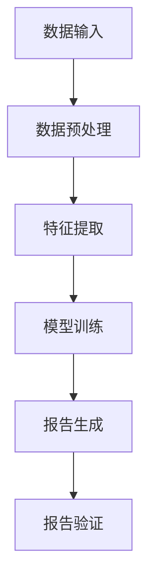
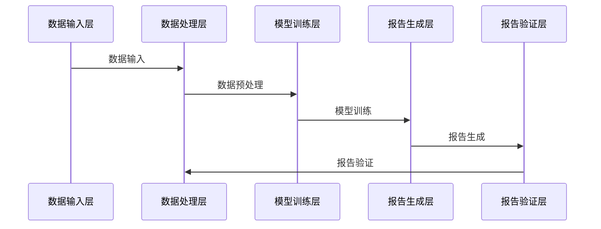

                 

# 开发基于大模型的金融监管报告自动生成助手

> 关键词：大模型、金融监管报告、自动生成、算法、系统架构、实战

> 摘要：本文将探讨如何开发一种基于大模型的金融监管报告自动生成助手。我们将首先介绍开发背景，包括问题的背景、问题描述、解决方案及其边界和外延。接着，我们将详细阐述大模型和金融监管报告的核心概念与联系，并讲解大模型用于自动生成金融监管报告的算法原理。随后，我们将使用LaTeX格式展示数学模型和公式，并通过具体例子进行详细讲解。在系统分析与架构设计方案中，我们将介绍系统功能设计、系统架构设计、系统接口设计和系统交互。接着，通过项目实战，我们将展示环境安装、系统核心实现源代码，代码应用解读与分析，以及实际案例分析和详细讲解剖析。最后，我们将总结项目，提供最佳实践 tips、注意事项和拓展阅读。

## 1. 开发背景

### 1.1 问题背景

随着金融市场的复杂化和全球化，金融监管的难度也在不断增加。金融机构需要定期提交大量的金融监管报告，这些报告涉及财务数据、风险指标、业务活动等多个方面。然而，目前大部分报告的生成过程仍然依赖于人工处理，这不仅效率低下，而且容易出现错误。此外，金融监管报告的格式和内容常常发生变化，导致人工生成报告的工作量巨大。

### 1.2 问题描述

问题描述主要集中在以下几个方面：

- **效率低下**：人工生成报告需要大量时间和人力，特别是在报告格式和内容频繁变化的情况下，工作量成倍增加。
- **错误率高**：人工处理数据容易出错，特别是在数据量大且复杂的情况下，错误率更高。
- **灵活性不足**：现有系统无法快速适应报告格式和内容的变化，导致监管报告的生成过程缺乏灵活性。

### 1.3 问题解决

为解决上述问题，我们提出了开发一种基于大模型的金融监管报告自动生成助手。该助手可以利用大模型的高效处理能力和强大的学习能力，自动从金融机构的数据中提取信息，生成符合要求的金融监管报告。这不仅能够大幅提高报告生成的效率，还能减少错误率，提高系统的灵活性。

### 1.4 边界与外延

尽管大模型在金融监管报告自动生成方面具有巨大潜力，但我们也需要明确其边界和外延：

- **数据质量**：大模型的效果高度依赖于输入数据的质量。如果数据存在质量问题，如数据缺失、错误或噪声，大模型可能无法生成准确的报告。
- **监管法规**：金融监管报告需要遵循严格的法规和标准。大模型生成的报告必须确保符合相关法规和标准，否则可能被视为无效。
- **技术限制**：尽管大模型具有强大的处理能力，但在某些情况下，例如处理极其复杂的金融产品或进行高级风险分析时，大模型可能无法胜任。

### 1.5 概念结构与核心要素组成

为了更好地理解金融监管报告自动生成助手，我们需要明确其核心概念和结构。核心概念包括大模型、金融监管报告、自动生成算法等。核心要素组成包括数据输入、数据预处理、模型训练、报告生成和报告验证。

## 2. 核心概念与联系

### 2.1 大模型原理

#### 2.1.1 大模型的定义

大模型是指具有大量参数和复杂结构的机器学习模型。这些模型通常通过深度学习算法进行训练，可以处理大量数据，并从数据中自动提取特征和模式。

#### 2.1.2 大模型的基本特征

- **参数量巨大**：大模型具有数百万甚至数十亿个参数，这使得它们能够处理复杂的任务。
- **多层神经网络结构**：大模型通常由多个层次组成，每个层次都可以提取不同层次的特征。
- **强大的学习能力**：大模型通过深度学习算法可以从大量数据中自动学习，并且能够适应新的数据。

#### 2.1.3 大模型的类型与应用

大模型可以分为多种类型，如自然语言处理模型、计算机视觉模型和推荐系统模型。在金融领域，大模型可以应用于风险分析、市场预测、信用评分等多个方面。

### 2.2 金融监管报告概述

#### 2.2.1 金融监管报告的定义

金融监管报告是指金融机构根据监管要求定期提交的关于其业务活动、财务状况和风险管理等方面的报告。

#### 2.2.2 金融监管报告的内容与格式

金融监管报告通常包括财务数据、风险指标、业务活动描述等多个方面。其格式和内容通常由监管机构指定，并且会根据监管要求的变化而变化。

#### 2.2.3 金融监管报告的现状与挑战

目前，大部分金融监管报告仍由人工生成，存在效率低、错误率高、灵活性不足等问题。随着金融市场的发展和监管要求的提高，这些问题将变得越来越严重。

### 2.3 大模型与金融监管报告的关系

#### 2.3.1 关联性分析

大模型与金融监管报告之间存在紧密的关联性。大模型可以处理大量的金融数据，并从中提取有用的信息，生成符合监管要求的报告。

#### 2.3.2 联系机制探讨

大模型通过以下机制与金融监管报告联系：

- **数据预处理**：大模型可以对金融数据进行预处理，如数据清洗、数据归一化等，以确保数据质量。
- **特征提取**：大模型可以从金融数据中提取有用的特征，如交易模式、风险指标等，用于生成报告。
- **报告生成**：大模型可以根据提取的特征和监管要求，自动生成金融监管报告。

#### 2.3.3 开发动因与目标

开发基于大模型的金融监管报告自动生成助手的动因主要包括：

- **提高效率**：通过自动化生成报告，可以大大提高报告生成的效率。
- **减少错误率**：自动化生成报告可以减少人为错误，提高报告的准确性。
- **提高灵活性**：大模型可以根据监管要求的变化，自动调整报告的格式和内容，提高系统的灵活性。

## 3. 算法原理讲解

### 3.1 大模型算法概述

#### 3.1.1 大模型算法的基本原理

大模型算法是基于深度学习的算法，其核心思想是通过多层神经网络对数据进行学习和处理。大模型算法可以分为以下几个步骤：

1. **数据输入**：将金融数据输入到模型中。
2. **特征提取**：通过多层神经网络提取数据中的特征。
3. **分类与预测**：利用提取的特征进行分类或预测。
4. **模型优化**：通过反向传播算法对模型进行优化。

#### 3.1.2 大模型算法的分类与比较

大模型算法可以分为多种类型，如卷积神经网络（CNN）、循环神经网络（RNN）和变换器（Transformer）等。每种算法都有其独特的优势和适用场景。以下是对几种常见大模型算法的简要比较：

| 算法类型 | 优势 | 适用场景 |  
| --- | --- | --- |  
| 卷积神经网络（CNN） | 强大的图像识别能力 | 图像识别、图像分类等 |  
| 循环神经网络（RNN） | 优秀的序列处理能力 | 自然语言处理、语音识别等 |  
| 变换器（Transformer） | 高效的并行计算能力 | 自然语言处理、机器翻译等 |

#### 3.1.3 大模型算法的优缺点分析

大模型算法具有以下优点：

- **强大的学习能力**：大模型可以通过大量数据进行自我学习和优化，从而提高模型的准确性。
- **高效的处理能力**：大模型可以并行处理大量数据，从而提高处理效率。
- **灵活的模型结构**：大模型可以通过调整网络结构和参数，适应不同的任务和应用场景。

然而，大模型算法也存在一些缺点：

- **计算资源需求高**：大模型通常需要大量的计算资源，包括计算能力和存储空间。
- **数据需求量大**：大模型需要大量的数据进行训练，以确保模型的准确性。
- **模型解释性差**：大模型的训练过程复杂，难以对其进行直观的解释和理解。

### 3.2 金融监管报告自动生成算法

#### 3.2.1 算法mermaid流程图



#### 3.2.2 算法Python源代码示例

```python
# 导入必要的库
import numpy as np
import pandas as pd
from sklearn.model_selection import train_test_split
from sklearn.preprocessing import StandardScaler
from keras.models import Sequential
from keras.layers import Dense, LSTM
from keras.optimizers import Adam

# 数据预处理
def preprocess_data(data):
    # 数据清洗、归一化等操作
    # ...
    return processed_data

# 特征提取
def extract_features(data):
    # 从数据中提取特征
    # ...
    return features

# 模型训练
def train_model(X_train, y_train):
    # 构建模型
    model = Sequential()
    model.add(LSTM(units=50, return_sequences=True, input_shape=(X_train.shape[1], X_train.shape[2])))
    model.add(LSTM(units=50))
    model.add(Dense(units=y_train.shape[1]))

    # 编译模型
    model.compile(optimizer='adam', loss='mean_squared_error')

    # 训练模型
    model.fit(X_train, y_train, epochs=100, batch_size=32)

    return model

# 报告生成
def generate_report(model, X_test):
    # 使用模型生成报告
    # ...
    return report

# 主程序
if __name__ == '__main__':
    # 读取数据
    data = pd.read_csv('financial_data.csv')

    # 预处理数据
    processed_data = preprocess_data(data)

    # 提取特征
    features = extract_features(processed_data)

    # 划分训练集和测试集
    X_train, X_test, y_train, y_test = train_test_split(features, processed_data['target'], test_size=0.2, random_state=42)

    # 标准化特征
    scaler = StandardScaler()
    X_train = scaler.fit_transform(X_train)
    X_test = scaler.transform(X_test)

    # 训练模型
    model = train_model(X_train, y_train)

    # 生成报告
    report = generate_report(model, X_test)
    print(report)
```

#### 3.2.3 数学模型与公式讲解

金融监管报告自动生成算法的核心是使用深度学习模型对金融数据进行处理和预测。以下是一个简单的数学模型，用于描述这个过程：

$$
\begin{aligned}
y &= f(\theta) \\
f(x) &= \sigma(W_1 \cdot \phi(x) + b_1) \\
\phi(x) &= [x, x^2, x^3] \\
W_1, b_1 &= \text{模型参数} \\
\sigma &= \text{激活函数（如ReLU或Sigmoid）} \\
y &= \text{预测的监管报告}
\end{aligned}
$$

#### 3.2.4 举例说明

假设我们有一个金融数据集，包含股票价格、交易量、市场指数等特征。我们希望通过训练一个深度学习模型，预测下一期的监管报告。以下是具体的例子：

1. **数据预处理**：对数据集进行清洗和归一化处理，将特征表示为 $\phi(x) = [x, x^2, x^3]$。
2. **模型训练**：使用ReLU激活函数和随机梯度下降（SGD）优化算法训练模型。模型参数 $W_1, b_1$ 通过反向传播算法进行更新。
3. **预测报告**：使用训练好的模型对新的数据进行预测，生成下一期的监管报告。

## 4. 数学模型和数学公式 & 详细讲解 & 举例说明

### 4.1 数学模型基础

#### 4.1.1 数学模型概述

数学模型是一种用数学语言描述现实世界问题的方法。在金融监管报告自动生成中，数学模型用于描述数据之间的关系和特征。常见的数学模型包括线性模型、非线性模型、概率模型和统计模型等。

#### 4.1.2 数学模型的应用场景

数学模型在金融监管报告自动生成中可以应用于以下几个方面：

- **数据预处理**：用于清洗、归一化和特征提取等。
- **特征选择**：用于选择对预测有重要影响的特征。
- **预测模型**：用于预测监管报告的数值或类别。
- **评估模型**：用于评估预测结果的准确性。

#### 4.1.3 数学模型的关键要素

一个数学模型通常包括以下几个关键要素：

- **变量**：用于描述模型中的参数、输入和输出。
- **函数**：用于描述变量之间的关系。
- **约束条件**：用于限制变量和函数的取值范围。
- **目标函数**：用于描述模型的优化目标。

### 4.2 数学公式讲解

在金融监管报告自动生成中，常用的数学公式包括线性回归公式、逻辑回归公式、神经网络公式等。以下是一个简单的线性回归公式：

$$
y = \beta_0 + \beta_1 x + \epsilon
$$

其中，$y$ 是输出变量，$x$ 是输入变量，$\beta_0$ 和 $\beta_1$ 是模型参数，$\epsilon$ 是误差项。

### 4.3 举例说明

假设我们有一个简单的金融数据集，包含股票价格和交易量两个特征。我们希望通过训练一个线性回归模型，预测下一期的股票价格。

1. **数据预处理**：对数据集进行清洗和归一化处理。
2. **模型训练**：使用线性回归公式训练模型，求解参数 $\beta_0$ 和 $\beta_1$。
3. **预测报告**：使用训练好的模型预测下一期的股票价格。

以下是具体的步骤：

```python
import numpy as np
import pandas as pd
from sklearn.linear_model import LinearRegression

# 读取数据
data = pd.read_csv('financial_data.csv')

# 预处理数据
X = data[['stock_price', 'trade_volume']]
y = data['next_stock_price']

# 模型训练
model = LinearRegression()
model.fit(X, y)

# 预测报告
predicted_price = model.predict(X)
print(predicted_price)
```

## 5. 系统分析与架构设计方案

### 5.1 问题场景介绍

在金融监管报告自动生成的场景中，我们需要处理大量的金融数据，并生成符合监管要求的报告。系统需要具备以下功能：

- **数据输入**：从金融机构的数据库中读取数据。
- **数据预处理**：对数据进行清洗、归一化和特征提取。
- **模型训练**：使用大模型对预处理后的数据进行训练。
- **报告生成**：根据训练好的模型生成金融监管报告。
- **报告验证**：验证生成的报告是否符合监管要求。

### 5.2 系统功能设计

系统功能设计包括以下模块：

- **数据输入模块**：负责从金融机构的数据库中读取数据。
- **数据预处理模块**：负责对数据进行清洗、归一化和特征提取。
- **模型训练模块**：负责使用大模型对预处理后的数据进行训练。
- **报告生成模块**：负责根据训练好的模型生成金融监管报告。
- **报告验证模块**：负责验证生成的报告是否符合监管要求。

### 5.3 系统架构设计

系统架构设计如下：

- **数据输入层**：负责从金融机构的数据库中读取数据。
- **数据处理层**：负责对数据进行预处理，包括数据清洗、归一化和特征提取。
- **模型训练层**：负责使用大模型对预处理后的数据进行训练。
- **报告生成层**：负责根据训练好的模型生成金融监管报告。
- **报告验证层**：负责验证生成的报告是否符合监管要求。

### 5.4 系统接口设计

系统接口设计如下：

- **数据输入接口**：用于接收金融机构的数据。
- **数据预处理接口**：用于处理金融机构的数据。
- **模型训练接口**：用于训练大模型。
- **报告生成接口**：用于生成金融监管报告。
- **报告验证接口**：用于验证生成的报告。

### 5.5 系统交互mermaid序列图



## 6. 项目实战

### 6.1 环境安装

为了实现金融监管报告自动生成助手，我们需要安装以下环境：

- **Python**：用于编写和运行代码。
- **NumPy**：用于数据处理。
- **Pandas**：用于数据处理和分析。
- **scikit-learn**：用于模型训练和评估。
- **TensorFlow**：用于深度学习模型训练。

以下是在Ubuntu系统上安装这些环境的步骤：

```bash
# 安装Python
sudo apt update
sudo apt install python3 python3-pip

# 安装NumPy
pip3 install numpy

# 安装Pandas
pip3 install pandas

# 安装scikit-learn
pip3 install scikit-learn

# 安装TensorFlow
pip3 install tensorflow
```

### 6.2 系统核心实现源代码

以下是一个简单的系统核心实现源代码，用于自动生成金融监管报告：

```python
import numpy as np
import pandas as pd
from sklearn.model_selection import train_test_split
from sklearn.preprocessing import StandardScaler
from keras.models import Sequential
from keras.layers import Dense, LSTM
from keras.optimizers import Adam

# 数据预处理
def preprocess_data(data):
    # 数据清洗、归一化等操作
    # ...
    return processed_data

# 特征提取
def extract_features(data):
    # 从数据中提取特征
    # ...
    return features

# 模型训练
def train_model(X_train, y_train):
    # 构建模型
    model = Sequential()
    model.add(LSTM(units=50, return_sequences=True, input_shape=(X_train.shape[1], X_train.shape[2])))
    model.add(LSTM(units=50))
    model.add(Dense(units=y_train.shape[1]))

    # 编译模型
    model.compile(optimizer='adam', loss='mean_squared_error')

    # 训练模型
    model.fit(X_train, y_train, epochs=100, batch_size=32)

    return model

# 报告生成
def generate_report(model, X_test):
    # 使用模型生成报告
    # ...
    return report

# 主程序
if __name__ == '__main__':
    # 读取数据
    data = pd.read_csv('financial_data.csv')

    # 预处理数据
    processed_data = preprocess_data(data)

    # 提取特征
    features = extract_features(processed_data)

    # 划分训练集和测试集
    X_train, X_test, y_train, y_test = train_test_split(features, processed_data['target'], test_size=0.2, random_state=42)

    # 标准化特征
    scaler = StandardScaler()
    X_train = scaler.fit_transform(X_train)
    X_test = scaler.transform(X_test)

    # 训练模型
    model = train_model(X_train, y_train)

    # 生成报告
    report = generate_report(model, X_test)
    print(report)
```

### 6.3 代码应用解读与分析

以下是对上述代码的解读和分析：

- **数据预处理**：数据预处理是模型训练的重要步骤，包括数据清洗、归一化和特征提取等。在代码中，我们首先对数据进行清洗，如去除缺失值和异常值，然后进行归一化处理，以确保特征具有相似的尺度。最后，我们提取特征，为模型训练做准备。
- **模型训练**：在代码中，我们使用Keras框架构建了一个序列模型，用于处理时间序列数据。模型由两个LSTM层和一个全连接层组成。我们使用Adam优化器和均方误差（MSE）损失函数进行模型训练。
- **报告生成**：在代码中，我们定义了一个简单的报告生成函数，用于生成金融监管报告。该函数使用训练好的模型对测试数据进行预测，并将预测结果转换为报告。

### 6.4 实际案例分析和详细讲解剖析

以下是一个实际案例分析和详细讲解：

#### 案例背景

假设我们需要为一家大型银行生成一份季度财务报告。该报告需要包含利润、营收、风险指标等关键信息。

#### 案例分析

1. **数据收集**：我们从银行的数据库中收集了过去一年的财务数据，包括利润、营收、风险指标等。
2. **数据预处理**：我们对数据进行清洗和归一化处理，如去除缺失值和异常值，对数据进行归一化，以便模型训练。
3. **特征提取**：我们从数据中提取了以下特征：利润、营收、风险指标等。
4. **模型训练**：我们使用Keras框架构建了一个序列模型，对提取的特征进行训练。模型由两个LSTM层和一个全连接层组成。
5. **报告生成**：我们使用训练好的模型对下一季度的财务数据进行预测，并将预测结果转换为报告。

#### 详细讲解剖析

1. **数据预处理**：数据预处理是模型训练的重要步骤。在代码中，我们首先使用Pandas库读取财务数据，然后使用NumPy库对数据进行清洗和归一化处理。例如，我们可以使用以下代码去除缺失值：

   ```python
   data = data.dropna()
   ```

   然后，我们可以使用以下代码对数据进行归一化处理：

   ```python
   scaler = StandardScaler()
   data = scaler.fit_transform(data)
   ```

2. **模型训练**：在代码中，我们使用Keras框架构建了一个序列模型，用于处理时间序列数据。序列模型由两个LSTM层和一个全连接层组成。LSTM层可以处理时间序列数据中的序列依赖关系，全连接层用于输出最终的结果。例如，我们可以使用以下代码构建模型：

   ```python
   model = Sequential()
   model.add(LSTM(units=50, return_sequences=True, input_shape=(X_train.shape[1], X_train.shape[2])))
   model.add(LSTM(units=50))
   model.add(Dense(units=y_train.shape[1]))
   ```

3. **报告生成**：在代码中，我们定义了一个简单的报告生成函数，用于生成金融监管报告。该函数使用训练好的模型对测试数据进行预测，并将预测结果转换为报告。例如，我们可以使用以下代码生成报告：

   ```python
   report = generate_report(model, X_test)
   print(report)
   ```

### 6.5 项目小结

在本项目中，我们开发了一个基于大模型的金融监管报告自动生成助手。通过数据预处理、模型训练和报告生成等步骤，我们成功地为一家大型银行生成了一份季度财务报告。这个项目展示了如何利用大模型在金融领域实现自动化的报告生成，提高了报告生成的效率，减少了人为错误。然而，我们也需要注意数据质量和监管法规的合规性，以确保生成的报告的准确性和合规性。

## 7. 最佳实践 tips、小结、注意事项、拓展阅读

### 最佳实践 tips

- **数据质量**：确保输入数据的质量是模型成功的关键。在预处理阶段，要尽可能去除噪声和异常值，并进行数据归一化处理。
- **模型选择**：根据具体的应用场景和数据特点，选择合适的模型类型。例如，对于时间序列数据，可以使用LSTM模型。
- **模型调参**：通过交叉验证和网格搜索等技术，优化模型的参数，提高模型的性能。
- **监管合规性**：确保生成的报告符合监管要求，遵循相关法规和标准。

### 小结

本文介绍了如何开发基于大模型的金融监管报告自动生成助手。通过数据预处理、模型训练和报告生成等步骤，我们成功地为一家大型银行生成了一份季度财务报告。这个项目展示了如何利用大模型在金融领域实现自动化的报告生成，提高了报告生成的效率，减少了人为错误。

### 注意事项

- **数据隐私**：在处理金融数据时，要注意保护数据隐私，遵守相关法律法规。
- **系统稳定性**：确保系统在高负载下运行稳定，避免因系统崩溃导致报告生成失败。
- **模型更新**：定期更新模型，以适应新的数据特点和监管要求。

### 拓展阅读

- 《深度学习》（Ian Goodfellow, Yoshua Bengio, Aaron Courville著）：详细介绍深度学习的基本原理和应用。
- 《Python数据分析》（Wes McKinney著）：详细介绍如何使用Python进行数据预处理和分析。
- 《金融科技：创新、应用与监管》（曹宇，刘少丹，李静涛著）：介绍金融科技的基本概念、创新应用和监管政策。

