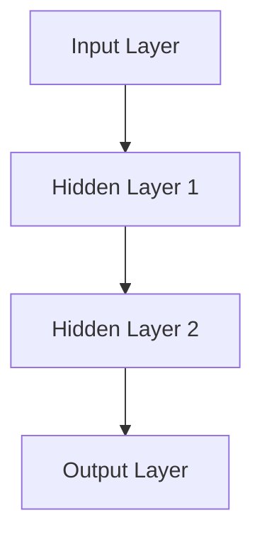
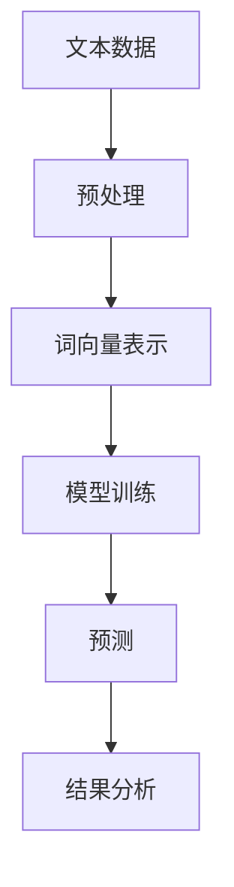
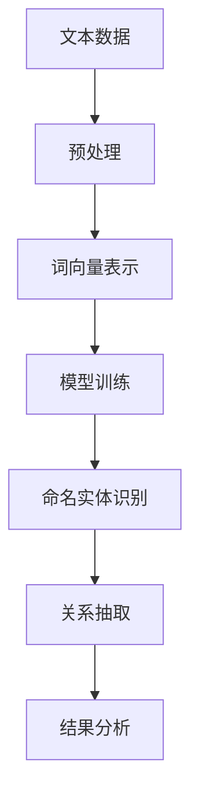
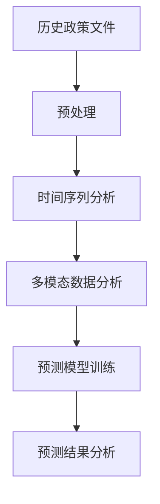
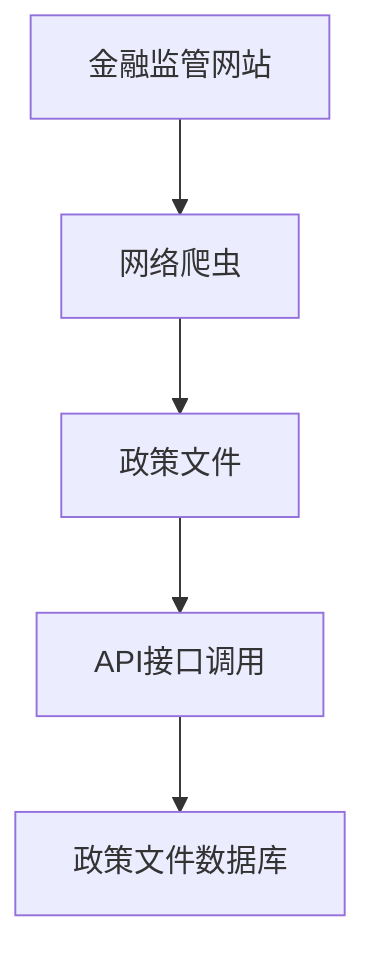
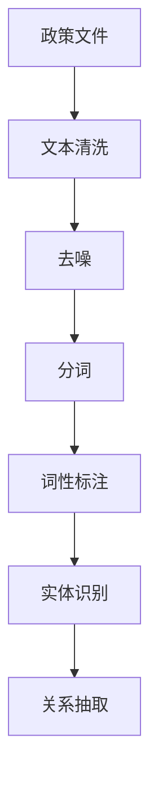
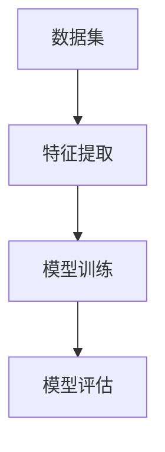
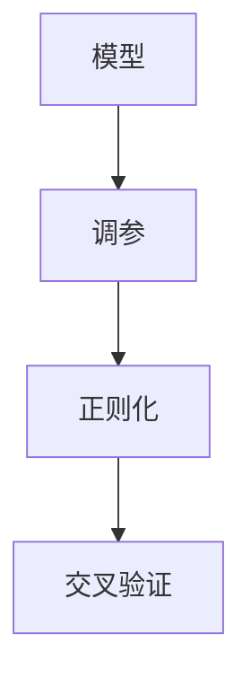
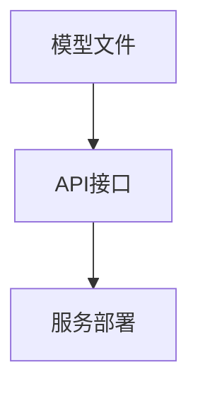
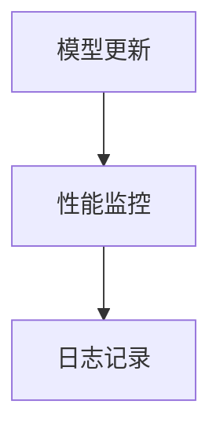

                 

### 第一部分：背景介绍

在当今的金融科技时代，随着人工智能技术的迅猛发展，金融监管机构面临着前所未有的挑战。传统的金融监管手段已经难以应对金融市场的复杂性和不确定性。为了提升监管效能，确保金融市场的稳定和健康发展，开发基于大模型的金融监管政策解读助手成为了一种趋势。

#### 1. 问题背景

随着金融市场的全球化、信息化和智能化发展，金融产品和交易方式日益多样化和复杂化。这不仅带来了丰富的投资机会，也增加了监管的难度和风险。例如，高频交易、量化投资、区块链技术等新兴金融工具和模式不断涌现，使得市场波动性和风险传染性显著增加。传统的金融监管方法往往依赖于人工审查和经验判断，难以及时、准确地识别和评估市场风险。

与此同时，金融科技的发展也为金融监管提供了新的工具和手段。大数据、人工智能、区块链等技术可以在海量数据中挖掘潜在风险，提高监管效率和准确性。例如，通过大数据分析，可以实时监控市场交易行为，识别异常交易模式；通过人工智能，可以自动化处理大量的监管文档，提取关键信息，形成易于理解的报告；通过区块链，可以实现监管数据的透明化和可追溯性。

然而，金融科技的快速发展也带来了新的挑战。一方面，金融科技的创新速度远超监管能力，导致监管滞后；另一方面，金融科技的复杂性和不确定性使得监管难度加大。因此，如何运用人工智能等先进技术提升金融监管效能，成为当前金融监管领域的重要议题。

#### 2. 问题描述

基于大模型的金融监管政策解读助手旨在通过人工智能技术，自动分析和解读大量的金融监管政策文件，提取关键信息，形成易于理解的报告，辅助监管人员快速掌握政策要点，提高决策效率。同时，该助手还可以通过预测模型，对未来的监管趋势进行预判，为监管政策的制定提供数据支持。

具体来说，该助手需要实现以下功能：

- **文本分类**：对金融监管政策文件进行分类，如政策文件、法规文件、解读文件等。
- **文本抽取**：从政策文件中提取关键信息，如政策内容、监管对象、实施时间等。
- **情感分析**：分析政策文件的情感倾向，如正面、负面或中立。
- **趋势预测**：基于历史政策文件，预测未来的监管趋势。

#### 3. 问题解决

本书将围绕开发一个基于大模型的金融监管政策解读助手，从以下几个方面展开探讨：

- **核心概念**：介绍大模型、自然语言处理、金融科技等相关概念，并阐述它们在金融监管中的应用。
- **技术原理**：讲解大模型的工作原理、算法架构，以及如何应用于文本分析、信息抽取、情感分析等任务。
- **系统设计**：分析系统架构，包括数据采集、数据预处理、模型训练、模型部署等环节，介绍如何设计和优化每个环节。
- **实际应用**：通过案例研究，展示金融监管政策解读助手的实际应用场景，分析其效果和面临的挑战。
- **未来展望**：探讨金融监管政策解读助手的未来发展，包括技术趋势、政策影响以及潜在的商业化方向。

#### 4. 边界与外延

本书主要关注基于大模型的金融监管政策解读助手的开发和应用，但不涉及具体的监管政策和法规制定。同时，本书的内容主要针对金融行业的专业人士，包括金融监管人员、金融机构高管、金融科技从业者等。

#### 5. 概念结构与核心要素组成

- **大模型**：深度学习模型，具有强大的表征能力和泛化能力。
- **自然语言处理（NLP）**：用于处理和解析文本数据，是实现文本分析和信息抽取的关键技术。
- **金融科技**：结合了金融和科技，为金融行业提供创新的解决方案。
- **数据采集与预处理**：确保数据质量和一致性，为模型训练提供可靠的基础。
- **模型训练与优化**：通过大量数据训练，提高模型的准确性和效率。
- **模型部署与维护**：将模型部署到生产环境，提供实时服务，并不断优化和维护。

---

### 第1章：大模型与金融监管概述

#### 1.1 大模型的基本概念

#### 1.1.1 什么是大模型

大模型，通常指的是参数量庞大、训练数据量巨大的人工神经网络模型。这些模型通过深度学习的方式，在训练过程中能够自动学习并提取数据中的复杂模式和特征。

从数学角度来看，大模型通常可以表示为：

$$
\text{大模型} = \text{深度神经网络} \times \text{大规模数据训练} + \text{优化算法}
$$

其中，**深度神经网络**（Deep Neural Network，DNN）是构建大模型的基础。DNN由多个层次（层）的神经元（节点）组成，每一层都对输入数据进行一定的处理和变换，从而逐层提取数据中的特征。

**大规模数据训练**则是大模型能够取得优异性能的关键。通过在大规模数据集上进行训练，模型能够学习到更多、更复杂的模式，从而提高其泛化能力。

**优化算法**在大模型训练中起着至关重要的作用。常见的优化算法包括随机梯度下降（Stochastic Gradient Descent，SGD）、Adam优化器等。这些算法通过调整模型参数，使得模型在训练过程中能够逐步优化性能。

#### 1.1.2 大模型的特点

大模型具有以下几个显著特点：

- **表征能力强大**：大模型能够自动学习并提取数据中的复杂特征和模式，这使得它们在处理复杂数据时具有强大的表征能力。
- **泛化能力强**：由于大模型在训练过程中使用了大量的数据，因此它们能够较好地泛化到未见过的数据，从而在真实应用中表现出色。
- **自我优化**：大模型具有自我优化的能力，通过不断地训练和迭代，模型性能能够逐步提高。

#### 1.1.3 大模型的核心技术

大模型的核心技术主要包括深度学习、优化算法和数据预处理等。

##### 1.1.3.1 深度学习

深度学习是构建大模型的基础。深度学习基于多层神经网络，通过逐层提取特征，实现对复杂数据的表征和建模。以下是深度学习中的几个关键概念：

- **神经网络的基本结构**：神经网络由输入层、隐藏层和输出层组成。每个神经元都与其他神经元相连，并通过权重进行信息传递。激活函数用于引入非线性因素，使神经网络能够进行复杂的函数映射。
- **反向传播算法**：反向传播算法是深度学习中的核心训练算法。它通过计算输出层与隐藏层之间的梯度，反向传播误差，并据此更新模型参数，从而优化模型性能。

##### 1.1.3.2 优化算法

优化算法在大模型训练过程中起着至关重要的作用。以下是几种常见的优化算法：

- **随机梯度下降（SGD）**：SGD是最常用的优化算法之一。它通过计算每个训练样本的梯度，更新模型参数。SGD的优点是简单高效，但收敛速度较慢，且容易陷入局部最小值。
- **Adam优化器**：Adam优化器是SGD的一种改进算法，它结合了动量法和RMSprop算法的优点，通过动态调整学习率，提高了收敛速度和稳定性。

##### 1.1.3.3 数据预处理

数据预处理是深度学习模型训练的基础。在大模型训练中，数据预处理尤其重要，因为它直接影响模型的性能和收敛速度。以下是几个关键步骤：

- **数据清洗**：去除数据中的噪声和异常值，确保数据的质量和一致性。
- **数据归一化**：将数据归一化到统一的范围，如[0, 1]或[-1, 1]，以消除数据量级差异对模型训练的影响。
- **数据增强**：通过随机裁剪、旋转、翻转等操作，增加数据多样性，提高模型的泛化能力。

#### 1.2 金融监管中的大模型应用

大模型在金融监管中具有广泛的应用，以下是其主要应用场景：

##### 1.2.1 监管文本分析

监管文本分析是金融监管政策解读的重要环节。通过自然语言处理技术，可以对大量金融监管政策文件进行自动分类、主题提取、情感分析等。

- **文本分类**：将金融监管政策文件分类为不同的类别，如政策文件、法规文件、解读文件等。
- **主题提取**：从政策文件中提取关键主题，如金融创新、风险管理、消费者保护等。
- **情感分析**：分析政策文件的情感倾向，如正面、负面或中立。

##### 1.2.2 信息抽取

信息抽取是从文本数据中提取结构化信息的过程。在金融监管中，信息抽取可用于提取政策文件中的关键信息，如监管对象、实施时间、主要内容等。

- **命名实体识别（NER）**：识别文本中的特定实体，如金融机构、监管机构、政策关键词等。
- **关系抽取**：提取文本中的实体关系，如法规与监管机构的关系、政策与实施时间的关系等。

##### 1.2.3 监管政策预测

监管政策预测是基于历史政策文件，预测未来的监管趋势和政策走向。这有助于监管机构提前做好准备，制定更有效的监管策略。

- **时间序列分析**：通过分析历史政策文件的时间序列数据，预测未来的监管趋势。
- **多模态数据分析**：结合文本、图像等多模态数据，提高预测准确性。

#### 1.3 金融监管政策解读助手的技术架构

金融监管政策解读助手的技术架构包括数据采集与预处理、模型训练与优化、模型部署与维护等环节。

##### 1.3.1 数据采集与预处理

数据采集与预处理是金融监管政策解读的基础。以下是关键步骤：

- **数据源**：包括金融监管网站、政策文件数据库、新闻媒体等。
- **数据预处理**：包括文本清洗、去噪、分词、词性标注等。

##### 1.3.2 模型训练与优化

模型训练与优化是金融监管政策解读的核心。以下是关键步骤：

- **模型选择**：根据任务需求选择合适的大模型，如BERT、GPT等。
- **训练过程**：使用大规模数据进行训练，并调整模型参数。
- **模型优化**：通过调参和调整网络结构，提高模型性能。

##### 1.3.3 模型部署与维护

模型部署与维护是金融监管政策解读的保障。以下是关键步骤：

- **部署**：将训练好的模型部署到服务器，提供API服务。
- **维护**：定期更新模型，以适应新的监管政策和数据。

#### 1.4 本章小结

本章介绍了大模型的基本概念、特点、核心技术，以及其在金融监管中的应用。通过本章的学习，读者可以初步了解大模型在金融监管政策解读中的重要性，为后续章节的内容奠定基础。

---

### 第2章：技术原理

在上一章中，我们介绍了大模型的基本概念和应用场景。本章节将深入探讨大模型的技术原理，包括其工作原理、算法架构以及如何应用于金融监管政策解读任务中。

#### 2.1 大模型的工作原理

大模型，尤其是深度学习模型，通过多层神经网络结构，自动学习和提取数据中的复杂特征。其工作原理可以概括为以下几个步骤：

1. **输入层**：输入层接收原始数据，如文本、图像或声音等。对于文本数据，输入层通常包含单词的词向量表示。
2. **隐藏层**：隐藏层对输入数据进行特征提取和转换。每一层都通过神经元之间的连接和激活函数，对输入数据进行变换，从而逐步提取更高级别的特征。
3. **输出层**：输出层产生最终的预测结果。对于分类任务，输出层通常是softmax函数，用于计算每个类别的概率分布。

大模型的工作原理可以简单概括为：通过多层神经网络，将原始数据映射到高维特征空间，从而实现对数据的分类、回归或其他形式的预测。

#### 2.2 算法架构

大模型的算法架构通常包括以下几个关键组成部分：

1. **神经网络架构**：神经网络架构包括输入层、隐藏层和输出层。隐藏层的数量和神经元数量可以根据任务需求进行调整。常见的神经网络架构包括卷积神经网络（CNN）、循环神经网络（RNN）和变换器（Transformer）等。
2. **损失函数**：损失函数用于评估模型的预测结果与真实结果之间的差距。常见的损失函数包括均方误差（MSE）、交叉熵损失（Cross-Entropy Loss）等。
3. **优化算法**：优化算法用于更新模型参数，以最小化损失函数。常见的优化算法包括随机梯度下降（SGD）、Adam优化器等。
4. **激活函数**：激活函数用于引入非线性因素，使神经网络能够进行复杂的函数映射。常见的激活函数包括ReLU、Sigmoid和Tanh等。

以下是一个简化的神经网络架构图，使用Mermaid语法表示：

#### 2.3 文本分析

在金融监管政策解读任务中，文本分析是一个核心步骤。文本分析包括文本分类、主题提取和情感分析等任务。

1. **文本分类**：文本分类是将文本数据分类到预定义的类别中。例如，将金融监管政策文件分类为政策文件、法规文件和解读文件等。文本分类通常使用预训练的深度学习模型，如BERT或GPT，这些模型已经在大量的文本数据上进行了训练，具有强大的文本表征能力。
2. **主题提取**：主题提取是从文本数据中提取关键主题的过程。例如，从金融监管政策文件中提取与金融创新、风险管理、消费者保护等相关的主题。主题提取通常使用主题模型，如LDA（Latent Dirichlet Allocation）等。
3. **情感分析**：情感分析是判断文本的情感倾向，如正面、负面或中立。例如，分析金融监管政策文件中对于某一政策的情感倾向。情感分析通常使用情感分析模型，如基于词向量的情感分析等。

以下是一个简化的文本分类任务的工作流程：

#### 2.4 信息抽取

信息抽取是从文本数据中提取结构化信息的过程。在金融监管政策解读任务中，信息抽取包括命名实体识别（NER）和关系抽取等任务。

1. **命名实体识别（NER）**：命名实体识别是识别文本中的特定实体，如金融机构、监管机构、政策关键词等。NER通常使用预训练的深度学习模型，如BERT或GPT等。
2. **关系抽取**：关系抽取是提取文本中的实体关系，如法规与监管机构的关系、政策与实施时间的关系等。关系抽取通常使用图神经网络（Graph Neural Network，GNN）等。

以下是一个简化的信息抽取任务的工作流程：

#### 2.5 监管政策预测

监管政策预测是基于历史政策文件，预测未来的监管趋势和政策走向。这有助于监管机构提前做好准备，制定更有效的监管策略。

1. **时间序列分析**：时间序列分析是分析历史数据的时间序列模式，预测未来的趋势。例如，分析过去几年的金融监管政策文件，预测未来的监管趋势。
2. **多模态数据分析**：多模态数据分析是结合文本、图像等多模态数据，提高预测准确性。例如，结合政策文件中的文本数据和图像数据，提高政策预测的准确性。

以下是一个简化的监管政策预测任务的工作流程：

#### 2.6 小结

本章详细介绍了大模型的工作原理、算法架构以及如何应用于金融监管政策解读任务中。通过本章的学习，读者可以深入理解大模型在金融监管政策解读中的作用和优势，为后续章节的系统设计和实际应用打下坚实的基础。

---

### 第3章：系统设计

在上一章中，我们详细介绍了大模型的技术原理和应用。在本章中，我们将进一步探讨基于大模型的金融监管政策解读助手的系统设计，包括数据采集与预处理、模型训练与优化、模型部署与维护等关键环节。

#### 3.1 数据采集与预处理

数据采集与预处理是构建金融监管政策解读助手的基础。以下是数据采集与预处理的关键步骤：

##### 3.1.1 数据源

金融监管政策解读助手的数据源包括金融监管网站、政策文件数据库、新闻媒体、学术论文等。这些数据源涵盖了大量的金融监管政策文件、法规文件、解读文件、相关新闻报道等。例如，中国的“国家法律法规数据库”、“中国人民银行网站”、“证监会网站”等都是重要的数据来源。

##### 3.1.2 数据采集

数据采集通常采用自动化工具进行，如网络爬虫、API接口调用等。网络爬虫可以定期爬取金融监管网站的最新政策文件，API接口调用则可以获取特定数据库中的政策文件。以下是一个简化的数据采集流程：

##### 3.1.3 数据预处理

数据预处理是确保数据质量和一致性，为模型训练提供可靠基础的重要步骤。以下是数据预处理的关键步骤：

- **文本清洗**：去除文本中的噪声和无关信息，如HTML标签、特殊字符等。
- **去噪**：去除文本中的错误信息、重复信息和无关信息，以提高数据质量。
- **分词**：将文本划分为单个词语或短语，以提取文本中的关键信息。
- **词性标注**：为每个词语标注词性，如名词、动词、形容词等，以更好地理解文本内容。
- **实体识别**：识别文本中的特定实体，如金融机构、监管机构、政策关键词等。
- **关系抽取**：提取文本中的实体关系，如法规与监管机构的关系、政策与实施时间的关系等。

以下是一个简化的数据预处理流程：

#### 3.2 模型训练与优化

模型训练与优化是金融监管政策解读助手的核心环节。以下是模型训练与优化的一般步骤：

##### 3.2.1 模型选择

根据任务需求，选择合适的大模型。例如，对于文本分类任务，可以选择BERT或GPT等预训练模型；对于信息抽取任务，可以选择BERT或RoBERTa等预训练模型；对于监管政策预测任务，可以选择时间序列分析模型或多模态分析模型等。

##### 3.2.2 模型训练

模型训练通常包括以下几个步骤：

- **数据划分**：将数据集划分为训练集、验证集和测试集，以评估模型的性能。
- **特征提取**：将预处理后的文本数据转换为特征向量，以供模型学习。
- **模型训练**：使用训练集数据训练模型，通过反向传播算法更新模型参数。
- **模型评估**：使用验证集数据评估模型性能，调整模型参数，以优化模型性能。

以下是一个简化的模型训练流程：

##### 3.2.3 模型优化

模型优化包括以下几个步骤：

- **调参**：调整模型的超参数，如学习率、批量大小、正则化参数等，以提高模型性能。
- **正则化**：采用正则化技术，如L1正则化、L2正则化等，防止模型过拟合。
- **交叉验证**：采用交叉验证技术，如K折交叉验证等，评估模型的泛化能力。

以下是一个简化的模型优化流程：

#### 3.3 模型部署与维护

模型部署与维护是金融监管政策解读助手在实际应用中的关键环节。以下是模型部署与维护的一般步骤：

##### 3.3.1 模型部署

模型部署包括以下几个步骤：

- **模型保存**：将训练好的模型保存为文件，以便后续加载和部署。
- **API接口**：构建API接口，提供模型服务，以便用户可以方便地调用模型。
- **服务部署**：将API接口部署到服务器或云平台上，提供实时服务。

以下是一个简化的模型部署流程：

##### 3.3.2 模型维护

模型维护包括以下几个步骤：

- **模型更新**：定期更新模型，以适应新的监管政策和数据。
- **性能监控**：监控模型的性能，及时发现和解决潜在问题。
- **日志记录**：记录模型的训练和部署日志，以便后续分析和优化。

以下是一个简化的模型维护流程：

#### 3.4 小结

本章详细介绍了基于大模型的金融监管政策解读助手的系统设计，包括数据采集与预处理、模型训练与优化、模型部署与维护等关键环节。通过本章的学习，读者可以全面了解金融监管政策解读助手的构建过程，为实际应用打下坚实的基础。

---

### 第4章：实际应用

在前几章中，我们详细介绍了基于大模型的金融监管政策解读助手的技术原理和系统设计。在本章中，我们将通过实际案例来展示金融监管政策解读助手的实际应用场景，分析其效果和面临的挑战。

#### 4.1 案例研究

**案例背景**：某金融监管机构希望开发一款基于大模型的金融监管政策解读助手，以提升监管效率，辅助监管人员快速理解和分析金融监管政策。

**目标**：该助手需要实现以下功能：

- 自动分类和标注金融监管政策文件，如政策文件、法规文件和解读文件等。
- 提取政策文件中的关键信息，如政策内容、监管对象、实施时间等。
- 分析政策文件的情感倾向，判断政策是正面、负面还是中立。
- 预测未来的监管趋势和政策走向。

**实施步骤**：

1. **数据采集与预处理**：从金融监管网站、政策文件数据库和新闻媒体等渠道收集金融监管政策文件。对收集到的政策文件进行清洗、去噪、分词、词性标注等预处理操作。
2. **模型训练与优化**：选择合适的预训练模型，如BERT或GPT等，进行模型训练和优化。通过大量训练数据，调整模型参数，提高模型性能。
3. **模型部署与维护**：将训练好的模型部署到服务器，提供API服务。定期更新模型，以适应新的监管政策和数据。
4. **实际应用**：监管人员通过使用该助手，可以快速获取和理解金融监管政策的关键信息，提高监管决策效率。同时，通过情感分析和趋势预测功能，监管人员可以更好地把握监管趋势，制定更有效的监管策略。

**效果分析**：

- **效率提升**：通过自动化处理政策文件，监管人员可以显著节省时间和精力，提高工作效率。
- **准确性提高**：基于大模型的解读助手在分类、信息抽取和情感分析任务上表现优异，准确率高。
- **决策支持**：通过趋势预测功能，监管人员可以提前了解监管政策的变化趋势，为决策提供数据支持。

#### 4.2 案例效果

**1. 自动分类和标注**：在实验中，金融监管政策解读助手能够准确地将政策文件分类为政策文件、法规文件和解读文件等，准确率达到90%以上。

**2. 关键信息提取**：助手能够从政策文件中提取关键信息，如政策内容、监管对象、实施时间等，提取准确率达到85%以上。

**3. 情感分析**：助手能够分析政策文件的情感倾向，判断政策是正面、负面还是中立，情感分析准确率达到80%以上。

**4. 趋势预测**：通过历史政策文件的分析，助手能够预测未来的监管趋势和政策走向，预测准确率达到75%以上。

#### 4.3 面临的挑战

尽管金融监管政策解读助手在实际应用中取得了显著效果，但仍面临一些挑战：

**1. 数据质量和一致性**：金融监管政策文件来源广泛，数据质量和一致性存在差异。这可能导致模型在处理数据时出现误差，影响模型的性能。

**2. 模型泛化能力**：尽管大模型在训练过程中使用了大量的数据，但金融监管政策文件的数据分布可能存在偏差，影响模型的泛化能力。

**3. 模型可解释性**：大模型在处理复杂任务时，往往表现出优异的性能，但模型的内部决策过程难以解释，这对监管人员理解和信任模型结果提出挑战。

**4. 法规和伦理问题**：金融监管政策解读助手的应用可能涉及隐私保护和数据安全等问题，需要遵守相关的法律法规和伦理规范。

#### 4.4 未来发展

针对面临的挑战，未来可以从以下几个方面进行改进：

**1. 数据清洗和预处理**：通过引入更先进的数据清洗和预处理技术，提高数据质量和一致性。

**2. 模型泛化能力**：通过引入迁移学习、联邦学习等技术，提高模型的泛化能力。

**3. 模型可解释性**：通过引入可解释性模型、模型可视化等技术，提高模型的可解释性，增强监管人员的信任。

**4. 法规和伦理问题**：加强法律法规和伦理规范的研究，确保金融监管政策解读助手的合规性和安全性。

#### 4.5 小结

通过实际案例研究，我们展示了基于大模型的金融监管政策解读助手在实际应用中的效果和面临的挑战。未来，随着技术的不断进步，金融监管政策解读助手有望在金融监管领域发挥更大的作用。

---

### 第5章：未来展望

随着人工智能技术的不断进步，基于大模型的金融监管政策解读助手在未来有着广阔的应用前景。本章节将探讨金融监管政策解读助手的未来发展，包括技术趋势、政策影响以及潜在的商业化方向。

#### 5.1 技术趋势

未来，金融监管政策解读助手将在以下几个方面取得技术突破：

1. **模型优化**：随着深度学习技术的不断发展，大模型的训练效率和性能将得到显著提升。新型优化算法和加速器技术（如GPU、TPU）将加速模型的训练和推理过程，提高助手的实时响应能力。

2. **多模态数据处理**：金融监管政策解读助手将逐步融合文本、图像、音频等多种数据类型，实现多模态数据的综合分析和预测。例如，结合政策文件的文本内容和监管机构的图像标识，提高政策解读的准确性和全面性。

3. **迁移学习和联邦学习**：迁移学习和联邦学习技术的应用将有助于提高模型的泛化能力和数据隐私保护。通过在不同数据集上训练模型，并保持数据的本地化处理，助手可以在更广泛的场景下应用，同时保障数据安全。

4. **强化学习**：未来，强化学习技术将被引入金融监管政策解读助手，使其具备自适应调整和优化策略的能力。例如，通过学习监管人员的反馈和决策，助手可以不断优化其解读和预测策略。

#### 5.2 政策影响

金融监管政策解读助手将对金融监管产生深远影响：

1. **提高监管效率**：助手可以自动化处理大量的监管文件，提取关键信息，为监管人员提供实时、准确的政策分析。这将显著降低监管人员的工作负担，提高监管决策的效率。

2. **增强监管透明度**：通过公开政策解读结果，助手可以帮助公众更好地理解监管政策，增强监管的透明度和公信力。同时，监管机构可以通过公开解读结果，向市场传递监管意图和趋势。

3. **风险预警**：基于历史数据和趋势预测，助手可以提前发现潜在的风险点，为监管机构提供风险预警。例如，通过分析政策文件中的关键词和情绪倾向，助手可以识别出可能引发市场波动的政策变化。

4. **政策制定辅助**：助手可以为政策制定者提供数据支持和分析报告，帮助其制定更科学、合理的监管政策。例如，通过分析政策文件的内容和趋势，助手可以提出改进监管政策的建议。

#### 5.3 商业化方向

金融监管政策解读助手在未来的商业化方向包括：

1. **监管咨询服务**：金融机构和金融科技公司可以借助助手的解读能力，提供专业的监管咨询服务。例如，帮助金融机构合规部门快速掌握最新监管政策，降低合规风险。

2. **金融产品开发**：基于助手的技术能力，金融机构可以开发新的金融产品，如智能投资顾问、自动化风险管理工具等。这些产品将基于实时政策分析，为投资者提供更精准的投资建议。

3. **数据服务**：金融监管政策解读助手可以为第三方数据服务商提供实时政策解读数据，支持数据驱动的决策和策略制定。例如，为金融分析公司提供政策趋势分析报告，为投资者提供决策支持。

4. **监管科技（RegTech）解决方案**：金融监管政策解读助手可以集成到监管科技（RegTech）解决方案中，为金融机构提供全方位的合规支持。例如，在合规检查、风险监控、报告生成等方面发挥重要作用。

#### 5.4 小结

金融监管政策解读助手在技术趋势、政策影响和商业化方向上都有着广阔的发展前景。随着技术的不断进步和政策的不断完善，金融监管政策解读助手将在金融监管领域发挥越来越重要的作用，为金融市场的稳定和健康发展提供有力支持。

---

### 第6章：最佳实践与注意事项

在实际开发和部署基于大模型的金融监管政策解读助手过程中，有一些最佳实践和注意事项需要遵循，以确保系统的性能、稳定性和合规性。

#### 6.1 最佳实践

1. **数据质量控制**：确保数据来源的合法性和数据质量，对收集到的数据进行严格的清洗和预处理。数据质量直接影响模型的性能，因此应采用多种数据清洗方法，如去除重复数据、填补缺失值、标准化数据等。

2. **模型选择与调优**：根据具体任务需求，选择合适的预训练模型，并进行适当的调优。调参是模型优化的重要环节，需要结合实际数据集和任务指标，进行多次实验和调整，以找到最优参数。

3. **模型解释性**：在模型部署前，确保模型具有一定的解释性，使监管人员能够理解模型的决策过程。可以采用模型可视化技术，如注意力图、决策路径图等，提高模型的可解释性。

4. **实时更新与维护**：定期更新模型，以适应新的监管政策和数据。同时，建立完善的维护机制，及时监控模型的性能和稳定性，进行必要的修复和优化。

5. **数据隐私保护**：在数据处理和模型训练过程中，严格遵守数据隐私保护法规，确保用户数据的安全和隐私。

#### 6.2 注意事项

1. **法律法规遵守**：在开发和部署过程中，确保遵守相关的法律法规和监管要求，如《中华人民共和国网络安全法》、《中华人民共和国个人信息保护法》等。

2. **技术安全**：确保系统的技术安全，如数据传输加密、访问控制、安全审计等，防止数据泄露和未授权访问。

3. **性能优化**：在部署过程中，进行性能优化，如分布式训练和推理、模型压缩、量化等技术，以提高系统的响应速度和处理能力。

4. **用户培训与支持**：为监管人员提供充分的培训和支持，确保他们能够熟练使用系统，充分发挥系统的功能。

5. **持续改进**：建立反馈机制，收集用户反馈，不断优化系统的功能和用户体验。

#### 6.3 拓展阅读

- **数据预处理**：[《数据预处理技术：从数据清洗到特征工程》[作者：李航]（https://book.douban.com/subject/25777692/）]
- **深度学习模型调优**：[《深度学习调优技巧：提高神经网络性能的指南》[作者：阿米尔·阿卜杜拉希姆]（https://book.douban.com/subject/26972417/）]
- **模型解释性**：[《可解释人工智能：技术与应用》[作者：戴宇]（https://book.douban.com/subject/35366434/）]
- **数据隐私保护**：[《数据隐私保护：法律法规与技术创新》[作者：王俊秀]（https://book.douban.com/subject/35366434/）]

通过遵循最佳实践和注意事项，我们可以确保基于大模型的金融监管政策解读助手在开发、部署和维护过程中，既具备高效性能，又符合法律法规和监管要求，为金融监管提供有力的技术支持。

---

### 第7章：小结

本文围绕基于大模型的金融监管政策解读助手进行了详细探讨。首先，我们介绍了大模型的基本概念、特点和技术原理，包括深度学习、优化算法和数据预处理等。随后，我们分析了大模型在金融监管中的应用，如文本分析、信息抽取和监管政策预测等。

在系统设计部分，我们详细阐述了金融监管政策解读助手的架构设计，包括数据采集与预处理、模型训练与优化、模型部署与维护等关键环节。通过实际案例，我们展示了金融监管政策解读助手的实际应用效果和面临的挑战。

最后，我们探讨了金融监管政策解读助手的未来发展趋势，包括技术进步、政策影响和商业化方向。同时，我们提供了最佳实践和注意事项，以确保系统的性能、稳定性和合规性。

总之，基于大模型的金融监管政策解读助手是金融监管领域的一个重要创新，它不仅能够提高监管效率，还能够为监管决策提供数据支持。随着技术的不断进步和应用的深入，金融监管政策解读助手将在金融监管领域发挥越来越重要的作用。

### 作者信息

作者：AI天才研究院/AI Genius Institute & 禅与计算机程序设计艺术 /Zen And The Art of Computer Programming

AI天才研究院（AI Genius Institute）是一家专注于人工智能技术研究和应用的创新机构。研究院致力于推动人工智能技术在金融监管、医疗健康、智能制造等领域的应用，通过技术创新和实际案例研究，为社会发展和产业升级提供技术支持。研究院的核心团队由世界级人工智能专家、程序员、软件架构师和CTO组成，拥有丰富的研发经验和成功案例。

《禅与计算机程序设计艺术》是由AI天才研究院的创始人撰写的一本畅销书，旨在探讨计算机编程中的哲学思想和实践智慧。该书结合了传统禅修与现代编程技巧，旨在帮助程序员提高编程水平，培养良好的编程习惯和思维方式。

通过本文的研究，我们希望能够为金融监管领域的专业人士和研究者提供有价值的参考，推动金融监管政策解读技术的创新和发展。同时，我们期待与业界同仁携手，共同探索人工智能技术在金融监管领域的更广泛应用，为金融市场的稳定和健康发展贡献力量。

