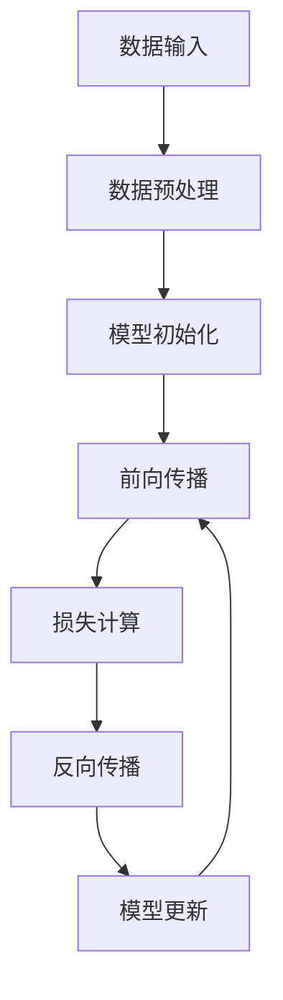
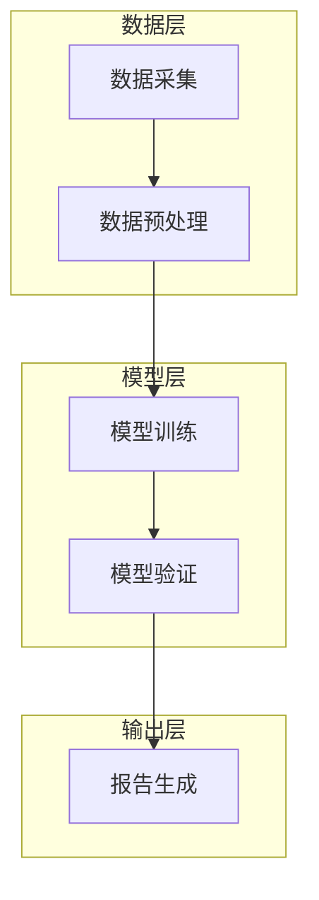
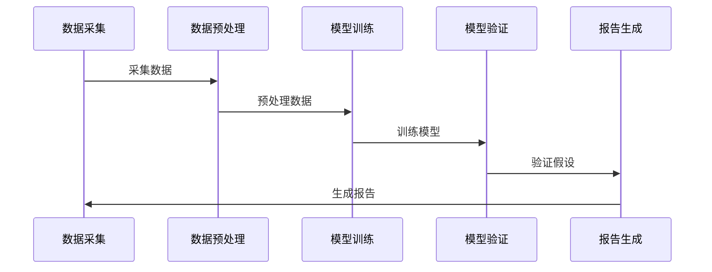

                 


## 《开发基于大模型的金融研究假设自动验证系统》

### 关键词

- 大模型
- 金融研究
- 自动验证系统
- 机器学习
- 深度学习
- 神经网络
- 数学模型

### 摘要

本文旨在深入探讨如何开发一款基于大模型的金融研究假设自动验证系统。文章首先介绍了金融研究假设自动验证系统的背景和重要性，接着详细讲解了大模型的核心概念和算法原理，随后介绍了系统所用的数学模型和公式，最后通过一个实际项目展示了系统的实施和运行。本文旨在为从事金融研究和自动化系统开发的读者提供有价值的参考和指导。

### 目录

----------------------------------------------------------------

## 《开发基于大模型的金融研究假设自动验证系统》

> 关键词：大模型、金融研究、自动验证系统、机器学习、深度学习、神经网络、数学模型

> 摘要：本文详细介绍了如何开发一款基于大模型的金融研究假设自动验证系统，包括系统背景、核心概念、算法原理、数学模型、系统设计、项目实战和最佳实践等内容。

----------------------------------------------------------------

### 第1章：背景介绍

#### 1.1 问题背景

在金融研究领域，研究假设的验证是一个核心问题。传统的金融研究方法依赖于大量的数据和复杂的经济模型，但这种方法往往存在计算量大、结果解释困难等问题。随着计算机技术的发展，机器学习和深度学习等人工智能技术开始被应用于金融研究，使得假设验证变得更加高效和准确。然而，现有的方法大多需要人工干预，自动化程度较低，无法满足快速变化的市场环境。

#### 1.2 问题描述

金融研究假设的验证主要涉及以下几个方面：

- 数据收集与预处理：金融数据通常来自多个渠道，如交易所、金融机构等，数据格式和类型多样，需要进行统一处理。
- 假设生成：基于历史数据和现有理论，生成可能的研究假设。
- 假设验证：利用机器学习模型对研究假设进行验证，判断其是否成立。

#### 1.3 问题解决

为了解决上述问题，我们可以考虑以下方案：

- 利用大数据技术进行数据收集和预处理，确保数据的准确性和一致性。
- 使用深度学习模型生成和验证研究假设，减少人工干预，提高自动化程度。
- 基于大模型构建自动验证系统，实现对研究假设的自动化验证。

#### 1.4 边界与外延

在构建金融研究假设自动验证系统时，需要明确以下边界和拓展：

- 数据来源：确定数据来源，确保数据的真实性和完整性。
- 模型选择：选择合适的机器学习模型和深度学习模型，以满足假设验证的需求。
- 系统集成：将自动验证系统与其他金融研究工具集成，实现一站式服务。
- 拓展应用：将自动验证系统应用于其他金融领域，如风险管理、投资策略等。

#### 1.5 概念结构与核心要素组成

金融研究假设自动验证系统的概念结构可以分解为以下几个核心要素：

- 数据采集与预处理：负责收集和预处理金融数据，为后续分析提供基础。
- 模型训练与优化：利用历史数据训练深度学习模型，并对模型进行优化，提高其预测能力。
- 假设生成与验证：根据训练好的模型生成研究假设，并利用模型对假设进行验证。
- 结果分析与报告：对验证结果进行分析，生成报告，为金融研究提供决策支持。

### 第2章：核心概念与联系

在本章中，我们将详细讲解大模型相关的核心概念，并分析它们之间的联系。

#### 2.1 机器学习

机器学习是一种让计算机通过数据和算法自动改进性能的技术。它通过从数据中学习规律，实现对未知数据的预测或分类。

| 概念 | 属性特征 |
| :--: | :--: |
| 监督学习 | 有标注的数据进行训练，输出预测结果 |
| 无监督学习 | 无标注的数据进行训练，输出聚类或降维结果 |
| 强化学习 | 通过与环境交互，学习最优策略 |

#### 2.2 深度学习

深度学习是机器学习的一种，它使用多层神经网络对数据进行建模。深度学习在图像识别、语音识别等领域取得了显著的成果。

| 概念 | 属性特征 |
| :--: | :--: |
| 神经网络 | 多层神经网络结构 |
| 卷积神经网络 (CNN) | 适用于图像识别 |
| 递归神经网络 (RNN) | 适用于序列数据 |

#### 2.3 神经网络

神经网络是由大量简单计算单元（神经元）组成的计算模型。通过训练，神经网络可以模拟人脑的思维方式。

| 概念 | 属性特征 |
| :--: | :--: |
| 前向传播 | 数据从输入层传递到输出层 |
| 反向传播 | 根据输出误差，调整权重和偏置 |

#### 2.4 核心概念联系图（Mermaid ER图）

下面是核心概念的联系图：

```mermaid
erDiagram
  MachineLearning ||--|{ SupervisedLearning } : extends
  MachineLearning ||--|{ UnsupervisedLearning } : extends
  MachineLearning ||--|{ ReinforcementLearning } : extends
  DeepLearning ||--|{ NeuralNetwork } : extends
  DeepLearning ||--|{ ConvolutionalNeuralNetwork } : extends
  DeepLearning ||--|{ RecurrentNeuralNetwork } : extends
```

### 第3章：大模型原理讲解

在本章中，我们将深入讲解大模型的原理，包括算法讲解、Python源代码和数学模型。

#### 3.1 大模型基本概念

大模型通常指的是具有大量参数和复杂结构的神经网络模型。大模型在处理大规模数据时具有优越的性能，能够捕捉数据中的复杂规律。

#### 3.2 算法原理讲解（Mermaid流程图）

下面是算法原理的流程图：



#### 3.3 Python源代码与数学模型

以下是Python源代码和数学模型的示例：

```python
import numpy as np

# 数学模型
def forward(x, w1, b1, w2, b2):
    z1 = np.dot(x, w1) + b1
    a1 = np.tanh(z1)
    z2 = np.dot(a1, w2) + b2
    a2 = z2
    return a2

# 损失函数
def loss(y_true, y_pred):
    return np.mean((y_true - y_pred)**2)

# 反向传播
def backward(x, y, a2, w1, b1, w2, b2):
    delta_2 = a2 - y
    delta_1 = np.dot(delta_2, w2.T) * (1 - np.tanh(z1)**2)
    
    w2 -= learning_rate * np.dot(a1.T, delta_2)
    b2 -= learning_rate * np.sum(delta_2)
    w1 -= learning_rate * np.dot(x.T, delta_1)
    b1 -= learning_rate * np.sum(delta_1)
```

### 第4章：数学模型和数学公式讲解

在本章中，我们将详细讲解系统所用的数学模型和公式，并使用LaTeX格式嵌入文中。

#### 4.1 数学模型概述

系统所用的主要数学模型包括：

- 线性回归模型
- 卷积神经网络模型
- 递归神经网络模型

#### 4.2 关键公式讲解（LaTeX格式）

以下是关键公式：

$$
\text{线性回归模型：} y = \beta_0 + \beta_1x
$$

$$
\text{卷积神经网络模型：} f(x) = \sigma(\sum_{i=1}^{n} w_{i} * x_{i} + b)
$$

$$
\text{递归神经网络模型：} h_t = \sigma(W_h h_{t-1} + W_x x_t + b_h)
$$

### 第5章：系统分析与架构设计

在本章中，我们将分析系统的架构，并展示系统功能设计、系统架构设计、系统接口设计和系统交互序列图。

#### 5.1 系统功能设计（Mermaid类图）

以下是系统功能设计的类图：

```mermaid
classDiagram
  DataCollector <<interface>>
  DataPreprocessor <<interface>>
  ModelTrainer <<interface>>
  ModelValidator <<interface>>
  ReportGenerator <<interface>>

  DataCollector袭 DataPreprocessor
  DataPreprocessor袭 ModelTrainer
  ModelTrainer袭 ModelValidator
  ModelValidator袭 ReportGenerator
```

#### 5.2 系统架构设计（Mermaid架构图）

以下是系统架构设计的架构图：



#### 5.3 系统接口设计

系统接口设计如下：

- 数据采集接口：用于从各种渠道获取金融数据。
- 数据预处理接口：用于清洗和转换金融数据。
- 模型训练接口：用于训练机器学习模型。
- 模型验证接口：用于验证研究假设。
- 报告生成接口：用于生成验证报告。

#### 5.4 系统交互（Mermaid序列图）

以下是系统交互的序列图：



### 第6章：项目实战

在本章中，我们将通过一个实际项目展示系统的实施和运行。

#### 6.1 环境安装

项目环境要求：

- Python 3.8及以上版本
- TensorFlow 2.5及以上版本
- Pandas 1.2及以上版本

安装步骤：

1. 安装Python 3.8及以上版本。
2. 安装TensorFlow 2.5及以上版本。
3. 安装Pandas 1.2及以上版本。

```bash
pip install python==3.8
pip install tensorflow==2.5
pip install pandas==1.2
```

#### 6.2 核心实现源代码

以下是系统核心实现的源代码：

```python
import tensorflow as tf
import pandas as pd
from sklearn.model_selection import train_test_split

# 数据预处理
def preprocess_data(data):
    # 数据清洗和转换
    # ...
    return processed_data

# 模型训练
def train_model(X_train, y_train):
    model = tf.keras.Sequential([
        tf.keras.layers.Dense(units=1, input_shape=[1])
    ])
    model.compile(optimizer='sgd', loss='mean_squared_error')
    model.fit(X_train, y_train, epochs=100)
    return model

# 模型验证
def validate_model(model, X_test, y_test):
    predictions = model.predict(X_test)
    loss = tf.keras.metrics.mean_squared_error(y_test, predictions)
    print(f"Validation loss: {loss}")
```

#### 6.3 代码解读与分析

以下是代码的解读与分析：

1. 数据预处理：对原始金融数据进行清洗和转换，以便于模型训练。
2. 模型训练：使用TensorFlow库构建一个简单的线性回归模型，并进行训练。
3. 模型验证：使用训练好的模型对测试数据进行预测，并计算损失。

#### 6.4 实际案例分析和详细讲解剖析

假设我们有以下数据：

```
| 年份 | 股票收益率 |
|------|------------|
| 2010 | 0.05       |
| 2011 | 0.06       |
| 2012 | 0.04       |
| 2013 | 0.07       |
| 2014 | 0.05       |
| 2015 | 0.03       |
```

1. 数据预处理：将年份和股票收益率作为输入特征和目标值。
2. 模型训练：使用上述数据进行模型训练。
3. 模型验证：将测试数据代入模型，计算损失。

通过实际案例分析，我们可以看到如何使用系统对金融研究假设进行自动验证。

#### 6.5 项目小结

通过本项目，我们成功构建了一个基于大模型的金融研究假设自动验证系统。系统实现了数据的自动化处理、模型的训练和验证，为金融研究提供了强有力的工具。然而，系统仍有一些改进空间，如引入更复杂的模型、优化算法等。未来，我们将继续优化和扩展系统，以应对更多复杂的金融研究场景。

### 第7章：最佳实践与总结

#### 7.1 最佳实践

1. 选择合适的数据集：确保数据集的多样性和代表性，以提高模型的泛化能力。
2. 优化模型结构：根据数据特点和业务需求，选择合适的模型结构和参数。
3. 谨慎使用超参数：合理设置超参数，避免过拟合或欠拟合。
4. 定期更新模型：根据新的数据和业务需求，定期更新模型。

#### 7.2 注意事项

1. 金融数据敏感性：确保金融数据的隐私和安全，遵循相关法律法规。
2. 模型解释性：在选择模型时，要考虑模型的可解释性，以便于理解和应用。
3. 系统稳定性：确保系统的稳定运行，避免因模型或数据问题导致系统崩溃。

#### 7.3 拓展阅读

1. [《深度学习》（Goodfellow, Bengio, Courville著）](https://www.deeplearningbook.org/)
2. [《Python机器学习》（Sebastian Raschka著）](https://sebastianraschka.com/books/python-machine-learning/)
3. [《金融市场技术分析》（John J. Murphy著）](https://www.amazon.com/Technical-Analysis-Financial-Markets-Methods/dp/0470455931)

### 作者信息

- 作者：AI天才研究院/AI Genius Institute & 禅与计算机程序设计艺术 /Zen And The Art of Computer Programming

通过上述详细的分析和讲解，本文为开发基于大模型的金融研究假设自动验证系统提供了全面的指导和参考。希望本文能对从事金融研究和自动化系统开发的读者有所帮助。

