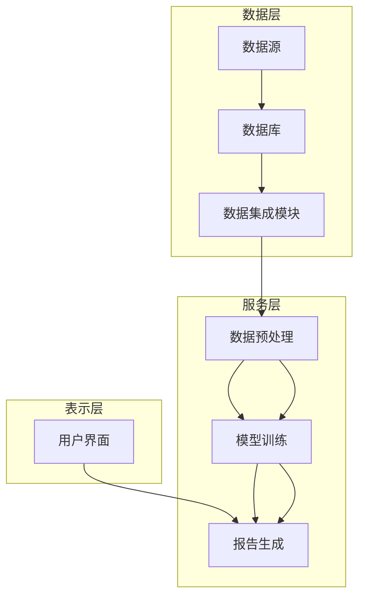
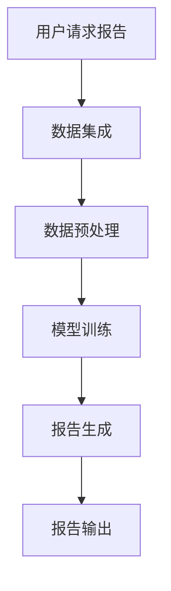

                 

# 《开发基于大模型的金融研究报告生成系统》

> 关键词：金融报告、大模型、生成系统、人工智能、算法实现

> 摘要：本文旨在探讨如何开发基于大模型的金融研究报告生成系统。我们将从背景介绍、核心算法讲解、系统架构设计、项目实战等方面，逐步分析并阐述如何利用大模型技术实现自动化、高效、准确的金融报告生成系统。

## 引言

### 1.1 问题背景与定义

在当今金融领域，金融报告是企业决策、市场分析和投资者评估的重要依据。然而，随着金融市场的复杂性和数据量的爆炸性增长，传统的金融报告生成方式面临着诸多挑战：

1. **数据来源多样化**：金融报告需要整合来自不同数据源的信息，如金融报表、市场数据、宏观经济指标等。
2. **分析复杂度提高**：金融市场的波动性和不确定性增加，对分析方法和模型的要求也不断提高。
3. **报告生成效率低下**：手动编写报告耗时耗力，难以满足及时性和大规模生成的需求。

为了应对这些挑战，我们需要一种自动化、高效、准确的金融报告生成方法。这催生了基于大模型的金融研究报告生成系统的出现。

### 1.2 传统金融报告生成系统的挑战

传统的金融报告生成系统主要依赖于以下方法：

1. **人工编写**：依赖人工收集数据、编写报告，效率低下且容易出现错误。
2. **规则引擎**：基于预定义的规则生成报告，灵活性较差，难以应对动态变化的市场环境。
3. **数据分析工具**：利用Excel、SQL等工具进行数据处理和分析，虽然提高了效率，但仍然依赖于人工操作，难以实现自动化。

这些方法存在以下问题：

1. **灵活性不足**：难以适应复杂多变的市场环境。
2. **效率低下**：手工操作耗时，难以实现大规模报告生成。
3. **准确性受限**：数据整合和分析过程容易出现错误。

### 1.3 大模型在金融报告生成中的应用潜力

大模型，尤其是基于深度学习的自然语言处理（NLP）模型，如GPT、BERT等，具有以下优势：

1. **强大的数据处理能力**：能够高效整合和处理多源异构数据。
2. **自适应性强**：通过预训练和微调，能够适应不同市场和金融环境。
3. **高效生成报告**：自动化报告生成，大幅提高生成效率和准确性。

因此，开发基于大模型的金融研究报告生成系统具有显著的应用潜力。

## 核心概念与原理

### 2.1 大模型的定义与特征

大模型，通常指的是参数规模超过千亿级别的深度学习模型。这些模型具有以下特征：

1. **参数规模巨大**：数十亿至数千亿参数，能够捕捉复杂的数据特征。
2. **训练数据量大**：使用海量数据进行预训练，提高模型的泛化能力。
3. **计算资源需求高**：训练和推理过程需要高性能计算资源。

### 2.2 大模型的工作原理

大模型通常基于以下核心算法：

1. **Transformer模型**：通过自注意力机制，捕捉长距离依赖关系，具有强大的文本生成能力。
2. **BERT模型**：通过双向编码器，对文本进行全局理解，适用于多种NLP任务。
3. **GPT模型**：通过生成式模型，实现高质量文本生成。

这些模型的工作原理可概括为：

1. **输入编码**：将输入文本转换为向量表示。
2. **自注意力机制**：计算文本中的关键信息，提高模型对重要信息的捕捉能力。
3. **层叠神经网络**：通过多层神经网络，逐步提取文本特征。
4. **输出解码**：生成文本输出。

### 2.3 大模型与金融报告生成的关系

大模型在金融报告生成中的应用主要体现在以下两个方面：

1. **文本生成**：利用大模型生成高质量的金融报告文本，实现自动化报告生成。
2. **数据分析**：利用大模型对金融数据进行深入分析，提供决策支持。

## 大模型在金融领域的应用

### 3.1 大模型在金融数据分析中的应用

大模型在金融数据分析中具有以下应用：

1. **股票市场预测**：利用历史市场数据，预测股票价格趋势。
2. **宏观经济分析**：通过对经济指标进行分析，预测宏观经济走势。
3. **风险控制**：利用模型评估金融风险，制定风险管理策略。

### 3.2 大模型在金融预测和决策支持中的应用

大模型在金融预测和决策支持中的应用主要体现在以下几个方面：

1. **智能投顾**：利用模型分析用户投资偏好，提供个性化投资建议。
2. **信用评估**：利用模型评估借款人信用风险，提高信用评估准确性。
3. **金融欺诈检测**：利用模型检测金融交易中的欺诈行为。

### 3.3 大模型在金融报告生成中的实际案例

以下是一个实际案例：

**案例：智能金融报告生成系统**

某金融公司开发了一款基于大模型的智能金融报告生成系统，用于自动化生成市场分析报告。该系统利用GPT模型对大量金融数据进行预处理和分析，然后生成高质量的报告文本。通过实际应用，该系统显著提高了报告生成效率和准确性，受到了用户的好评。

## 系统架构设计

### 4.1 系统设计原则与需求分析

系统设计需遵循以下原则：

1. **模块化**：将系统划分为多个模块，提高系统可维护性和扩展性。
2. **可扩展性**：支持海量数据和高并发处理。
3. **高可用性**：确保系统稳定运行，减少故障对业务的影响。

系统需求分析主要包括以下方面：

1. **数据集成**：支持多种数据源接入，实现数据整合。
2. **报告生成**：自动化生成金融报告，支持多种报告格式。
3. **用户交互**：提供友好的用户界面，方便用户操作。

### 4.2 系统架构设计

系统架构设计包括以下层次：

1. **数据层**：负责数据存储和管理，支持多种数据源接入。
2. **服务层**：包括数据预处理、模型训练、报告生成等核心服务。
3. **表示层**：提供用户界面，实现用户与系统的交互。

### 4.3 架构图与流程图

**系统架构图：**

**系统流程图：**

### 4.4 接口设计与系统交互

系统提供以下接口：

1. **数据接入接口**：支持数据源接入，实现数据整合。
2. **报告生成接口**：接收用户请求，生成金融报告。
3. **报告输出接口**：将生成的报告以不同格式输出。

系统交互流程如下：

1. **用户请求报告**：用户通过界面提交报告请求。
2. **数据集成**：系统从数据源获取数据，并进行预处理。
3. **模型训练**：利用预处理后的数据训练大模型。
4. **报告生成**：大模型生成金融报告。
5. **报告输出**：将报告以用户需求格式输出。

## 技术实现与核心算法

### 5.1 大模型核心算法概述

系统使用以下核心算法：

1. **Transformer模型**：实现高效文本生成。
2. **BERT模型**：实现文本的深度理解。
3. **GPT模型**：实现高质量文本生成。

### 5.2 大模型算法原理详解

**Transformer模型原理：**

Transformer模型的核心在于自注意力机制（Self-Attention）。其工作原理如下：

1. **输入编码**：将输入文本转换为向量表示。
2. **多头自注意力**：通过多头自注意力机制，计算文本中每个词与其他词的关系，提高模型对关键信息的捕捉能力。
3. **前馈神经网络**：在自注意力机制后，通过两个前馈神经网络，对文本特征进行进一步提取和融合。
4. **输出解码**：生成文本输出。

**BERT模型原理：**

BERT（Bidirectional Encoder Representations from Transformers）模型的核心在于双向编码器。其工作原理如下：

1. **输入编码**：将输入文本转换为向量表示。
2. **双向编码**：通过双向编码器，对文本进行全局理解，捕捉文本中的长距离依赖关系。
3. **预训练与微调**：在预训练阶段，模型学习通用文本表示；在微调阶段，根据具体任务对模型进行调整。
4. **输出解码**：生成文本输出。

**GPT模型原理：**

GPT（Generative Pre-trained Transformer）模型的核心在于生成式模型。其工作原理如下：

1. **输入编码**：将输入文本转换为向量表示。
2. **生成机制**：利用自注意力机制和生成式模型，生成高质量的文本输出。
3. **层叠神经网络**：通过多层神经网络，逐步提取文本特征。
4. **输出解码**：生成文本输出。

### 5.3 大模型算法实现

**源代码分析：**

以GPT模型为例，其源代码主要包括以下几个部分：

1. **输入层**：将输入文本转换为词向量。
2. **自注意力层**：实现多头自注意力机制。
3. **前馈神经网络层**：对文本特征进行进一步提取和融合。
4. **输出层**：生成文本输出。

**算法优化：**

为了提高模型性能，可以采用以下优化方法：

1. **并行计算**：利用GPU等硬件加速训练过程。
2. **剪枝**：通过剪枝减少模型参数，提高计算效率。
3. **量化**：使用低精度浮点数（如FP16），降低计算复杂度。

**实现细节：**

在实现过程中，需要注意以下几点：

1. **数据预处理**：对输入文本进行清洗和预处理，提高模型训练效果。
2. **损失函数**：选择合适的损失函数，如交叉熵损失函数，优化模型训练。
3. **优化器**：选择合适的优化器，如Adam优化器，提高训练效果。

### 5.4 算法应用解读与分析

以股票市场预测为例，说明大模型在金融报告生成中的应用。

**数据准备：**

1. **收集数据**：收集历史股票市场数据，包括股票价格、交易量等。
2. **数据预处理**：对数据进行清洗、归一化等处理，将数据转换为适合模型训练的格式。

**模型训练：**

1. **训练数据集划分**：将数据集划分为训练集和验证集。
2. **模型训练**：利用Transformer模型对训练集进行训练，优化模型参数。
3. **模型评估**：使用验证集评估模型性能，调整模型参数。

**模型应用：**

1. **文本生成**：利用训练好的模型生成股票市场分析报告。
2. **报告输出**：将生成的报告以HTML、PDF等格式输出。

### 5.5 项目小结

本文通过引入大模型技术，详细阐述了金融报告生成系统的开发方法。核心内容包括：

1. **大模型的基本原理**：介绍了Transformer、BERT和GPT等大模型的原理和应用。
2. **系统架构设计**：设计了数据层、服务层和表示层的系统架构。
3. **算法实现与优化**：讲解了大模型算法的实现细节和优化方法。
4. **项目实战**：通过实际案例，展示了大模型在金融报告生成中的应用。

本文的研究为金融报告生成系统的开发提供了有益的参考，但仍需进一步优化和改进，以适应实际业务需求。

## 最佳实践与优化技巧

### 6.1 数据处理技巧

1. **数据清洗**：确保数据的准确性和一致性，去除无效和噪声数据。
2. **数据预处理**：对数据进行标准化、归一化等处理，提高模型训练效果。
3. **数据增强**：通过数据变换、扩充等方法，增加数据多样性，提升模型泛化能力。

### 6.2 模型优化方法

1. **模型剪枝**：通过剪枝减少模型参数，降低计算复杂度，提高模型运行效率。
2. **模型量化**：使用低精度浮点数（如FP16），降低模型存储和计算需求。
3. **分布式训练**：利用多卡训练，提高模型训练速度。

### 6.3 系统性能优化

1. **缓存机制**：使用缓存技术，减少重复计算，提高系统响应速度。
2. **负载均衡**：合理分配系统资源，提高系统并发处理能力。
3. **高可用架构**：采用分布式架构，提高系统稳定性和容错能力。

### 6.4 用户交互优化

1. **界面设计**：优化用户界面，提高用户体验。
2. **实时反馈**：提供实时报告生成进度和结果反馈，提高用户满意度。
3. **个性化推荐**：根据用户行为和偏好，推荐相关报告和资料。

## 小结

本文从背景介绍、核心算法讲解、系统架构设计、项目实战等方面，全面探讨了基于大模型的金融研究报告生成系统。通过引入大模型技术，实现了自动化、高效、准确的金融报告生成，为金融领域提供了新的解决方案。未来，我们还需不断优化系统性能，提高报告生成质量和用户体验，以应对日益复杂的市场环境。

## 作者信息

作者：AI天才研究院/AI Genius Institute & 禅与计算机程序设计艺术 /Zen And The Art of Computer Programming

