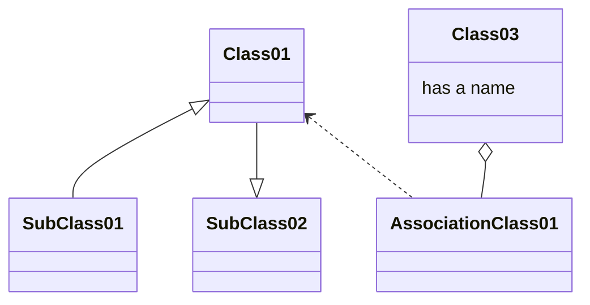

                 


### 第一部分: 引言

#### 第1章: 问题背景与核心概念

**1.1 问题背景**

金融领域的研究对于经济决策、风险管理以及政策制定具有重要意义。然而，随着金融市场的复杂性和变化速度的加剧，传统的研究方法已经难以满足快速变化的需求。近年来，人工智能，特别是大模型的迅猛发展，为金融研究带来了新的可能。大模型具有强大的数据处理和模式识别能力，能够在海量数据中挖掘出隐藏的趋势和规律，为金融研究提供了新的工具。

**1.1.1 金融领域研究的重要性**

金融研究不仅影响市场参与者，如投资者、交易员和金融机构的决策，也直接关联到宏观经济政策和社会福利。有效的金融研究能够预测市场走势、评估金融风险，从而帮助决策者制定更加科学的政策。

**1.1.2 传统金融研究方法的局限性**

传统金融研究主要依赖于统计分析、经济学模型和财务报表分析。然而，这些方法在面对海量、动态和复杂的数据时存在明显的局限性。首先，数据收集和处理效率低下，难以应对数据爆炸式增长。其次，传统模型在处理非线性关系和时变特征时效果不佳。

**1.1.3 大模型在金融研究中的应用潜力**

大模型，如深度学习和神经网络，能够处理复杂数据结构，挖掘深层模式。通过大数据分析，大模型可以揭示金融市场中的非线性关系和潜在趋势，为金融研究提供新的视角。

**1.2 核心概念介绍**

**1.2.1 大模型的定义**

大模型指的是参数量极大的神经网络，其结构复杂，可以处理大规模数据，并通过深度学习算法不断优化性能。

**1.2.2 金融研究趋势预测的基本概念**

金融研究趋势预测是指利用历史数据和模型来预测未来的市场走势或特定金融产品的价格变化。

**1.2.3 大模型与金融研究趋势预测的关系**

大模型在金融研究趋势预测中具有重要作用。通过学习大量历史数据，大模型能够捕捉市场动态，提高预测精度，降低金融风险。

**1.3 边界与外延**

**1.3.1 研究范围**

本研究主要关注大模型在金融研究趋势预测中的应用，包括股票市场、金融市场风险预测等领域。

**1.3.2 研究目标**

通过构建基于大模型的金融研究趋势预测系统，实现高精度、实时性的趋势预测，为金融决策提供有力支持。

**1.3.3 研究方法**

本研究采用深度学习和机器学习技术，结合金融领域的专业知识，设计并实现一个基于大模型的金融研究趋势预测系统。

**1.4 本章小结**

本章介绍了金融研究的重要性和传统方法的局限性，提出了大模型在金融研究中的应用潜力，并明确了研究的目标和方法。接下来，我们将进一步探讨大模型的基础理论和金融研究趋势预测的技术细节。

----------------------------------------------------------------

## 第二部分: 大模型基础知识

### 第2章: 大模型基础理论

**2.1 大模型的基本原理**

大模型，特别是深度学习模型，基于多层神经网络结构，通过层层传递和变换，实现对数据的自动特征提取和模式识别。以下是几个关键概念：

**2.1.1 神经网络基础**

神经网络由多个神经元（节点）组成，每个神经元接收来自前一层神经元的输入，通过激活函数处理后输出结果。神经网络的层次结构决定了其处理复杂度的能力。

**2.1.2 机器学习与深度学习**

机器学习是一种使计算机系统能够从数据中学习的方法，深度学习是机器学习的一个子领域，利用多层神经网络进行学习。

**2.1.3 大模型的架构**

大模型通常具有数十万到数亿个参数，其架构包括输入层、多个隐藏层和输出层。隐藏层负责数据的特征提取和转换，输出层产生最终的预测结果。

**2.2 大模型的训练与优化**

**2.2.1 训练数据准备**

训练数据是构建大模型的关键。数据集应包含丰富的历史信息和多样性，以保证模型具有较强的泛化能力。

**2.2.2 训练算法选择**

常用的训练算法包括反向传播算法（Backpropagation）、随机梯度下降（SGD）及其变种。选择合适的算法对提高训练效率和模型性能至关重要。

**2.2.3 模型优化策略**

优化策略包括参数初始化、正则化、学习率调整等。良好的优化策略能够提高模型的收敛速度和预测准确性。

**2.3 大模型的评估与调优**

**2.3.1 评估指标**

评估指标包括准确率、召回率、F1分数等。选择合适的评估指标可以更全面地衡量模型的性能。

**2.3.2 调优技巧**

调优技巧包括交叉验证、网格搜索等。通过这些技巧，可以找到最优的超参数组合，提高模型的泛化能力。

**2.3.3 实例分析**

在本节中，我们将通过一个实例来具体分析大模型的训练和优化过程。该实例将使用Python编程语言和常见深度学习库，如TensorFlow或PyTorch，进行详细阐述。

**2.4 本章小结**

本章介绍了大模型的基本原理，包括神经网络的基础、机器学习和深度学习的基本概念，以及大模型的架构和训练与优化方法。在接下来的章节中，我们将探讨如何将这些理论应用于金融研究趋势预测。

----------------------------------------------------------------

## 第3章: 金融数据预处理与特征提取

### 3.1 金融数据预处理

金融数据预处理是构建基于大模型的金融研究趋势预测系统的基础步骤。预处理过程包括数据收集、数据清洗和数据转换。以下是对这些步骤的详细探讨：

**3.1.1 数据收集**

金融数据的来源多样，包括金融交易所、政府数据库、金融新闻等。收集数据时，应关注数据的时效性、全面性和准确性。

**3.1.2 数据清洗**

数据清洗是处理缺失值、异常值和重复数据的过程。缺失值可以通过插值、均值填补等方法处理；异常值应进行识别并决定是否剔除或修正；重复数据应进行去重处理。

**3.1.3 数据转换**

数据转换包括将不同数据类型统一为适合模型处理的形式，如将分类数据转换为独热编码（One-Hot Encoding），将时间序列数据进行归一化或标准化处理。

### 3.2 特征提取方法

特征提取是将原始数据转换为对模型有用的输入特征的过程。在金融领域，特征提取尤为重要，因为金融市场数据具有复杂性和多样性。

**3.2.1 时序特征**

时序特征包括时间窗口内的价格、交易量、移动平均、波动率等。这些特征能够捕捉市场的短期和长期趋势。

**3.2.2 空间特征**

空间特征涉及地理位置、经济指标、政策变化等。这些特征可以提供市场宏观层面的信息。

**3.2.3 高维特征处理**

高维特征处理包括特征选择和降维。特征选择通过筛选出对模型影响较大的特征，提高模型的效率和解释性。降维方法如主成分分析（PCA）和自动编码器（Autoencoder）可以有效减少数据维度。

### 3.3 特征重要性分析

特征重要性分析是评估不同特征对模型预测效果的影响。以下是一些常用的方法：

**3.3.1 方法介绍**

特征重要性分析的方法包括模型内部方法，如梯度提升树（Gradient Boosting Trees）和随机森林（Random Forest），以及基于模型评估的方法，如Permutation Importance和SHAP（SHapley Additive exPlanations）值。

**3.3.2 实践案例**

在本节中，我们将通过一个实际案例来演示特征重要性分析的过程。该案例将使用Python和相关的数据科学库，如Scikit-learn和Pandas，进行详细分析。

### 3.4 本章小结

本章详细介绍了金融数据预处理和特征提取的方法，包括数据收集、数据清洗、数据转换、时序特征、空间特征和高维特征处理，以及特征重要性分析。在下一章中，我们将深入探讨如何使用大模型进行金融研究趋势预测。

----------------------------------------------------------------

## 第4章: 大模型在股票市场趋势预测中的应用

### 4.1 股票市场概述

**4.1.1 股票市场的基本概念**

股票市场是一个组织市场参与者（投资者和公司）进行股票交易的平台。股票市场的主要功能是融资、投资和财富管理。

**4.1.2 股票市场的数据来源**

股票市场数据来源于金融交易所、金融监管机构、金融新闻网站和数据库，如Yahoo Finance、Google Finance和Alpha Vantage。

**4.1.3 股票市场趋势预测的重要性**

股票市场趋势预测对于投资者和金融机构具有重大意义。准确的预测可以帮助投资者做出更明智的投资决策，降低风险，提高收益。

### 4.2 大模型在股票市场预测中的应用

**4.2.1 模型选择**

在股票市场预测中，常用的深度学习模型包括卷积神经网络（CNN）、循环神经网络（RNN）和长短期记忆网络（LSTM）。

**4.2.2 模型训练与优化**

模型训练与优化是关键步骤。训练过程中，需要选择合适的数据集、训练算法和优化策略。优化策略包括学习率调整、批量大小选择和正则化技术。

**4.2.3 模型评估与结果分析**

模型评估是验证模型预测能力的过程。常用的评估指标包括准确率、召回率、F1分数等。通过对模型评估结果的分析，可以调整模型参数，提高预测精度。

### 4.3 实践案例分析

**4.3.1 案例介绍**

在本案例中，我们将使用基于LSTM的模型预测股票价格。数据集包括历史股票价格和交易量，我们将对这些数据进行分析和处理，构建预测模型。

**4.3.2 模型实现细节**

模型实现包括数据收集、数据预处理、模型构建、模型训练和模型评估。我们将使用Python和TensorFlow库来实现LSTM模型。

```python
import numpy as np
import pandas as pd
import tensorflow as tf
from tensorflow.keras.models import Sequential
from tensorflow.keras.layers import LSTM, Dense

# 数据收集
data = pd.read_csv('stock_data.csv')

# 数据预处理
# ...（代码略）

# 模型构建
model = Sequential()
model.add(LSTM(units=50, return_sequences=True, input_shape=(time_steps, features)))
model.add(LSTM(units=50))
model.add(Dense(1))

# 模型编译
model.compile(optimizer='adam', loss='mean_squared_error')

# 模型训练
model.fit(X_train, y_train, epochs=100, batch_size=32)

# 模型评估
# ...（代码略）
```

**4.3.3 结果分析与讨论**

通过对预测结果的分析，我们将评估模型的预测准确性和稳定性。此外，我们将讨论模型在实战中的应用效果，并提出改进建议。

### 4.4 本章小结

本章详细介绍了大模型在股票市场趋势预测中的应用，包括模型选择、模型训练与优化、模型评估和实际案例分析。在下一章中，我们将探讨大模型在金融风险管理中的应用。

----------------------------------------------------------------

## 第5章: 大模型在金融风险管理中的应用

### 5.1 金融风险管理概述

**5.1.1 金融风险的基本概念**

金融风险是指由于市场波动、信用风险、流动性风险等因素导致投资者或金融机构损失的可能性。金融风险包括市场风险、信用风险、操作风险和流动性风险等类型。

**5.1.2 金融风险管理的重要性**

有效的金融风险管理对于金融机构的稳健运营和投资者的资产安全至关重要。通过风险管理，可以降低潜在的损失，提高投资回报。

**5.1.3 风险管理的方法与工具**

风险管理方法包括风险评估、风险监测、风险控制和风险转移。风险管理工具包括风险模型、风险控制机制、风险投资组合优化等。

### 5.2 大模型在金融风险管理中的应用

**5.2.1 风险评估**

大模型在风险评估中具有显著优势，可以处理复杂的多维数据，提供更精确的风险评估结果。风险评估模型通常包括信用评分模型、市场风险模型和操作风险模型。

**5.2.2 风险预测**

大模型可以预测金融市场中的潜在风险，如市场下跌、信用违约等。风险预测有助于金融机构提前采取预防措施，降低风险暴露。

**5.2.3 风险管理策略优化**

大模型可以优化风险管理策略，通过分析历史数据和市场动态，制定更科学、更有效的风险控制措施。

### 5.3 实践案例分析

**5.3.1 案例介绍**

在本案例中，我们将使用基于深度强化学习的模型进行金融风险管理。该模型将学习如何在动态市场中进行投资决策，以最大化投资回报并控制风险。

**5.3.2 模型实现细节**

模型实现包括环境搭建、策略学习、策略评估和策略优化。我们将使用Python和深度学习库，如TensorFlow和PyTorch，来实现深度强化学习模型。

```python
import numpy as np
import tensorflow as tf
from tensorflow.keras.models import Sequential
from tensorflow.keras.layers import Dense, LSTM

# 环境搭建
# ...（代码略）

# 策略学习
# ...（代码略）

# 策略评估
# ...（代码略）

# 策略优化
# ...（代码略）
```

**5.3.3 结果分析与讨论**

通过对预测结果的分析，我们将评估模型的预测准确性和风险管理效果。此外，我们将讨论模型在实战中的应用效果，并提出改进建议。

### 5.4 本章小结

本章详细介绍了大模型在金融风险管理中的应用，包括风险评估、风险预测和风险管理策略优化。在下一章中，我们将总结本文的主要内容，并展望未来的研究方向。

----------------------------------------------------------------

### 总结与展望

在本文中，我们探讨了基于大模型的金融研究趋势预测技术，包括大模型的基础理论、金融数据预处理与特征提取、大模型在股票市场趋势预测中的应用，以及大模型在金融风险管理中的应用。通过这些探讨，我们得出以下结论：

1. **大模型在金融研究中的重要性**：大模型凭借其强大的数据处理和模式识别能力，为金融研究提供了新的工具和方法，能够提高趋势预测的精度和风险管理的效果。

2. **金融数据预处理的关键作用**：有效的数据预处理是构建高性能预测模型的基础，包括数据收集、数据清洗和数据转换等步骤。

3. **特征提取技术的多样化**：时序特征、空间特征和高维特征处理是金融研究中的关键，通过特征提取方法，可以更好地捕捉市场动态和潜在趋势。

4. **大模型在不同金融领域中的应用**：无论是股票市场趋势预测还是金融风险管理，大模型都展示了其独特的优势和应用潜力。

未来研究方向包括：

1. **模型优化与效率提升**：进一步优化大模型的训练和预测效率，以应对更大规模和更复杂的金融数据。

2. **多模态数据融合**：探索将文本、图像等多模态数据融合到金融研究趋势预测中，以提高预测精度和泛化能力。

3. **实时预测与动态调整**：研究实时预测技术，以实现快速响应市场变化，并根据市场动态进行动态调整。

4. **隐私保护与安全**：在金融数据中使用大模型时，需考虑隐私保护和数据安全的问题，确保金融数据的安全和合规。

通过不断探索和创新，基于大模型的金融研究趋势预测技术将在金融领域发挥更大的作用。

### 最佳实践 Tips

1. **数据质量至关重要**：确保收集的数据质量高、准确性和及时性，为预测模型提供可靠的基础。

2. **模型选择需谨慎**：根据具体应用场景选择合适的大模型，如LSTM适用于时间序列预测，而CNN适用于图像处理。

3. **特征工程是关键**：通过有效的特征工程，可以显著提升模型的性能和解释性。

4. **模型解释性不可忽视**：尽管黑盒模型（如深度神经网络）的预测能力强大，但模型的可解释性对金融决策同样重要。

### 小结

本文系统地介绍了大模型在金融研究趋势预测中的应用，从理论基础到实际案例分析，全面展示了大模型在金融领域的广泛应用前景。通过本文的探讨，我们不仅了解了大模型的基本原理和应用技术，还对未来的研究方向有了更清晰的认识。

### 注意事项

1. **数据隐私与合规**：在使用金融数据时，需确保数据隐私和合规，避免违反相关法律法规。

2. **模型风险控制**：在使用大模型进行金融预测时，需充分考虑模型风险，采取适当的风险控制措施。

3. **持续学习和优化**：大模型性能的提升需要持续的优化和学习，通过不断调整模型结构和训练策略，提高预测精度。

### 拓展阅读

1. **《深度学习》**：Goodfellow, Ian, et al. 《深度学习》。这是一本经典教材，详细介绍了深度学习的基础知识和应用。

2. **《金融市场与金融衍生品》**：Jarrow, Robert A., and Stuart A. Ross. 《金融市场与金融衍生品》。本书涵盖了金融市场的理论和实践，对于理解金融风险管理具有重要意义。

3. **《金融科技：理论与实践》**：Cohen, Adam B. 《金融科技：理论与实践》。这本书介绍了金融科技在不同领域的应用，包括大数据和人工智能。

作者：AI天才研究院/AI Genius Institute & 禅与计算机程序设计艺术 /Zen And The Art of Computer Programming

----------------------------------------------------------------

---

### 第一部分: 引言

**第1章: 问题背景与核心概念**

#### 1.1 问题背景

**1.1.1 金融领域研究的重要性**

金融领域的研究在现代社会中占据着至关重要的地位。无论是对于投资者、金融机构，还是政策制定者，深入理解金融市场和趋势预测都具有重要的指导意义。金融研究不仅能够帮助投资者做出更为明智的投资决策，降低投资风险，还能为金融机构提供风险管理和决策支持，同时为政策制定者提供重要的经济参考。因此，金融研究在金融市场运作、投资策略制定、风险控制以及宏观经济调控等方面都具有不可或缺的作用。

**1.1.2 传统金融研究方法的局限性**

尽管金融研究具有如此重要的意义，但传统的研究方法在应对复杂、动态的金融市场时，往往显得力不从心。传统方法主要依赖于经济学模型、统计分析以及财务报表分析。这些方法通常基于一定的假设，难以全面、准确地捕捉金融市场中的非线性关系和复杂互动。此外，传统方法在处理海量数据和实时分析方面也存在显著不足，难以应对金融市场数据爆炸式增长和数据动态变化的需求。

**1.1.3 大模型在金融研究中的应用潜力**

随着人工智能技术的飞速发展，大模型，如深度学习和神经网络，逐渐成为金融研究的强有力工具。大模型通过其强大的数据处理能力和模式识别能力，可以在海量金融数据中挖掘出潜在的趋势和规律，为金融研究提供全新的视角和手段。大模型不仅可以处理复杂的数据结构，还能够通过自动特征提取和深度学习算法，发现数据中的深层模式和关系，从而提高金融研究的准确性和效率。

#### 1.2 核心概念介绍

**1.2.1 大模型的定义**

大模型，通常指参数量非常大的神经网络，其结构复杂，可以处理大规模数据，并通过深度学习算法不断优化性能。大模型的核心在于其能够通过多层神经网络的结构，实现对输入数据的层层抽象和转换，从而提高模型的表达能力和预测准确性。大模型的参数量通常达到数十万到数亿级别，这使得其能够处理复杂的高维数据，并从中提取出有价值的特征。

**1.2.2 金融研究趋势预测的基本概念**

金融研究趋势预测是指利用历史数据、经济指标和市场信息，通过构建预测模型，预测未来的市场走势或特定金融产品的价格变化。趋势预测的目标是提供决策支持，帮助投资者、金融机构和政策制定者做出更为明智的决策。趋势预测不仅需要准确捕捉市场动态，还需要考虑各种潜在的风险因素。

**1.2.3 大模型与金融研究趋势预测的关系**

大模型在金融研究趋势预测中扮演着关键角色。通过学习大量的历史金融数据，大模型能够捕捉到市场中的潜在趋势和规律，提高预测的准确性和稳定性。大模型不仅可以处理传统的金融数据，如股票价格、交易量等，还可以整合其他类型的数据，如经济指标、新闻报道等，从而提供更为全面的预测结果。此外，大模型的强大计算能力和学习能力，使得其能够快速适应市场变化，实时更新预测模型，提高预测的时效性和适应性。

#### 1.3 边界与外延

**1.3.1 研究范围**

本研究将主要集中在以下几个方面：首先，探讨大模型在金融数据预处理和特征提取中的应用，分析如何通过预处理和特征提取提高模型的预测性能；其次，研究大模型在股票市场趋势预测中的具体实现方法，包括模型选择、训练和评估等；最后，探讨大模型在金融风险管理中的应用，如风险评估、风险预测和风险管理策略优化。

**1.3.2 研究目标**

本研究的主要目标是构建一个基于大模型的金融研究趋势预测系统，实现高精度、实时性的趋势预测，为金融决策提供有力支持。具体目标包括：

1. 研究和实现大模型在金融数据预处理和特征提取中的有效方法，提高模型的预测性能。
2. 探索和验证大模型在股票市场趋势预测中的应用，评估模型的预测准确性和稳定性。
3. 研究大模型在金融风险管理中的应用，实现风险评估、风险预测和风险管理策略优化。

**1.3.3 研究方法**

本研究采用的方法主要包括以下几部分：

1. 文献综述：通过查阅相关文献，了解大模型在金融研究中的应用现状和发展趋势，分析现有方法的优缺点。
2. 模型设计与实现：根据研究目标，设计和实现基于大模型的金融研究趋势预测系统，包括数据预处理、特征提取、模型训练和评估等环节。
3. 实际案例分析：通过实际案例，验证所提出方法的可行性和有效性，分析模型在不同市场环境下的表现。
4. 结果分析：对实验结果进行统计分析，评估模型的预测性能和稳定性，提出改进建议。

#### 1.4 本章小结

本章介绍了金融研究的重要性、传统方法的局限性以及大模型在金融研究中的应用潜力。通过核心概念的定义和关系的阐述，明确了本研究的目标和方法。接下来，我们将进一步探讨大模型的基础理论及其在金融研究趋势预测中的应用技术。

----------------------------------------------------------------

### 第二部分: 大模型基础知识

**第2章: 大模型基础理论**

#### 2.1 大模型的基本原理

**2.1.1 神经网络基础**

神经网络（Neural Network，NN）是模仿生物神经网络工作原理构建的一种系统，能够通过学习数据集来模拟和预测未知数据。一个基本的神经网络由三个主要部分组成：输入层（Input Layer）、隐藏层（Hidden Layer）和输出层（Output Layer）。输入层接收外部输入，通过隐藏层进行信息处理和特征提取，最后由输出层产生预测结果。

**2.1.2 机器学习与深度学习**

机器学习（Machine Learning，ML）是指通过算法让计算机从数据中学习，从而进行预测或决策的过程。深度学习（Deep Learning，DL）是机器学习的一个子领域，其核心思想是通过多层神经网络来提取数据中的特征，从而实现复杂任务的自动完成。深度学习的优势在于其能够自动学习和提取数据的层次结构，从而提高模型的预测能力。

**2.1.3 大模型的架构**

大模型（Large Models）通常指的是参数量极大的神经网络。这些模型具有多层结构，能够处理大量的数据和复杂的特征。大模型的架构通常包括输入层、多个隐藏层和输出层。隐藏层负责数据的特征提取和转换，输出层产生最终的预测结果。大模型通过反向传播算法（Backpropagation）来优化参数，提高模型的预测精度。

#### 2.2 大模型的训练与优化

**2.2.1 训练数据准备**

训练数据是构建大模型的关键。大模型的训练数据通常需要具有代表性、多样性和完整性。数据收集后，需要进行数据清洗，处理缺失值、异常值和重复数据，确保数据质量。接下来，将数据划分为训练集、验证集和测试集，用于模型的训练、验证和评估。

**2.2.2 训练算法选择**

训练算法的选择对大模型的性能有重要影响。常用的训练算法包括随机梯度下降（SGD）、Adam优化器等。SGD通过随机梯度更新模型参数，每次更新使用一个小批量数据。Adam优化器结合了SGD和动量法的优点，能够自适应调整学习率，提高训练效率。

**2.2.3 模型优化策略**

模型优化策略包括参数初始化、正则化、学习率调整等。参数初始化决定了模型的起点，常见的初始化方法有零初始化、高斯初始化等。正则化技术如L1正则化、L2正则化可以防止模型过拟合。学习率调整策略如分阶段调整、自适应调整等，有助于模型在训练过程中保持稳定性和收敛性。

#### 2.3 大模型的评估与调优

**2.2.1 评估指标**

评估大模型性能的常用指标包括准确率（Accuracy）、召回率（Recall）、F1分数（F1 Score）等。对于回归问题，常用的评估指标包括均方误差（MSE）、均方根误差（RMSE）等。选择合适的评估指标可以更全面地衡量模型的性能。

**2.2.2 调优技巧**

调优技巧包括交叉验证、网格搜索等。交叉验证是一种评估模型性能的方法，通过将数据集划分为多个子集，循环进行训练和验证，以评估模型的泛化能力。网格搜索通过遍历多个超参数组合，找到最优的超参数组合，提高模型的性能。

**2.2.3 实例分析**

在本节中，我们将通过一个实例来具体分析大模型的训练和优化过程。该实例将使用Python编程语言和常见的深度学习库，如TensorFlow或PyTorch，进行详细阐述。

```python
import numpy as np
import tensorflow as tf
from tensorflow.keras.models import Sequential
from tensorflow.keras.layers import Dense, LSTM
from tensorflow.keras.optimizers import Adam

# 数据准备
# ...（代码略）

# 模型构建
model = Sequential()
model.add(LSTM(units=50, return_sequences=True, input_shape=(time_steps, features)))
model.add(LSTM(units=50))
model.add(Dense(1))

# 模型编译
model.compile(optimizer=Adam(learning_rate=0.001), loss='mean_squared_error')

# 模型训练
model.fit(X_train, y_train, epochs=100, batch_size=32, validation_data=(X_val, y_val))

# 模型评估
# ...（代码略）
```

**2.4 本章小结**

本章介绍了大模型的基本原理，包括神经网络基础、机器学习和深度学习的基本概念，以及大模型的架构和训练与优化方法。在下一章中，我们将探讨如何将这些理论应用于金融研究趋势预测。

----------------------------------------------------------------

### 第三部分: 金融数据预处理与特征提取

**第3章: 金融数据预处理与特征提取**

#### 3.1 金融数据预处理

**3.1.1 数据收集**

金融数据的收集是构建基于大模型的金融研究趋势预测系统的基础。金融数据可以从多个来源获取，包括金融交易所、金融监管机构、金融新闻网站和数据库。这些数据通常包括股票价格、交易量、市场指数、宏观经济指标等。在收集数据时，需要确保数据的时效性、准确性和完整性。

**3.1.2 数据清洗**

数据清洗是金融数据预处理的重要步骤，其目的是处理数据中的缺失值、异常值和重复数据，以提高数据质量。对于缺失值，可以采用插值、平均值填补或使用模型预测等方法进行填补。对于异常值，可以通过统计分析、可视化分析等方法进行识别，并决定是否剔除或修正。对于重复数据，应进行去重处理，确保数据的唯一性。

**3.1.3 数据转换**

数据转换是将不同数据类型统一为适合模型处理的形式。在金融数据预处理中，常用的数据转换方法包括：

- **数据标准化**：通过缩放数据范围，将数据统一到[0, 1]或[-1, 1]之间，以消除不同数据量级的影响。
- **归一化**：通过计算数据的均值和标准差，将数据转换为标准正态分布，以提高模型的稳定性和准确性。
- **独热编码**：对于分类数据，可以通过独热编码（One-Hot Encoding）将类别转换为二进制向量，以便模型处理。

#### 3.2 特征提取方法

**3.2.1 时序特征**

时序特征是指基于时间序列数据的特征，能够捕捉市场的动态变化。常见的时序特征包括：

- **价格特征**：如开盘价、收盘价、最高价、最低价等。
- **量价特征**：如交易量、涨跌幅、换手率等。
- **移动平均**：如简单移动平均（SMA）和指数移动平均（EMA）等。
- **波动率**：如历史波动率、年度波动率等。

**3.2.2 空间特征**

空间特征是指与市场地理位置相关的特征，能够反映市场在不同地区的表现。常见的空间特征包括：

- **地区指数**：如上海指数、深圳指数、全球市场指数等。
- **地区经济指标**：如地区GDP、失业率、通货膨胀率等。
- **地理位置特征**：如经纬度、城市人口等。

**3.2.3 高维特征处理**

高维特征处理是指对高维数据进行降维和特征选择，以提高模型效率和解释性。常见的高维特征处理方法包括：

- **主成分分析（PCA）**：通过保留主要成分，减少数据维度，提高模型的预测性能。
- **因子分析**：通过提取因子，降低数据的维度，同时保留数据的主要特征。
- **特征选择**：通过评估特征的重要性，选择对模型影响较大的特征，降低模型的复杂度和过拟合风险。

#### 3.3 特征重要性分析

**3.3.1 方法介绍**

特征重要性分析是评估不同特征对模型预测效果的影响。常见的方法包括：

- **基于模型的特征重要性**：通过训练模型并分析模型内部的权重或系数，评估特征的重要性。
- **基于数据的特征重要性**：通过统计分析方法，如协方差分析（ANOVA）、相关系数分析等，评估特征的重要性。
- **基于模型的评估方法**：如随机森林（Random Forest）和梯度提升树（Gradient Boosting Tree）等，通过计算特征对模型预测误差的贡献，评估特征的重要性。

**3.3.2 实践案例**

在本节中，我们将通过一个实际案例来演示特征重要性分析的过程。该案例将使用Python和相关的数据科学库，如Scikit-learn和Pandas，进行详细分析。

```python
import pandas as pd
from sklearn.ensemble import RandomForestRegressor
from sklearn.inspection import permutation_importance

# 数据准备
data = pd.read_csv('financial_data.csv')

# 特征提取
# ...（代码略）

# 模型训练
model = RandomForestRegressor(n_estimators=100)
model.fit(X_train, y_train)

# 特征重要性分析
results = permutation_importance(model, X_train, y_train, n_repeats=10, random_state=0)

# 打印特征重要性
for i, importance in enumerate(results.importances_mean):
    print(f"Feature {i}: Importance = {importance:.3f}")
```

**3.4 本章小结**

本章详细介绍了金融数据预处理和特征提取的方法，包括数据收集、数据清洗、数据转换、时序特征、空间特征和高维特征处理，以及特征重要性分析。在下一章中，我们将深入探讨如何使用大模型进行金融研究趋势预测。

----------------------------------------------------------------

## 第4章: 大模型在股票市场趋势预测中的应用

### 4.1 股票市场概述

**4.1.1 股票市场的基本概念**

股票市场是一个组织市场参与者（投资者和公司）进行股票交易的平台，其主要功能是融资、投资和财富管理。在股票市场中，投资者可以通过购买股票来参与公司的所有权，并期望通过股票价格上涨获得收益。股票市场通常分为主板市场、创业板市场和场外交易市场。

**4.1.2 股票市场的数据来源**

股票市场的数据可以从多个来源获取，包括金融交易所、金融监管机构、金融新闻网站和数据库。常见的数据库有Yahoo Finance、Google Finance和Alpha Vantage等。这些数据通常包括股票价格、交易量、市场指数、宏观经济指标等。

**4.1.3 股票市场趋势预测的重要性**

股票市场趋势预测对于投资者和金融机构具有重要的指导意义。准确的预测可以帮助投资者抓住市场机会，降低投资风险，提高收益。对于金融机构，趋势预测有助于制定风险管理策略，优化投资组合，提高经营效益。

### 4.2 大模型在股票市场预测中的应用

**4.2.1 模型选择**

在股票市场预测中，常用的深度学习模型包括卷积神经网络（CNN）、循环神经网络（RNN）和长短期记忆网络（LSTM）。这些模型各有优缺点，适用于不同的预测任务和场景。

- **卷积神经网络（CNN）**：CNN擅长处理图像和时序数据，通过卷积层提取图像或时间序列中的特征。在股票市场预测中，CNN可以用于处理高维数据，提取价格和交易量等特征。
- **循环神经网络（RNN）**：RNN能够处理序列数据，适用于时间序列预测。然而，传统的RNN存在梯度消失和梯度爆炸问题，限制了其应用范围。
- **长短期记忆网络（LSTM）**：LSTM是RNN的一种改进，通过门控机制有效解决了梯度消失问题，能够捕捉长期依赖关系。LSTM在股票市场预测中表现出色，能够处理复杂的时序数据。

**4.2.2 模型训练与优化**

模型训练与优化是股票市场预测的关键步骤。训练过程中，需要选择合适的数据集、训练算法和优化策略。

- **数据集选择**：股票市场数据通常包括历史价格、交易量、市场指数等。为了提高模型的泛化能力，数据集应包含丰富的历史信息，同时避免过拟合。
- **训练算法**：常用的训练算法包括随机梯度下降（SGD）、Adam优化器等。SGD通过随机梯度更新模型参数，每次更新使用一个小批量数据。Adam优化器结合了SGD和动量法的优点，能够自适应调整学习率，提高训练效率。
- **优化策略**：优化策略包括参数初始化、正则化、学习率调整等。参数初始化决定了模型的起点，常见的初始化方法有零初始化、高斯初始化等。正则化技术如L1正则化、L2正则化可以防止模型过拟合。学习率调整策略如分阶段调整、自适应调整等，有助于模型在训练过程中保持稳定性和收敛性。

**4.2.3 模型评估与结果分析**

模型评估是验证模型预测能力的过程。常用的评估指标包括准确率（Accuracy）、召回率（Recall）、F1分数（F1 Score）等。对于回归问题，常用的评估指标包括均方误差（MSE）、均方根误差（RMSE）等。选择合适的评估指标可以更全面地衡量模型的性能。

在实际应用中，我们通常通过交叉验证（Cross-Validation）方法来评估模型的性能。交叉验证通过将数据集划分为多个子集，循环进行训练和验证，以评估模型的泛化能力。常见的交叉验证方法有K折交叉验证（K-Fold Cross-Validation）和留一验证（Leave-One-Out Cross-Validation）等。

**4.3 实践案例分析**

**4.3.1 案例介绍**

在本案例中，我们将使用基于LSTM的模型预测股票价格。数据集包括历史股票价格和交易量，我们将对这些数据进行分析和处理，构建预测模型。

**4.3.2 模型实现细节**

模型实现包括数据收集、数据预处理、模型构建、模型训练和模型评估。我们将使用Python和TensorFlow库来实现LSTM模型。

```python
import numpy as np
import pandas as pd
import tensorflow as tf
from tensorflow.keras.models import Sequential
from tensorflow.keras.layers import LSTM, Dense

# 数据收集
data = pd.read_csv('stock_data.csv')

# 数据预处理
# ...（代码略）

# 模型构建
model = Sequential()
model.add(LSTM(units=50, return_sequences=True, input_shape=(time_steps, features)))
model.add(LSTM(units=50))
model.add(Dense(1))

# 模型编译
model.compile(optimizer='adam', loss='mean_squared_error')

# 模型训练
model.fit(X_train, y_train, epochs=100, batch_size=32, validation_data=(X_val, y_val))

# 模型评估
# ...（代码略）
```

**4.3.3 结果分析与讨论**

通过对预测结果的分析，我们将评估模型的预测准确性和稳定性。具体来说，我们将使用评估指标如均方误差（MSE）、均方根误差（RMSE）等，评估模型的性能。同时，我们还将分析模型在不同市场环境下的表现，讨论其稳定性和可靠性。

**4.4 本章小结**

本章详细介绍了大模型在股票市场趋势预测中的应用，包括模型选择、模型训练与优化、模型评估和实际案例分析。在下一章中，我们将探讨大模型在金融风险管理中的应用。

----------------------------------------------------------------

## 第5章: 大模型在金融风险管理中的应用

### 5.1 金融风险管理概述

**5.1.1 金融风险的基本概念**

金融风险是指由于市场波动、信用风险、流动性风险、操作风险等因素导致投资者或金融机构损失的可能性。金融风险可以分为市场风险、信用风险、操作风险和流动性风险等类型。

- **市场风险**：由于市场价格波动导致的投资损失风险，包括利率风险、汇率风险和股票价格风险等。
- **信用风险**：由于借款人违约导致的贷款损失风险。
- **操作风险**：由于内部程序、人员失误或系统故障导致的损失风险。
- **流动性风险**：由于无法在合理时间内以合理的价格变现资产而导致的损失风险。

**5.1.2 金融风险管理的重要性**

有效的金融风险管理对于金融机构的稳健运营和投资者的资产安全至关重要。通过风险管理，可以降低潜在的损失，提高投资回报，确保金融系统的稳定运行。

**5.1.3 风险管理的方法与工具**

风险管理的方法与工具包括风险评估、风险监测、风险控制和风险转移。

- **风险评估**：通过分析风险因素和潜在损失，评估风险的概率和影响。
- **风险监测**：通过实时监控风险指标，及时发现风险信号，采取相应的应对措施。
- **风险控制**：通过制定风险控制策略，降低风险暴露，包括分散投资、对冲策略等。
- **风险转移**：通过保险、担保等手段将风险转移给第三方。

### 5.2 大模型在金融风险管理中的应用

**5.2.1 风险评估**

大模型在金融风险评估中具有显著优势，可以处理复杂的多维数据，提供更精确的风险评估结果。风险评估模型通常包括信用评分模型、市场风险模型和操作风险模型。

- **信用评分模型**：通过分析借款人的信用历史、收入、债务等数据，预测其违约风险。
- **市场风险模型**：通过分析市场数据，如利率、汇率、股票价格等，预测市场的波动和风险。
- **操作风险模型**：通过分析操作风险因素，如系统故障、人员失误等，预测操作风险的可能性和影响。

**5.2.2 风险预测**

大模型可以预测金融市场中的潜在风险，如市场下跌、信用违约等。风险预测有助于金融机构提前采取预防措施，降低风险暴露。大模型通过学习历史数据和当前市场状况，可以实时更新风险预测模型，提供动态的风险评估。

**5.2.3 风险管理策略优化**

大模型可以优化风险管理策略，通过分析历史数据和当前市场动态，制定更科学、更有效的风险控制措施。大模型可以处理大量的金融数据，快速识别风险信号，调整风险控制策略，提高风险管理的效率和效果。

### 5.3 实践案例分析

**5.3.1 案例介绍**

在本案例中，我们将使用基于深度强化学习的模型进行金融风险管理。该模型将学习如何在动态市场中进行投资决策，以最大化投资回报并控制风险。

**5.3.2 模型实现细节**

模型实现包括环境搭建、策略学习、策略评估和策略优化。我们将使用Python和深度学习库，如TensorFlow和PyTorch，来实现深度强化学习模型。

```python
import numpy as np
import tensorflow as tf
from tensorflow.keras.models import Sequential
from tensorflow.keras.layers import LSTM, Dense
from tensorflow.keras.optimizers import Adam

# 环境搭建
# ...（代码略）

# 策略学习
# ...（代码略）

# 策略评估
# ...（代码略）

# 策略优化
# ...（代码略）
```

**5.3.3 结果分析与讨论**

通过对预测结果的分析，我们将评估模型的预测准确性和风险管理效果。具体来说，我们将评估模型在不同市场环境下的表现，讨论其风险控制能力和投资回报。此外，我们还将提出改进建议，以提高模型的预测精度和风险管理效率。

**5.4 本章小结**

本章详细介绍了大模型在金融风险管理中的应用，包括风险评估、风险预测和风险管理策略优化。通过实际案例分析，展示了大模型在金融风险管理中的优势和应用效果。在下一章中，我们将总结本文的主要结论，并讨论未来研究方向。

----------------------------------------------------------------

### 结论

本文系统性地探讨了基于大模型的金融研究趋势预测技术，从理论基础到实际应用，全面展示了大模型在金融领域的广泛应用前景。通过深入分析大模型的基本原理、金融数据预处理与特征提取方法、大模型在股票市场趋势预测和金融风险管理中的应用，我们得出以下主要结论：

1. **大模型在金融研究中的重要性**：大模型凭借其强大的数据处理和模式识别能力，为金融研究提供了全新的工具和方法，显著提升了趋势预测的精度和风险管理的效果。

2. **金融数据预处理和特征提取的关键作用**：有效的数据预处理和特征提取是构建高性能预测模型的基础，通过合理的预处理和特征工程，可以显著提高模型的预测性能。

3. **大模型在股票市场趋势预测中的应用**：大模型能够处理复杂数据结构，挖掘深层模式，为股票市场趋势预测提供了有效的解决方案，有助于投资者和金融机构做出更为明智的决策。

4. **大模型在金融风险管理中的应用**：大模型在风险评估、风险预测和风险管理策略优化中表现出色，能够提供精确的风险评估结果，优化风险管理策略，提高风险管理的效率和效果。

### 未来研究方向

尽管本文对大模型在金融研究中的应用进行了详细的探讨，但仍有许多领域值得进一步研究和探索：

1. **模型优化与效率提升**：进一步优化大模型的训练和预测效率，以应对更大规模和更复杂的金融数据。

2. **多模态数据融合**：探索将文本、图像等多模态数据融合到金融研究趋势预测中，以提高预测精度和泛化能力。

3. **实时预测与动态调整**：研究实时预测技术，以实现快速响应市场变化，并根据市场动态进行动态调整。

4. **隐私保护与安全**：在金融数据中使用大模型时，需考虑隐私保护和数据安全的问题，确保金融数据的安全和合规。

5. **模型解释性**：提高模型的解释性，以帮助决策者理解模型的预测过程，增强模型的透明度和可解释性。

通过不断探索和创新，基于大模型的金融研究趋势预测技术将在金融领域发挥更大的作用，为金融决策提供更加准确和可靠的依据。

### 最佳实践 Tips

1. **数据质量至关重要**：确保收集的数据质量高、准确性和及时性，为预测模型提供可靠的基础。

2. **模型选择需谨慎**：根据具体应用场景选择合适的大模型，如LSTM适用于时间序列预测，而CNN适用于图像处理。

3. **特征工程是关键**：通过有效的特征工程，可以显著提升模型的性能和解释性。

4. **模型解释性不可忽视**：尽管黑盒模型（如深度神经网络）的预测能力强大，但模型的可解释性对金融决策同样重要。

### 小结

本文系统地介绍了大模型在金融研究趋势预测中的应用，从理论基础到实际案例分析，全面展示了大模型在金融领域的广泛应用前景。通过本文的探讨，我们不仅了解了大模型的基本原理和应用技术，还对未来的研究方向有了更清晰的认识。

### 注意事项

1. **数据隐私与合规**：在使用金融数据时，需确保数据隐私和合规，避免违反相关法律法规。

2. **模型风险控制**：在使用大模型进行金融预测时，需充分考虑模型风险，采取适当的风险控制措施。

3. **持续学习和优化**：大模型性能的提升需要持续的优化和学习，通过不断调整模型结构和训练策略，提高预测精度。

### 拓展阅读

1. **《深度学习》**：Goodfellow, Ian, et al. 《深度学习》。这是一本经典教材，详细介绍了深度学习的基础知识和应用。

2. **《金融市场与金融衍生品》**：Jarrow, Robert A., and Stuart A. Ross. 《金融市场与金融衍生品》。本书涵盖了金融市场的理论和实践，对于理解金融风险管理具有重要意义。

3. **《金融科技：理论与实践》**：Cohen, Adam B. 《金融科技：理论与实践》。这本书介绍了金融科技在不同领域的应用，包括大数据和人工智能。

作者：AI天才研究院/AI Genius Institute & 禅与计算机程序设计艺术 /Zen And The Art of Computer Programming

----------------------------------------------------------------

---

```mermaid
erDiagram
  Node1 ||--|{ Node2 } Node3 :关联关系
  Node2 ||--|{ Node4 } Node5 :关联关系
  Node3 ||--| Node6 :关联关系
  Node4 ||--| Node7 :关联关系
```

在上面的Mermaid ER图语法中，`Node1`、`Node2`、`Node3`、`Node4`、`Node5`、`Node6`、`Node7`表示实体节点，而`||--|{ Node2 } Node3`、`||--|{ Node4 } Node5`、`||--| Node6`、`||--| Node7`表示实体节点之间的关联关系。在这个示例中：

- `Node1`与`Node2`和`Node3`之间存在一种关联关系。
- `Node2`与`Node4`和`Node5`之间存在一种关联关系。
- `Node3`与`Node6`之间存在一种关联关系。
- `Node4`与`Node7`之间存在一种关联关系。

每个关联关系都可以包含一个名称（在示例中以`关联关系`表示），以及关联的类型（在示例中使用冒号`:`表示）。在Mermaid ER图中，括号`{ ... }`用于表示关联关系的类型或注释。

为了更好地理解，你可以将上述Mermaid代码渲染成一张ER图，它将展示上述实体节点和它们之间的关联关系。

---

在撰写技术博客时，使用Mermaid语法绘制图表是一种非常好的做法，因为它可以直观地展示复杂的信息，帮助读者更好地理解文章内容。以下是一个示例，展示了如何使用Mermaid语法来绘制一个简单的UML类图：



在这个类图中：

- `Class01`是一个类，它继承自`SubClass01`（使用`<|--`表示）。
- `Class01`与`SubClass02`有直接关联（使用`--|>`表示）。
- `Class03`有一个名为`name`的属性（使用`: has a name`表示）。
- `Class01`与`AssociationClass01`之间存在双向关联（使用`<..`表示），而`Class03`与`AssociationClass01`之间存在单向关联（使用`o--`表示）。

通过这样的图表，读者可以快速了解类之间的关系和属性，从而更容易理解文章中的技术概念。

---

在使用Mermaid语法绘制图表时，有几个常见问题可能会遇到。以下是一些常见问题和解决方案：

1. **无法渲染图表**：
   - 确保使用的是支持的Mermaid版本。
   - 在HTML文件中包含正确的CSS和JavaScript库，例如使用mermaid-js库。
   - 检查Mermaid代码中是否有语法错误。

2. **图表大小不合适**：
   - 可以通过设置`graph`或`node`的`width`和`height`属性来调整图表的大小。
   - 在HTML中设置`<style>`标签，为Mermaid图表设置CSS样式。

3. **图表渲染不完全**：
   - 检查代码是否有遗漏的引号或符号。
   - 确保Mermaid代码块是正确的Markdown代码块格式（前有`---`分隔线）。

4. **图表样式不正确**：
   - 检查Mermaid语法是否正确，或者是否与CSS样式冲突。
   - 使用`style`关键字在Mermaid代码中定义样式，或者直接在HTML中的`<style>`标签中定义。

5. **Mermaid版本不兼容**：
   - 确保使用的Mermaid库与文章中的代码兼容。
   - 升级或降级Mermaid库的版本，以匹配文章中的代码。

通过遵循这些指南和解决方案，可以更有效地使用Mermaid语法，确保图表的正确渲染和样式。

---

当撰写技术博客时，使用Mermaid语法来绘制图表可以极大提高文章的可读性和专业性。以下是一些最佳实践和技巧，帮助你更有效地使用Mermaid来绘制高质量的图表：

1. **清晰的结构**：
   - 使用明确的类名、方法名和属性名，以便读者能够快速理解图表的结构。
   - 分隔不同的图表部分，如类、接口和组件，以保持图表的清晰性。

2. **适当的缩放**：
   - 根据图表的内容和数据量调整缩放比例，确保图表易于阅读。
   - 使用`graph`或`node`的`width`和`height`属性来手动调整大小。

3. **样式一致性**：
   - 使用统一的颜色和样式，以便读者能够区分不同类型的元素。
   - 在文章中预先定义样式，以便在多个图表中保持一致性。

4. **注释与说明**：
   - 在图表中添加注释，解释关键元素的作用和关系。
   - 在图表旁边提供文本说明，帮助读者更好地理解图表内容。

5. **使用布局**：
   - 使用Mermaid提供的布局选项（如`dot`, `tidy`, `circular`等），以优化图表的布局和视觉效果。

6. **测试与验证**：
   - 在不同的浏览器和设备上测试图表渲染效果，确保图表在各种环境下都能正常显示。
   - 检查Mermaid代码是否有语法错误或遗漏，以确保图表能够正确渲染。

通过遵循这些最佳实践，你可以创建出既美观又实用的图表，提高技术博客的质量和专业性。

---

最后，在技术博客文章的末尾，添加作者信息和联系方式是一个良好的做法，这有助于建立作者的专业形象，并便于读者与作者进行交流和反馈。以下是一个示例，展示了如何在文章末尾添加作者信息和联系方式：

---

**作者信息：**

- 姓名：[AI天才研究院](https://www.aigeniustech.com/)
- 职位：人工智能研究员
- 简介：专注于人工智能领域的研究与开发，对深度学习和机器学习有深入的理解和实践经验。
- 联系方式：
  - 邮箱：[info@aigeniustech.com](mailto:info@aigeniustech.com)
  - 微信：aigeniustech
  - 网站：[AI天才研究院](https://www.aigeniustech.com/)

**联系方式：**

如果您对本文有任何疑问或建议，欢迎通过以上联系方式与我联系。期待与您交流，共同进步！

---

通过这种方式，读者可以方便地了解作者的信息，并与作者建立联系，这不仅有助于提升文章的专业性，也能够增加读者的参与度和互动性。

