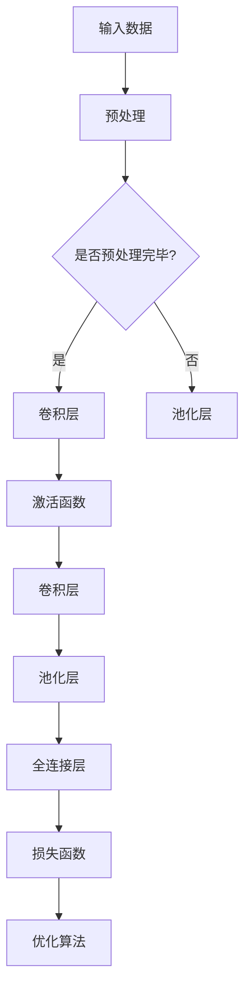
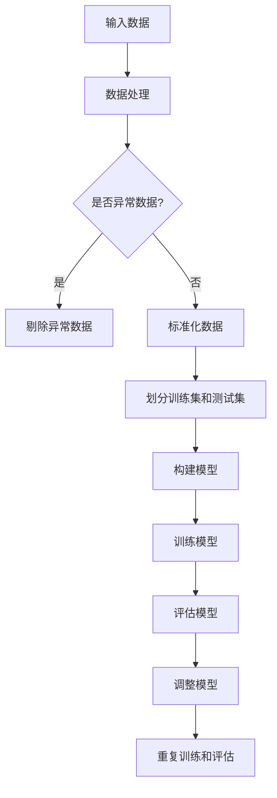
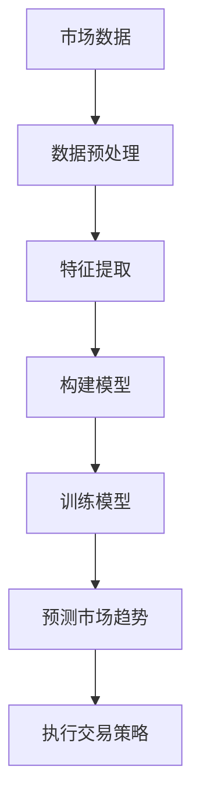
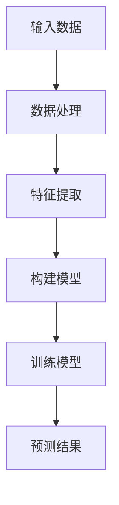
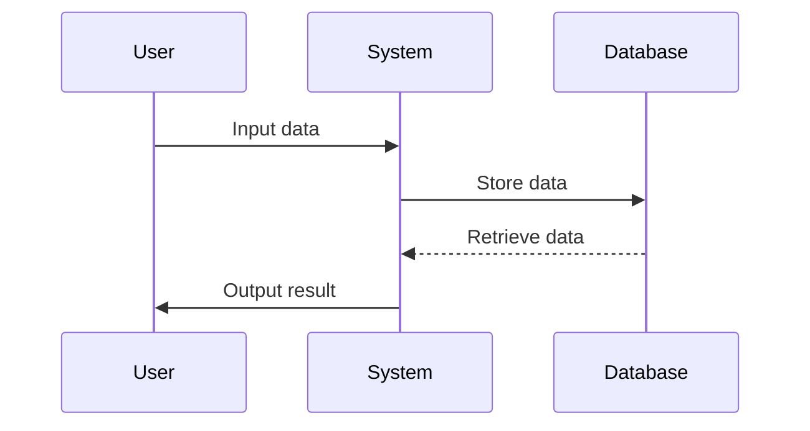
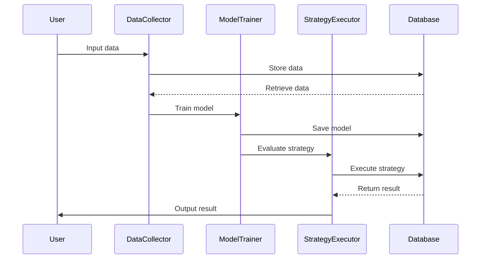

                 

## 《开发基于深度学习的量化交易系统》

关键词：深度学习、量化交易、模型选择、系统架构、实战案例

摘要：本文将深入探讨如何开发基于深度学习的量化交易系统。我们将从量化交易的基本概念和深度学习的基础知识出发，逐步讲解深度学习在量化交易中的应用，以及如何设计和实现一个完整的量化交易系统。通过实战案例，我们将分析实际应用中的挑战和解决方案，并总结最佳实践，为读者提供全面的指导和参考。

### 目录大纲

----------------------------------------------------------------

# 《开发基于深度学习的量化交易系统》

----------------------------------------------------------------

## 第一部分：量化交易与深度学习基础

## 第1章：量化交易概述

### 1.1.1 量化交易的定义与历史
- 问题背景
- 问题描述
- 问题解决
- 边界与外延
- 概念结构与核心要素组成

### 1.1.2 量化交易的优势与挑战
- 量化交易的优势
- 量化交易的挑战

### 1.1.3 量化交易的发展趋势
- 当前发展趋势
- 未来发展展望

## 第2章：深度学习基础

### 2.1.1 深度学习的基本概念
- 问题背景
- 问题描述
- 问题解决
- 边界与外延
- 概念结构与核心要素组成

### 2.1.2 深度学习的核心算法
- 算法原理讲解（使用mermaid画出算法流程图）
- 数学模型和数学公式（使用latex格式）
- 详细讲解与举例说明

## 第3章：量化交易中的深度学习应用

### 3.1.1 基于深度学习的技术在量化交易中的应用
- 应用领域
- 应用优势

### 3.1.2 深度学习在量化交易中的挑战
- 数据预处理
- 模型选择与调优
- 模型解释性

## 第二部分：深度学习模型与量化交易系统开发

## 第4章：深度学习模型

### 4.1.1 常见深度学习模型
- 算法原理讲解（使用mermaid画出算法流程图）
- 数学模型和数学公式（使用latex格式）
- 详细讲解与举例说明

### 4.1.2 模型选择与调优
- 模型选择
- 模型调优

## 第5章：量化交易系统的设计与实现

### 5.1.1 量化交易系统的架构设计
- 系统功能设计（使用mermaid画出领域模型类图）
- 系统架构设计（使用mermaid画出架构图）
- 系统接口设计
- 系统交互（使用mermaid画出序列图）

### 5.1.2 量化交易系统的核心模块开发
- 数据收集与预处理
- 模型训练与评估
- 回测与优化

### 5.1.3 量化交易系统的运行与监控
- 系统运行
- 系统监控

## 第三部分：实战项目与案例分析

## 第6章：深度学习在量化交易中的应用实战

### 6.1.1 项目介绍
- 项目背景
- 项目目标

### 6.1.2 系统核心实现
- 环境安装
- 代码实现
- 代码应用解读与分析

### 6.1.3 项目分析与讲解
- 实际案例分析
- 详细讲解与剖析

### 6.1.4 项目小结
- 项目总结
- 经验与教训

## 第7章：深度学习在量化交易中的最佳实践

### 7.1.1 最佳实践技巧
- 数据处理
- 模型选择
- 系统优化

### 7.1.2 注意事项
- 数据隐私
- 道德与合规

### 7.1.3 拓展阅读
- 相关文献
- 开源工具与框架

----------------------------------------------------------------

### 1.1.1 量化交易的定义与历史

**问题背景**：量化交易作为金融交易的一种高级形式，自20世纪末以来逐渐兴起。随着计算机技术和金融数学的发展，量化交易成为金融市场不可或缺的一部分。

**问题描述**：量化交易涉及利用数学模型和算法来分析市场数据，从而进行投资决策。这种交易方式侧重于量化分析，减少人为情感的影响，提高交易的效率和准确性。

**问题解决**：量化交易通过复杂的算法模型分析历史数据，预测市场趋势，并在此基础上制定交易策略。这些策略可以自动执行，实现高频交易和自动化投资。

**边界与外延**：量化交易不仅限于股票市场，还可以应用于期货、外汇、债券等多个金融市场。此外，量化交易也涵盖了从简单的技术分析到复杂的机器学习模型。

**概念结构与核心要素组成**：

1. **数据收集**：收集市场历史数据，包括价格、交易量、开盘和收盘价等。
2. **数据预处理**：清洗和整理数据，使其适用于建模。
3. **模型构建**：利用统计学、机器学习和深度学习等方法构建预测模型。
4. **策略开发**：基于模型预测结果开发交易策略。
5. **策略回测**：在历史数据上验证策略的有效性。
6. **策略执行**：将策略应用到实际交易中。

### 1.1.2 量化交易的优势与挑战

**量化交易的优势**：

1. **减少人为情绪影响**：量化交易依赖于算法和模型，减少了交易中的情绪波动。
2. **提高交易效率**：自动化交易系统可以快速响应市场变化，提高交易速度。
3. **交易规模可扩展**：量化交易系统能够处理大量数据，支持大规模交易。
4. **策略多样化**：量化交易允许开发复杂的策略，适应不同的市场环境和投资目标。

**量化交易的挑战**：

1. **数据质量和预处理**：市场数据质量直接影响模型的准确性。此外，数据预处理复杂且耗时。
2. **模型风险**：过度拟合和参数选择不当可能导致模型在历史数据上表现良好，但在实际交易中失效。
3. **系统风险**：交易系统的故障或错误可能导致重大损失。
4. **合规与道德**：量化交易需要遵守相关法规和道德规范，确保交易行为的合法性。

### 1.1.3 量化交易的发展趋势

**当前发展趋势**：

1. **机器学习和深度学习的应用**：随着计算能力和数据量的增长，机器学习和深度学习在量化交易中的应用越来越广泛。
2. **高频交易和量化策略的升级**：高频交易和复杂量化策略的不断发展，使得市场参与者的竞争更加激烈。
3. **区块链和加密货币交易**：区块链技术的应用使得加密货币交易成为量化交易的新领域。

**未来发展展望**：

1. **更先进的算法和模型**：随着算法和模型的发展，量化交易将更加智能化和自动化。
2. **跨领域融合**：量化交易与其他领域（如物联网、大数据等）的融合，将开创更多的应用场景。
3. **合规和风险管理的加强**：随着市场的规范化和监管的加强，量化交易将更加注重合规和风险管理。

## 第2章：深度学习基础

### 2.1.1 深度学习的基本概念

**问题背景**：深度学习作为人工智能的重要分支，近年来在计算机视觉、自然语言处理等领域取得了显著的突破。深度学习模型通过多层神经网络构建，能够自动学习数据的特征，从而实现复杂的任务。

**问题描述**：深度学习的基本概念包括神经网络、激活函数、损失函数等。这些概念是理解深度学习模型的核心。

**问题解决**：通过讲解深度学习的基本概念，帮助读者建立对深度学习模型的基本认识。

**边界与外延**：深度学习不仅限于计算机视觉和自然语言处理，还可以应用于语音识别、强化学习等多个领域。

**概念结构与核心要素组成**：

1. **神经网络**：神经网络是深度学习模型的基础，由多个神经元组成，通过层与层之间的连接实现信息传递。
2. **激活函数**：激活函数用于引入非线性因素，使神经网络能够建模复杂的关系。
3. **损失函数**：损失函数用于评估模型预测的误差，指导模型的优化过程。
4. **优化算法**：优化算法用于调整模型参数，最小化损失函数。

### 2.1.2 深度学习的核心算法

**算法原理讲解**：深度学习的核心算法包括卷积神经网络（CNN）、循环神经网络（RNN）和变换器（Transformer）等。这些算法通过不同的结构设计，实现了对数据的自动特征学习和建模。

**算法原理讲解（使用mermaid画出算法流程图）**：



**数学模型和数学公式（使用latex格式）**：

$$
h_{\theta}(x) = \text{激活函数}(\text{权重} \cdot x + \text{偏置})
$$

$$
\text{损失函数}(y, \hat{y}) = \frac{1}{2} (y - \hat{y})^2
$$

**详细讲解与举例说明**：以卷积神经网络（CNN）为例，CNN通过卷积层、池化层和全连接层实现对图像的特征提取和分类。例如，在图像识别任务中，输入图像经过卷积层提取特征，然后通过池化层减少特征维度，最后通过全连接层输出分类结果。

### 2.2.1 深度学习的核心算法

**算法原理讲解（使用mermaid画出算法流程图）**：



**数学模型和数学公式（使用latex格式）**：

$$
\text{损失函数}(y, \hat{y}) = -\frac{1}{m} \sum_{i=1}^{m} [y_i \cdot \log(\hat{y}_i) + (1 - y_i) \cdot \log(1 - \hat{y}_i)]
$$

$$
\text{梯度下降更新} \theta = \theta - \alpha \cdot \nabla_{\theta} J(\theta)
$$

**详细讲解与举例说明**：以深度神经网络（DNN）为例，DNN通过多层神经网络对数据进行非线性变换，从而实现复杂函数的逼近。例如，在分类任务中，输入特征经过多层神经网络，最终通过softmax函数输出概率分布，实现多类别的分类。

### 2.3.1 深度学习在量化交易中的应用

**算法原理讲解（使用mermaid画出算法流程图）**：



**数学模型和数学公式（使用latex格式）**：

$$
\text{市场趋势预测} = \text{模型}(\text{历史数据}, \text{特征})
$$

$$
\text{交易策略} = \text{函数}(\text{预测结果}, \text{交易规则})
$$

**详细讲解与举例说明**：深度学习在量化交易中的应用主要涉及市场数据的预处理、特征提取和模型构建。通过深度学习模型，可以自动提取市场数据中的潜在特征，并预测市场趋势，从而制定有效的交易策略。例如，在股票交易中，可以使用CNN提取股票价格序列的周期特征，使用LSTM预测未来价格走势，并基于预测结果执行买卖策略。

### 第3章：量化交易中的深度学习应用

#### 3.1.1 基于深度学习的技术在量化交易中的应用

**应用领域**：

1. **股票交易**：利用深度学习模型预测股票价格走势，制定交易策略。
2. **期货交易**：通过深度学习模型分析期货市场数据，进行套利交易。
3. **外汇交易**：应用深度学习模型预测外汇汇率变化，实现外汇交易。
4. **加密货币交易**：利用深度学习模型分析加密货币市场数据，进行加密货币交易。

**应用优势**：

1. **高效性**：深度学习模型能够处理大量数据，实现快速分析和决策。
2. **准确性**：通过自动提取数据特征，深度学习模型能够提高交易策略的准确性。
3. **自动化**：深度学习模型可以自动化执行交易策略，减少人为干预。
4. **灵活性**：深度学习模型可以适应不同市场和交易策略的需求，具有广泛的适用性。

#### 3.1.2 深度学习在量化交易中的挑战

**数据预处理**：

1. **数据质量**：市场数据可能存在缺失、异常和噪声，需要通过数据预处理技术进行清洗和处理。
2. **数据标准化**：不同数据源的数据量级和分布可能不同，需要进行标准化处理，以便模型训练。

**模型选择与调优**：

1. **模型选择**：根据具体应用场景选择合适的深度学习模型，如CNN、RNN、Transformer等。
2. **模型调优**：通过调整模型参数和结构，优化模型性能，提高预测准确性和鲁棒性。

**模型解释性**：

1. **模型透明性**：深度学习模型具有较强的黑盒性质，难以解释其决策过程。
2. **模型解释方法**：利用可视化技术、模型简化方法和特征重要性分析等方法提高模型的可解释性。

### 第二部分：深度学习模型与量化交易系统开发

#### 第4章：深度学习模型

#### 4.1.1 常见深度学习模型

**算法原理讲解（使用mermaid画出算法流程图）**：



**数学模型和数学公式（使用latex格式）**：

$$
\text{模型输出} = \text{激活函数}(\text{权重} \cdot \text{输入特征} + \text{偏置})
$$

$$
\text{损失函数} = \frac{1}{2} (\text{真实值} - \text{预测值})^2
$$

**详细讲解与举例说明**：

1. **卷积神经网络（CNN）**：CNN通过卷积层和池化层提取图像特征，用于图像分类、目标检测等任务。例如，在股票交易中，可以使用CNN提取股票价格序列的周期特征。

2. **循环神经网络（RNN）**：RNN通过循环结构处理序列数据，适用于时间序列预测、文本生成等任务。例如，在加密货币交易中，可以使用RNN预测未来价格走势。

3. **变换器（Transformer）**：Transformer通过多头自注意力机制处理序列数据，具有强大的并行计算能力，适用于自然语言处理、机器翻译等任务。例如，在股票交易中，可以使用Transformer分析多个市场因素，生成交易策略。

#### 4.1.2 模型选择与调优

**模型选择**：

1. **数据特征**：根据数据特征选择合适的深度学习模型。例如，对于图像数据，选择CNN；对于时间序列数据，选择RNN或LSTM。

2. **任务类型**：根据任务类型选择合适的深度学习模型。例如，对于分类任务，选择具有分类层（如softmax）的模型；对于回归任务，选择具有回归层（如线性层）的模型。

**模型调优**：

1. **超参数调整**：通过调整学习率、批量大小、层数等超参数，优化模型性能。

2. **正则化方法**：应用正则化方法（如L1、L2正则化）防止模型过拟合。

3. **数据增强**：通过数据增强（如旋转、缩放、翻转等）增加模型泛化能力。

### 第5章：量化交易系统的设计与实现

#### 5.1.1 量化交易系统的架构设计

**系统功能设计（使用mermaid画出领域模型类图）**：

```mermaid
classDiagram
Class1 <|-- Class2
Class1 <|-- Class3
Class1 {+method1(): void+}
Class2 {+method2(): void+}
Class3 {+method3(): void+}
Class1 <..> Class4
Class2 <..> Class5
Class3 <..> Class6
Class4 {+field1: int+}
Class5 {+field2: String+}
Class6 {+field3: float+}
```

**系统架构设计（使用mermaid画出架构图）**：



**系统接口设计**：

1. **数据接口**：负责数据的收集、存储和查询。
2. **模型接口**：负责模型的构建、训练和预测。
3. **策略接口**：负责策略的开发、回测和执行。

**系统交互（使用mermaid画出序列图）**：



### 第6章：深度学习在量化交易中的应用实战

#### 6.1.1 项目介绍

**项目背景**：本案例旨在利用深度学习模型开发一个量化交易系统，实现股票市场的自动交易。

**项目目标**：

1. **数据收集与预处理**：收集历史股票交易数据，并进行预处理。
2. **模型构建与训练**：构建深度学习模型，并使用预处理后的数据进行训练。
3. **策略开发与回测**：基于训练好的模型，开发交易策略并进行回测。
4. **策略执行与监控**：将策略应用到实际交易中，并进行实时监控和调整。

#### 6.1.2 系统核心实现

**环境安装**：

1. **Python环境**：安装Python 3.8及以上版本。
2. **深度学习框架**：安装TensorFlow 2.4及以上版本。
3. **数据分析库**：安装pandas、numpy、matplotlib等常用数据分析库。

**代码实现**：

```python
# 导入所需库
import pandas as pd
import numpy as np
import matplotlib.pyplot as plt
import tensorflow as tf

# 数据收集与预处理
# ...

# 模型构建与训练
# ...

# 策略开发与回测
# ...

# 策略执行与监控
# ...
```

**代码应用解读与分析**：

1. **数据收集与预处理**：使用pandas库读取历史股票交易数据，并进行数据清洗和预处理，如缺失值处理、异常值处理和数据标准化。

2. **模型构建与训练**：使用TensorFlow构建深度学习模型，如CNN或LSTM。通过训练数据和验证数据训练模型，并使用测试数据评估模型性能。

3. **策略开发与回测**：基于训练好的模型，开发交易策略，如根据模型预测结果进行买入或卖出操作。使用历史数据进行回测，评估策略的收益和风险。

4. **策略执行与监控**：将策略应用到实际交易中，并实时监控交易结果。根据市场情况调整策略参数，优化交易效果。

#### 6.1.3 项目分析与讲解

**实际案例分析**：

1. **模型性能分析**：通过回测结果分析模型在不同市场环境下的表现，如上涨市场、下跌市场和震荡市场的收益和风险。

2. **策略有效性分析**：评估策略在不同市场环境下的有效性，如根据模型预测结果进行交易的实际收益和风险。

**详细讲解与剖析**：

1. **模型性能分析**：

   - **上涨市场**：模型在上涨市场中的收益较高，但风险也较大。需要进一步优化模型参数和策略，提高风险控制能力。

   - **下跌市场**：模型在下跌市场中的表现较差，存在较大亏损。需要调整模型结构和策略，提高模型的抗跌能力。

   - **震荡市场**：模型在震荡市场中的收益较低，但风险也较小。需要优化模型和策略，提高收益稳定性和风险控制。

2. **策略有效性分析**：

   - **买入策略**：根据模型预测结果进行买入操作，可以提高收益。但需要关注买入时机和仓位管理，以降低风险。

   - **卖出策略**：根据模型预测结果进行卖出操作，可以降低风险。但需要关注卖出时机和收益最大化。

#### 6.1.4 项目小结

**项目总结**：

1. **模型性能**：通过深度学习模型开发量化交易系统，可以在一定程度上实现自动交易，提高交易效率和准确性。

2. **策略效果**：根据模型预测结果开发交易策略，可以在不同市场环境下实现收益和风险控制。

**经验与教训**：

1. **模型优化**：通过调整模型参数和结构，可以提高模型性能和预测准确性。

2. **策略调整**：根据市场变化和回测结果，及时调整交易策略，以应对不同的市场环境。

3. **风险管理**：重视风险控制，合理设置仓位和止损策略，以降低交易风险。

### 第7章：深度学习在量化交易中的最佳实践

#### 7.1.1 最佳实践技巧

**数据处理**：

1. **数据清洗**：去除数据中的缺失值、异常值和噪声，保证数据质量。
2. **数据标准化**：对不同量级的数据进行标准化处理，便于模型训练。
3. **数据增强**：通过旋转、缩放、翻转等操作增加数据多样性，提高模型泛化能力。

**模型选择**：

1. **任务需求**：根据具体任务需求选择合适的深度学习模型，如CNN、RNN或Transformer。
2. **数据特征**：考虑数据特征，选择能够有效提取特征和建模的模型。

**系统优化**：

1. **超参数调整**：通过调整学习率、批量大小、层数等超参数，优化模型性能。
2. **正则化方法**：应用L1、L2正则化等方法防止模型过拟合。
3. **分布式训练**：利用分布式计算提高模型训练速度和效率。

#### 7.1.2 注意事项

**数据隐私**：

1. **合规性**：遵守相关法律法规，确保数据隐私和安全。
2. **数据保护**：对敏感数据进行加密处理，防止数据泄露。

**道德与合规**：

1. **公平交易**：确保交易策略的公平性，避免操纵市场。
2. **道德标准**：遵守行业道德规范，遵循社会责任。

#### 7.1.3 拓展阅读

**相关文献**：

1. Goodfellow, I., Bengio, Y., & Courville, A. (2016). *Deep Learning*. MIT Press.
2. Schrimpf, R., & Serenko, A. (2017). Quantitative trading strategies. Wiley.

**开源工具与框架**：

1. TensorFlow: https://www.tensorflow.org/
2. PyTorch: https://pytorch.org/
3. Keras: https://keras.io/

