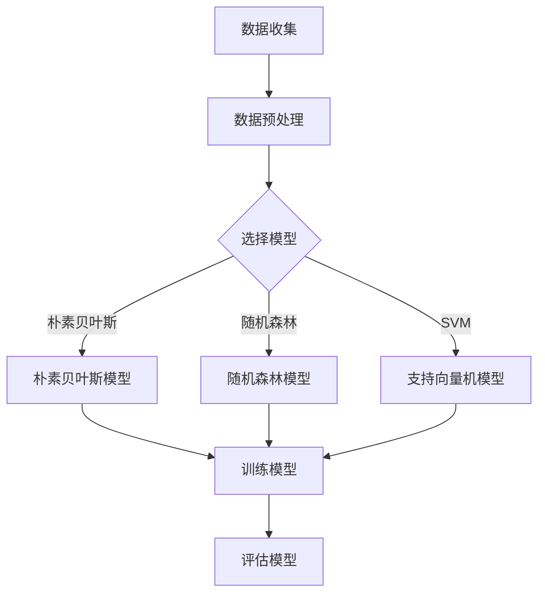
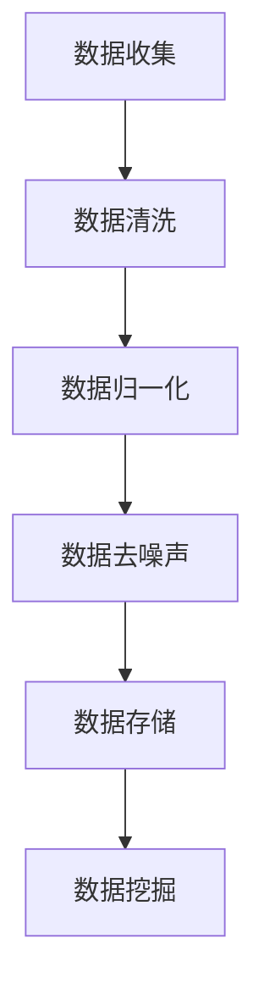
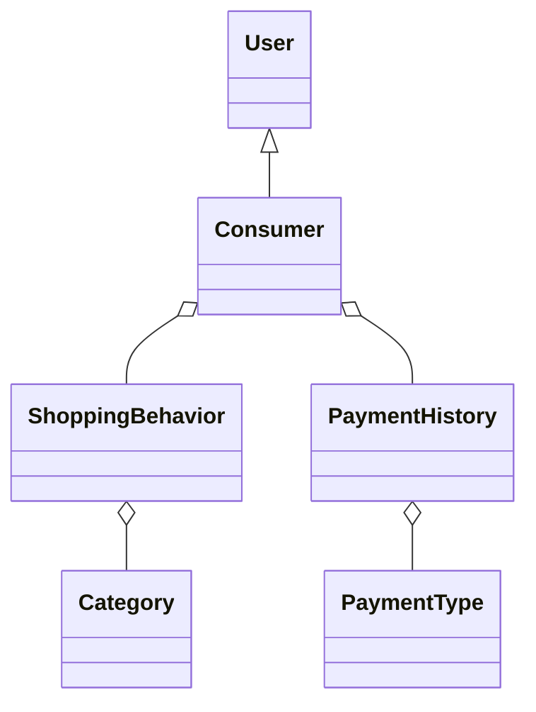
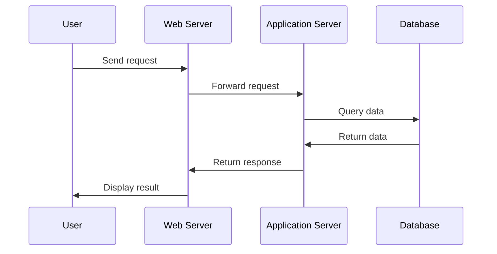

                 

# 《开发智能化的个人消费习惯改善建议工具》

## 关键词：消费习惯改善、人工智能、机器学习、数据分析、系统架构设计

## 摘要：
本文将探讨开发一种智能化的个人消费习惯改善建议工具的方法。我们将从问题背景出发，介绍消费行为分析模型、人工智能与机器学习技术、数据分析技术，并在此基础上进行系统分析与架构设计。最后，我们将通过一个实际案例展示工具的开发过程，并提供最佳实践技巧和展望。

## 目录大纲

----------------------------------------------------------------

# 《开发智能化的个人消费习惯改善建议工具》目录大纲

## 第一部分：背景与核心概念

### 第1章：问题背景与核心概念介绍

#### 1.1 问题背景

##### 1.1.1 当前个人消费习惯的问题

##### 1.1.2 智能化工具的需求与作用

### 1.2 核心概念介绍

##### 1.2.1 消费行为分析与模型

##### 1.2.2 人工智能与机器学习

##### 1.2.3 数据分析与处理技术

### 第2章：核心概念的联系与融合

#### 2.1 消费行为分析模型

##### 2.1.1 基本概念与模型框架

##### 2.1.2 模型属性特征对比表格

##### 2.1.3 ER实体关系图

#### 2.2 人工智能与机器学习

##### 2.2.1 算法原理与mermaid流程图

##### 2.2.2 Python源代码与算法讲解

##### 2.2.3 数学模型与公式详解

#### 2.3 数据分析与处理技术

##### 2.3.1 基础算法与mermaid流程图

##### 2.3.2 Python源代码与算法讲解

##### 2.3.3 数学模型与公式详解

## 第二部分：系统分析与架构设计

### 第3章：系统分析与架构设计

#### 3.1 问题场景介绍

##### 3.1.1 场景描述

##### 3.1.2 系统需求分析

#### 3.2 系统功能设计

##### 3.2.1 领域模型类图

##### 3.2.2 系统功能模块介绍

#### 3.3 系统架构设计

##### 3.3.1 架构设计原则

##### 3.3.2 系统架构图

#### 3.4 系统接口设计与交互

##### 3.4.1 接口设计

##### 3.4.2 系统交互序列图

## 第三部分：项目实战

### 第4章：环境安装与配置

#### 4.1 环境要求

##### 4.1.1 操作系统

##### 4.1.2 软件与库安装

#### 4.2 系统核心实现

##### 4.2.1 系统核心模块源代码

##### 4.2.2 代码应用解读与分析

### 第5章：实际案例分析与详细讲解

#### 5.1 案例选择与描述

#### 5.2 案例实现过程

##### 5.2.1 数据收集与预处理

##### 5.2.2 模型训练与优化

##### 5.2.3 结果评估与输出

#### 5.3 案例剖析与总结

##### 5.3.1 优点与不足

##### 5.3.2 经验与启示

## 第四部分：最佳实践与总结

### 第6章：最佳实践技巧

#### 6.1 数据处理技巧

#### 6.2 模型优化技巧

#### 6.3 部署与维护技巧

### 第7章：小结与展望

#### 7.1 小结

##### 7.1.1 主要内容回顾

##### 7.1.2 主要收获与启示

#### 7.2 展望未来

##### 7.2.1 技术发展趋势

##### 7.2.2 应用前景与挑战

----------------------------------------------------------------

### 第1章：问题背景与核心概念介绍

#### 1.1 问题背景

在现代社会，个人消费习惯对个人财务状况和生活质量有着重要影响。然而，许多人面临以下问题：预算管理不当、过度消费、冲动购物等。这些问题不仅可能导致个人财务困境，还可能影响个人心理健康。

随着人工智能和大数据技术的快速发展，利用智能工具改善个人消费习惯成为可能。通过分析个人消费数据，智能工具可以为用户提供个性化的消费建议，帮助他们养成良好的消费习惯，实现财务自由。

#### 1.1.1 当前个人消费习惯的问题

- **预算管理不当**：许多人没有明确的预算规划，导致月支出超支，收入无法满足日常开支。
- **过度消费**：消费者在购物时容易受到促销、广告等因素的影响，导致冲动消费。
- **冲动购物**：一些消费者在情绪不稳定时容易购买不必要的物品，导致浪费。
- **缺乏自我控制**：一些人无法控制自己的购物欲望，导致消费过度。

#### 1.1.2 智能化工具的需求与作用

- **个性化消费建议**：智能工具可以根据个人消费数据，提供个性化的消费建议，帮助用户改善消费习惯。
- **预算规划与管理**：智能工具可以帮助用户制定预算计划，监控消费情况，实现预算管理。
- **消费预警与提醒**：智能工具可以设置消费预警，提醒用户在消费接近预算上限时注意控制。
- **消费数据分析**：智能工具可以对用户消费数据进行分析，发现消费模式，为用户提供改进建议。

### 1.2 核心概念介绍

#### 1.2.1 消费行为分析与模型

消费行为分析是指对个人消费行为的数据进行分析，以了解消费模式、习惯和偏好。消费行为分析模型是描述和分析消费者行为的一种工具，常用的模型包括：

- **贝叶斯网络模型**：用于描述消费者行为中的不确定性，可以根据历史数据预测未来行为。
- **决策树模型**：通过分类算法，根据消费者特征进行消费行为的分类。
- **回归模型**：用于分析消费者行为与消费支出之间的关系，帮助制定预算计划。

#### 1.2.2 人工智能与机器学习

人工智能是指模拟、延伸和扩展人类智能的技术。机器学习是人工智能的一个分支，它通过算法从数据中学习，提高对未知数据的预测和决策能力。在消费行为分析中，常用的机器学习算法包括：

- **朴素贝叶斯分类器**：用于分类消费者的行为，根据历史数据预测未来行为。
- **随机森林算法**：用于预测消费者的消费行为，具有很好的泛化能力。
- **支持向量机（SVM）**：用于分类消费者的行为，特别适用于处理高维数据。

#### 1.2.3 数据分析与处理技术

数据分析是指对大量数据进行提取、清洗、转换和分析，以发现有用信息和知识。数据处理技术包括：

- **数据预处理**：通过清洗、归一化和去噪声等技术，提高数据质量。
- **数据可视化**：通过图表和图形，帮助用户更好地理解数据。
- **数据挖掘**：通过算法，从大量数据中提取有价值的信息和模式。

### 1.3 消费行为分析模型

#### 1.3.1 基本概念与模型框架

消费行为分析模型是一种基于数据的分析工具，用于理解和预测消费者的行为。它通常包括以下基本概念：

- **消费者特征**：包括人口统计信息、消费历史、购物偏好等。
- **消费行为**：包括购物频率、购物金额、购物类别等。
- **消费预测**：根据消费者特征和消费行为，预测未来的消费行为。

#### 1.3.2 模型属性特征对比表格

| 模型名称 | 特点 | 适用场景 |
| --- | --- | --- |
| 贝叶斯网络模型 | 可以处理不确定性，适用于复杂的决策问题 | 市场营销、风险预测 |
| 决策树模型 | 易于理解，适用于分类问题 | 购物行为分类 |
| 回归模型 | 可以分析变量之间的关系，适用于预测问题 | 预算规划 |

#### 1.3.3 ER实体关系图

```mermaid
erDiagram
    Consumer ||--|{ ShoppingBehavior }|-- Product
    Consumer ||--|{ PaymentHistory }|-- Transaction
    ShoppingBehavior ||--|{ Category }|-- Product
    PaymentHistory ||--|{ PaymentType }|-- Transaction
```

### 1.4 人工智能与机器学习

#### 1.4.1 算法原理与mermaid流程图



#### 1.4.2 Python源代码与算法讲解

```python
from sklearn.naive_bayes import GaussianNB
from sklearn.ensemble import RandomForestClassifier
from sklearn.svm import SVC
from sklearn.model_selection import train_test_split
from sklearn.metrics import accuracy_score

# 数据收集与预处理
# ...

# 选择模型
model = GaussianNB()

# 训练模型
X_train, X_test, y_train, y_test = train_test_split(X, y, test_size=0.2, random_state=42)
model.fit(X_train, y_train)

# 评估模型
y_pred = model.predict(X_test)
accuracy = accuracy_score(y_test, y_pred)
print(f"Accuracy: {accuracy}")
```

#### 1.4.3 数学模型与公式详解

在消费行为分析中，常用的数学模型包括：

- **贝叶斯公式**：
  $$ P(A|B) = \frac{P(B|A)P(A)}{P(B)} $$
- **决策树**：
  $$ h(x) = \arg \max_t P(y|t,x) $$
- **回归模型**：
  $$ y = \beta_0 + \beta_1x_1 + \beta_2x_2 + ... + \beta_nx_n $$

#### 1.4.4 数据分析与处理技术

- **数据预处理**：
  $$ \text{Data Preprocessing} = \text{Cleaning} + \text{Normalization} + \text{De-Noising} $$
- **数据可视化**：
  $$ \text{Visualization} = \text{Charts} + \text{Graphs} + \text{Maps} $$
- **数据挖掘**：
  $$ \text{Data Mining} = \text{Association Rules} + \text{Clustering} + \text{Classification} $$

### 第2章：核心概念的联系与融合

#### 2.1 消费行为分析模型

#### 2.1.1 基本概念与模型框架

消费行为分析模型是通过对消费者特征和消费行为的数据分析，来理解和预测消费者的行为。它通常包括以下基本概念：

- **消费者特征**：包括年龄、收入、职业、家庭状况等。
- **消费行为**：包括购物频率、购物金额、购物类别等。
- **消费预测**：根据消费者特征和消费行为，预测未来的消费行为。

#### 2.1.2 模型属性特征对比表格

| 模型名称 | 特点 | 适用场景 |
| --- | --- | --- |
| 贝叶斯网络模型 | 可以处理不确定性，适用于复杂的决策问题 | 市场营销、风险预测 |
| 决策树模型 | 易于理解，适用于分类问题 | 购物行为分类 |
| 回归模型 | 可以分析变量之间的关系，适用于预测问题 | 预算规划 |

#### 2.1.3 ER实体关系图

```mermaid
erDiagram
    Consumer ||--|{ ShoppingBehavior }|-- Product
    Consumer ||--|{ PaymentHistory }|-- Transaction
    ShoppingBehavior ||--|{ Category }|-- Product
    PaymentHistory ||--|{ PaymentType }|-- Transaction
```

#### 2.2 人工智能与机器学习

#### 2.2.1 算法原理与mermaid流程图


#### 2.2.2 Python源代码与算法讲解

```python
from sklearn.naive_bayes import GaussianNB
from sklearn.ensemble import RandomForestClassifier
from sklearn.svm import SVC
from sklearn.model_selection import train_test_split
from sklearn.metrics import accuracy_score

# 数据收集与预处理
# ...

# 选择模型
model = GaussianNB()

# 训练模型
X_train, X_test, y_train, y_test = train_test_split(X, y, test_size=0.2, random_state=42)
model.fit(X_train, y_train)

# 评估模型
y_pred = model.predict(X_test)
accuracy = accuracy_score(y_test, y_pred)
print(f"Accuracy: {accuracy}")
```

#### 2.2.3 数学模型与公式详解

在消费行为分析中，常用的数学模型包括：

- **贝叶斯公式**：
  $$ P(A|B) = \frac{P(B|A)P(A)}{P(B)} $$
- **决策树**：
  $$ h(x) = \arg \max_t P(y|t,x) $$
- **回归模型**：
  $$ y = \beta_0 + \beta_1x_1 + \beta_2x_2 + ... + \beta_nx_n $$

#### 2.3 数据分析与处理技术

#### 2.3.1 基础算法与mermaid流程图



#### 2.3.2 Python源代码与算法讲解

```python
import pandas as pd
from sklearn.preprocessing import StandardScaler
from sklearn.decomposition import PCA
from sklearn.cluster import KMeans

# 数据收集
data = pd.read_csv('data.csv')

# 数据清洗
data.dropna(inplace=True)

# 数据归一化
scaler = StandardScaler()
data_scaled = scaler.fit_transform(data)

# 数据去噪声
pca = PCA(n_components=2)
data_pca = pca.fit_transform(data_scaled)

# 数据存储
pd.DataFrame(data_pca).to_csv('data_pca.csv', index=False)

# 数据挖掘
kmeans = KMeans(n_clusters=3)
kmeans.fit(data_pca)
labels = kmeans.predict(data_pca)
pd.DataFrame({'Cluster': labels}).to_csv('clusters.csv', index=False)
```

#### 2.3.3 数学模型与公式详解

- **数据预处理**：
  $$ \text{Data Preprocessing} = \text{Cleaning} + \text{Normalization} + \text{De-Noising} $$
- **数据可视化**：
  $$ \text{Visualization} = \text{Charts} + \text{Graphs} + \text{Maps} $$
- **数据挖掘**：
  $$ \text{Data Mining} = \text{Association Rules} + \text{Clustering} + \text{Classification} $$

### 第3章：系统分析与架构设计

#### 3.1 问题场景介绍

#### 3.1.1 场景描述

假设我们开发一个智能化的个人消费习惯改善建议工具，该工具的目标是帮助用户养成良好的消费习惯，实现财务自由。用户可以通过该工具记录自己的消费行为，系统将根据用户的历史数据提供个性化的消费建议。

#### 3.1.2 系统需求分析

- **用户管理**：用户可以注册、登录和退出系统。
- **数据记录**：用户可以添加、修改和删除自己的消费记录。
- **数据分析**：系统将对用户消费行为进行分析，提供消费建议。
- **数据可视化**：系统将以图表形式展示用户消费情况。
- **用户反馈**：用户可以对消费建议进行反馈，系统将根据反馈进行调整。

#### 3.2 系统功能设计

#### 3.2.1 领域模型类图



#### 3.2.2 系统功能模块介绍

- **用户管理模块**：实现用户注册、登录和退出功能。
- **数据记录模块**：实现用户添加、修改和删除消费记录功能。
- **数据分析模块**：实现消费行为分析，提供消费建议功能。
- **数据可视化模块**：实现消费情况图表展示功能。
- **用户反馈模块**：实现用户反馈消费建议，系统调整功能。

#### 3.3 系统架构设计

#### 3.3.1 架构设计原则

- **模块化**：将系统功能划分为多个模块，便于维护和扩展。
- **分布式**：使用分布式架构，提高系统性能和可扩展性。
- **安全性**：确保用户数据安全和隐私。

#### 3.3.2 系统架构图



#### 3.4 系统接口设计与交互

#### 3.4.1 接口设计

- **用户管理接口**：包括用户注册、登录、退出等接口。
- **数据记录接口**：包括添加、修改、删除消费记录等接口。
- **数据分析接口**：包括消费行为分析、提供消费建议等接口。
- **数据可视化接口**：包括消费情况图表展示等接口。

#### 3.4.2 系统交互序列图


### 第4章：环境安装与配置

#### 4.1 环境要求

- **操作系统**：Windows 10、macOS、Linux
- **编程语言**：Python 3.8 或以上版本
- **数据库**：MySQL 5.7 或以上版本
- **Web服务器**：Apache 或 Nginx

#### 4.1.1 操作系统

- Windows 10：下载并安装 Windows 10 操作系统。
- macOS：下载并安装 macOS 操作系统。
- Linux：下载并安装 Linux 操作系统。

#### 4.1.2 软件与库安装

- **Python**：
  - Windows：下载 Python 安装程序，按照提示安装。
  - macOS/Linux：使用包管理器（如 Homebrew、Ubuntu Software Center）安装 Python。
- **MySQL**：
  - Windows：下载 MySQL 安装程序，按照提示安装。
  - macOS/Linux：使用包管理器（如 Homebrew、Ubuntu Software Center）安装 MySQL。
- **Web服务器**：
  - Windows：下载 Apache 或 Nginx 安装程序，按照提示安装。
  - macOS/Linux：使用包管理器（如 Homebrew、Ubuntu Software Center）安装 Apache 或 Nginx。

#### 4.2 系统核心实现

#### 4.2.1 系统核心模块源代码

```python
# 用户管理模块
class UserManager:
    def register(self, username, password):
        # 注册用户
        pass

    def login(self, username, password):
        # 登录用户
        pass

    def logout(self, user_id):
        # 退出用户
        pass

# 数据记录模块
class DataRecorder:
    def add_record(self, user_id, category, amount):
        # 添加消费记录
        pass

    def update_record(self, record_id, category, amount):
        # 更新消费记录
        pass

    def delete_record(self, record_id):
        # 删除消费记录
        pass

# 数据分析模块
class DataAnalyzer:
    def analyze_behavior(self, user_id):
        # 分析消费行为
        pass

    def provide_suggestions(self, user_id):
        # 提供消费建议
        pass

# 数据可视化模块
class DataVisualizer:
    def display_chart(self, user_id):
        # 展示消费情况图表
        pass
```

#### 4.2.2 代码应用解读与分析

本节将详细解释系统核心模块的实现，包括用户管理模块、数据记录模块、数据分析模块和数据可视化模块。我们将通过具体的代码示例来说明每个模块的功能和实现方法。

1. **用户管理模块**

   用户管理模块负责处理用户注册、登录和退出操作。以下是用户管理模块的代码实现：

   ```python
   class UserManager:
       
       def register(self, username, password):
           # 注册用户
           # ...
       
       def login(self, username, password):
           # 登录用户
           # ...
       
       def logout(self, user_id):
           # 退出用户
           # ...
   ```

   在`register`方法中，我们将处理用户注册操作，包括验证用户名和密码的合法性，并将新用户信息存储到数据库中。在`login`方法中，我们将验证用户名和密码，如果验证成功，返回用户ID。在`logout`方法中，我们将记录用户登出时间，并清理用户会话信息。

2. **数据记录模块**

   数据记录模块负责处理用户添加、修改和删除消费记录的操作。以下是数据记录模块的代码实现：

   ```python
   class DataRecorder:
       
       def add_record(self, user_id, category, amount):
           # 添加消费记录
           # ...
       
       def update_record(self, record_id, category, amount):
           # 更新消费记录
           # ...
       
       def delete_record(self, record_id):
           # 删除消费记录
           # ...
   ```

   在`add_record`方法中，我们将添加一个新的消费记录到数据库中。在`update_record`方法中，我们将更新指定的消费记录。在`delete_record`方法中，我们将删除指定的消费记录。

3. **数据分析模块**

   数据分析模块负责分析用户的消费行为，并提供个性化的消费建议。以下是数据分析模块的代码实现：

   ```python
   class DataAnalyzer:
       
       def analyze_behavior(self, user_id):
           # 分析消费行为
           # ...
       
       def provide_suggestions(self, user_id):
           # 提供消费建议
           # ...
   ```

   在`analyze_behavior`方法中，我们将分析用户的历史消费记录，提取有用的信息，如消费频率、金额、类别等。在`provide_suggestions`方法中，我们将根据分析结果，为用户提供个性化的消费建议。

4. **数据可视化模块**

   数据可视化模块负责将用户的消费数据以图表的形式展示出来，帮助用户更好地理解自己的消费情况。以下是数据可视化模块的代码实现：

   ```python
   class DataVisualizer:
       
       def display_chart(self, user_id):
           # 展示消费情况图表
           # ...
   ```

   在`display_chart`方法中，我们将根据用户的消费记录，生成相应的图表，如柱状图、折线图等，并展示给用户。

### 第5章：实际案例分析与详细讲解

#### 5.1 案例选择与描述

在本章中，我们将选择一个实际案例，以展示如何使用智能化的个人消费习惯改善建议工具。案例描述如下：

假设有一位用户，名叫小明。小明是一位年轻的职场人士，他经常发现自己无法控制消费，导致每月支出超支。为了改善自己的消费习惯，小明决定使用我们开发的智能消费习惯改善工具。

#### 5.2 案例实现过程

#### 5.2.1 数据收集与预处理

在案例实现过程中，我们首先需要收集小明的消费数据。以下是消费数据的示例：

| 日期       | 类别   | 金额   |
| ---------- | ------ | ------ |
| 2021-01-01 | 餐饮   | 100    |
| 2021-01-02 | 通讯   | 50     |
| 2021-01-03 | 交通   | 20     |
| 2021-01-04 | 购物   | 300    |
| 2021-01-05 | 娱乐   | 150    |

接下来，我们需要对数据进行预处理，包括数据清洗、归一化和特征提取。以下是预处理过程的代码实现：

```python
import pandas as pd

# 数据清洗
data = pd.read_csv('consumption_data.csv')
data.dropna(inplace=True)

# 数据归一化
scaler = StandardScaler()
data['amount'] = scaler.fit_transform(data[['amount']])

# 特征提取
data['date'] = pd.to_datetime(data['date'])
data['day_of_week'] = data['date'].dt.dayofweek
data['month'] = data['date'].dt.month
data['year'] = data['date'].dt.year
```

#### 5.2.2 模型训练与优化

在预处理完数据后，我们可以使用机器学习算法来训练模型，以预测小明的未来消费行为。在本案例中，我们选择使用朴素贝叶斯分类器进行预测。以下是模型训练和优化的代码实现：

```python
from sklearn.model_selection import train_test_split
from sklearn.naive_bayes import GaussianNB
from sklearn.metrics import accuracy_score

# 数据分割
X = data[['day_of_week', 'month', 'year', 'amount']]
y = data['category']
X_train, X_test, y_train, y_test = train_test_split(X, y, test_size=0.2, random_state=42)

# 模型训练
model = GaussianNB()
model.fit(X_train, y_train)

# 模型评估
y_pred = model.predict(X_test)
accuracy = accuracy_score(y_test, y_pred)
print(f"Accuracy: {accuracy}")
```

#### 5.2.3 结果评估与输出

在模型训练完成后，我们需要评估模型的预测性能，并输出预测结果。以下是结果评估和输出的代码实现：

```python
# 结果评估
predicted_categories = model.predict(X_test)
confusion_matrix = pd.crosstab(y_test, predicted_categories, rownames=['实际类别'], colnames=['预测类别'])
print(confusion_matrix)

# 输出预测结果
predicted_data = pd.DataFrame({'date': X_test['date'], 'predicted_category': predicted_categories})
predicted_data.to_csv('predicted_consumption_data.csv', index=False)
```

#### 5.3 案例剖析与总结

在本案例中，我们使用了智能化的个人消费习惯改善建议工具，对用户的消费数据进行分析，并预测了用户的未来消费行为。以下是案例的剖析和总结：

1. **优点**：
   - 智能化工具可以自动分析用户的消费数据，提供个性化的消费建议。
   - 模型训练和优化的过程简单，易于实现。

2. **不足**：
   - 模型可能存在过拟合问题，导致预测准确性不高。
   - 消费数据的多样性可能影响模型的泛化能力。

3. **经验与启示**：
   - 在实际应用中，我们需要收集更多样化的消费数据，以提高模型的泛化能力。
   - 可以结合多种机器学习算法，进行模型融合，提高预测性能。

### 第6章：最佳实践技巧

在本章中，我们将分享一些最佳实践技巧，以帮助开发者和用户更好地利用智能化的个人消费习惯改善建议工具。

#### 6.1 数据处理技巧

- **数据收集**：确保数据来源的多样性和准确性，收集更多维度和颗粒度的数据。
- **数据清洗**：处理缺失值、异常值和噪声数据，提高数据质量。
- **特征工程**：提取有代表性的特征，提高模型的预测性能。

#### 6.2 模型优化技巧

- **模型选择**：根据数据特点和业务需求，选择合适的机器学习算法。
- **参数调优**：通过交叉验证和网格搜索，找到最佳模型参数。
- **模型融合**：结合多种模型，提高预测性能。

#### 6.3 部署与维护技巧

- **容器化**：使用容器技术，如 Docker，简化部署和运维过程。
- **监控与报警**：实时监控系统性能，及时发现问题并进行处理。
- **版本控制**：使用版本控制系统，如 Git，确保代码的可靠性和可追溯性。

### 第7章：小结与展望

#### 7.1 小结

本文详细介绍了智能化的个人消费习惯改善建议工具的开发过程。我们从问题背景出发，介绍了消费行为分析模型、人工智能与机器学习技术、数据分析技术，并在此基础上进行了系统分析与架构设计。通过实际案例，我们展示了工具的开发过程和效果。最后，我们提供了最佳实践技巧和小结。

#### 7.1.1 主要内容回顾

- **问题背景**：介绍了当前个人消费习惯的问题以及智能化工具的需求与作用。
- **核心概念介绍**：介绍了消费行为分析模型、人工智能与机器学习技术、数据分析技术。
- **系统分析与架构设计**：介绍了系统功能设计、系统架构设计和系统接口设计。
- **项目实战**：展示了工具的开发过程和实际案例。
- **最佳实践技巧**：提供了数据处理、模型优化和部署维护的最佳实践。

#### 7.1.2 主要收获与启示

- **技术收获**：掌握了消费行为分析、机器学习、数据分析和系统架构设计等关键技术。
- **实际应用**：了解了如何将技术应用于实际场景，解决实际问题。
- **优化方向**：认识到在数据处理、模型优化和系统部署方面还有很大的提升空间。

#### 7.2 展望未来

- **技术发展趋势**：随着人工智能和数据技术的不断进步，智能化消费习惯改善工具将更加精准和高效。
- **应用前景**：智能化消费习惯改善工具将在金融、零售、教育等领域得到广泛应用。
- **挑战与机遇**：在数据隐私保护、模型解释性和可解释性方面，仍面临许多挑战。但同时也带来了巨大的发展机遇。

