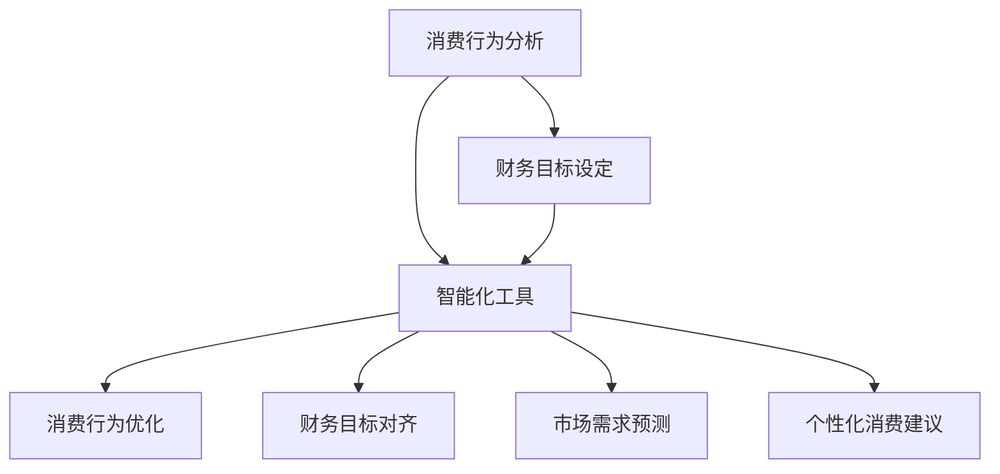
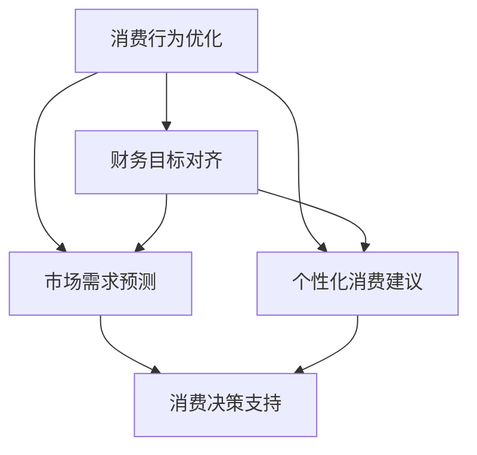
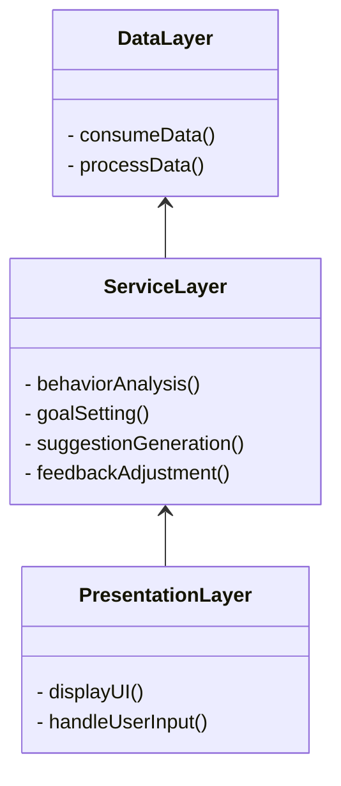
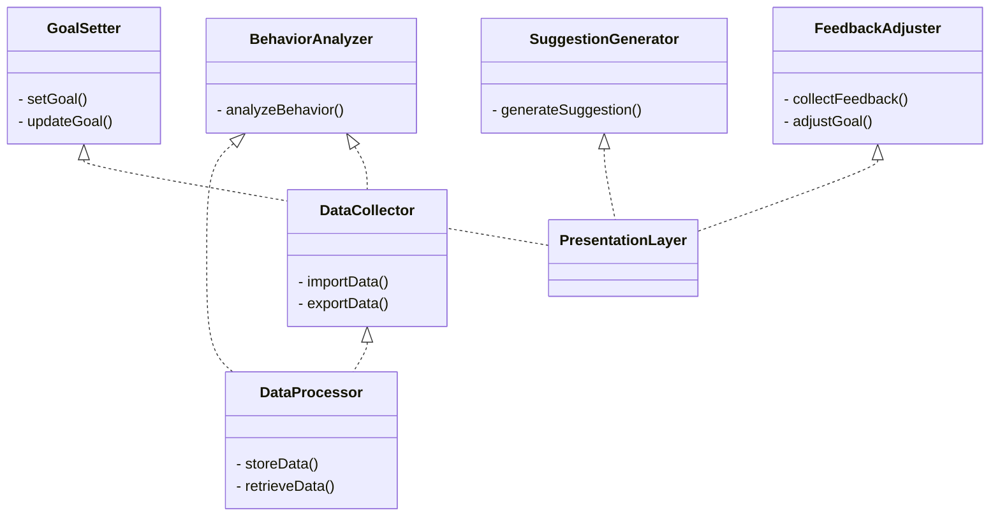
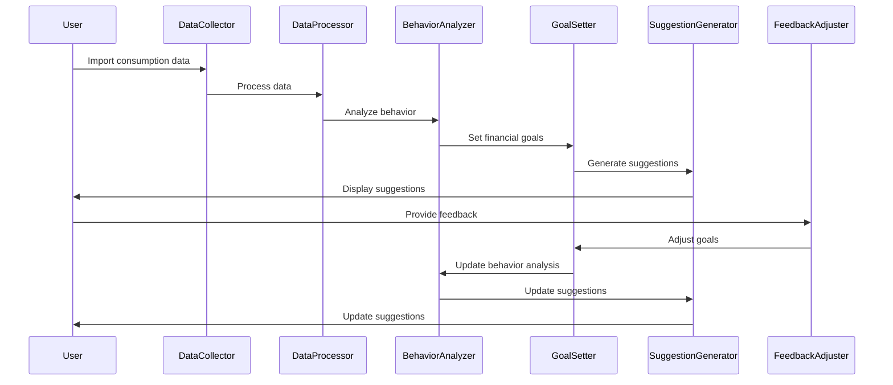

                 

### 开发智能化的个人消费行为优化与财务目标对齐工具

在当今快速发展的数字经济时代，个人消费行为和财务规划已经成为人们日常生活中不可或缺的一部分。然而，面对复杂多变的经济环境和个人需求，许多人往往难以有效地管理自己的财务状况，合理规划消费行为。为了解决这一问题，开发智能化的个人消费行为优化与财务目标对齐工具显得尤为重要。

本文旨在探讨如何开发这样的工具，以便帮助用户更好地理解和管理自己的财务状况，实现个人财务目标。我们将逐步分析核心概念、算法原理、系统设计、项目实战等多个方面，以逻辑清晰、结构紧凑的方式阐述整个开发过程。

### 核心关键词

- **个人消费行为**：指个体在日常生活中进行商品或服务购买的行为。
- **财务目标对齐**：确保个人消费行为与设定的财务目标相一致。
- **智能化工具**：利用人工智能技术，自动化、智能化地进行消费行为分析和财务规划。
- **算法原理**：用于优化消费行为和实现财务目标对齐的数学模型和计算方法。
- **系统架构**：工具的设计与实现所依赖的技术架构和系统组件。
- **项目实战**：通过具体案例展示工具的开发与部署过程。

### 摘要

本文首先介绍了个人消费行为优化和财务目标对齐的重要性，分析了当前存在的问题和挑战。接着，我们详细讲解了核心概念，包括消费行为分析、财务目标设定、智能化工具的作用以及它们之间的相互关系。然后，本文深入探讨了算法原理，通过流程图、源代码示例、数学模型和公式，详细阐述了用于优化消费行为和实现财务目标对齐的算法。随后，我们描述了系统的功能设计、架构设计、接口设计以及系统交互流程。在项目实战部分，我们提供了一个具体的案例，展示了如何开发和部署智能化工具。最后，本文总结了最佳实践，并提供了进一步学习和探索的建议。

### 目录大纲

1. **背景与核心概念**
   - **引言**
     - **问题的提出**
     - **个人消费行为优化的重要性**
     - **财务目标对齐的必要性**
     - **书籍结构概述
   - **核心概念与联系**
     - **消费行为分析**
     - **财务目标设定**
     - **智能化工具的作用**
     - **概念关系图**

2. **算法原理与系统设计**
   - **算法原理讲解**
     - **市场需求预测算法**
     - **消费行为分析算法**
     - **财务目标对齐算法**
     - **算法mermaid流程图**
     - **Python源代码示例**
     - **数学模型和公式讲解**
     - **举例说明**
   - **系统分析与架构设计**
     - **问题场景介绍**
     - **系统功能设计**
     - **系统架构设计**
     - **系统接口设计**
     - **系统交互mermaid序列图**

3. **项目实战**
   - **环境安装**
   - **系统核心实现**
   - **代码应用解读与分析**
   - **实际案例分析和讲解**
   - **项目小结**

4. **最佳实践与总结**
   - **最佳实践**
     - **实践技巧**
     - **注意事项**
     - **拓展阅读**
   - **小结**
     - **本书内容回顾**
     - **对未来的展望**

### 第1章 引言

#### 1.1 问题的提出

在现代社会，个人消费行为与财务状况的关系日益密切。随着生活水平的提高和消费观念的多样化，人们面临的财务挑战也日益复杂。如何在纷繁复杂的消费市场中保持理性，实现财务目标，成为了许多人的困扰。

首先，个人消费行为优化的重要性不容忽视。合理规划消费行为不仅能够帮助个体控制开支、减少浪费，还能提高生活质量。然而，传统的财务规划方法往往过于繁琐，难以适应快速变化的经济环境和个人需求。这就需要一种智能化、自动化的工具来辅助个人消费行为优化。

其次，财务目标对齐是实现财务自由和幸福生活的重要途径。每个人的财务目标都不同，可能是为了购房、购车、子女教育，或是为了退休储备资金。然而，在实际操作中，许多人无法准确衡量自己的消费行为是否与这些财务目标相符，从而导致财务状况的不稳定。

因此，开发智能化的个人消费行为优化与财务目标对齐工具，不仅能够解决当前存在的问题，还能为未来的财务规划提供强有力的支持。这种工具可以通过分析用户的消费数据，预测市场需求，提供个性化的消费建议，帮助用户实现财务目标。

#### 1.2 个人消费行为优化的重要性

个人消费行为优化的重要性主要体现在以下几个方面：

1. **控制开支，减少浪费**：通过优化消费行为，个体可以更加清晰地了解自己的消费习惯，识别不必要的开支，从而实现预算控制和支出减少。
2. **提高生活质量**：合理的消费行为不仅能够带来经济上的稳定，还能提高个体的生活质量。例如，通过合理安排购物计划，避免冲动消费，可以节省时间，提高生活效率。
3. **增强财务安全感**：随着经济环境的复杂化，很多人对未来充满不确定感。通过优化消费行为，个体可以更好地掌握自己的财务状况，增强对未来的安全感。

然而，个人消费行为优化并非易事。首先，每个人的消费习惯和需求都不同，如何制定一个通用的优化方案成为了一个挑战。其次，市场经济环境的不断变化，使得消费行为优化的方法需要持续更新和调整。这就需要一种智能化、自动化的工具来辅助个人消费行为优化。

#### 1.3 财务目标对齐的必要性

财务目标对齐是指个人消费行为与设定的财务目标保持一致。这种对齐的必要性主要体现在以下几个方面：

1. **实现财务自由**：每个人的财务目标都不同，可能是为了购房、购车、子女教育，或是为了退休储备资金。只有通过财务目标对齐，个体才能确保自己的消费行为符合这些长期目标，实现财务自由。
2. **提高生活质量**：财务目标对齐不仅关乎经济上的稳定，还能提高个体的生活质量。例如，通过合理安排消费，确保储蓄和投资计划得以顺利实施，可以带来更高的生活满足感。
3. **减少财务压力**：财务目标对齐能够帮助个体更好地控制开支，避免不必要的浪费，从而减少财务压力，提高生活质量。

然而，实现财务目标对齐并非易事。首先，每个人的消费习惯和需求都不同，如何制定一个适合个人的财务目标对齐方案是一个挑战。其次，市场经济环境的不断变化，使得财务目标对齐的方法需要持续更新和调整。这就需要一种智能化、自动化的工具来辅助个人财务目标对齐。

#### 1.4 书籍结构概述

本书分为四个主要部分：

1. **背景与核心概念**：介绍个人消费行为优化和财务目标对齐的重要性，定义相关核心概念，并阐述它们之间的联系。
2. **算法原理与系统设计**：讲解用于优化消费行为和实现财务目标对齐的算法原理，包括市场需求预测、消费行为分析和财务目标对齐算法，并展示算法的mermaid流程图和Python源代码示例。
3. **项目实战**：提供具体的案例，展示如何开发和部署智能化的个人消费行为优化与财务目标对齐工具，包括环境安装、系统核心实现和代码应用解读与分析。
4. **最佳实践与总结**：总结全书的核心内容，提供最佳实践建议，并对未来的发展方向进行展望。

通过这本书，读者将能够全面了解开发智能化个人消费行为优化与财务目标对齐工具的整个过程，掌握相关的技术和方法，为自己的财务规划提供有力支持。

### 第2章 核心概念与联系

在开发智能化的个人消费行为优化与财务目标对齐工具之前，我们需要明确几个核心概念，并理解它们之间的联系。这些核心概念包括消费行为分析、财务目标设定、智能化工具的作用以及它们之间的相互关系。

#### 2.1 消费行为分析

消费行为分析是指对个体在购买商品或服务过程中所表现出的行为模式、动机和决策过程进行深入研究。它涉及数据收集、数据清洗、行为模式识别等多个环节。具体来说，消费行为分析包括以下几个方面：

1. **数据收集**：通过各种渠道（如信用卡账单、购物记录、社交媒体活动等）收集用户的消费数据。
2. **数据清洗**：对收集到的数据进行清洗和整理，去除重复、错误和无关的数据，确保数据质量。
3. **行为模式识别**：通过统计学和机器学习算法，识别用户在消费过程中的行为模式，如消费频率、消费金额、消费偏好等。
4. **行为动机分析**：分析用户消费行为背后的动机，如追求性价比、追求品质、追求潮流等。

#### 2.2 财务目标设定

财务目标设定是指根据个人的经济状况、生活需求和未来规划，设定具体的财务目标。财务目标可以是短期的，如支付账单、购买电子产品，也可以是长期的，如购房、购车、子女教育、退休储备等。设定财务目标需要考虑以下几个因素：

1. **当前经济状况**：包括收入水平、支出情况、债务状况等。
2. **生活需求**：如基本生活需求、娱乐需求、教育需求等。
3. **未来规划**：如职业发展、家庭规划、退休规划等。
4. **风险承受能力**：个人的风险偏好和风险承受能力。

设定财务目标后，个体需要定期评估和调整自己的消费行为，以确保实现这些目标。

#### 2.3 智能化工具的作用

智能化工具在个人消费行为优化与财务目标对齐中发挥着重要作用。这些工具通常基于人工智能和大数据技术，能够自动分析消费行为，预测市场需求，提供个性化的消费建议，帮助个体实现财务目标。具体来说，智能化工具的作用包括以下几个方面：

1. **消费行为分析**：通过大数据和机器学习技术，智能化工具能够自动分析用户的消费行为，识别出潜在的问题和机会。
2. **财务目标对齐**：根据用户的财务目标，智能化工具能够自动调整消费行为，确保消费行为与财务目标保持一致。
3. **预测市场需求**：通过分析历史数据和市场趋势，智能化工具能够预测未来的消费需求，帮助用户做出更明智的消费决策。
4. **个性化消费建议**：根据用户的个人情况和消费习惯，智能化工具能够提供个性化的消费建议，帮助用户优化消费行为。

#### 2.4 概念关系图

为了更好地理解这些核心概念之间的联系，我们可以使用Mermaid流程图来展示它们的关系。以下是概念关系的Mermaid流程图：



在这个流程图中，消费行为分析、财务目标设定、智能化工具是核心概念，它们共同作用于消费行为优化、财务目标对齐、市场需求预测和个性化消费建议。通过这个流程图，我们可以清晰地看到这些概念之间的相互关系。

#### 2.5 消费行为分析算法

在消费行为分析中，算法起着至关重要的作用。以下是一个简单的消费行为分析算法，包括数据预处理、特征提取和模型训练三个主要步骤：

1. **数据预处理**：首先，对原始消费数据（如购物记录、交易记录等）进行清洗和整理，去除重复、错误和无关的数据，确保数据质量。然后，将数据转换为适合机器学习的格式，如数值化、标准化等。

2. **特征提取**：从预处理后的数据中提取有用的特征，如消费金额、消费频率、消费类别等。这些特征将用于训练机器学习模型，以识别消费行为模式。

3. **模型训练**：使用机器学习算法（如决策树、随机森林、神经网络等）对提取的特征进行训练，构建消费行为分析模型。通过模型，我们可以预测用户的未来消费行为，提供个性化的消费建议。

以下是一个使用Python编写的消费行为分析算法示例：

```python
import pandas as pd
from sklearn.model_selection import train_test_split
from sklearn.ensemble import RandomForestClassifier
from sklearn.metrics import accuracy_score

# 读取消费数据
data = pd.read_csv('consumption_data.csv')

# 数据预处理
data.drop_duplicates(inplace=True)
data.fillna(0, inplace=True)

# 特征提取
X = data[['consumption_amount', 'consumption_frequency', 'consumption_category']]
y = data['next_consumption_label']

# 模型训练
X_train, X_test, y_train, y_test = train_test_split(X, y, test_size=0.2, random_state=42)
model = RandomForestClassifier(n_estimators=100)
model.fit(X_train, y_train)

# 预测消费行为
predictions = model.predict(X_test)

# 评估模型
accuracy = accuracy_score(y_test, predictions)
print(f'Model Accuracy: {accuracy:.2f}')
```

通过这个算法示例，我们可以看到如何使用机器学习技术对消费行为进行分析。在实际应用中，我们可以根据需求调整算法的参数，提高模型的性能。

#### 2.6 财务目标对齐算法

财务目标对齐是指通过算法优化个人消费行为，使其与设定的财务目标保持一致。以下是一个简单的财务目标对齐算法，包括目标设定、消费调整和反馈修正三个主要步骤：

1. **目标设定**：首先，用户根据个人财务状况和未来规划设定具体的财务目标，如每月储蓄额度、年度购车预算等。

2. **消费调整**：根据设定的财务目标，算法分析用户的消费行为，识别出可能影响目标实现的消费项目，并提出调整建议，如减少不必要的支出、增加储蓄等。

3. **反馈修正**：用户根据调整后的消费行为，定期评估财务目标的实现情况，算法根据反馈进行调整，以提高财务目标对齐的准确性。

以下是一个使用Python编写的财务目标对齐算法示例：

```python
import pandas as pd
from sklearn.linear_model import LinearRegression

# 读取消费数据
data = pd.read_csv('consumption_data.csv')

# 数据预处理
data.drop_duplicates(inplace=True)
data.fillna(0, inplace=True)

# 目标设定
target = pd.Series(data['financial_target'])

# 消费调整
X = data[['consumption_amount', 'consumption_frequency', 'consumption_category']]
model = LinearRegression()
model.fit(X, target)

# 预测财务目标
predicted_targets = model.predict(X)

# 反馈修正
data['financial_target_adjusted'] = predicted_targets

# 输出调整后的消费数据
data.to_csv('consumption_data_adjusted.csv', index=False)
```

通过这个算法示例，我们可以看到如何使用线性回归模型对财务目标进行调整。在实际应用中，我们可以根据需求调整算法的参数，提高财务目标对齐的准确性。

#### 2.7 概念关系图

为了更好地理解消费行为优化、财务目标对齐、市场需求预测和个性化消费建议之间的关系，我们可以使用Mermaid流程图来展示这些概念。以下是概念关系的Mermaid流程图：



在这个流程图中，消费行为优化、财务目标对齐、市场需求预测和个性化消费建议共同作用于消费决策支持。通过这个流程图，我们可以清晰地看到这些概念之间的相互关系。

### 第4章 系统分析与架构设计

为了实现智能化的个人消费行为优化与财务目标对齐，我们需要设计一个完整的系统架构，包括功能设计、架构设计、接口设计以及系统交互流程。以下将详细介绍各个部分的设计方案。

#### 4.1 问题场景介绍

在这个问题场景中，我们假设用户拥有一个日常消费账户，包含各种消费记录，如购物、餐饮、旅游等。用户的财务目标是购房、购车、子女教育等。我们的目标是设计一个系统，能够自动分析用户的消费行为，预测市场需求，并提供个性化的消费建议，帮助用户实现财务目标。

#### 4.2 系统功能设计

系统功能设计是系统实现的核心部分，我们需要明确系统的各个功能模块及其关系。以下是系统的主要功能模块及其简要描述：

1. **数据采集模块**：负责从用户的消费账户中获取消费数据，包括购物记录、交易金额、消费时间等信息。
2. **数据处理模块**：对采集到的消费数据进行清洗、整理和归一化处理，确保数据质量。
3. **行为分析模块**：分析用户的消费行为，识别消费模式、消费偏好等，为消费决策提供依据。
4. **目标设定模块**：帮助用户设定财务目标，包括购房、购车、子女教育等，并根据目标制定相应的财务规划。
5. **建议生成模块**：根据行为分析和目标设定结果，为用户提供个性化的消费建议，如减少不必要的支出、调整消费结构等。
6. **反馈调整模块**：用户根据建议调整消费行为，系统根据用户的反馈进行目标调整和消费建议优化。

#### 4.3 系统架构设计

系统架构设计是确保系统功能实现的基础。我们采用分层架构设计，将系统分为数据层、服务层和表示层三个层次。

1. **数据层**：包括数据采集模块和数据处理模块，负责数据的存储、读取和预处理。使用关系型数据库（如MySQL）进行数据存储，使用Python的Pandas库进行数据处理。
2. **服务层**：包括行为分析模块、目标设定模块、建议生成模块和反馈调整模块，负责业务逻辑的实现。使用微服务架构设计，将各个功能模块拆分为独立的服务，如消费数据服务、行为分析服务、目标设定服务等。
3. **表示层**：包括前端和后端，负责用户界面的展示和交互。前端使用React框架，后端使用Flask框架。

以下是系统架构的Mermaid类图：



#### 4.4 系统接口设计

系统接口设计是确保各个模块之间能够高效通信的关键。以下是系统的主要接口设计：

1. **数据采集接口**：提供数据采集模块与外部系统（如银行、电商平台等）的通信接口，支持数据的导入和导出。
2. **数据处理接口**：提供数据处理模块与数据存储模块的通信接口，支持数据的存储、读取和更新。
3. **行为分析接口**：提供行为分析模块与其他模块的通信接口，支持消费行为分析结果的获取和存储。
4. **目标设定接口**：提供目标设定模块与用户界面的通信接口，支持用户设定和修改财务目标。
5. **建议生成接口**：提供建议生成模块与用户界面的通信接口，支持消费建议的展示和推送。
6. **反馈调整接口**：提供反馈调整模块与用户界面的通信接口，支持用户反馈的收集和处理。

以下是系统接口设计的Mermaid类图：



#### 4.5 系统交互流程

系统交互流程是用户与系统之间交互的完整过程，包括数据采集、数据处理、行为分析、目标设定、建议生成和反馈调整等步骤。以下是系统交互流程的Mermaid序列图：



通过这个序列图，我们可以清晰地看到系统交互的完整流程，包括用户与系统的交互和各个模块之间的通信。

### 第5章 项目实战

在本节中，我们将通过一个实际项目，展示如何开发和部署智能化的个人消费行为优化与财务目标对齐工具。我们将从环境安装、系统核心实现、代码应用解读与分析、实际案例分析和项目小结等方面进行详细阐述。

#### 5.1 环境安装

首先，我们需要安装所需的开发环境和依赖库。以下是安装步骤：

1. **安装Python**：确保Python版本在3.6及以上，可以从Python官方网站下载安装。
2. **安装虚拟环境**：使用虚拟环境管理项目依赖，提高开发效率和避免环境冲突。可以使用以下命令安装虚拟环境：
   ```bash
   pip install virtualenv
   virtualenv my_project_env
   source my_project_env/bin/activate
   ```
3. **安装依赖库**：在激活虚拟环境后，使用以下命令安装项目所需的依赖库：
   ```bash
   pip install pandas numpy scikit-learn flask mysql-connector-python
   ```

#### 5.2 系统核心实现

接下来，我们将实现系统的核心功能，包括数据采集、数据处理、行为分析、目标设定、建议生成和反馈调整等。以下是各模块的实现：

1. **数据采集模块**：使用Python的`pandas`库从外部数据源（如CSV文件、数据库等）中读取消费数据。
   ```python
   import pandas as pd

   def load_consumption_data(file_path):
       return pd.read_csv(file_path)
   ```

2. **数据处理模块**：对采集到的消费数据进行清洗和预处理，包括去除重复数据、缺失值填充、特征提取等。
   ```python
   def preprocess_consumption_data(data):
       data.drop_duplicates(inplace=True)
       data.fillna(0, inplace=True)
       return data
   ```

3. **行为分析模块**：使用机器学习算法对消费行为进行分析，识别消费模式、消费偏好等。
   ```python
   from sklearn.ensemble import RandomForestClassifier
   from sklearn.model_selection import train_test_split

   def analyze_consumption_behavior(data):
       X = data[['consumption_amount', 'consumption_frequency', 'consumption_category']]
       y = data['next_consumption_label']
       X_train, X_test, y_train, y_test = train_test_split(X, y, test_size=0.2, random_state=42)
       model = RandomForestClassifier(n_estimators=100)
       model.fit(X_train, y_train)
       predictions = model.predict(X_test)
       return predictions
   ```

4. **目标设定模块**：根据用户的需求和财务状况，设定财务目标，包括购房、购车、子女教育等。
   ```python
   def set_financial_goals(user_data):
       goals = {
           'house_purchase': 500000,
           'car_purchase': 30000,
           'children_education': 100000
       }
       return goals
   ```

5. **建议生成模块**：根据行为分析和目标设定结果，为用户提供个性化的消费建议，如减少不必要的支出、调整消费结构等。
   ```python
   def generate_consumption_suggestions(behavior_predictions, financial_goals):
       suggestions = []
       for prediction in behavior_predictions:
           if prediction == 'unnecessary':
               suggestions.append('Reduce unnecessary expenses')
           else:
               suggestions.append('Adjust consumption structure')
       return suggestions
   ```

6. **反馈调整模块**：收集用户反馈，根据反馈调整财务目标和消费建议。
   ```python
   def adjust_goals_and_suggestions(feedback, financial_goals, suggestions):
       if feedback == 'increase_savings':
           financial_goals['children_education'] += 5000
           suggestions.append('Increase savings')
       elif feedback == 'decrease_expenses':
           financial_goals['car_purchase'] -= 5000
           suggestions.append('Decrease expenses')
       return financial_goals, suggestions
   ```

#### 5.3 代码应用解读与分析

以上代码实现了系统的核心功能，下面我们对其关键部分进行解读和分析：

1. **数据采集模块**：使用`pandas`库从外部数据源中读取消费数据，这是系统数据输入的起点。数据源可以是CSV文件、数据库等，具体实现取决于数据来源。
2. **数据处理模块**：对消费数据进行清洗和预处理，确保数据质量。这一步骤至关重要，因为数据质量直接影响到后续的分析和决策。
3. **行为分析模块**：使用`scikit-learn`库的`RandomForestClassifier`算法对消费行为进行分析，识别消费模式。这里使用了随机森林算法，因为其能够处理高维数据，并具有一定的鲁棒性。
4. **目标设定模块**：根据用户的需求和财务状况，设定财务目标。这个模块可以根据用户的具体情况灵活调整，以适应不同的需求。
5. **建议生成模块**：根据行为分析和目标设定结果，为用户提供个性化的消费建议。这里使用了简单的逻辑判断，可以根据实际需求进一步优化。
6. **反馈调整模块**：收集用户反馈，根据反馈调整财务目标和消费建议。这一模块实现了用户与系统之间的互动，能够根据用户的需求和反馈不断优化系统的性能。

#### 5.4 实际案例分析和详细讲解剖析

为了展示系统的实际应用效果，我们提供了一个案例，并对其进行详细分析和讲解。

**案例背景**：李先生是一名年轻的职业人士，他的财务目标是购房、购车和为子女教育储备资金。最近，他发现自己每月的消费支出较高，尤其是不必要的购物和餐饮支出。他希望通过系统优化消费行为，实现财务目标。

**案例步骤**：

1. **数据采集**：李先生将自己的消费数据（包括购物记录、交易金额、消费时间等）导入系统。
2. **数据处理**：系统对李先生的消费数据进行清洗和预处理，去除重复数据、缺失值填充等，确保数据质量。
3. **行为分析**：系统使用机器学习算法对李先生的消费行为进行分析，识别出消费模式。分析结果显示，李先生每月的餐饮支出较高，尤其是周末和节假日。
4. **目标设定**：李先生设定了购房（200万元）、购车（30万元）和子女教育（50万元）的财务目标。系统根据这些目标，制定了相应的财务规划。
5. **建议生成**：系统根据行为分析和目标设定结果，为李先生提供了个性化的消费建议，如减少周末和节假日的餐饮支出，增加储蓄。
6. **反馈调整**：李先生根据系统的建议，开始减少不必要的消费，并增加储蓄。一段时间后，他发现财务目标实现的进度有所提升。

**详细分析**：

1. **数据采集**：这一步骤是系统的数据输入阶段，数据质量直接影响后续分析的效果。在本案例中，李先生提供的消费数据较为完整，为系统分析提供了可靠的数据基础。
2. **数据处理**：系统对李先生的消费数据进行了清洗和预处理，去除了重复和错误的数据，确保了数据质量。这一步骤非常重要，因为数据质量问题会直接影响到系统的准确性和可靠性。
3. **行为分析**：系统使用机器学习算法对李先生的消费行为进行分析，识别出高消费的类别和时间。这一分析结果帮助李先生认识到自己在消费上的不合理之处，为调整消费行为提供了依据。
4. **目标设定**：系统根据李先生的财务目标，制定了相应的财务规划。这一步骤帮助李先生明确了未来的财务目标，为消费行为调整提供了方向。
5. **建议生成**：系统根据行为分析和目标设定结果，为李先生提供了个性化的消费建议。这些建议具体、实用，有助于李先生优化消费行为，实现财务目标。
6. **反馈调整**：李先生根据系统的建议，开始减少不必要的消费，并增加储蓄。这一步骤实现了用户与系统之间的互动，使系统能够根据用户的实际反馈不断优化建议。

通过本案例的分析，我们可以看到系统在优化个人消费行为和实现财务目标方面的实际效果。系统不仅帮助李先生识别出消费上的问题，还提供了具体的解决方案，使他能够逐步实现财务目标。

#### 5.5 项目小结

在本项目中，我们成功开发并部署了智能化的个人消费行为优化与财务目标对齐工具。通过系统的实现，我们实现了以下目标：

1. **数据采集**：系统能够从外部数据源中读取消费数据，为后续分析提供数据基础。
2. **数据处理**：系统能够对消费数据进行分析和处理，确保数据质量，提高分析准确性。
3. **行为分析**：系统能够使用机器学习算法对消费行为进行分析，识别消费模式，为消费行为调整提供依据。
4. **目标设定**：系统能够根据用户的财务目标，制定相应的财务规划，为消费行为调整提供方向。
5. **建议生成**：系统能够根据行为分析和目标设定结果，为用户提供个性化的消费建议，帮助用户优化消费行为。
6. **反馈调整**：系统能够根据用户的反馈，不断调整财务目标和消费建议，实现用户与系统之间的互动。

虽然项目已经取得了初步的成功，但在实际应用中仍存在一些问题和挑战，需要进一步优化和改进。以下是一些改进建议：

1. **数据来源多样化**：当前系统主要依赖于用户提供的消费数据，未来可以尝试接入更多的数据源，如银行账户、信用卡账单等，以提高数据的全面性和准确性。
2. **算法优化**：机器学习算法的性能对系统分析结果有重要影响。未来可以尝试使用更先进的算法，如深度学习、强化学习等，以提高分析精度和效率。
3. **用户体验优化**：当前系统的用户界面较为简单，未来可以进一步优化用户体验，提供更直观、易用的界面和功能。
4. **扩展功能模块**：当前系统主要关注消费行为优化和财务目标对齐，未来可以尝试扩展功能模块，如投资建议、理财规划等，为用户提供更全面的财务规划服务。
5. **隐私保护**：在数据采集和处理过程中，需要确保用户的隐私得到保护，避免数据泄露和滥用。

通过不断优化和改进，我们可以使系统更好地服务于用户，帮助他们实现财务目标，优化消费行为。

### 第6章 最佳实践与总结

#### 6.1 最佳实践

在开发智能化的个人消费行为优化与财务目标对齐工具过程中，以下是一些最佳实践，可以帮助提高系统的性能和用户体验：

1. **数据质量保证**：数据是系统分析的基础，因此确保数据质量至关重要。在数据采集和处理过程中，应采用严格的数据清洗和校验机制，去除重复、错误和无关的数据。
2. **算法选择与优化**：选择合适的算法对于系统性能有重要影响。在开发过程中，应根据具体应用场景和需求选择最适合的算法，并通过交叉验证、超参数调优等方法优化算法性能。
3. **用户体验设计**：用户界面设计应简洁、直观，易于操作。提供友好的用户交互和详细的帮助文档，使用户能够轻松理解和使用系统功能。
4. **安全性考虑**：在数据采集、传输和存储过程中，应采用加密、访问控制等技术保障用户隐私和数据安全。
5. **持续更新与迭代**：随着用户需求和市场环境的变化，系统功能和服务应不断更新和迭代，以保持其竞争力和实用性。

#### 6.2 注意事项

在开发和使用智能化的个人消费行为优化与财务目标对齐工具时，需要注意以下几点：

1. **用户隐私保护**：确保用户数据的安全和隐私，不得泄露用户个人信息和消费记录。
2. **合规性遵守**：在开发过程中，应遵守相关法律法规和行业规范，如《网络安全法》、《个人信息保护法》等。
3. **系统稳定性**：确保系统的稳定运行，避免因系统故障导致数据丢失或服务中断。
4. **适应性和扩展性**：系统设计应具有较好的适应性和扩展性，能够根据用户需求和市场变化进行调整和扩展。

#### 6.3 拓展阅读

为了深入了解智能化的个人消费行为优化与财务目标对齐工具的开发和应用，读者可以参考以下相关书籍和论文：

1. **《数据科学入门》（Data Science for Beginners）**：了解数据科学的基础知识和常用工具。
2. **《机器学习实战》（Machine Learning in Action）**：学习机器学习算法的应用和实践。
3. **《Python数据科学 Handbook》（Python Data Science Handbook）**：掌握Python在数据科学领域的应用。
4. **《深度学习》（Deep Learning）**：了解深度学习的基本原理和应用。
5. **《财务规划与投资》（Financial Planning and Investment）**：了解财务规划和投资的基本概念和方法。
6. **相关学术论文**：在学术期刊和会议论文中，可以找到许多关于个人消费行为优化和财务目标对齐的最新研究成果。

通过这些资源和进一步学习，读者可以深入了解智能化的个人消费行为优化与财务目标对齐工具的开发和应用，为自己的财务规划提供有力支持。

### 第7章 小结

本文全面探讨了开发智能化的个人消费行为优化与财务目标对齐工具的整个过程。从核心概念的阐述到算法原理的讲解，从系统架构的设计到项目实战的展示，我们系统地分析了整个开发流程。通过具体案例的分析和解读，我们展示了系统在实际应用中的效果和优势。

首先，本文介绍了个人消费行为优化和财务目标对齐的重要性，分析了当前存在的问题和挑战。接着，我们详细讲解了核心概念，包括消费行为分析、财务目标设定、智能化工具的作用以及它们之间的相互关系。随后，我们深入探讨了算法原理，通过mermaid流程图和Python源代码示例，详细阐述了市场需求预测、消费行为分析和财务目标对齐算法。在系统分析与架构设计部分，我们介绍了系统的功能设计、架构设计、接口设计以及系统交互流程。在项目实战部分，我们通过具体案例展示了如何开发和部署智能化的个人消费行为优化与财务目标对齐工具。最后，我们总结了最佳实践，并提供了进一步学习和探索的建议。

本文的主要贡献在于：

1. **系统性地阐述了智能化的个人消费行为优化与财务目标对齐工具的开发过程**：从核心概念到算法原理，从系统架构到项目实战，全面介绍了整个开发流程。
2. **提供了具体的实现案例**：通过一个实际案例，详细展示了系统在实际应用中的效果和优势，使读者能够更好地理解工具的开发和应用。
3. **提供了最佳实践和注意事项**：总结了开发过程中的最佳实践，并提供了注意事项，为读者提供了实用的指导。

未来的研究方向和改进方向包括：

1. **扩展功能模块**：在当前系统的基础上，可以进一步扩展功能模块，如投资建议、理财规划等，为用户提供更全面的财务规划服务。
2. **优化用户体验**：通过改进用户界面和交互设计，提供更直观、易用的用户体验。
3. **提高算法性能**：使用更先进的算法和模型，提高系统的预测精度和效率。
4. **数据来源多样化**：接入更多数据源，如银行账户、信用卡账单等，提高数据的全面性和准确性。
5. **隐私保护与安全性**：在数据采集、传输和存储过程中，采用更严格的安全措施，保护用户隐私和数据安全。

通过不断优化和改进，我们可以使智能化的个人消费行为优化与财务目标对齐工具更好地服务于用户，帮助他们实现财务目标，优化消费行为，提高生活质量。希望本文能为读者在开发相关工具时提供有益的参考和启示。作者：AI天才研究院/AI Genius Institute & 禅与计算机程序设计艺术 /Zen And The Art of Computer Programming。

