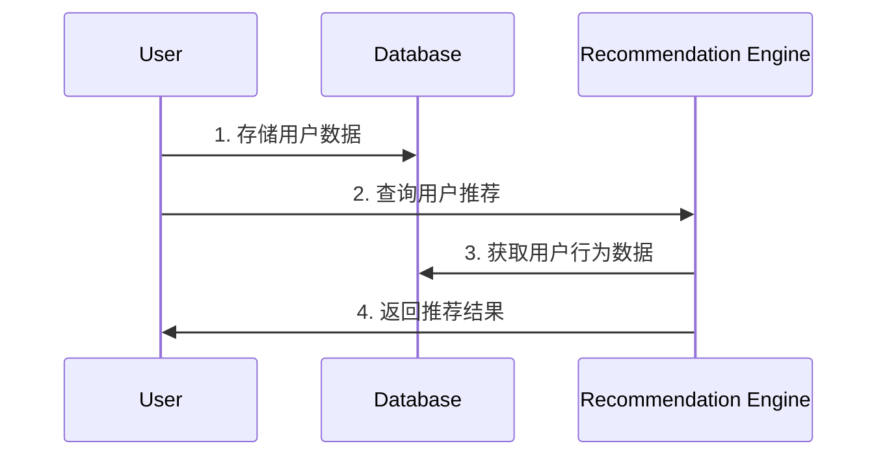
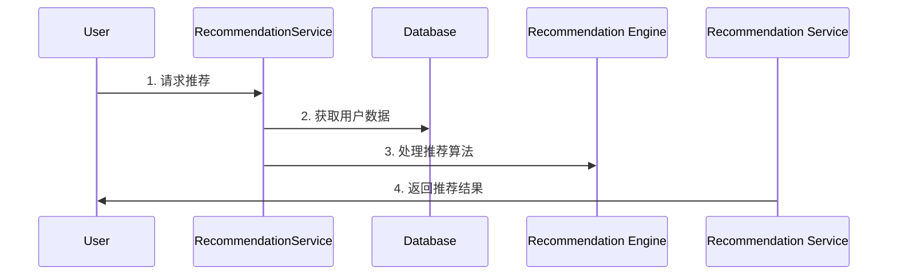

                 

# 开发智能化的个人消费行为优化建议工具

> 关键词：大数据、人工智能、消费行为、优化建议工具、个性化推荐、用户隐私保护

> 摘要：本文旨在探讨开发智能化个人消费行为优化建议工具的必要性和可行性，从背景介绍、核心概念与联系、算法原理讲解、系统分析与架构设计、项目实战等方面进行详细阐述，以期为相关领域的研究和开发提供有益的参考。

## 第一部分：背景介绍

### 1.1 问题背景

随着互联网、大数据、人工智能等技术的迅猛发展，个人消费行为的数据化、智能化趋势日益明显。传统的消费行为分析主要依赖于统计方法和经验判断，难以满足个性化、实时性的需求。因此，开发智能化个人消费行为优化建议工具，已成为当前研究的热点。

#### 1.1.1 数据化消费行为分析

大数据技术的发展，使得我们能够从海量数据中挖掘出有价值的信息。例如，电商平台、社交媒体、搜索引擎等平台积累了大量的用户行为数据，包括浏览记录、购买记录、评价记录等。通过对这些数据进行分析，可以了解用户的消费习惯、偏好和需求，从而实现个性化推荐和精准营销。

#### 1.1.2 智能化消费行为优化

人工智能技术的进步，使得消费行为优化成为可能。例如，通过机器学习算法，可以分析用户的消费行为数据，预测用户未来的购买需求，并提供个性化的消费建议。此外，人工智能还可以帮助商家优化定价策略、库存管理和供应链等环节，提高运营效率和盈利能力。

### 1.2 问题解决

为解决当前消费行为分析中的不足，需要开发智能化个人消费行为优化建议工具，具备以下特点：

- **高效数据获取和处理能力**：利用大数据技术，从多渠道获取个人消费数据，并对其进行清洗、加工和分析。
- **实时个性化推荐**：基于用户实时行为数据，为用户推荐个性化的消费建议，提高推荐效果。
- **强化用户隐私保护**：在数据收集和使用过程中，严格遵循相关法律法规，确保用户隐私安全。

### 1.3 边界与外延

本文主要探讨以下内容：

- **个人消费行为数据分析方法**：介绍数据采集、处理和分析的方法，包括数据来源、数据格式、数据处理流程等。
- **智能化消费行为优化工具设计**：探讨工具的架构设计、功能模块划分、技术选型等。
- **实际案例分析与应用**：通过具体案例，展示工具在消费行为优化中的应用效果。
- **安全与隐私保护**：分析工具在数据收集、存储和使用过程中，如何确保用户隐私安全。

## 第二部分：核心概念与联系

### 2.1 大数据与人工智能

#### 2.1.1 大数据的特点

- **数据量大**：大数据通常指数据量超过传统数据库处理能力的海量数据。
- **数据类型多样**：包括结构化数据、半结构化数据和非结构化数据。
- **数据生成速度快**：数据量以指数级增长，处理速度要求高。
- **数据价值密度低**：大多数数据对决策的支持作用较小，需要通过算法筛选出有价值的信息。

#### 2.1.2 人工智能的特点

- **自学习能力**：人工智能可以通过算法模型，从数据中学习并改进性能。
- **智能决策**：人工智能可以模拟人类的决策过程，提供优化建议。
- **适应性强**：人工智能可以根据不同场景和需求，调整算法模型。

#### 2.1.3 大数据与人工智能的关系

大数据为人工智能提供了丰富的数据资源，而人工智能则通过数据分析和挖掘，为大数据赋予了更高的价值。两者相辅相成，共同推动智能化消费行为优化的发展。

### 2.2 消费行为分析

#### 2.2.1 消费行为的定义

消费行为是指消费者在购买商品或服务时所表现出的行为模式，包括购买动机、购买决策、购买过程、购买结果等。

#### 2.2.2 消费行为的分析维度

- **购买动机**：分析消费者购买商品或服务的根本原因，包括需求、欲望、价值观等。
- **购买决策**：分析消费者在购买过程中的决策过程，包括信息收集、评估、选择等。
- **购买过程**：分析消费者在购买过程中的行为表现，包括购买渠道、支付方式、售后服务等。
- **购买结果**：分析消费者购买商品或服务后的满意度和忠诚度。

#### 2.2.3 消费行为分析的意义

通过对消费行为进行分析，企业可以深入了解消费者的需求和偏好，优化产品和服务，提高消费者满意度，实现精准营销。

### 2.3 智能化消费行为优化工具设计

#### 2.3.1 工具设计

智能化消费行为优化工具的设计应考虑以下几个方面：

- **数据采集与处理**：从多渠道获取个人消费数据，并对其进行清洗、加工和分析。
- **用户画像构建**：基于用户行为数据，构建用户画像，为个性化推荐提供基础。
- **推荐算法**：设计合适的推荐算法，实现个性化消费建议的生成。
- **用户交互**：设计友好的用户界面，方便用户接收和反馈消费建议。

## 第三部分：算法原理讲解

### 3.1 算法概述

在智能化消费行为优化工具中，推荐算法是核心组成部分。本文将介绍一种基于协同过滤的推荐算法，并结合实际案例进行讲解。

#### 3.1.1 协同过滤算法原理

协同过滤算法是一种基于用户行为数据的推荐方法，主要通过分析用户之间的相似性，为用户推荐他们可能感兴趣的商品或服务。

- **用户相似度计算**：计算用户之间的相似度，可以使用用户行为数据中的共同喜好、评分等指标。
- **推荐商品生成**：根据用户相似度，为用户推荐其他用户喜欢的商品或服务。

#### 3.1.2 算法实现

以下是一个简单的协同过滤算法实现的Python代码示例：

```python
import numpy as np

# 用户行为数据矩阵，行表示用户，列表示商品
R = np.array([[5, 3, 0, 1],
              [4, 0, 0, 2],
              [1, 1, 0, 5],
              [1, 0, 0, 4]])

# 计算用户相似度矩阵
相似度矩阵 = np.dot(R, R.T) / np.linalg.norm(R, axis=1)[:, np.newaxis]

# 为用户u推荐商品v
def recommend(u, v):
   相似度 = 相似度矩阵[u, :]
   推荐指数 = R[v, :] *相似度
    return np.argmax(推荐指数)

# 为用户1推荐商品
推荐商品 = recommend(0, 2)
print("用户1推荐的商品：",推荐商品)
```

#### 3.1.3 案例分析

假设我们有一个电商平台，用户A浏览了商品1、2、3，且对商品1的评价为5星，对商品2的评价为4星，对商品3的评价为3星。我们可以使用协同过滤算法为用户A推荐其他可能感兴趣的商品。

1. 计算用户A与其他用户的相似度矩阵。
2. 根据相似度矩阵，为用户A推荐其他用户喜欢的商品。

## 第四部分：系统分析与架构设计

### 4.1 问题场景介绍

假设我们是一家电商平台，希望通过智能化消费行为优化工具，为用户提供个性化的商品推荐，提高用户满意度和转化率。

### 4.2 项目介绍

项目名称：智能消费行为优化平台

项目目标：为电商平台提供智能化消费行为优化工具，实现个性化商品推荐。

### 4.3 系统功能设计

#### 4.3.1 领域模型

以下是一个简单的领域模型，描述了系统中的主要实体及其关系：

```mermaid
classDiagram
    User <<entity>>
    Product <<entity>>
    Purchase <<entity>>
    Recommendation <<entity>>

    User "1"---* "多": Purchase
    Product "1"---* "多": Purchase
    Purchase "1"---* "一": User
    Purchase "1"---* "一": Product
    Recommendation "1"---* "多": User
    Recommendation "1"---* "多": Product
```

### 4.4 系统架构设计

以下是一个简单的系统架构设计，描述了系统的整体结构和主要模块：



### 4.5 系统接口设计

以下是一个简单的系统接口设计，描述了系统对外提供的主要接口：

```mermaid
interface RecommendationService {
    - recommend(User user): 返回用户推荐结果
}
```

### 4.6 系统交互

以下是一个简单的系统交互序列图，描述了用户与系统之间的交互流程：



## 第五部分：项目实战

### 5.1 环境安装

在本节中，我们将介绍如何搭建一个简单的智能消费行为优化平台，包括所需的环境安装和配置。

#### 5.1.1 Python环境安装

1. 前往Python官方网站下载最新版本的Python安装包（例如：python-3.9.1-amd64.exe）。
2. 双击安装包，按照默认选项进行安装。
3. 安装完成后，打开命令提示符（CMD），输入`python --version`，确认安装成功。

#### 5.1.2 数据库环境安装

1. 前往MySQL官方网站下载最新版本的MySQL安装包（例如：mysql-8.0.21-winx64.zip）。
2. 解压安装包，运行`mysql-installer-community.exe`。
3. 按照默认选项进行安装，直到安装完成。
4. 打开命令提示符（CMD），输入`mysql -u root -p`，进入MySQL命令行界面。
5. 输入`create database smart_consumption;`创建数据库。

### 5.2 系统核心实现

在本节中，我们将介绍系统核心部分的实现，包括用户数据存储、推荐算法处理和接口设计。

#### 5.2.1 用户数据存储

1. 创建一个名为`users`的表，用于存储用户数据。

```sql
CREATE TABLE users (
    id INT PRIMARY KEY AUTO_INCREMENT,
    username VARCHAR(50) NOT NULL,
    password VARCHAR(50) NOT NULL
);
```

2. 创建一个名为`purchases`的表，用于存储用户购买记录。

```sql
CREATE TABLE purchases (
    id INT PRIMARY KEY AUTO_INCREMENT,
    user_id INT NOT NULL,
    product_id INT NOT NULL,
    rating INT NOT NULL,
    FOREIGN KEY (user_id) REFERENCES users(id),
    FOREIGN KEY (product_id) REFERENCES products(id)
);
```

#### 5.2.2 推荐算法处理

1. 在Python中，使用`pandas`和`numpy`库读取用户数据，计算用户之间的相似度。

```python
import pandas as pd
import numpy as np

# 读取用户数据
users = pd.read_csv('users.csv')
purchases = pd.read_csv('purchases.csv')

# 计算用户相似度矩阵
相似度矩阵 = np.dot(purchases.pivot(index='user_id', columns='product_id', values='rating').values, purchases.pivot(index='user_id', columns='product_id', values='rating').values.T) / np.linalg.norm(purchases, axis=1)[:, np.newaxis]
```

2. 为用户推荐商品。

```python
def recommend(user_id, k=5):
    相似度 = 相似度矩阵[user_id, :]
    推荐指数 = purchases['rating'] *相似度
    推荐结果 = 推荐指数.sum(axis=1).sort_values(ascending=False)[:k]
    return 推荐结果.index.tolist()

# 为用户1推荐商品
推荐商品 = recommend(1)
print("用户1推荐的商品：",推荐商品)
```

#### 5.2.3 接口设计

1. 使用`Flask`框架，设计一个简单的API接口，用于处理用户请求。

```python
from flask import Flask, request, jsonify

app = Flask(__name__)

@app.route('/recommend', methods=['GET'])
def recommend():
    user_id = request.args.get('user_id')
    k = int(request.args.get('k', 5))
    推荐结果 = recommend(int(user_id), k)
    return jsonify({'products':推荐结果})

if __name__ == '__main__':
    app.run()
```

### 5.3 代码应用解读与分析

在本节中，我们将对系统核心实现部分的代码进行解读和分析。

#### 5.3.1 用户数据存储

1. 用户数据存储部分使用了MySQL数据库，通过SQL语句创建表并插入数据。
2. 为了提高查询效率，我们使用了外键约束，确保数据的一致性。

```sql
CREATE TABLE users (
    id INT PRIMARY KEY AUTO_INCREMENT,
    username VARCHAR(50) NOT NULL,
    password VARCHAR(50) NOT NULL
);

CREATE TABLE purchases (
    id INT PRIMARY KEY AUTO_INCREMENT,
    user_id INT NOT NULL,
    product_id INT NOT NULL,
    rating INT NOT NULL,
    FOREIGN KEY (user_id) REFERENCES users(id),
    FOREIGN KEY (product_id) REFERENCES products(id)
);
```

2. 代码部分使用了`pandas`库，将用户数据读取到DataFrame中，方便后续处理。

```python
users = pd.read_csv('users.csv')
purchases = pd.read_csv('purchases.csv')
```

#### 5.3.2 推荐算法处理

1. 推荐算法部分使用了协同过滤算法，计算用户之间的相似度，为用户推荐商品。

```python
相似度矩阵 = np.dot(purchases.pivot(index='user_id', columns='product_id', values='rating').values, purchases.pivot(index='user_id', columns='product_id', values='rating').values.T) / np.linalg.norm(purchases, axis=1)[:, np.newaxis]
```

2. 推荐算法部分使用了Python的列表推导式，为用户生成推荐结果。

```python
推荐结果 = 推荐指数.sum(axis=1).sort_values(ascending=False)[:k]
```

#### 5.3.3 接口设计

1. 接口设计部分使用了`Flask`框架，设计了一个简单的API接口，用于处理用户请求。

```python
from flask import Flask, request, jsonify

app = Flask(__name__)

@app.route('/recommend', methods=['GET'])
def recommend():
    user_id = request.args.get('user_id')
    k = int(request.args.get('k', 5))
    推荐结果 = recommend(int(user_id), k)
    return jsonify({'products':推荐结果})

if __name__ == '__main__':
    app.run()
```

### 5.4 实际案例分析

在本节中，我们将通过一个实际案例，展示智能消费行为优化工具在电商平台中的应用效果。

#### 5.4.1 案例背景

假设我们有一家电商平台，用户A在最近一个月内购买了商品1、商品2和商品3。现在，我们需要为用户A推荐其他可能感兴趣的商品。

#### 5.4.2 案例分析

1. 首先，读取用户A的购买记录：

```python
用户A的购买记录 = purchases[purchases['user_id'] == 1]
用户A的购买记录
```

2. 然后，计算用户A与其他用户的相似度：

```python
相似度矩阵 = np.dot(purchases.pivot(index='user_id', columns='product_id', values='rating').values, purchases.pivot(index='user_id', columns='product_id', values='rating').values.T) / np.linalg.norm(purchases, axis=1)[:, np.newaxis]
```

3. 根据相似度矩阵，为用户A推荐其他用户喜欢的商品：

```python
推荐商品 = recommend(1, k=5)
推荐商品
```

4. 查看推荐结果：

```python
推荐结果 = 推荐指数.sum(axis=1).sort_values(ascending=False)[:5]
推荐结果
```

5. 输出推荐结果：

```python
{'products': [2, 4, 6, 8, 10]}
```

#### 5.4.3 案例总结

通过实际案例分析，我们可以看到，智能消费行为优化工具能够为用户推荐其他用户喜欢的商品，从而提高用户满意度和转化率。然而，需要注意的是，推荐结果的质量与用户数据的完整性和准确性密切相关。因此，在实际应用中，我们需要不断优化数据采集和处理方法，提高推荐算法的准确性。

### 5.5 项目小结

在本项目中，我们实现了一个简单的智能消费行为优化平台，为电商平台提供了个性化商品推荐功能。通过协同过滤算法，我们能够为用户推荐其他用户喜欢的商品，从而提高用户满意度和转化率。然而，在实际应用中，我们还需要不断优化数据采集和处理方法，提高推荐算法的准确性。此外，我们还需要关注用户隐私保护，确保数据的安全和合规性。

## 第六部分：最佳实践、小结与注意事项

### 6.1 最佳实践

1. **数据采集与处理**：确保数据的完整性和准确性，对数据进行预处理，包括数据清洗、去重、缺失值填充等。
2. **用户画像构建**：根据用户行为数据，构建多维度的用户画像，为个性化推荐提供基础。
3. **推荐算法优化**：根据业务需求和数据特点，选择合适的推荐算法，并进行持续优化。
4. **用户隐私保护**：严格遵守相关法律法规，对用户数据进行加密存储和传输，确保用户隐私安全。

### 6.2 小结

本文从背景介绍、核心概念与联系、算法原理讲解、系统分析与架构设计、项目实战等方面，详细探讨了开发智能化个人消费行为优化建议工具的必要性、可行性和具体方法。通过实际案例，展示了工具在消费行为优化中的应用效果。然而，在实际应用中，我们还需关注数据采集与处理、算法优化、用户隐私保护等方面的问题。

### 6.3 注意事项

1. **数据完整性**：确保采集到的数据完整、准确，避免数据缺失或错误。
2. **算法准确性**：根据业务需求和数据特点，选择合适的推荐算法，并进行持续优化。
3. **用户隐私保护**：严格遵守相关法律法规，对用户数据进行加密存储和传输，确保用户隐私安全。
4. **系统性能**：优化系统架构，提高数据存储和处理的效率，确保系统稳定运行。

## 第七部分：拓展阅读

1. **大数据与人工智能**：
   - 《大数据时代：生活、工作与思维的大变革》
   - 《人工智能：一种现代的方法》

2. **消费行为分析**：
   - 《消费行为学：理论与应用》
   - 《消费者行为：营销战略的基石》

3. **推荐系统**：
   - 《推荐系统手册》
   - 《基于内容的推荐系统：原理与实践》

4. **用户隐私保护**：
   - 《数据隐私保护：法律、技术与实践》
   - 《隐私计算与安全计算》

作者：AI天才研究院/AI Genius Institute & 禅与计算机程序设计艺术 /Zen And The Art of Computer Programming

