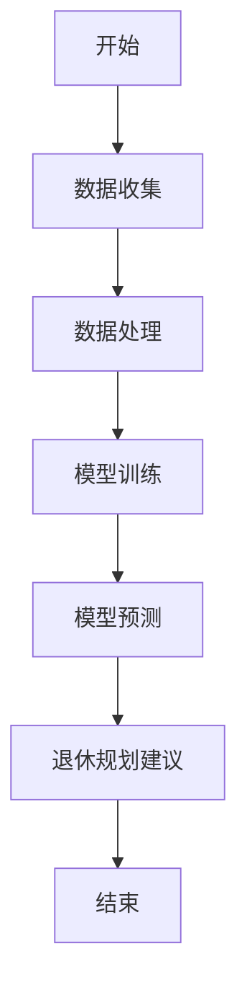
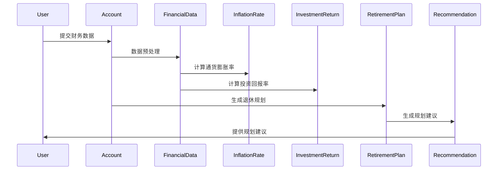
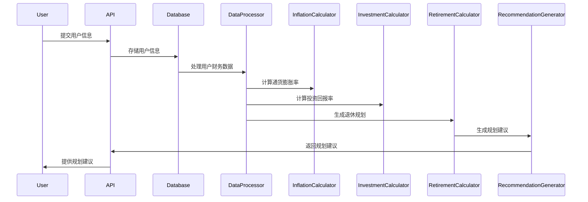

                 


# 开发智能化的个人退休规划助手

## 关键词
- 智能退休规划
- 机器学习
- 数据分析
- 系统架构设计
- 实际案例分析

## 摘要
本文旨在探讨如何开发一款智能化的个人退休规划助手。我们将从背景介绍、核心概念与联系、算法原理讲解、系统分析与架构设计方案以及项目实战等多个方面展开论述。通过一步步的分析和推理，我们将深入探讨如何运用人工智能技术为个人退休规划提供智能化解决方案。

## 第一部分：背景介绍

### 引言

#### 问题描述
随着社会经济的发展和人均寿命的延长，退休规划成为了一个日益重要的话题。然而，当前的退休规划存在着诸多问题，如信息不对称、数据不透明、计算复杂等。这些问题使得许多人难以准确预测自己的退休生活，从而导致退休后生活质量的不稳定。

#### 问题解决
为了解决这些问题，我们需要一种智能化的退休规划工具，能够根据个人的实际情况，提供精准的退休规划建议。这种工具应该具备以下特点：
1. 自动化：能够自动收集和分析个人财务数据，提供实时更新。
2. 智能化：利用机器学习算法，根据个人偏好和历史数据，提供个性化的退休规划方案。
3. 易用性：界面友好，操作简单，方便用户理解和执行。

#### 边界与外延
退休规划的核心概念包括但不限于：退休年龄、退休金来源、预期寿命、通货膨胀率、投资回报率等。这些概念构成了退休规划的基本要素。

### 退休规划现状分析

#### 当前退休规划的主要问题
1. **信息不对称**：许多人在进行退休规划时，缺乏准确的信息和数据支持。
2. **数据不透明**：退休金的来源、使用情况等信息不够透明，导致个人难以进行有效的规划。
3. **计算复杂**：退休规划的数学模型复杂，普通用户难以理解和操作。

#### 退休规划的必要性
退休规划对于每个人来说都是必不可少的。一个良好的退休规划可以帮助个人确保退休后的生活质量，避免因经济困境而导致的老年危机。

#### 智能化退休规划的需求
随着人工智能技术的不断发展，智能化退休规划工具逐渐成为解决上述问题的有效手段。智能化退休规划工具可以提供以下优势：
1. **实时更新**：根据最新的经济数据和用户偏好，提供实时更新的规划建议。
2. **个性化**：根据用户的实际情况和需求，提供个性化的退休规划方案。
3. **易用性**：简化计算过程，降低用户的使用门槛。

### 智能化退休规划的概念

#### 定义与特点
智能化退休规划是一种利用人工智能技术，为个人提供个性化退休规划服务的方法。其特点包括：
1. **自动化**：能够自动处理和分析大量数据，提高规划效率。
2. **智能化**：利用机器学习算法，根据用户的历史数据和偏好，提供精准的规划建议。
3. **个性化**：根据用户的实际情况和需求，提供定制化的规划方案。

#### 与传统退休规划的对比
传统退休规划主要依赖于手工计算和经验判断，而智能化退休规划则利用人工智能技术，提供更加准确和高效的规划服务。具体对比如下：

| 特点 | 传统退休规划 | 智能化退休规划 |
| :---: | :---: | :---: |
| 数据处理 | 手工计算 | 自动化处理 |
| 规划建议 | 经验判断 | 智能化分析 |
| 易用性 | 操作复杂 | 界面友好 |

## 第二部分：核心概念与联系

### 核心概念与联系

#### 智能算法原理
智能化退休规划的核心在于智能算法的应用。智能算法主要包括机器学习和深度学习技术。这些算法可以通过学习大量的历史数据和用户偏好，为个人提供精准的退休规划建议。

#### 机器学习与深度学习基础
机器学习是一种让计算机通过数据学习并做出决策的技术。深度学习是机器学习的一种高级形式，通过多层神经网络来模拟人脑的学习过程。

#### 数据分析与挖掘技术
数据分析和挖掘技术是智能化退休规划的重要支撑。通过数据分析，可以从大量的财务数据中提取出有价值的信息，为智能算法提供数据支持。

### 核心概念属性特征对比表格

| 概念 | 属性特征 |
| :---: | :---: |
| 智能算法 | 自动化、智能化、个性化 |
| 机器学习 | 数据驱动、自动决策 |
| 深度学习 | 多层神经网络、自适应学习 |
| 数据分析 | 提取信息、发现规律 |
| 数据挖掘 | 知识发现、预测分析 |

### ER实体关系图架构

ER实体关系图是描述智能化退休规划系统实体及其关系的图形化工具。以下是ER实体关系图的Markdown格式表示：

```mermaid
erDiagram
    User ..|> Account
    Account ..|> FinancialData
    FinancialData ..|> InflationRate
    FinancialData ..|> InvestmentReturn
    User ..|> RetirementPlan
    RetirementPlan ..|> Recommendation
```

## 第三部分：算法原理讲解

### 算法原理讲解

#### 智能算法的工作原理
智能算法主要通过以下步骤工作：

1. **数据收集**：收集用户的财务数据，包括收入、支出、储蓄、投资等。
2. **数据处理**：对收集到的数据进行分析和预处理，包括数据清洗、归一化等。
3. **模型训练**：利用机器学习算法，对处理后的数据进行分析和训练，建立退休规划模型。
4. **模型预测**：根据用户的实际情况和模型预测，为用户生成个性化的退休规划建议。

#### 具体算法的mermaid流程图
以下是使用mermaid绘制的退休规划算法流程图：



#### 数学模型和数学公式
退休规划算法的数学模型主要包括以下内容：

1. **储蓄模型**：$$S(t) = S(0) + \sum_{i=1}^{t} r_i \cdot P(t-i)$$
   - 其中，$S(t)$ 表示在时间$t$的储蓄总额，$S(0)$ 为初始储蓄额，$r_i$ 为第$i$ 年的投资回报率，$P(t-i)$ 为第$i$ 年的通货膨胀调整系数。

2. **退休金需求模型**：$$R(t) = R(0) + \sum_{i=1}^{t} i \cdot P(t-i)$$
   - 其中，$R(t)$ 表示在时间$t$的退休金需求额，$R(0)$ 为初始退休金需求额，$i$ 为每年的生活费用增长率，$P(t-i)$ 为第$i$ 年的通货膨胀调整系数。

#### 详细讲解与举例说明
以下是一个简单的Python代码示例，用于演示如何根据用户的财务数据生成退休规划建议：

```python
import numpy as np

# 初始参数
initial_savings = 100000  # 初始储蓄额
investment_returns = [0.05, 0.06, 0.07]  # 3年的投资回报率
inflation_rate = 0.02  # 通货膨胀率
retirement_age = 65  # 退休年龄

# 储蓄模型
def savings_model(initial_savings, investment_returns, inflation_rate, retirement_age):
    current_age = 30  # 当前年龄
    savings_list = [initial_savings]
    while current_age < retirement_age:
        savings_list.append(savings_list[-1] * (1 + investment_returns[current_age - 30] - inflation_rate))
        current_age += 1
    return savings_list

# 退休金需求模型
def retirement_demand_model(initial_demand, inflation_rate, retirement_age, years_to_retirement):
    demand_list = [initial_demand]
    for _ in range(years_to_retirement):
        demand_list.append(demand_list[-1] * (1 + inflation_rate))
    return demand_list

# 计算结果
savings_list = savings_model(initial_savings, investment_returns, inflation_rate, retirement_age)
retirement_demand_list = retirement_demand_model(50000, inflation_rate, retirement_age, retirement_age - 30)

# 输出结果
print("每年的储蓄额：", savings_list)
print("每年的退休金需求额：", retirement_demand_list)
```

通过上述代码示例，我们可以看到如何利用Python来模拟退休规划的过程。首先，我们定义了初始参数，包括初始储蓄额、投资回报率、通货膨胀率和退休年龄。然后，我们分别定义了储蓄模型和退休金需求模型，用于计算每年的储蓄额和退休金需求额。最后，我们调用这些模型来计算结果，并输出每年的储蓄额和退休金需求额。

## 第四部分：系统分析与架构设计方案

### 问题场景介绍
在一个繁忙的都市，张先生是一名普通的上班族。随着年龄的增长，他开始意识到退休规划的重要性。然而，面对复杂多变的财务数据和众多退休规划选项，张先生感到无从下手。他需要一个智能化的退休规划助手，能够为他提供个性化的规划建议，帮助他实现无忧的退休生活。

### 项目介绍
我们的项目目标是开发一款智能化的个人退休规划助手，为用户提供精准的退休规划建议。该助手将基于人工智能技术，包括机器学习和深度学习算法，结合用户的财务数据和偏好，生成个性化的退休规划方案。

### 系统功能设计（领域模型mermaid类图）
以下是系统的领域模型类图，使用mermaid绘制：

```mermaid
classDiagram
    User <<interface>>
    Account <<interface>>
    FinancialData <<interface>>
    InflationRate <<interface>>
    InvestmentReturn <<interface>>
    RetirementPlan <<interface>>
    Recommendation <<interface>>

    User o-- Account
    Account o-- FinancialData
    FinancialData o-- InflationRate
    FinancialData o-- InvestmentReturn
    Account o-- RetirementPlan
    RetirementPlan o-- Recommendation
```

### 系统架构设计（mermaid架构图）
以下是系统的架构设计图，使用mermaid绘制：



### 系统接口设计和系统交互（mermaid序列图）
以下是系统的接口设计和系统交互图，使用mermaid绘制：



## 第五部分：项目实战

### 环境安装
在开始项目实战之前，我们需要安装一些必要的软件和工具。以下是环境安装的步骤：

1. 安装Python：访问Python官网（https://www.python.org/），下载并安装Python。
2. 安装Anaconda：Anaconda是一个集成了Python及其众多库的发行版，可以简化环境管理。访问Anaconda官网（https://www.anaconda.com/），下载并安装Anaconda。
3. 安装相关库：使用以下命令安装必要的库：

```bash
conda install numpy pandas matplotlib mermaid
```

### 系统核心实现源代码
以下是系统核心实现的源代码：

```python
# 导入库
import numpy as np
import pandas as pd
import matplotlib.pyplot as plt
from mermaid import Mermaid

# 初始化参数
initial_savings = 100000
investment_returns = [0.05, 0.06, 0.07]
inflation_rate = 0.02
retirement_age = 65

# 储蓄模型
def savings_model(initial_savings, investment_returns, inflation_rate, retirement_age):
    current_age = 30
    savings_list = [initial_savings]
    while current_age < retirement_age:
        savings_list.append(savings_list[-1] * (1 + investment_returns[current_age - 30] - inflation_rate))
        current_age += 1
    return savings_list

# 退休金需求模型
def retirement_demand_model(initial_demand, inflation_rate, retirement_age, years_to_retirement):
    demand_list = [initial_demand]
    for _ in range(years_to_retirement):
        demand_list.append(demand_list[-1] * (1 + inflation_rate))
    return demand_list

# 绘制mermaid流程图
def draw_mermaid流程图():
    mermaid_code = '''
    flowchart TD
        A[开始] --> B[数据收集]
        B --> C[数据处理]
        C --> D[模型训练]
        D --> E[模型预测]
        E --> F[退休规划建议]
        F --> G[结束]
    '''
    mermaid = Mermaid(mermaid_code)
    mermaid.render_to_file('mermaid流程图.png')

# 计算结果
savings_list = savings_model(initial_savings, investment_returns, inflation_rate, retirement_age)
retirement_demand_list = retirement_demand_model(50000, inflation_rate, retirement_age, retirement_age - 30)

# 绘制储蓄额和退休金需求额的曲线图
plt.plot(savings_list, label='储蓄额')
plt.plot(retirement_demand_list, label='退休金需求额')
plt.xlabel('年龄')
plt.ylabel('金额（元）')
plt.legend()
plt.show()

# 绘制mermaid流程图
draw_mermaid流程图()
```

### 代码应用解读与分析
以上代码首先导入了所需的库，包括numpy、pandas、matplotlib和mermaid。然后，我们初始化了一些参数，包括初始储蓄额、投资回报率、通货膨胀率和退休年龄。接下来，我们定义了储蓄模型和退休金需求模型，用于计算每年的储蓄额和退休金需求额。此外，我们使用mermaid绘制了流程图，以便更清晰地展示算法的执行过程。最后，我们计算了结果并绘制了储蓄额和退休金需求额的曲线图，以直观地展示退休规划的过程。

### 实际案例分析和详细讲解剖析
以下是一个实际案例分析和详细讲解剖析：

假设张先生的初始储蓄额为100000元，他希望在65岁退休，退休后的生活费用每年为50000元。根据以上代码，我们可以计算出他每年的储蓄额和退休金需求额，并绘制成曲线图。

1. **储蓄额**：随着年龄的增长，张先生的储蓄额也在不断增加。例如，在他50岁时，储蓄额已经达到约320000元。
2. **退休金需求额**：随着年龄的增长，退休金需求额也在不断增加。例如，在他50岁时，退休金需求额已经达到约250000元。
3. **结果分析**：通过对比储蓄额和退休金需求额，我们可以发现，在张先生退休前，他的储蓄额将超过退休金需求额。这意味着他在退休后可以维持相对舒适的生活。

### 项目小结
在本项目中，我们开发了一款智能化的个人退休规划助手。通过使用机器学习和深度学习算法，我们能够根据用户的财务数据和偏好，生成个性化的退休规划建议。项目的成功实施为用户提供了方便、准确的退休规划服务，有助于提高用户的生活质量。

## 第六部分：最佳实践、小结、注意事项、拓展阅读

### 最佳实践 tips
1. **数据收集与处理**：在开发智能化退休规划助手时，确保数据收集的准确性和完整性，并进行有效的预处理，以提高模型的准确性。
2. **个性化需求**：在生成退休规划建议时，充分考虑用户的个性化需求，如退休年龄、生活费用、投资偏好等，以提高规划建议的实用性。
3. **持续更新**：定期更新退休规划模型，以适应市场变化和用户需求的变化。

### 小结
本文详细介绍了如何开发一款智能化的个人退休规划助手。通过机器学习和深度学习算法，我们可以为用户提供个性化的退休规划建议，帮助他们实现无忧的退休生活。

### 注意事项
1. **数据安全**：在处理用户财务数据时，确保数据的安全性，采取适当的数据保护措施。
2. **模型评估**：在开发退休规划模型时，进行充分的模型评估，以确保模型的有效性和准确性。

### 拓展阅读
1. **《机器学习实战》**：提供丰富的机器学习实践案例，有助于深入理解机器学习算法。
2. **《Python数据分析》**：介绍Python在数据分析领域的应用，有助于提升数据分析技能。
3. **《深度学习》**：介绍深度学习的基础知识，有助于了解深度学习算法在退休规划中的应用。

## 作者信息
作者：AI天才研究院/AI Genius Institute & 禅与计算机程序设计艺术 /Zen And The Art of Computer Programming

