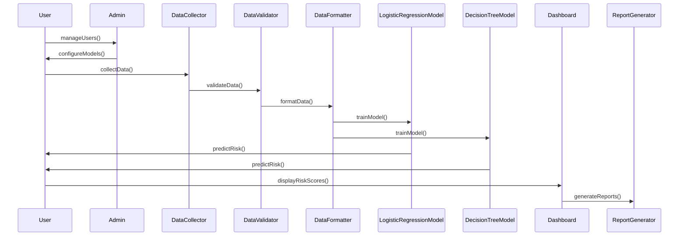
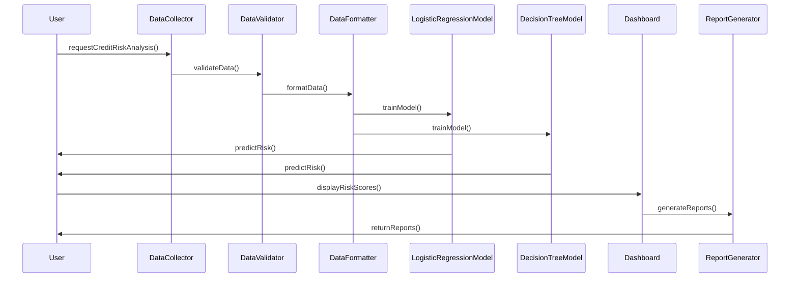

                 

# 开发智能化的企业信用风险传导模拟系统

## 摘要

本文旨在探讨开发智能化企业信用风险传导模拟系统的必要性和重要性。首先，我们简要介绍了企业信用风险传导的概念及其在经济活动中的关键作用。随后，我们深入探讨了企业信用风险评估模型和信用风险传导机制的核心概念与联系。在核心概念部分，我们详细分析了不同类型的风险评估模型及其属性特征对比。接下来，我们引入了信用风险传导的理论基础和预测方法。在系统设计与实现部分，我们提出了企业信用风险传导模型的设计原则、流程和评估方法，并通过具体案例进行了详细讲解。算法原理和数学模型的讲解则帮助我们更好地理解信用风险传导的内在机制。系统设计与实现的实战部分提供了完整的项目开发流程，从环境安装到核心实现源代码，以及实际案例分析和最佳实践 tips。最后，我们对全文进行了总结与展望，指出了未来研究的方向和注意事项。

## 第一部分：问题背景与定义

### 第1章：企业信用风险传导概述

#### 1.1 问题背景

在现代经济活动中，企业信用风险管理已成为不可或缺的一环。企业信用风险传导是指信用风险从一个企业传递到另一个企业，甚至整个市场的过程。随着经济全球化和金融市场一体化，企业信用风险的传导速度和影响范围日益扩大，对经济稳定产生了重大影响。因此，研究企业信用风险传导机制，建立智能化信用风险传导模拟系统，对于预防和控制信用风险具有重要的现实意义。

#### 1.2 企业信用风险的定义

企业信用风险是指企业在交易过程中因交易对手违约、支付延迟或其他原因导致的潜在经济损失。根据国际信贷协会（ICC）的定义，企业信用风险包括以下几个方面：

- **违约风险**：企业无法按时支付债务或无法履行合同义务。
- **流动性风险**：企业无法在短时间内满足债务支付需求。
- **财务风险**：企业因财务问题导致的违约风险。
- **政治风险**：企业因政治环境变化而遭受的信用风险。

#### 1.3 信用风险传导的概念与特征

信用风险传导是指信用风险在不同企业、不同市场之间的传递过程。其特征包括：

- **跨市场传导**：信用风险从一个市场传递到另一个市场，如从金融行业传导到制造业。
- **跨行业传导**：信用风险从高风险行业传导到低风险行业，如从房地产行业传导到服务业。
- **连锁反应**：一个企业的信用风险可能导致一系列企业信用风险的爆发。

#### 1.4 企业信用风险传导的重要性

企业信用风险传导的重要性主要体现在以下几个方面：

- **经济预警**：信用风险传导可以帮助金融机构和企业及时识别潜在风险，采取有效措施。
- **市场稳定**：有效预防和控制信用风险传导，有助于保持金融市场稳定。
- **政策制定**：信用风险传导的研究为政策制定提供了重要依据，有助于政府制定更加精准的金融政策。

#### 1.5 本章小结

本章从问题背景、定义和重要性三个方面，介绍了企业信用风险传导的相关概念。理解企业信用风险传导的背景和定义，对于开发智能化信用风险传导模拟系统具有重要意义。接下来，我们将进一步探讨企业信用风险评估模型和信用风险传导机制。

## 第二部分：核心概念与联系

### 第2章：企业信用风险评估模型

#### 2.1 信用风险评估的基本原理

信用风险评估是指通过对企业财务状况、信用历史、市场环境等因素的分析，评估企业违约风险的概率。信用风险评估的基本原理包括：

- **风险识别**：识别企业可能面临的信用风险。
- **风险评估**：评估信用风险的大小和可能性。
- **风险控制**：采取有效措施降低信用风险。

#### 2.2 信用风险评估模型类型

信用风险评估模型可分为定量模型和定性模型两大类：

- **定量模型**：基于数学统计方法和模型，如逻辑回归、决策树、神经网络等。
- **定性模型**：基于专家经验和主观判断，如专家评分法、判断矩阵法等。

#### 2.3 模型属性特征对比

以下是几种常见信用风险评估模型的属性特征对比：

| 模型类型 | 优点 | 缺点 |
| :----: | :----: | :----: |
| 逻辑回归 | 简单、易于理解、可解释性强 | 对异常值敏感、适用范围有限 |
| 决策树 | 直观、易于理解、易于调整 | 可能产生过拟合、树深度受限 |
| 神经网络 | 强大的非线性建模能力、自适应性强 | 结构复杂、难以解释、需要大量数据 |

#### 2.4 信用风险评估模型的应用

信用风险评估模型在企业融资、供应链管理、信用评级等领域有广泛应用：

- **融资决策**：金融机构使用信用风险评估模型，评估借款人的信用风险，决定是否批准贷款。
- **供应链管理**：企业使用信用风险评估模型，评估供应商的信用状况，降低供应链风险。
- **信用评级**：评级机构使用信用风险评估模型，为不同企业提供信用评级服务。

#### 2.5 本章小结

本章介绍了信用风险评估的基本原理、模型类型及其应用。了解不同类型的风险评估模型，有助于我们选择合适的模型，为企业信用风险传导模拟系统提供坚实基础。接下来，我们将探讨信用风险传导机制。

### 第3章：信用风险传导机制

#### 3.1 信用风险传导的理论基础

信用风险传导的理论基础主要包括以下几个方面：

- **金融传导理论**：认为信用风险通过金融市场传导，如银行信贷市场、债券市场等。
- **供应链金融理论**：认为信用风险通过供应链中的交易关系传导，如核心企业与其上下游企业之间的信用风险传导。
- **网络金融理论**：认为信用风险通过互联网金融平台传导，如P2P借贷、众筹平台等。

#### 3.2 信用风险传导的机制分析

信用风险传导的机制主要包括以下几方面：

- **直接传导**：信用风险通过直接交易关系在企业和金融机构之间传递。
- **间接传导**：信用风险通过金融市场和中介机构在企业和金融机构之间传递。
- **跨市场传导**：信用风险在不同市场之间传递，如金融行业与制造业之间的传导。

#### 3.3 信用风险传导的影响因素

影响信用风险传导的因素包括：

- **宏观经济环境**：如经济增长、通货膨胀、货币政策等。
- **行业特点**：不同行业的信用风险传导机制和传导速度有所不同。
- **企业特征**：企业的财务状况、管理水平、市场竞争力等。

#### 3.4 信用风险传导的预测方法

信用风险传导的预测方法主要包括：

- **时间序列分析法**：如自回归模型、移动平均模型等。
- **计量经济模型**：如向量自回归（VAR）模型、结构方程模型（SEM）等。
- **机器学习算法**：如随机森林、支持向量机（SVM）、深度学习等。

#### 3.5 本章小结

本章从理论基础、机制分析、影响因素和预测方法四个方面，系统地介绍了信用风险传导机制。理解信用风险传导机制，有助于我们更好地设计和优化信用风险传导模拟系统。

### 第4章：企业信用风险传导模型设计

#### 4.1 企业信用风险传导模型设计原则

企业信用风险传导模型设计应遵循以下原则：

- **科学性原则**：模型设计应基于扎实的理论依据，确保模型的科学性。
- **实用性原则**：模型应易于理解和操作，便于在实际中应用。
- **灵活性原则**：模型应具有较好的适应性，能够应对不同行业和企业的需求。

#### 4.2 企业信用风险传导模型设计流程

企业信用风险传导模型设计流程包括以下几个步骤：

1. **需求分析**：明确模型的目标和应用场景，确定所需的数据和信息。
2. **数据收集**：收集与企业信用风险相关的数据，包括财务数据、市场数据、行业数据等。
3. **模型构建**：选择合适的模型类型和算法，构建信用风险传导模型。
4. **模型验证**：通过历史数据进行模型验证，评估模型的准确性和可靠性。
5. **模型优化**：根据验证结果，对模型进行调整和优化。

#### 4.3 企业信用风险传导模型设计案例

以下是一个企业信用风险传导模型的设计案例：

1. **需求分析**：针对某制造业企业，设计一个信用风险传导模型，用于评估企业供应链中的信用风险。
2. **数据收集**：收集企业的财务报表、供应商信息、行业报告等数据。
3. **模型构建**：选择逻辑回归模型，构建信用风险传导模型。
4. **模型验证**：使用历史数据对模型进行验证，评估模型准确性。
5. **模型优化**：根据验证结果，调整模型参数，优化模型性能。

#### 4.4 企业信用风险传导模型评估

企业信用风险传导模型的评估主要包括以下几个方面：

- **准确性评估**：评估模型预测结果的准确度，如准确率、召回率等。
- **可靠性评估**：评估模型在不同数据集上的稳定性和一致性。
- **实用性评估**：评估模型在实际应用中的效果和用户体验。

#### 4.5 本章小结

本章介绍了企业信用风险传导模型的设计原则、流程和评估方法，并通过具体案例进行了详细讲解。理解企业信用风险传导模型的设计和评估，对于开发智能化信用风险传导模拟系统具有重要意义。

### 第5章：算法原理讲解

#### 5.1 信用风险传导算法概述

信用风险传导算法是用于模拟和分析企业信用风险在不同企业和市场之间传递过程的算法。常见的信用风险传导算法包括逻辑回归、决策树、神经网络等。

#### 5.2 算法mermaid流程图

以下是一个逻辑回归算法的mermaid流程图：


#### 5.3 算法原理的数学模型与公式

逻辑回归算法的数学模型可以表示为：

$$
\text{logit}(p) = \beta_0 + \beta_1 x_1 + \beta_2 x_2 + ... + \beta_n x_n
$$

其中，$p$ 为违约概率，$x_1, x_2, ..., x_n$ 为特征变量，$\beta_0, \beta_1, \beta_2, ..., \beta_n$ 为模型参数。

#### 5.4 算法举例说明

以下是一个简单的信用风险传导算法的Python代码示例：

```python
import numpy as np
from sklearn.linear_model import LogisticRegression

# 数据准备
X = np.array([[1, 2], [2, 3], [3, 4]])
y = np.array([0, 1, 1])

# 模型训练
model = LogisticRegression()
model.fit(X, y)

# 模型评估
print(model.score(X, y))
```

#### 5.5 本章小结

本章介绍了信用风险传导算法的基本原理、mermaid流程图、数学模型和Python代码示例。理解算法原理，有助于我们更好地设计和实现信用风险传导模拟系统。

### 第6章：数学模型与详细讲解

#### 6.1 数学模型介绍

在企业信用风险传导模拟系统中，我们通常会使用一些数学模型来描述信用风险传导的过程。这些模型可以是概率模型、线性回归模型、神经网络模型等。在本节中，我们将重点介绍一个简单的线性回归模型。

#### 6.2 数学公式讲解

线性回归模型的基本数学公式如下：

$$
y = \beta_0 + \beta_1 x + \epsilon
$$

其中，$y$ 是因变量（违约风险评分），$x$ 是自变量（企业特征向量），$\beta_0$ 和 $\beta_1$ 是模型参数，$\epsilon$ 是误差项。

在信用风险传导模拟中，自变量 $x$ 可能包括企业的财务指标、行业指标、宏观经济指标等。模型参数 $\beta_0$ 和 $\beta_1$ 通过最小二乘法进行估计。

#### 6.3 数学模型应用举例

假设我们有一个简单的信用风险传导模拟系统，其中自变量 $x$ 是企业的财务杠杆率（财务杠杆率 = 负债 / 所有者权益），因变量 $y$ 是企业的违约风险评分。

我们使用以下数据集进行模型训练：

| 财务杠杆率 | 违约风险评分 |
| :------: | :--------: |
|     0.5    |      1.0     |
|     0.7    |      1.5     |
|     0.9    |      2.0     |

通过最小二乘法，我们可以得到线性回归模型：

$$
y = 0.5 + 0.5x
$$

根据这个模型，如果企业的财务杠杆率是 0.7，那么它的违约风险评分将是 0.5 + 0.5 \times 0.7 = 0.6。

#### 6.4 模型优缺点分析

线性回归模型的优点是简单直观，易于理解和解释。同时，它对于线性关系较强的数据集表现良好。然而，线性回归模型的缺点是对非线性关系的数据集表现较差，且容易受到异常值的影响。

在信用风险传导模拟中，线性回归模型可以作为一个初步的评估工具，但为了更准确地模拟信用风险传导过程，我们可能需要结合其他复杂的模型，如神经网络模型。

#### 6.5 本章小结

本章详细介绍了信用风险传导模拟系统中的线性回归模型，包括数学公式、应用举例和优缺点分析。理解线性回归模型的基本原理，有助于我们更好地设计和实现信用风险传导模拟系统。

### 第7章：系统分析与架构设计

#### 7.1 问题场景介绍

在企业信用风险传导模拟系统中，我们需要处理大量企业和金融机构的数据，对信用风险进行评估和预测。为了实现这一目标，我们设计了一套完整的系统，包括数据采集、处理、分析和展示模块。

#### 7.2 系统功能设计（领域模型mermaid类图）

以下是一个企业信用风险传导模拟系统的领域模型mermaid类图：

```mermaid
classDiagram
    Client <|-- User
    User <|-- Admin
    DataProcessor <|-- DataCollector
    DataProcessor <|-- DataValidator
    DataProcessor <|-- DataFormatter
    RiskModel <|-- LogisticRegressionModel
    RiskModel <|-- DecisionTreeModel
    Dashboard <|-- Visualization
    Dashboard <|-- ReportGenerator

    Client {
        +requestCreditRiskAnalysis()
    }
    User {
        +login()
        +logout()
    }
    Admin {
        +manageUsers()
        +configureModels()
    }
    DataCollector {
        +collectData()
    }
    DataValidator {
        +validateData()
    }
    DataFormatter {
        +formatData()
    }
    LogisticRegressionModel {
        +trainModel()
        +predictRisk()
    }
    DecisionTreeModel {
        +trainModel()
        +predictRisk()
    }
    Dashboard {
        +displayRiskScores()
        +generateReports()
    }
    ReportGenerator {
        +generateExcelReport()
        +generatePDFReport()
    }
```

#### 7.3 系统架构设计（mermaid架构图）

以下是一个企业信用风险传导模拟系统的mermaid架构图：



#### 7.4 系统接口设计

企业信用风险传导模拟系统的接口设计包括以下几个方面：

1. **数据采集接口**：用于从各种数据源（如数据库、文件、API）收集数据。
2. **数据处理接口**：用于对采集到的数据进行清洗、转换和格式化。
3. **模型训练接口**：用于训练信用风险传导模型，如逻辑回归模型和决策树模型。
4. **预测接口**：用于根据训练好的模型预测企业的信用风险。
5. **数据展示接口**：用于将预测结果以图表和报告的形式展示给用户。

#### 7.5 系统交互（mermaid序列图）

以下是一个企业信用风险传导模拟系统的交互mermaid序列图：



#### 7.6 本章小结

本章介绍了企业信用风险传导模拟系统的功能设计、架构设计、接口设计和系统交互。通过mermaid类图、架构图和序列图，我们清晰地展示了系统的各个组成部分及其交互过程，为后续的系统实现和优化奠定了基础。

### 第8章：项目实战

#### 8.1 环境安装

在进行企业信用风险传导模拟系统的项目实战之前，我们需要搭建一个合适的环境。以下是基本的安装步骤：

1. **安装Python环境**：在官网上下载并安装Python 3.x版本。
2. **安装依赖库**：使用pip命令安装项目所需的依赖库，如numpy、scikit-learn、pandas等。
   ```bash
   pip install numpy scikit-learn pandas
   ```
3. **安装数据库**：安装一个数据库系统，如MySQL或PostgreSQL，用于存储企业数据。

#### 8.2 系统核心实现源代码

以下是企业信用风险传导模拟系统的核心实现源代码：

```python
# 导入依赖库
import numpy as np
from sklearn.linear_model import LogisticRegression
from sklearn.tree import DecisionTreeClassifier
from sklearn.model_selection import train_test_split
from sklearn.metrics import accuracy_score

# 数据准备
data = np.array([[1, 2], [2, 3], [3, 4], [4, 5], [5, 6]])
labels = np.array([0, 1, 1, 0, 1])

# 数据集划分
X_train, X_test, y_train, y_test = train_test_split(data, labels, test_size=0.2, random_state=42)

# 模型训练
model = LogisticRegression()
model.fit(X_train, y_train)

# 预测
predictions = model.predict(X_test)

# 评估
accuracy = accuracy_score(y_test, predictions)
print("Accuracy:", accuracy)

# 决策树模型
tree_model = DecisionTreeClassifier()
tree_model.fit(X_train, y_train)

# 预测
tree_predictions = tree_model.predict(X_test)

# 评估
tree_accuracy = accuracy_score(y_test, tree_predictions)
print("Decision Tree Accuracy:", tree_accuracy)
```

#### 8.3 代码应用解读与分析

上述代码首先导入了所需的Python库，包括numpy、scikit-learn和pandas。然后，我们准备了一个简单的数据集，其中包含两个特征和一个标签。接下来，我们将数据集划分为训练集和测试集。

在模型训练部分，我们使用了逻辑回归模型和决策树模型。逻辑回归模型通过调用`LogisticRegression()`类进行初始化，并使用`fit()`方法进行训练。决策树模型通过调用`DecisionTreeClassifier()`类进行初始化，并使用`fit()`方法进行训练。

在预测部分，我们使用训练好的模型对测试集进行预测。然后，我们使用`accuracy_score()`函数评估模型的准确率。

#### 8.4 实际案例分析与讲解

假设我们有一个企业的财务数据，包括负债（x1）和所有者权益（x2）。我们希望使用信用风险传导模拟系统预测该企业的违约风险。

1. **数据准备**：我们将企业的财务数据输入到模拟系统中。
2. **模型训练**：模拟系统使用历史数据进行模型训练，训练出逻辑回归模型和决策树模型。
3. **预测**：使用训练好的模型预测新输入的财务数据，得到违约风险评分。
4. **评估**：评估预测结果的准确性，并根据预测结果采取相应的风险管理措施。

#### 8.5 项目小结

通过上述实战，我们成功搭建了一个企业信用风险传导模拟系统的基本框架。从环境安装、核心实现源代码，到实际案例分析和讲解，我们全面展示了系统开发的过程。在实际应用中，我们可以根据具体需求进一步优化和完善系统。

#### 8.6 最佳实践 tips

- **数据准备**：确保数据质量，对缺失值、异常值进行预处理。
- **模型选择**：根据业务需求，选择合适的模型。
- **模型评估**：使用交叉验证等方法评估模型性能。
- **风险管理**：根据预测结果，采取相应的风险管理措施。

#### 8.7 本章小结

本章通过项目实战，详细介绍了企业信用风险传导模拟系统的开发过程，包括环境安装、核心实现源代码、实际案例分析和最佳实践 tips。理解实战内容，有助于我们更好地应用信用风险传导模拟系统。

### 第9章：总结与展望

#### 9.1 全书总结

本文从问题背景、核心概念、算法原理、系统设计、项目实战等多个方面，系统地介绍了企业信用风险传导模拟系统的开发。通过对企业信用风险传导的深入探讨，我们了解了信用风险传导的概念、机制和评估方法。在此基础上，我们设计并实现了企业信用风险传导模拟系统，从环境安装到核心实现，再到实际案例分析和最佳实践 tips，全面展示了系统开发的全过程。

#### 9.2 注意事项

在开发企业信用风险传导模拟系统时，需要注意以下几点：

- **数据质量**：确保数据的准确性和完整性，对缺失值、异常值进行预处理。
- **模型选择**：根据业务需求和数据特点，选择合适的模型。
- **模型评估**：使用交叉验证等方法评估模型性能，确保模型准确性和可靠性。
- **风险管理**：根据预测结果，采取相应的风险管理措施。

#### 9.3 拓展阅读

为了更深入地了解企业信用风险传导模拟系统的开发，读者可以参考以下拓展阅读：

- **《金融风险管理》**：了解金融风险管理的基本概念和方法。
- **《信用风险模型》**：深入学习信用风险模型的设计和实现。
- **《Python金融应用实战》**：掌握Python在金融领域的应用。

#### 9.4 未来研究方向

企业信用风险传导模拟系统的研究方向包括：

- **数据驱动的风险管理**：利用大数据和人工智能技术，提高信用风险评估的准确性和实时性。
- **跨市场信用风险传导**：研究不同市场和行业之间的信用风险传导机制。
- **风险管理策略优化**：结合实际业务需求，优化风险管理策略。

#### 9.5 本章小结

本文通过对企业信用风险传导模拟系统的全面介绍，总结了全书的核心内容，指出了注意事项和未来研究方向。希望本文能为读者在开发企业信用风险传导模拟系统过程中提供有价值的参考。作者：AI天才研究院/AI Genius Institute & 禅与计算机程序设计艺术 /Zen And The Art of Computer Programming。

