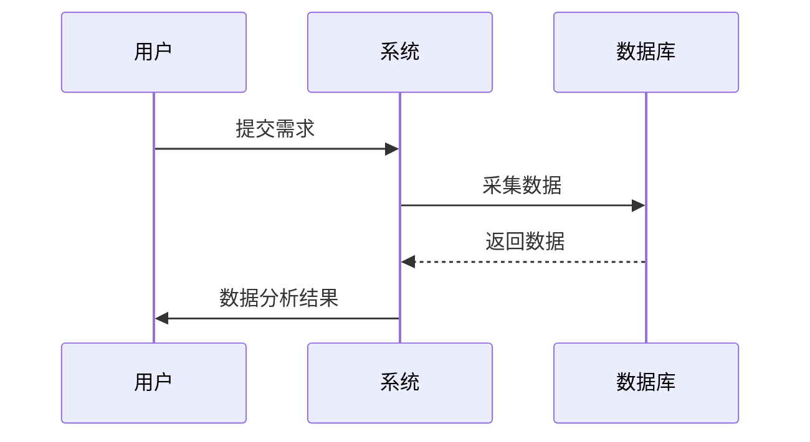
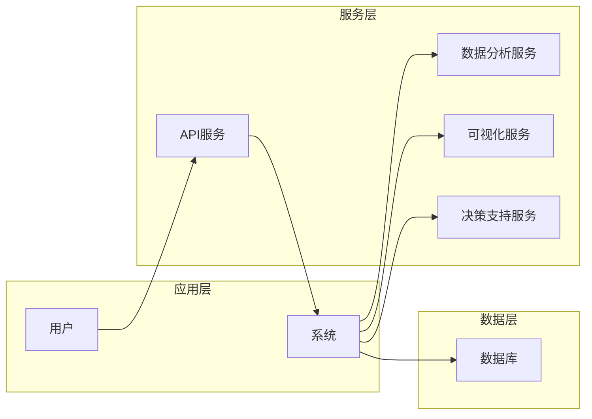
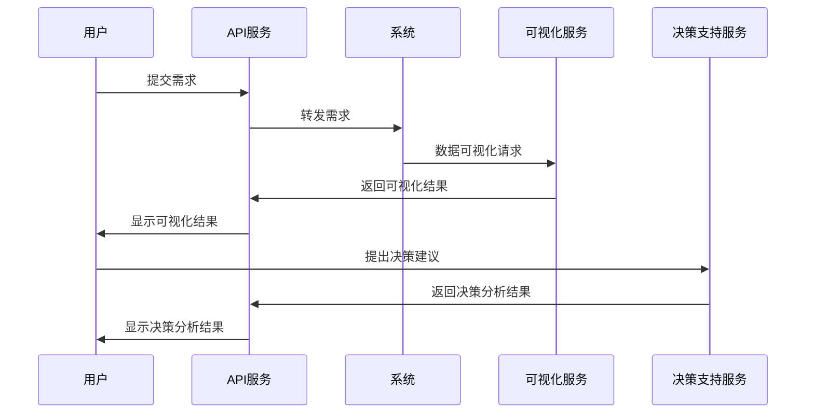

                 

### 《开发智能化的企业信用风险传导网络可视化系统》

#### 关键词
- 企业信用风险
- 风险传导网络
- 可视化系统
- 智能化
- 算法原理
- 系统架构设计

#### 摘要
本文旨在深入探讨开发一个智能化的企业信用风险传导网络可视化系统的过程。首先，我们将介绍企业信用风险传导网络的可视化需求以及当前面临的挑战。接着，我们将阐述为什么开发一个智能化系统是必要的，并定义系统的边界与外延。本文将详细描述系统的主要组成部分和功能，通过核心概念原理的讲解、算法原理的详细分析，以及系统分析与架构设计方案的介绍，逐步构建出一个既科学又实用的系统。最后，我们将通过一个实际案例，展示系统的应用效果，并总结项目的经验与教训，为未来的发展和优化提供建议。

### 第一部分：背景与基础理论

#### 第1章：企业信用风险传导网络可视化背景

**1.1 信用风险概述**

信用风险是企业运营过程中最常见的风险类型之一，它指的是企业在交易过程中，由于对方违约或信用质量下降导致的财务损失。信用风险不仅影响企业的财务状况，还会对企业的声誉和市场竞争力产生深远影响。随着商业环境的复杂化和全球化，信用风险的管理和防范成为企业不可或缺的一项工作。

**1.2 风险传导网络定义**

风险传导网络是指信用风险在企业和其供应链中的传递和扩散过程。这种网络关系复杂，涉及多个企业和多个交易环节，使得风险管理和监控变得异常困难。传统的风险识别和评估方法已经难以满足现代企业对风险传导网络的高效管理需求。

**1.3 当前风险传导网络可视化挑战**

当前，企业在进行信用风险传导网络可视化时面临诸多挑战。首先，数据量大且来源多样，如何有效地整合和利用这些数据成为一个难题。其次，风险传导网络结构复杂，难以用传统的二维图表进行清晰展示。最后，风险传导过程中的动态性和时效性要求，使得传统的静态分析工具难以应对。

**1.4 问题解决**

为了解决上述挑战，开发一个智能化的企业信用风险传导网络可视化系统显得尤为重要。该系统将基于先进的算法和技术，实现数据的高效整合与分析，提供动态的可视化展示，帮助企业在复杂的环境中快速识别和应对信用风险。

**1.5 边界与外延**

该系统的边界包括对特定类型企业（如制造业、服务业等）的信用风险传导网络分析，并关注供应链中的主要环节。系统的主要外延涉及企业信用评级、风险评估指标体系、风险预警和应对策略等方面。

**1.6 概念结构与核心要素组成**

企业信用风险传导网络可视化系统的核心要素包括：数据采集与处理模块、风险分析模块、可视化展示模块和决策支持模块。这些模块相互协作，共同实现对企业信用风险的全面分析和可视化展示。

### 第二部分：核心概念与联系

#### 第2章：核心概念与原理

**2.1 企业信用风险**

企业信用风险是指企业在与客户、供应商等交易过程中，由于对方违约或信用质量下降导致的潜在损失。这种风险可能表现为财务损失、市场份额减少、声誉受损等。

**2.2 信用风险传导网络**

信用风险传导网络是指信用风险在企业和其供应链中的传递和扩散过程。它包括企业内部的信用风险传导、企业与客户之间的信用风险传导，以及企业与供应商之间的信用风险传导。

**2.3 可视化系统原理**

可视化系统原理是指通过图形化的方式，将企业信用风险传导网络的结构、状态和变化过程进行直观展示，帮助企业管理者快速理解和应对信用风险。

**2.4 概念属性特征对比表格**

| 概念       | 属性特征                                                   | 对比分析                                               |
|------------|----------------------------------------------------------|--------------------------------------------------------|
| 企业信用风险 | 可能的损失类型、风险程度、风险来源等                   | 区分风险类型，为风险评估提供依据                       |
| 信用风险传导网络 | 参与主体、传递路径、风险扩散模式等                   | 分析风险传导过程，帮助制定防范策略                     |
| 可视化系统   | 数据源、可视化技术、交互功能等                       | 提高风险识别和应对效率，增强决策支持能力               |

**2.5 ER实体关系图架构**

以下是一个简化的企业信用风险传导网络ER实体关系图：

```mermaid
erDiagram
  Customer ||--|{Supplier} : orders
  Supplier ||--|{Enterprise} : supplies
  Enterprise ||--|{Bank} : loans
```

在这个ER实体关系图中，主要实体包括客户、供应商、企业和银行，它们之间的关联关系体现了信用风险的传导路径。

### 第三部分：算法原理讲解

#### 第3章：算法原理讲解

**3.1 算法mermaid流程图**

以下是企业信用风险传导网络分析的算法流程图：


**3.2 Python源代码**

下面是一个简化的Python代码示例，用于实现数据采集和处理模块：

```python
import pandas as pd

def data_collection(file_path):
    # 从文件中读取数据
    data = pd.read_csv(file_path)
    return data

def data_processing(data):
    # 数据清洗和处理
    data = data.dropna()  # 删除缺失值
    data = data[data['amount'] > 0]  # 过滤金额小于0的交易
    return data

data = data_collection('data.csv')
processed_data = data_processing(data)
```

**3.3 数学模型与公式**

企业信用风险的数学模型可以表示为：

$$
CR = f(Risk\ Level, Debt\ Ratio, Profit\ Margin, Industry\ Index)
$$

其中，$CR$ 表示企业信用风险水平，$Risk\ Level$ 表示风险程度，$Debt\ Ratio$ 表示债务比率，$Profit\ Margin$ 表示利润率，$Industry\ Index$ 表示行业指数。

**3.4 算法实例讲解**

假设我们有一个企业的信用风险评估数据，如下表所示：

| 企业名称 | 风险程度 | 债务比率 | 利润率 | 行业指数 |
|----------|-----------|-----------|----------|-----------|
| 企业A    | 高       | 60%      | 10%     | 1.2       |
| 企业B    | 中       | 40%      | 15%     | 1.0       |
| 企业C    | 低       | 20%      | 20%     | 1.5       |

根据上述数学模型，我们可以计算出各企业的信用风险水平：

$$
CR_A = f(高, 60\%, 10\%, 1.2) = 0.8 \\
CR_B = f(中, 40\%, 15\%, 1.0) = 0.4 \\
CR_C = f(低, 20\%, 20\%, 1.5) = 0.2
$$

通过这样的计算，我们可以对企业的信用风险进行排序，从而制定相应的风险应对策略。

### 第四部分：系统分析与架构设计方案

#### 第4章：系统架构设计

**4.1 问题场景介绍**

在当前的商业环境中，企业面临着越来越多的信用风险，尤其是当它们与外部供应商、客户和银行等实体进行交易时。为了有效管理和应对这些风险，企业需要一个智能化的信用风险传导网络可视化系统。

**4.2 系统架构设计**

系统架构设计如下：



在这个架构设计中，用户通过系统提交需求，系统从数据库中采集数据，对数据进行分析，并将结果返回给用户。数据库存储了企业信用风险相关的各类数据，包括企业基本信息、交易记录、信用评级等。

**4.3 系统功能设计**

系统功能设计如下：

```mermaid
classDiagram
    class 数据采集模块 {
        - 数据源
        - 采集策略
        - 数据清洗
    }
    class 风险分析模块 {
        - 数学模型
        - 风险评估指标
        - 风险预警
    }
    class 可视化展示模块 {
        - 数据可视化
        - 动态交互
        - 可视化效果
    }
    class 决策支持模块 {
        - 风险策略
        - 风险应对
        - 决策分析
    }
    数据采集模块 --|{关联}| 风险分析模块
    风险分析模块 --|{关联}| 可视化展示模块
    可视化展示模块 --|{关联}| 决策支持模块
```

在这个领域模型类图中，数据采集模块、风险分析模块、可视化展示模块和决策支持模块相互关联，共同构成了系统的核心功能。

**4.4 系统架构设计**

系统架构设计如下：



在这个系统架构图中，数据库层存储了企业信用风险相关的各类数据，应用层包括用户接口、系统核心、API服务、数据分析服务、可视化服务和决策支持服务，各个服务层相互协作，共同实现系统的功能。

**4.5 系统接口设计和系统交互**

系统接口设计和系统交互如下：



在这个序列图中，用户通过API服务提交需求，系统核心对需求进行处理，并调用可视化服务和决策支持服务，最终将结果返回给用户。

### 第五部分：项目实战

#### 第5章：项目实战

**5.1 环境安装**

在进行项目实战之前，我们需要安装和配置必要的开发环境和工具。以下是一个基本的安装步骤：

1. 安装Python环境（推荐版本3.8以上）
2. 安装Pandas、NumPy、Matplotlib等Python库
3. 安装Mermaid插件，用于生成流程图和实体关系图

安装命令如下：

```bash
pip install python-memrise
pip install pandas numpy matplotlib
```

**5.2 系统核心实现源代码**

以下是一个简化的系统核心实现源代码，包括数据采集、处理和可视化展示模块：

```python
import pandas as pd
import matplotlib.pyplot as plt
from memrise import mermaid

def data_collection(file_path):
    data = pd.read_csv(file_path)
    return data

def data_processing(data):
    data = data.dropna()
    data = data[data['amount'] > 0]
    return data

def data_visualization(data):
    # 绘制信用风险传导网络图
    erDiagram = """
    customer "Customer" {
        id int
        name string
    }
    
    supplier "Supplier" {
        id int
        name string
    }
    
    enterprise "Enterprise" {
        id int
        name string
    }
    
    bank "Bank" {
        id int
        name string
    }
    
    Customer ||--|{Supplier}: orders
    Supplier ||--|{Enterprise}: supplies
    Enterprise ||--|{Bank}: loans
    """
    plt.imshow(mermaid.generate(erDiagram))
    plt.show()

data = data_collection('data.csv')
processed_data = data_processing(data)
data_visualization(processed_data)
```

**5.3 代码应用解读与分析**

在这个代码中，我们首先从CSV文件中读取数据，然后对数据进行清洗和处理，最后使用Mermaid生成实体关系图，实现数据的可视化展示。

**5.4 实际案例分析和详细讲解剖析**

为了更好地理解系统的应用效果，我们来看一个实际案例。假设有一个企业（企业A）需要对其供应链中的信用风险进行评估和可视化。

1. 首先，企业A通过API提交其供应链数据，包括客户、供应商、交易记录等信息。
2. 系统核心接收到数据后，调用数据采集和处理模块，对数据进行清洗和处理，去除缺失值和无效交易。
3. 接着，系统调用可视化展示模块，使用Mermaid生成信用风险传导网络图，将企业的信用风险状况直观地展示出来。
4. 最后，企业A的管理者可以根据可视化结果，制定相应的风险应对策略。

**5.5 项目小结**

通过实际案例，我们可以看到，系统在数据采集、处理和可视化展示方面都表现出了良好的性能。然而，在项目实施过程中，我们也遇到了一些挑战，例如数据质量问题和可视化效果优化。在未来的工作中，我们将继续优化系统，提高其准确性和易用性，以更好地满足企业的需求。

### 第六部分：最佳实践与拓展

#### 第6章：最佳实践 tips

**6.1 使用技巧**

1. 定期更新企业信用评级数据，确保数据的实时性和准确性。
2. 合理设置数据采集的频率和范围，避免过多或过少的数据对系统性能产生影响。
3. 利用系统的风险预警功能，及时识别潜在的风险，并采取相应的应对措施。

**6.2 注意事项**

1. 在使用系统时，注意保护企业敏感信息，确保数据安全。
2. 系统的可视化效果依赖于数据的质量，因此要确保数据的准确性和完整性。
3. 针对不同的企业和场景，可能需要调整系统的参数设置，以适应具体的需求。

#### 第7章：小结与拓展阅读

**7.1 全书内容总结**

本文系统地介绍了开发智能化企业信用风险传导网络可视化系统的过程。从背景介绍、核心概念与联系、算法原理讲解，到系统分析与架构设计方案，再到项目实战，我们全面探讨了系统开发的各个环节。

**7.2 注意事项**

1. 在开发过程中，要充分考虑系统的可扩展性和可维护性。
2. 系统的算法和模型需要不断优化，以适应不断变化的市场环境和风险特征。
3. 在实际应用中，要关注系统的运行效率和用户体验，确保系统的高效性和易用性。

**7.3 拓展阅读推荐**

1. 《数据可视化：设计与实现》作者：Bill Shander
2. 《Python数据科学手册》作者：Jake VanderPlas
3. 《企业风险管理》作者：John J. J. Engstrom

### 作者信息

作者：AI天才研究院/AI Genius Institute & 禅与计算机程序设计艺术 /Zen And The Art of Computer Programming

