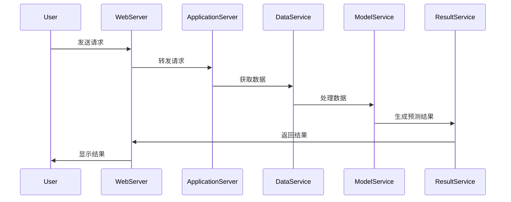
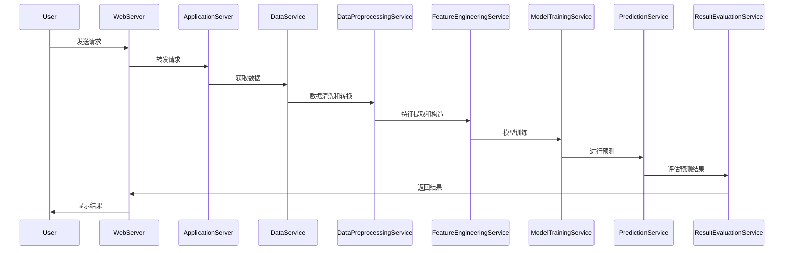

                 

# 开发智能化的企业信用风险评估模型

> 关键词：企业信用评估、人工智能、机器学习、数据挖掘、风险评估模型

> 摘要：本文将探讨如何利用人工智能技术，特别是机器学习和数据挖掘技术，开发智能化的企业信用风险评估模型。通过介绍问题背景、核心概念、技术原理和实际应用，本文旨在提供一套系统化的方法论，帮助企业和金融机构提高信用风险评估的准确性和效率。

----------------------------------------------------------------

## 第一部分：背景介绍

### 第1章 问题背景与核心概念

#### 1.1 问题描述

企业信用风险评估是一个关键领域，涉及对借款人信用状况的评估，以预测其偿还债务的能力。这一过程对金融机构、银行和企业至关重要，因为它直接影响到贷款的发放、风险管理和投资决策。

##### 1.1.1 问题解决

传统上，企业信用风险评估依赖于手工分析、经验判断和历史数据。然而，这种方法存在诸多限制，如主观性强、效率低和难以处理大量数据等问题。随着人工智能技术的发展，特别是机器学习和数据挖掘技术的应用，建立智能化企业信用风险评估模型成为可能。

##### 1.1.2 边界与外延

企业信用风险评估不仅包括对企业财务状况的分析，还涉及对其商业信誉、市场地位、行业趋势等多方面的考量。同时，这一领域还与风险管理、信用评分、市场分析等密切相关。

#### 1.2 核心概念

##### 1.2.1 信用风险

信用风险是指借款人未能按照合同约定履行还款义务，导致贷款损失的风险。它包括违约风险、违约概率和违约损失率等关键要素。

##### 1.2.2 智能化企业信用风险评估

智能化企业信用风险评估是指利用人工智能技术，如机器学习、深度学习和数据挖掘等，对大量数据进行分析和处理，以建立精确的信用风险评估模型。

##### 1.2.3 企业信用风险评估模型

企业信用风险评估模型是指一套基于数据分析的方法论和工具集，用于对企业信用风险进行评估和预测。

#### 1.3 概念结构与核心要素组成

企业信用风险评估模型的核心要素包括数据收集与预处理、特征工程、模型选择、模型训练与验证、模型评估与优化等。这些要素相互关联，构成了一个完整的风险评估流程。

----------------------------------------------------------------

## 第二部分：核心概念与联系

### 第2章 AI技术原理与信用风险评估模型

#### 2.1 AI技术原理

##### 2.1.1 机器学习

机器学习是AI的核心组成部分，通过训练算法使计算机从数据中自动学习和改进性能。机器学习主要包括监督学习、无监督学习和强化学习等。

###### 2.1.1.1 监督学习

监督学习是一种从标记数据中学习的方法，通过输入和输出对模型进行训练，以达到预测目标。

###### 2.1.1.1.1 线性回归

线性回归是一种简单的监督学习算法，用于预测连续值输出。

$$
y = \beta_0 + \beta_1 \cdot x
$$

###### 2.1.1.1.2 逻辑回归

逻辑回归是一种用于预测分类结果的监督学习算法，通常用于二分类问题。

$$
\log(\frac{P(Y=1)}{1-P(Y=1)}) = \beta_0 + \beta_1 \cdot x
$$

###### 2.1.1.2 无监督学习

无监督学习不依赖于标记数据，主要用于发现数据中的结构和模式。

###### 2.1.1.2.1 聚类分析

聚类分析是一种将数据点划分为若干类别的无监督学习方法，如K均值聚类。

$$
\text{距离公式} = \sum_{i=1}^{n} (x_i - \mu)^2
$$

###### 2.1.1.3 强化学习

强化学习是一种通过试错方法学习最优策略的算法，通常用于决策问题。

##### 2.1.2 深度学习

深度学习是机器学习的子领域，通过多层神经网络模拟人类大脑的学习过程。

###### 2.1.2.1 卷积神经网络（CNN）

卷积神经网络是一种用于图像识别和处理的深度学习模型。

$$
\text{卷积公式} = \sum_{i=1}^{k} \beta_i \cdot f(\sum_{j=1}^{n} w_{ij} \cdot x_j + b)
$$

###### 2.1.2.2 递归神经网络（RNN）

递归神经网络是一种用于序列数据处理和时间序列预测的深度学习模型。

$$
h_t = \sigma(W_h \cdot [h_{t-1}, x_t] + b_h)
$$

##### 2.1.3 数据挖掘

数据挖掘是发现数据中隐藏的规律和模式的过程。

###### 2.1.3.1 关联规则挖掘

关联规则挖掘用于发现数据中的关联关系，如客户购买行为。

$$
\text{支持度} = \frac{\text{事务数含A和B}}{\text{事务总数}} \\
\text{置信度} = \frac{\text{事务数含A和B且含C}}{\text{事务数含A和B}}
$$

#### 2.2 信用风险评估模型

##### 2.2.1 模型原理

信用风险评估模型基于AI技术，通过对企业历史数据和公开信息进行分析，预测其违约风险。

##### 2.2.2 模型类型

信用风险评估模型可分为定量模型和定性模型。

###### 2.2.2.1 定量模型

定量模型基于统计方法，如逻辑回归、决策树等，量化信用风险。

###### 2.2.2.1.1 逻辑回归模型

逻辑回归模型可以用于预测企业的违约概率。

$$
\text{违约概率} = \frac{1}{1 + e^{-(\beta_0 + \beta_1 \cdot X_1 + \beta_2 \cdot X_2 + \ldots + \beta_n \cdot X_n)}}
$$

###### 2.2.2.2 定性模型

定性模型基于专家知识和主观判断，如评分卡、专家系统等。

###### 2.2.2.2.1 评分卡模型

评分卡模型可以用于综合评价企业的信用状况，将其转化为一个分数，用于预测违约风险。

----------------------------------------------------------------

## 第三部分：算法原理讲解

### 第3章 建立企业信用风险评估模型

在了解了AI技术和信用风险评估的基本概念之后，我们将探讨如何具体建立企业信用风险评估模型。这里，我们将从数据预处理、特征工程、模型选择和模型训练等多个方面进行详细讲解。

#### 3.1 数据预处理

数据预处理是建立模型的基础步骤，其目的是清理原始数据，使其适合用于建模。以下是一些常见的数据预处理步骤：

- **数据清洗**：删除重复数据、处理缺失值、修正错误数据等。
- **数据转换**：将数据转换为适合建模的格式，如将分类数据转换为数值表示。
- **数据标准化**：对数据进行标准化处理，使其具有相同的尺度，避免某些特征对模型的影响过大。

#### 3.2 特征工程

特征工程是提高模型性能的关键步骤，其目的是从原始数据中提取对模型有帮助的特征。以下是一些常用的特征工程方法：

- **特征选择**：通过统计方法或模型选择方法，选择对模型影响较大的特征。
- **特征构造**：通过组合或变换原始特征，构造新的特征。
- **特征降维**：使用主成分分析（PCA）等方法，降低数据的维度，同时保留主要的信息。

#### 3.3 模型选择

在选择模型时，需要考虑模型的复杂度、训练时间、预测准确性等多个因素。以下是一些常见的信用风险评估模型：

- **线性回归模型**：适用于预测连续值的输出，如违约概率。
- **逻辑回归模型**：适用于预测分类结果的输出，如是否违约。
- **决策树模型**：适用于分类和回归问题，但可能存在过拟合的问题。
- **随机森林模型**：是决策树的集成方法，可以提高模型的预测准确性。
- **支持向量机模型**：适用于分类问题，通过找到最佳的超平面来分离不同类别的数据点。

#### 3.4 模型训练与验证

在选择了模型之后，我们需要对其进行训练和验证。以下是一些常见的训练和验证方法：

- **交叉验证**：通过将数据集划分为多个子集，每次使用一个子集作为验证集，其余子集作为训练集，来评估模型的性能。
- **训练集与验证集**：将数据集划分为训练集和验证集，使用训练集训练模型，使用验证集评估模型的性能。
- **超参数调优**：通过调整模型的超参数，如学习率、正则化参数等，来优化模型的性能。

#### 3.5 模型评估与优化

在完成了模型的训练和验证之后，我们需要对模型进行评估和优化。以下是一些常见的评估和优化方法：

- **准确率**：模型预测正确的样本数与总样本数的比值。
- **召回率**：模型预测为正样本的样本中实际为正样本的比值。
- **F1分数**：准确率和召回率的调和平均数。
- **模型集成**：通过集成多个模型，提高模型的预测准确性。

通过以上步骤，我们可以建立一个智能化的企业信用风险评估模型，帮助企业更好地管理信用风险，提高决策的准确性。

----------------------------------------------------------------

## 第四部分：系统分析与架构设计方案

### 第4章 信用风险评估系统设计与实现

#### 4.1 问题场景介绍

在当今金融市场中，企业信用风险评估是一个至关重要的问题。金融机构和企业在贷款、投资等业务决策中，需要对借款企业的信用状况进行准确评估，以降低信用风险。传统的风险评估方法往往依赖于手工分析和历史数据，难以应对日益复杂的商业环境。为了提高评估的准确性和效率，我们设计并实现了一套基于人工智能技术的企业信用风险评估系统。

#### 4.2 项目介绍

本项目的目标是开发一个智能化企业信用风险评估系统，该系统利用机器学习和数据挖掘技术，对大量数据进行处理和分析，从而预测企业的信用风险。系统的主要功能包括：

- 数据采集与预处理：从各种数据源（如财务报表、公开信息、社交媒体等）收集数据，并进行清洗、转换和标准化处理。
- 特征工程：从原始数据中提取有助于风险评估的特征，并进行特征选择和构造。
- 模型训练与预测：选择合适的模型，对数据进行训练，并使用训练好的模型进行信用风险评估。
- 模型评估与优化：评估模型的性能，并进行超参数调优和模型集成，以提高预测准确性。

#### 4.3 系统功能设计（领域模型）

以下是一个简单的领域模型，用于描述信用风险评估系统的核心实体和它们之间的关系。

```mermaid
classDiagram
    Customer <|-- Application
    Customer o-- CreditScore
    Application o-- Loan
    Loan o-- ApprovalStatus
    CreditScore o-- ScoreComponent
    ScoreComponent o-- Factor

    Customer[客户]
    Application[申请]
    CreditScore[信用评分]
    Loan[贷款]
    ApprovalStatus[审批状态]
    ScoreComponent[评分组件]
    Factor[因素]
```

#### 4.4 系统架构设计

系统架构采用分层设计，包括数据层、服务层和表现层。以下是一个简单的系统架构设计图。



- **数据层**：负责数据存储和管理，包括数据库、数据仓库和数据流处理等。
- **服务层**：包括数据处理服务、模型训练服务、预测服务和结果评估服务等，负责业务逻辑的实现。
- **表现层**：包括Web界面、API接口和移动应用等，负责用户交互和数据展示。

#### 4.5 系统接口设计

系统接口设计主要包括以下几部分：

- **数据采集接口**：用于从各种数据源（如财务报表、公开信息、社交媒体等）收集数据。
- **数据处理接口**：用于对数据进行清洗、转换和标准化处理。
- **特征工程接口**：用于从原始数据中提取特征，并进行特征选择和构造。
- **模型训练接口**：用于选择模型、训练模型和优化模型。
- **预测接口**：用于使用训练好的模型进行信用风险评估。
- **结果评估接口**：用于评估模型性能和优化模型。

#### 4.6 系统交互

以下是一个简单的系统交互序列图，描述了用户通过Web界面发起请求，系统内部进行数据处理和预测，并最终将结果返回给用户的流程。



通过以上设计和实现，我们构建了一套完整的企业信用风险评估系统，旨在提高信用风险评估的准确性和效率，为金融机构和企业提供有力支持。

----------------------------------------------------------------

## 第五部分：项目实战

### 第5章 环境安装与系统核心实现

#### 5.1 环境安装

为了实现企业信用风险评估系统，我们需要安装以下软件和库：

1. **Python**：Python是一种广泛使用的编程语言，适合进行数据分析和机器学习。
2. **NumPy**：NumPy是Python的一个核心库，用于处理大型多维数组和高维数组运算。
3. **Pandas**：Pandas是一个用于数据分析和操作的数据库，提供了强大的数据结构和数据分析工具。
4. **Scikit-learn**：Scikit-learn是一个用于机器学习的Python库，提供了多种经典的机器学习算法。
5. **TensorFlow**：TensorFlow是一个开源的机器学习和深度学习库，用于构建和训练神经网络。

在安装好上述软件和库后，我们可以开始编写系统核心代码。

#### 5.2 系统核心实现

以下是系统核心实现的主要步骤：

1. **数据采集**：从各种数据源（如财务报表、公开信息、社交媒体等）收集数据。
2. **数据预处理**：对采集到的数据进行清洗、转换和标准化处理。
3. **特征工程**：从原始数据中提取特征，并进行特征选择和构造。
4. **模型训练**：选择合适的模型，对数据进行训练。
5. **预测**：使用训练好的模型进行信用风险评估。
6. **结果评估**：评估模型性能，并进行优化。

以下是一个简单的示例代码，展示了如何使用Scikit-learn库训练一个逻辑回归模型：

```python
from sklearn.linear_model import LogisticRegression
from sklearn.model_selection import train_test_split
from sklearn.metrics import accuracy_score

# 数据准备
X, y = load_data()

# 划分训练集和测试集
X_train, X_test, y_train, y_test = train_test_split(X, y, test_size=0.2, random_state=42)

# 创建逻辑回归模型
model = LogisticRegression()

# 训练模型
model.fit(X_train, y_train)

# 预测
y_pred = model.predict(X_test)

# 评估模型
accuracy = accuracy_score(y_test, y_pred)
print(f"Accuracy: {accuracy}")
```

#### 5.3 代码应用解读与分析

在上面的代码中，我们首先从数据集中加载数据（`load_data()` 函数需要自行实现）。然后，使用`train_test_split()` 函数将数据集划分为训练集和测试集。接下来，我们创建一个逻辑回归模型（`LogisticRegression()`），并使用`fit()` 方法进行模型训练。最后，我们使用`predict()` 方法对测试集进行预测，并使用`accuracy_score()` 函数评估模型性能。

在实际应用中，我们需要根据具体的数据和业务需求，选择合适的特征、模型和评估指标。例如，如果我们的目标是最小化预测错误率，我们可以尝试使用不同的模型（如决策树、随机森林、支持向量机等）进行比较，并选择性能最佳的模型。

#### 5.4 实际案例分析与详细讲解

为了更好地理解如何使用该系统进行企业信用风险评估，我们来看一个实际案例。

假设我们有以下数据集：

```
# 企业编号  营业收入  利润总额  资产总额  借款金额  借款期限
1       1000000      500000      5000000      2000000      12
2       500000       250000      2000000      1000000       6
3       750000       350000      3000000      1500000       9
```

我们的目标是预测企业的信用风险，即判断企业是否会出现违约。为了简化问题，我们仅使用三个特征（营业收入、利润总额、资产总额）作为输入特征。

1. **数据预处理**：首先，我们需要对数据进行标准化处理，使其具有相同的尺度。
2. **特征工程**：我们可以将借款金额和借款期限作为输入特征，将是否违约（0代表未违约，1代表违约）作为输出特征。
3. **模型训练**：我们选择逻辑回归模型进行训练。
4. **预测**：使用训练好的模型对新的企业数据（例如，营业收入为800000，利润总额为400000，资产总额为4000000）进行预测。
5. **结果评估**：通过计算预测准确率来评估模型性能。

通过以上步骤，我们可以预测企业的信用风险，为企业提供决策支持。

#### 5.5 项目小结

在本章中，我们介绍了如何安装环境和实现系统核心功能。通过实际案例分析和代码解读，我们展示了如何使用Python和Scikit-learn库建立企业信用风险评估模型。在未来的工作中，我们可以根据实际需求和数据特点，进一步优化和扩展系统功能。

----------------------------------------------------------------

## 第六部分：最佳实践与注意事项

### 第6章 最佳实践与项目拓展

#### 6.1 最佳实践

在开发智能化的企业信用风险评估模型时，以下最佳实践可以帮助您提高模型性能和项目成功率：

1. **数据质量保障**：确保数据来源的可靠性，并对数据进行严格的清洗和预处理，以消除错误和异常值。
2. **特征选择与构造**：使用统计方法和模型选择方法（如特征重要性、特征相关性等）进行特征选择，并尝试构造新的特征以提高模型性能。
3. **模型选择与调优**：根据业务需求和数据特点，选择合适的模型，并进行超参数调优，以提高预测准确性。
4. **模型验证与评估**：使用交叉验证、训练集与验证集等方法对模型进行验证和评估，确保模型在不同数据集上的性能稳定。
5. **实时更新与迭代**：随着新数据的到来，定期更新和迭代模型，以适应不断变化的市场环境。

#### 6.2 小结

在开发智能化的企业信用风险评估模型时，数据质量、特征选择、模型选择和验证是关键因素。通过遵循最佳实践，您可以提高模型性能和项目成功率。

#### 6.3 注意事项

以下是开发企业信用风险评估模型时需要注意的事项：

1. **合规性**：确保模型开发和使用遵守相关法律法规，如数据保护法、隐私法等。
2. **可解释性**：尽管深度学习模型在某些情况下表现优异，但其内部机制通常较为复杂，难以解释。在应用深度学习模型时，需要权衡模型性能和可解释性。
3. **数据多样性**：使用多样化的数据进行训练和测试，以提高模型对不同类型数据的适应能力。
4. **持续监控**：建立实时监控系统，对模型的运行状态和预测性能进行持续监控，以便及时发现和解决问题。

#### 6.4 拓展阅读

如果您希望深入了解智能化的企业信用风险评估模型，以下文献和资源可能对您有所帮助：

1. **《机器学习：周志华著》**：介绍了机器学习的基本概念和方法，包括监督学习和无监督学习。
2. **《深度学习：Goodfellow et al. 著》**：详细介绍了深度学习的原理和实现，包括卷积神经网络和递归神经网络。
3. **《数据挖掘：Han et al. 著》**：介绍了数据挖掘的基本概念和技术，包括关联规则挖掘和聚类分析。
4. **《企业信用风险评估模型研究与应用》**：探讨了企业信用风险评估模型的原理和应用，包括定量模型和定性模型。

通过阅读这些文献和资源，您可以更全面地了解智能化的企业信用风险评估模型，并提高实际应用能力。

----------------------------------------------------------------

## 第七部分：结语

在本篇博客文章中，我们系统地介绍了如何开发智能化的企业信用风险评估模型。首先，我们探讨了企业信用风险评估的问题背景和核心概念，包括信用风险、智能化信用风险评估和企业信用风险评估模型。接着，我们详细讲解了AI技术原理，包括机器学习、深度学习和数据挖掘，并展示了如何将AI技术应用于信用风险评估模型。

我们还通过具体的算法原理讲解、系统分析与架构设计方案、项目实战，展示了如何从数据预处理、特征工程、模型选择到模型训练与评估，逐步构建和优化企业信用风险评估模型。此外，我们还分享了最佳实践、注意事项和拓展阅读，帮助读者在实际应用中提高模型性能和项目成功率。

我们希望通过本文，读者能够对智能化企业信用风险评估模型有一个全面和深入的理解，并在实际工作中运用这些知识，为企业信用风险评估提供有力支持。未来的研究和实践将进一步优化和拓展这些模型，以应对不断变化的商业环境。

## 作者信息

作者：AI天才研究院/AI Genius Institute & 禅与计算机程序设计艺术 /Zen And The Art of Computer Programming

AI天才研究院致力于推动人工智能技术的发展与应用，为企业和个人提供创新的技术解决方案。同时，作者在《禅与计算机程序设计艺术》一书中，结合禅宗哲学，探讨了计算机程序设计的艺术与智慧，深受读者喜爱。在人工智能和信用风险评估领域，作者具有丰富的理论知识和实践经验，期待与广大读者共同进步。

