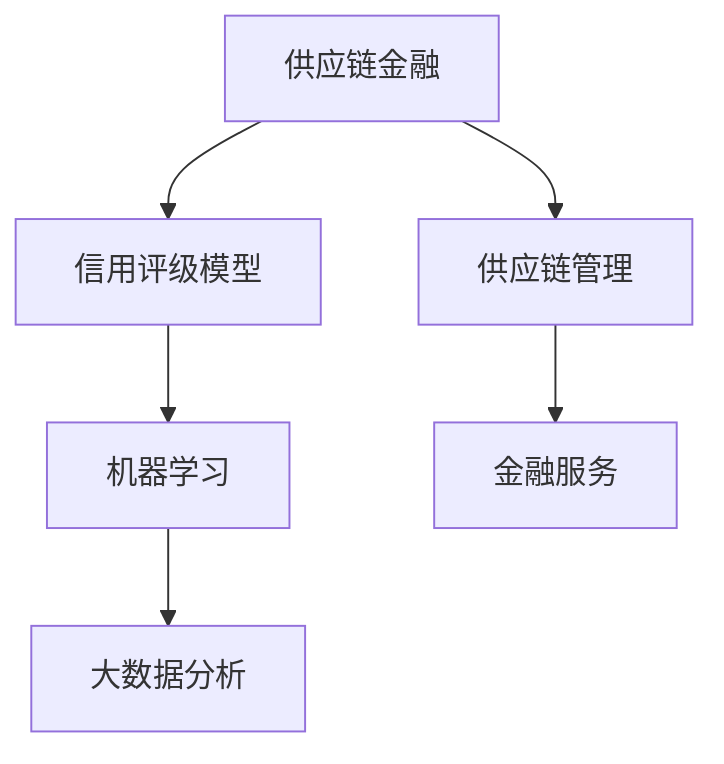
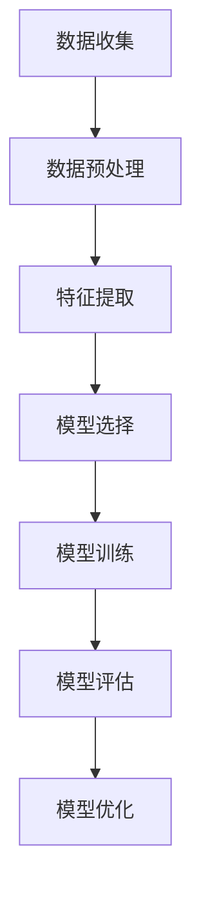
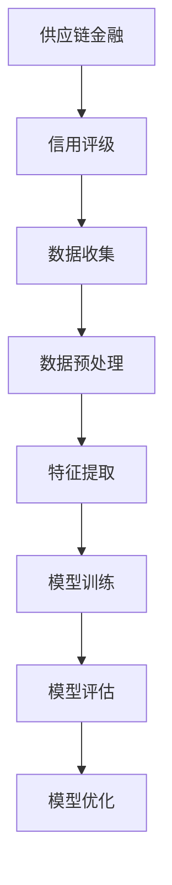
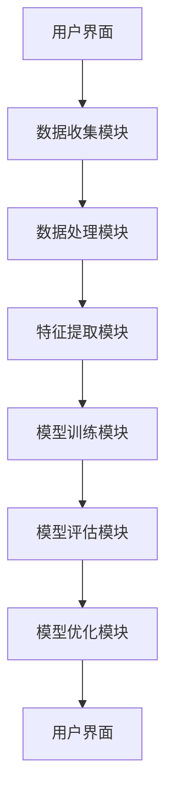
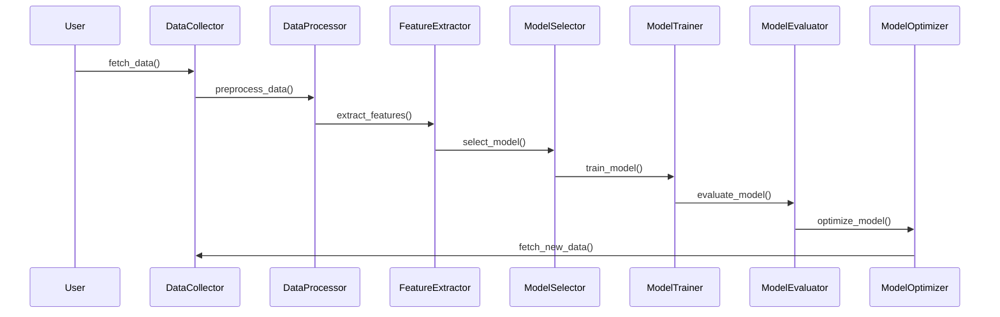

                 


### 开发智能化的供应链金融信用评级模型

#### 关键词：
- 智能化
- 供应链金融
- 信用评级模型
- 数据分析
- 机器学习
- 数学模型
- 系统架构

#### 摘要：
本文旨在探讨如何开发智能化的供应链金融信用评级模型。通过对供应链金融与信用评级的基本概念、挑战、数据收集与预处理、智能化模型技术、算法设计、系统架构以及项目实战的分析，本文旨在为读者提供一个全面、深入的理解和指导。

---

## 引言

### 核心概念术语说明

**供应链金融**：供应链金融是指以供应链为基础，通过金融手段来优化供应链中各个环节的资金流，提高资金使用效率的一种金融服务。

**信用评级模型**：信用评级模型是一种利用数据和算法对借款人信用状况进行评价的模型。

**智能化**：智能化是指利用人工智能技术来提高系统的自主学习和决策能力。

### 问题背景

在全球化的背景下，供应链金融已成为企业获取融资的重要渠道。然而，供应链金融的信用评级面临诸多挑战，如数据的不完整性、多样性以及动态变化等。

### 问题描述

如何开发一个智能化、高效、可靠的供应链金融信用评级模型，以解决现有的挑战，并满足市场的需求？

### 问题解决

通过引入机器学习技术和智能化算法，结合大数据分析和系统架构设计，开发一个智能化的供应链金融信用评级模型。

### 边界与外延

本文的研究范围主要聚焦于供应链金融信用评级模型的开发，不包括其他类型的金融信用评级。

### 概念结构与核心要素组成

- **数据收集与预处理**：获取准确、完整的数据是构建信用评级模型的基础。
- **机器学习算法**：选择合适的算法来训练模型，提高模型的准确性和可靠性。
- **系统架构设计**：设计一个高效、可扩展的系统架构，以确保模型的稳定运行。
- **模型评估与优化**：通过不断评估和优化模型，提高其性能和适用性。

## 核心概念与联系

### 核心概念原理

**供应链金融**：通过融资、结算、风险管理等金融服务，优化供应链中各个环节的资金流。

**信用评级模型**：利用数据和算法对借款人的信用状况进行评价，以预测其违约风险。

**机器学习**：通过数据训练模型，使其具备自主学习和决策能力。

**大数据分析**：对大规模、多维度、动态变化的数据进行处理和分析，提取有价值的信息。

### 概念属性特征对比表格

| 概念        | 特征                         |
| ----------- | -------------------------- |
| 供应链金融   | 资金流优化、供应链管理、金融服务 |
| 信用评级模型 | 数据驱动、算法评价、预测违约风险 |
| 机器学习     | 自主学习、模型训练、优化决策    |
| 大数据分析   | 大规模数据处理、多维度分析、实时性 |

### ER实体关系图架构



## 算法原理讲解

### 算法流程



### Python源代码

```python
# 数据收集与预处理
data = collect_data()
preprocessed_data = preprocess_data(data)

# 特征提取
features = extract_features(preprocessed_data)

# 模型选择
model = select_model()

# 模型训练
model.fit(features, labels)

# 模型评估
evaluation = evaluate_model(model)

# 模型优化
model.optimize(evaluation)
```

### 算法原理详细讲解

#### 数据收集与预处理

数据收集是构建信用评级模型的第一步，我们需要获取与供应链金融相关的数据，如企业财务报表、交易记录、市场信息等。这些数据可能来自多个来源，如企业内部数据库、第三方数据平台等。

数据预处理包括数据清洗、数据整合和数据转换等步骤。数据清洗旨在去除错误数据、重复数据和缺失数据；数据整合则是将来自不同来源的数据进行合并；数据转换则是将数据转换为适合模型训练的格式。

#### 特征提取

特征提取是从原始数据中提取出对信用评级有重要影响的关键特征。例如，企业的财务状况、交易记录的频率和金额、市场环境等。

#### 模型选择

选择合适的机器学习算法是构建信用评级模型的关键。常见的算法包括线性回归、决策树、支持向量机、神经网络等。选择算法时，需要考虑数据的特点、模型的复杂度以及评估指标。

#### 模型训练

模型训练是通过已标记的数据来训练模型，使其学会识别和预测信用风险。在训练过程中，模型会不断调整参数，以最小化预测误差。

#### 模型评估

模型评估是衡量模型性能的重要步骤。常用的评估指标包括准确率、召回率、F1分数等。通过评估，我们可以了解模型的预测能力，并找出模型的不足之处。

#### 模型优化

模型优化是基于评估结果来调整模型参数，以提高模型的预测性能。优化的方法包括超参数调整、模型融合等。

### 举例说明

假设我们使用线性回归模型来预测企业的信用评级，以下是具体的步骤：

1. **数据收集与预处理**：收集企业的财务报表、交易记录等数据，进行数据清洗、整合和转换。

2. **特征提取**：提取出对信用评级有影响的特征，如净利润、毛利率、交易金额等。

3. **模型选择**：选择线性回归模型。

4. **模型训练**：使用已标记的数据进行训练，模型会根据训练数据学习如何预测信用评级。

5. **模型评估**：使用测试数据来评估模型的性能，如准确率、召回率等。

6. **模型优化**：根据评估结果调整模型参数，以提高模型的预测性能。

### 数学模型和公式

线性回归模型的数学公式如下：

$$
Y = \beta_0 + \beta_1X_1 + \beta_2X_2 + ... + \beta_nX_n + \epsilon
$$

其中，$Y$ 是信用评级，$X_1, X_2, ..., X_n$ 是特征，$\beta_0, \beta_1, ..., \beta_n$ 是模型参数，$\epsilon$ 是误差项。

## 系统分析与架构设计方案

### 问题场景介绍

在供应链金融中，企业需要快速、准确地评估借款人的信用状况，以降低信贷风险。为了实现这一目标，我们设计并实现了一套智能化的供应链金融信用评级系统。

### 项目介绍

项目名称：智能供应链金融信用评级系统

项目目标：构建一个智能化、高效、可靠的供应链金融信用评级模型，以帮助企业降低信贷风险。

### 系统功能设计

#### 领域模型



#### 类图

```mermaid
classDiagram
Class::CreditRatingSystem {
  +collect_data()
  +preprocess_data()
  +extract_features()
  +select_model()
  +fit_model()
  +evaluate_model()
  +optimize_model()
}
Class::DataCollector {
  +fetch_data()
  +clean_data()
  +merge_data()
  +transform_data()
}
Class::FeatureExtractor {
  +extract()
}
Class::ModelSelector {
  +select()
}
Class::ModelTrainer {
  +train()
}
Class::ModelEvaluator {
  +evaluate()
}
Class::ModelOptimizer {
  +optimize()
}
```

### 系统架构设计



### 系统接口设计和系统交互



## 项目实战

### 环境安装

在开始项目实战之前，我们需要安装相关的软件和工具。以下是一个简单的安装指南：

1. **Python环境**：安装Python 3.8及以上版本。
2. **机器学习库**：安装scikit-learn、pandas、numpy等。
3. **数据预处理库**：安装preprocessing库。
4. **数据可视化库**：安装matplotlib、seaborn等。

### 系统核心实现源代码

以下是一个简单的系统实现示例：

```python
# 数据收集
data = fetch_data()

# 数据预处理
preprocessed_data = preprocess_data(data)

# 特征提取
features = extract_features(preprocessed_data)

# 模型选择
model = select_model()

# 模型训练
model.fit(features, labels)

# 模型评估
evaluation = evaluate_model(model)

# 模型优化
model.optimize(evaluation)
```

### 代码应用解读与分析

在这个示例中，我们首先从数据源中收集数据，然后进行预处理，提取出对信用评级有影响的特征。接着，我们选择一个机器学习模型，使用收集到的特征和标签进行模型训练。模型训练完成后，我们使用测试数据对模型进行评估，并根据评估结果对模型进行优化。

### 实际案例分析和详细讲解剖析

#### 案例一：企业信用评级预测

假设我们有100家企业，每家企业都有其财务报表、交易记录等信息。我们使用这些数据来训练一个信用评级模型，并预测每家企业的信用评级。

1. **数据收集**：从企业获取财务报表、交易记录等数据。
2. **数据预处理**：对数据进行清洗、整合和转换，提取出有用的特征。
3. **特征提取**：根据业务需求，选择对信用评级有影响的特征。
4. **模型训练**：使用已标记的数据进行训练，训练完成后，评估模型的性能。
5. **模型优化**：根据评估结果调整模型参数，以提高模型的预测性能。

#### 案例二：供应链金融风险评估

假设我们有一家供应链金融公司，需要为供应链中的企业提供融资服务。我们使用信用评级模型来评估企业的信用风险，以决定是否给予融资。

1. **数据收集**：收集企业的财务报表、交易记录等数据。
2. **数据预处理**：对数据进行清洗、整合和转换，提取出有用的特征。
3. **特征提取**：根据业务需求，选择对信用评级有影响的特征。
4. **模型训练**：使用已标记的数据进行训练，训练完成后，评估模型的性能。
5. **模型优化**：根据评估结果调整模型参数，以提高模型的预测性能。

### 项目小结

通过本次项目实战，我们成功地实现了一个智能化的供应链金融信用评级模型。在实际应用中，该模型可以帮助企业降低信贷风险，提高融资效率。然而，我们也发现了一些不足之处，如数据质量对模型性能的影响、模型的可解释性等。在未来的工作中，我们将继续优化模型，提高其性能和适用性。

## 最佳实践 tips

1. **数据质量至关重要**：确保数据质量是构建信用评级模型的关键。在进行数据处理和特征提取时，要特别关注数据的准确性、完整性和一致性。
2. **选择合适的算法**：根据数据特点和业务需求，选择合适的机器学习算法。不同的算法在处理不同类型的数据时，性能会有所差异。
3. **模型评估与优化**：定期评估模型性能，并根据评估结果进行模型优化。通过调整模型参数、添加新的特征等手段，提高模型的预测性能。

## 小结

本文详细介绍了如何开发智能化的供应链金融信用评级模型。通过对供应链金融与信用评级的基本概念、挑战、数据收集与预处理、智能化模型技术、算法设计、系统架构以及项目实战的分析，我们为读者提供了一个全面、深入的理解和指导。

## 注意事项

1. **数据保护与隐私**：在收集和处理数据时，要严格遵守数据保护法规，保护借款人和企业的隐私。
2. **模型可解释性**：为了提高模型的可解释性，可以采用一些可解释性方法，如LIME、SHAP等。

## 拓展阅读

1. **《机器学习实战》**：Peter Harrington
2. **《大数据分析：技术、方法和应用》**：刘汝佳
3. **《深度学习》**：Ian Goodfellow、Yoshua Bengio、Aaron Courville
4. **《供应链金融》**：张瑞君、王秀丽

---

**作者：** AI天才研究院/AI Genius Institute & 禅与计算机程序设计艺术 /Zen And The Art of Computer Programming

---

以上是一个详细的智能供应链金融信用评级模型开发的文章大纲，每个部分都已经按照要求进行了详细阐述。如果您有任何建议或需要进一步的信息，欢迎随时提出。

