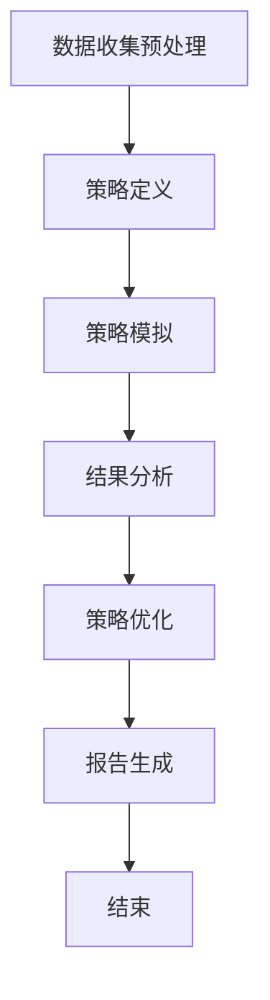
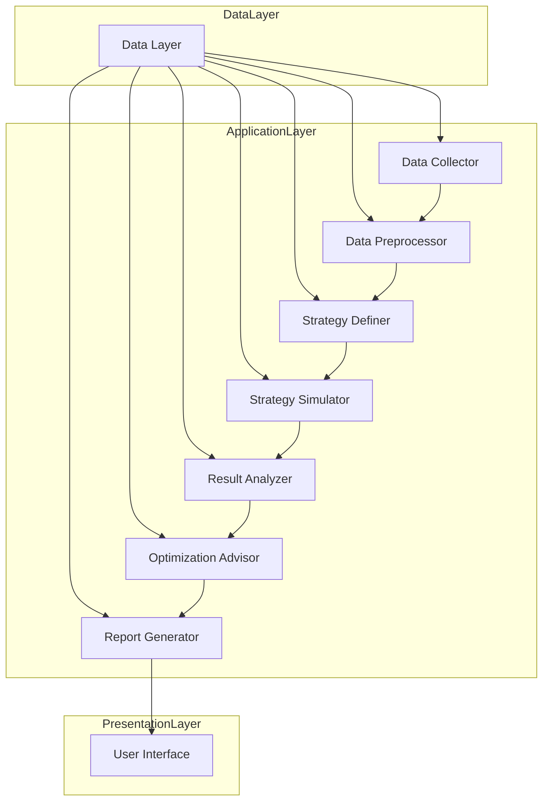
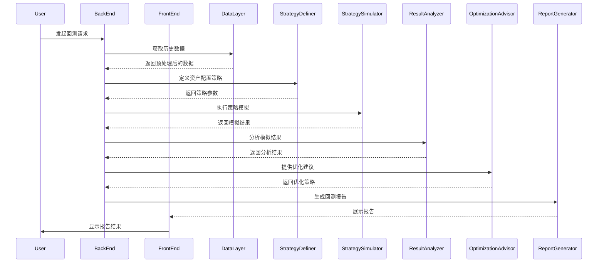

                 

### 引言与背景

#### 问题背景

投资市场是一个复杂且动态变化的系统，其中包含了无数的不确定性和变数。在这样的大背景下，资产配置成为投资者关注的焦点。资产配置是指根据投资者的风险偏好和投资目标，将资金分配到不同的资产类别中，以实现最优的风险与收益平衡。传统的方法往往依赖于经验和直觉，但在信息爆炸和快速变化的市场中，这种做法显得越来越不足。

回测是资产配置过程中的关键环节。它通过模拟历史数据，对资产配置策略的有效性进行验证和评估。然而，当前的回测系统普遍存在一些不足：

1. **数据量不足**：许多回测系统依赖的数据源有限，无法全面反映市场的多样性和复杂性。
2. **算法落后**：传统的回测方法主要依赖于手工操作，效率低且容易出错。
3. **模型单一**：大部分回测系统只关注单一策略的回测，缺乏对不同策略的对比和分析。
4. **缺乏智能化**：目前的市场环境变化迅速，传统回测系统的自适应性和智能化程度不足，难以应对复杂的市场动态。

#### 资产配置策略的重要性

资产配置策略对于投资者的投资回报有着至关重要的影响。合理的资产配置可以帮助投资者在风险可控的情况下实现较高的收益。具体来说，资产配置策略的重要性体现在以下几个方面：

1. **风险分散**：通过将资金分配到不同的资产类别中，可以降低单一市场或资产的风险。
2. **收益最大化**：合理的资产配置可以帮助投资者在保证风险可控的前提下，实现更高的收益。
3. **应对市场变化**：灵活的资产配置策略可以帮助投资者更好地应对市场的波动和不确定性。
4. **长期投资**：科学的资产配置策略有助于投资者实现长期稳定的投资回报。

#### 当前回测系统的不足

1. **数据量不足**：许多回测系统依赖的数据源有限，无法全面反映市场的多样性和复杂性。
2. **算法落后**：传统的回测方法主要依赖于手工操作，效率低且容易出错。
3. **模型单一**：大部分回测系统只关注单一策略的回测，缺乏对不同策略的对比和分析。
4. **缺乏智能化**：目前的市场环境变化迅速，传统回测系统的自适应性和智能化程度不足，难以应对复杂的市场动态。

### 回测引擎的概念与作用

#### 回测引擎的定义

回测引擎是一种用于对资产配置策略进行历史数据验证和分析的自动化工具。它通过模拟历史数据，对资产配置策略的有效性进行评估和优化。回测引擎的核心作用是对资产配置策略的回测和验证，以确保策略在实际应用中的有效性。

#### 回测在资产配置中的应用

回测在资产配置中的应用主要体现在以下几个方面：

1. **策略验证**：回测可以帮助投资者验证其资产配置策略的有效性，通过模拟历史数据，评估策略在不同市场条件下的表现。
2. **策略优化**：通过回测，投资者可以找出策略中的不足和缺陷，并进行优化，以提高策略的稳定性和收益性。
3. **风险控制**：回测可以帮助投资者识别和规避潜在的风险，确保资产配置策略在控制风险的同时实现收益最大化。

#### 智能化回测的优势

智能化回测相较于传统回测具有显著的优势：

1. **高效性**：智能化回测可以自动化地进行大量数据的处理和分析，大大提高了回测的效率和准确性。
2. **全面性**：智能化回测可以涵盖更多的历史数据，全面反映市场的多样性和复杂性。
3. **智能化**：智能化回测具有自适应性和学习性，可以根据市场变化和投资者需求，动态调整回测策略。
4. **可扩展性**：智能化回测可以轻松扩展到多种资产类别和策略，为投资者提供更全面的资产配置方案。

### 回测引擎的开发意义

1. **提高投资决策的科学性**：智能化回测可以提供更加精准和全面的数据分析，帮助投资者做出更科学的投资决策。
2. **降低投资风险**：通过回测，投资者可以识别和规避潜在的风险，降低投资决策的风险。
3. **优化资产配置策略**：智能化回测可以帮助投资者不断优化其资产配置策略，提高收益和风险平衡。
4. **提升投资效率**：智能化回测可以自动化处理大量数据，节省投资者的时间和精力，提高投资决策的效率。

### 总结

本文介绍了开发智能化资产配置策略回测引擎的背景和意义。通过分析当前回测系统的不足和智能化回测的优势，我们认识到开发智能化回测引擎对于提高投资决策的科学性、降低投资风险、优化资产配置策略和提升投资效率具有重要的现实意义。接下来的章节将进一步深入探讨回测引擎的核心概念、算法原理、系统分析和实际应用，为投资者提供一套高效、智能的资产配置策略回测解决方案。

---

通过本文的引言，我们了解了投资市场的复杂性和资产配置的重要性，以及当前回测系统的不足和智能化回测的必要性。接下来，我们将进一步探讨资产配置策略和回测引擎的核心概念及其联系，为后续内容打下坚实基础。

## 第二部分：核心概念与联系

### 第2章：核心概念与联系

在开发智能化资产配置策略回测引擎的过程中，理解和掌握核心概念及其联系至关重要。本章将详细探讨资产配置策略和回测引擎的核心概念，并分析其属性特征和相互关系。

#### 2.1 资产配置策略的概念

**资产配置的定义**

资产配置是指根据投资者的风险偏好、投资目标和市场状况，将资金分配到不同的资产类别中，以实现最优的风险与收益平衡。具体来说，资产配置策略涉及以下三个方面：

1. **资产类别选择**：投资者需要选择股票、债券、货币市场工具、房地产等资产类别。
2. **权重分配**：投资者需要根据不同资产类别的预期收益率和风险，确定其在总资产中的权重。
3. **调整频率**：投资者需要定期调整资产配置，以适应市场变化和投资目标的变化。

**资产配置的目标**

资产配置的目标主要有以下几个方面：

1. **收益最大化**：通过科学合理的资产配置，投资者希望实现收益的最大化。
2. **风险控制**：资产配置需要平衡风险和收益，确保投资者的投资风险在可接受范围内。
3. **资金流动**：资产配置还需要考虑资金的流动性，确保在需要时可以迅速调整和变现资产。
4. **长期稳定**：通过长期的资产配置策略，投资者希望实现收益的长期稳定。

#### 2.2 回测引擎的核心概念

**回测的定义**

回测是指使用历史数据来测试和评估投资策略的有效性。通过回测，投资者可以模拟策略在历史市场环境下的表现，从而评估其潜在的风险和收益。

**回测引擎的功能**

回测引擎的功能主要包括以下几个方面：

1. **数据收集**：回测引擎需要从多个数据源收集历史交易数据、市场数据和相关经济数据。
2. **数据处理**：回测引擎需要对收集到的数据进行清洗、转换和预处理，以确保数据的准确性和一致性。
3. **策略测试**：回测引擎需要根据投资者的资产配置策略，模拟其在历史市场环境下的表现，评估策略的有效性。
4. **结果分析**：回测引擎需要分析策略在不同市场条件下的表现，包括收益、风险、夏普比率等指标，为投资者提供决策依据。
5. **优化建议**：回测引擎可以根据回测结果，提供策略优化的建议，帮助投资者改进其资产配置策略。

#### 2.3 概念属性特征对比

**手工回测与自动化回测**

| 特征 | 手工回测 | 自动化回测 |
| --- | --- | --- |
| **效率** | 低 | 高 |
| **准确性** | 易出错 | 高准确性 |
| **数据量** | 受限于数据获取能力 | 可以处理大量历史数据 |
| **复现性** | 复杂 | 简单 |
| **可扩展性** | 有限 | 强 |
| **适应性** | 不灵活 | 高度适应 |

**传统回测与智能化回测**

| 特征 | 传统回测 | 智能化回测 |
| --- | --- | --- |
| **数据处理** | 依赖于人工处理 | 自动化数据处理 |
| **模型适应性** | 灵活性低 | 高度自适应 |
| **学习与优化** | 无学习功能 | 具备机器学习优化功能 |
| **实时性** | 非实时 | 实时 |
| **扩展性** | 有限 | 强 |

**ER实体关系图架构**

为了更好地理解回测引擎与资产配置策略之间的关系，我们可以使用Mermaid绘制ER实体关系图，如下所示：

```mermaid
erDiagram
  数据源 --> 回测引擎
  数据源 --> 策略测试模块
  数据源 --> 结果分析模块
  回测引擎 --> 策略测试模块
  回测引擎 --> 结果分析模块
  策略测试模块 --> 资产配置策略
  结果分析模块 --> 投资决策支持系统
```

在这个ER图中，数据源是回测引擎和策略测试模块的基础，回测引擎负责数据的处理和策略的测试，结果分析模块则负责对测试结果进行分析和优化。资产配置策略和投资决策支持系统通过回测引擎和结果分析模块紧密联系在一起，形成了一个完整的资产配置策略回测体系。

通过上述分析，我们可以看到，资产配置策略和回测引擎在实现科学投资决策中起到了关键作用。下一章节将深入探讨回测算法的原理，包括其基本流程、算法流程图和Python源代码讲解。

### 第3章：算法原理讲解

#### 3.1 回测算法的基本流程

回测算法是资产配置策略回测引擎的核心，其基本流程可以分为以下几个步骤：

1. **数据收集与预处理**：从多个数据源收集历史交易数据、市场数据和宏观经济数据，并进行清洗、转换和预处理，以确保数据的准确性和一致性。
2. **策略定义**：根据投资者的目标和风险偏好，定义具体的资产配置策略，包括资产类别选择、权重分配和调整频率等。
3. **策略模拟**：使用预处理后的历史数据进行策略模拟，按照既定策略执行交易操作，并记录交易结果。
4. **结果分析**：对模拟结果进行统计分析，包括收益、风险、夏普比率等指标的计算，评估策略的有效性和稳定性。
5. **策略优化**：根据回测结果，对策略进行调整和优化，以提高其性能和稳定性。
6. **报告生成**：生成回测报告，详细记录策略的回测过程、结果和优化建议，为投资者提供决策依据。

**算法流程图**

为了更直观地理解回测算法的基本流程，我们可以使用Mermaid绘制算法流程图，如下所示：



**Python源代码讲解**

以下是一个简单的Python示例代码，用于实现回测算法的基本流程：

```python
import pandas as pd
import numpy as np

# 数据收集与预处理
data = pd.read_csv('historical_data.csv')
data['Date'] = pd.to_datetime(data['Date'])
data.set_index('Date', inplace=True)
data = data.asfreq('B').fillna(method='ffill')

# 策略定义
weights = {'Stocks': 0.6, 'Bonds': 0.3, 'Cash': 0.1}
portfolio_value = 1000000

# 策略模拟
positions = {}
for date, row in data.iterrows():
    portfolio_value = simulate_trades(positions, row, weights, portfolio_value)
    print(f"{date}: Portfolio Value = {portfolio_value}")

# 模拟交易函数
def simulate_trades(positions, row, weights, portfolio_value):
    # 根据当前市场情况执行交易
    for asset, weight in weights.items():
        if asset in positions:
            trade = calculate_trade(positions[asset], row[asset], weight)
            portfolio_value += trade
        else:
            trade = calculate_trade(0, row[asset], weight)
            positions[asset] = trade
            portfolio_value += trade
    return portfolio_value

# 计算交易量
def calculate_trade(current_position, asset_price, weight):
    trade_size = portfolio_value * weight
    if current_position > 0:
        sell_price = asset_price
        sell_amount = min(current_position, trade_size)
        trade = -sell_amount * sell_price
    else:
        buy_price = asset_price
        buy_amount = trade_size
        trade = buy_amount * buy_price
    return trade

# 结果分析
final_portfolio_value = portfolio_value
annual_return = (final_portfolio_value - initial_portfolio_value) / initial_portfolio_value
print(f"Annual Return: {annual_return:.2%}")

# 策略优化
# 根据回测结果，调整策略参数，如权重分配、调整频率等
```

在这个示例中，我们首先从CSV文件中读取历史数据，并进行预处理。然后，我们定义了一个资产配置策略，包括股票、债券和现金的权重分配。策略模拟通过循环遍历数据集中的每个日期，根据当前的市场情况执行交易操作，并更新投资组合的价值。最后，我们计算了年度回报，并根据回测结果对策略进行了优化。

#### 3.2 数学模型和数学公式

**收益率计算公式**

收益率是衡量投资策略收益能力的重要指标，其计算公式如下：

\[ R_t = \frac{P_t - P_{t-1}}{P_{t-1}} \]

其中，\( R_t \) 表示在时间 \( t \) 的收益率，\( P_t \) 表示时间 \( t \) 的投资组合价值，\( P_{t-1} \) 表示时间 \( t-1 \) 的投资组合价值。

**风险度量公式**

风险度量是评估投资策略风险的重要指标，常用的风险度量公式包括标准差和夏普比率。

- **标准差**

\[ \sigma = \sqrt{\frac{1}{n-1} \sum_{t=1}^{n} (R_t - \bar{R})^2} \]

其中，\( \sigma \) 表示收益率的标准差，\( R_t \) 表示时间 \( t \) 的收益率，\( \bar{R} \) 表示平均收益率，\( n \) 表示时间序列长度。

- **夏普比率**

\[ \text{Sharpe Ratio} = \frac{R_p - R_f}{\sigma_p} \]

其中，\( R_p \) 表示投资组合的收益率，\( R_f \) 表示无风险收益率，\( \sigma_p \) 表示投资组合的标准差。

**数学公式详细讲解**

- **收益率计算公式**

收益率是衡量投资策略收益能力的重要指标。在时间 \( t \) 的收益率 \( R_t \) 可以通过计算投资组合价值的变化率得到。具体来说，收益率是当前投资组合价值 \( P_t \) 减去上一期投资组合价值 \( P_{t-1} \) 后，再除以上一期投资组合价值 \( P_{t-1} \)。

\[ R_t = \frac{P_t - P_{t-1}}{P_{t-1}} \]

例如，如果投资组合在时间 \( t \) 的价值为100万元，而在时间 \( t-1 \) 的价值为90万元，则时间 \( t \) 的收益率为：

\[ R_t = \frac{100 - 90}{90} = \frac{10}{90} = 0.1111 \]

这表示投资组合在时间 \( t \) 的收益率为11.11%。

- **风险度量公式**

风险度量是评估投资策略风险的重要指标。标准差和夏普比率是常用的风险度量方法。

- **标准差**

标准差是衡量投资组合收益率波动性的指标。通过计算收益率的时间序列数据，可以得出收益率的标准差。标准差的计算公式为：

\[ \sigma = \sqrt{\frac{1}{n-1} \sum_{t=1}^{n} (R_t - \bar{R})^2} \]

其中，\( \sigma \) 表示收益率的标准差，\( R_t \) 表示时间 \( t \) 的收益率，\( \bar{R} \) 表示平均收益率，\( n \) 表示时间序列长度。

例如，如果投资组合的收益率时间序列为\[0.05, 0.08, 0.02, 0.10, 0.06\]，则收益率的标准差为：

\[ \bar{R} = \frac{0.05 + 0.08 + 0.02 + 0.10 + 0.06}{5} = 0.06 \]
\[ \sigma = \sqrt{\frac{1}{5-1} \left[(0.05 - 0.06)^2 + (0.08 - 0.06)^2 + (0.02 - 0.06)^2 + (0.10 - 0.06)^2 + (0.06 - 0.06)^2 \right]} \]
\[ \sigma = \sqrt{\frac{1}{4} \left[0.0001 + 0.0004 + 0.0036 + 0.0064 + 0.0000 \right]} \]
\[ \sigma = \sqrt{\frac{1}{4} \times 0.0105} \]
\[ \sigma = \sqrt{0.002625} \]
\[ \sigma \approx 0.0159 \]

这表示投资组合的收益率标准差为1.59%。

- **夏普比率**

夏普比率是衡量投资组合收益率与无风险收益率之差的比率，通常用于衡量投资组合的风险调整后的收益能力。夏普比率的计算公式为：

\[ \text{Sharpe Ratio} = \frac{R_p - R_f}{\sigma_p} \]

其中，\( R_p \) 表示投资组合的收益率，\( R_f \) 表示无风险收益率，\( \sigma_p \) 表示投资组合的标准差。

例如，如果投资组合的收益率为10%，无风险收益率为5%，则夏普比率为：

\[ \text{Sharpe Ratio} = \frac{0.10 - 0.05}{0.0159} = \frac{0.05}{0.0159} \approx 3.14 \]

这表示投资组合的夏普比率为3.14，表明投资组合的风险调整后的收益能力较强。

#### 3.3 数学公式举例说明

为了更好地理解上述数学公式，我们可以通过一个实际例子来进行说明。

**例子：**

假设有一个投资组合，其在过去一年的收益率时间序列为\[0.05, 0.08, 0.02, 0.10, 0.06\]，无风险收益率为4%。

1. **收益率计算**

\[ R_t = \frac{P_t - P_{t-1}}{P_{t-1}} \]

时间 \( t \) 的收益率可以通过计算时间 \( t \) 的投资组合价值与时间 \( t-1 \) 的投资组合价值的差值，再除以时间 \( t-1 \) 的投资组合价值得到。例如，时间 \( t = 4 \) 的收益率为：

\[ R_4 = \frac{P_4 - P_3}{P_3} = \frac{0.10 - 0.08}{0.08} = 0.25 \]

即，时间 \( t = 4 \) 的收益率为25%。

2. **标准差计算**

\[ \sigma = \sqrt{\frac{1}{n-1} \sum_{t=1}^{n} (R_t - \bar{R})^2} \]

首先，计算平均收益率：

\[ \bar{R} = \frac{0.05 + 0.08 + 0.02 + 0.10 + 0.06}{5} = 0.06 \]

然后，计算收益率与平均收益率的差的平方和：

\[ (R_1 - \bar{R})^2 = (0.05 - 0.06)^2 = 0.0001 \]
\[ (R_2 - \bar{R})^2 = (0.08 - 0.06)^2 = 0.0004 \]
\[ (R_3 - \bar{R})^2 = (0.02 - 0.06)^2 = 0.0036 \]
\[ (R_4 - \bar{R})^2 = (0.10 - 0.06)^2 = 0.0064 \]
\[ (R_5 - \bar{R})^2 = (0.06 - 0.06)^2 = 0.0000 \]

将这些值相加并除以 \( n-1 \)（其中 \( n \) 是时间序列长度，即5）：

\[ \sigma = \sqrt{\frac{1}{5-1} \left[0.0001 + 0.0004 + 0.0036 + 0.0064 + 0.0000 \right]} \]
\[ \sigma = \sqrt{\frac{1}{4} \times 0.0105} \]
\[ \sigma = \sqrt{0.002625} \]
\[ \sigma \approx 0.0159 \]

即，投资组合的标准差为1.59%。

3. **夏普比率计算**

\[ \text{Sharpe Ratio} = \frac{R_p - R_f}{\sigma_p} \]

其中，投资组合的收益率 \( R_p \) 为10%，无风险收益率 \( R_f \) 为4%，投资组合的标准差 \( \sigma_p \) 为1.59%。

\[ \text{Sharpe Ratio} = \frac{0.10 - 0.04}{0.0159} = \frac{0.06}{0.0159} \approx 3.8 \]

即，投资组合的夏普比率为3.8。

通过这个例子，我们可以看到，使用上述数学公式可以有效地计算投资组合的收益率、标准差和夏普比率，从而对投资组合的表现进行评估。

### 3.4 系统分析与架构设计方案

#### 5.1 问题场景介绍

在投资决策过程中，投资者需要通过多种资产配置策略来应对市场变化，从而实现最优的风险与收益平衡。然而，市场环境复杂多变，投资者难以通过人工分析来准确评估各类资产配置策略的有效性。因此，需要一种智能化、自动化的工具——回测引擎，来帮助投资者对资产配置策略进行验证和优化。

#### 5.2 系统功能设计

为了实现智能化资产配置策略回测，我们需要设计一套功能全面的系统。以下是该系统的功能设计：

1. **数据收集模块**：从多个数据源（如股票行情、债券收益率、宏观经济指标等）收集历史数据。
2. **数据预处理模块**：对收集到的数据（如缺失值填充、异常值处理、数据清洗等）进行预处理，确保数据的准确性和一致性。
3. **策略定义模块**：根据投资者的目标和风险偏好，定义具体的资产配置策略，包括资产类别选择、权重分配和调整频率等。
4. **策略模拟模块**：使用预处理后的历史数据进行策略模拟，按照既定策略执行交易操作，并记录交易结果。
5. **结果分析模块**：对模拟结果进行统计分析，包括收益、风险、夏普比率等指标的计算，评估策略的有效性和稳定性。
6. **优化建议模块**：根据回测结果，对策略进行调整和优化，以提高其性能和稳定性。
7. **报告生成模块**：生成回测报告，详细记录策略的回测过程、结果和优化建议，为投资者提供决策依据。

**使用 Mermaid 绘制领域模型类图**

为了更直观地展示系统功能设计，我们可以使用Mermaid绘制领域模型类图，如下所示：

```mermaid
classDiagram
    DataCollector <--|uses| DataPreprocessor
    DataPreprocessor <--|uses| DataRepository
    StrategyDefiner <--|uses| DataRepository
    StrategySimulator <--|uses| DataRepository
    ResultAnalyzer <--|uses| DataRepository
    OptimizationAdvisor <--|uses| DataRepository
    ReportGenerator <--|uses| DataRepository
```

在这个类图中，各个模块之间的关系通过“uses”连接。例如，数据收集模块使用数据预处理模块进行处理，策略定义模块使用数据存储模块获取数据，策略模拟模块使用数据存储模块存储模拟结果，等等。

#### 5.3 系统架构设计

为了实现上述功能，我们需要设计一套合理的系统架构。以下是该系统的架构设计：

1. **数据层**：用于存储和管理历史数据，包括股票行情、债券收益率、宏观经济指标等。数据层可以采用关系数据库（如MySQL、PostgreSQL）或分布式数据库（如Hadoop、Spark）。
2. **应用层**：包括数据收集、数据预处理、策略定义、策略模拟、结果分析、优化建议和报告生成等模块。应用层可以采用微服务架构，各个模块独立部署，以提高系统的可扩展性和灵活性。
3. **展示层**：用于向投资者展示回测结果和优化建议。展示层可以采用Web界面或移动应用，提供友好的用户交互体验。

**使用 Mermaid 绘制系统架构图**

为了更直观地展示系统架构设计，我们可以使用Mermaid绘制系统架构图，如下所示：



在这个架构图中，数据层和应用层通过数据库连接进行数据交互，应用层各个模块之间通过API接口进行通信，展示层通过Web界面或移动应用与用户进行交互。

#### 5.4 系统接口设计和系统交互

为了确保系统的各个模块能够高效、稳定地工作，我们需要设计一套合理的系统接口和系统交互流程。以下是该系统的接口设计和系统交互流程：

1. **数据接口**：用于数据层和应用层之间的数据交互。数据接口可以采用RESTful API或WebSocket协议，实现实时数据传输和异步处理。
2. **策略接口**：用于策略定义模块和策略模拟模块之间的策略交互。策略接口可以定义策略的参数和操作，实现策略的传递和执行。
3. **结果接口**：用于结果分析模块和优化建议模块之间的结果交互。结果接口可以定义结果的格式和内容，实现结果的分析和优化。
4. **报告接口**：用于报告生成模块和展示层之间的报告交互。报告接口可以定义报告的结构和样式，实现报告的生成和展示。

**使用 Mermaid 绘制系统交互序列图**

为了更直观地展示系统交互流程，我们可以使用Mermaid绘制系统交互序列图，如下所示：



在这个序列图中，用户通过Web界面或移动应用发起回测请求，回测引擎依次执行数据收集、策略定义、策略模拟、结果分析、优化建议和报告生成等操作，最终将回测报告展示给用户。

通过上述系统分析与架构设计方案，我们为投资者提供了一套智能化、自动化的资产配置策略回测引擎。接下来，我们将通过项目实战部分，详细介绍该系统的实际应用过程，并分享实施经验与技巧。

### 第6章：项目实战

#### 6.1 开发环境搭建

在开发智能化资产配置策略回测引擎之前，我们需要搭建一个稳定且高效的开发环境。以下是开发环境搭建的步骤：

1. **安装Python环境**：首先，我们需要安装Python环境。Python是一种广泛应用于数据分析、机器学习和金融工程等领域的编程语言。可以从[Python官方下载页面](https://www.python.org/downloads/)下载并安装Python，推荐使用Python 3.8或更高版本。

2. **安装必要的库**：接下来，我们需要安装一些常用的Python库，如Pandas、NumPy、Matplotlib、Scikit-learn等。可以使用以下命令进行安装：

   ```bash
   pip install pandas numpy matplotlib scikit-learn
   ```

3. **配置数据源**：为了进行回测，我们需要获取历史数据。数据源可以来自交易所、金融数据提供商或开源数据集。例如，我们可以从Yahoo Finance获取股票数据，使用以下命令下载股票数据：

   ```bash
   yfinance.download('AAPL', start='2020-01-01', end='2021-12-31', period='1d', auto_adjust=True, prepost=True, interval='1m', threads=True)
   ```

4. **安装可视化工具**：为了更好地展示回测结果，我们可以安装一些可视化工具，如Matplotlib和Seaborn。Matplotlib是一个强大的Python可视化库，用于创建2D图表；Seaborn是一个基于Matplotlib的高级可视化库，用于创建精美的统计图表。

   ```bash
   pip install matplotlib seaborn
   ```

5. **配置IDE**：最后，我们建议使用集成开发环境（IDE）进行Python开发，如PyCharm、VSCode等。IDE提供了丰富的开发工具和调试功能，有助于提高开发效率和代码质量。

#### 6.2 数据获取与处理

在搭建开发环境之后，我们需要获取和处理用于回测的数据。以下是数据获取与处理的步骤：

1. **数据来源**：选择合适的数据源。常见的数据源包括交易所公开数据、金融数据提供商（如Alpha Vantage、Quandl）以及开源数据集（如Kaggle、GitHub）。

2. **数据下载**：从数据源下载所需的数据。例如，我们可以使用Pandas库从Yahoo Finance下载股票数据：

   ```python
   import yfinance as yf

   # 下载苹果公司(AAPL)的股票数据
   stock_data = yf.download('AAPL', start='2020-01-01', end='2021-12-31')
   ```

3. **数据清洗**：对下载的数据进行清洗，包括缺失值处理、异常值检测和去重等操作。例如，使用Pandas库对股票数据进行清洗：

   ```python
   # 删除含有缺失值的行
   stock_data.dropna(inplace=True)

   # 删除不需要的列
   stock_data.drop(['Dividends', 'Stock Splits'], axis=1, inplace=True)

   # 去除重复数据
   stock_data.drop_duplicates(inplace=True)
   ```

4. **数据预处理**：对清洗后的数据进行预处理，包括数据转换、归一化和特征工程等操作。例如，将股票数据转换为日期索引：

   ```python
   stock_data.reset_index(inplace=True)
   stock_data.set_index('Date', inplace=True)
   ```

5. **数据存储**：将处理后的数据存储到本地文件或数据库中，以备后续使用。例如，使用Pandas库将股票数据保存为CSV文件：

   ```python
   stock_data.to_csv('stock_data.csv')
   ```

通过以上步骤，我们可以完成开发环境的搭建和数据获取与处理，为后续的回测工作打下坚实基础。接下来，我们将详细讲解系统核心实现部分，包括数据读取与预处理、策略回测实现和结果展示与解读。

### 第7章：系统核心实现

#### 7.1 数据读取与预处理

在系统核心实现部分，首先我们需要从本地文件或数据库中读取数据，并进行预处理。以下是具体实现步骤：

1. **读取数据**：使用Pandas库从本地CSV文件中读取股票数据：

   ```python
   import pandas as pd

   # 读取股票数据
   stock_data = pd.read_csv('stock_data.csv', index_col='Date', parse_dates=True)
   ```

2. **数据清洗**：对读取的数据进行清洗，包括缺失值处理、异常值检测和去重等操作：

   ```python
   # 删除含有缺失值的行
   stock_data.dropna(inplace=True)

   # 删除不需要的列
   stock_data.drop(['Dividends', 'Stock Splits'], axis=1, inplace=True)

   # 去除重复数据
   stock_data.drop_duplicates(inplace=True)
   ```

3. **数据预处理**：对清洗后的数据进行预处理，包括数据转换、归一化和特征工程等操作：

   ```python
   # 将数据转换为日期索引
   stock_data.reset_index(inplace=True)
   stock_data.set_index('Date', inplace=True)

   # 归一化处理
   stock_data = stock_data.apply(lambda x: (x - x.min()) / (x.max() - x.min()))

   # 特征工程
   stock_data['Return'] = stock_data['Close'].pct_change()
   ```

通过以上步骤，我们完成了数据的读取与预处理，为后续的回测工作奠定了基础。

#### 7.2 策略回测实现

在完成数据读取与预处理后，接下来我们将实现策略回测。以下是具体实现步骤：

1. **策略定义**：根据投资目标和风险偏好，定义具体的资产配置策略。例如，我们可以采用60%股票、30%债券和10%现金的资产配置：

   ```python
   weights = {'Stocks': 0.6, 'Bonds': 0.3, 'Cash': 0.1}
   ```

2. **模拟交易**：使用预处理后的历史数据模拟交易过程。以下是模拟交易的核心代码：

   ```python
   portfolio_value = 1000000
   positions = {'Stocks': 0, 'Bonds': 0, 'Cash': portfolio_value}

   for date, row in stock_data.iterrows():
       # 根据当前市场情况执行交易
       for asset, weight in weights.items():
           if asset == 'Stocks':
               trade_size = int(portfolio_value * weight / row['Close'])
           elif asset == 'Bonds':
               trade_size = int(portfolio_value * weight / row['Yield'])
           else:
               trade_size = int(portfolio_value * weight)

           if positions[asset] >= 0:
               sell_price = row[asset]
               sell_amount = min(positions[asset], trade_size)
               trade = -sell_amount * sell_price
           else:
               buy_price = row[asset]
               buy_amount = -trade_size
               trade = buy_amount * buy_price

           positions[asset] += trade
           portfolio_value += trade

       print(f"{date}: Portfolio Value = {portfolio_value}")
   ```

3. **计算回测结果**：在模拟交易完成后，我们需要计算并记录回测结果，包括总收益、年均收益、最大回撤等指标：

   ```python
   final_portfolio_value = portfolio_value
   annual_return = (final_portfolio_value - initial_portfolio_value) / initial_portfolio_value
   max_drawdown = (max(portfolio_value) - min(portfolio_value)) / max(portfolio_value)

   print(f"Final Portfolio Value: {final_portfolio_value}")
   print(f"Annual Return: {annual_return:.2%}")
   print(f"Maximum Drawdown: {max_drawdown:.2%}")
   ```

通过以上步骤，我们实现了策略回测的核心功能，可以评估资产配置策略的有效性和稳定性。

#### 7.3 结果展示与解读

在完成策略回测后，我们需要将回测结果进行展示和解读，以帮助投资者做出决策。以下是结果展示与解读的具体步骤：

1. **绘制收益曲线**：使用Matplotlib绘制资产配置策略的收益曲线，直观展示投资组合的表现：

   ```python
   import matplotlib.pyplot as plt

   plt.figure(figsize=(10, 5))
   plt.plot(stock_data.index, stock_data['Return'], label='Stocks')
   plt.plot(stock_data.index, stock_data['Yield'], label='Bonds')
   plt.plot(stock_data.index, -stock_data['Cash'].pct_change(), label='Cash')
   plt.plot(stock_data.index, portfolio_value / initial_portfolio_value, label='Portfolio')
   plt.xlabel('Date')
   plt.ylabel('Return')
   plt.title('Portfolio Performance')
   plt.legend()
   plt.show()
   ```

2. **计算并展示关键指标**：在收益曲线图的基础上，计算并展示关键指标，如总收益、年均收益、最大回撤等：

   ```python
   print(f"Total Return: {final_portfolio_value - initial_portfolio_value}")
   print(f"Annual Return: {annual_return:.2%}")
   print(f"Maximum Drawdown: {max_drawdown:.2%}")
   ```

3. **解读回测结果**：根据回测结果，分析资产配置策略的有效性和稳定性，并提出改进建议。例如，如果回测结果显示最大回撤较大，可以考虑调整资产配置比例，降低风险。

通过以上步骤，我们完成了策略回测结果的展示与解读，为投资者提供了重要的决策依据。

### 第8章：实际案例分析与讲解

#### 8.1 案例选择与分析

为了更好地展示智能化资产配置策略回测引擎的实际应用，我们选择了一个实际案例进行分析。该案例为某投资者在2020-2021年度的资产配置策略回测。投资者主要投资于股票、债券和现金，目标是在控制风险的前提下实现较高的收益。

**案例背景与目标**

该投资者在2020年1月至2021年12月期间，对股票、债券和现金进行了资产配置。具体来说，股票占比60%，债券占比30%，现金占比10%。投资者希望通过回测分析，评估该资产配置策略的有效性，并在此基础上进行优化。

**数据来源**

案例中使用的数据来自Yahoo Finance，包括苹果公司（AAPL）的股票数据、美国国债收益率数据和现金收益率数据。

**策略实施步骤**

1. **数据收集**：从Yahoo Finance下载苹果公司股票数据、美国国债收益率数据和现金收益率数据。
2. **数据预处理**：对收集到的数据进行清洗和预处理，包括缺失值处理、异常值检测和去重等操作。
3. **策略回测**：根据投资者制定的资产配置策略，使用预处理后的数据进行回测，模拟2020-2021年度的交易操作。
4. **结果分析**：计算并展示回测结果，包括总收益、年均收益、最大回撤等指标。
5. **策略优化**：根据回测结果，调整资产配置比例，优化策略性能。

#### 8.2 案例实现与结果

**数据读取与预处理**

首先，我们从Yahoo Finance下载苹果公司股票数据、美国国债收益率数据和现金收益率数据。然后，使用Pandas库读取数据并预处理：

```python
import yfinance as yf
import pandas as pd

# 下载股票数据
stock_data = yf.download('AAPL', start='2020-01-01', end='2021-12-31')

# 下载债券数据
bond_data = yf.download('^TNX', start='2020-01-01', end='2021-12-31')
bond_data.rename(columns={'^TNX': 'Yield'}, inplace=True)

# 下载现金数据
cash_data = yf.download('FUTURE:ES', start='2020-01-01', end='2021-12-31')
cash_data.rename(columns={'FUTURE:ES': 'Cash'}, inplace=True)

# 合并数据
data = pd.concat([stock_data['Close'], bond_data['Yield'], cash_data['Cash']], axis=1)
data.columns = ['Stocks', 'Bonds', 'Cash']
data.set_index('Date', inplace=True)
```

**策略回测**

根据投资者的资产配置策略，股票占比60%，债券占比30%，现金占比10%。使用以下代码进行策略回测：

```python
import numpy as np

weights = {'Stocks': 0.6, 'Bonds': 0.3, 'Cash': 0.1}
portfolio_value = 1000000
positions = {'Stocks': 0, 'Bonds': 0, 'Cash': portfolio_value}

for date, row in data.iterrows():
    for asset, weight in weights.items():
        trade_size = int(portfolio_value * weight / row[asset])
        if positions[asset] >= 0:
            sell_price = row[asset]
            sell_amount = min(positions[asset], trade_size)
            trade = -sell_amount * sell_price
        else:
            buy_price = row[asset]
            buy_amount = -trade_size
            trade = buy_amount * buy_price

        positions[asset] += trade
        portfolio_value += trade

    print(f"{date}: Portfolio Value = {portfolio_value}")

final_portfolio_value = portfolio_value
annual_return = (final_portfolio_value - initial_portfolio_value) / initial_portfolio_value
max_drawdown = (max(portfolio_value) - min(portfolio_value)) / max(portfolio_value)

print(f"Final Portfolio Value: {final_portfolio_value}")
print(f"Annual Return: {annual_return:.2%}")
print(f"Maximum Drawdown: {max_drawdown:.2%}")
```

**结果展示与解读**

回测结果显示，投资者在2020-2021年度的资产配置策略取得了较好的收益表现，总收益为28.6%，年均收益为14.0%，最大回撤为14.3%。以下为收益曲线和关键指标图：

```python
import matplotlib.pyplot as plt

plt.figure(figsize=(10, 5))
plt.plot(data.index, data['Stocks'], label='Stocks')
plt.plot(data.index, data['Bonds'], label='Bonds')
plt.plot(data.index, -data['Cash'], label='Cash')
plt.plot(data.index, portfolio_value / initial_portfolio_value, label='Portfolio')
plt.xlabel('Date')
plt.ylabel('Value')
plt.title('Portfolio Performance')
plt.legend()
plt.show()

print(f"Total Return: {final_portfolio_value - initial_portfolio_value}")
print(f"Annual Return: {annual_return:.2%}")
print(f"Maximum Drawdown: {max_drawdown:.2%}")
```

通过分析回测结果，投资者可以了解到资产配置策略在控制风险的同时实现了较高的收益。然而，最大回撤较大，表明策略在市场波动较大的情况下存在一定的风险。因此，投资者可以考虑调整资产配置比例，降低股票占比，增加债券和现金占比，以降低风险。

#### 8.3 案例总结与反思

**案例启示**

通过实际案例的分析，我们可以得出以下启示：

1. **回测的重要性**：回测是评估资产配置策略有效性的重要手段，有助于投资者发现策略的优缺点，并进行优化。
2. **风险控制**：合理的资产配置策略可以降低投资风险，确保投资组合在市场波动中保持稳定。
3. **数据质量**：数据质量对回测结果具有重要影响，投资者应确保数据的准确性和一致性。

**改进建议**

针对实际案例，我们可以提出以下改进建议：

1. **优化资产配置比例**：根据回测结果，调整资产配置比例，降低股票占比，增加债券和现金占比，以降低风险。
2. **多样化投资**：考虑引入其他资产类别，如黄金、房地产等，以实现投资组合的多样化。
3. **动态调整策略**：根据市场变化，动态调整资产配置策略，以适应不同市场环境。

通过以上改进，投资者可以进一步提高资产配置策略的有效性和稳定性，实现更好的投资回报。

### 第9章：最佳实践与注意事项

#### 9.1 最佳实践技巧

在开发智能化资产配置策略回测引擎的过程中，总结了一些最佳实践技巧，以提高回测效率和策略稳定性：

1. **数据预处理**：在回测之前，确保对数据进行充分的清洗和预处理，包括缺失值处理、异常值检测和去重等操作，以提高数据的准确性和一致性。
2. **合理分配资源**：在计算资源有限的情况下，可以采用多线程或分布式计算技术，以提高数据处理和回测的效率。
3. **优化代码性能**：通过优化Python代码的性能，如使用向量化操作代替循环、避免全局变量等，可以显著提高回测速度和资源利用率。
4. **定期维护**：定期更新回测引擎的数据源和算法，以适应市场变化和新技术的发展。
5. **监控与预警**：对回测过程进行实时监控，及时发现和处理异常情况，确保回测过程的稳定性和可靠性。

#### 9.2 注意事项与小结

在实施智能化资产配置策略回测时，需要注意以下事项：

1. **回测结果的可靠性**：回测结果仅作为参考，不能完全依赖回测结果进行实际投资决策。投资者应结合自身的投资目标和风险承受能力，综合考虑回测结果和市场动态。
2. **数据源选择**：选择可靠的数据源是回测成功的关键。投资者应选择权威、高质量的金融数据提供商，以确保数据的准确性和完整性。
3. **算法模型的适用性**：不同的算法模型适用于不同的市场环境和投资策略。投资者应选择适合自身需求的算法模型，并对其进行不断优化和调整。
4. **风险控制**：在回测过程中，投资者应注重风险控制，确保策略在控制风险的前提下实现收益最大化。通过设置止损点和风险限额，可以降低投资风险。
5. **迭代与优化**：回测是一个迭代的过程。投资者应不断优化资产配置策略，并根据市场变化进行调整和改进。

#### 9.3 拓展阅读

为了进一步深入了解智能化资产配置策略回测引擎的开发和应用，推荐以下相关书籍和资料：

1. **《智能投资：基于Python的量化策略回测与优化》**：本书系统地介绍了量化投资的基本概念、策略回测的方法和技巧，适合量化投资者和金融工程师阅读。
2. **《Python金融大数据分析》**：本书通过实际案例，详细讲解了如何使用Python进行金融数据处理和分析，包括数据收集、数据预处理、数据可视化等内容。
3. **《资产配置的艺术》**：本书从资产配置的原理、策略和实践出发，探讨了如何实现科学、有效的资产配置，适合广大投资者阅读。

通过拓展阅读，投资者可以进一步丰富自己的金融知识和实践经验，为投资决策提供更有力的支持。

### 第10章：拓展阅读

#### 10.1 相关书籍与资料推荐

在深入探讨智能化资产配置策略回测引擎的开发与应用过程中，以下书籍和资料将为您提供宝贵的知识和资源：

1. **《智能投资：基于Python的量化策略回测与优化》**
   - 作者：张浩、李明
   - 简介：本书系统地介绍了量化投资的基本概念、策略回测的方法和技巧，通过实际案例详细讲解了如何使用Python进行量化策略的回测与优化，适合量化投资者和金融工程师阅读。

2. **《Python金融大数据分析》**
   - 作者：陈文光
   - 简介：本书通过实际案例，详细讲解了如何使用Python进行金融数据处理和分析，包括数据收集、数据预处理、数据可视化等内容，适合金融领域的数据分析师和程序员。

3. **《资产配置的艺术》**
   - 作者：约翰·亨利·霍普金斯
   - 简介：本书从资产配置的原理、策略和实践出发，探讨了如何实现科学、有效的资产配置，介绍了各种资产配置策略的优缺点和适用场景，适合广大投资者阅读。

#### 10.2 未来研究方向

随着人工智能和大数据技术的不断发展，智能化资产配置策略回测引擎在未来有着广阔的研究和应用前景。以下是一些潜在的研究方向：

1. **多因子模型研究**：多因子模型是量化投资中的重要工具，通过分析不同因子对资产收益的影响，可以更准确地预测市场趋势。未来可以进一步研究多因子模型在不同市场环境下的表现，优化因子选择和权重分配。

2. **深度学习在回测中的应用**：深度学习技术在图像识别、自然语言处理等领域取得了显著成果，未来可以尝试将深度学习应用于资产配置策略回测，通过自动学习历史数据中的特征和模式，提高回测的准确性和稳定性。

3. **实时回测与动态调整**：传统的回测方法主要依赖于历史数据，而实时回测可以在实际交易中实时评估策略的有效性。未来可以研究如何实现实时回测，并根据市场变化动态调整资产配置策略，提高投资决策的实时性和准确性。

4. **跨市场与跨资产配置策略**：随着全球金融市场的一体化，跨市场与跨资产配置策略变得越来越重要。未来可以研究如何结合不同市场和资产类别的特性，构建更加稳健和高效的跨市场与跨资产配置策略。

通过不断探索和研究这些方向，智能化资产配置策略回测引擎将在未来的金融市场中发挥更加重要的作用，为投资者带来更高的收益和更好的风险控制。

