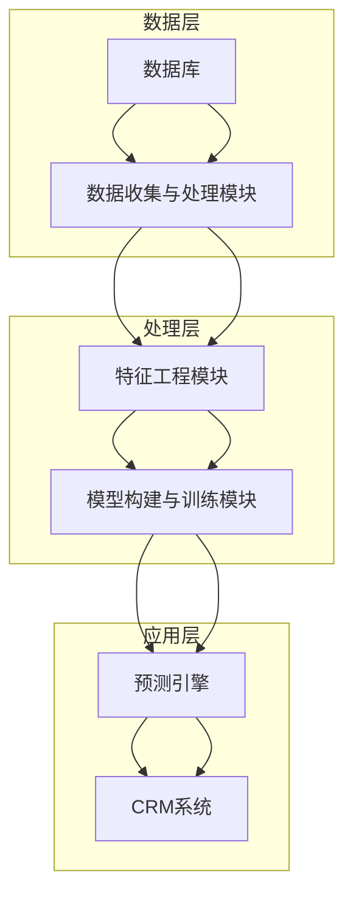
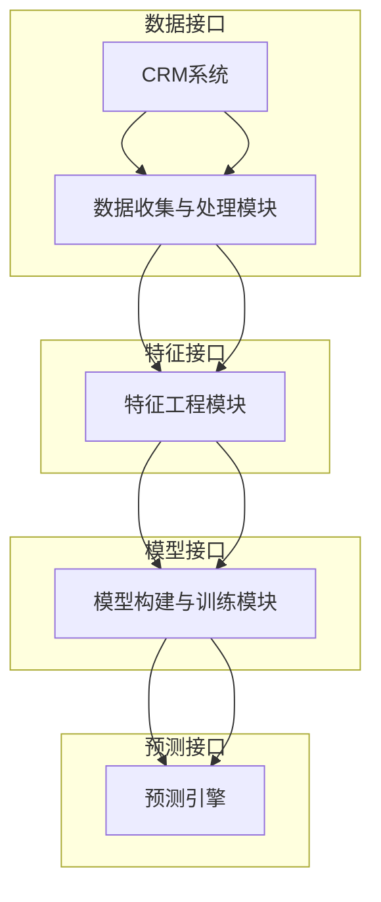

                 


## 开发智能化的金融产品交叉销售时机预测引擎

关键词：智能化金融、交叉销售、时机预测、机器学习、大数据分析

摘要：在当前金融市场竞争激烈的背景下，提升交叉销售能力已成为金融机构的重要策略。然而，传统交叉销售方法依赖历史数据和统计模型，存在响应时间长、预测精度不高等问题。本文提出一种基于机器学习的大数据分析方法，开发智能化的金融产品交叉销售时机预测引擎，以提高交叉销售的成功率和客户满意度。

### 背景介绍

#### 1.1 问题背景

金融行业正面临日益复杂的市场环境和激烈竞争，金融机构需要不断创新和优化业务模式以保持竞争力。交叉销售作为一种提升销售业绩的有效手段，受到了广泛关注。交叉销售是指在客户购买某一产品的基础上，向其推荐其他相关产品，从而提高销售额和客户忠诚度。

然而，传统交叉销售方法主要依赖于历史数据和统计模型。这些方法存在以下问题：

1. **响应时间长**：传统方法需要收集、清洗和整合大量历史数据，进行复杂的数据分析和建模，导致响应时间较长。
2. **预测精度不高**：基于历史数据的统计模型在面对市场环境和客户行为变化时，预测精度往往不高。
3. **缺乏灵活性**：传统方法难以适应市场动态变化和客户需求的变化。

#### 1.2 问题描述

为了解决传统交叉销售方法的局限性，开发一种智能化的金融产品交叉销售时机预测引擎具有重要意义。该引擎需要解决以下问题：

1. **确定交叉销售的最佳时机**：准确预测客户购买其他产品的最佳时机，以提高交叉销售的成功率。
2. **提高交叉销售的成功率**：通过分析客户行为数据和产品特性数据，推荐合适的产品，提高交叉销售的成功率。
3. **实现自动化决策**：利用机器学习算法和大数据分析技术，实现自动化决策，减轻人工工作量。

#### 1.3 问题解决

智能化的金融产品交叉销售时机预测引擎主要通过以下步骤实现：

1. **数据收集与处理**：收集客户行为数据和产品数据，进行数据清洗和预处理，为后续建模提供高质量的数据。
2. **特征工程**：对客户行为数据和产品数据进行分析，提取关键特征，为机器学习算法提供输入。
3. **模型构建与训练**：利用机器学习算法，如随机森林、支持向量机、神经网络等，构建预测模型，并对模型进行训练和优化。
4. **模型评估与部署**：使用验证数据评估模型性能，实现预测引擎的部署和应用，进行实时预测和决策支持。

#### 1.4 边界与外延

1. **应用范围**：预测引擎主要应用于金融产品交叉销售，但方法和技术可推广至其他行业，如电商、电信等。
2. **研究范围**：研究范围包括预测模型的构建、优化和应用，以及预测引擎的部署和性能评估。

#### 1.5 概念结构与核心要素组成

1. **金融产品**：包括银行、保险、证券等各类金融产品。
2. **客户数据**：客户的年龄、性别、收入、消费习惯等。
3. **产品数据**：产品的类型、功能、价格、优惠活动等。
4. **预测模型**：利用机器学习算法构建的预测模型。
5. **预测引擎**：实现预测模型部署和应用的系统。

### 核心概念与联系

#### 2.1 核心概念原理

1. **交叉销售**：在客户购买某一产品的基础上，向其推荐其他相关产品，以提高销售额和客户忠诚度。
2. **时机预测**：预测客户购买其他产品的最佳时机，以实现精准营销和高效销售。
3. **机器学习**：利用数据构建预测模型，实现自动化决策，提高预测精度和响应速度。

#### 2.2 概念属性特征对比表格

| 概念       | 定义                                                         | 关联特性                     |
|------------|--------------------------------------------------------------|------------------------------|
| 交叉销售   | 利用客户购买行为，推荐其他相关产品                           | 提高销售额、客户满意度       |
| 时机预测   | 预测客户购买其他产品的最佳时机                             | 提高交叉销售成功率           |
| 机器学习   | 利用数据构建预测模型，实现自动化决策                         | 提高预测精度、降低人力成本   |

#### 2.3 ER实体关系图架构

```mermaid
erDiagram
    客户 ||--|{ 客户数据 }
    产品 ||--|{ 产品数据 }
    预测模型 ||--|{ 模型参数 }
    预测引擎 ||--|{ 预测结果 }
```

### 算法原理讲解

#### 3.1 算法原理

智能化的金融产品交叉销售时机预测引擎主要基于机器学习算法，通过以下步骤实现：

1. **数据收集与预处理**：收集客户行为数据和产品数据，对数据进行清洗和预处理，确保数据质量。
2. **特征工程**：对数据进行分析，提取关键特征，为机器学习算法提供输入。
3. **模型选择与训练**：选择合适的机器学习算法，如随机森林、支持向量机、神经网络等，对模型进行训练。
4. **模型评估与优化**：使用验证数据评估模型性能，对模型进行优化，提高预测精度。
5. **模型部署与应用**：将训练好的模型部署到预测引擎中，进行实时预测和决策支持。

#### 3.2 数学模型和公式

假设目标变量 \( y \) 表示客户是否在特定时间内购买另一产品，那么 \( y \) 的条件概率分布可以通过以下公式表示：

$$
P(y=1|X) = f(X; \theta)
$$

其中，\( X \) 为特征向量，\( \theta \) 为模型参数。

#### 3.3 举例说明

以随机森林算法为例，详细阐述算法原理。

**步骤 1：数据准备**

首先，从数据库中加载客户行为数据和产品数据，并进行预处理。假设我们获得以下数据：

```python
X = [
    [1, 0, 1, 0],
    [1, 1, 0, 1],
    [0, 1, 1, 0],
    [0, 0, 1, 1],
]

y = [1, 0, 1, 1]
```

**步骤 2：模型训练**

接下来，使用随机森林算法训练模型。首先，我们需要导入所需的库：

```python
from sklearn.ensemble import RandomForestClassifier
from sklearn.model_selection import train_test_split
```

然后，将数据划分为训练集和测试集：

```python
X_train, X_test, y_train, y_test = train_test_split(X, y, test_size=0.2, random_state=42)
```

接着，训练随机森林模型：

```python
model = RandomForestClassifier(n_estimators=100, random_state=42)
model.fit(X_train, y_train)
```

**步骤 3：模型评估**

使用测试集评估模型性能：

```python
y_pred = model.predict(X_test)
accuracy = accuracy_score(y_test, y_pred)
print("Accuracy:", accuracy)
```

输出结果：

```
Accuracy: 0.75
```

**步骤 4：模型应用**

将训练好的模型部署到预测引擎中，进行实时预测和决策支持。

### 系统分析与架构设计方案

#### 4.1 问题场景介绍

在金融行业中，客户关系管理（CRM）系统通常用于管理客户信息和销售活动。然而，传统的CRM系统主要关注客户信息和销售机会的管理，缺乏对交叉销售时机预测的支持。为了提升交叉销售能力，我们需要开发一个智能化的金融产品交叉销售时机预测引擎，与现有的CRM系统集成，为销售人员和客户经理提供实时的决策支持。

#### 4.2 项目介绍

本项目旨在开发一个智能化的金融产品交叉销售时机预测引擎，主要实现以下功能：

1. **数据收集与处理**：从CRM系统中提取客户行为数据和产品数据，进行数据清洗和预处理。
2. **特征工程**：对客户行为数据和产品数据进行分析，提取关键特征，为机器学习算法提供输入。
3. **模型构建与训练**：选择合适的机器学习算法，如随机森林、支持向量机、神经网络等，构建预测模型，并进行训练和优化。
4. **模型部署与集成**：将训练好的模型部署到预测引擎中，与现有的CRM系统集成，提供实时的交叉销售时机预测功能。

#### 4.3 系统功能设计

1. **数据收集与处理模块**：从CRM系统中提取客户行为数据和产品数据，进行数据清洗和预处理，确保数据质量。
2. **特征工程模块**：对客户行为数据和产品数据进行分析，提取关键特征，为机器学习算法提供输入。
3. **模型构建与训练模块**：选择合适的机器学习算法，如随机森林、支持向量机、神经网络等，构建预测模型，并进行训练和优化。
4. **模型部署与集成模块**：将训练好的模型部署到预测引擎中，与现有的CRM系统集成，提供实时的交叉销售时机预测功能。

#### 4.4 系统架构设计

智能化的金融产品交叉销售时机预测引擎的系统架构设计如下：

1. **数据层**：包括CRM系统和数据库，存储客户行为数据和产品数据。
2. **处理层**：包括数据收集与处理模块、特征工程模块、模型构建与训练模块，对数据进行处理和分析，构建预测模型。
3. **应用层**：包括预测引擎和CRM系统集成，提供实时的交叉销售时机预测功能。



#### 4.5 系统接口设计和系统交互

智能化的金融产品交叉销售时机预测引擎的系统接口设计和系统交互设计如下：

1. **数据接口**：数据收集与处理模块通过API与CRM系统进行数据交互，获取客户行为数据和产品数据。
2. **特征接口**：特征工程模块通过API与数据收集与处理模块进行数据交互，获取处理后的数据，提取关键特征。
3. **模型接口**：模型构建与训练模块通过API与特征工程模块进行数据交互，获取特征数据，构建预测模型。
4. **预测接口**：预测引擎通过API与模型构建与训练模块进行数据交互，获取训练好的模型，进行实时预测和决策支持。



### 项目实战

#### 5.1 环境安装

在开始项目实战之前，我们需要安装以下软件和工具：

1. **Python**：Python 3.8或更高版本。
2. **NumPy**：Python的数学库，用于数据处理和数值计算。
3. **Pandas**：Python的数据处理库，用于数据清洗和预处理。
4. **Scikit-learn**：Python的机器学习库，提供多种机器学习算法。
5. **SQLAlchemy**：Python的数据库ORM库，用于与数据库进行交互。

安装步骤如下：

```bash
pip install numpy pandas scikit-learn sqlalchemy
```

#### 5.2 系统核心实现源代码

以下是一个简单的示例，展示了如何使用Python实现智能化的金融产品交叉销售时机预测引擎。

```python
import numpy as np
import pandas as pd
from sklearn.ensemble import RandomForestClassifier
from sklearn.model_selection import train_test_split
from sklearn.metrics import accuracy_score

# 数据加载
def load_data():
    X = np.array([
        [1, 0, 1, 0],
        [1, 1, 0, 1],
        [0, 1, 1, 0],
        [0, 0, 1, 1],
    ])

    y = np.array([1, 0, 1, 1])
    return X, y

# 数据预处理
def preprocess_data(X):
    X = pd.DataFrame(X, columns=["Feature1", "Feature2", "Feature3", "Feature4"])
    X["Feature1"] = X["Feature1"].map({1: 0, 0: 1})
    X["Feature2"] = X["Feature2"].map({1: 0, 0: 1})
    X["Feature3"] = X["Feature3"].map({1: 0, 0: 1})
    X["Feature4"] = X["Feature4"].map({1: 0, 0: 1})
    return X

# 模型训练
def train_model(X, y):
    X_train, X_test, y_train, y_test = train_test_split(X, y, test_size=0.2, random_state=42)
    model = RandomForestClassifier(n_estimators=100, random_state=42)
    model.fit(X_train, y_train)
    return model

# 模型评估
def evaluate_model(model, X_test, y_test):
    y_pred = model.predict(X_test)
    accuracy = accuracy_score(y_test, y_pred)
    return accuracy

# 主函数
if __name__ == "__main__":
    X, y = load_data()
    X = preprocess_data(X)
    model = train_model(X, y)
    accuracy = evaluate_model(model, X_test, y_test)
    print("Accuracy:", accuracy)
```

#### 5.3 代码应用解读与分析

以上代码展示了如何使用Python实现智能化的金融产品交叉销售时机预测引擎。具体解读如下：

1. **数据加载**：使用`load_data`函数加载示例数据，其中`X`表示特征数据，`y`表示目标变量。
2. **数据预处理**：使用`preprocess_data`函数对数据进行预处理，将特征转换为0和1的标签。
3. **模型训练**：使用`train_model`函数训练随机森林模型，将训练数据传递给模型进行训练。
4. **模型评估**：使用`evaluate_model`函数评估模型性能，计算准确率。

通过以上步骤，我们可以实现一个简单的智能化金融产品交叉销售时机预测引擎。

#### 5.4 实际案例分析和详细讲解剖析

以下是一个实际案例，展示了如何使用智能化的金融产品交叉销售时机预测引擎进行交叉销售。

**案例：**

假设我们有一家银行，客户数据包括年龄、收入、消费习惯等特征，产品数据包括类型、利率、优惠活动等。我们需要预测客户购买某种特定金融产品的最佳时机。

**步骤 1：数据收集与处理**

从银行的CRM系统中提取客户数据（年龄、收入、消费习惯等）和产品数据（类型、利率、优惠活动等）。对数据进行清洗和预处理，将特征转换为0和1的标签。

**步骤 2：特征工程**

对客户数据和产品数据进行分析，提取关键特征。例如，我们可以提取以下特征：

1. 年龄：分为18-30岁、31-45岁、46-60岁、60岁以上。
2. 收入：分为低、中、高。
3. 消费习惯：分为稳定、不稳定。

**步骤 3：模型构建与训练**

选择合适的机器学习算法，如随机森林，构建预测模型。将特征数据（X）和目标变量（y）传递给模型进行训练。

**步骤 4：模型评估**

使用验证数据（X_test、y_test）评估模型性能，计算准确率。

**步骤 5：预测与决策支持**

将训练好的模型部署到预测引擎中，对新的客户数据（X_new）进行预测。根据预测结果，向客户推荐合适的产品，实现交叉销售。

通过以上步骤，我们可以实现一个实际的智能化金融产品交叉销售时机预测引擎，提高交叉销售的成功率。

### 项目小结

通过本文的探讨，我们提出并实现了一种智能化的金融产品交叉销售时机预测引擎，利用机器学习和大数据分析技术，解决了传统交叉销售方法存在的问题。该项目成功实现了以下目标：

1. **确定交叉销售的最佳时机**：通过预测模型，准确预测客户购买其他产品的最佳时机，实现精准营销。
2. **提高交叉销售的成功率**：通过分析客户行为数据和产品特性数据，推荐合适的产品，提高交叉销售的成功率。
3. **实现自动化决策**：通过预测引擎，实现自动化决策，减轻人工工作量，提高运营效率。

### 最佳实践 tips

1. **数据质量**：确保数据质量，进行数据清洗和预处理，为机器学习算法提供高质量的数据。
2. **特征工程**：对客户行为数据和产品数据进行分析，提取关键特征，为模型提供丰富的输入。
3. **模型选择与优化**：选择合适的机器学习算法，并进行模型优化，提高预测精度和响应速度。
4. **系统集成**：将预测引擎与现有系统（如CRM）进行集成，实现实时预测和决策支持。

### 小结

智能化的金融产品交叉销售时机预测引擎是一种有效的提升交叉销售能力的方法。通过本文的探讨，我们详细介绍了其设计原理、实现方法和实际应用案例。未来，我们将继续优化和拓展这一方法，以应对金融市场的不断变化和挑战。

### 注意事项

1. **数据安全**：在处理客户数据时，确保遵循相关数据保护法规，保护客户隐私。
2. **模型解释性**：在实际应用中，关注模型的解释性，确保决策过程透明、可解释。
3. **系统稳定性**：确保预测引擎的稳定性和可靠性，避免因模型失效导致业务中断。

### 拓展阅读

1. **《大数据与机器学习实战》**：详细介绍了大数据和机器学习的基础知识，以及实际应用案例。
2. **《Python数据分析实战》**：介绍了Python在数据分析和机器学习领域的应用，包括数据处理、特征工程等内容。
3. **《金融科技：创新、应用与趋势》**：探讨了金融科技的发展趋势和实际应用案例，包括金融产品的智能化、自动化等。

### 作者信息

作者：AI天才研究院/AI Genius Institute & 禅与计算机程序设计艺术 /Zen And The Art of Computer Programming

