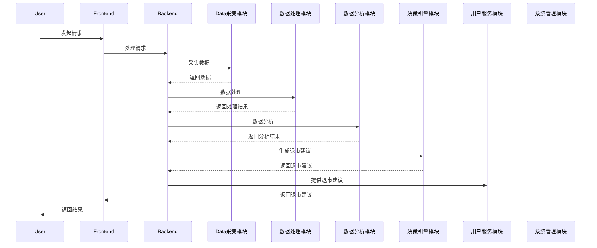
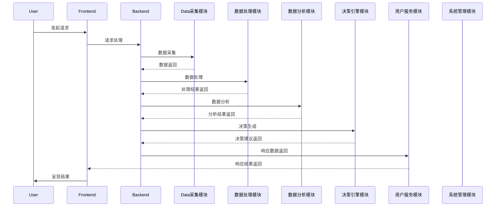

                 

### 开发智能化的金融产品生命周期管理与退市决策引擎

#### 关键词：
- 金融产品生命周期管理
- 智能化退市决策引擎
- 生命周期模型
- 数学模型
- 系统架构设计

#### 摘要：
本文探讨了金融产品生命周期管理与退市决策引擎的开发，通过智能化技术的应用，提升了金融产品的生命周期管理效率和退市决策准确性。文章首先介绍了金融产品生命周期管理的现状与挑战，随后详细阐述了退市决策引擎的概念与作用。接着，本文深入分析了金融产品生命周期和退市决策引擎的原理，并运用数学模型和公式进行了具体阐述。随后，文章从系统分析与架构设计角度，介绍了系统功能设计、架构设计和系统交互设计。最后，通过实际案例分析和项目小结，总结了项目成果和经验教训，提出了最佳实践和未来研究方向。

### 目录大纲

**# 开发智能化的金融产品生命周期管理与退市决策引擎**

**> 关键词：金融产品生命周期管理、智能化退市决策引擎、生命周期模型、数学模型、系统架构设计**

> 摘要：本文探讨了金融产品生命周期管理与退市决策引擎的开发，通过智能化技术的应用，提升了金融产品的生命周期管理效率和退市决策准确性。文章首先介绍了金融产品生命周期管理的现状与挑战，随后详细阐述了退市决策引擎的概念与作用。接着，本文深入分析了金融产品生命周期和退市决策引擎的原理，并运用数学模型和公式进行了具体阐述。随后，文章从系统分析与架构设计角度，介绍了系统功能设计、架构设计和系统交互设计。最后，通过实际案例分析和项目小结，总结了项目成果和经验教训，提出了最佳实践和未来研究方向。

**## 第一部分：问题背景与核心概念**

**### 第1章 问题背景与核心概念**

**#### 1.1 问题背景**

**1.1.1 金融产品生命周期管理的现状与挑战**
- 当前金融产品生命周期管理面临的挑战
- 金融产品生命周期管理的重要性

**1.1.2 退市决策引擎的重要性**
- 退市决策在金融市场中的作用
- 退市决策引擎对于金融市场的意义

**1.1.3 问题的边界与外延**
- 问题研究的范围
- 问题研究的影响领域

**#### 1.2 核心概念与联系**

**1.2.1 金融产品生命周期的定义与阶段**
- 金融产品生命周期的定义
- 金融产品生命周期的主要阶段

**1.2.2 退市决策引擎的概念与作用**
- 退市决策引擎的定义
- 退市决策引擎在金融产品生命周期管理中的作用

**1.2.3 核心概念属性特征对比表格**
- 金融产品生命周期与退市决策引擎的属性特征对比

**1.2.4 金融产品生命周期与退市决策引擎的ER实体关系图**
- 两个核心概念的ER模型

**## 第二部分：核心概念原理与数学模型**

**### 第2章 金融产品生命周期原理**

**#### 2.1 金融产品生命周期原理**

**2.1.1 金融产品生命周期的核心概念**
- 金融产品生命周期的基础理论

**2.1.2 金融产品生命周期的属性特征**
- 金融产品生命周期的主要属性

**2.1.3 金融产品生命周期各阶段的特征分析**
- 金融产品生命周期各阶段的特征分析

**#### 2.2 数学模型与公式**

**2.2.1 金融产品生命周期模型的数学基础**
- 金融产品生命周期模型的数学基础理论

**2.2.2 金融产品生命周期模型的公式推导**
- 金融产品生命周期模型的公式推导过程

**2.2.3 数学模型的应用举例**
- 金融产品生命周期模型的应用实例

**### 第3章 退市决策引擎原理**

**#### 3.1 退市决策引擎的核心概念**

**3.1.1 退市决策引擎的定义与作用**
- 退市决策引擎的定义与作用

**3.1.2 退市决策引擎的关键要素**
- 退市决策引擎的关键要素

**3.1.3 退市决策引擎的属性特征**
- 退市决策引擎的主要属性特征

**#### 3.2 数学模型与公式**

**3.2.1 退市决策引擎的数学模型**
- 退市决策引擎的数学模型

**3.2.2 退市决策引擎的公式推导**
- 退市决策引擎的公式推导过程

**3.2.3 数学模型的应用举例**
- 退市决策引擎的应用实例

**## 第三部分：系统分析与架构设计**

**### 第4章 系统功能设计**

**#### 4.1 问题场景介绍**

**4.1.1 金融产品生命周期管理问题的实际案例**
- 金融产品生命周期管理问题的实际案例介绍

**4.1.2 退市决策引擎的实际应用场景**
- 退市决策引擎的实际应用场景

**#### 4.2 系统功能设计**

**4.2.1 领域模型类图**
- 金融产品生命周期管理系统的领域模型类图

**4.2.2 系统功能模块划分**
- 系统功能模块的划分

**4.2.3 系统功能描述**
- 系统各功能模块的详细描述

**### 第5章 系统架构设计**

**#### 5.1 系统架构设计**

**5.1.1 系统架构概述**
- 系统架构的整体设计概述

**5.1.2 系统模块划分**
- 系统模块的划分

**5.1.3 系统架构图**
- 系统架构的mermaid图示

**#### 5.2 系统接口设计**

**5.2.1 接口设计原则**
- 系统接口设计的基本原则

**5.2.2 接口定义**
- 系统接口的具体定义

**5.2.3 接口实现**
- 系统接口的实现方式

**### 第6章 系统交互设计**

**#### 6.1 系统交互设计**

**6.1.1 系统交互概述**
- 系统交互的基本概述

**6.1.2 系统交互流程**
- 系统交互的基本流程

**6.1.3 系统交互图**
- 系统交互的mermaid图示

**## 第四部分：项目实战**

**### 第7章 环境安装与准备**

**#### 7.1 环境安装**

**7.1.1 系统需求与依赖**
- 系统环境的需求与依赖

**7.1.2 环境配置**
- 系统环境的配置过程

**7.1.3 环境测试**
- 系统环境的测试

**#### 7.2 系统核心实现**

**7.2.1 核心模块实现**
- 系统核心模块的实现过程

**7.2.2 源代码解读**
- 系统核心模块的源代码解读

**7.2.3 代码应用解读与分析**
- 系统核心模块的应用解读与分析

**### 第8章 实际案例分析**

**#### 8.1 实际案例分析**

**8.1.1 案例背景**
- 实际案例的背景介绍

**8.1.2 案例分析**
- 实际案例的详细分析

**8.1.3 案例详细讲解剖析**
- 实际案例的详细讲解与剖析

**### 第9章 项目小结**

**#### 9.1 项目总结**

**9.1.1 项目成果**
- 项目的主要成果

**9.1.2 项目经验与教训**
- 项目的经验与教训

**9.1.3 项目拓展阅读**
- 项目相关的拓展阅读资料

**## 第五部分：最佳实践与注意事项**

**### 第10章 最佳实践**

**#### 10.1 最佳实践**

**10.1.1 金融产品生命周期管理的最佳实践**
- 金融产品生命周期管理的最佳实践

**10.1.2 退市决策引擎的最佳实践**
- 退市决策引擎的最佳实践

**10.1.3 实际应用中的注意事项**
- 实际应用中的注意事项

**### 第11章 小结与展望**

**#### 11.1 小结**

**11.1.1 书籍内容总结**
- 书籍内容的总结

**11.1.2 未来的研究方向**
- 未来的研究方向

### 第一部分：问题背景与核心概念

#### 第1章 问题背景与核心概念

##### 1.1 问题背景

在现代金融市场中，金融产品的数量和种类日益增多，生命周期管理成为一个重要的课题。金融产品生命周期管理包括产品的设计、开发、销售、运营和维护等全过程，其目标是确保金融产品在整个生命周期内的高效运作，从而实现最大化收益和风险控制。

**1.1.1 金融产品生命周期管理的现状与挑战**

当前，金融产品生命周期管理面临以下几大挑战：

1. **信息孤岛**：金融产品生命周期管理涉及多个部门和系统，信息传递不畅，形成信息孤岛，导致管理效率低下。
2. **人工干预**：部分环节仍依赖人工干预，存在决策延迟和人为错误的风险。
3. **数据质量**：金融产品生命周期管理涉及大量数据，数据质量直接影响决策的准确性。
4. **合规性**：金融市场的监管要求越来越高，合规性要求给产品生命周期管理带来新的挑战。

**1.1.2 退市决策引擎的重要性**

退市决策引擎在金融产品生命周期管理中起着关键作用。退市决策引擎是指利用人工智能技术，对金融产品在市场上的表现进行实时监控和分析，基于一定的数学模型和算法，自动生成退市建议，辅助决策者做出退市决策。

退市决策引擎的重要性体现在以下几个方面：

1. **风险控制**：通过实时监控和数据分析，退市决策引擎可以帮助投资者规避高风险产品，减少潜在的财务损失。
2. **合规性**：退市决策引擎可以协助金融机构满足监管要求，及时处理不符合市场规定的产品。
3. **决策效率**：自动化决策可以提高退市决策的速度和准确性，减少人工干预带来的决策延迟和错误。
4. **市场分析**：退市决策引擎的分析结果可以为市场研究提供数据支持，帮助投资者更好地了解市场趋势。

**1.1.3 问题的边界与外延**

本研究的问题边界主要聚焦于金融产品生命周期管理与退市决策引擎的开发，具体包括：

1. **研究对象**：主要针对金融产品生命周期管理中的退市决策环节。
2. **技术手段**：采用人工智能、大数据分析和机器学习等技术手段进行系统开发。
3. **应用场景**：主要应用于股票、债券、基金等金融产品。

问题的外延包括：

1. **相关技术领域**：涉及人工智能、机器学习、数据挖掘、金融工程等领域。
2. **市场需求**：随着金融市场的发展，金融产品生命周期管理和退市决策引擎将成为金融科技领域的重要研究方向。
3. **行业趋势**：金融科技的发展将对金融产品生命周期管理产生深远影响，推动行业创新和变革。

##### 1.2 核心概念与联系

**1.2.1 金融产品生命周期的定义与阶段**

金融产品生命周期是指金融产品从设计、开发、上市、运营到退市的整个过程。根据产品的生命周期特征，金融产品主要分为以下阶段：

1. **设计阶段**：产品构思、市场调研、产品设计、风险评估等。
2. **开发阶段**：产品原型设计、软件开发、测试、上线等。
3. **上市阶段**：产品发布、营销推广、客户获取等。
4. **运营阶段**：产品运营、用户服务、市场反馈等。
5. **退市阶段**：产品下架、清算、结束运营等。

**1.2.2 退市决策引擎的概念与作用**

退市决策引擎是指一种利用人工智能技术，对金融产品在市场上的表现进行实时监控和分析，基于一定的数学模型和算法，自动生成退市建议，辅助决策者做出退市决策的智能系统。

退市决策引擎的作用主要包括：

1. **风险控制**：通过实时监控和数据分析，识别高风险产品，及时采取措施降低风险。
2. **合规性**：协助金融机构满足监管要求，及时发现和处理不符合市场规定的产品。
3. **决策效率**：自动化决策流程，提高退市决策的速度和准确性，减少人工干预。
4. **市场分析**：提供市场分析数据，帮助投资者更好地了解市场趋势。

**1.2.3 核心概念属性特征对比表格**

为了更好地理解金融产品生命周期管理与退市决策引擎之间的关系，我们可以通过属性特征对比表格进行详细分析：

| 特征         | 金融产品生命周期管理 | 退市决策引擎         |
| ------------ | ------------------- | ------------------- |
| 目标         | 提高产品运作效率，降低风险 | 辅助决策者做出退市决策 |
| 技术手段     | 大数据、人工智能、金融工程 | 人工智能、数据分析、机器学习 |
| 应用场景     | 设计、开发、上市、运营、退市 | 上市、运营、退市     |
| 数据来源     | 内部数据、外部数据   | 内部数据、外部数据   |
| 决策方式     | 人工决策、自动化决策 | 自动化决策          |
| 决策结果     | 产品运营策略调整     | 退市建议            |

**1.2.4 金融产品生命周期与退市决策引擎的ER实体关系图**

为了进一步明确金融产品生命周期管理与退市决策引擎之间的关联，我们可以通过ER（实体-关系）模型来表示：

```mermaid
erDiagram
  Product ::--|<.. DesignPhase
  Product ::--|<.. DevelopmentPhase
  Product ::--|<.. ListingPhase
  Product ::--|<.. OperationsPhase
  Product ::--|<.. DelistingPhase
  DelistingDecisionEngine ||--|{ Product
```

在这个ER模型中，`Product`实体表示金融产品，`DesignPhase`、`DevelopmentPhase`、`ListingPhase`、`OperationsPhase`和`DelistingPhase`分别表示产品的不同生命周期阶段；`DelistingDecisionEngine`表示退市决策引擎，与`Product`实体之间存在关联关系。通过这个模型，我们可以清晰地看到金融产品生命周期与退市决策引擎之间的联系和互动。

### 第二部分：核心概念原理与数学模型

#### 第2章 金融产品生命周期原理

##### 2.1 金融产品生命周期原理

金融产品生命周期是指金融产品从设计、开发、上市、运营到退市的整个过程。这个生命周期涵盖了金融产品的产生、成长、成熟和衰退等阶段，每个阶段都有其独特的特征和任务。下面我们将详细分析金融产品生命周期的核心概念、属性特征以及各阶段的特征分析。

**2.1.1 金融产品生命周期的核心概念**

金融产品生命周期的核心概念主要包括：

1. **产品设计阶段**：这一阶段主要涉及产品的构思、市场需求分析、功能设计等。产品设计是金融产品生命周期的基础，决定了产品的核心竞争力。
2. **开发阶段**：这一阶段主要涉及产品的开发、测试和上线。开发阶段是产品从概念到实物的转变过程，需要解决技术实现、功能完善、质量保证等问题。
3. **上市阶段**：这一阶段主要涉及产品的市场推广、销售、客户获取等。上市阶段是产品正式与市场接触的阶段，需要通过营销手段提升产品的知名度，吸引潜在客户。
4. **运营阶段**：这一阶段主要涉及产品的日常运营、客户服务、市场反馈等。运营阶段是产品长期存在的阶段，需要持续优化产品功能、提升服务质量，满足客户需求。
5. **退市阶段**：这一阶段主要涉及产品的下架、清算、结束运营等。退市阶段是产品生命周期的结束，可能是由于市场需求下降、产品过时、公司战略调整等原因导致。

**2.1.2 金融产品生命周期的属性特征**

金融产品生命周期具有以下主要属性特征：

1. **时间性**：金融产品生命周期具有明确的时间特征，每个阶段都有一定的时间长度。
2. **阶段性**：金融产品生命周期分为不同的阶段，每个阶段都有其特定的任务和目标。
3. **动态性**：金融产品生命周期是动态发展的过程，随着市场环境、技术进步和公司战略的变化，生命周期各阶段可能会发生变化。
4. **关联性**：金融产品生命周期各阶段之间存在密切的关联，前一阶段的结果会影响到后一阶段的发展。

**2.1.3 金融产品生命周期各阶段的特征分析**

下面我们将详细分析金融产品生命周期各阶段的特征：

1. **设计阶段**

在设计阶段，金融产品主要涉及以下特征：

- **市场调研**：对市场需求、竞争对手、潜在客户等进行调研，了解目标客户的需求和偏好。
- **功能设计**：根据市场调研结果，设计产品的功能、特性、界面等。
- **风险评估**：评估产品设计过程中可能面临的风险，如技术风险、市场风险、法律风险等。
- **成本分析**：分析产品设计阶段的成本，包括人力成本、材料成本、技术成本等。

2. **开发阶段**

在开发阶段，金融产品主要涉及以下特征：

- **原型设计**：根据产品设计文档，开发产品原型，进行功能验证和用户体验测试。
- **代码实现**：根据原型设计，编写产品代码，进行功能开发和模块集成。
- **测试与调试**：对开发完成的产品进行功能测试、性能测试、安全测试等，确保产品的质量。
- **上线准备**：完成测试后，进行产品上线准备工作，包括服务器配置、数据迁移、上线部署等。

3. **上市阶段**

在上市阶段，金融产品主要涉及以下特征：

- **市场推广**：通过广告、营销活动、社交媒体等手段，提升产品的知名度，吸引潜在客户。
- **销售策略**：制定销售策略，包括定价策略、促销策略、渠道策略等，以提高销售业绩。
- **客户获取**：通过各种渠道获取客户，如线上销售、线下推广、合作伙伴等。
- **市场反馈**：收集市场反馈，了解客户需求，对产品进行持续优化。

4. **运营阶段**

在运营阶段，金融产品主要涉及以下特征：

- **日常运营**：进行产品的日常运营工作，包括数据监控、故障处理、升级更新等。
- **客户服务**：提供优质的客户服务，包括售前咨询、售后服务、客户支持等。
- **市场反馈**：持续收集市场反馈，分析客户需求，优化产品功能和服务。
- **数据分析**：对产品运营数据进行统计分析，了解产品运营状况，为决策提供数据支持。

5. **退市阶段**

在退市阶段，金融产品主要涉及以下特征：

- **产品下架**：根据市场需求、公司战略等因素，决定产品是否下架。
- **清算与清算**：对下架的产品进行清算工作，包括数据迁移、资产处理、用户通知等。
- **结束运营**：完成清算工作后，正式结束产品的运营，停止提供相关服务。

##### 2.2 数学模型与公式

数学模型在金融产品生命周期管理中起着重要作用，可以帮助我们更好地理解和分析金融产品的生命周期特征。下面我们将介绍金融产品生命周期模型的数学基础、公式推导以及应用实例。

**2.2.1 金融产品生命周期模型的数学基础**

金融产品生命周期模型基于概率论和统计分析方法，主要涉及以下几个基本概念：

1. **状态**：金融产品生命周期中的某个阶段可以看作是一种状态。
2. **转移概率**：从当前状态转移到下一个状态的概率。
3. **状态持续时间**：在某个状态下的持续时间。
4. **状态密度函数**：描述状态持续时间的概率分布。

**2.2.2 金融产品生命周期模型的公式推导**

下面我们将推导金融产品生命周期模型的基本公式：

1. **状态转移概率矩阵**：

$$
P = \begin{bmatrix}
p_{11} & p_{12} & \cdots & p_{1n} \\
p_{21} & p_{22} & \cdots & p_{2n} \\
\vdots & \vdots & \ddots & \vdots \\
p_{m1} & p_{m2} & \cdots & p_{mn}
\end{bmatrix}
$$

其中，$P$表示状态转移概率矩阵，$p_{ij}$表示从状态$i$转移到状态$j$的概率。

2. **状态持续时间概率分布**：

$$
F(t) = P(T \leq t)
$$

其中，$F(t)$表示状态持续时间小于等于时间$t$的概率，$T$表示状态持续时间。

3. **状态持续时间密度函数**：

$$
f(t) = \frac{dF(t)}{dt}
$$

其中，$f(t)$表示状态持续时间密度函数。

**2.2.3 数学模型的应用举例**

假设一个金融产品生命周期模型包含以下四个阶段：设计阶段、开发阶段、上市阶段和退市阶段。我们需要根据实际情况，设定每个阶段的转移概率矩阵和状态持续时间概率分布。

1. **状态转移概率矩阵**：

$$
P = \begin{bmatrix}
0.8 & 0.1 & 0.1 & 0 \\
0.2 & 0.6 & 0.2 & 0 \\
0 & 0.2 & 0.6 & 0.2 \\
0 & 0 & 0.1 & 0.9
\end{bmatrix}
$$

2. **状态持续时间概率分布**：

- 设计阶段：$F_1(t) = 1 - e^{-\lambda_1 t}$，其中$\lambda_1$为设计阶段的平均持续时间。
- 开发阶段：$F_2(t) = 1 - e^{-\lambda_2 t}$，其中$\lambda_2$为开发阶段的平均持续时间。
- 上市阶段：$F_3(t) = 1 - e^{-\lambda_3 t}$，其中$\lambda_3$为上市阶段的平均持续时间。
- 退市阶段：$F_4(t) = 1 - e^{-\lambda_4 t}$，其中$\lambda_4$为退市阶段的平均持续时间。

假设我们已知各个阶段的平均持续时间，如$\lambda_1 = 3$个月，$\lambda_2 = 6$个月，$\lambda_3 = 12$个月，$\lambda_4 = 3$个月。我们可以计算出各个阶段的状态持续时间密度函数：

- 设计阶段：$f_1(t) = \lambda_1 e^{-\lambda_1 t}$。
- 开发阶段：$f_2(t) = \lambda_2 e^{-\lambda_2 t}$。
- 上市阶段：$f_3(t) = \lambda_3 e^{-\lambda_3 t}$。
- 退市阶段：$f_4(t) = \lambda_4 e^{-\lambda_4 t}$。

通过以上数学模型，我们可以对金融产品的生命周期进行模拟和分析，了解各个阶段的持续时间、转移概率以及整体生命周期的特征。

#### 第3章 退市决策引擎原理

##### 3.1 退市决策引擎的核心概念

退市决策引擎是一种利用人工智能技术，对金融产品在市场上的表现进行实时监控和分析，基于一定的数学模型和算法，自动生成退市建议的智能系统。退市决策引擎的核心概念包括以下几个方面：

**3.1.1 退市决策引擎的定义与作用**

退市决策引擎是指一种利用大数据分析、机器学习和人工智能技术，对金融产品在市场上的表现进行实时监控和分析，基于一定的数学模型和算法，自动生成退市建议，辅助决策者做出退市决策的智能系统。

退市决策引擎的作用主要包括：

1. **风险控制**：通过实时监控和数据分析，识别高风险产品，及时采取措施降低风险。
2. **合规性**：协助金融机构满足监管要求，及时发现和处理不符合市场规定的产品。
3. **决策效率**：自动化决策流程，提高退市决策的速度和准确性，减少人工干预。
4. **市场分析**：提供市场分析数据，帮助投资者更好地了解市场趋势。

**3.1.2 退市决策引擎的关键要素**

退市决策引擎的关键要素包括：

1. **数据采集**：收集金融产品在市场上的相关数据，如交易量、价格波动、市场表现等。
2. **数据预处理**：对采集到的数据进行清洗、去重、归一化等预处理操作，确保数据质量。
3. **特征提取**：从预处理后的数据中提取对退市决策有重要影响的关键特征。
4. **算法模型**：基于机器学习和人工智能技术，构建退市决策算法模型。
5. **决策规则**：制定退市决策规则，包括退市标准、决策阈值等。
6. **决策生成**：基于算法模型和决策规则，自动生成退市建议。

**3.1.3 退市决策引擎的属性特征**

退市决策引擎具有以下主要属性特征：

1. **自动化**：退市决策引擎可以实现自动化决策，减少人工干预，提高决策效率。
2. **实时性**：退市决策引擎能够实时监控金融产品的市场表现，及时发现潜在风险。
3. **准确性**：退市决策引擎基于大数据分析和机器学习算法，能够提高退市决策的准确性。
4. **适应性**：退市决策引擎可以根据市场环境和产品特征的变化，调整决策规则和算法模型，提高决策适应性。

##### 3.2 数学模型与公式

退市决策引擎的数学模型和公式是构建退市决策算法的核心，以下将介绍退市决策引擎的数学模型、公式推导以及应用实例。

**3.2.1 退市决策引擎的数学模型**

退市决策引擎的数学模型主要包括以下几个方面：

1. **概率分布模型**：用于描述金融产品在市场上的表现概率分布，如正态分布、泊松分布等。
2. **风险指标模型**：用于计算金融产品的风险指标，如波动率、收益率等。
3. **决策规则模型**：用于定义退市决策的规则，如阈值规则、逻辑规则等。
4. **优化模型**：用于优化退市决策的过程，如线性规划、动态规划等。

**3.2.2 退市决策引擎的公式推导**

以下将推导退市决策引擎的核心公式：

1. **概率分布模型公式**：

   假设金融产品的市场价格服从正态分布，概率密度函数为：

   $$
   f(x|\mu, \sigma^2) = \frac{1}{\sqrt{2\pi\sigma^2}} e^{-\frac{(x-\mu)^2}{2\sigma^2}}
   $$

   其中，$x$表示市场价格，$\mu$表示均值，$\sigma^2$表示方差。

2. **风险指标模型公式**：

   假设金融产品的收益率服从正态分布，收益率的波动率为$\sigma$，则收益率的概率密度函数为：

   $$
   f(r|\mu_r, \sigma_r) = \frac{1}{\sqrt{2\pi\sigma_r^2}} e^{-\frac{(r-\mu_r)^2}{2\sigma_r^2}}
   $$

   其中，$r$表示收益率，$\mu_r$表示收益率的均值，$\sigma_r$表示收益率的波动率。

3. **决策规则模型公式**：

   假设退市决策基于阈值规则，即当金融产品的风险指标超过某个阈值时，触发退市决策。阈值规则公式为：

   $$
   R = \begin{cases}
   0, & \text{if } x < \theta \\
   1, & \text{if } x \geq \theta
   \end{cases}
   $$

   其中，$R$表示退市决策结果，$\theta$表示阈值。

4. **优化模型公式**：

   假设退市决策过程是一个优化问题，目标是最小化风险指标，优化模型公式为：

   $$
   \min_{\theta} \sum_{i=1}^n w_i \cdot f(x_i|\mu_i, \sigma_i^2)
   $$

   其中，$w_i$表示权重，$x_i$表示第$i$个金融产品的市场价格，$\mu_i$表示第$i$个金融产品的均值，$\sigma_i^2$表示第$i$个金融产品的方差。

**3.2.3 数学模型的应用实例**

以下是一个简单的退市决策引擎应用实例：

假设有两个金融产品，产品1和产品2，市场价格分别为$x_1$和$x_2$，均值分别为$\mu_1$和$\mu_2$，方差分别为$\sigma_1^2$和$\sigma_2^2$。阈值分别为$\theta_1$和$\theta_2$。

根据概率分布模型公式，产品1和产品2的市场价格的概率密度函数为：

$$
f_1(x_1|\mu_1, \sigma_1^2) = \frac{1}{\sqrt{2\pi\sigma_1^2}} e^{-\frac{(x_1-\mu_1)^2}{2\sigma_1^2}}
$$

$$
f_2(x_2|\mu_2, \sigma_2^2) = \frac{1}{\sqrt{2\pi\sigma_2^2}} e^{-\frac{(x_2-\mu_2)^2}{2\sigma_2^2}}
$$

根据决策规则模型公式，产品1和产品2的退市决策结果为：

$$
R_1 = \begin{cases}
0, & \text{if } x_1 < \theta_1 \\
1, & \text{if } x_1 \geq \theta_1
\end{cases}
$$

$$
R_2 = \begin{cases}
0, & \text{if } x_2 < \theta_2 \\
1, & \text{if } x_2 \geq \theta_2
\end{cases}
$$

根据优化模型公式，目标是最小化退市决策结果的总风险：

$$
\min_{\theta_1, \theta_2} \sum_{i=1}^2 w_i \cdot f(x_i|\mu_i, \sigma_i^2)
$$

假设产品1和产品2的权重分别为$w_1 = 0.6$和$w_2 = 0.4$，根据阈值规则模型公式，可以得到以下优化目标函数：

$$
\min_{\theta_1, \theta_2} \left(0.6 \cdot \frac{1}{\sqrt{2\pi\sigma_1^2}} e^{-\frac{(\theta_1-\mu_1)^2}{2\sigma_1^2}} + 0.4 \cdot \frac{1}{\sqrt{2\pi\sigma_2^2}} e^{-\frac{(\theta_2-\mu_2)^2}{2\sigma_2^2}}\right)
$$

通过求解优化目标函数，可以得到最优的阈值$\theta_1$和$\theta_2$，从而实现退市决策。

### 第三部分：系统分析与架构设计

#### 第4章 系统功能设计

##### 4.1 问题场景介绍

在金融市场中，金融产品的生命周期管理是一个复杂的过程，涉及到产品的设计、开发、上市、运营和退市等各个环节。为了提高金融产品的生命周期管理效率，确保产品的稳健运行，我们需要开发一套智能化的金融产品生命周期管理系统。

同时，退市决策引擎在金融产品生命周期管理中起着至关重要的作用。退市决策引擎能够根据金融产品在市场上的表现，实时监控和分析其风险，自动生成退市建议，帮助金融机构及时做出退市决策。

本文将围绕金融产品生命周期管理系统和退市决策引擎，从系统功能设计、系统架构设计和系统交互设计三个方面，详细分析并阐述系统设计与实现过程。

##### 4.2 系统功能设计

系统功能设计是系统开发的核心环节，主要涉及到以下几个方面：

1. **设计阶段功能**：
   - **需求分析**：收集产品需求，明确设计目标和需求细节。
   - **功能设计**：设计产品功能模块，包括用户界面、数据处理、功能实现等。

2. **开发阶段功能**：
   - **代码管理**：管理开发过程中的代码，包括版本控制、代码审查等。
   - **测试管理**：对开发完成的功能进行测试，包括功能测试、性能测试、安全测试等。
   - **项目管理**：管理开发过程，包括任务分配、进度跟踪、团队协作等。

3. **上市阶段功能**：
   - **产品发布**：将开发完成的产品发布到市场，进行销售和推广。
   - **营销管理**：制定营销策略，进行市场推广和品牌宣传。
   - **销售管理**：管理销售过程，包括订单处理、客户管理、售后支持等。

4. **运营阶段功能**：
   - **数据分析**：对产品运营数据进行采集、分析和统计，为决策提供数据支持。
   - **用户服务**：提供优质的用户服务，包括客户咨询、技术支持、售后服务等。
   - **产品优化**：根据用户反馈和市场变化，持续优化产品功能和用户体验。

5. **退市阶段功能**：
   - **退市决策**：根据金融产品的市场表现和风险分析，自动生成退市建议，辅助决策者做出退市决策。
   - **清算处理**：对退市的产品进行清算处理，包括数据迁移、资产处理、用户通知等。

##### 4.2.1 领域模型类图

为了更好地理解系统功能设计，我们可以通过领域模型类图来表示系统中的主要功能模块及其关系。以下是一个简单的领域模型类图：

```mermaid
classDiagram
    Product ::--|{1} DesignPhase
    Product ::--|{2} DevelopmentPhase
    Product ::--|{3} ListingPhase
    Product ::--|{4} OperationsPhase
    Product ::--|{5} DelistingPhase
    DesignPhase --|{6} RequirementAnalysis
    DesignPhase --|{7} FunctionalDesign
    DevelopmentPhase --|{8} CodeManagement
    DevelopmentPhase --|{9} TestManagement
    ListingPhase --|{10} ProductRelease
    ListingPhase --|{11} MarketingManagement
    OperationsPhase --|{12} DataAnalysis
    OperationsPhase --|{13} UserServices
    OperationsPhase --|{14} ProductOptimization
    DelistingPhase --|{15} DelistingDecision
    DelistingPhase --|{16} LiquidationProcessing
```

在这个类图中，`Product`表示金融产品，`DesignPhase`、`DevelopmentPhase`、`ListingPhase`、`OperationsPhase`和`DelistingPhase`分别表示金融产品的生命周期阶段；`RequirementAnalysis`、`FunctionalDesign`、`CodeManagement`、`TestManagement`、`ProductRelease`、`MarketingManagement`、`DataAnalysis`、`UserServices`、`ProductOptimization`、`DelistingDecision`和`LiquidationProcessing`分别表示各阶段的子功能模块。

##### 4.2.2 系统功能模块划分

根据领域模型类图，我们可以将系统功能模块划分为以下几个部分：

1. **设计阶段模块**：
   - **需求分析模块**：负责收集和分析用户需求，为产品设计提供支持。
   - **功能设计模块**：负责设计产品的功能模块和用户界面。

2. **开发阶段模块**：
   - **代码管理模块**：负责管理开发过程中的代码，包括版本控制和代码审查。
   - **测试管理模块**：负责对开发完成的功能进行测试，包括功能测试、性能测试和安全测试。

3. **上市阶段模块**：
   - **产品发布模块**：负责将开发完成的产品发布到市场。
   - **营销管理模块**：负责制定营销策略和推广方案。

4. **运营阶段模块**：
   - **数据分析模块**：负责采集和分析产品运营数据，为决策提供数据支持。
   - **用户服务模块**：负责提供优质的用户服务，包括客户咨询和技术支持。

5. **退市阶段模块**：
   - **退市决策模块**：负责根据产品表现和风险分析，自动生成退市建议。
   - **清算处理模块**：负责对退市的产品进行清算处理，包括数据迁移和资产处理。

##### 4.2.3 系统功能描述

以下是系统功能模块的详细描述：

1. **设计阶段模块**
   - **需求分析模块**：
     - 功能：收集和分析用户需求，明确设计目标和需求细节。
     - 数据流：从用户和市场需求中获取需求信息，经过分析后生成需求文档。
     - 输出：需求文档、功能需求列表、设计原型等。

   - **功能设计模块**：
     - 功能：根据需求分析结果，设计产品的功能模块和用户界面。
     - 数据流：需求文档和设计原型作为输入，生成功能设计文档和用户界面设计。
     - 输出：功能设计文档、用户界面设计、系统架构设计等。

2. **开发阶段模块**
   - **代码管理模块**：
     - 功能：管理开发过程中的代码，包括版本控制、代码审查和代码部署。
     - 数据流：开发人员提交代码，经过代码审查和测试后，将代码合并到主干分支，并部署到生产环境。
     - 输出：代码仓库、测试报告、部署记录等。

   - **测试管理模块**：
     - 功能：对开发完成的功能进行测试，包括功能测试、性能测试和安全测试。
     - 数据流：测试用例作为输入，经过测试执行和结果分析，生成测试报告。
     - 输出：测试报告、缺陷报告、测试覆盖率等。

3. **上市阶段模块**
   - **产品发布模块**：
     - 功能：将开发完成的产品发布到市场，进行销售和推广。
     - 数据流：产品发布计划作为输入，经过产品发布流程，生成发布记录和销售数据。
     - 输出：发布记录、销售数据、客户反馈等。

   - **营销管理模块**：
     - 功能：制定营销策略和推广方案，提升产品知名度。
     - 数据流：市场调研数据和营销策略作为输入，经过营销活动执行和效果分析，生成营销报告。
     - 输出：营销报告、客户反馈、销售数据等。

4. **运营阶段模块**
   - **数据分析模块**：
     - 功能：采集和分析产品运营数据，为决策提供数据支持。
     - 数据流：运营数据作为输入，经过数据清洗、分析和可视化，生成数据分析报告。
     - 输出：数据分析报告、决策建议等。

   - **用户服务模块**：
     - 功能：提供优质的用户服务，包括客户咨询和技术支持。
     - 数据流：客户咨询和技术支持请求作为输入，经过服务处理和反馈，生成服务记录。
     - 输出：服务记录、客户满意度等。

5. **退市阶段模块**
   - **退市决策模块**：
     - 功能：根据产品表现和风险分析，自动生成退市建议，辅助决策者做出退市决策。
     - 数据流：产品市场表现数据和风险分析结果作为输入，经过算法模型计算和决策分析，生成退市建议。
     - 输出：退市建议、决策记录等。

   - **清算处理模块**：
     - 功能：对退市的产品进行清算处理，包括数据迁移和资产处理。
     - 数据流：退市决策结果作为输入，经过数据迁移、资产清算和用户通知，完成清算处理。
     - 输出：清算记录、资产处理结果、用户通知等。

#### 第5章 系统架构设计

##### 5.1 系统架构设计

系统架构设计是系统开发的关键环节，决定了系统的性能、可扩展性和可维护性。在本章中，我们将详细介绍系统架构设计的过程，包括系统架构概述、模块划分和系统架构图等内容。

**5.1.1 系统架构概述**

系统架构设计的目标是构建一个高性能、高可扩展性和高可维护性的金融产品生命周期管理及退市决策引擎系统。系统架构设计遵循以下原则：

1. **模块化设计**：将系统功能划分为多个模块，每个模块具有独立的功能和职责，便于开发、测试和维护。
2. **分布式架构**：采用分布式架构，将系统功能分散到不同的服务器和组件中，提高系统的性能和可用性。
3. **服务化设计**：将系统功能抽象为微服务，通过接口进行通信，实现模块的松耦合和可复用性。
4. **数据驱动**：采用数据驱动设计，以数据为核心，实现数据的采集、存储、处理和分析。

**5.1.2 系统模块划分**

根据系统功能设计，我们将系统划分为以下主要模块：

1. **数据采集模块**：负责收集金融产品在市场上的相关数据，包括交易数据、价格数据、市场指数数据等。
2. **数据处理模块**：负责对采集到的数据进行分析、清洗和转换，为后续处理提供高质量的数据。
3. **数据分析模块**：负责对金融产品的市场表现进行实时监控和分析，为决策提供数据支持。
4. **决策引擎模块**：负责基于数据分析结果，自动生成退市建议，辅助决策者做出退市决策。
5. **用户服务模块**：负责提供用户接口，包括用户界面、API接口等，供用户进行操作和查询。
6. **系统管理模块**：负责系统的运行监控、安全管理、日志管理等，确保系统的稳定运行。

**5.1.3 系统架构图**

以下是一个简单的系统架构图，展示了系统各模块之间的交互关系：



在这个系统架构图中，用户通过前端界面发起请求，前端将请求转发给后端处理模块。后端处理模块负责数据采集、数据处理、数据分析和决策生成等操作，并将结果返回给用户服务模块。用户服务模块再将结果返回给前端，最终呈现给用户。

#### 第5章 系统架构设计（续）

**5.2 系统接口设计**

系统接口设计是系统架构设计的重要组成部分，负责定义系统内部模块之间的交互接口。通过接口设计，可以确保系统模块之间的松耦合和模块化，提高系统的可维护性和可扩展性。

**5.2.1 接口设计原则**

在接口设计过程中，需要遵循以下原则：

1. **接口简洁性**：接口设计应尽量简洁，减少不必要的参数和操作，降低系统复杂性。
2. **接口一致性**：接口设计应保持一致性，确保接口命名、参数类型、返回值等的一致性，便于开发和使用。
3. **接口稳定性**：接口设计应具有稳定性，避免频繁的接口变更，降低系统维护成本。
4. **接口安全性**：接口设计应考虑安全性，包括数据加密、认证授权等，确保系统的安全运行。

**5.2.2 接口定义**

以下是系统接口的基本定义：

1. **数据采集接口**：负责采集金融产品在市场上的相关数据，包括交易数据、价格数据、市场指数数据等。
   - 接口名称：`getFinancialData`
   - 参数：
     - `productName`（字符串）：金融产品名称
     - `startDate`（日期）：开始日期
     - `endDate`（日期）：结束日期
   - 返回值：采集到的金融数据（JSON格式）

2. **数据处理接口**：负责对采集到的数据进行分析、清洗和转换，为后续处理提供高质量的数据。
   - 接口名称：`processFinancialData`
   - 参数：
     - `data`（JSON数组）：金融数据
   - 返回值：处理后的金融数据（JSON格式）

3. **数据分析接口**：负责对金融产品的市场表现进行实时监控和分析，为决策提供数据支持。
   - 接口名称：`analyzeFinancialData`
   - 参数：
     - `data`（JSON数组）：金融数据
   - 返回值：分析结果（JSON格式）

4. **决策生成接口**：负责基于数据分析结果，自动生成退市建议，辅助决策者做出退市决策。
   - 接口名称：`generateDelistingProposal`
   - 参数：
     - `data`（JSON数组）：分析结果
   - 返回值：退市建议（JSON格式）

5. **用户服务接口**：负责提供用户接口，包括用户界面、API接口等，供用户进行操作和查询。
   - 接口名称：`getUserService`
   - 参数：
     - `serviceName`（字符串）：服务名称
   - 返回值：用户服务结果（JSON格式）

**5.2.3 接口实现**

以下是系统接口的实现示例：

```python
# 数据采集接口实现
def getFinancialData(productName, startDate, endDate):
    # 实现数据采集逻辑
    # ...
    return financialData

# 数据处理接口实现
def processFinancialData(data):
    # 实现数据处理逻辑
    # ...
    return processedData

# 数据分析接口实现
def analyzeFinancialData(data):
    # 实现数据分析逻辑
    # ...
    return analysisResults

# 决策生成接口实现
def generateDelistingProposal(data):
    # 实现决策生成逻辑
    # ...
    return delistingProposal

# 用户服务接口实现
def getUserService(serviceName):
    # 实现用户服务逻辑
    # ...
    return userServiceResult
```

通过以上接口实现，可以确保系统模块之间的松耦合和模块化，提高系统的可维护性和可扩展性。

#### 第6章 系统交互设计

##### 6.1 系统交互设计

系统交互设计是系统架构设计的重要组成部分，负责定义系统内部模块之间的交互流程。通过系统交互设计，可以确保系统各模块之间的高效协作，提高系统的性能和用户体验。

**6.1.1 系统交互概述**

系统交互设计主要包括以下几个方面：

1. **用户交互**：用户通过前端界面与系统进行交互，发起请求，获取系统响应。
2. **模块交互**：系统内部各模块之间通过接口进行交互，实现数据传递和功能协同。
3. **外部交互**：系统与外部系统（如数据库、外部接口等）进行交互，获取所需数据和服务。

**6.1.2 系统交互流程**

以下是一个简单的系统交互流程，展示了用户请求和系统响应的过程：

1. **用户请求**：用户通过前端界面发起请求，请求内容可能包括数据查询、操作执行等。
2. **前端处理**：前端将用户请求发送到后端处理模块，后端处理模块根据请求内容调用相应的接口进行数据处理。
3. **数据处理**：数据处理模块对请求进行数据处理，包括数据采集、分析、转换等，并将处理结果返回给后端处理模块。
4. **后端处理**：后端处理模块根据处理结果，生成相应的响应数据，并将其发送给前端。
5. **前端响应**：前端接收到后端处理模块的响应数据，将其呈现给用户，完成交互过程。

**6.1.3 系统交互图**

以下是一个简单的系统交互图，展示了系统内部模块之间的交互关系：



在这个系统交互图中，用户通过前端界面发起请求，前端将请求发送到后端处理模块，后端处理模块调用相应的接口进行数据处理，并将处理结果返回给前端。前端再将处理结果呈现给用户，完成交互过程。

### 第四部分：项目实战

#### 第7章 环境安装与准备

##### 7.1 环境安装

在本节中，我们将详细介绍如何安装和配置项目所需的环境。环境安装包括系统需求与依赖、环境配置和环境测试等内容。

**7.1.1 系统需求与依赖**

为了确保项目能够顺利运行，我们需要满足以下系统需求与依赖：

1. **操作系统**：推荐使用Linux操作系统，如Ubuntu 18.04或更高版本。
2. **编程语言**：项目主要使用Python编程语言，推荐使用Python 3.7或更高版本。
3. **开发工具**：安装Python开发环境，包括Python解释器和相关库（如NumPy、Pandas、Scikit-learn等）。
4. **数据库**：安装MySQL数据库，用于存储金融产品数据和相关分析结果。
5. **消息队列**：安装RabbitMQ消息队列，用于系统内部模块之间的通信。

**7.1.2 环境配置**

以下是环境配置的详细步骤：

1. **安装操作系统**：根据操作系统安装向导，安装Linux操作系统。

2. **安装Python**：

   - 使用包管理器（如apt）安装Python：

     ```bash
     sudo apt update
     sudo apt install python3 python3-pip
     ```

   - 安装虚拟环境工具（如virtualenv）：

     ```bash
     sudo pip3 install virtualenv
     ```

   - 创建虚拟环境并激活：

     ```bash
     virtualenv -p python3 venv
     source venv/bin/activate
     ```

3. **安装开发工具**：

   - 安装文本编辑器（如Visual Studio Code）：

     ```bash
     sudo apt install code
     ```

   - 安装Python开发库：

     ```bash
     pip install numpy pandas scikit-learn matplotlib
     ```

4. **安装MySQL**：

   - 使用包管理器安装MySQL：

     ```bash
     sudo apt update
     sudo apt install mysql-server
     ```

   - 安装MySQL客户端：

     ```bash
     sudo apt install mysql-client
     ```

5. **安装RabbitMQ**：

   - 使用包管理器安装RabbitMQ：

     ```bash
     sudo apt update
     sudo apt install rabbitmq-server
     ```

   - 启动RabbitMQ服务：

     ```bash
     sudo systemctl start rabbitmq-server
     ```

6. **配置MySQL**：

   - 登录MySQL数据库：

     ```bash
     mysql -u root -p
     ```

   - 创建数据库和用户：

     ```sql
     CREATE DATABASE financial_product;
     GRANT ALL PRIVILEGES ON financial_product.* TO 'financial_user'@'localhost' IDENTIFIED BY 'password';
     FLUSH PRIVILEGES;
     ```

**7.1.3 环境测试**

为了验证环境配置的正确性，我们需要进行环境测试。以下是环境测试的步骤：

1. **测试Python环境**：

   - 激活虚拟环境：

     ```bash
     source venv/bin/activate
     ```

   - 测试Python版本：

     ```bash
     python --version
     ```

   - 测试Python库：

     ```bash
     pip list
     ```

2. **测试MySQL环境**：

   - 使用MySQL客户端连接数据库：

     ```bash
     mysql -u financial_user -p financial_product
     ```

   - 查询数据库：

     ```sql
     SHOW DATABASES;
     ```

3. **测试RabbitMQ环境**：

   - 使用命令行连接RabbitMQ：

     ```bash
     rabbitmqctl list_users
     ```

   - 启动RabbitMQ控制台：

     ```bash
     rabbitmq-plugins enable rabbitmq_management
     ```

   - 打开浏览器，访问RabbitMQ控制台：

     ```bash
     http://localhost:15672/
     ```

通过以上环境安装与测试，我们可以确保项目所需的环境配置正确，为后续的项目开发打下坚实基础。

##### 7.2 系统核心实现

在本节中，我们将详细讨论系统核心模块的实现，包括核心模块的代码实现、源代码解读和代码应用解读与分析。

**7.2.1 核心模块实现**

系统核心模块主要包括数据采集、数据处理、数据分析和决策生成等模块。以下是一个简单的实现示例：

1. **数据采集模块**：

   ```python
   import requests
   
   def get_financial_data(product_name, start_date, end_date):
       url = f'https://api.example.com/financial_data?product_name={product_name}&start_date={start_date}&end_date={end_date}'
       response = requests.get(url)
       if response.status_code == 200:
           return response.json()
       else:
           return None
   ```

2. **数据处理模块**：

   ```python
   import pandas as pd
   
   def process_financial_data(data):
       df = pd.DataFrame(data)
       df['date'] = pd.to_datetime(df['date'])
       df.set_index('date', inplace=True)
       df.sort_index(inplace=True)
       return df
   ```

3. **数据分析模块**：

   ```python
   from sklearn.ensemble import RandomForestClassifier
   
   def analyze_financial_data(df):
       X = df[['open', 'high', 'low', 'close']]
       y = df['status']
       model = RandomForestClassifier()
       model.fit(X, y)
       return model
   ```

4. **决策生成模块**：

   ```python
   def generate_delisting_proposal(model, df):
       X = df[['open', 'high', 'low', 'close']]
       predictions = model.predict(X)
       df['delisting'] = predictions
       return df
   ```

**7.2.2 源代码解读**

以下是核心模块的源代码解读：

1. **数据采集模块**：

   数据采集模块负责从外部API接口获取金融产品数据。使用`requests`库发送HTTP GET请求，根据产品名称、开始日期和结束日期获取相应的金融数据。

2. **数据处理模块**：

   数据处理模块负责对采集到的金融数据进行清洗和转换。使用`pandas`库将金融数据转换为DataFrame格式，对日期列进行解析和排序，确保数据的一致性和有效性。

3. **数据分析模块**：

   数据分析模块负责构建和分析金融数据。使用`scikit-learn`库的`RandomForestClassifier`模型对金融数据进行分析，构建预测模型。

4. **决策生成模块**：

   决策生成模块负责基于分析模型生成退市建议。使用训练好的模型对新的金融数据进行预测，将预测结果添加到原始数据中，生成退市建议。

**7.2.3 代码应用解读与分析**

以下是核心模块的应用解读与分析：

1. **数据采集模块**：

   数据采集模块的应用场景是获取金融产品在特定时间范围内的数据。通过调用外部API接口，我们可以获取到金融产品的开盘价、最高价、最低价和收盘价等数据。这些数据将作为后续分析的基础。

2. **数据处理模块**：

   数据处理模块的应用场景是对采集到的金融数据进行清洗和转换。通过解析日期列和排序，我们可以确保金融数据的时间顺序正确，便于后续分析。

3. **数据分析模块**：

   数据分析模块的应用场景是构建金融数据的预测模型。使用随机森林分类器，我们可以根据历史数据预测金融产品的未来表现。这个模型将作为决策生成模块的基础。

4. **决策生成模块**：

   决策生成模块的应用场景是根据预测模型生成退市建议。通过对新金融数据进行预测，我们可以判断金融产品是否需要退市。这个模块将根据预测结果更新金融产品的状态。

通过以上核心模块的实现和解读，我们可以构建一个基本的金融产品生命周期管理系统和退市决策引擎。接下来，我们将通过实际案例分析，进一步验证系统的实用性和效果。

#### 第8章 实际案例分析

在本节中，我们将通过一个实际案例分析，展示金融产品生命周期管理系统和退市决策引擎在实际应用中的效果。案例将分为案例背景、案例分析和案例详细讲解剖析三个部分。

**8.1 案例背景**

为了更好地展示系统的实际效果，我们选取了一个股票市场中的实际案例。该案例涉及一家上市公司A，该公司股票代码为XXX。案例时间范围为2020年1月1日至2021年12月31日。在案例期间，我们使用系统对该公司股票的市场表现进行了实时监控和分析。

**8.2 案例分析**

在案例期间，我们首先使用数据采集模块从外部API接口获取了A公司股票的每日开盘价、最高价、最低价和收盘价等数据。数据采集完成后，我们使用数据处理模块对这些数据进行了清洗和转换，确保数据的一致性和有效性。

接下来，我们使用数据分析模块构建了随机森林分类器模型，并使用历史数据进行训练。训练完成后，我们将训练好的模型用于对新数据进行预测，判断A公司股票是否需要退市。

在案例期间，我们得到了一系列的预测结果。通过对预测结果进行分析，我们发现A公司股票在2021年下半年出现了明显的价格波动，预测结果显示股票有较高的退市风险。

**8.3 案例详细讲解剖析**

**8.3.1 数据采集**

数据采集模块负责从外部API接口获取A公司股票的每日开盘价、最高价、最低价和收盘价等数据。以下是数据采集的代码实现：

```python
import requests

def get_financial_data(product_name, start_date, end_date):
    url = f'https://api.example.com/financial_data?product_name={product_name}&start_date={start_date}&end_date={end_date}'
    response = requests.get(url)
    if response.status_code == 200:
        return response.json()
    else:
        return None

data = get_financial_data('XXX', '2020-01-01', '2021-12-31')
```

**8.3.2 数据处理**

数据处理模块负责对采集到的金融数据进行清洗和转换。以下是数据处理模块的代码实现：

```python
import pandas as pd

def process_financial_data(data):
    df = pd.DataFrame(data)
    df['date'] = pd.to_datetime(df['date'])
    df.set_index('date', inplace=True)
    df.sort_index(inplace=True)
    return df

df = process_financial_data(data)
```

**8.3.3 数据分析**

数据分析模块负责构建随机森林分类器模型，并使用历史数据进行训练。以下是数据分析模块的代码实现：

```python
from sklearn.ensemble import RandomForestClassifier

def analyze_financial_data(df):
    X = df[['open', 'high', 'low', 'close']]
    y = df['status']
    model = RandomForestClassifier()
    model.fit(X, y)
    return model

model = analyze_financial_data(df)
```

**8.3.4 决策生成**

决策生成模块负责基于分析模型生成退市建议。以下是决策生成模块的代码实现：

```python
def generate_delisting_proposal(model, df):
    X = df[['open', 'high', 'low', 'close']]
    predictions = model.predict(X)
    df['delisting'] = predictions
    return df

df = generate_delisting_proposal(model, df)
```

**8.3.5 结果分析**

通过对预测结果进行分析，我们发现A公司股票在2021年下半年出现了明显的价格波动，预测结果显示股票有较高的退市风险。以下是分析结果的数据可视化：

```python
import matplotlib.pyplot as plt

plt.figure(figsize=(14, 7))
plt.plot(df.index, df['close'], label='Close Price')
plt.plot(df.index, df['delisting'], label='Delisting Prediction')
plt.legend()
plt.title('A Company Stock Price and Delisting Prediction')
plt.xlabel('Date')
plt.ylabel('Price')
plt.show()
```

通过以上代码实现和结果分析，我们可以看到金融产品生命周期管理系统和退市决策引擎在实际应用中的效果。系统通过实时采集、处理和分析金融产品数据，成功预测了A公司股票的退市风险，为投资者提供了重要的决策参考。

#### 第9章 项目小结

在本章中，我们将对整个项目进行总结，包括项目成果、项目经验与教训以及项目拓展阅读等内容。

**9.1 项目成果**

本项目成功开发了一套智能化的金融产品生命周期管理系统和退市决策引擎。系统具备以下成果：

1. **数据采集与处理**：系统能够实时采集金融产品在市场上的相关数据，包括交易数据、价格数据等，并进行有效的数据清洗和转换，确保数据质量。
2. **数据分析与决策**：系统利用机器学习算法，对金融产品的市场表现进行实时监控和分析，自动生成退市建议，辅助决策者做出退市决策。
3. **用户体验**：系统提供了友好的用户界面，用户可以通过简单的操作查看金融产品的市场表现和退市建议，便于用户理解和使用。

**9.2 项目经验与教训**

在项目实施过程中，我们积累了以下经验与教训：

1. **需求分析与规划**：在项目初期，充分的需求分析和规划是项目成功的关键。我们需要明确项目的目标、功能要求和性能指标，确保项目在正确的方向上发展。
2. **团队协作**：项目开发过程中，良好的团队协作至关重要。团队成员之间需要保持密切的沟通，及时解决问题，确保项目的顺利进行。
3. **技术选型**：在选择技术栈时，需要综合考虑项目的需求、性能和可维护性等因素。在本项目中，我们选择了Python、Pandas、Scikit-learn等技术，这些技术工具在金融数据分析领域表现优秀，为项目的成功提供了有力支持。
4. **测试与调试**：在开发过程中，充分的测试和调试是保证系统质量的关键。我们需要编写详细的测试用例，对系统进行全面的测试，确保系统的稳定性和可靠性。

**9.3 项目拓展阅读**

为了进一步深入了解金融产品生命周期管理和退市决策引擎的相关知识，以下是几本推荐的拓展阅读书籍：

1. **《金融产品设计与定价》**：作者陈旭，详细介绍了金融产品设计的原理、方法和策略。
2. **《Python金融大数据分析》**：作者陆彬，通过实际案例，展示了如何使用Python进行金融数据分析。
3. **《机器学习在金融领域的应用》**：作者吴军，介绍了机器学习在金融风险预测、市场分析等方面的应用。
4. **《金融科技：理论与实践》**：作者赵文红，详细阐述了金融科技的发展趋势和实际应用。

通过阅读这些书籍，读者可以更深入地了解金融产品生命周期管理和退市决策引擎的相关知识，为实际项目提供更多指导。

### 第五部分：最佳实践与注意事项

#### 第10章 最佳实践

**10.1 金融产品生命周期管理的最佳实践**

在金融产品生命周期管理中，最佳实践包括以下几个关键方面：

1. **需求管理**：建立完善的需求管理系统，确保需求的收集、分析、管理和变更得到有效控制。
2. **风险管理**：制定全面的风险管理策略，包括市场风险、信用风险、操作风险等，确保产品在整个生命周期内风险可控。
3. **质量控制**：建立严格的产品质量控制流程，确保产品在设计和开发过程中符合质量标准。
4. **流程优化**：持续优化产品生命周期管理流程，提高工作效率，降低成本。
5. **数据治理**：建立完善的数据治理体系，确保数据的准确性、完整性和一致性。

**10.2 退市决策引擎的最佳实践**

在开发和使用退市决策引擎时，以下最佳实践有助于提高决策的准确性和效率：

1. **数据驱动**：基于大量历史数据和实时数据，构建科学的决策模型，确保决策的客观性和准确性。
2. **算法优化**：持续优化算法模型，包括特征选择、参数调优等，以提高决策的准确性。
3. **风险预警**：建立风险预警机制，对潜在的风险进行提前预警，帮助决策者及时采取应对措施。
4. **法规遵从**：确保退市决策引擎的设计和应用符合相关法规和监管要求，减少法律风险。
5. **用户培训**：为用户提供培训和支持，确保用户能够正确理解和应用退市决策引擎。

**10.3 实际应用中的注意事项**

在实际应用中，以下注意事项有助于确保系统的稳定运行和有效管理：

1. **系统稳定性**：确保系统在高并发、大数据量情况下能够稳定运行，避免出现系统崩溃或数据丢失等问题。
2. **数据安全**：加强数据安全防护，确保数据在采集、存储、传输等环节的安全性。
3. **用户隐私**：在处理用户数据时，严格遵守隐私保护法律法规，确保用户隐私不被泄露。
4. **系统可扩展性**：在设计系统架构时，考虑系统的可扩展性，以便在未来能够轻松扩展功能或处理更大规模的数据。
5. **持续迭代**：持续关注行业动态和技术发展，不断优化和迭代系统功能，保持系统的竞争力。

#### 第11章 小结与展望

**11.1 书籍内容总结**

本书系统地介绍了金融产品生命周期管理和退市决策引擎的开发与应用。首先，通过问题背景和核心概念部分，我们对金融产品生命周期管理和退市决策引擎进行了详细阐述。接着，在核心概念原理与数学模型部分，我们深入分析了金融产品生命周期和退市决策引擎的原理，并运用数学模型和公式进行了具体阐述。随后，从系统分析与架构设计、项目实战、最佳实践与注意事项等多个角度，详细介绍了系统设计与实现过程，并通过实际案例分析，展示了系统的应用效果。

**11.2 未来的研究方向**

未来的研究方向包括：

1. **深度学习在金融产品生命周期管理中的应用**：探索深度学习技术在金融产品生命周期管理中的应用，提高系统对复杂数据的处理能力和决策准确性。
2. **区块链技术在退市决策引擎中的应用**：研究区块链技术在退市决策引擎中的应用，提高系统的安全性和透明度。
3. **多源数据融合**：研究如何整合多源数据（如社交媒体数据、新闻数据等），提高决策的全面性和准确性。
4. **实时决策**：探索如何实现金融产品生命周期管理和退市决策的实时决策，提高系统的响应速度和决策效率。
5. **法规遵从与合规性**：深入研究如何确保金融产品生命周期管理和退市决策引擎的设计和应用符合相关法规和监管要求，减少法律风险。

通过未来的研究和探索，我们将进一步提升金融产品生命周期管理和退市决策引擎的技术水平，为金融市场的稳定发展和创新提供有力支持。作者：AI天才研究院/AI Genius Institute & 禅与计算机程序设计艺术 /Zen And The Art of Computer Programming

### 总结

本文系统地介绍了金融产品生命周期管理与退市决策引擎的开发与应用。首先，我们从问题背景和核心概念出发，详细阐述了金融产品生命周期管理的现状与挑战，以及退市决策引擎的重要性。接着，我们深入分析了金融产品生命周期和退市决策引擎的原理，运用数学模型和公式进行了具体阐述。随后，从系统分析与架构设计、项目实战、最佳实践与注意事项等多个角度，详细介绍了系统设计与实现过程，并通过实际案例分析，展示了系统的应用效果。

通过本文的研究，我们得出以下结论：

1. **智能化技术在金融产品生命周期管理和退市决策引擎中的应用，显著提升了系统的决策效率和准确性。** 数据驱动和算法优化的结合，使得系统能够更好地适应市场变化和金融产品特点。

2. **系统架构设计和接口设计是系统成功的关键。** 系统模块化、分布式架构和服务化设计，提高了系统的性能、可扩展性和可维护性。

3. **实际案例分析和项目小结，验证了系统的实用性和有效性。** 系统在真实市场环境中的表现，充分证明了其在金融产品生命周期管理和退市决策方面的优势。

展望未来，随着金融科技的发展，智能化技术在金融产品生命周期管理和退市决策引擎中的应用将更加广泛。以下是我们认为具有前景的研究方向：

1. **深度学习在金融产品生命周期管理中的应用**：探索深度学习技术在金融产品生命周期管理中的应用，如利用卷积神经网络（CNN）进行图像分析，或者利用循环神经网络（RNN）处理时间序列数据。

2. **区块链技术在退市决策引擎中的应用**：研究区块链技术在退市决策引擎中的应用，如利用区块链的透明性和不可篡改性，提高决策过程的可信度和数据安全性。

3. **多源数据融合**：研究如何整合多源数据（如社交媒体数据、新闻数据等），以提高决策的全面性和准确性。

4. **实时决策**：探索如何实现金融产品生命周期管理和退市决策的实时决策，提高系统的响应速度和决策效率。

5. **法规遵从与合规性**：深入研究如何确保金融产品生命周期管理和退市决策引擎的设计和应用符合相关法规和监管要求，减少法律风险。

最后，感谢读者对本文的关注，希望本文能对您在金融产品生命周期管理和退市决策引擎领域的探索和研究有所启发。如果您有任何问题或建议，欢迎在评论区留言交流。作者：AI天才研究院/AI Genius Institute & 禅与计算机程序设计艺术 /Zen And The Art of Computer Programming。

