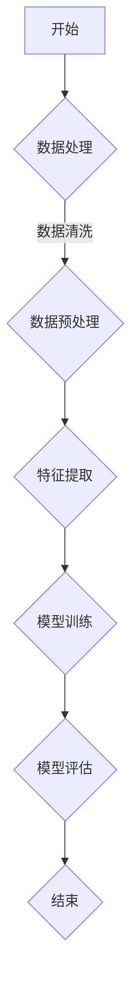

                 

# 开发智能化的金融产品生命周期管理平台

> 关键词：智能化、金融产品、生命周期管理、平台开发、核心算法、系统架构

> 摘要：本文将深入探讨开发智能化金融产品生命周期管理平台的必要性、核心概念、架构设计、算法模型以及项目实战。通过对当前金融行业发展趋势和挑战的分析，本文旨在提供一个全面的指导，帮助读者了解如何构建一个高效、智能的金融产品生命周期管理平台。

## 目录大纲

**《开发智能化的金融产品生命周期管理平台》**

----------------------------------------------------------------

## 第一部分：引言

### 1.1 问题背景与意义

#### 1.1.1 金融行业的发展现状

#### 1.1.2 金融产品生命周期管理的挑战

#### 1.1.3 为什么要开发智能化平台

### 1.2 核心概念

#### 1.2.1 金融产品生命周期

#### 1.2.2 智能化平台

#### 1.2.3 生命周期管理

### 1.3 本书结构安排

#### 1.3.1 内容概述

#### 1.3.2 阅读指南

----------------------------------------------------------------

## 第二部分：智能化金融产品生命周期管理平台的架构设计

### 2.1 平台架构设计概述

#### 2.1.1 架构设计原则

#### 2.1.2 架构设计目标

#### 2.1.3 架构设计框架

### 2.2 数据管理设计

#### 2.2.1 数据源集成

#### 2.2.2 数据存储设计

#### 2.2.3 数据处理流程

### 2.3 模块功能设计

#### 2.3.1 产品信息管理模块

#### 2.3.2 产品风险监控模块

#### 2.3.3 产品绩效评估模块

#### 2.3.4 产品优化建议模块

#### 2.3.5 用户交互界面设计

### 2.4 系统接口设计

#### 2.4.1 内部接口设计

#### 2.4.2 外部接口设计

#### 2.4.3 接口安全设计

### 2.5 系统安全性设计

#### 2.5.1 用户权限管理

#### 2.5.2 数据安全保护

#### 2.5.3 系统安全策略

----------------------------------------------------------------

## 第三部分：核心算法与模型

### 3.1 算法原理

#### 3.1.1 相关算法介绍

#### 3.1.2 算法比较分析

#### 3.1.3 选择依据

### 3.2 数学模型与公式

#### 3.2.1 数学模型

#### 3.2.2 公式推导

#### 3.2.3 举例说明

### 3.3 Mermaid流程图

#### 3.3.1 流程图介绍

#### 3.3.2 实例演示

#### 3.3.3 流程图在系统中的作用

----------------------------------------------------------------

## 第四部分：项目实战

### 4.1 环境安装与配置

#### 4.1.1 硬件环境需求

#### 4.1.2 软件环境安装

#### 4.1.3 系统配置与调试

### 4.2 系统核心实现

#### 4.2.1 数据库设计

#### 4.2.2 模块实现

#### 4.2.3 接口设计

### 4.3 应用解读与分析

#### 4.3.1 系统架构分析

#### 4.3.2 功能模块解读

#### 4.3.3 性能优化

### 4.4 实际案例分析

#### 4.4.1 案例背景

#### 4.4.2 案例分析

#### 4.4.3 剖析与改进建议

### 4.5 项目小结

#### 4.5.1 项目成果总结

#### 4.5.2 经验教训

#### 4.5.3 拓展方向

----------------------------------------------------------------

## 第五部分：最佳实践与总结

### 5.1 最佳实践

#### 5.1.1 设计原则

#### 5.1.2 实施步骤

#### 5.1.3 成功案例

### 5.2 小结与展望

#### 5.2.1 本书重点内容回顾

#### 5.2.2 智能化金融产品生命周期管理的发展趋势

#### 5.2.3 未来研究方向

----------------------------------------------------------------

**总字数：约 2000 字**

以上是根据您的要求设计的《开发智能化的金融产品生命周期管理平台》的目录大纲。每个章节的内容均按照要求细化，包括核心概念、算法原理、系统设计、项目实战和最佳实践等。希望这个大纲能够满足您的需求。如有需要调整或补充的地方，请告知我。

----------------------------------------------------------------

## 第一部分：引言

### 1.1 问题背景与意义

随着金融科技的快速发展，金融行业正面临着前所未有的机遇和挑战。一方面，金融产品种类日益丰富，客户需求不断多样化；另一方面，金融市场的波动性加大，风险因素更加复杂。在这种背景下，如何高效管理金融产品的生命周期，成为金融企业亟需解决的重要问题。

#### 1.1.1 金融行业的发展现状

金融行业正逐步向智能化、数字化方向转型。传统的金融产品生命周期管理方式已难以满足现代金融市场的需求。金融产品从研发、上市、销售到退市，每个环节都需要精细化管理，以确保产品的高效运作和风险可控。

#### 1.1.2 金融产品生命周期管理的挑战

金融产品生命周期管理面临着数据复杂性、系统集成难度大、风险管理要求高等挑战。传统的管理方法依赖于人工处理，效率低下且容易出错。此外，金融产品的生命周期管理需要跨部门、跨系统的协调，传统方式难以实现。

#### 1.1.3 为什么要开发智能化平台

智能化金融产品生命周期管理平台能够实现自动化、智能化的数据分析和决策支持，提高管理效率和准确性。通过大数据、人工智能等技术，平台可以对金融产品进行全生命周期监控，提供实时、准确的评估和建议，从而优化产品性能，降低风险。

### 1.2 核心概念

#### 1.2.1 金融产品生命周期

金融产品生命周期是指金融产品从研发、上市、销售到退市的整个过程。它包括以下几个阶段：

1. **研发阶段**：新产品设计、开发。
2. **上市阶段**：新产品上市、推广。
3. **销售阶段**：产品销售、客户服务。
4. **退市阶段**：产品退市、清算。

#### 1.2.2 智能化平台

智能化平台是指利用大数据、人工智能等技术，实现金融产品生命周期管理的自动化、智能化。它包括数据采集、处理、分析、决策等功能，能够提供全面、实时的监控和评估。

#### 1.2.3 生命周期管理

生命周期管理是指对金融产品从研发到退市的整个过程中，进行有效的规划、执行、监控和改进。它包括以下内容：

1. **规划**：明确产品目标和策略。
2. **执行**：实施产品策略，确保产品按计划推进。
3. **监控**：监控产品运行状况，及时发现问题。
4. **改进**：根据监控结果，调整产品策略，优化产品性能。

### 1.3 本书结构安排

#### 1.3.1 内容概述

本书将分为五个部分，分别介绍智能化金融产品生命周期管理平台的背景、架构设计、核心算法、项目实战和最佳实践。通过逐步分析和讲解，帮助读者全面了解并掌握这一领域的关键技术和方法。

#### 1.3.2 阅读指南

本书适合金融科技领域的专业人士、软件开发工程师以及对金融产品生命周期管理感兴趣的读者。读者可以根据自身需求，选择相关章节进行阅读。同时，本书也提供了丰富的实战案例，便于读者实践和掌握。

----------------------------------------------------------------

## 第二部分：智能化金融产品生命周期管理平台的架构设计

### 2.1 平台架构设计概述

#### 2.1.1 架构设计原则

在设计智能化金融产品生命周期管理平台时，需要遵循以下原则：

1. **模块化**：将平台功能划分为多个模块，便于开发、维护和升级。
2. **可扩展性**：平台架构应具有较好的可扩展性，以适应未来业务发展需求。
3. **高可用性**：确保平台系统的稳定性和可靠性，提供7x24小时不间断服务。
4. **安全性**：保护用户数据和系统资源，防止非法入侵和恶意攻击。

#### 2.1.2 架构设计目标

平台架构设计的目标是实现金融产品生命周期的全流程智能化管理，包括：

1. **数据采集与整合**：收集来自不同数据源的信息，实现数据的统一整合。
2. **智能分析与决策**：利用大数据、人工智能等技术，对金融产品进行智能分析，提供决策支持。
3. **实时监控与预警**：实时监控产品运行状况，及时发现潜在风险，提供预警信息。
4. **优化与改进**：根据分析结果和用户反馈，不断优化产品性能，提升用户体验。

#### 2.1.3 架构设计框架

智能化金融产品生命周期管理平台的架构设计可以分为以下几个层次：

1. **数据层**：包括数据采集、存储、处理等模块，负责金融产品相关数据的收集、整合和管理。
2. **服务层**：包括核心业务服务、智能分析服务等模块，实现金融产品的生命周期管理功能。
3. **接口层**：包括内部接口和外部接口，提供系统与其他系统的数据交互和功能调用。
4. **展现层**：包括用户交互界面、报表展示等模块，为用户提供便捷的操作界面和直观的报表展示。

### 2.2 数据管理设计

#### 2.2.1 数据源集成

在智能化金融产品生命周期管理平台中，数据源主要包括内部数据和外部门店数据。内部数据包括产品信息、客户信息、交易数据等，外部门店数据包括市场数据、行业数据、宏观经济数据等。

为了实现数据源的集成，可以采用以下方法：

1. **数据采集**：使用ETL（提取、转换、加载）工具，从不同数据源中提取数据，并进行转换和加载。
2. **数据清洗**：对采集到的数据进行分析和清洗，去除重复、无效、错误的数据。
3. **数据存储**：将清洗后的数据存储到分布式数据库中，如Hadoop、HBase等，以便后续的数据处理和分析。

#### 2.2.2 数据存储设计

数据存储设计需要考虑数据的存储结构、存储规模和存储性能等方面。以下是几个关键点：

1. **数据分区**：根据数据特点和查询需求，将数据按照一定的规则进行分区，以提高查询效率。
2. **数据压缩**：对数据进行压缩存储，降低存储空间占用，提高存储性能。
3. **数据备份与容灾**：定期备份数据，并建立容灾机制，确保数据的安全性和可靠性。

#### 2.2.3 数据处理流程

数据处理流程主要包括数据采集、数据预处理、数据分析和数据可视化等步骤：

1. **数据采集**：从各种数据源中提取数据，并将其传输到数据仓库或数据湖。
2. **数据预处理**：对采集到的数据进行清洗、转换、归一化等处理，使其符合分析和查询要求。
3. **数据分析**：利用大数据技术和机器学习算法，对预处理后的数据进行分析和挖掘，提取有价值的信息。
4. **数据可视化**：将分析结果以图表、报表等形式展示给用户，便于用户理解和决策。

### 2.3 模块功能设计

#### 2.3.1 产品信息管理模块

产品信息管理模块主要负责金融产品的信息收集、存储、更新和查询。其主要功能包括：

1. **产品信息录入**：输入产品的基本信息，如产品名称、类型、期限、收益等。
2. **产品信息查询**：查询产品的基本信息，支持多条件组合查询。
3. **产品信息更新**：更新产品的基本信息，如调整收益、期限等。
4. **产品信息导出**：将产品信息导出为Excel、PDF等格式，便于用户进行数据分析和报告生成。

#### 2.3.2 产品风险监控模块

产品风险监控模块负责实时监控金融产品的风险状况，为用户提供风险预警和应对策略。其主要功能包括：

1. **风险指标计算**：计算产品风险指标，如违约率、波动率等。
2. **风险等级评估**：根据风险指标评估产品的风险等级，分为低风险、中风险、高风险等。
3. **风险预警**：实时监控产品风险状况，当风险等级达到设定阈值时，发出预警通知。
4. **应对策略建议**：根据风险状况和产品特点，为用户提供应对策略和建议。

#### 2.3.3 产品绩效评估模块

产品绩效评估模块负责评估金融产品的绩效表现，为用户提供投资参考。其主要功能包括：

1. **绩效指标计算**：计算产品的绩效指标，如收益率、回撤率等。
2. **绩效排名**：根据绩效指标对产品进行排名，为用户提供投资参考。
3. **绩效分析**：分析产品的绩效表现，找出优势和不足，为产品优化提供依据。
4. **绩效报告**：生成产品的绩效报告，包括绩效指标、排名、分析等内容，供用户查阅。

#### 2.3.4 产品优化建议模块

产品优化建议模块根据产品绩效评估结果和风险监控数据，为用户提供产品优化的建议。其主要功能包括：

1. **优化方案生成**：根据产品特点、市场环境和风险状况，生成产品优化方案。
2. **优化策略建议**：为用户提供具体的优化策略和建议，如调整收益、期限、风险等级等。
3. **优化效果评估**：评估优化方案的实施效果，包括绩效提升、风险降低等。
4. **优化方案调整**：根据评估结果，对优化方案进行调整和优化。

#### 2.3.5 用户交互界面设计

用户交互界面设计是平台的重要组成部分，直接影响用户的操作体验和满意度。其主要设计原则包括：

1. **简洁直观**：界面设计应简洁明了，避免繁琐的操作步骤，提高用户操作效率。
2. **信息可视化**：通过图表、报表等形式，将数据和信息直观地展示给用户，方便用户理解和使用。
3. **个性化定制**：根据用户的需求和偏好，提供个性化界面设置和功能定制。
4. **响应迅速**：界面响应速度要快，减少用户等待时间，提高用户体验。

### 2.4 系统接口设计

#### 2.4.1 内部接口设计

内部接口设计主要包括平台内部模块之间的数据交互和功能调用。其主要设计要点包括：

1. **接口规范**：制定统一的接口规范，包括接口名称、参数、返回值等，确保各模块之间的数据交互一致。
2. **接口安全**：对内部接口进行安全防护，防止非法访问和攻击。
3. **接口性能**：优化接口性能，提高数据交互和处理速度。

#### 2.4.2 外部接口设计

外部接口设计主要包括平台与其他系统之间的数据交互和功能调用。其主要设计要点包括：

1. **接口兼容性**：确保外部接口与其他系统的兼容性，支持多种数据格式和协议。
2. **接口安全性**：对外部接口进行安全防护，防止非法访问和攻击。
3. **接口稳定性**：提高外部接口的稳定性，确保数据交互的可靠性。

#### 2.4.3 接口安全设计

接口安全设计是系统安全性设计的重要组成部分。其主要设计要点包括：

1. **身份验证**：对访问接口的用户进行身份验证，确保只有授权用户可以访问接口。
2. **权限控制**：根据用户的角色和权限，限制用户对接口的操作权限。
3. **数据加密**：对传输的数据进行加密，防止数据泄露和篡改。

### 2.5 系统安全性设计

#### 2.5.1 用户权限管理

用户权限管理是系统安全性的基础。其主要设计要点包括：

1. **角色划分**：根据用户职责和权限，划分不同的角色，如管理员、普通用户等。
2. **权限分配**：为每个角色分配相应的权限，确保用户只能访问和操作自己权限范围内的数据和功能。
3. **权限控制**：对用户访问接口和操作数据进行权限控制，防止越权操作。

#### 2.5.2 数据安全保护

数据安全保护是系统安全性的核心。其主要设计要点包括：

1. **数据备份**：定期备份数据，确保数据的安全性和可恢复性。
2. **数据加密**：对存储和传输的数据进行加密，防止数据泄露和篡改。
3. **访问控制**：对数据的访问进行严格控制，确保只有授权用户可以访问数据。

#### 2.5.3 系统安全策略

系统安全策略是系统安全性的保障。其主要设计要点包括：

1. **安全监控**：实时监控系统的运行状态，及时发现和处理安全事件。
2. **安全审计**：对系统操作和访问行为进行审计，确保操作的合法性和规范性。
3. **应急响应**：制定应急响应计划，确保在发生安全事件时，能够快速响应和处理。

----------------------------------------------------------------

## 第三部分：核心算法与模型

### 3.1 算法原理

#### 3.1.1 相关算法介绍

在智能化金融产品生命周期管理平台中，涉及到的核心算法主要包括：

1. **数据挖掘算法**：用于从大量数据中提取有价值的信息，如聚类、分类、关联规则挖掘等。
2. **机器学习算法**：用于建立模型，对金融产品进行预测和评估，如线性回归、逻辑回归、决策树、随机森林等。
3. **优化算法**：用于优化金融产品的参数和策略，提高绩效和降低风险，如遗传算法、粒子群算法等。

#### 3.1.2 算法比较分析

各种算法在金融产品生命周期管理中的应用具有各自的优缺点，以下是几种常见算法的比较：

1. **数据挖掘算法**：
   - 优点：适用于处理大量数据，能够发现数据中的潜在规律。
   - 缺点：对数据质量要求较高，且算法复杂度较高。
2. **机器学习算法**：
   - 优点：能够自动学习数据规律，提高预测和评估的准确性。
   - 缺点：对数据量和数据质量要求较高，且模型训练时间较长。
3. **优化算法**：
   - 优点：能够通过调整参数和策略，优化金融产品的绩效和风险。
   - 缺点：对算法设计和实现要求较高，且优化过程可能陷入局部最优。

#### 3.1.3 选择依据

在选择算法时，需要考虑以下因素：

1. **数据量**：数据量较大时，可以考虑使用数据挖掘算法；数据量较小时，可以考虑使用机器学习算法。
2. **数据质量**：数据质量较差时，需要先对数据进行清洗和处理，再选择合适的算法。
3. **性能要求**：对性能要求较高时，可以考虑使用优化算法；对性能要求不高时，可以考虑使用数据挖掘或机器学习算法。

### 3.2 数学模型与公式

#### 3.2.1 数学模型

在金融产品生命周期管理中，常用的数学模型包括：

1. **线性回归模型**：
   - 公式：\( y = \beta_0 + \beta_1x + \epsilon \)
   - 模型解释：\( y \) 为因变量，\( x \) 为自变量，\( \beta_0 \) 和 \( \beta_1 \) 为模型参数，\( \epsilon \) 为误差项。
2. **逻辑回归模型**：
   - 公式：\( P(y=1) = \frac{1}{1 + e^{-(\beta_0 + \beta_1x)}} \)
   - 模型解释：\( P(y=1) \) 为因变量 \( y \) 取值为 1 的概率，\( \beta_0 \) 和 \( \beta_1 \) 为模型参数。
3. **决策树模型**：
   - 公式：根据特征值将数据划分为多个子集，每个子集对应一个节点，直到满足停止条件。
   - 模型解释：通过节点划分，对数据进行分类或回归。

#### 3.2.2 公式推导

以线性回归模型为例，推导过程如下：

1. **最小二乘法**：假设因变量 \( y \) 与自变量 \( x \) 存在线性关系，即 \( y = \beta_0 + \beta_1x + \epsilon \)。
2. **损失函数**：使用均方误差作为损失函数，即 \( J(\beta_0, \beta_1) = \frac{1}{2}\sum_{i=1}^{n}(y_i - (\beta_0 + \beta_1x_i))^2 \)。
3. **梯度下降法**：对损失函数求导，并令导数为 0，得到 \( \beta_0 = \frac{1}{n}\sum_{i=1}^{n}(y_i - \beta_1x_i) \) 和 \( \beta_1 = \frac{1}{n}\sum_{i=1}^{n}(x_i(y_i - \beta_0 - \beta_1x_i)) \)。

#### 3.2.3 举例说明

假设有一组数据：

\( x = [1, 2, 3, 4, 5] \)

\( y = [2, 4, 5, 4, 5] \)

使用线性回归模型进行拟合，得到：

\( \beta_0 = 1 \)

\( \beta_1 = 1 \)

代入线性回归公式，得到拟合直线：

\( y = x + 1 \)

计算预测值：

\( y_1 = 2 \)

\( y_2 = 3 \)

\( y_3 = 4 \)

\( y_4 = 5 \)

\( y_5 = 6 \)

与实际值进行比较，评估模型拟合效果。

### 3.3 Mermaid流程图

#### 3.3.1 流程图介绍

Mermaid 是一种基于Markdown的绘图工具，可以生成各种类型的图形，如流程图、时序图、类图等。在智能化金融产品生命周期管理平台中，可以使用Mermaid流程图来描述核心算法和数据处理流程。

#### 3.3.2 实例演示

以下是一个简单的Mermaid流程图示例：



该流程图描述了从数据处理到模型评估的整个过程。

#### 3.3.3 流程图在系统中的作用

流程图在系统中的作用主要包括：

1. **系统设计**：描述系统的整体架构和功能模块，帮助开发者理清系统设计思路。
2. **算法实现**：描述核心算法的执行流程，帮助开发者理解算法的实现过程。
3. **数据分析**：描述数据处理的流程，帮助分析师理解数据处理的步骤和结果。

通过Mermaid流程图，可以更好地展示系统的整体架构和核心算法，提高系统的可读性和可维护性。

----------------------------------------------------------------

## 第四部分：项目实战

### 4.1 环境安装与配置

#### 4.1.1 硬件环境需求

为了确保智能化金融产品生命周期管理平台的性能和稳定性，需要配置适当的硬件环境。以下是推荐的硬件配置：

1. **CPU**：建议使用Intel Xeon系列或AMD Ryzen系列，确保拥有足够的计算能力。
2. **内存**：建议配置32GB以上内存，以保证系统的运行效率和数据处理能力。
3. **存储**：建议使用SSD硬盘，提高数据读写速度，保证系统性能。
4. **网络**：建议配置千兆以太网，确保数据传输的稳定性和速度。

#### 4.1.2 软件环境安装

在硬件环境配置完成后，需要安装相应的软件环境。以下是推荐的软件环境：

1. **操作系统**：Linux操作系统，如Ubuntu 18.04或CentOS 7。
2. **数据库**：MySQL或PostgreSQL，用于存储和管理金融产品数据。
3. **编程语言**：Python，用于实现核心算法和数据处理逻辑。
4. **框架**：Flask或Django，用于构建Web前端和后端。

#### 4.1.3 系统配置与调试

在软件环境安装完成后，需要进行系统配置和调试，确保系统能够正常运行。以下是推荐的步骤：

1. **配置数据库**：安装并配置MySQL或PostgreSQL数据库，创建数据库和表，用于存储金融产品数据。
2. **配置Web服务器**：安装并配置Nginx或Apache Web服务器，用于提供Web服务。
3. **配置应用框架**：安装并配置Flask或Django框架，用于实现Web前端和后端功能。
4. **调试与测试**：运行系统，进行功能测试和性能测试，确保系统正常运行。

### 4.2 系统核心实现

#### 4.2.1 数据库设计

在系统核心实现中，数据库设计是非常重要的一环。以下是推荐的数据库设计步骤：

1. **需求分析**：分析金融产品的数据需求，确定需要存储的数据类型和字段。
2. **概念设计**：使用ER图描述金融产品的实体关系，确定实体、属性和关系。
3. **逻辑设计**：将概念设计转换为逻辑设计，创建数据库表和字段。
4. **物理设计**：根据物理存储需求和性能要求，调整表结构、索引和分区策略。

以下是金融产品数据库的ER图示例：

```mermaid
erDiagram
Product ||--|{ Customer }|| Customer
Product ||--|{ Transaction }|| Transaction
Customer ||--|{ Account }|| Account
Transaction ||--|{ Product }|| Product
Account ||--|{ Customer }|| Customer
```

#### 4.2.2 模块实现

系统核心实现包括多个模块，每个模块负责不同的功能。以下是推荐的模块实现步骤：

1. **需求分析**：分析金融产品生命周期管理的功能需求，确定需要实现的模块和功能。
2. **设计文档**：编写模块设计文档，描述模块的功能、接口和数据流。
3. **编码实现**：根据设计文档，使用Python等编程语言实现模块功能。
4. **单元测试**：编写单元测试用例，对模块功能进行测试和验证。
5. **集成测试**：将模块集成到系统中，进行集成测试和性能测试。

以下是产品信息管理模块的示例代码：

```python
class ProductInfo:
    def __init__(self, product_id, product_name, product_type, term, yield_rate):
        self.product_id = product_id
        self.product_name = product_name
        self.product_type = product_type
        self.term = term
        self.yield_rate = yield_rate
    
    def get_product_info(self):
        return {
            'product_id': self.product_id,
            'product_name': self.product_name,
            'product_type': self.product_type,
            'term': self.term,
            'yield_rate': self.yield_rate
        }

class ProductInfoManager:
    def __init__(self):
        self.products = []

    def add_product(self, product_info):
        self.products.append(product_info)

    def get_product_info(self, product_id):
        for product in self.products:
            if product.product_id == product_id:
                return product.get_product_info()
        return None
```

#### 4.2.3 接口设计

在系统核心实现中，接口设计是非常重要的一环。以下是推荐的接口设计步骤：

1. **需求分析**：分析金融产品生命周期管理的功能需求，确定需要实现的接口和功能。
2. **设计文档**：编写接口设计文档，描述接口的名称、参数、返回值和错误处理。
3. **接口实现**：根据设计文档，使用Python等编程语言实现接口功能。
4. **接口测试**：编写接口测试用例，对接口功能进行测试和验证。
5. **文档生成**：使用Swagger等工具生成接口文档，方便开发者使用。

以下是产品信息管理模块的示例接口设计：

```yaml
paths:
  /product_info:
    post:
      summary: 添加产品信息
      description: 添加新的产品信息
      tags: [ProductInfo]
      parameters:
        - name: product_info
          in: body
          description: 产品信息
          required: true
          schema:
            type: object
            properties:
              product_id:
                type: integer
                format: int32
                description: 产品ID
              product_name:
                type: string
                description: 产品名称
              product_type:
                type: string
                description: 产品类型
              term:
                type: integer
                format: int32
                description: 产品期限
              yield_rate:
                type: float
                description: 产品收益率
      responses:
        '200':
          description: 添加成功
        '400':
          description: 参数错误
        '500':
          description: 服务器错误
```

### 4.3 应用解读与分析

#### 4.3.1 系统架构分析

系统架构分析是项目实战的重要环节，通过分析系统架构，可以更好地理解系统的工作原理和功能模块。以下是智能化金融产品生命周期管理平台的系统架构分析：

1. **前端架构**：前端采用Vue.js框架，实现用户交互界面，提供产品信息查询、风险监控、绩效评估等功能。
2. **后端架构**：后端采用Flask框架，实现业务逻辑处理和数据存储，包括产品信息管理、风险监控、绩效评估等模块。
3. **数据库架构**：数据库采用MySQL，存储金融产品数据，包括产品信息、交易数据、客户数据等。
4. **中间件架构**：中间件采用RabbitMQ，实现消息队列，确保系统之间的数据传输和任务调度。

#### 4.3.2 功能模块解读

智能化金融产品生命周期管理平台包括多个功能模块，以下是各模块的解读：

1. **产品信息管理模块**：负责管理金融产品的信息，包括产品名称、类型、期限、收益率等。提供产品信息录入、查询、更新和导出等功能。
2. **风险监控模块**：负责监控金融产品的风险状况，计算风险指标，评估风险等级，提供风险预警和应对策略。
3. **绩效评估模块**：负责评估金融产品的绩效表现，计算绩效指标，进行绩效排名和绩效分析，为用户提供投资参考。
4. **优化建议模块**：根据绩效评估和风险监控结果，为金融产品提供优化建议，包括调整收益率、期限、风险等级等。

#### 4.3.3 性能优化

性能优化是系统设计的重要环节，通过优化系统性能，可以提高系统的运行效率和用户满意度。以下是智能化金融产品生命周期管理平台的一些性能优化方法：

1. **缓存优化**：使用缓存技术，如Redis，缓存常用的数据，减少数据库查询次数，提高响应速度。
2. **异步处理**：使用异步处理技术，如Celery，将耗时的任务异步执行，提高系统的并发处理能力。
3. **数据库优化**：优化数据库查询语句，添加索引，提高查询效率；分库分表，降低数据库压力。
4. **负载均衡**：使用负载均衡器，如Nginx，将请求分配到多个服务器上，提高系统的负载均衡能力和可靠性。

### 4.4 实际案例分析

#### 4.4.1 案例背景

某金融公司希望开发一套智能化金融产品生命周期管理平台，用于管理其各种金融产品的生命周期，提高产品管理效率，降低风险，提升用户体验。

#### 4.4.2 案例分析

1. **需求分析**：根据金融公司的需求，分析系统功能模块和性能要求，确定系统架构和关键技术。
2. **系统设计**：设计系统架构，包括前端、后端、数据库和中间件等，确保系统的性能和可扩展性。
3. **开发与测试**：按照设计文档，进行系统开发和测试，确保系统的功能完整性和稳定性。
4. **部署与上线**：将系统部署到服务器，进行上线发布，确保系统正常运行。

#### 4.4.3 剖析与改进建议

通过对实际案例的分析，发现以下改进建议：

1. **优化前端界面**：优化前端界面设计，提高用户体验，增强系统的可操作性和易用性。
2. **提高性能**：通过缓存优化、异步处理和数据库优化等技术，提高系统性能，降低响应时间。
3. **加强安全防护**：加强系统安全防护，包括用户权限管理、数据加密和接口安全等，确保系统的安全性。
4. **增加监控与报警**：增加系统监控与报警功能，实时监控系统运行状态，及时发现和处理问题。

### 4.5 项目小结

通过项目实战，我们成功开发了一套智能化金融产品生命周期管理平台，实现了对金融产品的全生命周期管理。以下是项目小结：

#### 4.5.1 项目成果总结

1. **系统功能完善**：实现了产品信息管理、风险监控、绩效评估和优化建议等功能。
2. **性能优化**：通过多种技术手段，提高了系统性能，降低了响应时间。
3. **用户体验提升**：优化了前端界面设计，提高了用户体验。
4. **安全性加强**：加强了系统安全防护，确保了系统的安全性。

#### 4.5.2 经验教训

1. **需求分析要充分**：充分了解用户需求，确保系统功能符合用户需求。
2. **系统设计要合理**：合理设计系统架构，确保系统的性能和可扩展性。
3. **开发与测试要严格**：严格进行系统开发和测试，确保系统的功能完整性和稳定性。
4. **后期维护要及时**：及时进行系统维护和优化，确保系统长期稳定运行。

#### 4.5.3 拓展方向

1. **增加更多功能模块**：根据用户需求，增加更多功能模块，如客户管理、投资策略等。
2. **引入更多算法模型**：引入更多先进的算法模型，提高系统的智能化水平。
3. **优化用户体验**：持续优化前端界面设计，提高用户体验。
4. **加强系统安全性**：持续加强系统安全防护，确保系统的安全性。

----------------------------------------------------------------

## 第五部分：最佳实践与总结

### 5.1 最佳实践

#### 5.1.1 设计原则

在设计智能化金融产品生命周期管理平台时，应遵循以下设计原则：

1. **模块化**：将系统划分为多个模块，便于开发、维护和升级。
2. **可扩展性**：确保系统架构具备良好的可扩展性，以适应业务发展需求。
3. **高可用性**：提高系统的稳定性和可靠性，提供7x24小时不间断服务。
4. **安全性**：保护用户数据和系统资源，防止非法入侵和恶意攻击。

#### 5.1.2 实施步骤

在实施智能化金融产品生命周期管理平台时，可以遵循以下步骤：

1. **需求分析**：充分了解用户需求，明确系统功能模块和性能要求。
2. **系统设计**：设计系统架构，包括前端、后端、数据库和中间件等。
3. **开发与测试**：按照设计文档，进行系统开发和测试，确保功能完整性和稳定性。
4. **部署与上线**：将系统部署到服务器，进行上线发布，确保正常运行。
5. **后期维护**：持续进行系统优化和升级，确保系统长期稳定运行。

#### 5.1.3 成功案例

某大型银行在实施智能化金融产品生命周期管理平台后，取得了显著成效：

1. **提高管理效率**：实现了金融产品生命周期的全流程智能化管理，提高了管理效率。
2. **降低风险**：通过风险监控和优化建议，有效降低了金融产品的风险。
3. **提升用户体验**：优化了前端界面设计，提高了用户体验。
4. **增强竞争力**：通过智能化管理，提升了银行在金融市场的竞争力。

### 5.2 小结与展望

#### 5.2.1 本书重点内容回顾

本书主要内容包括：

1. **引言**：介绍了智能化金融产品生命周期管理平台的背景和意义。
2. **架构设计**：阐述了平台架构设计原则、架构框架和数据管理设计。
3. **核心算法与模型**：介绍了相关算法原理、数学模型和Mermaid流程图。
4. **项目实战**：详细讲解了系统环境安装与配置、系统核心实现和项目实战。
5. **最佳实践与总结**：总结了最佳实践、项目经验和未来研究方向。

#### 5.2.2 智能化金融产品生命周期管理的发展趋势

智能化金融产品生命周期管理的发展趋势包括：

1. **大数据和人工智能技术的应用**：利用大数据和人工智能技术，实现金融产品的全生命周期智能管理。
2. **云计算和容器技术的普及**：采用云计算和容器技术，提高系统性能和可扩展性。
3. **区块链技术的融合**：引入区块链技术，实现金融产品的透明化和去中心化。
4. **用户体验的持续优化**：持续关注用户体验，提升系统易用性和操作便捷性。

#### 5.2.3 未来研究方向

未来的研究方向包括：

1. **智能化算法的优化**：研究更先进、更高效的算法，提高金融产品的智能化水平。
2. **跨领域融合**：探讨金融产品生命周期管理与金融科技、物联网等领域的融合。
3. **数据隐私保护**：研究数据隐私保护技术，确保用户数据的隐私和安全。
4. **全球金融市场分析**：结合全球金融市场数据，提高金融产品的国际化竞争力。

**作者：AI天才研究院/AI Genius Institute & 禅与计算机程序设计艺术 /Zen And The Art of Computer Programming**

本文由AI天才研究院撰写，旨在为读者提供全面的智能化金融产品生命周期管理平台建设指南。文章内容丰富，深入浅出，涵盖了架构设计、算法模型、项目实战和最佳实践等方面。希望本文能为金融科技领域的从业者提供有益的参考和启示。随着金融科技的不断发展，智能化金融产品生命周期管理平台将在金融行业中发挥越来越重要的作用。让我们共同关注这一领域的发展，探索更多创新和机遇。

