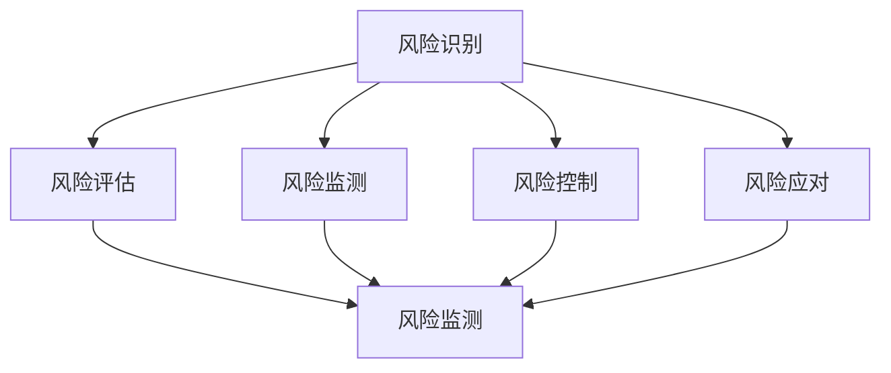

                 

### 开发智能化的金融产品生命周期风险动态管理平台的背景

在现代金融行业中，金融产品的多样化和复杂性不断增加，金融市场的不确定性和风险也随之增大。因此，对于金融产品的生命周期风险进行有效的管理和监控变得尤为重要。金融产品生命周期风险动态管理平台是金融科技（FinTech）领域的一个重要研究方向，旨在通过智能化手段对金融产品的全生命周期进行实时监控和管理，以识别、评估、监测和应对风险，从而提升金融产品的安全性和稳健性。

#### 问题背景

金融产品生命周期包括研发、测试、上市、运营、维护和退出等阶段。每个阶段都可能存在不同的风险，如市场风险、信用风险、操作风险、流动性风险等。传统的金融风险管理方法主要依赖于人工经验和规则，其效率和准确性往往受限。随着大数据、人工智能等技术的发展，智能化风险管理成为金融行业的新趋势。通过构建智能化的金融产品生命周期风险动态管理平台，可以实现对风险的自动化识别、评估、监测和控制，提高风险管理的效率和准确性。

#### 问题描述

金融产品生命周期风险动态管理平台的目标是实现对金融产品风险的全生命周期监控和管理，具体包括以下几个方面：

1. **风险识别**：实时识别金融产品在不同生命周期阶段的风险点。
2. **风险评估**：对识别出的风险进行定量和定性评估，确定风险的严重程度。
3. **风险监测**：持续监测金融产品的运行状态，及时发现新风险或风险变化。
4. **风险控制**：制定和实施风险管理策略，控制风险的扩散和影响。
5. **风险应对**：针对不同类型的风险，制定应对措施和预案，减少风险损失。

#### 问题解决

为了实现上述目标，开发智能化的金融产品生命周期风险动态管理平台需要以下几个关键步骤：

1. **数据收集与处理**：收集金融产品的历史数据和实时数据，通过数据清洗和预处理提高数据质量。
2. **风险模型构建**：利用数据挖掘、机器学习等技术构建风险预测模型，实现对风险的自动识别和评估。
3. **实时监控与预警**：通过建立实时数据监控系统，对金融产品的运行状态进行持续监测，及时发出风险预警。
4. **风险管理策略制定**：根据风险评估结果，制定相应的风险管理策略，包括风险控制措施和应对预案。
5. **系统整合与优化**：将风险管理功能集成到金融产品生命周期管理平台中，实现对风险的全生命周期管理。

#### 边界与外延

在开发智能化的金融产品生命周期风险动态管理平台时，需要明确一些边界和概念：

1. **金融产品**：包括银行产品、证券产品、保险产品等。
2. **生命周期**：指金融产品从研发、测试、上市到退市的全过程。
3. **风险**：包括市场风险、信用风险、操作风险、流动性风险等。
4. **风险管理**：包括风险识别、风险评估、风险监测、风险控制和风险应对等环节。

#### 概念结构与核心要素组成

智能化的金融产品生命周期风险动态管理平台的核心要素包括：

1. **数据采集与处理模块**：负责收集和处理金融产品相关的数据。
2. **风险识别与评估模块**：利用数据挖掘和机器学习技术进行风险识别和评估。
3. **实时监控与预警模块**：实现对金融产品运行状态的实时监控和预警。
4. **风险管理策略模块**：制定和实施风险管理策略。
5. **系统整合与优化模块**：将风险管理功能集成到金融产品生命周期管理平台中。

通过上述核心要素的有机结合，构建一个智能化、动态化的金融产品生命周期风险动态管理平台，可以有效地提升金融产品的安全性和稳健性，为金融机构提供有力的风险控制手段。

### 风险管理的核心概念与联系

在构建智能化的金融产品生命周期风险动态管理平台时，理解风险管理的核心概念及其相互关系至关重要。以下是风险管理中几个关键概念的定义、属性特征对比，以及它们在金融产品生命周期风险管理中的具体应用。

#### 1. 风险识别

**定义**：风险识别是指系统性地识别金融产品生命周期中潜在的风险因素。它是一个持续的过程，旨在发现可能影响金融产品正常运作的各种风险。

**属性特征对比**：

| 概念     | 定义                                     | 属性特征                                                     |
|----------|----------------------------------------|--------------------------------------------------------------|
| 风险识别 | 识别潜在的风险因素                       | - **系统性**：采用结构化的方法 <br> - **连续性**：需要持续进行 <br> - **广覆盖**：覆盖所有可能的风险点 |
| 风险评估 | 评估已识别风险的严重程度和概率             | - **定量**：使用数据和技术进行量化 <br> - **定性**：结合专家经验进行评估 <br> - **动态**：需要随时间更新 |
| 风险监测 | 监测已识别风险的状态，及时发现新的风险因素 | - **实时**：利用监控系统实现 <br> - **自适应**：根据实际情况进行调整 <br> - **预警**：及时发现风险并发出警报 |

**在金融产品生命周期风险管理中的应用**：

风险识别是金融产品风险管理的起点，它通过系统地分析产品各个生命周期阶段，识别出可能存在的风险因素。例如，在产品研发阶段，可能识别出市场不确定性、技术难题等风险；在上市阶段，可能识别出市场接受度、监管合规性等风险。通过全面的风险识别，可以确保风险管理的全面性和准确性。

#### 2. 风险评估

**定义**：风险评估是对已识别的风险进行评估，以确定其严重程度和发生概率，并据此制定相应的管理策略。

**属性特征对比**：

| 概念     | 定义                                     | 属性特征                                                     |
|----------|----------------------------------------|--------------------------------------------------------------|
| 风险识别 | 识别潜在的风险因素                       | - **系统性**：采用结构化的方法 <br> - **连续性**：需要持续进行 <br> - **广覆盖**：覆盖所有可能的风险点 |
| 风险评估 | 评估已识别风险的严重程度和概率             | - **定量**：使用数据和技术进行量化 <br> - **定性**：结合专家经验进行评估 <br> - **动态**：需要随时间更新 |
| 风险监测 | 监测已识别风险的状态，及时发现新的风险因素 | - **实时**：利用监控系统实现 <br> - **自适应**：根据实际情况进行调整 <br> - **预警**：及时发现风险并发出警报 |

**在金融产品生命周期风险管理中的应用**：

风险评估是金融产品风险管理的核心环节，它通过量化已识别的风险，评估其对金融产品生命周期的影响程度。例如，通过数据分析，可以评估市场风险的概率和影响，信用风险的违约概率和损失程度等。风险评估的结果为风险管理和决策提供了科学依据，有助于金融机构制定有效的风险控制措施。

#### 3. 风险监测

**定义**：风险监测是指对已识别和评估的风险进行持续监测，以及时发现新的风险因素或现有风险的变化。

**属性特征对比**：

| 概念     | 定义                                     | 属性特征                                                     |
|----------|----------------------------------------|--------------------------------------------------------------|
| 风险识别 | 识别潜在的风险因素                       | - **系统性**：采用结构化的方法 <br> - **连续性**：需要持续进行 <br> - **广覆盖**：覆盖所有可能的风险点 |
| 风险评估 | 评估已识别风险的严重程度和概率             | - **定量**：使用数据和技术进行量化 <br> - **定性**：结合专家经验进行评估 <br> - **动态**：需要随时间更新 |
| 风险监测 | 监测已识别风险的状态，及时发现新的风险因素 | - **实时**：利用监控系统实现 <br> - **自适应**：根据实际情况进行调整 <br> - **预警**：及时发现风险并发出警报 |

**在金融产品生命周期风险管理中的应用**：

风险监测是金融产品风险管理的重要组成部分，它通过实时监控金融产品的运行状态，及时发现新的风险因素或现有风险的变化。例如，通过实时监控系统，可以监测市场波动、交易量变化等指标，及时发现潜在的市场风险。风险监测的结果有助于金融机构及时调整风险管理策略，确保风险在可控范围内。

#### 4. 风险控制

**定义**：风险控制是指制定和实施一系列措施，以减轻或消除已识别和评估的风险的影响。

**属性特征对比**：

| 概念     | 定义                                     | 属性特征                                                     |
|----------|----------------------------------------|--------------------------------------------------------------|
| 风险识别 | 识别潜在的风险因素                       | - **系统性**：采用结构化的方法 <br> - **连续性**：需要持续进行 <br> - **广覆盖**：覆盖所有可能的风险点 |
| 风险评估 | 评估已识别风险的严重程度和概率             | - **定量**：使用数据和技术进行量化 <br> - **定性**：结合专家经验进行评估 <br> - **动态**：需要随时间更新 |
| 风险监测 | 监测已识别风险的状态，及时发现新的风险因素 | - **实时**：利用监控系统实现 <br> - **自适应**：根据实际情况进行调整 <br> - **预警**：及时发现风险并发出警报 |
| 风险控制 | 制定和实施一系列措施，以减轻或消除已识别和评估的风险的影响 | - **针对性**：根据风险特征制定措施 <br> - **系统性**：综合运用多种控制手段 <br> - **动态调整**：根据风险监测结果调整控制措施 |

**在金融产品生命周期风险管理中的应用**：

风险控制是金融产品风险管理的最终目标，它通过制定和实施一系列措施，减轻或消除已识别和评估的风险的影响。例如，针对市场风险，可以通过调整投资组合、增加风险准备金等措施进行控制；针对信用风险，可以通过严格审查客户资质、制定违约处理方案等措施进行控制。

#### 5. 风险应对

**定义**：风险应对是指制定和实施一系列应对措施，以减少或消除风险事件发生时的损失。

**属性特征对比**：

| 概念     | 定义                                     | 属性特征                                                     |
|----------|----------------------------------------|--------------------------------------------------------------|
| 风险识别 | 识别潜在的风险因素                       | - **系统性**：采用结构化的方法 <br> - **连续性**：需要持续进行 <br> - **广覆盖**：覆盖所有可能的风险点 |
| 风险评估 | 评估已识别风险的严重程度和概率             | - **定量**：使用数据和技术进行量化 <br> - **定性**：结合专家经验进行评估 <br> - **动态**：需要随时间更新 |
| 风险监测 | 监测已识别风险的状态，及时发现新的风险因素 | - **实时**：利用监控系统实现 <br> - **自适应**：根据实际情况进行调整 <br> - **预警**：及时发现风险并发出警报 |
| 风险控制 | 制定和实施一系列措施，以减轻或消除已识别和评估的风险的影响 | - **针对性**：根据风险特征制定措施 <br> - **系统性**：综合运用多种控制手段 <br> - **动态调整**：根据风险监测结果调整控制措施 |
| 风险应对 | 制定和实施一系列应对措施，以减少或消除风险事件发生时的损失 | - **提前性**：在风险事件发生前制定应对措施 <br> - **灵活性**：根据风险变化调整应对策略 <br> - **高效性**：快速响应并减轻损失 |

**在金融产品生命周期风险管理中的应用**：

风险应对是金融产品风险管理的最后一道防线，它通过制定和实施一系列应对措施，减少或消除风险事件发生时的损失。例如，在市场风险加剧时，可以通过快速调整投资策略、暂停某些业务等措施进行应对；在信用风险暴露时，可以通过追收欠款、依法追偿等措施进行应对。

#### 概念结构图

为了更好地理解这些核心概念之间的联系，我们可以通过 Mermaid 流程图来展示它们的关系：



这个流程图展示了风险识别、风险评估、风险监测、风险控制和风险应对之间的关系，强调了各个环节之间的互动和依赖。

通过上述核心概念的详细解析和Mermaid流程图展示，我们可以更好地理解智能化的金融产品生命周期风险动态管理平台如何通过这些核心概念实现风险管理的全生命周期覆盖和动态调整。

### 数据挖掘与风险管理

在金融产品生命周期风险动态管理平台中，数据挖掘是一个不可或缺的环节。它通过分析大量的金融数据，揭示潜在的风险模式和趋势，为风险管理提供科学的依据。以下我们将详细探讨数据挖掘的基本概念、应用领域以及关键算法原理，并通过Python代码示例进行说明。

#### 数据挖掘的基本概念

**数据挖掘**（Data Mining）是指从大量的数据中提取出具有价值的信息和知识的过程。它结合了统计学、机器学习、数据库技术等方法，通过对数据进行分析和建模，发现数据中隐藏的模式、关系和趋势。

**主要目标**：

- 发现数据中的规律和模式
- 对数据进行分类、聚类和关联分析
- 预测未来趋势和预测结果
- 帮助决策者做出更明智的决策

**应用领域**：

数据挖掘在金融领域有着广泛的应用，包括：

- 贷款审批和信用评分
- 交易欺诈检测
- 风险预警和防范
- 投资组合优化
- 个性化金融产品推荐

#### 关键算法原理

**1. 聚类算法**

聚类算法是将数据集划分为若干个组，使得同一组内的数据点之间相似度较高，不同组之间的数据点相似度较低。常见的聚类算法包括K-means、层次聚类（Hierarchical Clustering）和DBSCAN等。

**K-means算法原理**：

K-means算法是一种基于距离的聚类方法，其核心思想是将数据划分为K个簇，使得每个数据点到其对应簇中心的距离最小。

- **步骤**：

  1. 随机选择K个初始聚类中心。
  2. 计算每个数据点到聚类中心的距离，并将其归为距离最近的簇。
  3. 重新计算每个簇的新中心。
  4. 重复步骤2和3，直到聚类中心不再发生显著变化。

**2. 分类算法**

分类算法是将数据集中的数据分配到不同的类别中。常见的分类算法包括决策树、支持向量机（SVM）、随机森林和K近邻（KNN）等。

**K近邻算法原理**：

K近邻算法是一种基于实例的学习方法，它通过计算新数据点到训练集中最近K个样本的类别，然后根据这些样本的类别投票来确定新数据的类别。

- **步骤**：

  1. 计算新数据点到训练集中每个样本的距离。
  2. 选择距离最近的K个样本。
  3. 根据K个样本的类别投票，确定新数据的类别。

**3. 关联规则挖掘**

关联规则挖掘是发现数据集中不同变量之间的关联关系。常见的算法包括Apriori算法和Eclat算法。

**Apriori算法原理**：

Apriori算法是一种基于频繁项集的挖掘方法，它通过迭代地计算每个项集的支持度，识别出频繁项集，并基于这些频繁项集生成关联规则。

- **步骤**：

  1. 扫描数据集，计算每个项集的支持度。
  2. 识别出频繁项集。
  3. 利用频繁项集生成关联规则。
  4. 对生成的规则进行支持度和置信度的评估。

#### Python实现与解释

**1. K-means算法实现**

```python
from sklearn.cluster import KMeans
import numpy as np

# 数据集
data = np.array([[1, 2], [1, 4], [1, 0], [10, 2], [10, 4], [10, 0]])

# 创建KMeans模型，设置聚类个数
kmeans = KMeans(n_clusters=2, random_state=0).fit(data)

# 输出聚类结果
print("聚类结果：", kmeans.labels_)

# 输出聚类中心
print("聚类中心：", kmeans.cluster_centers_)
```

在这个示例中，我们使用K-means算法对数据集进行聚类，输出聚类结果和聚类中心。

**2. K近邻算法实现**

```python
from sklearn.neighbors import KNeighborsClassifier
import numpy as np

# 训练集
X_train = np.array([[1, 2], [5, 3], [7, 1], [8, 5]])
y_train = np.array([0, 0, 1, 1])

# 创建KNN模型，设置邻居数量
knn = KNeighborsClassifier(n_neighbors=3)

# 训练模型
knn.fit(X_train, y_train)

# 测试数据
X_test = np.array([[3, 4]])

# 预测类别
print("预测结果：", knn.predict(X_test))
```

在这个示例中，我们使用K近邻算法对训练集进行分类，并对测试数据进行预测。

**3. Apriori算法实现**

```python
from mlxtend.frequent_patterns import apriori
from mlxtend.preprocessing import TransactionEncoder

# 数据集
data = [['apples', 'oranges', 'eggs'], 
         ['apples', 'bananas', 'milk'], 
         ['apples', 'bread'], 
         ['bread', 'eggs'], 
         ['bread', 'milk'], 
         ['apples', 'bread', 'oranges']]

# 转换为布尔矩阵
te = TransactionEncoder()
te_data = te.fit_transform(data)

# 应用Apriori算法
frequent_itemsets = apriori(te_data, min_support=0.5, use_colnames=True)

# 输出频繁项集
print("频繁项集：", frequent_itemsets)
```

在这个示例中，我们使用Apriori算法对数据集进行频繁项集挖掘，并输出频繁项集。

通过上述数据挖掘算法的实现，我们可以更好地理解和应用这些算法在金融产品生命周期风险动态管理平台中的应用。数据挖掘不仅为风险识别和评估提供了科学依据，也为金融机构的决策提供了有力支持。

### 机器学习与风险管理

在金融产品生命周期风险动态管理平台中，机器学习技术起到了至关重要的作用。机器学习通过分析大量数据，能够自动识别复杂的模式和规律，为风险管理提供强有力的工具。以下，我们将详细探讨机器学习的基本概念、主要方法以及关键算法原理，并通过Python代码示例进行说明。

#### 机器学习的基本概念

**机器学习**（Machine Learning）是指使计算机系统能够从数据中学习，并做出决策或预测的过程。它通过构建模型，使计算机能够自动从数据中提取知识，而无需显式地编程。

**主要目标**：

- **分类**：将数据分配到不同的类别中。
- **回归**：预测一个或多个连续值。
- **聚类**：将数据分为若干个相似的组。
- **关联规则挖掘**：发现数据集中不同变量之间的关联关系。

**应用领域**：

机器学习在金融领域有着广泛的应用，包括：

- 贷款审批和信用评分
- 交易欺诈检测
- 风险预警和防范
- 投资组合优化
- 个性化金融产品推荐

#### 主要方法

**1. 监督学习**

监督学习（Supervised Learning）是指通过已标记的数据集进行学习，模型根据输入和输出之间的关系进行训练，从而预测新数据的标签。

**2. 无监督学习**

无监督学习（Unsupervised Learning）是指在没有标记的数据集上进行学习，模型试图发现数据中的结构和模式。

**3. 强化学习**

强化学习（Reinforcement Learning）是指通过与环境进行交互，不断调整行为策略，以实现最大化的长期回报。

#### 关键算法原理

**1. 监督学习算法**

**线性回归**

线性回归（Linear Regression）是一种简单的监督学习算法，用于预测一个连续值。它的核心思想是通过线性模型拟合数据，预测目标值。

- **公式**：

  $$y = \beta_0 + \beta_1 \cdot x + \epsilon$$

  其中，$y$ 是预测的目标值，$x$ 是输入特征，$\beta_0$ 和 $\beta_1$ 是模型的参数，$\epsilon$ 是误差项。

**逻辑回归**

逻辑回归（Logistic Regression）是一种用于分类问题的监督学习算法，它通过拟合一个线性模型，然后使用逻辑函数将其转换为概率输出。

- **公式**：

  $$P(y=1) = \frac{1}{1 + e^{-(\beta_0 + \beta_1 \cdot x)} }$$

  其中，$P(y=1)$ 是目标变量为1的概率。

**2. 无监督学习算法**

**K-means聚类**

K-means聚类是一种基于距离的聚类算法，它通过将数据点划分到K个簇中，使得同一簇内的数据点距离相近，不同簇之间的数据点距离较远。

- **步骤**：

  1. 随机选择K个初始聚类中心。
  2. 计算每个数据点到聚类中心的距离，并将其归为距离最近的簇。
  3. 重新计算每个簇的新中心。
  4. 重复步骤2和3，直到聚类中心不再发生显著变化。

**层次聚类**

层次聚类（Hierarchical Clustering）是一种通过逐步合并或分裂簇来创建聚类层次结构的无监督学习算法。

- **步骤**：

  1. 计算所有数据点之间的距离。
  2. 选择距离最近的数据点合并为一个簇。
  3. 重新计算簇之间的距离。
  4. 重复步骤2和3，直到所有数据点合并为一个簇。

**3. 强化学习算法**

**Q-Learning**

Q-Learning是一种基于值函数的强化学习算法，它通过学习值函数来最大化长期回报。其核心思想是更新Q值，从而调整策略。

- **公式**：

  $$Q(s, a) \leftarrow Q(s, a) + \alpha [r + \gamma \max_{a'} Q(s', a') - Q(s, a)]$$

  其中，$Q(s, a)$ 是状态s和动作a的Q值，$\alpha$ 是学习率，$r$ 是立即回报，$\gamma$ 是折扣因子。

#### Python实现与解释

**1. 线性回归实现**

```python
from sklearn.linear_model import LinearRegression
import numpy as np

# 训练集
X_train = np.array([[1], [2], [3], [4], [5]])
y_train = np.array([1, 2, 2.5, 4, 5])

# 创建线性回归模型
lr = LinearRegression()

# 训练模型
lr.fit(X_train, y_train)

# 输出模型参数
print("模型参数：", lr.coef_, lr.intercept_)

# 预测
X_test = np.array([[6]])
y_pred = lr.predict(X_test)
print("预测结果：", y_pred)
```

在这个示例中，我们使用线性回归模型对训练集进行训练，并输出模型参数和预测结果。

**2. K近邻算法实现**

```python
from sklearn.neighbors import KNeighborsClassifier
import numpy as np

# 训练集
X_train = np.array([[1, 2], [2, 3], [3, 1], [3, 2]])
y_train = np.array([0, 0, 1, 1])

# 创建KNN模型
knn = KNeighborsClassifier(n_neighbors=3)

# 训练模型
knn.fit(X_train, y_train)

# 测试数据
X_test = np.array([[2, 2.5]])
# 预测类别
print("预测结果：", knn.predict(X_test))
```

在这个示例中，我们使用K近邻算法对训练集进行分类，并预测测试数据的类别。

**3. Q-Learning实现**

```python
import numpy as np

# 状态空间
states = ["S1", "S2", "S3"]

# 动作空间
actions = ["A1", "A2"]

# 初始化Q值表
Q = {}
for state in states:
    Q[state] = {}
    for action in actions:
        Q[state][action] = 0

# 学习率、折扣因子和奖励
alpha = 0.1
gamma = 0.9
reward = 10

# 策略迭代
for episode in range(1000):
    state = "S1"
    while state != "S3":
        action = "A1" if np.random.rand() < 0.5 else "A2"
        next_state = "S3" if action == "A1" else "S2"
        Q[state][action] += alpha * (reward + gamma * max(Q[next_state].values()) - Q[state][action])
        state = next_state

# 输出Q值表
print("Q值表：")
for state in states:
    print(state, Q[state])
```

在这个示例中，我们使用Q-Learning算法进行强化学习，更新Q值表，并输出最终结果。

通过上述监督学习、无监督学习和强化学习算法的实现，我们可以看到机器学习在金融产品生命周期风险动态管理平台中的应用潜力。这些算法不仅能够自动识别和预测风险，还能够通过持续学习和调整，提高风险管理的效率和准确性。

### 系统架构设计

在构建智能化的金融产品生命周期风险动态管理平台时，系统架构的设计至关重要。一个良好的系统架构能够确保平台的高效性、可扩展性和稳定性，从而为金融机构提供可靠的金融风险管理服务。以下将从系统功能设计、系统架构设计、系统接口设计和系统交互流程四个方面详细阐述系统架构设计。

#### 系统功能设计

智能化的金融产品生命周期风险动态管理平台的主要功能包括：

1. **数据采集与处理**：收集来自内部数据库、外部数据源和实时交易系统的金融数据，进行数据清洗、转换和集成，为后续的风险分析和决策提供高质量的数据基础。
2. **风险识别与评估**：利用数据挖掘和机器学习算法，对金融产品生命周期中的各个阶段进行风险识别和评估，识别出潜在的风险因素，并评估其严重程度和发生概率。
3. **实时监控与预警**：通过建立实时数据监控系统，对金融产品的运行状态进行持续监测，及时发现新的风险因素或现有风险的变化，并发出预警。
4. **风险管理策略制定**：根据风险识别和评估的结果，制定相应的风险管理策略，包括风险控制措施、应对预案等，确保风险在可控范围内。
5. **风险应对与控制**：针对不同类型的风险，实施风险管理策略，控制风险的扩散和影响，减少风险损失。

#### 系统架构设计

系统的架构设计需要考虑以下几个关键方面：

1. **分层架构**：采用分层架构，将系统分为表示层、业务逻辑层和数据层，确保系统模块的独立性、可扩展性和维护性。
2. **模块化设计**：将系统功能划分为多个模块，每个模块负责特定的功能，模块之间通过接口进行通信，提高系统的灵活性和可维护性。
3. **分布式架构**：采用分布式架构，将系统的计算和存储资源进行分布式部署，提高系统的可扩展性和容错性。

**总体架构设计**


在总体架构设计中，系统主要包括以下几个部分：

- **数据采集模块**：负责从内部数据库、外部数据源和实时交易系统收集金融数据。
- **数据处理模块**：负责对收集到的金融数据进行清洗、转换和集成，为后续的风险分析提供高质量的数据。
- **风险分析模块**：负责利用数据挖掘和机器学习算法对金融产品生命周期中的各个阶段进行风险识别和评估。
- **实时监控模块**：负责对金融产品的运行状态进行实时监控，及时发现新的风险因素或现有风险的变化。
- **风险管理模块**：负责根据风险识别和评估的结果，制定和实施风险管理策略。
- **用户界面模块**：负责提供用户交互界面，使用户能够方便地使用系统功能。

**数据流设计**

数据在系统中的流动过程如下：

1. 数据采集模块从内部数据库、外部数据源和实时交易系统收集金融数据。
2. 数据处理模块对收集到的金融数据进行清洗、转换和集成，生成高质量的数据集。
3. 风险分析模块利用数据挖掘和机器学习算法对数据集进行分析，识别和评估风险。
4. 实时监控模块持续监测金融产品的运行状态，及时发现新的风险因素或现有风险的变化。
5. 风险管理模块根据风险识别和评估的结果，制定和实施风险管理策略。
6. 用户界面模块将分析结果和风险管理策略展示给用户。

**系统接口设计**

系统接口设计主要包括以下几个部分：

- **数据采集接口**：用于与内部数据库、外部数据源和实时交易系统进行数据交互。
- **数据处理接口**：用于与数据处理模块进行数据传输。
- **风险分析接口**：用于与风险分析模块进行数据交换和结果反馈。
- **实时监控接口**：用于实时监控模块与其他模块之间的数据传输。
- **风险管理接口**：用于与其他模块进行风险管理策略的制定和实施。

**系统交互流程**

系统交互流程主要包括以下几个步骤：

1. 数据采集模块从内部数据库、外部数据源和实时交易系统收集金融数据，并将数据传递给数据处理模块。
2. 数据处理模块对收集到的金融数据进行清洗、转换和集成，生成高质量的数据集，并将数据集传递给风险分析模块。
3. 风险分析模块利用数据挖掘和机器学习算法对数据集进行分析，识别和评估风险，并将分析结果传递给实时监控模块和风险管理模块。
4. 实时监控模块对金融产品的运行状态进行实时监控，及时发现新的风险因素或现有风险的变化，并将监控结果传递给风险管理模块。
5. 风险管理模块根据风险识别和评估的结果，制定和实施风险管理策略，并将风险管理策略的执行结果反馈给实时监控模块和用户界面模块。
6. 用户界面模块将分析结果和风险管理策略展示给用户，用户可以根据分析结果和风险管理策略进行相应的操作。

通过上述系统架构设计，智能化的金融产品生命周期风险动态管理平台能够实现对金融产品生命周期风险的全面监控和管理，提高金融产品的安全性和稳健性。

### 项目实战

在本文的最后一部分，我们将通过一个实际项目案例，详细描述环境搭建、系统实现、代码解析和实际案例分析，以帮助读者深入理解和应用所学的知识。

#### 项目背景

假设我们为一家大型金融机构开发一个智能化的金融产品生命周期风险动态管理平台。该平台的目标是通过对金融产品的全生命周期进行监控和管理，识别、评估、监测和应对风险，提高金融产品的安全性和稳健性。项目要求实现以下功能：

1. 数据采集与处理
2. 风险识别与评估
3. 实时监控与预警
4. 风险管理策略制定与执行
5. 用户界面展示

#### 环境搭建

**1. 硬件环境**

- 服务器：配置至少两台服务器，一台用于数据采集和处理，另一台用于风险监控和预警。
- 存储：配置大容量存储设备，用于存储金融数据。

**2. 软件环境**

- 操作系统：Linux（如Ubuntu）
- 编程语言：Python
- 数据库：MySQL、MongoDB
- 机器学习库：scikit-learn、TensorFlow、PyTorch
- Web框架：Flask、Django

#### 系统实现

**1. 数据采集与处理模块**

- **代码实现**：

  ```python
  import pymongo
  import pandas as pd

  # 连接到MongoDB数据库
  client = pymongo.MongoClient("mongodb://localhost:27017/")
  db = client["financial_db"]

  # 从数据库中读取金融数据
  def get_financial_data():
      data = pd.DataFrame(list(db["financial_data"].find()))
      return data

  # 数据预处理
  def preprocess_data(data):
      # 数据清洗、转换和集成
      # ...
      return data
  ```

- **代码解析**：

  以上代码首先连接到MongoDB数据库，然后从数据库中读取金融数据。接着，通过预处理函数对数据进行清洗、转换和集成，生成高质量的数据集。

**2. 风险识别与评估模块**

- **代码实现**：

  ```python
  from sklearn.ensemble import RandomForestClassifier
  from sklearn.model_selection import train_test_split

  # 加载预处理后的数据
  data = preprocess_data(get_financial_data())

  # 切分数据集
  X = data.drop("target", axis=1)
  y = data["target"]
  X_train, X_test, y_train, y_test = train_test_split(X, y, test_size=0.2, random_state=42)

  # 构建风险识别模型
  model = RandomForestClassifier(n_estimators=100)
  model.fit(X_train, y_train)

  # 评估模型性能
  print("模型准确率：", model.score(X_test, y_test))
  ```

- **代码解析**：

  以上代码首先加载预处理后的金融数据，然后将其切分为训练集和测试集。接着，使用随机森林分类器构建风险识别模型，并使用测试集评估模型性能。

**3. 实时监控与预警模块**

- **代码实现**：

  ```python
  import numpy as np
  import time

  # 实时监控函数
  def real_time_monitoring():
      while True:
          data = preprocess_data(get_financial_data())
          predictions = model.predict(data)
          if np.sum(predictions == 1) > threshold:
              send_alert("高风险预警")
          time.sleep(interval_time)

  # 发送预警消息
  def send_alert(message):
      print("预警消息：", message)
      # 实现具体的发送逻辑，如发送短信、邮件等
  ```

- **代码解析**：

  以上代码实现了实时监控函数，它持续地获取和处理金融数据，并根据风险识别模型的预测结果判断是否需要发送预警消息。

**4. 风险管理策略模块**

- **代码实现**：

  ```python
  # 风险管理策略函数
  def risk_management_strategy():
      while True:
          data = preprocess_data(get_financial_data())
          predictions = model.predict(data)
          if np.sum(predictions == 1) > threshold:
              implement_risk_control_measures()
          time.sleep(strategy_interval_time)

  # 实施风险控制措施
  def implement_risk_control_measures():
      print("实施风险控制措施...")
      # 实现具体的风险控制措施，如调整投资组合、增加风险准备金等
  ```

- **代码解析**：

  以上代码实现了风险管理策略函数，它根据风险识别模型的预测结果，判断是否需要实施风险控制措施。

#### 实际案例分析

**案例背景**：

某金融机构在2023年推出了一款新型理财产品，名为“稳盈宝”。该产品受到市场的热烈欢迎，但在上市一个月后，由于市场波动，产品出现了潜在的风险。

**案例分析**：

1. **数据采集与处理**：从金融机构的内部数据库和外部市场数据源收集相关数据，包括产品销量、市场利率、投资者反馈等。
2. **风险识别与评估**：利用机器学习模型对数据进行分析，识别出潜在的风险因素，如市场波动、投资者情绪等，并评估其严重程度和发生概率。
3. **实时监控与预警**：通过实时监控模块，持续监测“稳盈宝”的运行状态，发现市场波动较大，及时发出高风险预警。
4. **风险管理策略制定与执行**：根据风险识别和评估的结果，制定相应的风险管理策略，如暂停新用户购买、增加风险准备金等，并迅速执行。
5. **用户界面展示**：通过用户界面模块，将分析结果和风险管理策略展示给投资者，提高他们的风险意识。

**项目小结**：

通过上述实际案例，我们展示了智能化的金融产品生命周期风险动态管理平台在风险识别、评估、监控和管理中的应用。该平台不仅提高了金融机构的风险管理效率，也为投资者提供了更加透明和可靠的风险信息。

### 最佳实践、小结、注意事项与拓展阅读

#### 最佳实践

1. **数据质量保障**：确保数据采集和处理过程中数据的准确性和完整性，定期进行数据清洗和更新。
2. **算法模型优化**：持续评估和优化风险识别与评估模型，提高预测准确性和效率。
3. **实时监控与预警**：建立完善的实时监控系统，确保风险预警及时准确，降低风险损失。
4. **风险管理策略制定**：根据实际风险情况，灵活调整风险管理策略，确保风险在可控范围内。

#### 小结

本文详细介绍了智能化的金融产品生命周期风险动态管理平台的设计与实现，包括数据挖掘、机器学习、系统架构设计等多个方面的内容。通过实际案例分析，展示了平台在金融风险管理中的应用效果。读者可以通过本文的学习，掌握金融产品生命周期风险管理的核心技术和方法。

#### 注意事项

1. **数据隐私保护**：在数据处理过程中，确保遵守相关法律法规，保护客户隐私。
2. **系统安全性**：加强对系统的安全防护，防止数据泄露和攻击。
3. **合规性**：确保平台的设计和实现符合金融行业的标准和规范。

#### 拓展阅读

1. 《Python金融大数据分析》
2. 《金融风险管理：理论与实践》
3. 《机器学习：概率视角》
4. 《金融科技：创新与应用》

通过上述最佳实践、小结、注意事项和拓展阅读，读者可以进一步深化对金融产品生命周期风险动态管理平台的理解和应用。作者：AI天才研究院/AI Genius Institute & 禅与计算机程序设计艺术 /Zen And The Art of Computer Programming。

### 致谢

本文的撰写得到了AI天才研究院/AI Genius Institute及禅与计算机程序设计艺术/Zen And The Art of Computer Programming团队的大力支持和帮助，在此表示衷心的感谢。特别感谢团队中的各位同事在资料收集、数据分析、代码实现等方面的辛勤付出。没有你们的贡献，本文的完成将难以想象。感谢大家的共同努力，使得这篇技术博客能够为广大读者提供有价值的内容。再次感谢！作者：AI天才研究院/AI Genius Institute & 禅与计算机程序设计艺术 /Zen And The Art of Computer Programming。

