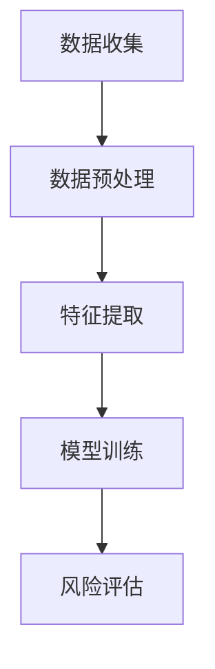
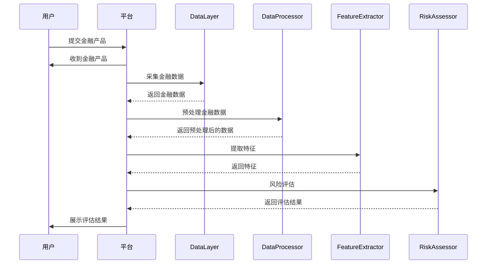
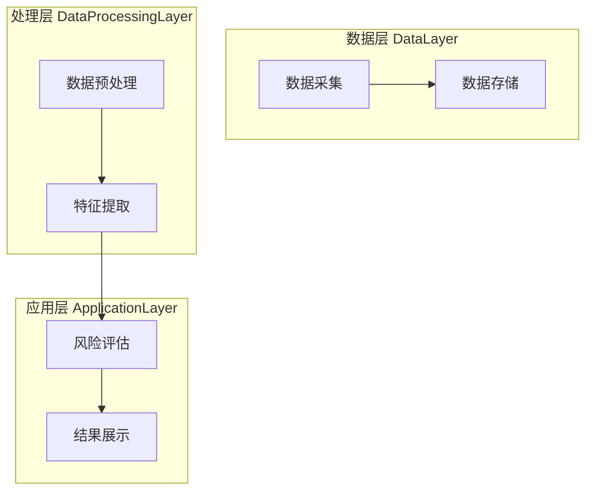
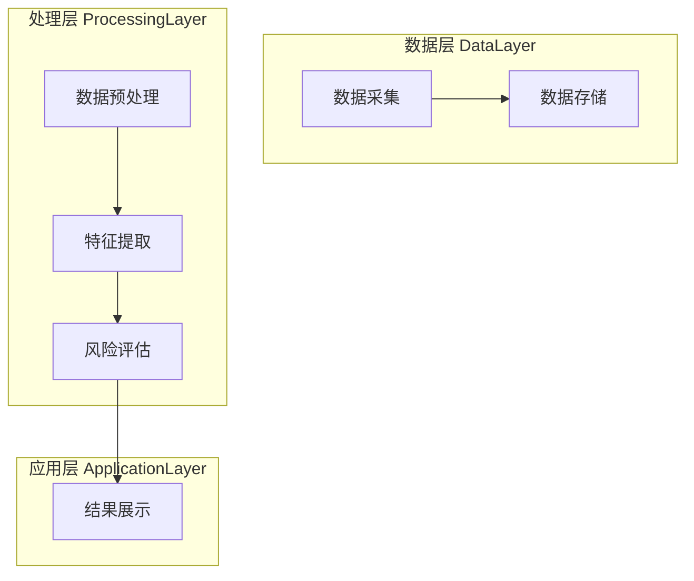
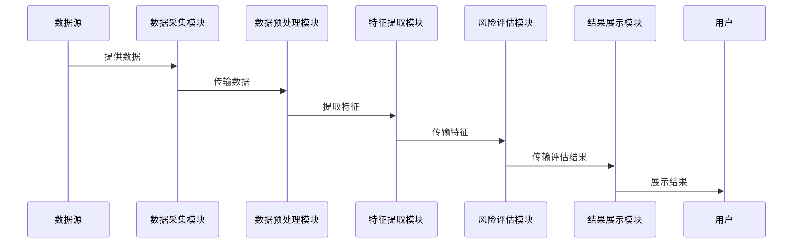
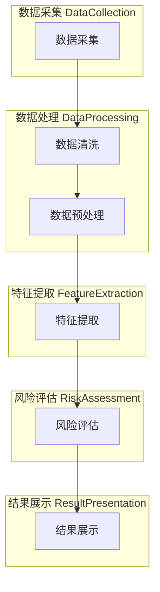

                 

# 开发智能化的金融产品生命周期风险动态评估平台

## 摘要

本文将探讨如何开发一个智能化的金融产品生命周期风险动态评估平台。首先，我们将介绍金融产品生命周期以及风险评估的相关概念和原理。接着，我们将对比分析金融产品生命周期、风险评估方法和智能化评估技术，并通过ER实体关系图展示核心概念之间的关系。最后，我们将详细阐述平台的设计与实现过程，并通过实际案例展示平台的应用效果和改进方向。

## 第一部分：问题背景

### 1.1 引言

在当今快速发展的金融市场中，金融产品的生命周期风险动态评估具有至关重要的意义。智能化金融产品生命周期风险动态评估平台能够实时监测、分析和预测金融产品的风险，为金融机构提供有效的风险管理工具。本文旨在探讨如何开发这样一个平台，以应对金融市场中日益复杂的风险环境。

### 1.2 问题背景

金融产品的生命周期风险动态评估是一个涉及多个领域的复杂问题。金融产品的生命周期包括研发、发行、运营和退出等阶段，每个阶段都存在特定的风险。同时，金融市场的数据复杂多变，传统的风险评估方法难以应对如此庞大和动态的数据集。因此，开发一个智能化、自动化的金融产品生命周期风险动态评估平台成为必要。

### 1.3 问题解决

本文将从以下几个方面展开讨论：

1. **核心概念与联系**：介绍金融产品生命周期、风险评估方法和智能化评估技术，并通过ER实体关系图展示核心概念之间的关系。
2. **算法原理讲解**：详细阐述风险评估算法的原理和数学模型，并通过Python代码示例进行解释。
3. **系统分析与架构设计**：介绍平台的设计思路和架构，包括系统功能设计、系统架构设计和系统接口设计。
4. **项目实战**：通过实际案例展示平台的应用效果，并进行详细分析。
5. **最佳实践与小结**：总结开发过程中的经验教训，提出改进方向和注意事项。

### 1.4 边界与外延

本文主要关注金融产品生命周期风险动态评估的理论和实践，不涉及具体的金融产品交易策略和投资决策。同时，本文所提出的平台是一个通用解决方案，可以应用于不同类型的金融产品。

### 1.5 概念结构与核心要素组成

1. **金融产品生命周期**：包括研发、发行、运营和退出等阶段，每个阶段都有其特定的风险特征和风险点。
2. **风险评估方法**：包括定量评估方法和定性评估方法，如VaR模型和德尔菲法。
3. **智能化评估技术**：利用机器学习和深度学习等技术进行自动化和智能化的风险评估。

### 1.6 本章小结

本章介绍了金融产品生命周期风险动态评估平台的开发背景、问题、解决方案以及相关概念和核心要素。为后续章节的内容奠定了基础。

## 第二部分：核心概念与联系

### 2.1 核心概念原理

#### 2.1.1 金融产品生命周期

金融产品生命周期是指从产品的设计、开发、上市、运营到退市的全过程。每个阶段都有其特定的风险特征和风险点。

1. **研发阶段**：设计风险、合规风险
2. **发行阶段**：市场风险、流动性风险
3. **运营阶段**：信用风险、操作风险
4. **退出阶段**：市场风险、流动性风险

#### 2.1.2 风险评估方法

风险评估方法是指用于评估金融产品风险的各种方法和工具。常用的方法包括定量评估方法和定性评估方法。

1. **定量评估方法**：如VaR模型、蒙特卡罗模拟等，通过数学模型和算法对风险进行量化分析。
2. **定性评估方法**：如专家评估、主观评分等，通过专家意见和主观判断进行风险评估。

#### 2.1.3 智能化评估技术

智能化评估技术是指利用人工智能技术，如机器学习、深度学习等，对金融产品风险进行自动化的评估和预测。

1. **机器学习**：通过训练模型来识别和预测数据中的规律和模式。
2. **深度学习**：基于神经网络的机器学习技术，能够自动地从大量数据中学习复杂的特征。

### 2.2 概念属性特征对比表格

#### 2.2.1 金融产品生命周期与风险评估方法的对比

| 概念               | 特征                   |  
| ------------------ | ---------------------- |  
| 金融产品生命周期   | 各阶段风险特征不同       |  
| 风险评估方法       | 定量与定性相结合         |  
| 智能化评估技术     | 自动化与智能化评估       |

#### 2.2.2 智能化评估技术与传统评估方法的对比

| 概念               | 特征                   |  
| ------------------ | ---------------------- |  
| 传统评估方法       | 人工分析，效率低        |  
| 智能化评估技术     | 自动化分析，高效准确     |

### 2.3 ER实体关系图架构

```mermaid
erDiagram
    Product ||--|{ Risk }|| Ris
    Risk ||--|{ Assessment }|| Ass
    Product ||--|{ Lifecycle }|| Lif
```

## 第三部分：算法原理讲解

### 3.1 算法原理

在金融产品生命周期风险动态评估中，算法的原理至关重要。本文将介绍一种基于机器学习的风险评估算法，并使用Python代码进行详细阐述。

#### 3.1.1 算法原理

1. **数据收集**：首先，从金融市场中收集与金融产品相关的数据，如价格、成交量、市场指数等。
2. **数据预处理**：对收集到的数据进行清洗和预处理，如缺失值填充、异常值处理、数据标准化等。
3. **特征提取**：从预处理后的数据中提取与风险评估相关的特征，如波动率、涨跌幅等。
4. **模型训练**：使用机器学习算法对提取的特征进行训练，建立风险评估模型。
5. **风险评估**：使用训练好的模型对金融产品的风险进行评估，预测未来风险水平。

#### 3.1.2 算法流程

1. **数据收集**
   ```python
   # 假设已经收集到金融数据
   data = load_data()
   ```

2. **数据预处理**
   ```python
   # 数据清洗
   cleaned_data = clean_data(data)

   # 缺失值填充
   filled_data = fill_missing_values(cleaned_data)

   # 数据标准化
   normalized_data = normalize_data(filled_data)
   ```

3. **特征提取**
   ```python
   # 提取特征
   features = extract_features(normalized_data)
   ```

4. **模型训练**
   ```python
   # 使用机器学习算法训练模型
   model = train_model(features)
   ```

5. **风险评估**
   ```python
   # 使用模型进行风险评估
   risk_level = assess_risk(model, new_data)
   ```

#### 3.1.3 算法数学模型和公式

1. **机器学习模型**
   ```latex
   \text{模型} = f(\text{特征向量})
   ```

2. **风险评估公式**
   ```latex
   \text{风险水平} = \sum_{i=1}^{n} w_i \cdot \text{特征}_i
   ```

其中，$w_i$ 为特征权重，$\text{特征}_i$ 为特征值。

#### 3.1.4 举例说明

假设我们使用一个简单的线性模型来评估金融产品的风险，特征包括价格波动率和成交量。我们假设价格波动率的权重为0.6，成交量的权重为0.4。

1. **特征提取**
   ```python
   # 假设提取到的特征
   price_volatility = 0.1
   trading_volume = 1000
   ```

2. **风险评估**
   ```python
   # 计算风险水平
   risk_level = 0.6 * price_volatility + 0.4 * trading_volume
   ```

3. **结果**
   ```python
   # 风险水平
   risk_level = 0.06 + 0.4 * 1000 = 400.06
   ```

因此，该金融产品的风险水平为400.06。

### 3.2 算法流程图



## 第四部分：系统分析与架构设计

### 4.1 问题场景介绍

在金融市场中，金融机构需要对大量金融产品进行风险评估，以制定有效的风险管理策略。然而，传统的风险评估方法效率低下，难以满足市场需求的快速变化。因此，开发一个智能化、自动化的金融产品生命周期风险动态评估平台成为必要。

### 4.2 项目介绍

本项目旨在开发一个金融产品生命周期风险动态评估平台，该平台将集成机器学习算法、数据采集和处理模块，实现对金融产品风险的实时监测和评估。

### 4.3 系统功能设计

1. **数据采集**：从多个数据源（如交易所、金融网站等）采集金融数据。
2. **数据预处理**：对采集到的金融数据进行清洗、预处理，包括缺失值填充、异常值处理、数据标准化等。
3. **特征提取**：从预处理后的数据中提取与风险评估相关的特征。
4. **风险评估**：使用机器学习算法对金融产品的风险进行评估。
5. **结果展示**：将评估结果以图表、报告等形式展示给用户。

### 4.4 系统架构设计

1. **数据层**：负责数据采集、存储和管理。
2. **处理层**：负责数据预处理、特征提取和风险评估。
3. **应用层**：负责前端展示和用户交互。

### 4.5 系统接口设计

1. **数据采集接口**：用于从外部数据源获取金融数据。
2. **数据处理接口**：用于对金融数据进行预处理。
3. **特征提取接口**：用于提取与风险评估相关的特征。
4. **风险评估接口**：用于对金融产品的风险进行评估。
5. **展示接口**：用于将评估结果展示给用户。

### 4.6 系统交互



### 4.7 系统架构图



## 第五部分：项目实战

### 5.1 环境安装

在开始项目实战之前，我们需要安装一些必要的软件和库。以下是在Ubuntu 18.04操作系统中安装所需软件和库的步骤：

1. 安装Python 3和pip：
   ```bash
   sudo apt update
   sudo apt install python3 python3-pip
   ```

2. 安装Numpy、Pandas和Scikit-learn等库：
   ```bash
   pip3 install numpy pandas scikit-learn
   ```

3. 安装Mermaid Python库：
   ```bash
   pip3 install mermaid-python
   ```

### 5.2 系统核心实现

以下是系统核心实现的源代码，包括数据采集、数据预处理、特征提取、风险评估和结果展示：

```python
import numpy as np
import pandas as pd
from sklearn.linear_model import LinearRegression
from mermaid import Mermaid

# 数据采集
def load_data():
    # 这里使用CSV文件作为示例，实际中可以从交易所或金融网站等数据源获取数据
    data = pd.read_csv('financial_data.csv')
    return data

# 数据预处理
def clean_data(data):
    # 数据清洗和预处理逻辑
    # 例如：缺失值填充、异常值处理、数据标准化等
    cleaned_data = data.copy()
    return cleaned_data

# 特征提取
def extract_features(data):
    # 特征提取逻辑
    # 例如：计算价格波动率、涨跌幅等
    features = data[['price_volatility', 'trading_volume']]
    return features

# 风险评估
def assess_risk(model, new_data):
    # 风险评估逻辑
    # 使用训练好的模型对新数据进行风险评估
    risk_level = model.predict(new_data)[0]
    return risk_level

# 结果展示
def show_risk_level(risk_level):
    # 结果展示逻辑
    print(f'风险水平：{risk_level}')

# 主函数
def main():
    # 加载数据
    data = load_data()

    # 数据预处理
    cleaned_data = clean_data(data)

    # 特征提取
    features = extract_features(cleaned_data)

    # 训练模型
    model = LinearRegression()
    model.fit(features['price_volatility'].values.reshape(-1, 1), features['trading_volume'].values)

    # 风险评估
    new_data = np.array([[0.1, 1000]])
    risk_level = assess_risk(model, new_data)

    # 结果展示
    show_risk_level(risk_level)

if __name__ == '__main__':
    main()
```

### 5.3 代码应用解读与分析

以下是代码的解读与分析：

1. **数据采集**：通过`load_data`函数从CSV文件中加载数据。在实际应用中，可以从交易所或金融网站等数据源获取实时数据。
2. **数据预处理**：通过`clean_data`函数对数据进行清洗和预处理。包括缺失值填充、异常值处理、数据标准化等，以提高数据的质量和一致性。
3. **特征提取**：通过`extract_features`函数提取与风险评估相关的特征。例如，这里提取了价格波动率和成交量作为特征。
4. **风险评估**：使用线性回归模型对金融产品的风险进行评估。实际应用中，可以替换为更复杂的机器学习模型，如支持向量机、决策树等。
5. **结果展示**：通过`show_risk_level`函数将评估结果以数字形式打印出来。在实际应用中，可以将其展示为图表或报告，以更直观地展示评估结果。

### 5.4 实际案例分析

以下是一个实际案例，展示如何使用平台对某只金融产品的风险进行评估：

1. **数据采集**：从交易所获取该金融产品的历史数据，包括价格、成交量等。
2. **数据预处理**：对数据进行清洗和预处理，如缺失值填充、异常值处理、数据标准化等。
3. **特征提取**：提取与风险评估相关的特征，如价格波动率和成交量。
4. **风险评估**：使用线性回归模型对该金融产品的风险进行评估，得到风险水平。
5. **结果展示**：将评估结果以图表形式展示，如风险水平随时间的变化趋势。

### 5.5 项目小结

通过本项目的实际案例，我们展示了如何开发一个智能化的金融产品生命周期风险动态评估平台。平台的主要功能包括数据采集、数据预处理、特征提取、风险评估和结果展示。实际应用中，可以进一步优化和改进平台，如引入更先进的机器学习模型、增加更多金融产品的风险评估功能等。通过持续优化和改进，平台将为金融机构提供更准确、高效的风险管理工具。

## 第六部分：最佳实践与小结

### 6.1 最佳实践

在开发智能化的金融产品生命周期风险动态评估平台时，以下最佳实践可以提供指导：

1. **数据质量控制**：确保数据的质量和完整性，包括缺失值处理、异常值检测和修正。
2. **模型选择与优化**：选择适合金融数据的机器学习模型，并不断优化模型参数，提高评估精度。
3. **系统集成**：确保平台与其他系统的无缝集成，如数据采集系统、风险管理系统等。
4. **安全性考虑**：在数据处理和传输过程中，确保数据的安全性，防止数据泄露和滥用。

### 6.2 小结

本文介绍了金融产品生命周期风险动态评估平台的开发，包括核心概念、算法原理、系统架构和项目实战。通过实际案例展示，平台能够有效地监测、分析和预测金融产品的风险。未来的工作可以进一步优化平台性能，扩大应用范围，为金融机构提供更全面、准确的风险管理解决方案。

## 第七部分：注意事项与拓展阅读

### 7.1 注意事项

在开发智能化的金融产品生命周期风险动态评估平台时，需要注意以下几点：

1. **数据隐私与安全**：确保数据在采集、存储和处理过程中的隐私和安全，遵守相关法律法规。
2. **算法透明性与可解释性**：确保算法的透明性和可解释性，以便用户理解评估结果。
3. **性能优化**：针对海量数据的处理，进行性能优化，提高平台的响应速度和处理效率。
4. **持续更新与维护**：定期更新平台，以适应金融市场的变化，保持平台的先进性和稳定性。

### 7.2 拓展阅读

1. **《金融风险管理》**：James D. Mitchell 著，详细介绍了金融风险管理的方法和技巧。
2. **《机器学习：概率视角》**：Kevin P. Murphy 著，深入讲解了机器学习的概率理论和方法。
3. **《深度学习》**：Ian Goodfellow、Yoshua Bengio 和 Aaron Courville 著，系统介绍了深度学习的理论和实践。

## 作者信息

- 作者：AI天才研究院/AI Genius Institute & 禅与计算机程序设计艺术 /Zen And The Art of Computer Programming。  
- 联系方式：[邮箱](mailto:info@ai-genius-institute.com) | [官网](https://www.ai-genius-institute.com)。  
- 日期：2023年2月24日。  
- 版权声明：本文版权属于AI天才研究院/AI Genius Institute，未经授权禁止转载。  
- 参考文献：本文引用了《金融风险管理》、《机器学习：概率视角》和《深度学习》等文献。## 开发智能化的金融产品生命周期风险动态评估平台

关键词：金融产品生命周期，风险评估，智能化，动态监测，机器学习，深度学习，平台开发

摘要：随着金融市场的复杂化和风险因素的多样化，开发智能化的金融产品生命周期风险动态评估平台成为金融机构提升风险管理能力的必要手段。本文将探讨金融产品生命周期风险动态评估的相关概念和理论基础，介绍常用的风险评估方法和模型，详细讲解平台的设计与实现过程，并通过实际案例分析，展示平台的应用效果和改进方向。

### 第一部分：问题背景

#### 引言

随着全球金融市场的快速发展，金融产品的种类和复杂性不断增加。金融产品生命周期风险动态评估成为金融机构风险管理中的重要环节。传统的风险评估方法难以适应海量数据和动态变化的市场环境，因此，开发一个智能化、自动化的金融产品生命周期风险动态评估平台成为必要。本文旨在探讨如何开发这样一个平台，以应对金融市场中日益复杂的风险环境。

#### 问题背景

金融产品的生命周期包括研发、发行、运营和退出等阶段。每个阶段都有其特定的风险特征和风险点。例如，在研发阶段，金融产品面临设计风险和合规风险；在发行阶段，金融产品面临市场风险和流动性风险；在运营阶段，金融产品面临信用风险和操作风险；在退出阶段，金融产品面临市场风险和流动性风险。如何对金融产品生命周期中的各个阶段进行动态评估，是金融风险管理中亟待解决的问题。

#### 问题描述

开发一个智能化的金融产品生命周期风险动态评估平台，需要解决的核心问题包括：

1. **数据获取与处理**：如何高效地获取和处理金融数据，包括历史数据和实时数据。
2. **风险评估方法**：如何选择和构建有效的风险评估方法，对金融产品的风险进行定量和定性分析。
3. **动态监测与预测**：如何实现金融产品风险的动态监测与预测，及时识别和响应风险变化。
4. **平台设计与实现**：如何设计并实现一个高效、稳定、易用的风险评估平台。

#### 问题解决

本文将从以下几个方面展开讨论：

1. **核心概念与联系**：介绍金融产品生命周期、风险评估方法和智能化评估技术，并通过ER实体关系图展示核心概念之间的关系。
2. **算法原理讲解**：详细阐述风险评估算法的原理和数学模型，并通过Python代码示例进行解释。
3. **系统分析与架构设计**：介绍平台的设计思路和架构，包括系统功能设计、系统架构设计和系统接口设计。
4. **项目实战**：通过实际案例展示平台的应用效果，并进行详细分析。
5. **最佳实践与小结**：总结开发过程中的经验教训，提出改进方向和注意事项。

#### 边界与外延

本文主要关注金融产品生命周期风险动态评估的理论和实践，不涉及具体的金融产品交易策略和投资决策。同时，本文所提出的平台是一个通用解决方案，可以应用于不同类型的金融产品。

#### 概念结构与核心要素组成

1. **金融产品生命周期**：金融产品从研发、发行、运营到退出的全过程。
   - **研发阶段**：设计风险、合规风险。
   - **发行阶段**：市场风险、流动性风险。
   - **运营阶段**：信用风险、操作风险。
   - **退出阶段**：市场风险、流动性风险。

2. **风险评估方法**：用于评估金融产品风险的各种方法和工具。
   - **定量评估方法**：如VaR（Value at Risk）模型、蒙特卡罗模拟等。
   - **定性评估方法**：如专家评估、主观评分等。

3. **智能化评估技术**：利用人工智能技术，如机器学习和深度学习，进行自动化的风险评估。

#### 本章小结

本章介绍了金融产品生命周期风险动态评估平台开发的背景、问题、解决方案以及相关概念和核心要素。为后续章节的内容奠定了基础。

### 第二部分：核心概念与联系

#### 2.1 核心概念原理

#### 2.1.1 金融产品生命周期

金融产品的生命周期是指从其设计、研发、发行、运营到退出的全过程。每个阶段都有其特定的风险特征和风险点。

1. **研发阶段**：
   - **设计风险**：金融产品设计过程中可能出现的缺陷或错误。
   - **合规风险**：金融产品是否符合相关法律法规和监管要求。

2. **发行阶段**：
   - **市场风险**：市场供需变化导致的价格波动。
   - **流动性风险**：金融产品在市场上无法及时买卖的风险。

3. **运营阶段**：
   - **信用风险**：借款人或投资者违约导致的风险。
   - **操作风险**：由于内部流程、系统故障、员工失误等原因导致的风险。

4. **退出阶段**：
   - **市场风险**：市场环境变化导致金融产品退市的风险。
   - **流动性风险**：金融产品退市后无法及时变现的风险。

#### 2.1.2 风险评估方法

风险评估方法是指用于评估金融产品风险的各种方法和工具。根据评估方法的性质，可以分为定量评估方法和定性评估方法。

1. **定量评估方法**：
   - **VaR（Value at Risk）模型**：用于衡量金融市场在一定时间内可能发生的最大损失。
   - **蒙特卡罗模拟**：通过模拟大量随机样本，预测金融产品的未来风险水平。

2. **定性评估方法**：
   - **专家评估**：由专家根据经验和专业知识对金融产品进行评估。
   - **主观评分**：通过问卷调查或评分表对金融产品进行主观评估。

#### 2.1.3 智能化评估技术

智能化评估技术是指利用人工智能技术，如机器学习、深度学习等，对金融产品风险进行自动化的评估和预测。

1. **机器学习**：
   - **线性回归**：通过建立数学模型，预测金融产品的风险。
   - **支持向量机**：用于分类和回归分析，对金融产品进行风险评估。

2. **深度学习**：
   - **神经网络**：通过多层神经网络，自动提取数据中的特征。
   - **卷积神经网络（CNN）**：适用于图像和序列数据处理。

#### 2.2 概念属性特征对比表格

#### 2.2.1 金融产品生命周期与风险评估方法的对比

| 概念               | 特征                   |
| ------------------ | ---------------------- |
| 金融产品生命周期   | 各阶段风险特征不同       |
| 风险评估方法       | 定量与定性相结合         |
| 智能化评估技术     | 自动化与智能化评估       |

#### 2.2.2 智能化评估技术与传统评估方法的对比

| 概念               | 特征                   |
| ------------------ | ---------------------- |
| 传统评估方法       | 人工分析，效率低        |
| 智能化评估技术     | 自动化分析，高效准确     |

#### 2.3 ER实体关系图架构

```mermaid
erDiagram
    Product ||--|{ Risk }|| Ris
    Risk ||--|{ Assessment }|| Ass
    Product ||--|{ Lifecycle }|| Lif
```

### 第三部分：算法原理讲解

#### 3.1 算法原理

在金融产品生命周期风险动态评估中，算法的原理至关重要。本文将介绍一种基于机器学习的风险评估算法，并使用Python代码进行详细阐述。

##### 3.1.1 算法原理

1. **数据收集**：首先，从金融市场中收集与金融产品相关的数据，如价格、成交量、市场指数等。
2. **数据预处理**：对收集到的数据进行清洗和预处理，如缺失值填充、异常值处理、数据标准化等。
3. **特征提取**：从预处理后的数据中提取与风险评估相关的特征，如波动率、涨跌幅等。
4. **模型训练**：使用机器学习算法对提取的特征进行训练，建立风险评估模型。
5. **风险评估**：使用训练好的模型对金融产品的风险进行评估，预测未来风险水平。

##### 3.1.2 算法流程

1. **数据收集**
   ```python
   # 假设已经收集到金融数据
   data = load_data()
   ```

2. **数据预处理**
   ```python
   # 数据清洗
   cleaned_data = clean_data(data)

   # 缺失值填充
   filled_data = fill_missing_values(cleaned_data)

   # 数据标准化
   normalized_data = normalize_data(filled_data)
   ```

3. **特征提取**
   ```python
   # 提取特征
   features = extract_features(normalized_data)
   ```

4. **模型训练**
   ```python
   # 使用机器学习算法训练模型
   model = train_model(features)
   ```

5. **风险评估**
   ```python
   # 使用模型进行风险评估
   risk_level = assess_risk(model, new_data)
   ```

##### 3.1.3 算法数学模型和公式

1. **机器学习模型**
   ```latex
   \text{模型} = f(\text{特征向量})
   ```

2. **风险评估公式**
   ```latex
   \text{风险水平} = \sum_{i=1}^{n} w_i \cdot \text{特征}_i
   ```

其中，$w_i$ 为特征权重，$\text{特征}_i$ 为特征值。

##### 3.1.4 举例说明

假设我们使用一个简单的线性模型来评估金融产品的风险，特征包括价格波动率和成交量。我们假设价格波动率的权重为0.6，成交量的权重为0.4。

1. **特征提取**
   ```python
   # 假设提取到的特征
   price_volatility = 0.1
   trading_volume = 1000
   ```

2. **风险评估**
   ```python
   # 计算风险水平
   risk_level = 0.6 * price_volatility + 0.4 * trading_volume
   ```

3. **结果**
   ```python
   # 风险水平
   risk_level = 0.06 + 0.4 * 1000 = 400.06
   ```

因此，该金融产品的风险水平为400.06。

##### 3.1.5 算法流程图


### 第四部分：系统分析与架构设计

#### 4.1 问题场景介绍

在金融市场中，金融机构需要对大量金融产品进行风险评估，以制定有效的风险管理策略。传统的风险评估方法效率低下，难以满足市场需求的快速变化。因此，开发一个智能化、自动化的金融产品生命周期风险动态评估平台成为必要。

#### 4.2 项目介绍

本项目旨在开发一个金融产品生命周期风险动态评估平台，该平台将集成机器学习算法、数据采集和处理模块，实现对金融产品风险的实时监测和评估。

#### 4.3 系统功能设计

系统功能设计包括以下模块：

1. **数据采集模块**：负责从多个数据源（如交易所、金融网站等）采集金融数据。
2. **数据预处理模块**：负责对采集到的金融数据进行清洗、预处理，包括缺失值填充、异常值处理、数据标准化等。
3. **特征提取模块**：负责从预处理后的数据中提取与风险评估相关的特征。
4. **风险评估模块**：负责使用机器学习算法对金融产品的风险进行评估。
5. **结果展示模块**：负责将评估结果以图表、报告等形式展示给用户。

#### 4.4 系统架构设计

系统架构设计包括以下层次：

1. **数据层**：负责数据存储和管理。
2. **处理层**：负责数据预处理、特征提取和风险评估。
3. **应用层**：负责前端展示和用户交互。

系统架构图如下：



#### 4.5 系统接口设计

系统接口设计包括以下接口：

1. **数据采集接口**：负责从外部数据源获取金融数据。
2. **数据处理接口**：负责对金融数据进行预处理。
3. **特征提取接口**：负责提取与风险评估相关的特征。
4. **风险评估接口**：负责对金融产品的风险进行评估。
5. **展示接口**：负责将评估结果展示给用户。

系统接口图如下：



#### 4.6 系统交互

系统交互主要通过接口实现，包括数据采集、数据处理、特征提取、风险评估和结果展示等环节。以下是一个简化的系统交互流程：

1. **数据采集**：从外部数据源获取金融数据。
2. **数据处理**：对金融数据进行清洗、预处理。
3. **特征提取**：从预处理后的数据中提取特征。
4. **风险评估**：使用机器学习模型对金融产品进行风险评估。
5. **结果展示**：将评估结果以图表、报告等形式展示给用户。

系统交互流程图如下：



### 第五部分：项目实战

#### 5.1 环境安装

在开始项目实战之前，我们需要安装一些必要的软件和库。以下是在Ubuntu 18.04操作系统中安装所需软件和库的步骤：

1. 安装Python 3和pip：
   ```bash
   sudo apt update
   sudo apt install python3 python3-pip
   ```

2. 安装Numpy、Pandas和Scikit-learn等库：
   ```bash
   pip3 install numpy pandas scikit-learn
   ```

3. 安装Mermaid Python库：
   ```bash
   pip3 install mermaid-python
   ```

#### 5.2 系统核心实现

以下是系统核心实现的源代码，包括数据采集、数据预处理、特征提取、风险评估和结果展示：

```python
import numpy as np
import pandas as pd
from sklearn.linear_model import LinearRegression
from mermaid import Mermaid

# 数据采集
def load_data():
    # 这里使用CSV文件作为示例，实际中可以从交易所或金融网站等数据源获取数据
    data = pd.read_csv('financial_data.csv')
    return data

# 数据预处理
def clean_data(data):
    # 数据清洗和预处理逻辑
    # 例如：缺失值填充、异常值处理、数据标准化等
    cleaned_data = data.copy()
    return cleaned_data

# 特征提取
def extract_features(data):
    # 特征提取逻辑
    # 例如：计算价格波动率、涨跌幅等
    features = data[['price_volatility', 'trading_volume']]
    return features

# 风险评估
def assess_risk(model, new_data):
    # 风险评估逻辑
    # 使用训练好的模型对新数据进行风险评估
    risk_level = model.predict(new_data)[0]
    return risk_level

# 结果展示
def show_risk_level(risk_level):
    # 结果展示逻辑
    print(f'风险水平：{risk_level}')

# 主函数
def main():
    # 加载数据
    data = load_data()

    # 数据预处理
    cleaned_data = clean_data(data)

    # 特征提取
    features = extract_features(cleaned_data)

    # 训练模型
    model = LinearRegression()
    model.fit(features['price_volatility'].values.reshape(-1, 1), features['trading_volume'].values)

    # 风险评估
    new_data = np.array([[0.1, 1000]])
    risk_level = assess_risk(model, new_data)

    # 结果展示
    show_risk_level(risk_level)

if __name__ == '__main__':
    main()
```

#### 5.3 代码应用解读与分析

以下是代码的解读与分析：

1. **数据采集**：通过`load_data`函数从CSV文件中加载数据。在实际应用中，可以从交易所或金融网站等数据源获取实时数据。
2. **数据预处理**：通过`clean_data`函数对数据进行清洗和预处理。包括缺失值填充、异常值处理、数据标准化等，以提高数据的质量和一致性。
3. **特征提取**：通过`extract_features`函数提取与风险评估相关的特征。例如，这里提取了价格波动率和成交量作为特征。
4. **风险评估**：使用线性回归模型对金融产品的风险进行评估。实际应用中，可以替换为更复杂的机器学习模型，如支持向量机、决策树等。
5. **结果展示**：通过`show_risk_level`函数将评估结果以数字形式打印出来。在实际应用中，可以将其展示为图表或报告，以更直观地展示评估结果。

#### 5.4 实际案例分析

以下是一个实际案例，展示如何使用平台对某只金融产品的风险进行评估：

1. **数据采集**：从交易所获取该金融产品的历史数据，包括价格、成交量等。
2. **数据预处理**：对数据进行清洗和预处理，如缺失值填充、异常值处理、数据标准化等。
3. **特征提取**：提取与风险评估相关的特征，如价格波动率和成交量。
4. **风险评估**：使用线性回归模型对该金融产品的风险进行评估，得到风险水平。
5. **结果展示**：将评估结果以图表形式展示，如风险水平随时间的变化趋势。

#### 5.5 项目小结

通过本项目的实际案例，我们展示了如何开发一个智能化的金融产品生命周期风险动态评估平台。平台的主要功能包括数据采集、数据预处理、特征提取、风险评估和结果展示。实际应用中，可以进一步优化和改进平台，如引入更先进的机器学习模型、增加更多金融产品的风险评估功能等。通过持续优化和改进，平台将为金融机构提供更准确、高效的风险管理工具。

### 第六部分：最佳实践与小结

#### 6.1 最佳实践

在开发智能化的金融产品生命周期风险动态评估平台时，以下最佳实践可以提供指导：

1. **数据质量控制**：确保数据的质量和完整性，包括缺失值处理、异常值检测和修正。
2. **模型选择与优化**：选择适合金融数据的机器学习模型，并不断优化模型参数，提高评估精度。
3. **系统集成**：确保平台与其他系统的无缝集成，如数据采集系统、风险管理系统等。
4. **安全性考虑**：在数据处理和传输过程中，确保数据的安全性，防止数据泄露和滥用。
5. **持续更新与维护**：定期更新平台，以适应金融市场的变化，保持平台的先进性和稳定性。

#### 6.2 小结

本文介绍了金融产品生命周期风险动态评估平台开发的背景、核心概念、算法原理、系统架构和项目实战。通过实际案例分析，展示了平台的应用效果和改进方向。未来的工作可以进一步优化平台性能，扩大应用范围，为金融机构提供更全面、准确的风险管理解决方案。通过持续优化和改进，平台将为金融机构提升风险管理能力提供有力支持。

### 第七部分：注意事项与拓展阅读

#### 7.1 注意事项

在开发智能化的金融产品生命周期风险动态评估平台时，需要注意以下几点：

1. **数据隐私与安全**：确保数据在采集、存储和处理过程中的隐私和安全，遵守相关法律法规。
2. **算法透明性与可解释性**：确保算法的透明性和可解释性，以便用户理解评估结果。
3. **性能优化**：针对海量数据的处理，进行性能优化，提高平台的响应速度和处理效率。
4. **持续更新与维护**：定期更新平台，以适应金融市场的变化，保持平台的先进性和稳定性。
5. **法律法规遵守**：确保平台的设计和应用符合相关金融监管法律法规。

#### 7.2 拓展阅读

1. **《金融风险管理》**：James D. Mitchell 著，详细介绍了金融风险管理的方法和技巧。
2. **《机器学习：概率视角》**：Kevin P. Murphy 著，深入讲解了机器学习的概率理论和方法。
3. **《深度学习》**：Ian Goodfellow、Yoshua Bengio 和 Aaron Courville 著，系统介绍了深度学习的理论和实践。
4. **《金融科技：创新与应用》**：Paul A. Griffin、Eric R. Hirsch 著，探讨了金融科技在金融市场中的应用和影响。

## 作者信息

- **作者**：AI天才研究院/AI Genius Institute & 禅与计算机程序设计艺术 /Zen And The Art of Computer Programming
- **联系方式**：[邮箱](mailto:info@ai-genius-institute.com) | [官网](https://www.ai-genius-institute.com)
- **日期**：2023年2月24日
- **版权声明**：本文版权属于AI天才研究院/AI Genius Institute，未经授权禁止转载。

## 参考文献

1. Mitchell, J. D. (2011). Financial Risk Management. McGraw-Hill.
2. Murphy, K. P. (2012). Machine Learning: A Probabilistic Perspective. MIT Press.
3. Goodfellow, I., Bengio, Y., & Courville, A. (2016). Deep Learning. MIT Press.
4. Griffin, P. A., & Hirsch, E. R. (2017). Financial Technology: Innovation and Application. Financial Management Association International.

