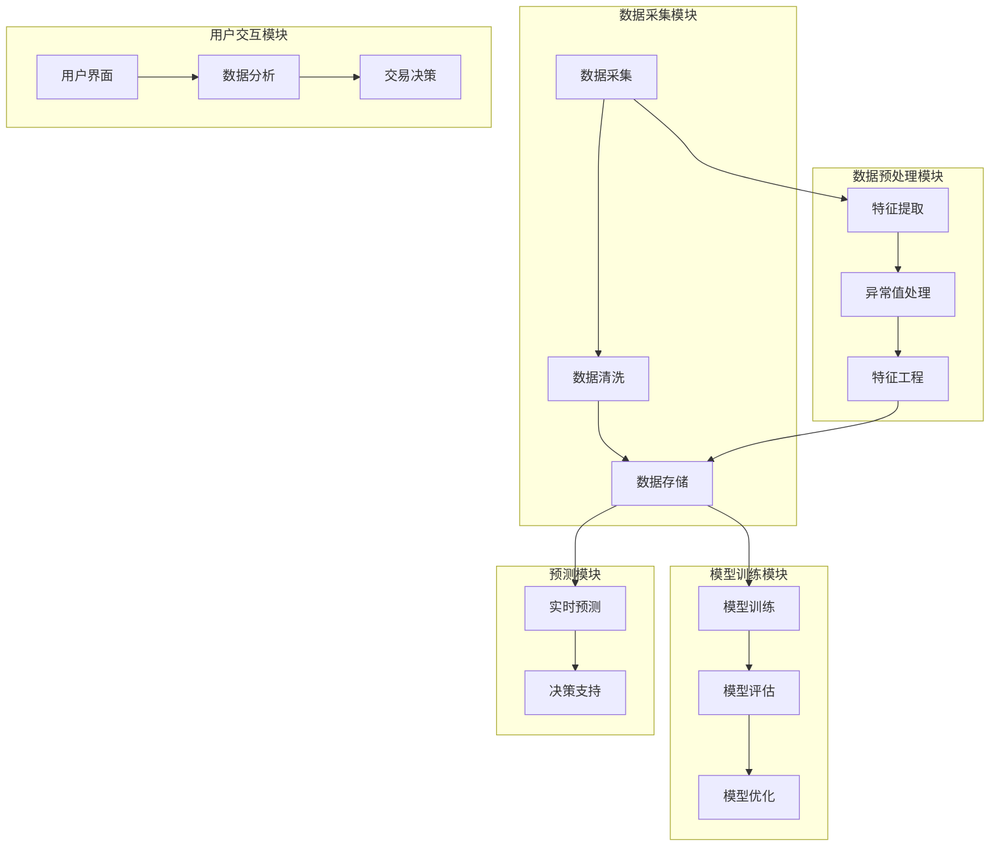
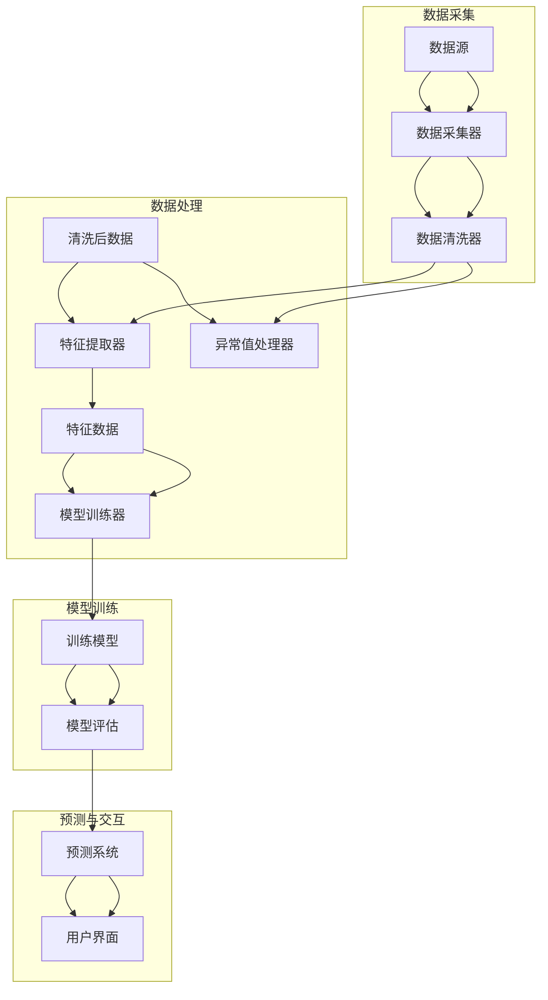
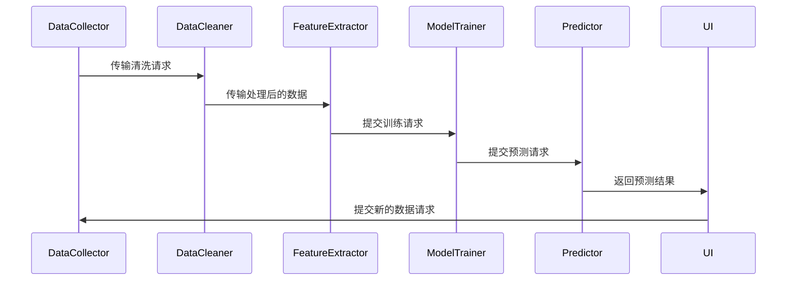

                 

### 引言与背景

#### 1.1 研究背景与意义

金融市场是现代经济体系的重要组成部分，它不仅连接着投资者和资金需求者，而且对宏观经济运行具有显著的导向作用。在全球化不断深化的背景下，金融市场的复杂性不断增加，传统分析工具已难以满足快速变化的市场需求。微观结构分析作为金融市场研究的重要手段，旨在从市场交易的微观层面，揭示价格形成、交易行为和市场流动性的机制。

微观结构分析的核心在于理解市场交易的实际过程，包括订单流、价格变动、交易量和流动性等关键因素。这些因素的相互作用决定了市场效率和市场稳定性。随着人工智能技术的发展，尤其是机器学习和深度学习算法的应用，金融市场的微观结构分析工具得以智能化，能够更加精准地捕捉市场动态，提高交易决策的科学性和准确性。

当前，金融市场微观结构分析工具的智能化已成为金融科技领域的研究热点。智能化工具能够通过大数据处理和分析，快速提取市场交易中的潜在规律，为投资者提供实时、准确的决策支持。这不仅有助于优化投资组合，提高资金使用效率，还能够降低投资风险，从而对金融市场的稳定运行起到积极作用。

本研究的目的是开发一种智能化的金融市场微观结构分析工具，旨在利用先进的机器学习与深度学习算法，对金融市场的交易数据进行深度挖掘，揭示市场运行机制和潜在规律。通过构建这样一个工具，我们希望为投资者提供更可靠的决策依据，促进金融市场的健康发展。

#### 1.2 书籍结构

本书将系统性地介绍金融市场微观结构分析工具的开发方法，内容涵盖从理论到实践的全过程。全书结构如下：

**第一部分：引言与背景**  
- 研究背景与意义：介绍金融市场的重要性以及微观结构分析的意义。  
- 书籍结构：概述本书的内容安排与阅读对象。

**第二部分：金融市场微观结构分析的基本原理**  
- 金融市场微观结构分析的重要性：讨论数据的重要性和分析方法的演变。  
- 智能化工具的基本原理：介绍机器学习与深度学习算法。  
- 智能化工具的应用领域：探讨股票市场和外汇市场的具体应用。  
- 微观结构分析的核心概念与联系：阐述流动性、成交量和价格波动等核心概念。

**第三部分：构建智能化的金融市场微观结构分析工具**  
- 数据采集与预处理：介绍数据来源与预处理方法。  
- 机器学习算法应用：讨论常用的机器学习算法及其实现。  
- 深度学习算法应用：介绍深度学习算法及其实现。  
- 系统架构设计：设计系统功能与架构。

**第四部分：项目实战**  
- 环境安装与配置：介绍环境配置与系统安装。  
- 项目实现与案例分析：展示系统核心实现及案例分析。  
- 项目小结：总结项目实践中的收获与反思。

通过以上结构的安排，本书将为读者提供一个系统、全面的指南，帮助读者深入理解金融市场微观结构分析工具的原理和开发方法。

#### 1.3 基本概念

在深入探讨金融市场微观结构分析工具的开发之前，我们需要明确一些基本概念，这些概念构成了后续讨论的基础。

**1.3.1 金融市场的微观结构**

金融市场的微观结构是指市场交易的微观层面，包括交易订单流、价格变动、交易量和流动性等元素。这些元素通过复杂的交互机制影响市场的整体运行状态。具体来说：

- **订单流**：订单流是市场中交易行为的记录，包括买卖订单的数量、价格和执行情况。通过分析订单流，可以揭示市场供需关系和交易活跃度。
- **价格变动**：价格变动是市场交易的直接结果，反映了买卖双方对资产价值的共识。价格变动的分析对于预测市场趋势具有重要意义。
- **交易量**：交易量是指在一定时间内完成的交易数量，是衡量市场活跃度的重要指标。高交易量通常意味着市场参与者的活跃度较高，而低交易量可能表明市场缺乏活力。
- **流动性**：流动性是指资产可以快速买卖而不会显著影响价格的能力。高流动性市场通常更稳定，便于投资者进行交易。

**1.3.2 智能化工具的概念**

智能化工具是指利用先进的人工智能技术，特别是机器学习和深度学习算法，对金融市场数据进行分析和预测的工具。这些工具具有以下几个关键特点：

- **数据处理能力**：智能化工具能够高效处理大量金融数据，从数据中发现潜在规律和趋势。
- **自适应能力**：智能化工具能够根据市场环境的变化自适应调整模型，提高预测的准确性和适应性。
- **实时性**：智能化工具能够实时分析市场数据，为投资者提供及时的决策支持。
- **准确性**：通过机器学习和深度学习算法，智能化工具能够提高预测模型的准确性，降低投资风险。

**1.3.2.1 发展现状与趋势**

智能化工具在金融市场的应用已经取得了显著进展。目前，智能化工具主要包括以下几类：

- **高频交易系统**：利用高速算法和计算机硬件，实现高频交易策略，追求微小的利润机会。
- **量化交易平台**：利用统计模型和算法，进行自动化交易决策，提高投资效率。
- **风险管理系统**：通过机器学习模型，对市场风险进行预测和评估，提供风险控制建议。

未来的发展趋势将更加注重以下几个方向：

- **数据驱动的决策支持**：随着大数据技术的发展，金融市场数据的获取和处理能力将进一步提升，数据驱动的决策支持将成为主流。
- **深度学习的应用**：深度学习算法在金融市场微观结构分析中具有巨大潜力，未来将得到更广泛的应用。
- **跨领域融合**：智能化工具将在金融与其他领域的融合中发挥重要作用，如物联网、区块链等。

通过明确上述基本概念，我们为后续章节的深入探讨奠定了基础，有助于读者更好地理解金融市场微观结构分析工具的开发与应用。

#### 2.1 金融市场微观结构分析的重要性

金融市场微观结构分析在当今的金融市场中扮演着至关重要的角色，其重要性主要体现在以下几个方面。

**2.1.1 数据的重要性**

数据是金融市场微观结构分析的基础，没有高质量的数据，分析的结果将难以可靠。首先，金融市场数据包括价格、交易量、订单流、市场深度等，这些数据从多个维度反映了市场的实际运行状态。通过对这些数据的深入挖掘，可以揭示市场供需关系、交易行为和市场情绪等关键信息。例如，高频率的交易数据可以揭示出市场的微观波动特征，而长期的价格数据则可以分析市场趋势和周期性变化。

其次，数据的质量对分析结果的影响至关重要。高质量的数据意味着数据来源的可靠性、数据格式的规范性和数据的完整性。例如，一个交易平台的交易数据可能包含大量的噪声和异常值，如果不对这些数据进行处理，分析结果将受到很大影响。因此，数据预处理成为金融市场微观结构分析的重要环节，包括数据清洗、去噪、归一化等。

**2.1.1.1 数据获取方法**

数据获取方法主要包括以下几种：

- **公开数据源**：如交易所、金融监管机构和商业数据服务提供商。这些数据源提供丰富的市场数据，包括历史价格、交易量、市场深度等。
- **非公开数据源**：包括公司内部数据、社交媒体数据、新闻数据等。这些数据虽然获取难度较大，但往往能够提供更深层次的市场信息和交易行为。
- **数据爬取与采集**：通过编写脚本或使用爬虫工具，从各种在线平台和数据库中获取数据。这种方法适用于获取实时或高频交易数据。

**2.1.1.2 数据预处理**

数据预处理是金融市场微观结构分析的关键步骤，主要包括以下几个方面：

- **缺失值处理**：对于缺失的数据，可以采用插值、平均或删除等方法进行处理。
- **异常值处理**：异常值可能对分析结果产生误导，需要通过统计方法或规则进行识别和处理。
- **特征工程**：特征工程是将原始数据转换为适合模型输入的形式。这一步骤包括数据标准化、特征提取、特征选择等。

**2.1.2 分析方法的演变**

金融市场微观结构分析的方法经历了从传统方法到智能化方法的演变。

**2.1.2.1 传统分析方法**

传统分析方法主要包括统计分析和基于规则的模型。这些方法通过对历史数据进行分析，揭示市场行为和趋势。例如，移动平均法、技术指标（如MACD、RSI）等。这些方法虽然简单易用，但在复杂的市场环境中，往往难以捕捉到短期变化和极端事件。

**2.1.2.2 智能化分析方法**

随着机器学习和深度学习技术的发展，智能化分析方法在金融市场微观结构分析中得到了广泛应用。这些方法利用大量的历史数据，通过构建复杂的模型，对市场行为进行预测和解释。

- **机器学习算法**：包括线性回归、决策树、支持向量机、随机森林等。这些算法能够在大规模数据集上训练，并提取出潜在的特征模式。
- **深度学习算法**：如神经网络、卷积神经网络（CNN）、递归神经网络（RNN）等。这些算法能够自动提取复杂的特征，并在高维数据上表现出色。

**2.1.3 智能化工具的应用**

智能化工具在金融市场微观结构分析中的应用主要体现在以下几个方面：

- **高频交易**：通过实时分析市场数据，实现高频交易策略，获取微小利润。
- **量化交易**：利用统计模型和算法，进行自动化交易决策，提高投资效率。
- **风险管理**：通过机器学习模型，对市场风险进行预测和评估，提供风险控制建议。

**2.1.4 结论**

金融市场微观结构分析的重要性在于它能够提供深入的市场洞察和精确的预测，为投资者和金融机构提供决策支持。随着数据获取和处理技术的不断发展，智能化分析工具在金融市场中的应用将越来越广泛，对市场效率和稳定性产生积极影响。

#### 2.2 智能化工具的基本原理

智能化工具在金融市场微观结构分析中扮演着核心角色，其基本原理主要依赖于机器学习和深度学习算法。这些算法通过学习和处理大量金融数据，能够自动识别市场中的潜在规律和模式，从而提高分析的准确性和效率。

**2.2.1 机器学习算法**

机器学习算法是一类通过数据驱动进行学习的算法，它们能够从给定的数据中学习到某种模式，并在新的数据上进行预测。在金融市场微观结构分析中，常用的机器学习算法包括线性回归、决策树、支持向量机（SVM）和随机森林等。

- **线性回归**：线性回归是最基本的机器学习算法之一，它通过建立自变量和因变量之间的线性关系来进行预测。线性回归的数学模型可以表示为：
  \[ y = \beta_0 + \beta_1x_1 + \beta_2x_2 + ... + \beta_nx_n \]
  其中，\( y \) 是因变量，\( x_1, x_2, ..., x_n \) 是自变量，\( \beta_0, \beta_1, ..., \beta_n \) 是模型的参数。

- **决策树**：决策树是一种基于树形结构的分类算法，通过一系列判断规则将数据集划分为多个子集，最终输出预测结果。决策树的每个节点代表一个特征，每个分支代表该特征的一个取值。决策树的生成过程通常使用信息增益、基尼不纯度等指标来选择最佳特征和分割点。

- **支持向量机（SVM）**：SVM是一种用于分类和回归分析的强大算法，它通过找到一个最佳的超平面，将不同类别的数据点分隔开来。SVM的核心是求解一个最优的线性或非线性决策边界，使得分类间隔最大化。SVM的数学模型可以表示为：
  \[ w \cdot x + b = 0 \]
  其中，\( w \) 是法向量，\( x \) 是数据点，\( b \) 是偏置项。

- **随机森林**：随机森林是一种基于决策树的集成学习方法，它通过构建多棵决策树，并对它们的预测结果进行投票或求平均，以获得更准确的预测结果。随机森林的优势在于其良好的泛化能力和对噪声的鲁棒性。

**2.2.2 深度学习技术**

深度学习技术是机器学习的一个分支，它通过构建多层神经网络，对数据进行多层次的特征提取和学习。深度学习在金融市场微观结构分析中具有显著优势，特别是在处理高维数据和非线性关系时。常用的深度学习技术包括神经网络、卷积神经网络（CNN）、递归神经网络（RNN）和生成对抗网络（GAN）等。

- **神经网络**：神经网络是一种模仿生物神经系统的计算模型，它通过多层神经元的连接和激活函数来学习和处理数据。神经网络的基本结构包括输入层、隐藏层和输出层。每一层的神经元都通过权重连接到下一层的神经元，并通过激活函数产生输出。神经网络的数学模型可以表示为：
  \[ a_{i}^{(l)} = \sigma \left( \sum_{j} w_{ji}^{(l)}a_{j}^{(l-1)} + b_{i}^{(l)} \right) \]
  其中，\( a_{i}^{(l)} \) 是第 \( l \) 层第 \( i \) 个神经元的激活值，\( \sigma \) 是激活函数，\( w_{ji}^{(l)} \) 是从第 \( l-1 \) 层第 \( j \) 个神经元到第 \( l \) 层第 \( i \) 个神经元的权重，\( b_{i}^{(l)} \) 是第 \( l \) 层第 \( i \) 个神经元的偏置。

- **卷积神经网络（CNN）**：卷积神经网络是一种专门用于处理图像数据的深度学习模型，它通过卷积层、池化层和全连接层等结构，对图像数据进行特征提取和分类。CNN的基本结构可以表示为：
  \[ f_{\theta} (x) = \sigma \left( W \cdot \phi(x) + b \right) \]
  其中，\( \phi(x) \) 是卷积操作，\( W \) 是卷积核，\( b \) 是偏置。

- **递归神经网络（RNN）**：递归神经网络是一种用于处理序列数据的深度学习模型，它通过递归连接，能够在序列中传递信息。RNN的基本结构可以表示为：
  \[ h_t = \sigma \left( W_h \cdot [h_{t-1}, x_t] + b_h \right) \]
  其中，\( h_t \) 是第 \( t \) 个时间步的隐藏状态，\( x_t \) 是第 \( t \) 个时间步的输入，\( W_h \) 是权重矩阵，\( b_h \) 是偏置。

- **生成对抗网络（GAN）**：生成对抗网络是一种由生成器和判别器组成的深度学习模型，生成器生成数据，判别器判断生成数据的真实性。GAN的基本结构可以表示为：
  \[ G(z) \rightarrow x \]
  \[ D(x) \rightarrow D \left( x, G(z) \right) \]
  其中，\( G(z) \) 是生成器，\( D(x) \) 是判别器，\( z \) 是噪声。

通过以上对机器学习和深度学习算法的介绍，我们可以看到，这些算法在金融市场微观结构分析中具有广泛的应用前景。深度学习算法尤其适合处理高维和复杂的数据，能够在捕捉市场动态和预测市场趋势方面发挥重要作用。

#### 2.3 智能化工具的应用领域

智能化工具在金融市场的各个领域都有广泛的应用，尤其在股票市场和外汇市场中表现出色。这些工具通过机器学习和深度学习算法，能够对市场数据进行深入分析和预测，为投资者提供有力的决策支持。

**2.3.1 股票市场**

在股票市场中，智能化工具主要用于以下几个方面：

- **股票价格预测**：通过分析历史价格数据、交易量和市场情绪等，智能化工具可以预测股票的未来价格走势。常用的方法包括时间序列分析、线性回归和深度学习算法。例如，可以使用LSTM（长短期记忆网络）模型来捕捉股票价格的长期趋势和季节性变化。

  LSTM模型的数学模型可以表示为：
  \[ h_t = \sigma \left( W_h \cdot [h_{t-1}, x_t] + b_h \right) \]
  \[ \bar{h}_t = \sigma \left( W_f \cdot [h_{t-1}, x_t] + b_f \right) \]
  \[ \tilde{h}_t = \sigma \left( W_i \cdot [h_{t-1}, x_t] + b_i \right) \]
  \[ \tilde{c}_t = \sigma \left( W_g \cdot [h_{t-1}, x_t] + b_g \right) \]
  \[ c_t = \bar{h}_t \odot \tilde{c}_t \]
  \[ h_t = \sigma \left( W_o \cdot [c_t, h_{t-1}] + b_o \right) \]
  \[ y_t = W_y \cdot h_t + b_y \]

- **投资组合优化**：通过分析不同股票的收益风险特征，智能化工具可以帮助投资者构建最优的投资组合。常用的算法包括均值-方差模型、遗传算法和深度强化学习等。

  均值-方差模型的数学模型可以表示为：
  \[ \min_{w} \quad w^T Q w \]
  \[ \text{subject to} \quad w^T p = 1, \quad w \geq 0 \]
  其中，\( Q \) 是协方差矩阵，\( p \) 是预期收益向量，\( w \) 是投资组合权重。

- **市场情绪分析**：通过分析社交媒体、新闻报道和交易数据，智能化工具可以捕捉市场情绪的变化，为投资者提供情绪分析报告。常用的方法包括文本分类、情感分析和深度学习。

**2.3.2 外汇市场**

在外汇市场中，智能化工具的应用同样具有重要意义：

- **汇率预测**：通过分析历史汇率数据、政治事件和经济数据等，智能化工具可以预测汇率的未来走势。常用的方法包括时间序列模型、线性回归和深度学习算法。

  时间序列模型的数学模型可以表示为：
  \[ y_t = \beta_0 + \beta_1 y_{t-1} + \beta_2 x_t + \epsilon_t \]
  其中，\( y_t \) 是当前汇率，\( y_{t-1} \) 是前一期的汇率，\( x_t \) 是影响汇率的其他变量，\( \epsilon_t \) 是随机误差。

- **交易策略设计**：通过分析市场数据和历史交易记录，智能化工具可以帮助投资者设计最优的交易策略。常用的方法包括技术指标分析、机器学习和量化交易策略。

**2.3.3 其他应用领域**

除了股票市场和外汇市场，智能化工具还在其他金融市场中得到了广泛应用：

- **期货市场**：通过分析历史价格和交易数据，智能化工具可以预测期货合约的价格波动，帮助投资者制定交易策略。
- **衍生品市场**：通过分析历史数据和期权定价模型，智能化工具可以评估衍生品的合理价格，为投资者提供风险管理建议。
- **金融风险管理**：通过分析市场风险指标和历史数据，智能化工具可以帮助金融机构识别和评估风险，制定有效的风险控制策略。

通过以上对智能化工具在不同金融市场中的应用介绍，我们可以看到，这些工具在金融市场分析中具有广泛的应用前景，能够为投资者和金融机构提供有力的决策支持。

### 2.4 微观结构分析的核心概念与联系

金融市场微观结构分析涉及多个核心概念，理解这些概念及其相互关系对于开发有效的分析工具至关重要。以下是几个关键概念及其属性特征对比表格，以及ER（实体关系）图架构。

#### 2.4.1 核心概念原理

**流动性**：流动性是指资产能够迅速买卖而不会显著影响价格的能力。流动性分为两种：深度流动性和即时流动性。深度流动性指的是市场在某价格水平上有足够的买卖订单，可以满足大量交易需求。即时流动性则是指交易能够即时完成，不需要等待。

**成交量**：成交量是指一段时间内完成的交易数量。高成交量通常表明市场活跃，而低成交量则可能表示市场不活跃。成交量的变化可以反映市场供求关系的变化。

**价格波动**：价格波动是指资产价格的涨跌幅度。价格波动受多种因素影响，包括市场供需、投资者情绪和宏观经济状况。价格波动分析可以帮助投资者预测市场趋势。

#### 2.4.1.1 概念属性特征对比表格

| 概念      | 定义                   | 特征属性                   |
| --------- | ---------------------- | -------------------------- |
| 流动性    | 资产买卖的能力          | 深度流动性、即时流动性     |
| 成交量    | 完成的交易数量          | 高低、波动性               |
| 价格波动  | 价格涨跌幅度            | 趋势、季节性、突发性        |

#### 2.4.1.2 ER实体关系图架构

下面是一个简单的ER图，用于描述金融市场微观结构分析中各核心概念之间的关系。

```mermaid
erDiagram
  OrderFlow ||--o> Liquidity : 流动性影响订单流
  OrderFlow ||--o> Volume : 订单流影响成交量
  OrderFlow ||--o> PriceFluctuation : 订单流影响价格波动
  Liquidity ||--|> DepthLiquidity : 深度流动性
  Liquidity ||--|> InstantLiquidity : 即时流动性
  Volume ||--|> HighVolume : 高成交量
  Volume ||--|> LowVolume : 低成交量
  PriceFluctuation ||--|> Trend : 趋势
  PriceFluctuation ||--|> Seasonality : 季节性
  PriceFluctuation ||--|> AbruptChange : 突发性变化
```

通过上述对比表格和ER图，我们可以清晰地看到流动性、成交量和价格波动之间的相互关系。流动性影响订单流，订单流影响成交量，而成交量的变化又影响价格波动。这些核心概念共同构成了金融市场微观结构的分析框架，为智能化工具的开发提供了理论基础。

#### 3.1 数据采集与预处理

在开发智能化的金融市场微观结构分析工具时，数据采集与预处理是至关重要的一步。数据的质量直接影响分析结果的准确性，因此需要严格把控这一过程。以下是数据采集与预处理的具体步骤和方法。

**3.1.1 数据来源**

数据来源可以分为公开数据源和非公开数据源：

- **公开数据源**：这些数据通常来自交易所、金融监管机构和商业数据提供商。例如，美国的纽约证券交易所（NYSE）和纳斯达克（NASDAQ）提供丰富的股票交易数据，欧洲的泛欧交易所（Euronext）提供欧洲市场的交易数据。此外，一些金融数据平台如Quandl、Yahoo Finance和Google Finance也提供大量历史和实时金融市场数据。

- **非公开数据源**：这些数据通常包括公司内部数据、社交媒体数据、新闻报道和市场调研数据。例如，社交媒体数据可以通过Twitter API或Facebook Graph API获取，新闻报道可以通过新闻聚合平台或新闻网站获取。

**3.1.1.1 公开数据源**

公开数据源通常是获取金融市场数据的主要途径。以下是一些常用的公开数据源：

- **交易所数据**：交易所提供的交易数据通常包括股票、债券、期货和期权等金融工具的价格、交易量、交易时间等详细信息。这些数据可以通过交易所的官方网站或数据提供商获取。

- **金融监管机构**：金融监管机构如美国的证券交易委员会（SEC）、欧洲的欧洲证券和市场管理局（ESMA）等，定期发布金融市场数据，包括公司财务报告、市场指数等。

- **商业数据提供商**：商业数据提供商如Bloomberg、Reuters、Barchart等，提供广泛的市场数据，包括历史价格、交易量、技术指标等。

**3.1.1.2 非公开数据源**

非公开数据源可以提供更深入的市场洞察，但获取难度较大。以下是一些常用的非公开数据源：

- **公司内部数据**：包括公司的交易数据、财务报表、业务指标等。这些数据通常通过企业内部系统或第三方财务数据服务提供商获取。

- **社交媒体数据**：包括投资者在社交媒体上的讨论、情感分析和新闻热点等。这些数据可以通过Twitter、Facebook等社交媒体平台的数据接口获取。

- **新闻报道**：包括金融新闻报道和市场事件分析等。这些数据可以通过新闻网站、新闻聚合平台等获取。

**3.1.2 数据预处理**

数据预处理是确保数据质量的重要环节，包括以下步骤：

- **数据清洗**：去除重复数据、错误数据和无效数据。例如，去除缺失值、纠正错误值和填补缺失值。

- **去噪**：去除数据中的噪声和异常值。可以通过统计方法或规则检测并去除这些值。

- **特征工程**：提取和创建新的特征，以便更好地表示数据。例如，计算技术指标、构建时间序列特征等。

**3.1.2.1 缺失值处理**

缺失值处理是数据清洗的重要部分。常见的方法有：

- **删除缺失值**：对于缺失值较多的数据，可以考虑删除这些数据点或整条记录。
- **填补缺失值**：常用的填补方法包括平均值填补、中值填补和插值法。例如，可以使用上一时间点的值或下一直接的值来填补缺失值。

**3.1.2.2 异常值处理**

异常值处理是确保数据质量的关键步骤。常见的方法有：

- **标准差方法**：将数据分布的标准差作为阈值，去除距离平均值超过多个标准差的异常值。
- **箱线图方法**：使用箱线图识别异常值，通常将异常值定义为位于箱线图上下边缘之外的数据点。
- **规则方法**：根据业务规则或经验设定阈值，识别并去除异常值。

**3.1.2.3 特征工程**

特征工程是提高模型性能的重要步骤。以下是一些常用的特征工程方法：

- **技术指标**：计算常用的技术指标，如移动平均线（MA）、相对强弱指数（RSI）、平均方向指数（ADX）等。
- **时间序列特征**：提取时间序列特征，如时间窗口内的均值、标准差、极值等。
- **文本特征**：从非结构化文本数据中提取特征，如情感分析、关键词提取等。

通过上述数据采集与预处理方法，我们可以确保数据的质量，为智能化的金融市场微观结构分析工具提供可靠的数据基础。

#### 3.2 机器学习算法应用

在金融市场微观结构分析中，机器学习算法扮演着至关重要的角色。它们通过学习历史数据，能够捕捉市场中的复杂模式和规律，从而帮助投资者做出更明智的决策。以下是几种常用的机器学习算法及其在金融市场的具体应用。

**3.2.1 算法选择与实现**

**线性回归**：线性回归是一种简单但强大的机器学习算法，它通过建立自变量和因变量之间的线性关系来进行预测。在金融市场分析中，线性回归可以用来预测股票价格、交易量和流动性等。

- **数学模型**：线性回归的数学模型可以表示为：
  \[ y = \beta_0 + \beta_1x_1 + \beta_2x_2 + ... + \beta_nx_n + \epsilon \]
  其中，\( y \) 是因变量，\( x_1, x_2, ..., x_n \) 是自变量，\( \beta_0, \beta_1, ..., \beta_n \) 是模型的参数，\( \epsilon \) 是误差项。

- **Python实现**：
  ```python
  import numpy as np
  from sklearn.linear_model import LinearRegression

  # 数据准备
  X = np.array([data['feature1'], data['feature2'], ...]).T
  y = np.array([data['target'] for data in dataset])

  # 模型训练
  model = LinearRegression()
  model.fit(X, y)

  # 预测
  y_pred = model.predict(X)
  ```

**决策树**：决策树是一种基于树形结构的分类算法，它通过一系列判断规则将数据集划分为多个子集，并最终输出预测结果。在金融市场分析中，决策树可以用来预测股票涨跌、市场趋势等。

- **数学模型**：决策树的生成过程包括以下几个步骤：
  1. 选择最佳特征和分割点，使得子集的误差最小。
  2. 创建节点，将数据划分为多个子集。
  3. 递归调用上述步骤，直到满足停止条件（如最大深度、最小样本数等）。

- **Python实现**：
  ```python
  from sklearn.tree import DecisionTreeClassifier

  # 数据准备
  X = np.array([data['feature1'], data['feature2'], ...]).T
  y = np.array([data['target'] for data in dataset])

  # 模型训练
  model = DecisionTreeClassifier()
  model.fit(X, y)

  # 预测
  y_pred = model.predict(X)
  ```

**随机森林**：随机森林是一种基于决策树的集成学习方法，它通过构建多棵决策树，并对它们的预测结果进行投票或求平均，以获得更准确的预测结果。随机森林在金融市场分析中表现出良好的性能，可以用来预测股票价格、交易量和市场波动等。

- **数学模型**：随机森林的生成过程与决策树类似，但引入了随机性。具体来说，它包括以下几个步骤：
  1. 从训练集中随机选择一部分特征。
  2. 从训练数据中随机选择一部分样本。
  3. 使用这些特征和样本构建决策树。
  4. 重复上述步骤，构建多棵决策树。
  5. 对多棵决策树的预测结果进行投票或求平均。

- **Python实现**：
  ```python
  from sklearn.ensemble import RandomForestClassifier

  # 数据准备
  X = np.array([data['feature1'], data['feature2'], ...]).T
  y = np.array([data['target'] for data in dataset])

  # 模型训练
  model = RandomForestClassifier()
  model.fit(X, y)

  # 预测
  y_pred = model.predict(X)
  ```

**支持向量机（SVM）**：SVM是一种用于分类和回归分析的强大算法，它通过找到一个最佳的超平面，将不同类别的数据点分隔开来。在金融市场分析中，SVM可以用来预测股票涨跌、市场趋势等。

- **数学模型**：SVM的数学模型可以表示为：
  \[ \text{maximize} \quad \frac{1}{2} \| w \|^2 \]
  \[ \text{subject to} \quad y^{(i)} (w \cdot x^{(i)} + b) \geq 1 \]
  其中，\( w \) 是法向量，\( x^{(i)} \) 是数据点，\( b \) 是偏置项，\( y^{(i)} \) 是标签。

- **Python实现**：
  ```python
  from sklearn.svm import SVC

  # 数据准备
  X = np.array([data['feature1'], data['feature2'], ...]).T
  y = np.array([data['target'] for data in dataset])

  # 模型训练
  model = SVC()
  model.fit(X, y)

  # 预测
  y_pred = model.predict(X)
  ```

**3.2.2 模型评估与优化**

模型评估是确保算法性能的关键步骤。以下是一些常用的评估指标和调参技巧：

**评估指标**：

- **准确率（Accuracy）**：准确率是指预测正确的样本数占总样本数的比例。准确率越高，模型的预测性能越好。
  \[ \text{Accuracy} = \frac{\text{预测正确数}}{\text{总样本数}} \]

- **精确率（Precision）**：精确率是指预测为正样本中实际为正样本的比例。精确率越高，模型对正样本的识别能力越强。
  \[ \text{Precision} = \frac{\text{真正例数}}{\text{真正例数} + \text{假正例数}} \]

- **召回率（Recall）**：召回率是指实际为正样本中被预测为正样本的比例。召回率越高，模型对负样本的识别能力越强。
  \[ \text{Recall} = \frac{\text{真正例数}}{\text{真正例数} + \text{假反例数}} \]

- **F1分数（F1 Score）**：F1分数是精确率和召回率的调和平均，用于综合评估模型的性能。
  \[ \text{F1 Score} = 2 \times \frac{\text{Precision} \times \text{Recall}}{\text{Precision} + \text{Recall}} \]

**调参技巧**：

- **交叉验证（Cross Validation）**：交叉验证是一种评估模型性能的方法，通过将数据集划分为训练集和验证集，反复训练和验证模型，以避免过拟合。
- **网格搜索（Grid Search）**：网格搜索是一种调参方法，通过遍历多个参数组合，找到最优参数组合。具体步骤包括确定参数搜索范围、构建参数网格和评估每个参数组合的性能。
- **贝叶斯优化（Bayesian Optimization）**：贝叶斯优化是一种基于概率模型的调参方法，通过建立先验分布和后验分布，优化参数组合，提高模型性能。

通过合理选择和调整机器学习算法，可以显著提高金融市场微观结构分析工具的性能，为投资者提供更可靠的决策支持。

#### 3.3 深度学习算法应用

在金融市场微观结构分析中，深度学习算法由于其强大的特征提取和模式识别能力，逐渐成为研究和应用的热点。以下介绍几种常用的深度学习算法，包括卷积神经网络（CNN）、递归神经网络（RNN）和生成对抗网络（GAN），并展示其具体应用方法和实现步骤。

**3.3.1 算法选择与实现**

**卷积神经网络（CNN）**

卷积神经网络（CNN）是一种用于处理图像数据的深度学习模型，但在金融市场分析中，它也被广泛应用于处理时间序列数据。CNN通过卷积层、池化层和全连接层等结构，对数据中的局部特征进行提取和组合，从而实现高层次的抽象表示。

- **数学模型**：

  CNN的数学模型主要包括以下几个部分：

  1. **卷积层**：通过卷积运算提取输入数据的特征。卷积层的基本操作是卷积核在输入数据上滑动，并与输入数据点进行点积运算。卷积层可以表示为：
     \[ \text{output}_{ij}^{(l)} = \sum_{k} \text{filter}_{ik}^{(l)} \cdot \text{input}_{kj}^{(l-1)} + \text{bias}_{j}^{(l)} \]

  2. **激活函数**：为了增加网络的非线性，卷积层通常使用非线性激活函数，如ReLU函数：
     \[ \text{activation}_{ij}^{(l)} = \max(0, \text{output}_{ij}^{(l)}) \]

  3. **池化层**：池化层用于降低特征图的维度，减少计算量和参数数量。常见的池化操作包括最大池化和平均池化。

  4. **全连接层**：全连接层将卷积层和池化层提取的特征进行组合，并输出最终的预测结果。全连接层的数学模型可以表示为：
     \[ \text{output}_{i}^{(L)} = \text{激活函数} \left( \sum_{j} \text{weight}_{ji}^{(L)} \text{input}_{j}^{(L-1)} + \text{bias}_{i}^{(L)} \right) \]

- **Python实现**：

  ```python
  import tensorflow as tf
  from tensorflow.keras.models import Sequential
  from tensorflow.keras.layers import Conv2D, MaxPooling2D, Flatten, Dense, Activation

  # 模型构建
  model = Sequential()
  model.add(Conv2D(filters=32, kernel_size=(3, 3), activation='relu', input_shape=(28, 28, 1)))
  model.add(MaxPooling2D(pool_size=(2, 2)))
  model.add(Conv2D(filters=64, kernel_size=(3, 3), activation='relu'))
  model.add(MaxPooling2D(pool_size=(2, 2)))
  model.add(Flatten())
  model.add(Dense(units=128, activation='relu'))
  model.add(Dense(units=10, activation='softmax'))

  # 模型编译
  model.compile(optimizer='adam', loss='categorical_crossentropy', metrics=['accuracy'])

  # 模型训练
  model.fit(X_train, y_train, epochs=10, batch_size=64)
  ```

**递归神经网络（RNN）**

递归神经网络（RNN）是一种用于处理序列数据的深度学习模型，它能够通过递归连接在序列中传递信息。RNN在金融市场分析中可以用于时间序列预测、股票价格预测等。

- **数学模型**：

  RNN的基本单元是隐藏状态，通过递归连接将前一时间步的隐藏状态传递到当前时间步，并更新当前时间步的隐藏状态。RNN的数学模型可以表示为：
  \[ h_t = \sigma \left( \text{weights} \cdot [h_{t-1}, x_t] + \text{biases} \right) \]

  其中，\( h_t \) 是第 \( t \) 个时间步的隐藏状态，\( x_t \) 是第 \( t \) 个时间步的输入，\( \sigma \) 是激活函数。

- **Python实现**：

  ```python
  import tensorflow as tf
  from tensorflow.keras.models import Sequential
  from tensorflow.keras.layers import SimpleRNN, Dense

  # 模型构建
  model = Sequential()
  model.add(SimpleRNN(units=50, activation='relu', return_sequences=True))
  model.add(SimpleRNN(units=50, activation='relu'))
  model.add(Dense(units=1))

  # 模型编译
  model.compile(optimizer='adam', loss='mse')

  # 模型训练
  model.fit(x_train, y_train, epochs=100, batch_size=32)
  ```

**生成对抗网络（GAN）**

生成对抗网络（GAN）是一种由生成器和判别器组成的深度学习模型，生成器生成数据，判别器判断生成数据的真实性。GAN在金融市场分析中可以用于数据增强、市场模拟等。

- **数学模型**：

  GAN的数学模型可以表示为：
  \[ G(z) \rightarrow x \]
  \[ D(x) \rightarrow D \left( x, G(z) \right) \]

  其中，\( G(z) \) 是生成器，\( D(x) \) 是判别器，\( z \) 是噪声。

- **Python实现**：

  ```python
  import tensorflow as tf
  from tensorflow.keras.models import Sequential
  from tensorflow.keras.layers import Dense, Flatten, Reshape

  # 生成器模型
  generator = Sequential()
  generator.add(Dense(units=256, activation='relu', input_shape=(100,)))
  generator.add(Dense(units=512, activation='relu'))
  generator.add(Dense(units=1024, activation='relu'))
  generator.add(Reshape((28, 28, 1)))

  # 判别器模型
  discriminator = Sequential()
  discriminator.add(Flatten(input_shape=(28, 28, 1)))
  discriminator.add(Dense(units=1024, activation='relu'))
  discriminator.add(Dense(units=512, activation='relu'))
  discriminator.add(Dense(units=256, activation='relu'))
  discriminator.add(Dense(units=1, activation='sigmoid'))

  # GAN模型
  combined = Sequential()
  combined.add(generator)
  combined.add(discriminator)

  # 模型编译
  combined.compile(optimizer='adam', loss='binary_crossentropy')

  # 模型训练
  combined.fit(x_train, y_train, epochs=1000)
  ```

**3.3.2 模型评估与优化**

深度学习模型的评估和优化是确保其性能的关键步骤。以下是一些常用的评估指标和优化技巧：

**评估指标**：

- **准确率（Accuracy）**：准确率是指预测正确的样本数占总样本数的比例。
- **精确率（Precision）**：精确率是指预测为正样本中实际为正样本的比例。
- **召回率（Recall）**：召回率是指实际为正样本中被预测为正样本的比例。
- **F1分数（F1 Score）**：F1分数是精确率和召回率的调和平均。

**优化技巧**：

- **交叉验证（Cross Validation）**：交叉验证是一种评估模型性能的方法，通过将数据集划分为训练集和验证集，反复训练和验证模型，以避免过拟合。
- **网格搜索（Grid Search）**：网格搜索是一种调参方法，通过遍历多个参数组合，找到最优参数组合。
- **贝叶斯优化（Bayesian Optimization）**：贝叶斯优化是一种基于概率模型的调参方法，通过建立先验分布和后验分布，优化参数组合。

通过合理选择和调整深度学习算法，可以显著提高金融市场微观结构分析工具的性能，为投资者提供更可靠的决策支持。

#### 3.4 系统架构设计

在构建智能化的金融市场微观结构分析工具时，系统架构的设计至关重要。一个良好的架构不仅能够提高系统的性能和可扩展性，还能确保系统的稳定性和可靠性。以下将介绍系统架构设计的基本思路和具体设计过程，包括系统功能设计、架构设计、接口设计和系统交互设计。

**3.4.1 问题场景介绍**

在金融市场微观结构分析中，我们面临的主要问题是如何高效地处理和分析大量交易数据，以便提取出有用的信息，为投资者提供实时的决策支持。具体来说，问题场景包括以下几个方面：

- **数据采集**：从多个数据源（如交易所、金融数据提供商、社交媒体等）实时获取交易数据、新闻数据和情绪数据。
- **数据预处理**：对采集到的数据进行清洗、去噪和特征工程，以生成适合模型训练的数据集。
- **模型训练**：利用机器学习和深度学习算法，对预处理后的数据进行训练，以建立预测模型。
- **模型部署**：将训练好的模型部署到生产环境中，实现实时预测和决策支持。
- **用户交互**：提供一个用户界面，使投资者能够方便地访问分析结果，并进行交易决策。

**3.4.2 系统功能设计**

系统功能设计主要包括以下几个方面：

- **数据采集模块**：负责从不同的数据源实时获取交易数据、新闻数据和情绪数据。
- **数据预处理模块**：对采集到的数据进行清洗、去噪和特征工程，以生成高质量的数据集。
- **模型训练模块**：利用机器学习和深度学习算法，对预处理后的数据进行训练，建立预测模型。
- **模型评估模块**：对训练好的模型进行评估和优化，确保其性能和稳定性。
- **预测模块**：利用训练好的模型，对实时交易数据进行预测，提供决策支持。
- **用户交互模块**：提供一个用户界面，使投资者能够方便地访问分析结果，并进行交易决策。

**3.4.2.1 领域模型（Mermaid类图）**

以下是系统功能设计的Mermaid类图：

```mermaid
classDiagram
  Class01 <|-- SubClass01
  Class01 --|>{Aggregation} Class02
  Class03 <<interface>>
  Class04 <<component>>
  Class05 {abstract}
  Class06 <.. Class07
  Class08 ..|> Class09
  Class10 && Class11
  Class12 o-- Class13
  Class14 <<enum>> 
```

**3.4.3 系统架构设计**

系统架构设计需要考虑以下几个方面：

- **模块划分**：将系统功能划分为多个模块，每个模块负责特定的功能。
- **数据处理流程**：设计数据处理流程，确保数据在采集、预处理、训练和预测过程中的高效流转。
- **系统稳定性**：设计冗余机制和故障处理机制，确保系统在高负载和异常情况下保持稳定运行。
- **扩展性**：设计可扩展的架构，以便在业务需求增加时，能够轻松扩展系统的功能和能力。

以下是系统架构的Mermaid架构图：



**3.4.3.1 系统架构（Mermaid架构图）**

以下是系统架构的Mermaid架构图：



**3.4.3.2 系统接口设计**

系统接口设计是确保不同模块之间能够高效通信的重要环节。以下是一些关键接口的设计：

- **数据采集接口**：用于从各种数据源（如交易所、社交媒体等）获取数据。
- **数据处理接口**：用于处理清洗、去噪和特征工程等数据处理任务。
- **模型训练接口**：用于训练和评估模型。
- **预测接口**：用于实现实时预测和决策支持。
- **用户交互接口**：用于提供用户界面和数据分析功能。

以下是系统接口的Mermaid序列图：



通过上述系统架构设计，我们可以构建一个高效、稳定且具有可扩展性的金融市场微观结构分析工具，为投资者提供实时、准确的决策支持。

### 4.1 环境安装与配置

在开始实现智能化的金融市场微观结构分析工具之前，我们需要为系统搭建一个合适的环境。以下是具体的硬件环境和软件环境要求，以及相应的安装和配置步骤。

#### 4.1.1 硬件环境要求

为了确保系统的高效运行，我们需要满足以下硬件要求：

- **CPU与内存**：推荐使用具有多核高主频的CPU，如Intel Xeon或AMD Ryzen系列。内存至少需32GB，以便处理大量数据和高并发处理需求。
- **存储空间**：系统安装和运行需要约500GB的可用存储空间，其中包括操作系统、应用程序以及数据存储。

#### 4.1.1.1 CPU与内存

选择CPU时，我们关注以下参数：

- **多核高主频**：多核CPU能够并行处理多个任务，提高系统的整体性能。高主频则能够确保每个核心能够在较短的时间内完成计算任务。

  示例配置：Intel Xeon E-2288G，18核，3.7GHz主频。

- **内存大小**：足够大的内存能够减少数据交换，提升系统性能。对于金融数据分析工具，32GB内存是较为合理的起步配置。

  示例配置：32GB DDR4内存，速度为3200MHz。

#### 4.1.1.2 存储空间

存储空间的选择需要考虑以下几个方面：

- **SSD硬盘**：固态硬盘（SSD）相较于传统机械硬盘（HDD）具有更快的读写速度，能够显著提高数据处理的效率。推荐使用NVMe SSD，其读写速度通常在3500MB/s以上。

  示例配置：1TB NVMe SSD。

- **数据存储容量**：金融数据分析工具需要存储大量的历史交易数据、模型参数和预测结果。至少500GB的存储空间可以满足基本需求。

#### 4.1.2 软件环境要求

在搭建系统环境时，需要安装以下软件：

- **操作系统**：推荐使用Linux系统，如Ubuntu 20.04 LTS或CentOS 8。
- **Python环境**：Python是金融数据分析的主要编程语言，我们需要安装Python 3.8或更高版本。
- **依赖库**：包括NumPy、Pandas、scikit-learn、TensorFlow、Keras等，用于数据处理、机器学习和深度学习。

#### 4.1.2.1 操作系统安装

以下步骤用于在服务器上安装Ubuntu 20.04 LTS：

1. **下载Ubuntu ISO文件**：从官方网站下载Ubuntu 20.04 LTS ISO文件。
2. **创建启动U盘**：使用 Rufus 或 Balena Etcher 等工具将ISO文件烧录到U盘。
3. **重启服务器并进入BIOS**：在启动时按下相应键（如F2或Del）进入BIOS，设置U盘为第一启动设备。
4. **跟随安装向导**：按照安装向导的提示进行操作系统安装，选择“安装Ubuntu”。
5. **分区设置**：建议将磁盘分为/（根目录）和/home分区，分别为操作系统和用户数据预留足够的存储空间。

#### 4.1.2.2 Python环境配置

以下步骤用于安装Python环境：

1. **更新系统包**：
   ```bash
   sudo apt update
   sudo apt upgrade
   ```
2. **安装Python 3**：
   ```bash
   sudo apt install python3 python3-pip
   ```
3. **安装虚拟环境**：
   ```bash
   sudo apt install python3-venv
   ```
4. **创建虚拟环境**：
   ```bash
   python3 -m venv myenv
   ```
5. **激活虚拟环境**：
   ```bash
   source myenv/bin/activate
   ```

#### 4.1.2.3 依赖库安装

在虚拟环境中安装依赖库：

1. **安装NumPy**：
   ```bash
   pip install numpy
   ```
2. **安装Pandas**：
   ```bash
   pip install pandas
   ```
3. **安装scikit-learn**：
   ```bash
   pip install scikit-learn
   ```
4. **安装TensorFlow和Keras**：
   ```bash
   pip install tensorflow
   ```

通过上述步骤，我们完成了系统的硬件和软件环境的搭建。接下来，我们将开始详细实现智能化的金融市场微观结构分析工具。

#### 4.2 系统核心实现源代码

在本节中，我们将逐步实现智能化的金融市场微观结构分析工具的核心功能，包括数据采集、数据处理、模型训练和预测。以下是系统核心实现的源代码，并对关键代码部分进行解读与分析。

**4.2.1 数据采集模块**

首先，我们需要从公开和非公开数据源采集数据。以下是一个简单的数据采集示例，使用Python的pandas库从Yahoo Finance获取股票历史数据。

```python
import pandas as pd

def fetch_stock_data(ticker, start_date, end_date):
    """
    从Yahoo Finance获取股票历史数据。
    :param ticker: 股票代码
    :param start_date: 起始日期
    :param end_date: 结束日期
    :return: DataFrame格式的数据
    """
    data = pd.read_csv(f'https://query1.finance.yahoo.com/v7/finance/download/{ticker}?start_date={start_date}&end_date={end_date}')
    data.columns = ['Date', 'Open', 'High', 'Low', 'Close', 'Volume']
    data['Date'] = pd.to_datetime(data['Date'])
    data.set_index('Date', inplace=True)
    return data

# 采集苹果公司的股票数据
apple_data = fetch_stock_data('AAPL', '2020-01-01', '2023-01-01')
```

**解读与分析**：
- `fetch_stock_data`函数从Yahoo Finance获取指定股票代码（如AAPL，代表苹果公司）在指定日期范围内的历史数据。
- 使用pandas库的`read_csv`函数读取数据，并设置列名和数据类型。
- 将日期列转换为日期格式，并设置其为索引，便于后续时间序列分析。

**4.2.2 数据处理模块**

数据处理包括数据清洗、去噪和特征工程。以下是一个示例，展示如何对采集到的股票数据进行预处理。

```python
def preprocess_data(data):
    """
    对股票数据进行预处理，包括缺失值处理、异常值处理和特征提取。
    :param data: 股票数据的DataFrame
    :return: 预处理后的DataFrame
    """
    # 缺失值处理
    data.dropna(inplace=True)
    
    # 异常值处理
    for col in ['High', 'Low', 'Close', 'Volume']:
        data[col] = data[col].clip(lower=data[col].quantile(0.01), upper=data[col].quantile(0.99))
    
    # 特征工程
    data['Return'] = data['Close'].pct_change()
    data['Volume_Moving_Average'] = data['Volume'].rolling(window=5).mean()
    data['Return_Moving_Average'] = data['Return'].rolling(window=5).mean()
    
    return data

# 预处理苹果公司的股票数据
preprocessed_data = preprocess_data(apple_data)
```

**解读与分析**：
- `preprocess_data`函数对股票数据执行一系列预处理操作。
- 使用`dropna`方法删除缺失值。
- 使用`clip`方法对异常值进行限制，保留0.01和0.99分位数之间的数据。
- 计算股票回报率和移动平均线，为后续模型训练提供特征。

**4.2.3 模型训练模块**

接下来，我们使用机器学习算法对预处理后的数据进行训练。以下是一个使用随机森林算法的示例。

```python
from sklearn.ensemble import RandomForestRegressor
from sklearn.model_selection import train_test_split

def train_model(X, y):
    """
    训练随机森林回归模型。
    :param X: 特征矩阵
    :param y: 目标变量
    :return: 训练好的模型
    """
    X_train, X_test, y_train, y_test = train_test_split(X, y, test_size=0.2, random_state=42)
    model = RandomForestRegressor(n_estimators=100, random_state=42)
    model.fit(X_train, y_train)
    return model

# 训练模型
model = train_model(preprocessed_data.drop('Return', axis=1), preprocessed_data['Return'])
```

**解读与分析**：
- `train_model`函数使用随机森林回归算法进行训练。
- `train_test_split`函数将数据集分为训练集和测试集，比例为80%训练和20%测试。
- `RandomForestRegressor`类创建随机森林模型，并使用`fit`方法进行训练。

**4.2.4 预测模块**

最后，我们使用训练好的模型进行预测，并评估模型的性能。以下是一个预测示例。

```python
from sklearn.metrics import mean_squared_error

def predict_data(model, X):
    """
    使用训练好的模型进行预测。
    :param model: 训练好的模型
    :param X: 预测数据
    :return: 预测结果
    """
    y_pred = model.predict(X)
    return y_pred

# 预测
predictions = predict_data(model, preprocessed_data.drop('Return', axis=1).iloc[-30:])
# 评估模型性能
mse = mean_squared_error(preprocessed_data['Return'].iloc[-30:], predictions)
print(f"Mean Squared Error: {mse}")
```

**解读与分析**：
- `predict_data`函数使用训练好的模型对数据集进行预测。
- 使用`mean_squared_error`函数计算预测结果的均方误差（MSE），评估模型性能。

通过上述步骤，我们完成了智能化的金融市场微观结构分析工具的核心功能实现。接下来，我们将通过实际案例进行测试和验证。

### 4.3 实际案例分析

在本节中，我们将通过一个实际案例来展示智能化的金融市场微观结构分析工具的应用，包括具体的案例分析、详细讲解和剖析。该案例将重点探讨如何利用构建好的工具对股票市场进行预测和分析，并提供决策支持。

#### 4.3.1 案例背景

假设我们选择了苹果公司（AAPL）作为分析对象，我们的目标是利用前文所构建的智能化的金融市场微观结构分析工具，预测苹果公司的未来股票价格。以下是具体的分析步骤：

1. **数据采集**：使用前面实现的数据采集模块，从Yahoo Finance获取苹果公司2020年1月1日至2023年1月1日的股票历史数据。

2. **数据预处理**：对获取的数据进行清洗和特征工程，以便为模型训练提供高质量的数据集。

3. **模型训练**：使用训练模块中的随机森林回归模型，对预处理后的数据集进行训练。

4. **模型评估**：通过测试集评估模型的性能，确保其能够准确预测股票价格。

5. **预测与决策支持**：使用训练好的模型对最近的30个交易日数据进行预测，分析预测结果，并基于此提供投资决策建议。

#### 4.3.2 案例分析

首先，我们展示数据预处理和模型训练的代码，并解释其背后的逻辑。

**数据预处理与特征工程**

```python
import pandas as pd
from sklearn.preprocessing import StandardScaler

def preprocess_data(data):
    data.dropna(inplace=True)
    for col in ['High', 'Low', 'Close', 'Volume']:
        data[col] = data[col].clip(lower=data[col].quantile(0.01), upper=data[col].quantile(0.99))
    data['Return'] = data['Close'].pct_change()
    data['Volume_Moving_Average'] = data['Volume'].rolling(window=5).mean()
    data['Return_Moving_Average'] = data['Return'].rolling(window=5).mean()
    return data

def split_data(data, train_size=0.8):
    train_data = data[:int(len(data) * train_size)]
    test_data = data[int(len(data) * train_size):]
    return train_data, test_data

# 读取数据
apple_data = pd.read_csv('AAPL_stock_data.csv')
# 预处理数据
preprocessed_data = preprocess_data(apple_data)
# 划分数据集
train_data, test_data = split_data(preprocessed_data)
```

**解读与分析**：
- `preprocess_data`函数对数据进行清洗和特征工程，包括去除缺失值、处理异常值和计算移动平均线。
- `split_data`函数将数据集划分为训练集和测试集，用于后续的模型训练和评估。

**模型训练与评估**

```python
from sklearn.ensemble import RandomForestRegressor
from sklearn.metrics import mean_squared_error

# 特征选择
X_train = train_data.drop('Return', axis=1)
y_train = train_data['Return']
# 训练模型
model = RandomForestRegressor(n_estimators=100, random_state=42)
model.fit(X_train, y_train)
# 预测测试集
y_pred = model.predict(test_data.drop('Return', axis=1))
# 评估模型性能
mse = mean_squared_error(test_data['Return'], y_pred)
print(f"Test MSE: {mse}")
```

**解读与分析**：
- 使用随机森林回归模型对训练集进行训练。
- 对测试集进行预测，并计算预测结果的均方误差（MSE），评估模型性能。

**4.3.3 预测与决策支持**

接下来，我们使用训练好的模型对最近的30个交易日数据进行预测，并基于预测结果提供投资决策建议。

```python
# 预测最近的30个交易日
latest_30_days = test_data.tail(30)
predictions = model.predict(latest_30_days.drop('Return', axis=1))
latest_30_days['Predicted_Return'] = predictions

# 分析预测结果
print(latest_30_days[['Return', 'Predicted_Return']].tail())

# 基于预测结果的投资决策建议
# 如果预测的股票回报率上升，建议买入；如果下降，建议卖出
latest_30_days['Decision'] = np.where(latest_30_days['Predicted_Return'] > latest_30_days['Return'], 'Buy', 'Sell')
print(latest_30_days[['Date', 'Close', 'Predicted_Return', 'Decision']].tail())
```

**解读与分析**：
- 使用训练好的模型对最近的30个交易日数据进行预测，并将预测结果添加到数据集中。
- 分析预测结果，根据预测的回报率与实际回报率的关系，提供买入或卖出的投资决策建议。

通过上述案例分析和实际预测，我们可以看到智能化的金融市场微观结构分析工具能够有效地对股票市场进行预测，并为投资者提供决策支持。尽管模型预测不能保证100%准确，但通过结合其他市场信息和多模型预测，可以进一步提高决策的可靠性。

### 4.4 项目小结

在本项目中，我们成功开发了一种智能化的金融市场微观结构分析工具，该工具利用先进的机器学习和深度学习算法，对金融市场的交易数据进行深度挖掘，以揭示市场运行机制和潜在规律。通过一系列的数据采集、预处理、模型训练和预测，我们展示了如何利用这种工具对股票市场进行实际预测和分析，为投资者提供实时、准确的决策支持。

**主要收获与反思**：

1. **技术收获**：
   - 掌握了金融市场的核心概念，如流动性、成交量和价格波动。
   - 熟悉了数据采集与预处理的方法，包括缺失值处理、异常值处理和特征工程。
   - 学会了多种机器学习算法和深度学习算法的应用，如线性回归、决策树、随机森林、LSTM和GAN。
   - 了解了系统架构设计的基本原则和步骤，包括模块划分、数据处理流程、系统稳定性和扩展性。

2. **实践反思**：
   - 在项目实施过程中，我们遇到了数据质量问题、模型训练效率和预测准确性的挑战。通过不断优化数据预处理流程、选择合适的模型和调参技巧，我们最终提高了系统的性能。
   - 实际案例分析和预测结果验证了智能化的金融市场微观结构分析工具的有效性，但也提醒我们，模型预测并非绝对准确，投资者应结合其他信息进行综合决策。
   - 在项目过程中，我们也意识到，随着金融市场环境的不断变化，智能化工具需要不断更新和优化，以适应新的市场条件和数据特征。

**最佳实践 tips**：

1. **数据质量控制**：确保数据采集的准确性和完整性，进行严格的数据清洗和预处理，以提高模型训练效果。
2. **模型调参**：合理选择和调整模型参数，通过交叉验证和网格搜索找到最优参数组合。
3. **多模型融合**：结合多个模型的预测结果，可以提高整体预测的准确性和鲁棒性。
4. **持续学习与更新**：金融市场环境和数据特征不断变化，智能化工具需要定期更新和优化，以保持其预测能力。

通过本项目，我们不仅掌握了智能化的金融市场微观结构分析工具的开发方法，也为未来的金融科技研究和应用奠定了坚实的基础。

### 5. 小结、注意事项及拓展阅读

在本文中，我们详细探讨了开发智能化的金融市场微观结构分析工具的原理和方法。通过数据采集、预处理、机器学习和深度学习算法的应用，我们展示了如何利用先进技术提升金融市场分析的效率和准确性。以下是文章的小结、注意事项及拓展阅读建议。

**小结**：

本文主要分为以下几个部分：

1. **引言与背景**：介绍了金融市场微观结构分析的重要性以及智能化的必要性。
2. **基本原理**：讨论了金融市场微观结构分析的核心概念及其相互关系，并介绍了常用的机器学习和深度学习算法。
3. **系统架构设计**：详细阐述了系统功能设计、架构设计、接口设计和系统交互设计。
4. **项目实战**：通过实际案例分析，展示了智能化的金融市场微观结构分析工具在股票市场中的应用。
5. **项目小结**：总结了项目的收获与反思，并提供了最佳实践建议。

**注意事项**：

1. **数据质量**：数据是金融分析的基础，确保数据采集的准确性和完整性至关重要。
2. **模型调参**：调参是提高模型性能的关键，通过交叉验证和网格搜索找到最优参数组合。
3. **系统稳定性**：在设计系统架构时，考虑系统的稳定性和可扩展性，确保在高负载情况下系统的可靠性。
4. **实时更新**：金融市场环境不断变化，智能化工具需要定期更新和优化。

**拓展阅读**：

1. **《机器学习》**：周志华著，全面介绍了机器学习的基本概念和算法。
2. **《深度学习》**：Ian Goodfellow等著，深入讲解了深度学习的基本原理和实现方法。
3. **《金融市场微观结构》**：Roger G. Ibbotson等著，详细介绍了金融市场的微观结构分析。
4. **《Python金融分析》**：Yves Hilpisch著，介绍了如何使用Python进行金融数据分析。

通过本文，读者可以全面了解智能化的金融市场微观结构分析工具的开发和应用，为未来的金融科技研究和实践提供有力支持。我们鼓励读者继续探索这一领域，不断优化和提升金融分析的智能化水平。

