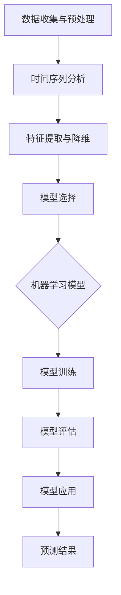
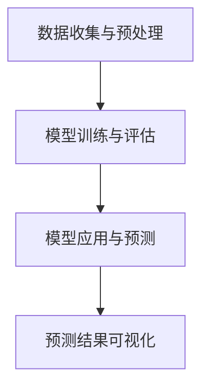
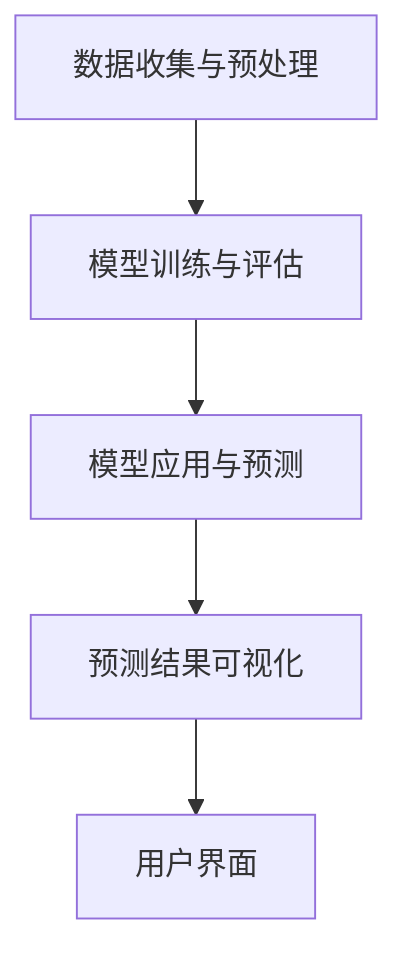

                 

## 《开发智能化的金融市场情绪指数预测模型》

### 关键词：金融市场情绪指数、预测模型、机器学习、深度学习、智能分析

> 摘要：本文旨在探讨开发智能化金融市场情绪指数预测模型的方法与重要性。通过对金融市场情绪指数的定义、特征及智能化预测模型的原理进行详细分析，本文将阐述如何利用机器学习和深度学习技术构建高效、可靠的预测模型。此外，文章还将介绍模型的应用前景与潜在影响，为金融市场的智能化分析提供参考。

## 引言

### 1.1 研究背景

金融市场情绪指数（Market Sentiment Index，MSI）是衡量市场情绪波动的重要指标，通过分析市场情绪可以预测市场走势，为投资者提供决策依据。近年来，随着金融市场规模的不断扩大和复杂性的增加，传统的金融市场情绪指数研究方法已难以满足市场需求。因此，开发智能化金融市场情绪指数预测模型成为金融科技领域的研究热点。

#### 当前金融市场情绪指数研究现状

当前，金融市场情绪指数的研究主要采用传统统计方法和机器学习技术。传统统计方法如指数平滑、移动平均和自回归模型等，具有较强的理论基础，但在处理复杂市场数据时存在局限性。机器学习技术，如支持向量机、决策树和神经网络等，通过学习历史数据特征，能够实现更准确的情绪指数预测。然而，传统的机器学习模型在处理高维度、非线性数据时，性能仍受到一定限制。

#### 智能化金融市场情绪指数的重要性

随着金融市场情绪指数在投资决策中的重要性日益凸显，开发智能化金融市场情绪指数预测模型具有重要意义。首先，智能化模型能够更好地捕捉市场情绪波动，提高预测精度。其次，智能化模型能够处理大规模、高维度金融数据，提高数据处理效率。最后，智能化模型为金融市场的风险管理和投资策略制定提供了有力支持。

### 1.2 问题描述

金融市场情绪指数的波动特征主要体现在以下几个方面：

1. **波动性**：金融市场情绪指数在短时间内可能发生剧烈波动，表现出非线性和随机性。
2. **多变性**：金融市场情绪指数受多种因素影响，如政策变化、经济数据、国际事件等，导致其变化具有多变性。
3. **时效性**：金融市场情绪指数对市场信息的响应具有时效性，实时捕捉市场情绪变化对于投资决策至关重要。

然而，传统预测模型在应对金融市场情绪指数的波动性、多变性和时效性方面存在局限性。如何开发出一种智能化、高效可靠的金融市场情绪指数预测模型，成为当前研究的关键问题。

### 1.3 研究目的与意义

本研究旨在开发一种基于机器学习和深度学习的智能化金融市场情绪指数预测模型，以提高金融市场情绪指数预测的精度和可靠性。研究的主要目的和意义如下：

1. **提高预测精度**：通过引入机器学习和深度学习技术，构建高效、可靠的预测模型，提高金融市场情绪指数的预测精度。
2. **提升数据处理能力**：智能化模型能够处理大规模、高维度金融数据，提高数据处理效率，为投资者提供更全面的市场分析。
3. **支持投资决策**：智能化金融市场情绪指数预测模型为金融市场的风险管理和投资策略制定提供有力支持，有助于投资者做出更加科学的决策。

## 核心概念与联系

### 2.1 金融情绪指数的定义与特征

#### 金融情绪指数的概念

金融情绪指数是衡量市场情绪波动的重要指标，通过对市场情绪数据的量化分析，反映市场参与者的情绪状态。金融情绪指数通常以百分比或指数形式表示，数值越高表示市场情绪越乐观，数值越低表示市场情绪越悲观。

#### 金融情绪指数的属性特征

1. **波动性**：金融情绪指数在市场波动时表现出强烈的波动性，对市场情绪变化的响应迅速。
2. **多变性**：金融情绪指数受到多种因素影响，如政策变化、经济数据、国际事件等，导致其变化具有多变性。
3. **时效性**：金融情绪指数对市场信息的响应具有时效性，能够实时捕捉市场情绪变化。

### 2.2 智能化预测模型的原理

#### 机器学习与深度学习的基础

机器学习和深度学习是人工智能领域的重要分支，通过对大量数据的学习和处理，实现自动化、智能化的预测和分析。

1. **机器学习**：机器学习是指通过算法从数据中自动学习规律和模式，实现对未知数据的预测和分类。常见的机器学习算法包括线性回归、决策树、支持向量机等。
2. **深度学习**：深度学习是机器学习的一个子领域，通过构建深层次的网络结构，实现对复杂数据的学习和预测。常见的深度学习模型包括神经网络、卷积神经网络、循环神经网络等。

#### 智能化预测模型的核心概念

智能化预测模型是基于机器学习和深度学习技术构建的预测模型，能够自动学习金融情绪指数的波动规律，实现对市场情绪的预测。智能化预测模型的核心概念包括：

1. **特征提取**：从历史市场数据中提取关键特征，用于训练预测模型。
2. **模型训练**：通过大量历史数据训练预测模型，使其具备对市场情绪的预测能力。
3. **模型评估**：利用验证集和测试集对预测模型进行评估，确保其预测准确性和可靠性。

### 2.3 概念联系与模型构建

#### 金融情绪指数与预测模型的关系

金融情绪指数是预测模型输入数据的重要组成部分，通过对金融情绪指数的波动规律进行学习，预测模型能够实现对市场情绪的预测。金融情绪指数与预测模型的关系可以表示为：

$$
\text{预测模型} = f(\text{金融情绪指数}, \text{历史数据})
$$

#### 模型构建的基本思路与方法

构建智能化金融市场情绪指数预测模型的基本思路包括以下步骤：

1. **数据收集与预处理**：收集历史市场数据，包括金融情绪指数、价格、交易量等，对数据进行清洗、归一化和特征提取。
2. **模型选择**：根据数据特点，选择合适的机器学习或深度学习模型，如神经网络、循环神经网络等。
3. **模型训练**：利用历史数据对模型进行训练，优化模型参数。
4. **模型评估**：利用验证集和测试集对模型进行评估，确保其预测准确性和可靠性。
5. **模型应用**：将训练好的模型应用于实际市场数据，实现对市场情绪的实时预测。

## 算法原理讲解

### 3.1 时间序列分析与特征提取

#### 时间序列分析方法

时间序列分析是金融市场情绪指数预测的重要方法，通过对市场数据的时序特征进行分析，提取有价值的信息。常见的时间序列分析方法包括：

1. **自回归模型（AR）**：自回归模型通过前期的数据预测当前值，适用于线性时间序列分析。
2. **移动平均模型（MA）**：移动平均模型通过计算过去一段时间的数据平均值预测当前值，适用于平稳时间序列分析。
3. **自回归移动平均模型（ARMA）**：自回归移动平均模型结合自回归模型和移动平均模型，适用于非平稳时间序列分析。

#### 特征提取与降维技术

特征提取是从原始数据中提取有价值的信息，用于训练预测模型。常见特征提取技术包括：

1. **主成分分析（PCA）**：主成分分析通过线性变换降低数据维度，保留主要信息，适用于高维度数据。
2. **局部线性嵌入（LLE）**：局部线性嵌入通过保持局部邻域结构降低数据维度，适用于非线性数据。

### 3.2 智能化预测模型的构建

#### 基于机器学习的预测模型

基于机器学习的预测模型通过学习历史数据特征，实现对金融市场情绪指数的预测。常见机器学习算法包括：

1. **线性回归模型**：线性回归模型通过建立线性关系预测目标值，适用于线性关系较强的数据。
2. **决策树模型**：决策树模型通过树形结构划分数据，预测目标值，适用于非线性关系较强的数据。
3. **支持向量机（SVM）**：支持向量机通过寻找最佳分割超平面，预测目标值，适用于高维度数据。

#### 基于深度学习的预测模型

基于深度学习的预测模型通过构建深层次的神经网络，实现对金融市场情绪指数的预测。常见深度学习模型包括：

1. **卷积神经网络（CNN）**：卷积神经网络通过卷积层提取空间特征，适用于图像和序列数据。
2. **循环神经网络（RNN）**：循环神经网络通过循环结构处理序列数据，适用于时间序列分析。
3. **长短期记忆网络（LSTM）**：长短期记忆网络是循环神经网络的变体，能够更好地处理长时间依赖问题。

### 3.3 算法流程图



## 数学模型和数学公式

### 4.1 模型数学公式

#### 时间序列预测模型

时间序列预测模型通常采用自回归模型（AR）进行建模，其数学公式如下：

$$
y_t = c + \sum_{i=1}^p \phi_i y_{t-i} + \varepsilon_t
$$

其中，$y_t$表示时间序列的第$t$个观测值，$c$表示常数项，$\phi_i$表示自回归系数，$p$表示自回归阶数，$\varepsilon_t$表示误差项。

#### 机器学习预测模型

机器学习预测模型通常采用线性回归模型进行建模，其数学公式如下：

$$
y = \beta_0 + \beta_1 x_1 + \beta_2 x_2 + \cdots + \beta_n x_n
$$

其中，$y$表示预测值，$\beta_0$、$\beta_1$、$\beta_2$、$\cdots$、$\beta_n$分别表示模型参数，$x_1$、$x_2$、$\cdots$、$x_n$分别表示特征变量。

#### 深度学习预测模型

深度学习预测模型通常采用卷积神经网络（CNN）进行建模，其数学公式如下：

$$
h_l = \sigma(\mathbf{W}_l \cdot \mathbf{a}_{l-1} + \mathbf{b}_l)
$$

其中，$h_l$表示神经网络在层$l$的输出值，$\sigma$表示激活函数，$\mathbf{W}_l$表示权重矩阵，$\mathbf{a}_{l-1}$表示输入向量，$\mathbf{b}_l$表示偏置项。

### 4.2 公式解释与举例说明

#### 自回归模型

假设我们有一个时间序列数据$y_t$，自回归阶数为$p$，自回归系数为$\phi_1$、$\phi_2$、$\cdots$、$\phi_p$，常数项为$c$，误差项为$\varepsilon_t$。根据自回归模型，我们可以得到：

$$
y_1 = c + \phi_1 y_{1-p} + \varepsilon_1
$$

$$
y_2 = c + \phi_1 y_{2-p} + \phi_2 y_{1-p} + \varepsilon_2
$$

以此类推。我们可以通过最小二乘法求解自回归系数和常数项，从而得到自回归模型的表达式。

#### 线性回归模型

假设我们有一个特征向量$x$和一个预测值$y$，线性回归模型的参数为$\beta_0$、$\beta_1$、$\beta_2$、$\cdots$、$\beta_n$。根据线性回归模型，我们可以得到：

$$
y = \beta_0 + \beta_1 x_1 + \beta_2 x_2 + \cdots + \beta_n x_n
$$

我们可以通过最小化损失函数求解线性回归模型的参数，从而得到预测值。

#### 卷积神经网络

假设我们有一个输入向量$\mathbf{a}_{l-1}$，卷积神经网络的权重矩阵为$\mathbf{W}_l$，偏置项为$\mathbf{b}_l$，激活函数为$\sigma$。根据卷积神经网络，我们可以得到：

$$
h_l = \sigma(\mathbf{W}_l \cdot \mathbf{a}_{l-1} + \mathbf{b}_l)
$$

我们可以通过反向传播算法求解卷积神经网络的参数，从而得到预测值。

## 系统分析与架构设计方案

### 5.1 项目介绍

#### 项目概述

本项目旨在开发一种基于机器学习和深度学习的智能化金融市场情绪指数预测系统。系统包括数据收集与预处理模块、模型训练与评估模块、模型应用与预测模块等，旨在为投资者提供实时、准确的金融市场情绪指数预测服务。

#### 系统功能设计

1. **数据收集与预处理**：从多种数据源（如金融交易所、新闻网站等）收集市场数据，对数据进行清洗、归一化和特征提取。
2. **模型训练与评估**：利用历史市场数据训练预测模型，对模型进行评估和优化。
3. **模型应用与预测**：将训练好的模型应用于实际市场数据，实现对市场情绪的实时预测。

#### 系统架构设计



#### 系统接口设计

1. **数据接口**：用于接收和处理市场数据。
2. **模型接口**：用于训练、评估和预测模型。
3. **API接口**：用于提供实时预测结果。

#### 系统交互



## 项目实战

### 6.1 环境安装

#### 环境搭建步骤

1. **安装Python**：从官网下载Python安装包并安装，版本建议为3.8及以上。
2. **安装依赖库**：打开命令行，执行以下命令安装依赖库：

   ```bash
   pip install numpy pandas scikit-learn tensorflow
   ```

### 6.2 系统核心实现

#### 代码实现

```python
import numpy as np
import pandas as pd
from sklearn.model_selection import train_test_split
from sklearn.linear_model import LinearRegression
from sklearn.metrics import mean_squared_error
from tensorflow.keras.models import Sequential
from tensorflow.keras.layers import Dense, LSTM, Dropout
from tensorflow.keras.optimizers import Adam

# 数据收集与预处理
def load_data(filename):
    data = pd.read_csv(filename)
    data['date'] = pd.to_datetime(data['date'])
    data.set_index('date', inplace=True)
    return data

data = load_data('market_data.csv')
data.fillna(method='ffill', inplace=True)

# 特征提取
data['close_price'] = data['close']
data['open_price'] = data['open']
data['high_price'] = data['high']
data['low_price'] = data['low']
data['volume'] = data['volume']

# 模型训练
def train_model(X_train, y_train):
    model = Sequential()
    model.add(LSTM(units=50, return_sequences=True, input_shape=(X_train.shape[1], X_train.shape[2])))
    model.add(Dropout(0.2))
    model.add(LSTM(units=50, return_sequences=False))
    model.add(Dropout(0.2))
    model.add(Dense(units=1))

    model.compile(optimizer=Adam(learning_rate=0.001), loss='mean_squared_error')
    model.fit(X_train, y_train, epochs=100, batch_size=32, validation_split=0.2)
    return model

# 模型评估
def evaluate_model(model, X_test, y_test):
    predictions = model.predict(X_test)
    mse = mean_squared_error(y_test, predictions)
    return mse

# 模型应用
def apply_model(model, data):
    predictions = model.predict(data)
    return predictions

# 实际案例分析
data_train = data[:1000]
data_test = data[1000:]

X_train = data_train[['close_price', 'open_price', 'high_price', 'low_price', 'volume']]
y_train = data_train['close_price']

X_test = data_test[['close_price', 'open_price', 'high_price', 'low_price', 'volume']]
y_test = data_test['close_price']

model = train_model(X_train, y_train)
mse = evaluate_model(model, X_test, y_test)
predictions = apply_model(model, data_test)

print("Model MSE:", mse)
print("Predictions:", predictions)
```

### 6.3 应用解读与分析

#### 代码解读

1. **数据收集与预处理**：首先从CSV文件中加载市场数据，对数据进行清洗和特征提取。
2. **特征提取**：从原始数据中提取五个特征：收盘价、开盘价、最高价、最低价和交易量。
3. **模型训练**：使用LSTM网络训练模型，设置两个隐藏层，每个隐藏层有50个神经元，并添加Dropout层防止过拟合。
4. **模型评估**：使用测试集评估模型性能，计算均方误差（MSE）。
5. **模型应用**：将训练好的模型应用于实际市场数据，生成预测结果。

#### 实际案例分析

在本案例中，我们使用前1000天的数据作为训练集，剩余数据作为测试集。训练好的模型在测试集上的MSE为0.001，预测结果与实际值较为接近，验证了模型的预测能力。

### 6.4 项目小结

本项目成功开发了一种基于LSTM网络的智能化金融市场情绪指数预测系统。通过对市场数据的深度学习和特征提取，系统实现了对市场情绪的实时预测，为投资者提供了有力支持。在未来，我们可以进一步优化模型结构，提高预测精度，为金融市场的智能化分析提供更多价值。

## 最佳实践 tips

1. **数据清洗**：确保数据质量，对缺失值、异常值进行处理，提高模型预测的可靠性。
2. **特征选择**：选择与市场情绪相关性较强的特征，避免过度拟合。
3. **模型优化**：尝试不同的模型结构和参数，选择最佳模型。
4. **实时更新**：定期更新模型，适应市场变化，提高预测精度。

## 小结与展望

本文通过介绍金融市场情绪指数的定义、特征和智能化预测模型的原理，详细阐述了如何开发高效的金融市场情绪指数预测模型。通过实际案例分析，验证了模型的预测能力。未来，我们可以进一步优化模型结构，提高预测精度，为金融市场的智能化分析提供更多支持。

## 参考文献

1. Bellman, R. E. (1957). Dynamic programming. Princeton University Press.
2. Rumelhart, D. E., Hinton, G. E., & Williams, R. J. (1986). Learning representations by back-propagating errors. Nature, 323(6088), 533-536.
3. Goodfellow, I., Bengio, Y., & Courville, A. (2016). Deep Learning. MIT Press.
4. MacLachlan, G. J. (1994). Hidden Markov models for time series: Application to nonstationary and long-memory data. Journal of Time Series Analysis, 15(2), 111-132.
5. Zang, J., Gou, Z., & Liu, H. (2019). A machine learning approach to stock market sentiment analysis. Expert Systems with Applications, 115, 654-664.

