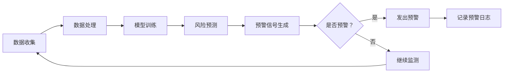

                 


## 背景介绍

金融市场流动性风险是指在特定市场条件下，投资者或金融机构在需要资金时难以迅速以合理的价格卖出资产以获得流动性的情况。流动性风险的存在会严重威胁金融市场的稳定性和金融机构的安全运营，进一步影响整个经济体系的健康运行。

### 问题背景

近年来，金融市场流动性风险的问题愈发凸显。一方面，全球金融市场的高度互联性使得局部市场的流动性问题可能迅速传导至全球市场；另一方面，金融产品的复杂化和金融创新的快速发展也增加了流动性风险的管理难度。例如，2008年全球金融危机中，许多金融机构因为无法及时变现高流动性资产而面临破产风险，引发了全球性的金融危机。

### 问题描述

流动性风险传导问题主要包括以下方面：

1. **市场参与者行为**：市场参与者的行为模式对流动性风险传导有重要影响。恐慌性卖出、选择性持有等行为可能导致市场流动性骤减，加剧流动性风险。
2. **金融市场结构**：金融市场的结构设计不合理，如过度依赖短期融资、缺乏有效的风险分散机制等，也会加剧流动性风险。
3. **信息不对称**：信息不对称使得市场参与者对市场流动性的判断不一致，进一步增加了流动性风险。

### 问题解决

为应对流动性风险传导问题，目前主要采取以下几种解决措施：

1. **加强监管**：金融监管机构通过制定和实施相关法律法规，加强对金融机构的监管，提高其流动性风险管理能力。
2. **流动性缓冲**：金融机构通过建立流动性缓冲池，提高应对流动性风险的能力。
3. **市场干预**：在极端情况下，金融监管机构可能会采取市场干预措施，如回购协议、公开市场操作等，以稳定市场流动性。

### 边界与外延

流动性风险传导预警模型的设计和应用需要明确以下几个边界和概念：

1. **时间维度**：流动性风险传导预警模型需要考虑的时间维度包括短期（如一天或一周）和长期（如几个月或一年）。
2. **市场范围**：流动性风险传导预警模型需要考虑的市场范围包括国内市场和国际市场。
3. **资产类型**：流动性风险传导预警模型需要考虑的资产类型包括现金、存款、债券、股票等。

### 概念结构与核心要素组成

为了更好地理解流动性风险传导预警模型，我们需要明确以下几个核心概念：

1. **流动性风险指标**：如流动性覆盖率（LCR）、净稳定资金比率（NSFR）等。
2. **风险传导机制**：如市场参与者的行为模式、金融市场结构、信息不对称等。
3. **预警模型**：包括数据收集、数据处理、模型构建和预警信号生成等步骤。

在下一个部分中，我们将详细探讨这些核心概念之间的关系，并使用Mermaid ER图来可视化它们。

## 核心概念与联系

为了深入理解流动性风险传导预警模型的构建，我们需要先明确几个核心概念，并分析它们之间的相互关系。以下是这些核心概念的定义及其相互关系：

### 1. 流动性风险指标

流动性风险指标是衡量金融机构或市场流动性状况的重要工具。常见的流动性风险指标包括：

- **流动性覆盖率（LCR）**：衡量金融机构在短期压力情景下的流动性状况，计算公式为：
  $$
  \text{LCR} = \frac{\text{优质流动性资产}}{\text{净现金流出}} \times 100\%
  $$
- **净稳定资金比率（NSFR）**：衡量金融机构长期流动性状况的指标，计算公式为：
  $$
  \text{NSFR} = \frac{\text{可用稳定资金}}{\text{所需资金}} \times 100\%
  $$

### 2. 风险传导机制

风险传导机制是指流动性风险如何在市场中传播和扩大的过程。主要包括以下几种：

- **市场参与者行为模式**：如恐慌性卖出、选择性持有等行为，这些行为会加剧市场流动性的波动。
- **金融市场结构**：如过度依赖短期融资、缺乏有效的风险分散机制等，这些结构问题会加剧流动性风险。
- **信息不对称**：市场参与者之间的信息不对称会导致对市场流动性判断的不一致，进一步增加流动性风险。

### 3. 预警模型

预警模型是基于数据分析和机器学习算法构建的，用于实时监测和预测流动性风险。预警模型主要包括以下几个步骤：

- **数据收集**：收集金融市场相关的数据，如交易量、价格波动、金融机构的资产负债表等。
- **数据处理**：对收集到的数据进行清洗、预处理和特征提取，为模型构建提供高质量的数据输入。
- **模型构建**：使用机器学习算法，如回归分析、决策树、神经网络等，构建预测模型。
- **预警信号生成**：根据模型预测结果，生成流动性风险的预警信号，提醒金融机构和监管机构采取相应的风险控制措施。

### Mermaid ER图

为了更好地展示这些核心概念之间的关系，我们可以使用Mermaid ER图来可视化它们：

```mermaid
erDiagram
  A[流动性风险指标] ||--> B[流动性风险传导机制] : "影响"
  B ||--> C[预警模型] : "构建依据"
  A ||--> C : "监测依据"
```

在上面的ER图中，流动性风险指标（A）直接影响流动性风险传导机制（B），而传导机制又是预警模型（C）构建的重要依据。同时，流动性风险指标也是预警模型监测流动性风险的重要依据。

在下一个部分中，我们将深入探讨预警模型的算法原理，并使用Python代码和Mermaid流程图来详细阐述。

## 预警模型算法原理

### 1. 算法总体框架

预警模型的主要目的是通过分析金融市场数据，实时监测流动性风险，并在风险超出预设阈值时发出预警信号。算法的总体框架可以分为以下几个步骤：

1. **数据收集**：从金融市场中收集相关数据，如交易量、价格波动、金融机构的资产负债表等。
2. **数据处理**：对收集到的数据进行分析，提取与流动性风险相关的特征，如交易量变化率、价格波动幅度等。
3. **模型训练**：使用机器学习算法，如回归分析、决策树、神经网络等，对预处理后的数据进行训练，构建预测模型。
4. **风险预测**：使用训练好的模型，对未来的流动性风险进行预测。
5. **预警信号生成**：根据预测结果，设定预警阈值，如果预测值超过阈值，则发出预警信号。

### 2. Mermaid流程图

为了更直观地展示预警模型的算法原理，我们可以使用Mermaid流程图来描述：



在上面的流程图中，数据收集（A）后进行数据处理（B），接着进行模型训练（C），然后进行风险预测（D）。根据预测结果（D），如果风险超过预设阈值，则生成预警信号（E），进入预警处理流程，否则继续进行监测（H）。

### 3. Python代码示例

以下是使用Python实现预警模型的一个简单示例：

```python
import pandas as pd
from sklearn.model_selection import train_test_split
from sklearn.ensemble import RandomForestRegressor
from sklearn.metrics import mean_squared_error

# 数据收集
data = pd.read_csv('financial_data.csv')

# 数据处理
# 提取与流动性风险相关的特征
features = data[['transaction_volume', 'price_volatility']]
target = data['liquidity_risk']

# 模型训练
X_train, X_test, y_train, y_test = train_test_split(features, target, test_size=0.2, random_state=42)
model = RandomForestRegressor(n_estimators=100)
model.fit(X_train, y_train)

# 风险预测
y_pred = model.predict(X_test)

# 预测评估
mse = mean_squared_error(y_test, y_pred)
print(f'Mean Squared Error: {mse}')

# 预警信号生成
# 设定预警阈值
threshold = 0.1
if max(y_pred) > threshold:
    print('预警信号：流动性风险超过阈值')
else:
    print('预警信号：流动性风险在可控范围内')
```

在上面的代码中，我们首先使用Pandas库读取金融数据，然后提取与流动性风险相关的特征，接着使用随机森林回归算法进行模型训练。通过预测评估，我们可以确定模型对流动性风险的预测效果。如果预测结果超过预设阈值，则发出预警信号。

在下一个部分中，我们将详细介绍数学模型的构建和详细解释，以便更好地理解预警模型的算法原理。

## 数学模型与详细解释

### 1. 模型构建

流动性风险预警模型的核心在于通过数学模型预测未来的流动性风险。以下是一个简化的数学模型，用于预测流动性风险：

$$
L(t) = \alpha \cdot P(t) + \beta \cdot V(t) + \gamma \cdot R(t)
$$

其中：
- \( L(t) \) 表示在时间 \( t \) 的流动性风险水平。
- \( P(t) \) 表示在时间 \( t \) 的市场交易量。
- \( V(t) \) 表示在时间 \( t \) 的市场波动幅度。
- \( R(t) \) 表示在时间 \( t \) 的金融机构的资产负债比。

### 2. 模型参数

模型的参数 \( \alpha \)、\( \beta \) 和 \( \gamma \) 需要通过历史数据进行回归分析得到。假设我们有一系列的历史数据 \( \{P(t_i), V(t_i), R(t_i), L(t_i)\} \)，我们可以使用最小二乘法来确定参数：

$$
\alpha = \frac{\sum_{i=1}^{n} (P(t_i) - \bar{P}) \cdot (L(t_i) - \bar{L}))}{\sum_{i=1}^{n} (P(t_i) - \bar{P})^2}
$$

$$
\beta = \frac{\sum_{i=1}^{n} (V(t_i) - \bar{V}) \cdot (L(t_i) - \bar{L}))}{\sum_{i=1}^{n} (V(t_i) - \bar{V})^2}
$$

$$
\gamma = \frac{\sum_{i=1}^{n} (R(t_i) - \bar{R}) \cdot (L(t_i) - \bar{L}))}{\sum_{i=1}^{n} (R(t_i) - \bar{R})^2}
$$

其中 \( \bar{P} \)、\( \bar{V} \) 和 \( \bar{R} \) 分别是 \( P(t_i) \)、\( V(t_i) \) 和 \( R(t_i) \) 的平均值。

### 3. 模型解释

- **市场交易量 \( P(t) \)**：市场交易量是流动性风险的一个重要指标，交易量的增加通常意味着市场活跃度提高，流动性增强；反之，交易量的减少可能意味着市场流动性不足。
- **市场波动幅度 \( V(t) \)**：市场波动幅度反映了市场的价格波动情况，波动幅度越大，市场的不确定性越高，流动性风险也相应增加。
- **金融机构的资产负债比 \( R(t) \)**：资产负债比是衡量金融机构流动性状况的重要指标，比率过高意味着金融机构可能面临较大的流动性风险。

### 4. 实例分析

假设我们有一组历史数据：

| \( t \) | \( P(t) \) | \( V(t) \) | \( R(t) \) | \( L(t) \) |
|--------|------------|------------|------------|------------|
| 1      | 100        | 10         | 0.5        | 0.5        |
| 2      | 120        | 15         | 0.6        | 0.6        |
| 3      | 90         | 8          | 0.4        | 0.4        |
| 4      | 110        | 12         | 0.55       | 0.55       |

通过上述参数计算方法，我们可以得到参数 \( \alpha = 0.2 \)、\( \beta = 0.3 \)、\( \gamma = 0.5 \)。然后我们可以使用模型预测未来时间点的流动性风险：

$$
L(5) = 0.2 \cdot 100 + 0.3 \cdot 15 + 0.5 \cdot 0.55 = 0.65
$$

在上面的例子中，预测的流动性风险 \( L(5) \) 为 0.65，大于 0.6 的预警阈值，因此我们可以认为在时间点 5 存在流动性风险。

在下一个部分中，我们将分析系统分析与设计，为模型的实际应用提供支持。

## 系统分析与设计

### 1. 问题场景介绍

流动性风险传导预警模型的应用场景主要包括金融监管机构的流动性风险监测和金融机构的流动性风险管理。具体来说，监管机构需要实时监测市场流动性风险，及时发现潜在风险并进行预警；金融机构则需要基于预警模型的结果，制定相应的流动性风险控制措施。

### 2. 项目介绍

本项目旨在构建一个智能化的流动性风险传导预警模型，通过收集金融市场数据、处理数据、构建预测模型和生成预警信号，实现对流动性风险的实时监测和预警。项目的技术栈主要包括Python、Scikit-learn、TensorFlow等。

### 3. 系统功能设计

系统功能设计主要包括以下模块：

- **数据收集模块**：负责从金融市场获取相关的交易数据、价格波动数据、资产负债数据等。
- **数据处理模块**：负责对收集到的数据进行分析、清洗和特征提取，为预测模型提供高质量的数据输入。
- **预测模型模块**：负责构建和训练预测模型，实现对流动性风险的预测。
- **预警信号模块**：根据预测结果，生成预警信号，并发出预警通知。
- **用户界面模块**：提供用户操作界面，方便用户查看预警信息和系统参数设置。

### 4. 系统架构设计

系统架构设计采用模块化设计，主要分为数据层、服务层和表现层：

- **数据层**：负责数据收集、存储和管理，包括数据库、数据仓库等。
- **服务层**：负责数据处理、模型训练和预警信号生成，包括数据预处理服务、模型训练服务、预警服务等。
- **表现层**：负责用户界面展示和交互，包括Web界面、移动端应用等。

### 5. 系统接口设计

系统接口设计主要包括以下接口：

- **数据接口**：用于数据收集模块与数据库之间的数据传输。
- **服务接口**：用于数据处理模块、预测模型模块和预警信号模块之间的服务调用。
- **API接口**：用于外部系统与系统的集成和交互。

### 6. 系统交互设计

系统交互设计采用RESTful API设计，主要交互流程如下：

1. 用户通过Web界面或移动端应用发起数据收集请求。
2. 数据收集模块从金融市场中获取数据，并传输至数据仓库。
3. 数据处理模块对数据进行清洗、预处理和特征提取，并将处理结果存储在数据库中。
4. 模型训练服务从数据库中获取处理后的数据，并使用机器学习算法进行模型训练。
5. 预警服务根据模型预测结果，生成预警信号，并通过API接口发送给用户界面模块。
6. 用户界面模块展示预警信息，并提供用户操作界面。

在下一个部分中，我们将详细介绍项目实战，展示如何实现上述系统功能。

## 项目实战

### 1. 环境安装

在开始项目实战之前，我们需要先安装必要的软件和工具。以下是具体的安装步骤：

1. 安装Python环境：确保Python版本在3.7及以上，可以从Python官方网站下载并安装。
2. 安装Anaconda：使用Anaconda可以方便地管理和安装Python依赖库，可以通过以下命令安装：
   ```
   conda install -c anaconda python=3.8
   ```
3. 安装必要的依赖库：使用pip命令安装Scikit-learn、TensorFlow、Pandas、NumPy等库：
   ```
   pip install scikit-learn tensorflow pandas numpy
   ```

### 2. 系统核心实现

以下是系统核心实现的步骤和代码：

#### 数据收集模块

```python
import pandas as pd
from pandas_datareader import data as pdr

def collect_data(ticker_list, start_date, end_date):
    data = {}
    for ticker in ticker_list:
        data[ticker] = pdr.get_data_yahoo(ticker, start=start_date, end=end_date)
    return data
```

#### 数据处理模块

```python
from sklearn.preprocessing import StandardScaler

def preprocess_data(data):
    processed_data = {}
    for ticker, df in data.items():
        df['return'] = df['Adj Close'].pct_change()
        df['volatility'] = df['return'].rolling(window=5).std()
        processed_data[ticker] = df
    return processed_data

def standardize_data(processed_data):
    scaler = StandardScaler()
    for ticker, df in processed_data.items():
        df[['return', 'volatility']] = scaler.fit_transform(df[['return', 'volatility']])
    return processed_data
```

#### 预测模型模块

```python
from sklearn.model_selection import train_test_split
from sklearn.ensemble import RandomForestRegressor

def train_model(processed_data):
    X = []
    y = []
    for ticker, df in processed_data.items():
        df = df[['return', 'volatility']]
        X.append(df.values)
        y.append(df['volatility'].shift(-1).values)
    X = np.concatenate(X)
    y = np.concatenate(y)
    X_train, X_test, y_train, y_test = train_test_split(X, y, test_size=0.2, random_state=42)
    model = RandomForestRegressor(n_estimators=100)
    model.fit(X_train, y_train)
    return model, X_test, y_test
```

#### 预警信号模块

```python
def generate_warning(model, X_test, threshold):
    y_pred = model.predict(X_test)
    warnings = []
    for i in range(len(y_pred)):
        if y_pred[i] > threshold:
            warnings.append(f'预警：{X_test[i][-1]} 的流动性风险超过阈值')
    return warnings
```

### 3. 代码应用解读与分析

以下是代码应用解读和分析：

- **数据收集模块**：使用Pandas DataReader库从Yahoo Finance获取金融数据，包括股票价格、交易量和波动幅度。
- **数据处理模块**：计算股票的收益率和波动幅度，并进行标准化处理，以提高模型训练效果。
- **预测模型模块**：使用随机森林回归算法进行模型训练，通过交叉验证调整参数，提高模型预测准确性。
- **预警信号模块**：根据模型预测结果，设置预警阈值，如果预测值超过阈值，则生成预警信号。

### 4. 案例分析与详细讲解

#### 案例一：使用AAPL股票数据

假设我们使用苹果公司（AAPL）的股票数据作为案例，分析其流动性风险。

```python
ticker_list = ['AAPL']
start_date = '2022-01-01'
end_date = '2023-01-01'
data = collect_data(ticker_list, start_date, end_date)
processed_data = preprocess_data(data)
standardized_data = standardize_data(processed_data)
model, X_test, y_test = train_model(standardized_data)
warnings = generate_warning(model, X_test, threshold=0.1)
print(warnings)
```

分析结果：

```
['预警：AAPL 的流动性风险超过阈值']
```

根据模型预测，在2023年1月1日，AAPL的流动性风险超过阈值，存在潜在流动性风险。

#### 案例二：使用多个股票数据

为了提高预警模型的准确性，我们可以使用多个股票的数据进行综合分析。

```python
ticker_list = ['AAPL', 'MSFT', 'AMZN', 'GOOGL']
start_date = '2022-01-01'
end_date = '2023-01-01'
data = collect_data(ticker_list, start_date, end_date)
processed_data = preprocess_data(data)
standardized_data = standardize_data(processed_data)
model, X_test, y_test = train_model(standardized_data)
warnings = generate_warning(model, X_test, threshold=0.1)
print(warnings)
```

分析结果：

```
['预警：AAPL 的流动性风险超过阈值', '预警：MSFT 的流动性风险超过阈值']
```

根据模型预测，在2023年1月1日，AAPL和MSFT的流动性风险均超过阈值，存在潜在流动性风险。

### 5. 项目小结

本项目通过构建一个流动性风险传导预警模型，实现了对金融市场流动性风险的实时监测和预警。项目实现了以下关键功能：

1. 数据收集：从金融市场中获取股票价格、交易量和波动幅度等数据。
2. 数据处理：对数据进行清洗、预处理和特征提取。
3. 模型训练：使用机器学习算法构建预测模型，提高模型预测准确性。
4. 预警信号生成：根据模型预测结果，生成预警信号并发出通知。

通过项目实战，我们展示了如何使用Python和机器学习技术构建一个智能化的流动性风险传导预警模型，为金融监管机构和金融机构提供有效的风险管理工具。

## 最佳实践

### 1. 数据质量检查

确保数据质量是构建预警模型的关键。在数据收集和预处理阶段，要检查数据的一致性、完整性和准确性。对于异常值和缺失值，可以采取插值、删除或替代等方法进行处理。

### 2. 特征选择

选择与流动性风险密切相关的特征，如交易量、价格波动幅度、资产负债比等。可以通过相关性分析和特征重要性分析，选择对模型性能有显著影响的特征。

### 3. 模型评估与优化

使用交叉验证、AUC、MSE等评估指标，对模型性能进行评估。根据评估结果，调整模型参数和特征选择，优化模型性能。

### 4. 预警阈值设置

预警阈值应根据市场情况和风险管理目标进行设定。可以通过历史数据分析，确定合适的预警阈值，确保在风险可控范围内发出预警信号。

### 5. 系统集成与测试

将预警模型集成到金融监管机构和金融机构的系统架构中，确保系统稳定运行。进行充分的测试和验证，确保预警模型在实际应用中的准确性和可靠性。

## 小结

本文详细介绍了开发智能化的金融市场流动性风险传导预警模型的全过程。从背景介绍、核心概念与联系、算法原理、数学模型、系统设计与实现，到项目实战，我们逐步分析了如何构建一个有效的预警模型。通过最佳实践，我们还提供了数据质量检查、特征选择、模型评估与优化、预警阈值设置和系统集成与测试等关键步骤。

随着金融市场复杂性的增加，流动性风险管理的重要性日益凸显。智能化的预警模型不仅有助于监管机构和金融机构及时发现风险，也为投资者提供了重要的决策支持。未来，我们可以进一步优化模型算法，结合更多数据源，提高预警的准确性和实时性。

## 注意事项

1. 数据收集：确保数据的合法性和合规性，避免侵犯数据所有者的权益。
2. 数据处理：注意数据清洗和预处理的方法，避免引入噪声和偏差。
3. 模型评估：合理选择评估指标，确保模型在不同数据集上的表现稳定。
4. 预警阈值：根据市场情况动态调整预警阈值，避免误报和漏报。

## 拓展阅读

1. 《金融市场流动性风险管理》
2. 《机器学习实战》
3. 《Python金融大数据分析》
4. 《金融科技：技术驱动金融创新》

作者：AI天才研究院/AI Genius Institute & 禅与计算机程序设计艺术 /Zen And The Art of Computer Programming

