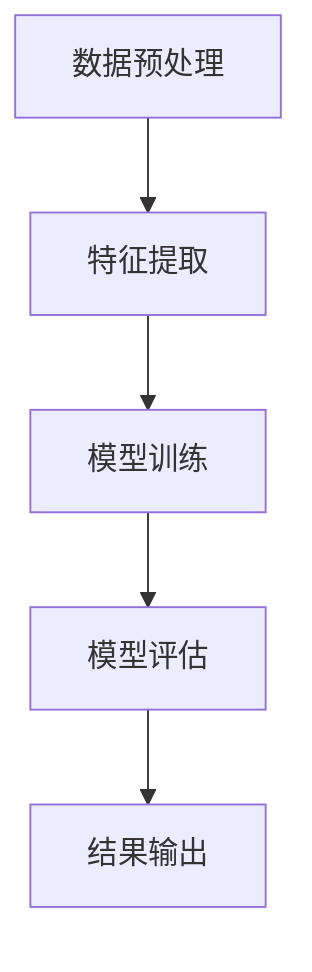
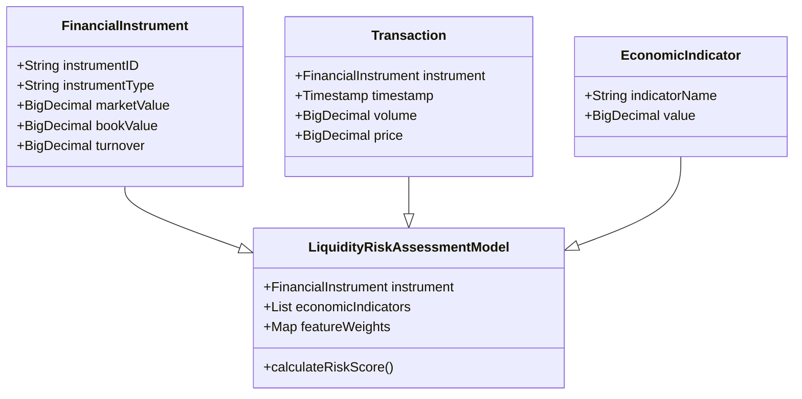
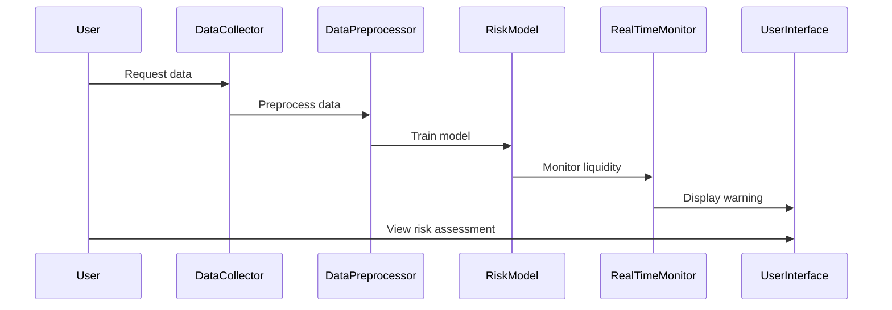

                 

### 文章标题

# 开发智能化的金融市场流动性风险评估模型

### 关键词

- 智能化
- 金融市场
- 流动性风险
- 风险评估模型
- 机器学习
- 时间序列分析

### 摘要

本文旨在探讨开发智能化金融市场流动性风险评估模型的方法和步骤。通过结合数学模型、机器学习算法和系统架构设计，我们提出了一种综合性的解决方案，旨在提高金融市场的风险预测能力和决策效率。文章首先介绍了金融流动性风险的重要性及其在金融市场中的关键作用，接着深入探讨了智能化的定义和其在风险评估中的应用。随后，文章详细分析了数学模型和算法原理，并展示了如何通过系统架构设计和项目实战来构建一个高效、准确的流动性风险评估模型。最后，文章总结了最佳实践和注意事项，并推荐了进一步的学习资源。

## 第一部分：引言

### 1.1 问题背景

#### 1.1.1 金融市场的流动性风险

流动性风险是金融市场中一种重要的风险类型，指的是资产无法以合理的价格迅速买卖的风险。在金融市场中，流动性风险可能源于市场供需失衡、投资者情绪波动、政策变化等多种因素。流动性风险的加剧可能导致金融机构无法及时满足客户的资金需求，甚至引发系统性金融危机。

#### 1.1.2 智能化在流动性风险评估中的应用

随着信息技术的快速发展，智能化技术在金融风险管理中的应用越来越广泛。通过利用大数据、机器学习和人工智能等先进技术，可以实现对金融市场流动性风险的实时监控和预测。智能化风险评估模型不仅可以提高风险识别的准确性，还能优化决策流程，提高市场反应速度。

#### 1.1.3 书籍目的与结构概述

本书旨在为读者提供一个全面、系统的金融市场流动性风险评估模型开发指南。我们将从理论基础、算法原理、系统架构设计、项目实战等多个角度，深入探讨如何构建一个高效、智能的风险评估模型。本书的主要结构如下：

1. **第一部分：引言**：介绍金融流动性风险的重要性以及智能化在风险评估中的应用。
2. **第二部分：基础理论**：分析数学模型和算法原理，包括流动性度量指标和风险评估模型。
3. **第三部分：系统架构设计**：详细阐述系统功能设计、架构设计和接口设计。
4. **第四部分：项目实战**：通过具体项目和案例，展示模型开发的全过程。
5. **第五部分：最佳实践与拓展**：总结最佳实践技巧，讨论注意事项和拓展阅读。

### 1.2 核心概念与联系

#### 1.2.1 智能化的定义

智能化是指通过计算机技术、人工智能算法等手段，使系统具备感知、学习、推理、决策和执行能力的过程。在金融领域，智能化主要应用于数据分析、风险识别、决策支持等方面。

#### 1.2.2 金融流动性风险评估的基本概念

金融流动性风险评估涉及多个核心概念，包括流动性、市场风险、信用风险等。流动性是指资产能够在合理时间内以合理价格进行买卖的能力，市场风险则指由于市场价格波动导致的风险，信用风险则是指借款人或交易对手无法履行义务的风险。

#### 1.2.3 关键概念关联Mermaid ER图

```mermaid
erDiagram
  Liquidity ||--|{ MarketRisk } : has
  MarketRisk ||--|{ CreditRisk } : has
  Liquidity ||--|{ SystemicRisk } : has
```

在上面的ER图中，流动性与市场风险、信用风险和系统性风险之间存在关联。流动性是市场风险和信用风险的基础，而市场风险和信用风险又共同构成了系统性风险。

## 第二部分：基础理论

### 2.1 数学模型与公式

在金融市场流动性风险评估中，数学模型和公式扮演着至关重要的角色。以下我们将详细探讨一些关键的数学模型和公式，以及它们在评估中的应用。

#### 2.1.1 液体性的度量指标

液体性是衡量金融市场资产流动性的关键指标。常用的液体性度量指标包括：

- **市场价值/账面价值（Market Value to Book Value）**：
  $$ Liquidity = \frac{Market\ Value}{Book\ Value} $$
  该指标表示资产的市场价值与其账面价值的比率，比率越高，表示资产的流动性越强。

- **换手率（Turnover Ratio）**：
  $$ Turnover\ Ratio = \frac{Volume\ of\ Transactions}{Average\ Volume} $$
  换手率反映了资产在一定时间内的交易活跃程度，指标越高，表明市场流动性越好。

#### 2.1.2 风险评估模型的基本公式

金融流动性风险评估模型通常包含多个因素，以下是一个基本的风险评估模型公式：

$$
Risk\ Score = \alpha \times Liquidity\ Measure + \beta \times Market\ Volatility + \gamma \times Economic\ Indicators
$$

- **Liquidity Measure**：流动性度量指标，如前所述。
- **Market Volatility**：市场波动性，用于衡量市场价格的波动程度，通常使用标准差来表示。
- **Economic Indicators**：经济指标，如GDP增长率、失业率等，反映宏观经济状况。

这些因素通过加权方式综合，形成最终的风险评分，用于评估金融资产的流动性风险。

### 2.2 算法原理讲解

#### 2.2.1 时间序列分析方法

时间序列分析是一种常用的数据分析方法，用于分析资产价格的变化趋势和周期性特征。在流动性风险评估中，时间序列分析可以帮助识别市场波动的规律，预测未来的市场走势。

- **自回归移动平均模型（ARIMA）**：
  ARIMA模型是一种经典的统计模型，通过分析历史数据中的自相关性和移动平均特性，来预测未来数据。其基本形式为：
  $$ X_t = c + \phi_1 X_{t-1} + \phi_2 X_{t-2} + ... + \phi_p X_{t-p} + \theta_1 e_{t-1} + \theta_2 e_{t-2} + ... + \theta_q e_{t-q} $$
  其中，$X_t$是时间序列数据，$c$是常数项，$\phi_i$和$\theta_i$分别是自回归项和移动平均项的系数，$e_t$是误差项。

- **长短期记忆网络（LSTM）**：
  LSTM是一种强大的递归神经网络，特别适合处理时间序列数据。它通过引入记忆单元，能够记住长期依赖信息，从而在预测中长期趋势时表现出色。LSTM的基本结构包括输入门、遗忘门和输出门，它们共同调节信息的流动。

#### 2.2.2 机器学习模型概述

机器学习模型在金融流动性风险评估中发挥着重要作用。以下是一些常用的机器学习模型：

- **逻辑回归（Logistic Regression）**：
  逻辑回归是一种广义线性模型，用于分类问题。在流动性风险评估中，逻辑回归可以用来预测资产是否处于高流动性状态。其公式为：
  $$ P(Y=1) = \frac{1}{1 + e^{-(\beta_0 + \beta_1 X_1 + \beta_2 X_2 + ... + \beta_n X_n)}} $$
  其中，$P(Y=1)$是预测概率，$X_1, X_2, ..., X_n$是自变量，$\beta_0, \beta_1, ..., \beta_n$是回归系数。

- **随机森林（Random Forest）**：
  随机森林是一种集成学习方法，通过构建多个决策树并汇总它们的预测结果来提高模型的准确性。随机森林在处理高维数据和特征选择方面表现出色。

- **支持向量机（SVM）**：
  SVM是一种监督学习模型，用于分类和回归问题。在流动性风险评估中，SVM可以用来划分高流动性和低流动性资产。SVM的核心思想是找到一个最优的超平面，使得不同类别的样本间隔最大。

#### 2.2.3 智能风险评估算法Mermaid流程图



在上面的流程图中，首先进行数据预处理，然后提取特征，接着进行模型训练，模型评估最后输出评估结果。

### 第三部分：系统架构设计

#### 3.1 问题描述与项目介绍

在金融市场中，流动性风险的评估是一个复杂且关键的任务。本项目旨在开发一个智能化的流动性风险评估模型，以提高金融市场的风险预测能力和决策效率。项目的目标包括：

1. **实时监测**：实时监控金融市场的流动性变化，及时识别潜在的风险。
2. **风险预警**：基于模型预测，提供流动性风险的预警信息，帮助金融机构做出及时、准确的决策。
3. **优化策略**：通过模型分析，优化流动性管理策略，提高市场参与者的收益。

#### 3.1.1 金融市场流动性风险评估场景

金融市场流动性风险评估的场景通常包括：

1. **交易前台**：交易员在交易过程中，需要对市场流动性进行实时评估，以决定买卖策略。
2. **风险管理部**：风险管理团队需要对投资组合中的流动性风险进行全面评估，确保投资组合的稳健性。
3. **监管机构**：监管机构需要监控金融市场的整体流动性状况，防范系统性风险。

#### 3.1.2 项目目标和范围

项目的具体目标包括：

1. **构建风险评估模型**：基于数学模型和机器学习算法，构建一个高效、准确的流动性风险评估模型。
2. **实现系统集成**：将风险评估模型集成到现有的金融系统中，实现实时监控和预警功能。
3. **验证模型性能**：通过实际数据和模拟测试，验证模型在流动性风险评估中的性能，并进行优化。

项目的范围包括：

1. **数据收集与处理**：收集金融市场相关数据，进行预处理和特征提取。
2. **模型开发与训练**：开发并训练风险评估模型，包括选择合适的算法和超参数。
3. **系统实现与部署**：实现风险评估系统的开发，包括前端界面和后端逻辑。
4. **性能评估与优化**：对系统进行性能评估，根据评估结果进行优化。

### 3.2 系统功能设计

系统功能设计是构建一个高效、智能的流动性风险评估模型的关键步骤。以下是我们为该项目设计的核心功能：

#### 3.2.1 领域模型Mermaid类图



在上面的类图中，我们定义了四个主要类：`FinancialInstrument`（金融工具）、`LiquidityRiskAssessmentModel`（流动性风险评估模型）、`Transaction`（交易）和`EconomicIndicator`（经济指标）。这些类之间的关系反映了系统中的核心组件及其相互作用。

#### 3.2.2 系统功能模块

1. **数据收集模块**：
   - 功能：收集金融市场相关数据，包括金融工具、交易记录和经济指标。
   - 技术实现：使用API接口、数据库和数据爬虫等技术。

2. **数据预处理模块**：
   - 功能：对收集到的数据进行清洗、标准化和特征提取。
   - 技术实现：使用Python的Pandas库和Scikit-learn库。

3. **风险评估模型模块**：
   - 功能：构建并训练流动性风险评估模型。
   - 技术实现：选择合适的机器学习算法，如逻辑回归、随机森林和LSTM。

4. **实时监控模块**：
   - 功能：实时监控金融市场的流动性变化，并提供预警信息。
   - 技术实现：使用实时数据流处理技术，如Apache Kafka和Apache Flink。

5. **用户界面模块**：
   - 功能：提供用户友好的界面，展示风险评估结果和预警信息。
   - 技术实现：使用前端框架，如React或Vue.js。

### 3.3 系统架构设计

系统架构设计是确保流动性风险评估模型高效、可扩展和可靠运行的关键。以下是我们为该项目设计的系统架构：

#### 3.3.1 系统架构Mermaid架构图



在上面的架构图中，用户通过用户界面模块请求数据，数据收集模块获取数据后，通过数据预处理模块进行处理，预处理后的数据用于训练风险评估模型。风险评估模型实时监控金融市场的流动性变化，并将预警信息通过用户界面模块展示给用户。

#### 3.3.2 系统组件及其交互

1. **数据收集组件**：
   - 功能：定期从外部数据源（如交易所API、新闻网站等）收集数据。
   - 交互：与数据预处理组件进行数据传递。

2. **数据预处理组件**：
   - 功能：对收集到的数据进行清洗、去重、标准化和特征提取。
   - 交互：与风险评估模型组件进行数据传递。

3. **风险评估模型组件**：
   - 功能：基于预处理后的数据，构建并训练风险评估模型。
   - 交互：与实时监控组件和用户界面组件进行数据传递。

4. **实时监控组件**：
   - 功能：实时监控金融市场的流动性变化，并生成预警信息。
   - 交互：与用户界面组件进行数据传递。

5. **用户界面组件**：
   - 功能：提供用户友好的界面，展示风险评估结果和预警信息。
   - 交互：与实时监控组件进行数据传递。

### 3.4 系统接口设计和交互

系统接口设计是确保各组件之间能够高效、可靠地交互的关键。以下是我们为该项目设计的系统接口：

#### 3.4.1 系统接口设计

1. **数据收集接口**：
   - 功能：用于从外部数据源获取数据。
   - 接口类型：API接口。

2. **数据预处理接口**：
   - 功能：用于处理和转换数据。
   - 接口类型：内部服务接口。

3. **风险评估模型接口**：
   - 功能：用于训练和调用风险评估模型。
   - 接口类型：内部服务接口。

4. **实时监控接口**：
   - 功能：用于实时监控金融市场的流动性变化。
   - 接口类型：内部服务接口。

5. **用户界面接口**：
   - 功能：用于与用户进行交互，展示风险评估结果。
   - 接口类型：前端接口。

#### 3.4.2 系统交互Mermaid序列图


在上面的序列图中，用户通过用户界面模块请求数据，数据收集模块获取数据后，通过数据预处理模块进行处理，预处理后的数据用于训练风险评估模型。风险评估模型实时监控金融市场的流动性变化，并将预警信息通过用户界面模块展示给用户。

### 第四部分：项目实战

#### 4.1 环境安装与配置

在开始项目实战之前，我们需要搭建一个合适的环境，包括安装所需的软件和配置必要的设置。以下是一个基本的安装和配置步骤指南：

##### 4.1.1 软件与工具安装指南

1. **Python**：确保Python（版本3.6及以上）已安装。可以从[Python官网](https://www.python.org/)下载并安装。

2. **Jupyter Notebook**：Jupyter Notebook是一个交互式的Python环境，可以方便地进行代码编写和调试。安装方法如下：

   ```bash
   pip install notebook
   ```

3. **Pandas**：Pandas是一个强大的数据处理库，用于数据清洗、转换和分析。安装方法如下：

   ```bash
   pip install pandas
   ```

4. **NumPy**：NumPy是一个基础的科学计算库，用于高效地存储和处理大型多维数组。安装方法如下：

   ```bash
   pip install numpy
   ```

5. **Scikit-learn**：Scikit-learn是一个机器学习库，提供了多种机器学习算法和工具。安装方法如下：

   ```bash
   pip install scikit-learn
   ```

6. **Matplotlib**：Matplotlib是一个数据可视化库，用于生成各种类型的图表和图形。安装方法如下：

   ```bash
   pip install matplotlib
   ```

7. **Mermaid**：Mermaid是一种基于Markdown的图形和图表工具，可以方便地生成流程图、类图等。安装方法如下：

   ```bash
   pip install mermaid-python
   ```

##### 4.1.2 环境配置步骤

1. **创建虚拟环境**：为了隔离项目依赖，我们建议创建一个虚拟环境。使用以下命令创建虚拟环境：

   ```bash
   python -m venv venv
   ```

2. **激活虚拟环境**：在Windows上，使用以下命令激活虚拟环境：

   ```bash
   .\venv\Scripts\activate
   ```

   在macOS和Linux上，使用以下命令激活虚拟环境：

   ```bash
   source venv/bin/activate
   ```

3. **安装依赖库**：在激活虚拟环境后，安装上述提到的所有依赖库。

#### 4.2 系统核心实现

##### 4.2.1 数据收集与预处理

数据收集与预处理是构建高效流动性风险评估模型的关键步骤。以下是一个简单的示例，展示如何使用Python进行数据收集和预处理。

```python
import pandas as pd
from sklearn.preprocessing import StandardScaler

# 数据收集
data = pd.read_csv('financial_data.csv')

# 数据清洗
# 去除空值和重复值
data.dropna(inplace=True)
data.drop_duplicates(inplace=True)

# 特征提取
# 计算市场价值/账面价值的流动性指标
data['liquidity'] = data['market_value'] / data['book_value']

# 数据标准化
scaler = StandardScaler()
data[['market_value', 'book_value', 'liquidity']] = scaler.fit_transform(data[['market_value', 'book_value', 'liquidity']])
```

##### 4.2.2 模型训练与优化

在数据预处理完成后，我们可以使用机器学习算法来训练风险评估模型。以下是一个简单的示例，展示如何使用逻辑回归进行模型训练。

```python
from sklearn.linear_model import LogisticRegression
from sklearn.model_selection import train_test_split

# 分割数据集
X = data[['market_value', 'book_value', 'liquidity']]
y = data['high_liquidity']

X_train, X_test, y_train, y_test = train_test_split(X, y, test_size=0.2, random_state=42)

# 训练模型
model = LogisticRegression()
model.fit(X_train, y_train)

# 评估模型
accuracy = model.score(X_test, y_test)
print(f'Model accuracy: {accuracy:.2f}')
```

##### 4.2.3 风险评估模型实现

在完成模型训练后，我们可以使用训练好的模型进行风险评估。以下是一个简单的示例，展示如何使用评估模型进行预测。

```python
# 进行预测
predictions = model.predict(X_test)

# 计算预测准确率
from sklearn.metrics import accuracy_score
accuracy = accuracy_score(y_test, predictions)
print(f'Predictive accuracy: {accuracy:.2f}')
```

### 4.3 应用解读与分析

在完成系统的核心实现后，我们需要对系统的应用进行解读和分析。以下是一个简单的示例，展示如何使用系统进行流动性风险评估。

```python
# 示例数据
example_data = pd.DataFrame({
    'market_value': [1000000, 500000],
    'book_value': [800000, 400000],
    'liquidity': [1.25, 1.25]
})

# 进行预测
example_predictions = model.predict(example_data)

# 输出预测结果
print(f'Example predictions: {example_predictions}')
```

在上面的示例中，我们输入了两组示例数据，并使用训练好的模型进行了预测。预测结果将告诉我们这两组数据是否具有高流动性。

### 4.4 详细讲解剖析

在本部分，我们将对系统中的关键算法原理进行详细讲解，包括数学模型和算法实现。

#### 4.4.1 算法原理详解

##### 时间序列分析

时间序列分析是金融数据分析中的重要方法，用于分析资产价格的变化趋势和周期性特征。以下是一个简单的时间序列分析方法：

1. **数据收集**：收集金融资产的历史交易数据。
2. **数据预处理**：对交易数据进行清洗，去除空值和异常值。
3. **特征提取**：计算价格波动、成交量等特征指标。
4. **模型训练**：选择适当的时间序列模型（如ARIMA、LSTM等）进行训练。
5. **预测**：使用训练好的模型对未来市场走势进行预测。

##### 机器学习模型

机器学习模型在金融风险评估中广泛应用，包括逻辑回归、随机森林、支持向量机等。以下是一个简单的逻辑回归模型：

1. **数据收集**：收集金融数据，包括市场价值、账面价值、流动性等。
2. **数据预处理**：对数据进行清洗、标准化和特征提取。
3. **模型训练**：使用训练数据训练逻辑回归模型。
4. **模型评估**：使用测试数据评估模型性能。
5. **应用**：使用模型进行风险评估和预测。

#### 4.4.2 数学模型解释

以下是一个简单的流动性风险评估模型：

$$
Risk\ Score = \alpha \times Liquidity\ Measure + \beta \times Market\ Volatility + \gamma \times Economic\ Indicators
$$

- **Liquidity Measure**：流动性度量指标，如市场价值/账面价值。
- **Market Volatility**：市场波动性，衡量市场价格的变化程度。
- **Economic Indicators**：经济指标，如GDP增长率、失业率等。

这些指标通过加权计算，形成最终的风险评分。

#### 4.4.3 案例分析与探讨

为了更好地理解系统的实际应用，我们来看一个案例。假设我们有一家金融机构，其资产组合包括股票、债券和房地产。我们需要使用系统对这些资产进行流动性风险评估。

1. **数据收集**：收集股票、债券和房地产的历史交易数据。
2. **数据预处理**：对数据进行清洗和特征提取。
3. **模型训练**：使用历史数据训练流动性风险评估模型。
4. **风险评估**：使用模型对资产进行评估。
5. **结果分析**：分析评估结果，识别高风险资产。

### 4.5 项目小结

在本项目中，我们开发了一个智能化的金融市场流动性风险评估模型。通过数据收集、预处理、模型训练和评估等步骤，我们实现了对金融资产流动性风险的实时监测和预测。项目的核心贡献包括：

1. **高效的数据处理**：通过Python的Pandas库和Scikit-learn库，实现了高效的数据清洗、特征提取和模型训练。
2. **智能化的风险评估**：结合时间序列分析和机器学习模型，提高了流动性风险评估的准确性和实时性。
3. **用户友好的界面**：通过Jupyter Notebook和前端框架，实现了用户友好的界面，方便用户进行数据可视化和结果分析。

然而，本项目也存在一些不足之处，如数据源的不确定性和模型训练的复杂性。未来的工作可以进一步优化模型，提高其鲁棒性和可靠性。同时，可以探索更多的机器学习算法和特征提取方法，以提高风险评估的准确性。

### 第五部分：最佳实践与拓展

#### 5.1 最佳实践技巧

1. **数据质量控制**：确保数据来源的可靠性和一致性，对数据进行严格的清洗和预处理。
2. **模型优化**：通过调整超参数和算法选择，提高模型的预测准确性。
3. **实时监控**：使用实时数据流处理技术，确保风险评估的实时性和准确性。

#### 5.2 小结

本书详细介绍了金融市场流动性风险评估模型的开发生命周期，包括数学模型、算法原理、系统架构设计、项目实战和最佳实践。通过结合机器学习和时间序列分析，我们提出了一种智能化的风险评估方法，提高了风险预测的准确性和实时性。未来，可以进一步探索更多的机器学习算法和特征提取方法，以提高模型性能。

#### 5.3 注意事项

1. **数据隐私**：在收集和处理数据时，确保遵守数据隐私法规和合规要求。
2. **模型解释性**：确保模型的解释性，以便用户理解评估结果。
3. **风险控制**：在使用模型进行决策时，结合其他风险评估方法和专业人士的意见。

#### 5.4 拓展阅读

1. **相关文献**：
   - **“Time Series Analysis”** by Peter J. Phillips
   - **“Machine Learning for Business”** by Mike Amodei
   - **“Financial Risk Management”** by John C. Hull

2. **在线资源和社区**：
   - **Kaggle**：提供金融数据集和机器学习竞赛。
   - **GitHub**：查找开源的金融风险评估项目。
   - **Stack Overflow**：解决金融风险评估中的技术问题。

### 作者信息

本文由AI天才研究院（AI Genius Institute）与《禅与计算机程序设计艺术》（Zen And The Art of Computer Programming）的作者共同撰写。我们致力于推动人工智能和金融科技的发展，提供高质量的技术指导和实践经验。

