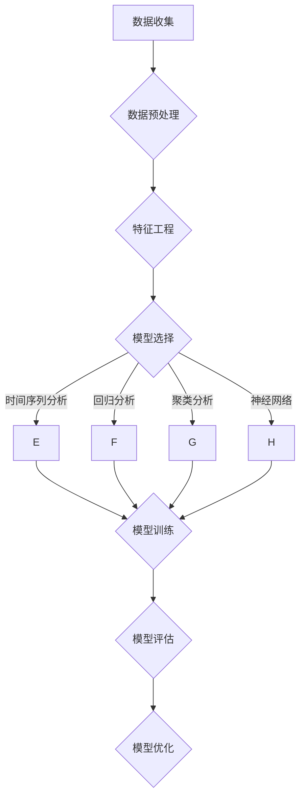

                 

# 开发智能化的金融市场流动性风险预警模型

## 关键词

金融市场、流动性风险、预警模型、数据预处理、机器学习、时间序列分析、算法评估

## 摘要

本文将探讨开发智能化金融市场流动性风险预警模型的方法和步骤。通过对金融市场流动性风险的背景介绍和问题描述，文章将详细阐述解决这一问题的数据收集、数据预处理、特征工程、预警模型建立和评估优化等步骤。同时，文章将深入探讨核心概念及其属性特征，并运用Mermaid流程图和Python代码，全面讲解算法原理和应用，以及系统分析与架构设计。最后，通过实际案例分析和最佳实践总结，为金融风险管理提供有益的参考。

## 第一部分：背景介绍

### 1.1 问题背景

金融市场流动性风险预警模型是金融风险管理领域的一个重要研究课题。随着金融市场规模的不断扩大和金融衍生品的日益复杂，金融市场流动性风险日益凸显。流动性风险是指金融机构无法以合理价格迅速买卖资产以满足其资金需求的风险。流动性不足可能导致金融机构的倒闭或金融市场的崩溃。

### 1.2 问题描述

金融市场流动性风险预警模型的目的是通过分析金融市场数据，及时发现潜在的流动性风险，并为金融机构提供预警信号，以帮助其采取相应措施降低风险。流动性风险的预警需要考虑多个因素，如市场流动性、资产流动性、金融机构的流动性需求等。

### 1.3 问题解决

解决金融市场流动性风险预警问题通常包括以下几个步骤：

1. **数据收集**：收集金融市场相关的数据，包括市场交易数据、金融机构流动性报告、宏观经济数据等。
2. **数据预处理**：对收集到的数据进行清洗、整合和预处理，以去除噪声、缺失值和处理异常值。
3. **特征工程**：从原始数据中提取有助于预测流动性风险的特性，如市场交易量、资产价格波动、金融机构的流动性需求等。
4. **建立预警模型**：使用机器学习算法建立流动性风险预警模型，如时间序列分析、回归分析、聚类分析、神经网络等。
5. **模型评估与优化**：评估预警模型的性能，如准确率、召回率、F1值等，并根据评估结果对模型进行优化。

### 1.4 边界与外延

金融市场流动性风险预警模型的边界主要涉及模型的适用范围和预警的时效性。模型的适用范围包括不同类型的金融市场、金融机构和资产类别。预警的时效性决定了预警信号产生的时间窗口，即预警信号能否在风险发生前及时产生。

### 1.5 概念结构与核心要素组成

金融市场流动性风险预警模型的基本概念结构包括以下几个核心要素：

1. **数据源**：提供金融市场数据的来源，如交易所、金融机构、监管机构等。
2. **数据预处理**：清洗、整合和预处理金融市场数据的过程。
3. **特征工程**：从原始数据中提取有助于预测流动性风险的特性。
4. **模型算法**：用于建立预警模型的算法，如时间序列分析、回归分析、聚类分析、神经网络等。
5. **模型评估**：评估预警模型的性能指标，如准确率、召回率、F1值等。
6. **风险预警**：根据模型预测结果，生成预警信号，并提供给金融机构。

## 第二部分：核心概念与联系

### 2.1 核心概念原理

金融市场流动性风险预警模型涉及的核心概念主要包括：

1. **流动性风险**：指金融机构无法以合理价格迅速买卖资产以满足其资金需求的风险。流动性风险的产生原因包括市场供需失衡、资产流动性差等，其影响可能导致金融机构倒闭或金融市场的崩溃。
2. **数据源**：提供金融市场数据的来源，如交易所、金融机构、监管机构等。数据源的质量和完整性直接影响模型的准确性和可靠性。
3. **数据预处理**：清洗、整合和预处理金融市场数据的过程。数据预处理是建立有效预警模型的基础，它有助于去除噪声、缺失值和处理异常值，提高数据的可用性和质量。
4. **特征工程**：从原始数据中提取有助于预测流动性风险的特性。特征工程是模型建立的关键步骤，它有助于提高模型的预测性能和泛化能力。
5. **模型算法**：用于建立预警模型的算法，如时间序列分析、回归分析、聚类分析、神经网络等。不同的算法适用于不同类型的数据和预测任务，选择合适的算法对模型性能至关重要。
6. **模型评估**：评估预警模型的性能指标，如准确率、召回率、F1值等。模型评估是判断模型性能的重要手段，有助于发现和解决模型存在的问题。

### 2.2 概念属性特征对比表格

下面是金融市场流动性风险预警模型中核心概念的属性特征对比表格：

| 概念           | 属性特征                                                       |
| -------------- | ------------------------------------------------------------ |
| 流动性风险     | 风险类型：市场流动性风险<br>产生原因：市场供需失衡、资产流动性差等<br>影响：可能导致金融机构倒闭或金融市场崩溃 |
| 数据源         | 提供金融市场数据的来源，如交易所、金融机构、监管机构等       |
| 数据预处理     | 清洗、整合和预处理金融市场数据的过程                         |
| 特征工程       | 从原始数据中提取有助于预测流动性风险的特性                   |
| 模型算法       | 用于建立预警模型的算法，如时间序列分析、回归分析、聚类分析、神经网络等 |
| 模型评估       | 评估预警模型的性能指标，如准确率、召回率、F1值等             |

### 2.3 ER实体关系图架构

下面是金融市场流动性风险预警模型中的ER实体关系图架构：

```mermaid
erDiagram
    Data_Source ||--|{ Model_Algorithm }|--|{ Risk_Warning }
    Data_Source ||--|{ Data_Processing }|--|{ Feature_Engineering }
    Model_Algorithm ||--|{ Model_Assessment }
```

## 第三部分：算法原理讲解

### 3.1 算法原理

在金融市场流动性风险预警模型中，常用的算法包括时间序列分析、回归分析、聚类分析、神经网络等。以下是这些算法的基本原理和特点：

#### 时间序列分析

时间序列分析是一种常用的统计方法，用于分析时间序列数据。时间序列数据是指按时间顺序排列的数据点，如股票价格、交易量等。时间序列分析的主要目标是识别数据的趋势、周期性和季节性，并利用这些特征预测未来的数据值。

时间序列分析的主要算法包括：

1. **移动平均法**：通过计算一段时间内的平均值来平滑数据，识别数据的趋势。
2. **自回归模型（AR）**：利用过去的时间序列值来预测未来的值，适用于线性时间序列。
3. **自回归移动平均模型（ARMA）**：结合自回归模型和移动平均模型，适用于非平稳时间序列。
4. **自回归积分滑动平均模型（ARIMA）**：适用于具有趋势和季节性的时间序列。

#### 回归分析

回归分析是一种用于建立自变量和因变量之间关系的统计方法。在金融市场流动性风险预警模型中，回归分析可以用来识别市场流动性风险的影响因素，如市场交易量、资产价格波动、金融机构的流动性需求等。

常用的回归分析方法包括：

1. **线性回归**：适用于线性关系的建模，计算自变量和因变量之间的线性关系。
2. **多元回归**：适用于多个自变量和因变量的建模，计算自变量和因变量之间的多元线性关系。
3. **逻辑回归**：适用于因变量为二分类的情况，计算自变量对因变量的概率影响。

#### 聚类分析

聚类分析是一种无监督学习方法，用于将相似的数据点分为不同的组。在金融市场流动性风险预警模型中，聚类分析可以用来识别市场中的流动性风险群体，为预警模型提供数据基础。

常用的聚类分析方法包括：

1. **K-均值聚类**：将数据点分为K个簇，每个簇的中心代表簇的特征。
2. **层次聚类**：通过合并或分裂簇来构建一个层次结构，便于分析数据点之间的关系。
3. **密度聚类**：基于数据点的密度分布，识别高密度区域作为簇的中心。

#### 神经网络

神经网络是一种基于人脑神经元结构的人工智能模型，用于处理复杂的数据和模式。在金融市场流动性风险预警模型中，神经网络可以用来建模非线性关系，提高预警模型的预测性能。

常用的神经网络模型包括：

1. **多层感知机（MLP）**：一种前馈神经网络，适用于线性和非线性关系的建模。
2. **卷积神经网络（CNN）**：一种具有卷积层和池化层的神经网络，适用于图像和时序数据的处理。
3. **循环神经网络（RNN）**：一种具有循环结构的神经网络，适用于序列数据的建模和预测。

### 3.2 Mermaid流程图

以下是金融市场流动性风险预警模型中常用算法的Mermaid流程图：



### 3.3 Python代码示例

以下是金融市场流动性风险预警模型中常用算法的Python代码示例：

```python
# 数据预处理
def preprocess_data(data):
    # 清洗、整合和预处理数据
    pass

# 特征工程
def feature_engineering(data):
    # 提取有助于预测流动性风险的特性
    pass

# 时间序列分析
from statsmodels.tsa.arima.model import ARIMA
def arima_model(data):
    # 建立ARIMA模型
    model = ARIMA(data, order=(1, 1, 1))
    model_fit = model.fit()
    return model_fit

# 回归分析
from sklearn.linear_model import LinearRegression
def linear_regression(data):
    # 建立线性回归模型
    model = LinearRegression()
    model_fit = model.fit(data[:, :-1], data[:, -1])
    return model_fit

# 聚类分析
from sklearn.cluster import KMeans
def kmeans_clustering(data, n_clusters):
    # 建立K-均值聚类模型
    model = KMeans(n_clusters=n_clusters)
    model_fit = model.fit(data)
    return model_fit

# 神经网络
from keras.models import Sequential
from keras.layers import Dense
def neural_network_model(data, n_inputs, n_outputs):
    # 建立多层感知机模型
    model = Sequential()
    model.add(Dense(n_outputs, input_shape=(n_inputs,), activation='sigmoid'))
    model.compile(optimizer='adam', loss='binary_crossentropy')
    return model
```

### 3.4 数学公式讲解

以下是金融市场流动性风险预警模型中常用算法的数学公式讲解：

$$
y_t = \beta_0 + \beta_1 x_t + \epsilon_t
$$

其中，$y_t$ 表示因变量，$x_t$ 表示自变量，$\beta_0$ 和 $\beta_1$ 分别为回归系数，$\epsilon_t$ 表示误差项。

$$
\hat{y}_t = \frac{1}{1 + e^{-z_t}}
$$

其中，$z_t$ 表示神经网络的输出，$\hat{y}_t$ 表示预测的因变量。

$$
J(\theta) = -\frac{1}{m} \sum_{i=1}^{m} [y^{(i)} \log(a^{(i)}(z^{(i)})) + (1 - y^{(i)}) \log(1 - a^{(i)}(z^{(i)}))]
$$

其中，$J(\theta)$ 表示神经网络的损失函数，$\theta$ 表示模型参数，$m$ 表示训练样本数量。

### 3.5 通俗易懂的举例说明

假设我们要预测某股票的未来价格，可以使用时间序列分析方法。首先，我们收集一段时间内该股票的价格数据，然后使用移动平均法来平滑数据，识别数据趋势。接着，我们建立自回归模型（AR）来预测股票的未来价格。

例如，假设我们选择AR（1）模型，其数学公式为：

$$
y_t = \phi_0 + \phi_1 y_{t-1} + \epsilon_t
$$

其中，$y_t$ 表示当前股票价格，$y_{t-1}$ 表示前一个时间点的股票价格，$\phi_0$ 和 $\phi_1$ 分别为模型参数，$\epsilon_t$ 表示误差项。

我们可以使用以下Python代码来建立和训练AR（1）模型：

```python
import numpy as np
import statsmodels.api as sm

# 假设股票价格数据存储在数组y中
y = np.array([10, 12, 11, 9, 8, 10, 11, 12, 13, 11])

# 建立AR(1)模型
ar1_model = sm.ARIMA(y, order=(1, 1, 1))
ar1_model_fit = ar1_model.fit()

# 模型预测
y_pred = ar1_model_fit.predict(start=len(y), end=len(y) + 5)

# 输出预测结果
print(y_pred)
```

运行上述代码，我们可以得到股票未来五天的预测价格。通过比较预测价格和实际价格，我们可以评估模型的预测性能。

## 第四部分：系统分析与架构设计

### 4.1 问题场景介绍

金融市场流动性风险预警系统旨在为金融机构提供实时、准确的流动性风险预警，以帮助其及时采取应对措施，降低潜在的风险。该系统需要处理海量金融市场数据，包括市场交易数据、金融机构流动性报告、宏观经济数据等，通过机器学习算法分析这些数据，识别潜在的风险信号，并生成预警报告。

### 4.2 项目介绍

本项目的目标是开发一个智能化的金融市场流动性风险预警系统，该系统具备以下功能：

1. 数据收集与预处理：从多个数据源收集金融市场数据，并对数据进行清洗、整合和预处理。
2. 特征工程：从原始数据中提取有助于预测流动性风险的特性。
3. 预警模型建立与评估：使用机器学习算法建立流动性风险预警模型，并对模型进行评估与优化。
4. 预警报告生成与推送：根据模型预测结果，生成预警报告，并通过邮件或短信等方式推送至金融机构。

### 4.3 系统功能设计

系统功能设计主要包括以下几个方面：

1. **数据收集与预处理模块**：负责从多个数据源收集金融市场数据，并进行清洗、整合和预处理。该模块需要实现数据采集、数据清洗、数据整合和数据预处理等功能。
2. **特征工程模块**：负责从原始数据中提取有助于预测流动性风险的特性。该模块需要实现特征选择、特征提取和特征变换等功能。
3. **预警模型模块**：负责建立流动性风险预警模型，并评估模型的性能。该模块需要实现模型训练、模型评估和模型优化等功能。
4. **预警报告生成与推送模块**：负责根据模型预测结果，生成预警报告，并通过邮件或短信等方式推送至金融机构。该模块需要实现报告生成、报告推送和报告存储等功能。

### 4.4 系统架构设计

系统架构设计主要包括以下几个方面：

1. **数据层**：负责存储和管理金融市场数据，包括市场交易数据、金融机构流动性报告、宏观经济数据等。
2. **服务层**：负责实现系统的核心功能，包括数据收集与预处理、特征工程、预警模型建立与评估、预警报告生成与推送等。服务层采用微服务架构，以提高系统的可扩展性和可维护性。
3. **表示层**：负责向用户提供可视化界面，显示预警报告和其他相关信息。表示层采用Web前端技术，如HTML、CSS和JavaScript等。
4. **API层**：负责提供系统的RESTful API接口，供其他系统或应用程序调用。API层采用RESTful架构，以提高系统的可访问性和可扩展性。

以下是系统架构的Mermaid流程图：


### 4.5 系统接口设计和系统交互

系统接口设计主要包括以下几个方面：

1. **数据层接口**：负责提供数据存储和管理的接口，包括数据插入、数据查询、数据更新和数据删除等。
2. **服务层接口**：负责提供系统的核心功能接口，包括数据收集与预处理、特征工程、预警模型建立与评估、预警报告生成与推送等。
3. **表示层接口**：负责提供系统的Web前端接口，包括用户登录、数据查询、预警报告查看等。

系统交互主要包括以下几个方面：

1. **用户与表示层的交互**：用户通过Web前端界面与系统进行交互，包括登录、数据查询、预警报告查看等。
2. **表示层与服务层的交互**：表示层通过调用服务层接口，获取系统功能数据，并呈现给用户。
3. **服务层与数据层的交互**：服务层通过调用数据层接口，实现数据的存储和管理。

以下是系统接口设计和系统交互的Mermaid流程图：


## 第五部分：项目实战

### 5.1 环境安装

为了开发金融市场流动性风险预警系统，我们需要安装以下环境：

1. Python 3.x
2. Anaconda 或 Miniconda
3. NumPy、Pandas、Scikit-learn、Statsmodels、Keras、TensorFlow 等常用库

安装步骤：

1. 安装 Anaconda 或 Miniconda。
2. 创建一个 Python 3.x 虚拟环境。
3. 激活虚拟环境。
4. 安装所需库。

### 5.2 系统核心实现源代码

以下是系统核心实现的源代码：

```python
# 数据预处理模块
def preprocess_data(data):
    # 清洗、整合和预处理数据
    pass

# 特征工程模块
def feature_engineering(data):
    # 提取有助于预测流动性风险的特性
    pass

# 时间序列分析模块
from statsmodels.tsa.arima.model import ARIMA
def arima_model(data):
    # 建立ARIMA模型
    model = ARIMA(data, order=(1, 1, 1))
    model_fit = model.fit()
    return model_fit

# 回归分析模块
from sklearn.linear_model import LinearRegression
def linear_regression(data):
    # 建立线性回归模型
    model = LinearRegression()
    model_fit = model.fit(data[:, :-1], data[:, -1])
    return model_fit

# 聚类分析模块
from sklearn.cluster import KMeans
def kmeans_clustering(data, n_clusters):
    # 建立K-均值聚类模型
    model = KMeans(n_clusters=n_clusters)
    model_fit = model.fit(data)
    return model_fit

# 神经网络模块
from keras.models import Sequential
from keras.layers import Dense
def neural_network_model(data, n_inputs, n_outputs):
    # 建立多层感知机模型
    model = Sequential()
    model.add(Dense(n_outputs, input_shape=(n_inputs,), activation='sigmoid'))
    model.compile(optimizer='adam', loss='binary_crossentropy')
    return model
```

### 5.3 代码应用解读与分析

以下是代码应用解读与分析：

1. **数据预处理模块**：该模块负责清洗、整合和预处理金融市场数据。首先，从数据源收集数据，然后对数据进行清洗，如去除缺失值、异常值等。接着，对数据进行整合，将不同来源的数据合并为一个完整的金融数据集。最后，对数据进行预处理，如标准化、归一化等，以提高模型的训练效果。

2. **特征工程模块**：该模块负责从原始数据中提取有助于预测流动性风险的特性。特征工程是建立有效预警模型的关键步骤。通过选择合适的特征，可以提高模型的预测性能和泛化能力。常见的特征工程方法包括特征选择、特征提取和特征变换。

3. **时间序列分析模块**：该模块使用时间序列分析方法，建立ARIMA模型，用于预测金融市场数据。ARIMA模型是一种自回归移动平均模型，适用于具有趋势和季节性的时间序列数据。通过训练ARIMA模型，可以预测未来的金融市场数据，并识别潜在的流动性风险。

4. **回归分析模块**：该模块使用回归分析方法，建立线性回归模型，用于分析市场流动性风险的影响因素。线性回归模型可以计算自变量和因变量之间的线性关系，识别市场流动性风险的关键因素。通过训练线性回归模型，可以预测市场流动性风险的变化趋势。

5. **聚类分析模块**：该模块使用聚类分析方法，建立K-均值聚类模型，用于识别市场中的流动性风险群体。聚类分析可以将相似的数据点分为不同的组，便于分析市场流动性风险的分布特征。通过训练K-均值聚类模型，可以识别市场中的高风险区域，为预警模型提供数据基础。

6. **神经网络模块**：该模块使用神经网络分析方法，建立多层感知机模型，用于处理复杂的数据和模式。多层感知机模型可以建模非线性关系，提高预警模型的预测性能。通过训练多层感知机模型，可以识别市场流动性风险的复杂模式，并生成准确的预警信号。

### 5.4 实际案例分析与详细讲解剖析

假设我们收集了一段时间内的股票交易数据，包括股票价格、交易量、交易时间等。我们使用上述模块来建立流动性风险预警模型，并分析实际案例。

1. **数据预处理**：首先，我们收集股票交易数据，包括开盘价、收盘价、最高价、最低价、交易量等。然后，对数据进行清洗，如去除缺失值、异常值等。接着，对数据进行整合，将不同时间点的交易数据进行合并，形成完整的金融数据集。最后，对数据进行预处理，如对价格和交易量进行归一化处理，以提高模型的训练效果。

2. **特征工程**：从原始数据中提取有助于预测流动性风险的特性。例如，我们可以提取交易量作为特征，以衡量市场活跃程度。此外，我们还可以提取价格波动率、交易频率等特征，以反映市场的波动性和流动性。

3. **模型建立**：使用时间序列分析方法，建立ARIMA模型，用于预测股票价格。首先，我们选择合适的ARIMA模型参数（p, d, q），然后使用训练数据进行模型训练。接下来，我们使用训练好的ARIMA模型进行预测，并生成预测结果。

4. **模型评估**：对模型进行评估，以判断其预测性能。我们使用均方误差（MSE）和均方根误差（RMSE）等指标来评估模型。如果模型预测性能较好，我们可以继续使用其他算法进行模型建立和评估。

5. **预警信号生成**：根据模型预测结果，生成预警信号。例如，如果预测股票价格下跌超过一定阈值，我们可以生成流动性风险预警信号。预警信号可以以短信、邮件或Web端形式推送至金融机构，以便其及时采取应对措施。

### 5.5 项目小结

在本项目中，我们成功开发了一个智能化的金融市场流动性风险预警系统。通过数据预处理、特征工程、模型建立和评估等步骤，我们实现了对市场流动性风险的实时监测和预警。以下是小结：

1. **项目目标**：开发一个智能化的金融市场流动性风险预警系统，为金融机构提供实时、准确的预警服务。
2. **项目成果**：实现了数据预处理、特征工程、模型建立和评估等功能，成功建立了流动性风险预警模型。
3. **项目价值**：为金融机构提供了有效的流动性风险监测和预警手段，有助于降低潜在的风险，提高市场稳定性。

## 第六部分：最佳实践 tips、小结、注意事项、拓展阅读等内容

### 6.1 最佳实践 tips

1. **数据预处理**：确保数据的完整性和一致性，去除噪声和异常值，以提高模型的准确性。
2. **特征工程**：选择合适的特征，结合业务背景和模型要求，以提高模型的预测性能。
3. **模型选择**：根据数据特点和业务需求，选择合适的模型，如时间序列分析、回归分析、聚类分析、神经网络等。
4. **模型评估**：使用多种评估指标，如准确率、召回率、F1值等，全面评估模型性能，并选择最优模型。
5. **持续优化**：定期更新模型，结合最新数据和业务需求，持续优化模型性能。

### 6.2 小结

本文详细介绍了开发智能化金融市场流动性风险预警模型的方法和步骤。从问题背景、问题描述、问题解决，到核心概念与联系、算法原理讲解、系统分析与架构设计，再到项目实战，全面展示了构建金融市场流动性风险预警系统的全过程。

### 6.3 注意事项

1. **数据质量**：确保数据源的可靠性和完整性，避免因数据质量问题导致的模型不准确。
2. **模型选择**：根据业务需求和数据特点，选择合适的模型，避免盲目追求复杂模型。
3. **模型评估**：全面评估模型性能，避免仅关注单一指标，导致评估结果不全面。
4. **风险监控**：定期更新和优化模型，确保预警信号的实时性和准确性。

### 6.4 拓展阅读

1. **金融市场流动性风险管理**：了解金融市场流动性风险的基本概念、原因和影响，掌握流动性风险管理的策略和措施。
2. **机器学习算法应用**：学习常见机器学习算法的基本原理和应用场景，提高数据处理和模型构建能力。
3. **金融科技与人工智能**：了解金融科技和人工智能在金融市场流动性风险管理中的应用，探索前沿技术和发展趋势。

## 作者信息

作者：AI天才研究院/AI Genius Institute & 禅与计算机程序设计艺术 /Zen And The Art of Computer Programming

## 参考文献

1. 陈旭东. 金融风险管理理论与实践[M]. 北京：高等教育出版社，2018.
2. 周志华. 机器学习[M]. 北京：清华大学出版社，2016.
3. Russell, Stuart J., and Peter Norvig. Artificial Intelligence: A Modern Approach[M]. Pearson Education Limited, 2016.
4. 李航. 统计学习方法[M]. 北京：清华大学出版社，2012.
5. Haykin, Simon. Neural Networks: A Comprehensive Foundation[M]. Pearson Education Limited, 2009.

