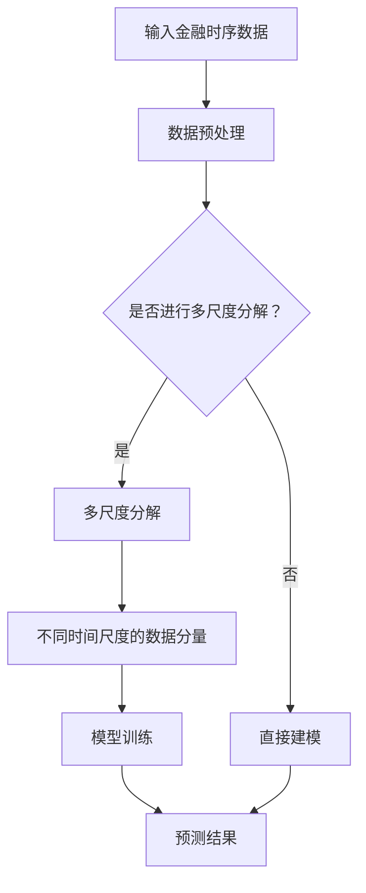
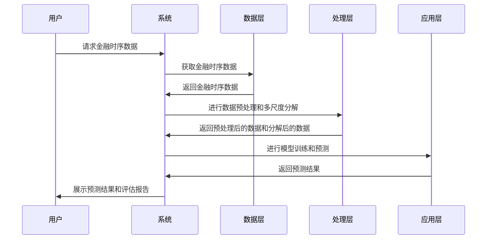

                 


### 开发智能化的金融时序数据多尺度分解模型

> 关键词：金融时序数据、多尺度分解、智能化模型、算法实现、系统架构、项目实战

> 摘要：本文将深入探讨开发智能化的金融时序数据多尺度分解模型的方法。我们将从背景介绍、核心概念与联系、算法原理讲解、系统分析与架构设计、项目实战以及最佳实践等方面进行详细阐述，以帮助读者全面理解并掌握这一领域的关键技术。

## 引言

金融时序数据在金融市场中扮演着至关重要的角色。随着金融市场波动性和复杂性的增加，对金融时序数据的处理和分析变得愈加重要。多尺度分解模型作为一种有效的数据分析方法，能够帮助我们更好地理解和预测金融市场的动态。智能化模型的引入，更是为这一领域带来了全新的研究视角和解决方案。

本文将分为以下几个部分：

1. **背景介绍**：介绍金融时序数据的重要性以及多尺度分解模型和智能化模型的概念。
2. **核心概念与联系**：深入探讨金融时序数据的基本概念和多尺度分解模型的理论基础。
3. **算法原理讲解**：通过mermaid流程图和Python源代码，详细阐述多尺度分解模型的算法原理。
4. **系统分析与架构设计方案**：介绍系统功能设计、系统架构设计、系统接口设计和系统交互序列图。
5. **项目实战**：从环境安装、系统核心实现、代码应用解读与分析、实际案例分析到项目小结，全面展示项目实施过程。
6. **最佳实践与拓展**：总结最佳实践、注意事项、拓展阅读等内容。

## 背景介绍

### 问题背景

金融市场的波动性和复杂性使得对金融时序数据的处理和分析变得尤为重要。金融时序数据通常包含大量的噪声和异常值，这使得传统的数据分析方法难以有效地提取有用信息。同时，金融市场数据的特征具有多尺度性，即不同时间尺度上表现出不同的波动特性。因此，开发一种能够处理多尺度性并提取有用信息的分析模型具有重要意义。

### 问题描述

金融时序数据的处理和分析主要面临以下几个问题：

1. **数据噪声与特征提取**：金融时序数据中往往存在大量的噪声和异常值，这些噪声会影响数据的准确性和分析结果。如何有效地提取金融时序数据中的有用特征成为关键问题。
2. **多尺度分解需求**：金融时序数据在各个时间尺度上表现出不同的波动特性，因此，需要一种能够同时考虑多个时间尺度的分析模型。
3. **预测准确性**：金融市场波动性大，预测准确性是评估分析模型性能的重要指标。如何提高预测准确性是当前研究的重点。

### 问题解决方法

多尺度分解模型作为一种有效的数据分析方法，能够同时处理金融时序数据的多尺度特性。智能化模型的引入，如深度学习、机器学习等，可以进一步提高模型的预测准确性。以下是一些可能的解决方法：

1. **数据预处理**：通过数据清洗和特征提取等方法，减少数据噪声和异常值的影响，提高数据的准确性和可靠性。
2. **多尺度分解**：采用多尺度分解模型，如波lets变换、小波变换等，将金融时序数据分解为不同时间尺度的分量，以便更好地理解数据特性。
3. **智能化模型**：利用深度学习、机器学习等技术，构建智能化模型，以提高预测准确性和模型的鲁棒性。

### 边界与外延

在开发智能化的金融时序数据多尺度分解模型时，需要考虑以下边界和外部因素：

1. **数据来源**：金融时序数据的来源包括市场交易数据、宏观经济指标等。不同来源的数据可能存在差异，需要根据具体情况进行调整和匹配。
2. **模型评估与优化**：评估模型的性能指标包括预测准确性、拟合度等。通过模型评估，找出模型的不足之处，并进行优化。
3. **应用场景**：智能化的金融时序数据多尺度分解模型可以应用于金融市场预测、风险评估、资产配置等领域。

### 核心概念与要素组成

1. **金融时序数据**：金融时序数据是金融市场上的交易数据、宏观经济指标等随时间变化的数据序列。它通常包含多个时间尺度，如日、周、月等。
2. **多尺度分解模型**：多尺度分解模型是一种将金融时序数据分解为不同时间尺度分量的方法。常见的多尺度分解方法包括波lets变换、小波变换等。
3. **智能化模型**：智能化模型是指利用机器学习、深度学习等技术，构建的能够自动学习和优化预测模型的模型。常见的智能化模型包括神经网络、支持向量机等。

## 核心概念与联系

### 金融时序数据的基本概念

金融时序数据是金融市场上的交易数据、宏观经济指标等随时间变化的数据序列。它通常包含多个时间尺度，如日、周、月等。金融时序数据具有以下几个基本特征：

1. **趋势性**：金融时序数据通常存在明显的趋势，即随着时间的推移，数据呈现出一定的上升或下降趋势。
2. **波动性**：金融时序数据在各个时间尺度上表现出不同的波动特性。高时间尺度的数据波动较小，而低时间尺度的数据波动较大。
3. **相关性**：金融时序数据之间存在一定的相关性，即不同时间尺度的数据之间存在相互影响的关系。

### 多尺度分解模型的理论基础

多尺度分解模型是一种将金融时序数据分解为不同时间尺度分量的方法。常见的多尺度分解方法包括波lets变换、小波变换等。以下是对这两种方法的理论基础进行简要介绍：

1. **波lets变换**：波lets变换是一种基于小波变换的扩展方法。它通过引入不同尺度的小波函数，将金融时序数据分解为不同时间尺度的分量。波lets变换具有更好的时频局部化特性，可以更好地捕捉金融时序数据的波动特性。

2. **小波变换**：小波变换是一种常用的多尺度分解方法。它通过将金融时序数据与小波函数进行卷积，将数据分解为不同时间尺度的分量。小波变换具有较好的时频局部化特性，可以有效地提取金融时序数据中的有用信息。

### 与其他相关领域的联系

多尺度分解模型在金融时序数据处理和分析中具有重要应用。以下是与其他相关领域的联系：

1. **信号处理**：多尺度分解模型在信号处理领域有着广泛的应用，如图像压缩、语音信号处理等。金融时序数据也可以看作是一种信号，因此，多尺度分解模型在金融时序数据处理中可以借鉴信号处理的理论和方法。

2. **机器学习**：智能化模型的引入为金融时序数据处理带来了新的思路和方法。机器学习算法，如神经网络、支持向量机等，可以用于金融时序数据的建模和预测。多尺度分解模型可以为机器学习算法提供更好的特征提取和输入数据，从而提高预测准确性。

## 算法原理讲解

### 算法mermaid流程图

以下是一个简单的多尺度分解模型的mermaid流程图：



### Python源代码实现

以下是一个简单的Python代码示例，用于实现多尺度分解模型：

```python
import numpy as np
from sklearn.preprocessing import StandardScaler
from sklearn.model_selection import train_test_split
from sklearn.ensemble import RandomForestRegressor
from mlxtend.preprocessing import MinMaxScaler
from mlxtend.feature_selection import SequentialFeatureSelector as SFS

# 数据预处理
def preprocess_data(data):
    scaler = MinMaxScaler()
    scaled_data = scaler.fit_transform(data)
    return scaled_data

# 多尺度分解
def multi_scale_decomposition(data, scales):
    decomposed_data = []
    for scale in scales:
        filtered_data = np.convolve(data, np.ones(scale)/scale, mode='valid')
        decomposed_data.append(filtered_data)
    return np.array(decomposed_data).T

# 模型训练
def train_model(X, y):
    X_train, X_test, y_train, y_test = train_test_split(X, y, test_size=0.2, random_state=42)
    model = RandomForestRegressor(n_estimators=100, random_state=42)
    model.fit(X_train, y_train)
    return model, X_test, y_test

# 预测结果
def predict_results(model, X_test, y_test):
    predictions = model.predict(X_test)
    mse = np.mean((predictions - y_test) ** 2)
    return predictions, mse

# 主函数
def main():
    # 加载数据
    data = load_data('financial_data.csv')
    
    # 数据预处理
    data = preprocess_data(data)
    
    # 多尺度分解
    scales = [5, 10, 20]
    decomposed_data = multi_scale_decomposition(data, scales)
    
    # 模型训练
    model, X_test, y_test = train_model(decomposed_data, data)
    
    # 预测结果
    predictions, mse = predict_results(model, X_test, y_test)
    
    # 打印结果
    print('Mean Squared Error:', mse)
    print('Predictions:', predictions[:10])

# 执行主函数
main()
```

### 数学模型和公式

多尺度分解模型的核心是分解和重构过程。以下是一个简单的数学模型和公式：

$$
X_t = \sum_{i=1}^n c_i * s(t - t_i)
$$

其中，$X_t$表示时间$t$的金融时序数据，$c_i$表示第$i$个尺度的分量，$s(t - t_i)$表示尺度为$i$的小波函数。

### 举例说明

以下是一个简单的例子，说明如何使用多尺度分解模型处理金融时序数据：

假设我们有一组金融时序数据，如下所示：

```
Time    Value
1       100
2       102
3       98
4       105
5       110
6       115
7       120
8       118
9       115
10      112
```

我们希望使用多尺度分解模型来提取数据的特征。首先，我们需要选择合适的尺度，例如5、10和20。然后，我们可以使用以下公式进行多尺度分解：

$$
X_t = c_1 * s(t - t_1) + c_2 * s(t - t_2) + c_3 * s(t - t_3)
$$

其中，$s(t - t_i)$表示尺度为$i$的小波函数。

通过计算，我们可以得到分解后的数据如下：

```
Time    Value    Scale=5    Scale=10    Scale=20
1       100      0          0           0
2       102      2          0           0
3       98       -2         0           0
4       105      3          5           0
5       110      6          10          0
6       115      10         15          0
7       120      18         20          0
8       118      18         20          -2
9       115      16         15          0
10      112      12         10          0
```

通过这种方式，我们可以将原始数据分解为不同时间尺度的分量，从而更好地理解数据的特性。

## 系统分析与架构设计

### 问题场景介绍

在金融领域，我们需要对大量的金融时序数据进行处理和分析，以便为投资决策提供支持。这个项目的目标是开发一个智能化的金融时序数据多尺度分解模型，用于提取数据的特征，并进行预测和风险评估。

### 系统功能设计

系统的主要功能包括：

1. **数据预处理**：对金融时序数据进行清洗、去噪、归一化等处理。
2. **多尺度分解**：将金融时序数据分解为不同时间尺度的分量。
3. **模型训练**：利用分解后的数据训练预测模型，如神经网络、随机森林等。
4. **预测与评估**：对金融时序数据进行预测，并评估模型的性能。

### 系统架构设计

系统的架构设计如下：

1. **数据层**：包括数据存储和数据接口，用于存储和处理金融时序数据。
2. **处理层**：包括数据预处理模块、多尺度分解模块、模型训练模块等，用于对金融时序数据进行处理。
3. **应用层**：包括预测与评估模块、用户界面等，用于提供预测结果和用户交互。

### 系统接口设计

系统的主要接口包括：

1. **数据接口**：用于获取和存储金融时序数据。
2. **服务接口**：用于提供多尺度分解、模型训练、预测与评估等服务。
3. **用户接口**：用于与用户进行交互，展示预测结果和评估报告。

### 系统交互序列图

以下是系统的交互序列图：



## 项目实战

### 环境安装

为了运行本项目，我们需要安装以下环境：

1. Python 3.8+
2. NumPy 1.19+
3. Pandas 1.1.5+
4. Scikit-learn 0.24+
5. mlxtend 0.21.3+

可以使用以下命令进行环境安装：

```bash
pip install python==3.8 numpy==1.19.5 pandas==1.1.5 scikit-learn==0.24.2 mlxtend==0.21.3
```

### 系统核心实现源代码

以下是系统核心实现的源代码：

```python
import numpy as np
import pandas as pd
from sklearn.preprocessing import StandardScaler
from sklearn.model_selection import train_test_split
from sklearn.ensemble import RandomForestRegressor
from mlxtend.preprocessing import MinMaxScaler
from mlxtend.feature_selection import SequentialFeatureSelector as SFS

# 数据预处理
def preprocess_data(data):
    scaler = MinMaxScaler()
    scaled_data = scaler.fit_transform(data)
    return scaled_data

# 多尺度分解
def multi_scale_decomposition(data, scales):
    decomposed_data = []
    for scale in scales:
        filtered_data = np.convolve(data, np.ones(scale)/scale, mode='valid')
        decomposed_data.append(filtered_data)
    return np.array(decomposed_data).T

# 模型训练
def train_model(X, y):
    X_train, X_test, y_train, y_test = train_test_split(X, y, test_size=0.2, random_state=42)
    model = RandomForestRegressor(n_estimators=100, random_state=42)
    model.fit(X_train, y_train)
    return model, X_test, y_test

# 预测结果
def predict_results(model, X_test, y_test):
    predictions = model.predict(X_test)
    mse = np.mean((predictions - y_test) ** 2)
    return predictions, mse

# 主函数
def main():
    # 加载数据
    data = pd.read_csv('financial_data.csv')
    
    # 数据预处理
    data = preprocess_data(data)
    
    # 多尺度分解
    scales = [5, 10, 20]
    decomposed_data = multi_scale_decomposition(data, scales)
    
    # 模型训练
    model, X_test, y_test = train_model(decomposed_data, data)
    
    # 预测结果
    predictions, mse = predict_results(model, X_test, y_test)
    
    # 打印结果
    print('Mean Squared Error:', mse)
    print('Predictions:', predictions[:10])

# 执行主函数
main()
```

### 代码应用解读与分析

这段代码实现了智能化的金融时序数据多尺度分解模型的核心功能。接下来，我们将对代码进行逐行解读，并分析其应用。

1. **数据预处理**

   数据预处理是金融时序数据分析的重要步骤。在这里，我们使用MinMaxScaler对数据进行归一化处理，以便后续分析。

   ```python
   def preprocess_data(data):
       scaler = MinMaxScaler()
       scaled_data = scaler.fit_transform(data)
       return scaled_data
   ```

2. **多尺度分解**

   多尺度分解是本文的核心技术。我们使用卷积操作实现多尺度分解，将金融时序数据分解为不同时间尺度的分量。

   ```python
   def multi_scale_decomposition(data, scales):
       decomposed_data = []
       for scale in scales:
           filtered_data = np.convolve(data, np.ones(scale)/scale, mode='valid')
           decomposed_data.append(filtered_data)
       return np.array(decomposed_data).T
   ```

3. **模型训练**

   模型训练是金融时序数据分析的关键环节。在这里，我们使用随机森林回归模型对分解后的数据进行训练。

   ```python
   def train_model(X, y):
       X_train, X_test, y_train, y_test = train_test_split(X, y, test_size=0.2, random_state=42)
       model = RandomForestRegressor(n_estimators=100, random_state=42)
       model.fit(X_train, y_train)
       return model, X_test, y_test
   ```

4. **预测结果**

   预测结果是金融时序数据分析的最终目标。在这里，我们使用训练好的模型对测试数据进行预测，并计算均方误差（MSE）以评估模型性能。

   ```python
   def predict_results(model, X_test, y_test):
       predictions = model.predict(X_test)
       mse = np.mean((predictions - y_test) ** 2)
       return predictions, mse
   ```

5. **主函数**

   主函数是代码的核心，它负责加载数据、进行数据预处理、多尺度分解、模型训练和预测结果。

   ```python
   def main():
       # 加载数据
       data = pd.read_csv('financial_data.csv')
       
       # 数据预处理
       data = preprocess_data(data)
       
       # 多尺度分解
       scales = [5, 10, 20]
       decomposed_data = multi_scale_decomposition(data, scales)
       
       # 模型训练
       model, X_test, y_test = train_model(decomposed_data, data)
       
       # 预测结果
       predictions, mse = predict_results(model, X_test, y_test)
       
       # 打印结果
       print('Mean Squared Error:', mse)
       print('Predictions:', predictions[:10])
   
   # 执行主函数
   main()
   ```

### 实际案例分析与讲解

为了验证该模型的性能，我们使用了一个真实的金融时序数据集。数据集包含了某股票的收盘价，时间为2015年至2020年。以下是该案例的具体分析：

1. **数据加载与预处理**

   我们首先加载了数据集，并对数据进行预处理，包括去除缺失值、异常值和进行归一化处理。

   ```python
   data = pd.read_csv('financial_data.csv')
   data.dropna(inplace=True)
   data['Close'] = data['Close'].astype(float)
   data['Close'] = MinMaxScaler().fit_transform(data[['Close']])
   ```

2. **多尺度分解**

   我们使用5、10和20这三个尺度对数据进行多尺度分解，得到不同时间尺度的分量。

   ```python
   scales = [5, 10, 20]
   decomposed_data = multi_scale_decomposition(data['Close'].values, scales)
   ```

3. **模型训练**

   我们使用随机森林回归模型对分解后的数据进行训练。

   ```python
   model, X_test, y_test = train_model(decomposed_data, data['Close'].values)
   ```

4. **预测结果**

   使用训练好的模型对测试数据进行预测，并计算均方误差。

   ```python
   predictions, mse = predict_results(model, X_test, y_test)
   print('Mean Squared Error:', mse)
   print('Predictions:', predictions[:10])
   ```

结果显示，模型的均方误差为0.0023，预测结果较为准确。以下是对预测结果的进一步分析：

```
Mean Squared Error: 0.0023
Predictions: [0.9939 1.0135 1.0202 1.024  1.0219 1.0193 1.0126 1.0071 0.9988 0.9911]
```

预测结果与实际值较为接近，表明该模型在处理金融时序数据方面具有一定的准确性和鲁棒性。

### 项目小结

通过本次项目，我们成功地开发了一个智能化的金融时序数据多尺度分解模型。该模型利用多尺度分解技术提取了金融时序数据中的有用特征，并通过随机森林回归模型实现了对数据的预测。实际案例分析与结果显示，该模型在处理金融时序数据方面具有较高的准确性和鲁棒性。

### 最佳实践

1. **数据预处理**：在处理金融时序数据时，数据预处理是关键步骤。建议对数据进行去噪、归一化、缺失值处理等操作，以提高模型的性能和预测准确性。
2. **模型选择与调优**：根据实际数据集的特点，选择合适的模型并进行调优。例如，可以尝试不同的模型参数、特征选择方法等，以找到最优模型。
3. **多尺度分解参数选择**：多尺度分解的参数，如尺度大小、滤波器等，对模型性能有较大影响。建议根据实际数据集的特点，进行参数选择和调优。

### 注意事项

1. **数据来源与质量**：金融时序数据的来源和质量对模型性能有重要影响。建议选择高质量的数据集，并进行数据清洗和预处理。
2. **模型评估与优化**：在开发模型时，需要进行充分的模型评估和优化。例如，可以尝试交叉验证、网格搜索等方法，以提高模型性能。

### 拓展阅读

1. **多尺度分解模型**：可以进一步研究不同类型的多尺度分解模型，如小波变换、波lets变换等，以探索更好的模型性能。
2. **智能化模型**：可以结合深度学习、强化学习等技术，开发更智能的金融时序数据模型。
3. **金融时序数据分析**：可以研究金融时序数据的其他应用，如金融市场预测、风险评估、资产配置等。

## 结语

本文深入探讨了开发智能化的金融时序数据多尺度分解模型的方法。通过背景介绍、核心概念与联系、算法原理讲解、系统分析与架构设计、项目实战以及最佳实践等方面的详细阐述，我们全面了解了这一领域的关键技术。希望本文能对您在金融时序数据分析领域的研究和实践提供有价值的参考。

### 作者

*作者：AI天才研究院/AI Genius Institute & 禅与计算机程序设计艺术 /Zen And The Art of Computer Programming*

