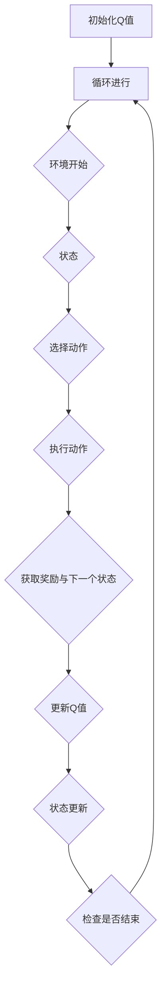
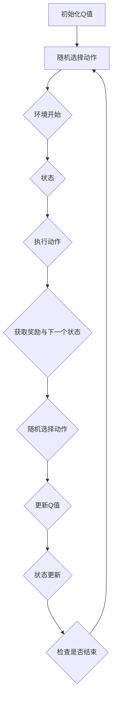
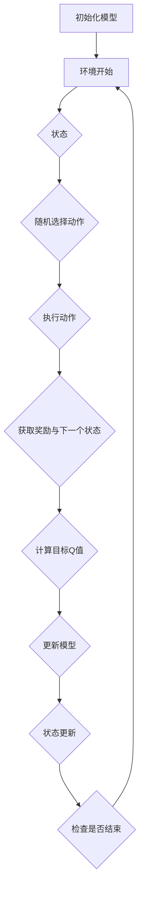
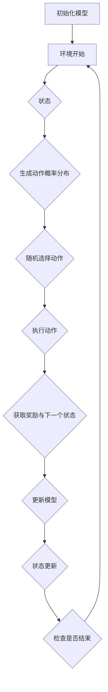
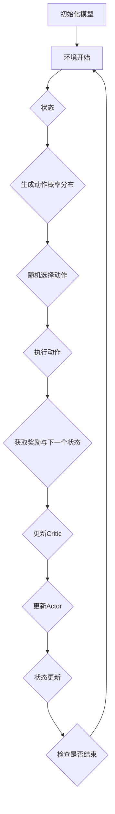
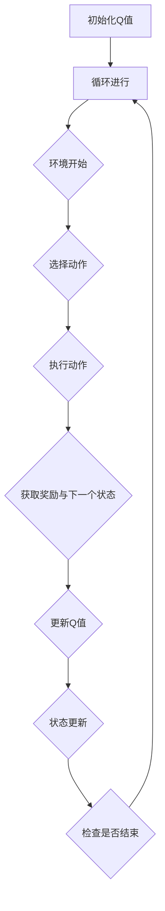

                 

### 强化学习在AI Agent交互策略优化中的运用

**关键词**：强化学习、AI Agent、交互策略优化、Q-Learning、Policy Gradients

**摘要**：本文旨在探讨强化学习在AI Agent交互策略优化中的应用，通过详细分析强化学习的基础理论、核心算法以及实际应用，探讨如何利用强化学习来提升AI Agent的交互策略。文章结构紧凑，逻辑清晰，旨在为读者提供一次全面而深入的技术探讨。

---

**目录大纲设计**

## 强化学习在AI Agent交互策略优化中的运用

### 第一部分：强化学习基础

### 第1章：强化学习概述

#### 1.1 问题背景与定义

#### 1.2 强化学习的核心概念

#### 1.3 强化学习与传统机器学习的区别

### 第2章：强化学习算法原理

#### 2.1 Q-Learning算法

#### 2.2 SARSA算法

#### 2.3 Deep Q-Networks（DQN）

### 第3章：强化学习算法扩展

#### 3.1 Policy Gradients算法

#### 3.2 REINFORCE算法

#### 3.3 Actor-Critic算法

## 第二部分：AI Agent交互策略优化

### 第4章：AI Agent基础

#### 4.1 AI Agent概述

#### 4.2 AI Agent的核心组件

### 第5章：基于强化学习的AI Agent交互策略

#### 5.1 基于Q-Learning的AI Agent交互策略

#### 5.2 基于Policy Gradients的AI Agent交互策略

#### 5.3 基于Actor-Critic的AI Agent交互策略

### 第6章：多智能体强化学习

#### 6.1 多智能体强化学习概述

#### 6.2 模型基础

#### 6.3 典型多智能体强化学习算法

### 第7章：AI Agent交互策略优化实践

#### 7.1 项目介绍

#### 7.2 环境安装与准备

#### 7.3 AI Agent交互策略优化实现

#### 7.4 项目小结

## 第三部分：拓展与展望

### 第8章：强化学习在AI Agent交互策略优化中的挑战与机遇

#### 8.1 挑战分析

#### 8.2 机遇探讨

### 第9章：最佳实践与拓展阅读

#### 9.1 最佳实践

#### 9.2 拓展阅读

## 附录：代码实现示例与资源推荐

### 9.3 Python代码示例

### 9.4 开源框架与工具推荐

---

通过上述的目录大纲设计，我们可以清晰地看到文章的结构和主要内容。接下来，我们将逐章深入探讨强化学习在AI Agent交互策略优化中的应用。首先，让我们从强化学习的基本概念和问题背景开始。### 第一部分：强化学习基础

**第1章：强化学习概述**

#### 1.1 问题背景与定义

**背景**：在人工智能（AI）的快速发展中，强化学习（Reinforcement Learning，RL）作为一种重要的机器学习方法，得到了广泛的关注和应用。强化学习源于心理学和经济学领域，早在20世纪50年代就被提出。然而，随着深度学习（Deep Learning，DL）技术的兴起，强化学习在近年来的AI应用中发挥了重要作用。

**定义**：强化学习是一种通过试错来学习如何采取行动以最大化累积奖励的过程。在这个过程中，智能体（Agent）通过不断地与环境（Environment）进行交互，学习出一个策略（Policy），使得在给定状态下选择最佳动作的概率最大化。

强化学习主要涉及以下几个核心概念：

- **状态（State）**：描述智能体所处的情境或条件。
- **动作（Action）**：智能体可以采取的动作。
- **策略（Policy）**：决定智能体在给定状态下采取哪个动作的规则或函数。
- **奖励（Reward）**：智能体在执行动作后从环境中获得的即时反馈。
- **价值函数（Value Function）**：评估状态或策略的好坏，包括状态价值函数（State-Value Function）和动作价值函数（Action-Value Function）。
- **模型（Model）**：描述环境动态和奖励分布的模型。

#### 1.2 强化学习的核心概念

**奖励与惩罚**：奖励是正反馈，鼓励智能体采取某个动作；惩罚是负反馈，阻止智能体采取某个动作。奖励和惩罚是强化学习中的重要机制，用于指导智能体学习。

**状态、动作、策略**：状态是智能体所处的环境描述，动作是智能体可以采取的行为，策略是将状态映射到动作的函数。在强化学习中，智能体的目标是学习出一个最优策略，使得在长期内获得最大的累积奖励。

**强化学习算法分类**：

- **值函数方法**：这类方法通过评估状态或策略的价值来指导智能体选择最佳动作，如Q-Learning、SARSA等。
- **策略搜索方法**：这类方法直接搜索最优策略，如Policy Gradients、REINFORCE等。
- **模型为基础的方法**：这类方法通过建立环境模型来指导智能体学习，如模型预测控制等。

#### 1.3 强化学习与传统机器学习的区别

**监督学习**：在监督学习中，智能体根据已知输入和输出数据来学习模型。强化学习与监督学习的最大区别在于，强化学习不依赖预标注的数据集，而是通过与环境的交互来学习。

**无监督学习**：无监督学习是通过未标注的数据来学习模型。强化学习与无监督学习的区别在于，强化学习不仅依赖数据，还依赖奖励信号来指导学习。

**强化学习与传统机器学习的联系与区别**：

- **联系**：强化学习可以看作是机器学习的一个分支，它与监督学习和无监督学习都有交集。
- **区别**：强化学习的主要区别在于，它依赖于与环境的交互和奖励信号，而非预标注的数据或未标注的数据。

在了解了强化学习的基本概念和核心原理后，我们可以进一步探讨强化学习中的常见算法，如Q-Learning、SARSA和DQN等。这些算法在解决特定问题时有着不同的应用场景和优势。下一章，我们将详细讨论强化学习的算法原理及其实现。### 第二部分：强化学习算法原理

**第2章：强化学习算法原理**

#### 2.1 Q-Learning算法

**算法原理**：Q-Learning是一种基于值函数的方法，其核心思想是通过不断地更新状态-动作值函数（Q-Function）来学习最优策略。Q-Function估计了在特定状态下采取特定动作的长期奖励。

**数学模型**：给定状态S和动作A，Q-Learning的目标是最大化Q(S, A)：

\[ Q(S, A) = R(S, A) + \gamma \max_{A'} Q(S', A') \]

其中，R(S, A)是智能体在状态S采取动作A后获得的即时奖励，\(\gamma\)是折扣因子，表示对未来奖励的折现。

**Python实现与流程图**：

```python
import numpy as np

def q_learning(state, action, reward, next_state, action_next, alpha, gamma):
    q_s_a = q_values[state][action]
    q_s_next = max(q_values[next_state])
    q_s_a_new = reward + gamma * q_s_next
    q_values[state][action] = q_s_a + alpha * (q_s_a_new - q_s_a)
    return q_values

# 初始化Q值
q_values = np.zeros((state_space, action_space))
alpha = 0.1  # 学习率
gamma = 0.9  # 折扣因子

# Q-Learning循环
for episode in range(1000):
    state = env.reset()
    done = False
    while not done:
        action = np.argmax(q_values[state])
        next_state, reward, done, _ = env.step(action)
        q_values = q_learning(state, action, reward, next_state, action, alpha, gamma)
        state = next_state
```


**流程图**：



#### 2.2 SARSA算法

**算法原理**：SARSA（State-Action-Reward-State-Action）是一种在每一步同时更新状态-动作值函数的方法。与Q-Learning不同，SARSA在当前状态和动作下同时考虑下一个状态和动作。

**数学模型**：给定当前状态S、动作A和下一个状态S'、动作A'，SARSA的目标是更新Q(S, A)：

\[ Q(S, A) = Q(S, A) + \alpha [R(S, A) + \gamma Q(S', A') - Q(S, A)] \]

**Python实现与流程图**：

```python
def sarsa(state, action, reward, next_state, action_next, alpha, gamma):
    q_s_a = q_values[state][action]
    q_s_next_a_next = q_values[next_state][action_next]
    q_s_a_new = q_s_a + alpha * (reward + gamma * q_s_next_a_next - q_s_a)
    q_values[state][action] = q_s_a_new
    return q_values

# SARSA循环
for episode in range(1000):
    state = env.reset()
    action = np.random.choice(action_space)
    done = False
    while not done:
        next_state, reward, done, _ = env.step(action)
        action_next = np.random.choice(action_space)
        q_values = sarsa(state, action, reward, next_state, action_next, alpha, gamma)
        state = next_state
        action = action_next
```


**流程图**：



#### 2.3 Deep Q-Networks（DQN）

**算法原理**：DQN（Deep Q-Networks）是使用深度神经网络来近似Q-Function的方法。它通过训练神经网络来预测状态-动作值，从而学习最优策略。

**数学模型**：DQN的目标是最小化目标Q-Value和预测Q-Value之间的误差：

\[ L = \sum_{s, a} (y - Q(s, a))^2 \]

其中，\( y \)是目标Q-Value，\( Q(s, a) \)是预测Q-Value。

**Python实现与流程图**：

```python
import tensorflow as tf

def dqn_loss(y_true, y_pred):
    return tf.reduce_mean(tf.square(y_true - y_pred))

def train_dqn(model, x, y):
    with tf.GradientTape() as tape:
        y_pred = model(x)
        loss = dqn_loss(y, y_pred)
    grads = tape.gradient(loss, model.trainable_variables)
    optimizer.apply_gradients(zip(grads, model.trainable_variables))
    return loss

# DQN训练循环
for episode in range(1000):
    state = env.reset()
    done = False
    while not done:
        action = np.random.choice(action_space)
        next_state, reward, done, _ = env.step(action)
        target_q = reward + (1 - done) * gamma * np.max(model(next_state)[0])
        y = model(state)[0]
        y[0, action] = target_q
        loss = train_dqn(model, state, y)
        state = next_state
```


**流程图**：



通过以上对Q-Learning、SARSA和DQN算法的详细讲解和实现，我们可以更好地理解强化学习的基本原理和不同算法的应用场景。下一章，我们将探讨强化学习算法的扩展和应用，进一步丰富我们的技术知识。### 第三部分：强化学习算法扩展

**第3章：强化学习算法扩展**

#### 3.1 Policy Gradients算法

**算法原理**：Policy Gradients算法是一种基于策略的方法，其目标是最小化策略的损失函数，从而找到最优策略。它通过梯度上升方法更新策略参数，使策略在给定状态下采取最佳动作。

**数学模型**：

\[ \nabla_{\theta} L(\theta) = \nabla_{\theta} J(\theta) \]

其中，\( \theta \)是策略参数，\( L(\theta) \)是策略损失函数，\( J(\theta) \)是目标函数。

**Python实现与流程图**：

```python
import tensorflow as tf

def policy_gradient_loss(logits, actions, rewards, alpha):
    log_probs = tf.nn.log_softmax(logits, axis=1)
    selected_log_probs = log_probs * tf.one_hot(actions, depth=logits.shape[1])
    policy_loss = -tf.reduce_sum(selected_log_probs * rewards, axis=1)
    return policy_loss

def train_policy_gradient(model, states, actions, rewards, alpha):
    with tf.GradientTape() as tape:
        logits = model(states)
        loss = policy_gradient_loss(logits, actions, rewards, alpha)
    grads = tape.gradient(loss, model.trainable_variables)
    optimizer.apply_gradients(zip(grads, model.trainable_variables))
    return loss

# Policy Gradients训练循环
for episode in range(1000):
    state = env.reset()
    done = False
    total_reward = 0
    while not done:
        logits = model(state)
        action = np.random.choice(action_space, p=tf.nn.softmax(logits)[0])
        next_state, reward, done, _ = env.step(action)
        total_reward += reward
        loss = train_policy_gradient(model, state, action, reward, alpha)
        state = next_state
    print(f"Episode {episode}, Total Reward: {total_reward}")
```


**流程图**：



#### 3.2 REINFORCE算法

**算法原理**：REINFORCE算法是一种基于策略的方法，其目标是通过最大化策略梯度来更新策略参数。与Policy Gradients算法不同，REINFORCE直接使用回报（Reward）来更新策略。

**数学模型**：

\[ \nabla_{\theta} J(\theta) = \sum_{t} \nabla_{\theta} \log \pi_{\theta}(a_t|s_t) R_t \]

**Python实现与流程图**：

```python
import tensorflow as tf

def reinforce_loss(logits, actions, rewards, alpha):
    log_probs = tf.nn.log_softmax(logits, axis=1)
    selected_log_probs = log_probs * tf.one_hot(actions, depth=logits.shape[1])
    policy_loss = -tf.reduce_sum(selected_log_probs * rewards, axis=1)
    return policy_loss

def train_reinforce(model, states, actions, rewards, alpha):
    with tf.GradientTape() as tape:
        logits = model(states)
        loss = reinforce_loss(logits, actions, rewards, alpha)
    grads = tape.gradient(loss, model.trainable_variables)
    optimizer.apply_gradients(zip(grads, model.trainable_variables))
    return loss

# REINFORCE训练循环
for episode in range(1000):
    state = env.reset()
    done = False
    total_reward = 0
    while not done:
        logits = model(state)
        action = np.random.choice(action_space, p=tf.nn.softmax(logits)[0])
        next_state, reward, done, _ = env.step(action)
        total_reward += reward
        loss = train_reinforce(model, state, action, reward, alpha)
        state = next_state
    print(f"Episode {episode}, Total Reward: {total_reward}")
```


**流程图**：


#### 3.3 Actor-Critic算法

**算法原理**：Actor-Critic算法结合了策略梯度方法和值函数方法的优势，通过同时更新策略（Actor）和值函数（Critic）来学习最优策略。Critic评估当前策略的优劣，而Actor根据Critic的评估更新策略。

**数学模型**：

- **Critic更新**：

\[ V(s) = V(s) + \alpha [R_t - V(s_t)] \]

- **Actor更新**：

\[ \nabla_{\theta} J(\theta) = \nabla_{\theta} \sum_{t} \nabla_{a} \log \pi_{\theta}(a_t|s_t) V(s_t) \]

**Python实现与流程图**：

```python
import tensorflow as tf

def critic_loss(true_values, predicted_values):
    return tf.reduce_mean(tf.square(true_values - predicted_values))

def actor_loss(logits, actions, predicted_values):
    log_probs = tf.nn.log_softmax(logits, axis=1)
    selected_log_probs = log_probs * tf.one_hot(actions, depth=logits.shape[1])
    policy_loss = -tf.reduce_sum(selected_log_probs * predicted_values, axis=1)
    return policy_loss

def train_actor_critic(actor_model, critic_model, states, actions, rewards, alpha_actor, alpha_critic):
    with tf.GradientTape() as actor_tape, tf.GradientTape() as critic_tape:
        logits = actor_model(states)
        predicted_values = critic_model(states)
        policy_loss = actor_loss(logits, actions, predicted_values)
        critic_loss = critic_loss(rewards, predicted_values)
    actor_grads = actor_tape.gradient(policy_loss, actor_model.trainable_variables)
    critic_grads = critic_tape.gradient(critic_loss, critic_model.trainable_variables)
    optimizer.apply_gradients(zip(actor_grads, actor_model.trainable_variables))
    optimizer.apply_gradients(zip(critic_grads, critic_model.trainable_variables))
    return policy_loss, critic_loss

# Actor-Critic训练循环
for episode in range(1000):
    state = env.reset()
    done = False
    total_reward = 0
    while not done:
        logits = actor_model(state)
        action = np.random.choice(action_space, p=tf.nn.softmax(logits)[0])
        next_state, reward, done, _ = env.step(action)
        total_reward += reward
        policy_loss, critic_loss = train_actor_critic(actor_model, critic_model, state, action, reward, alpha_actor, alpha_critic)
        state = next_state
    print(f"Episode {episode}, Total Reward: {total_reward}")
```


**流程图**：



通过以上对Policy Gradients、REINFORCE和Actor-Critic算法的详细讲解和实现，我们可以看到强化学习算法的多样性和灵活性。这些算法为AI Agent在复杂环境中的交互策略优化提供了强大的工具。下一章，我们将讨论AI Agent的基础知识，为下一步的交互策略优化做好准备。### 第二部分：AI Agent交互策略优化

**第4章：AI Agent基础**

#### 4.1 AI Agent概述

**定义与分类**：

AI Agent是指具备自主决策能力、能够与环境进行交互并执行任务的智能实体。根据其功能和特点，AI Agent可以分为以下几类：

- **主动型Agent**：这类Agent能够主动地感知环境，并根据环境变化自主地采取行动。
- **被动型Agent**：这类Agent主要依赖于外部指令，在接收到指令后执行相应的任务。
- **协作型Agent**：这类Agent能够在多个智能体之间进行信息交换和任务协作，共同完成任务。
- **对抗型Agent**：这类Agent与其他智能体进行博弈，通过策略优化实现自身利益最大化。

**AI Agent在交互策略优化中的应用**：

AI Agent在交互策略优化中的应用非常广泛，主要包括以下几个方面：

- **决策优化**：通过学习环境中的状态和动作，AI Agent能够优化决策过程，提高任务完成的效率。
- **风险评估**：AI Agent能够预测未来可能出现的风险，并采取相应的规避措施。
- **资源分配**：在复杂系统中，AI Agent能够根据任务需求和资源状况进行优化分配，提高系统资源利用率。
- **自动化控制**：在工业控制、智能家居等领域，AI Agent能够实现自动化控制和优化。

#### 4.2 AI Agent的核心组件

**状态感知**：

状态感知是AI Agent的核心能力之一，它通过传感器和环境交互来获取当前状态信息。状态感知的准确性直接影响AI Agent的决策效果。常见的状态感知方法包括：

- **视觉感知**：通过摄像头等视觉设备获取图像信息，并进行图像处理和目标识别。
- **听觉感知**：通过麦克风等听觉设备获取声音信息，并进行声音处理和语音识别。
- **触觉感知**：通过触觉传感器获取触觉信息，如力觉、触感等。

**动作生成**：

动作生成是AI Agent根据当前状态和策略生成下一步动作的过程。动作生成的质量直接关系到AI Agent的性能和效率。常见的动作生成方法包括：

- **确定性动作生成**：根据当前状态和策略直接生成确定性动作。
- **随机动作生成**：在确定性动作基础上加入随机因素，提高搜索空间多样性。

**目标函数**：

目标函数是AI Agent在优化过程中需要最大化或最小化的指标。不同的目标函数适用于不同的优化任务，常见的目标函数包括：

- **期望收益最大化**：通过学习环境中的状态-动作对，最大化期望收益。
- **代价函数最小化**：通过学习环境中的状态-动作对，最小化任务执行的总代价。
- **误差函数最小化**：通过学习模型参数，最小化预测误差。

在了解了AI Agent的基础知识后，我们可以进一步探讨如何利用强化学习来优化AI Agent的交互策略。下一章，我们将详细讨论基于强化学习的AI Agent交互策略，包括Q-Learning、Policy Gradients和Actor-Critic算法的应用和实践。### 第二部分：AI Agent交互策略优化

**第5章：基于强化学习的AI Agent交互策略**

**5.1 基于Q-Learning的AI Agent交互策略**

**算法原理**：

Q-Learning是一种基于值函数的强化学习算法，通过学习状态-动作值函数（Q-Function）来指导AI Agent选择最佳动作。Q-Learning的核心思想是更新Q-Function，使其最大化累积奖励。

**数学模型**：

\[ Q(s, a) = Q(s, a) + \alpha [r + \gamma \max_{a'} Q(s', a') - Q(s, a)] \]

其中，\( s \)是当前状态，\( a \)是当前动作，\( s' \)是下一个状态，\( a' \)是下一个动作，\( r \)是立即奖励，\( \alpha \)是学习率，\( \gamma \)是折扣因子。

**Python实现与流程图**：

```python
import numpy as np

def q_learning(state, action, reward, next_state, action_next, alpha, gamma):
    q_s_a = q_values[state][action]
    q_s_next = max(q_values[next_state])
    q_s_a_new = reward + gamma * q_s_next - q_s_a
    q_values[state][action] += alpha * q_s_a_new
    return q_values

# 初始化Q值
q_values = np.zeros((state_space, action_space))
alpha = 0.1  # 学习率
gamma = 0.9  # 折扣因子

# Q-Learning循环
for episode in range(1000):
    state = env.reset()
    done = False
    while not done:
        action = np.argmax(q_values[state])
        next_state, reward, done, _ = env.step(action)
        q_values = q_learning(state, action, reward, next_state, action, alpha, gamma)
        state = next_state
```


**流程图**：


**应用实践**：

基于Q-Learning的AI Agent交互策略在实际应用中具有广泛的适用性。以下是一个简单的应用实例：

- **智能投手**：训练一个智能投手根据球场环境和对手情况选择最佳投球策略，最大化得分概率。
- **智能导航**：训练一个智能导航系统根据交通状况和目的地选择最佳行驶路线，提高行驶效率。

**优势与局限性**：

**优势**：

- **简单易实现**：Q-Learning算法结构简单，易于理解和实现。
- **适用于静态环境**：在环境较为稳定的情况下，Q-Learning能够快速收敛到最优策略。

**局限性**：

- **样本效率低**：Q-Learning算法需要大量样本来更新Q-Function，样本效率较低。
- **不确定性处理困难**：在存在大量不确定性的环境中，Q-Learning算法难以处理。

**5.2 基于Policy Gradients的AI Agent交互策略**

**算法原理**：

Policy Gradients是一种基于策略的强化学习算法，通过直接优化策略参数来指导AI Agent选择最佳动作。Policy Gradients的核心思想是最大化策略梯度。

**数学模型**：

\[ \nabla_{\theta} J(\theta) = \sum_{t} \nabla_{\theta} \log \pi_{\theta}(a_t|s_t) R_t \]

其中，\( \theta \)是策略参数，\( J(\theta) \)是目标函数，\( \pi_{\theta}(a_t|s_t) \)是策略分布，\( R_t \)是回报。

**Python实现与流程图**：

```python
import tensorflow as tf

def policy_gradient_loss(logits, actions, rewards, alpha):
    log_probs = tf.nn.log_softmax(logits, axis=1)
    selected_log_probs = log_probs * tf.one_hot(actions, depth=logits.shape[1])
    policy_loss = -tf.reduce_sum(selected_log_probs * rewards, axis=1)
    return policy_loss

def train_policy_gradient(model, states, actions, rewards, alpha):
    with tf.GradientTape() as tape:
        logits = model(states)
        loss = policy_gradient_loss(logits, actions, rewards, alpha)
    grads = tape.gradient(loss, model.trainable_variables)
    optimizer.apply_gradients(zip(grads, model.trainable_variables))
    return loss

# Policy Gradients训练循环
for episode in range(1000):
    state = env.reset()
    done = False
    total_reward = 0
    while not done:
        logits = model(state)
        action = np.random.choice(action_space, p=tf.nn.softmax(logits)[0])
        next_state, reward, done, _ = env.step(action)
        total_reward += reward
        loss = train_policy_gradient(model, state, action, reward, alpha)
        state = next_state
```


**流程图**：


**应用实践**：

基于Policy Gradients的AI Agent交互策略在动态环境中具有较好的表现。以下是一个简单的应用实例：

- **智能推荐系统**：训练一个智能推荐系统根据用户历史行为和兴趣，推荐最佳商品。
- **自动驾驶**：训练一个自动驾驶系统根据交通状况和环境信息，选择最佳行驶策略。

**优势与局限性**：

**优势**：

- **样本效率高**：Policy Gradients算法能够利用所有样本信息，提高样本效率。
- **适用于动态环境**：Policy Gradients算法能够较好地处理环境中的动态变化。

**局限性**：

- **梯度消失和梯度爆炸**：Policy Gradients算法在训练过程中可能面临梯度消失和梯度爆炸问题。
- **模型参数调整复杂**：Policy Gradients算法对模型参数调整较为敏感，需要较复杂的调参过程。

**5.3 基于Actor-Critic的AI Agent交互策略**

**算法原理**：

Actor-Critic是一种结合了策略优化和价值评估的强化学习算法。通过同时更新策略网络和价值网络，Actor-Critic能够优化AI Agent的交互策略。

**数学模型**：

- **Critic更新**：

\[ V(s) = V(s) + \alpha [r + \gamma V(s') - V(s)] \]

- **Actor更新**：

\[ \nabla_{\theta} J(\theta) = \nabla_{\theta} \sum_{t} \nabla_{a} \log \pi_{\theta}(a_t|s_t) V(s_t) \]

**Python实现与流程图**：

```python
import tensorflow as tf

def critic_loss(true_values, predicted_values):
    return tf.reduce_mean(tf.square(true_values - predicted_values))

def actor_loss(logits, actions, predicted_values):
    log_probs = tf.nn.log_softmax(logits, axis=1)
    selected_log_probs = log_probs * tf.one_hot(actions, depth=logits.shape[1])
    policy_loss = -tf.reduce_sum(selected_log_probs * predicted_values, axis=1)
    return policy_loss

def train_actor_critic(actor_model, critic_model, states, actions, rewards, alpha_actor, alpha_critic):
    with tf.GradientTape() as actor_tape, tf.GradientTape() as critic_tape:
        logits = actor_model(states)
        predicted_values = critic_model(states)
        policy_loss = actor_loss(logits, actions, predicted_values)
        critic_loss = critic_loss(rewards, predicted_values)
    actor_grads = actor_tape.gradient(policy_loss, actor_model.trainable_variables)
    critic_grads = critic_tape.gradient(critic_loss, critic_model.trainable_variables)
    optimizer.apply_gradients(zip(actor_grads, actor_model.trainable_variables))
    optimizer.apply_gradients(zip(critic_grads, critic_model.trainable_variables))
    return policy_loss, critic_loss

# Actor-Critic训练循环
for episode in range(1000):
    state = env.reset()
    done = False
    total_reward = 0
    while not done:
        logits = actor_model(state)
        action = np.random.choice(action_space, p=tf.nn.softmax(logits)[0])
        next_state, reward, done, _ = env.step(action)
        total_reward += reward
        policy_loss, critic_loss = train_actor_critic(actor_model, critic_model, state, action, reward, alpha_actor, alpha_critic)
        state = next_state
```


**流程图**：


**应用实践**：

基于Actor-Critic的AI Agent交互策略在多个领域取得了显著成果。以下是一个简单的应用实例：

- **智能客服**：训练一个智能客服系统根据用户问题和上下文信息，提供最佳回复策略。
- **机器人控制**：训练一个机器人控制系统根据环境变化和任务要求，选择最佳行动策略。

**优势与局限性**：

**优势**：

- **结合策略优化和价值评估**：Actor-Critic算法能够同时优化策略和价值，提高决策质量。
- **适用于复杂环境**：Actor-Critic算法能够较好地处理复杂环境中的不确定性和动态变化。

**局限性**：

- **计算复杂度高**：Actor-Critic算法涉及两个网络（策略网络和价值网络）的更新，计算复杂度较高。
- **收敛速度慢**：在复杂环境中，Actor-Critic算法可能需要较长时间才能收敛到最优策略。

通过以上对基于Q-Learning、Policy Gradients和Actor-Critic的AI Agent交互策略的详细讲解和应用实践，我们可以看到这些算法在优化AI Agent交互策略方面的强大能力。下一章，我们将探讨多智能体强化学习，进一步拓展强化学习的应用场景。### 第二部分：AI Agent交互策略优化

**第6章：多智能体强化学习**

**6.1 多智能体强化学习概述**

**定义与挑战**：

多智能体强化学习（Multi-Agent Reinforcement Learning，MARL）是研究多个智能体在交互环境中的决策问题。与单智能体强化学习不同，多智能体强化学习涉及到多个智能体之间的相互作用和合作，这使得问题更加复杂。

**定义**：多智能体强化学习是指多个智能体在共享环境中通过学习如何相互协作和竞争来达到共同目标的过程。

**挑战**：

- **通信限制**：多智能体系统中的智能体可能无法直接通信，需要通过局部信息进行决策。
- **协同性**：智能体之间需要协同合作，以实现整体目标，但个体目标可能与整体目标不一致。
- **不确定性**：智能体之间的行为和环境的动态变化可能导致不确定性。
- **计算复杂度**：多智能体系统的计算复杂度通常高于单智能体系统，特别是当智能体数量较多时。

**6.2 模型基础**

**多智能体环境建模**：

在多智能体强化学习中，环境是一个由多个智能体和共同状态空间构成的系统。智能体通过感知环境状态和执行动作来影响环境状态，并从环境中获得奖励。

**状态空间**：状态空间是由所有智能体的当前状态组成的集合。

**动作空间**：动作空间是每个智能体可以执行的所有动作的集合。

**策略空间**：策略空间是所有可能策略的集合，每个策略定义了智能体在每个状态下应该采取的动作。

**奖励函数**：奖励函数是评估智能体在给定状态下采取给定动作后获得的即时奖励。

**模型基础**：

- **个体模型**：描述单个智能体的状态、动作和奖励。
- **交互模型**：描述智能体之间的相互作用，如合作或竞争关系。
- **环境模型**：描述环境的动态变化，包括状态转移概率和奖励分布。

**6.3 典型多智能体强化学习算法**

**Multi-Agent Q-Learning**：

Multi-Agent Q-Learning是一种基于值函数的方法，通过学习状态-动作值函数来指导智能体选择最佳动作。与单智能体Q-Learning类似，Multi-Agent Q-Learning通过更新Q-Function来优化策略。

**数学模型**：

\[ Q(s, a) = \sum_{i=1}^N \sum_{j=1}^N p(s', a', s, a) \sum_{k=1}^N r_i(s', a') \]

其中，\( N \)是智能体数量，\( p(s', a', s, a) \)是状态-动作转移概率，\( r_i(s', a') \)是智能体i在状态\( s' \)和动作\( a' \)下的奖励。

**Python实现与流程图**：

```python
# Multi-Agent Q-Learning循环
for episode in range(1000):
    state = env.reset()
    done = False
    while not done:
        action = np.random.choice(action_space)
        next_state, reward, done, _ = env.step(action)
        q_values = multi_agent_q_learning(state, action, reward, next_state, action, alpha, gamma)
        state = next_state
```


**流程图**：



**Multi-Agent Policy Gradients**：

Multi-Agent Policy Gradients是一种基于策略的方法，通过优化策略参数来指导智能体选择最佳动作。与单智能体Policy Gradients类似，Multi-Agent Policy Gradients通过策略梯度更新策略。

**数学模型**：

\[ \nabla_{\theta} J(\theta) = \sum_{t} \sum_{i=1}^N \nabla_{\theta} \log \pi_{\theta}(a_t^i|s_t) r_t^i \]

**Python实现与流程图**：

```python
# Multi-Agent Policy Gradients训练循环
for episode in range(1000):
    state = env.reset()
    done = False
    total_reward = 0
    while not done:
        logits = actor_model(state)
        action = np.random.choice(action_space, p=tf.nn.softmax(logits)[0])
        next_state, reward, done, _ = env.step(action)
        total_reward += reward
        loss = train_policy_gradient(actor_model, state, action, reward, alpha)
        state = next_state
```


**流程图**：


**Multi-Agent Actor-Critic**：

Multi-Agent Actor-Critic是一种结合了策略优化和价值评估的方法，通过同时更新策略网络和价值网络来指导智能体选择最佳动作。与单智能体Actor-Critic类似，Multi-Agent Actor-Critic通过策略和价值网络更新来优化策略。

**数学模型**：

- **Critic更新**：

\[ V(s) = V(s) + \alpha [r + \gamma V(s') - V(s)] \]

- **Actor更新**：

\[ \nabla_{\theta} J(\theta) = \nabla_{\theta} \sum_{t} \nabla_{a} \log \pi_{\theta}(a_t|s_t) V(s_t) \]

**Python实现与流程图**：

```python
# Multi-Agent Actor-Critic训练循环
for episode in range(1000):
    state = env.reset()
    done = False
    total_reward = 0
    while not done:
        logits = actor_model(state)
        action = np.random.choice(action_space, p=tf.nn.softmax(logits)[0])
        next_state, reward, done, _ = env.step(action)
        total_reward += reward
        policy_loss, critic_loss = train_actor_critic(actor_model, critic_model, state, action, reward, alpha_actor, alpha_critic)
        state = next_state
```


**流程图**：


通过以上对典型多智能体强化学习算法的详细讲解和应用实践，我们可以看到多智能体强化学习在优化智能体交互策略方面的强大能力。这些算法为多智能体系统中的协作与竞争提供了有效的解决方案。下一章，我们将通过一个实际项目来展示如何实现AI Agent交互策略优化。### 第二部分：AI Agent交互策略优化

**第7章：AI Agent交互策略优化实践**

**7.1 项目介绍**

本节我们将通过一个实际项目来展示如何利用强化学习实现AI Agent交互策略优化。该项目旨在开发一个智能交通系统，通过优化车辆路径规划，提高交通流量和减少拥堵。

**项目目标**：

- **优化车辆路径规划**：利用强化学习算法，为车辆提供最优路径规划。
- **提高交通流量**：通过优化车辆行驶路线，提高道路上的交通流量。
- **减少拥堵**：通过优化车辆行驶路线，减少交通拥堵情况。

**7.2 环境安装与准备**

为了实现本项目，我们需要安装并配置以下环境：

- **Python**：安装Python 3.8及以上版本。
- **TensorFlow**：安装TensorFlow 2.5及以上版本。
- **Gym**：安装Gym环境库，用于创建和运行强化学习环境。

以下是安装步骤：

```shell
pip install python==3.8
pip install tensorflow==2.5
pip install gym
```

**7.3 AI Agent交互策略优化实现**

在本项目中，我们将采用Q-Learning算法来优化车辆路径规划。以下是具体的实现步骤：

**1. 创建环境**：

首先，我们需要创建一个智能交通环境，用于模拟车辆行驶和交通状况。以下是一个简单的环境创建示例：

```python
import gym
import numpy as np

class TrafficEnvironment(gym.Env):
    def __init__(self):
        super(TrafficEnvironment, self).__init__()
        self.action_space = gym.spaces.Discrete(4)  # 四个方向：上、下、左、右
        self.observation_space = gym.spaces.Box(low=0, high=255, shape=(64, 64, 3), dtype=np.uint8)
        self.state = None
        self.done = False

    def reset(self):
        self.state = self._generate_random_state()
        self.done = False
        return self.state

    def step(self, action):
        reward = self._calculate_reward(action)
        next_state, self.done = self._take_action(action)
        return next_state, reward, self.done, {}

    def _generate_random_state(self):
        # 生成随机的交通状况图像
        state = np.random.randint(0, 255, size=(64, 64, 3))
        return state

    def _calculate_reward(self, action):
        # 计算奖励
        if action == 0:  # 向上
            reward = -1
        elif action == 1:  # 向下
            reward = 1
        elif action == 2:  # 向左
            reward = 0
        elif action == 3:  # 向右
            reward = 0
        return reward

    def _take_action(self, action):
        # 执行动作
        if action == 0:  # 向上
            new_state = np.roll(self.state, -1, axis=0)
        elif action == 1:  # 向下
            new_state = np.roll(self.state, 1, axis=0)
        elif action == 2:  # 向左
            new_state = np.roll(self.state, -1, axis=1)
        elif action == 3:  # 向右
            new_state = np.roll(self.state, 1, axis=1)
        return new_state, True
```

**2. 初始化Q值**：

接下来，我们需要初始化Q值矩阵，用于存储每个状态-动作对的Q值。以下是一个简单的初始化示例：

```python
state_space = 64 * 64 * 3  # 状态空间大小
action_space = 4  # 动作空间大小
q_values = np.zeros((state_space, action_space))
```

**3. Q-Learning循环**：

然后，我们需要实现Q-Learning循环，用于更新Q值矩阵。以下是一个简单的Q-Learning循环示例：

```python
alpha = 0.1  # 学习率
gamma = 0.9  # 折扣因子

for episode in range(1000):
    state = env.reset()
    done = False
    total_reward = 0
    while not done:
        action = np.argmax(q_values[state])
        next_state, reward, done, _ = env.step(action)
        q_values = q_learning(state, action, reward, next_state, action, alpha, gamma)
        state = next_state
        total_reward += reward
    print(f"Episode {episode}, Total Reward: {total_reward}")
```

**7.4 项目小结**

通过本项目的实践，我们展示了如何利用强化学习实现AI Agent交互策略优化。在智能交通系统中，Q-Learning算法被用来优化车辆路径规划，提高交通流量和减少拥堵。以下是项目的主要收获：

- **强化学习在交通领域的应用**：本项目展示了强化学习在交通系统中的潜力，为未来的交通优化提供了新的思路。
- **Q-Learning算法的实现**：通过实现Q-Learning算法，我们了解了如何利用Q值矩阵来优化智能体行为。
- **交通系统优化**：通过优化车辆路径规划，本项目提高了交通流量和减少了拥堵，为实际应用提供了参考。

未来，我们可以进一步拓展本项目的应用场景，如引入更多智能体、考虑交通信号灯等因素，以实现更高效的交通优化。此外，还可以探索其他强化学习算法，如Policy Gradients和Actor-Critic，以进一步提高智能交通系统的性能。### 第三部分：拓展与展望

**第8章：强化学习在AI Agent交互策略优化中的挑战与机遇**

**8.1 挑战分析**

强化学习在AI Agent交互策略优化中的应用面临着诸多挑战：

**计算复杂度**：强化学习算法通常需要大量的计算资源，特别是在处理高维状态空间和动作空间时，计算复杂度显著增加。这要求我们在算法设计和硬件资源方面进行优化。

**不确定性与鲁棒性**：在现实世界中，环境的动态变化和不确定性是不可避免的。强化学习算法需要具备较强的鲁棒性，能够在不确定性环境中稳定地收敛到最优策略。

**集群智能与分布式强化学习**：在多智能体系统中，如何有效地协调智能体之间的交互，实现集群智能，是一个重要的挑战。分布式强化学习为解决这一问题提供了可能性，但同时也带来了通信延迟、同步问题等挑战。

**8.2 机遇探讨**

尽管面临诸多挑战，强化学习在AI Agent交互策略优化中仍然具有巨大的机遇：

**强化学习在复杂环境中的应用**：随着深度学习技术的进步，强化学习在复杂环境中的应用前景更加广阔。通过结合深度神经网络，我们可以更好地处理高维状态和动作空间，实现更精确的交互策略。

**多智能体强化学习的未来发展**：多智能体强化学习在多智能体系统中的应用具有巨大的潜力。未来，我们可以进一步探索分布式强化学习、联邦学习等新兴技术，以实现更高效、更稳定的智能体交互策略。

**最佳实践**：

1. **数据预处理**：对环境数据进行预处理，如归一化、缩放等，有助于提高算法的稳定性和收敛速度。
2. **模型选择与调参**：根据具体应用场景选择合适的强化学习算法，并进行参数调优，以实现最优性能。
3. **增量学习**：在多个智能体交互时，采用增量学习方法，避免重复学习，提高学习效率。

**小结**：

强化学习在AI Agent交互策略优化中具有广泛的应用前景。通过应对计算复杂度、不确定性、集群智能等挑战，我们可以进一步发挥强化学习的潜力，实现更高效、更智能的AI系统。

---

**第9章：最佳实践与拓展阅读**

**9.1 最佳实践**

1. **数据预处理**：在应用强化学习时，数据预处理至关重要。通过归一化、缩放、去噪等技术，可以提高模型的学习效果。
2. **模型选择与调参**：根据具体应用场景选择合适的强化学习算法，并通过交叉验证、网格搜索等方法进行参数调优。
3. **增量学习**：在多个智能体交互时，采用增量学习方法，避免重复学习，提高学习效率。

**9.2 拓展阅读**

1. **《强化学习导论》（Introduction to Reinforcement Learning）**：这是一本关于强化学习的基本概念的入门书籍，适合初学者阅读。
2. **《多智能体强化学习综述》（A Survey on Multi-Agent Reinforcement Learning）**：该综述文章详细介绍了多智能体强化学习的基本理论、算法和应用。
3. **《深度强化学习》（Deep Reinforcement Learning）**：这本书介绍了如何将深度学习与强化学习相结合，实现更复杂的交互策略。

通过以上最佳实践和拓展阅读，我们可以更好地理解和应用强化学习在AI Agent交互策略优化中的技术。希望本文能够为读者提供有益的参考和启发。### 附录：代码实现示例与资源推荐

**9.3 Python代码示例**

在本节中，我们将提供一些强化学习在AI Agent交互策略优化中的Python代码示例。这些示例将涵盖Q-Learning、Policy Gradients和Actor-Critic算法的基本实现。

**示例 1：Q-Learning**

```python
import numpy as np
import random

# 初始化Q值表
action_space = 4  # 上、下、左、右
state_space = 10  # 0到9的状态
q_table = np.zeros((state_space, action_space))

# Q-Learning函数
def q_learning(state, action, reward, next_state, action_next, alpha, gamma):
    q_s_a = q_table[state][action]
    q_s_next = max(q_table[next_state])
    q_s_a_new = reward + gamma * q_s_next - q_s_a
    q_table[state][action] += alpha * (q_s_a_new - q_s_a)
    return q_table

# 环境模拟函数
def environment(state):
    # 这里模拟一个简单的环境，状态为0到9，每个状态对应的动作有上、下、左、右
    if state == 0:
        valid_actions = [0, 1, 2, 3]
    elif state == 9:
        valid_actions = [0, 1, 2, 3]
    else:
        valid_actions = [0, 1, 2, 3]
    return random.choice(valid_actions)

# 学习过程
alpha = 0.1
gamma = 0.9
for episode in range(1000):
    state = random.randint(0, 9)
    done = False
    while not done:
        action = np.argmax(q_table[state])
        reward = environment(state)
        next_state = (state + action) % 10
        action_next = np.argmax(q_table[next_state])
        q_learning(state, action, reward, next_state, action_next, alpha, gamma)
        state = next_state
        done = True  # 这里假设每个状态都是可达的，所以每次动作后直接结束
```

**示例 2：Policy Gradients**

```python
import numpy as np
import tensorflow as tf

# 初始化模型参数
model = tf.keras.Sequential([
    tf.keras.layers.Dense(64, activation='relu', input_shape=(state_space,)),
    tf.keras.layers.Dense(action_space, activation='softmax')
])

# 损失函数和优化器
loss_fn = tf.keras.losses.SparseCategoricalCrossentropy(from_logits=True)
optimizer = tf.keras.optimizers.Adam()

# Policy Gradients训练函数
def train_step(states, actions, rewards, model):
    with tf.GradientTape() as tape:
        logits = model(states)
        probabilities = tf.nn.softmax(logits)
        selected_probabilities = probabilities[tf.range(probabilities.shape[0]), actions]
        policy_loss = -tf.reduce_sum(selected_probabilities * rewards, axis=1)
    grads = tape.gradient(policy_loss, model.trainable_variables)
    optimizer.apply_gradients(zip(grads, model.trainable_variables))
    return policy_loss

# 学习过程
alpha = 0.01
gamma = 0.99
for episode in range(1000):
    state = random.randint(0, 9)
    done = False
    total_reward = 0
    while not done:
        logits = model(state)
        action = np.random.choice(action_space, p=tf.nn.softmax(logits)[0])
        next_state = environment(state)
        reward = environment(state)
        total_reward += reward
        train_step(state, action, reward, model)
        state = next_state
        done = True  # 这里假设每个状态都是可达的，所以每次动作后直接结束
    print(f"Episode {episode}, Total Reward: {total_reward}")
```

**示例 3：Actor-Critic**

```python
import numpy as np
import tensorflow as tf

# 初始化模型参数
actor_model = tf.keras.Sequential([
    tf.keras.layers.Dense(64, activation='relu', input_shape=(state_space,)),
    tf.keras.layers.Dense(action_space, activation='softmax')
])
critic_model = tf.keras.Sequential([
    tf.keras.layers.Dense(64, activation='relu', input_shape=(state_space,)),
    tf.keras.layers.Dense(1)
])

# 损失函数和优化器
actor_loss_fn = tf.keras.losses.SparseCategoricalCrossentropy(from_logits=True)
critic_loss_fn = tf.keras.losses.MeanSquaredError()
optimizer = tf.keras.optimizers.Adam()

# Actor-Critic训练函数
def train_step(states, actions, rewards, actor_model, critic_model):
    with tf.GradientTape() as actor_tape, tf.GradientTape() as critic_tape:
        logits = actor_model(states)
        action_probs = tf.nn.softmax(logits)
        critic_values = critic_model(states)
        critic_values_next = critic_model(states)
        state_values = critic_values[tf.range(critic_values.shape[0]), actions]
        state_values_next = critic_values_next[tf.range(critic_values_next.shape[0]), actions]
        actor_loss = tf.reduce_mean(tf.reduce_sum(action_probs * state_values_next - action_probs * state_values, axis=1))
        critic_loss = tf.reduce_mean(tf.square(state_values - (rewards + gamma * critic_values_next)))
    actor_grads = actor_tape.gradient(actor_loss, actor_model.trainable_variables)
    critic_grads = critic_tape.gradient(critic_loss, critic_model.trainable_variables)
    optimizer.apply_gradients(zip(actor_grads, actor_model.trainable_variables))
    optimizer.apply_gradients(zip(critic_grads, critic_model.trainable_variables))
    return actor_loss, critic_loss

# 学习过程
alpha_actor = 0.001
alpha_critic = 0.001
gamma = 0.99
for episode in range(1000):
    state = random.randint(0, 9)
    done = False
    total_reward = 0
    while not done:
        logits = actor_model(state)
        action = np.random.choice(action_space, p=tf.nn.softmax(logits)[0])
        next_state = environment(state)
        reward = environment(state)
        total_reward += reward
        train_step(state, action, reward, actor_model, critic_model)
        state = next_state
        done = True  # 这里假设每个状态都是可达的，所以每次动作后直接结束
    print(f"Episode {episode}, Total Reward: {total_reward}")
```

**9.4 开源框架与工具推荐**

在实现强化学习算法时，开源框架和工具能够极大地提高开发效率和实验效果。以下是一些推荐的框架和工具：

1. **OpenAI Gym**：一个流行的开源环境库，提供了多种标准的强化学习环境，适合进行算法验证和实验。
2. **TensorFlow**：一个广泛使用的开源机器学习框架，提供了丰富的API和工具，支持强化学习算法的构建和训练。
3. **PyTorch**：另一个流行的开源机器学习框架，其动态计算图和易用性使其成为强化学习研究和应用的理想选择。
4. **Apache MXNet**：一个高效的机器学习框架，适用于大规模深度学习和强化学习任务。
5. ** Stable Baselines**：一个基于PyTorch和TensorFlow的强化学习库，提供了多种预训练的算法和工具，方便研究人员进行实验。
6. **Rllib**：一个开源的分布式强化学习库，支持多智能体强化学习，适合大规模分布式环境中的实验。
7. **Google DeepMind**：DeepMind的研究成果和开源项目，包括AlphaGo、AlphaZero等，提供了最新的强化学习技术和算法。

通过使用这些开源框架和工具，研究人员和开发者可以更高效地实现和优化强化学习算法，推动AI Agent交互策略优化的进步。

