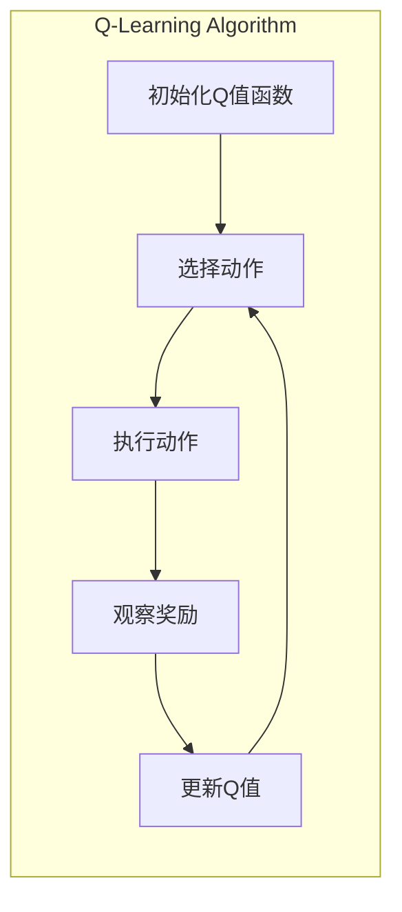
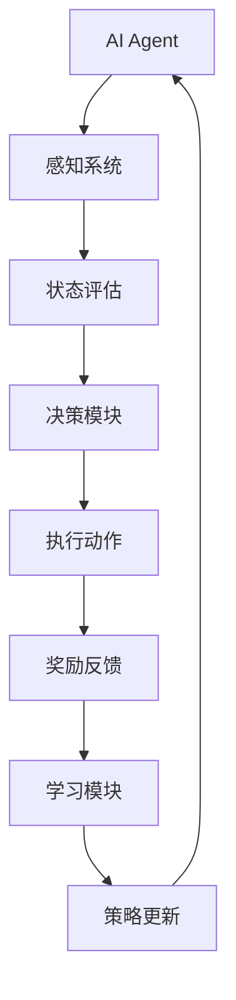

                 

### 强化学习在AI Agent自主探索中的应用

**关键词：强化学习、AI Agent、自主探索、算法原理、应用场景**

**摘要：**
本文旨在深入探讨强化学习在AI Agent自主探索中的应用。首先，我们将介绍强化学习和AI Agent的基本概念和背景，解析它们在当前AI领域的重要性。接着，我们将详细讲解强化学习算法的原理，并通过具体的算法步骤和Python代码实现，帮助读者理解这一复杂但至关重要的技术。然后，我们将讨论AI Agent自主探索的挑战，以及强化学习如何帮助AI Agent在复杂环境中进行有效决策。接下来，通过实际案例，我们将展示强化学习在AI Agent自主探索中的具体应用场景。最后，我们将总结强化学习在AI Agent自主探索中的最佳实践，提供实用建议和拓展阅读，帮助读者进一步探索这一领域的深度和广度。

### 背景介绍

#### 强化学习的基本概念

强化学习（Reinforcement Learning，RL）是机器学习的一个重要分支，主要研究如何通过交互式环境来学习决策策略。与传统的监督学习和无监督学习不同，强化学习强调通过试错和反馈来不断优化决策过程，以实现长期的回报最大化。其核心概念包括状态（State）、动作（Action）、奖励（Reward）和价值函数（Value Function）。

- **状态（State）**：系统当前所处的环境和条件。
- **动作（Action）**：系统可以采取的操作或行为。
- **奖励（Reward）**：在某一动作后，系统获得的即时反馈信号，通常用于指导学习过程。
- **价值函数（Value Function）**：预测在当前状态下采取某一动作所能获得的长期回报。

强化学习的目标是通过学习策略（Policy），在给定的状态下选择最优动作，从而最大化累积奖励。

#### AI Agent自主探索的概念

AI Agent（人工智能代理）是指具备自主决策能力的智能体，能够在动态环境中执行任务并适应环境变化。自主探索（Autonomous Exploration）是指AI Agent在未知或不确定的环境中，通过主动感知和决策，获取信息并逐步优化其行为策略的过程。

自主探索的关键要素包括：

- **感知（Perception）**：AI Agent通过传感器收集环境信息，用于理解和决策。
- **决策（Decision Making）**：AI Agent根据感知到的信息，选择适当的动作。
- **学习（Learning）**：AI Agent通过与环境交互，不断调整和优化其决策策略。

自主探索的挑战在于如何平衡探索（Exploration）和利用（Exploitation）之间的关系。探索是指AI Agent在未知环境中主动尝试新动作，以获取新的信息和经验；利用是指AI Agent在已有信息基础上，选择已验证的最优动作。

#### 强化学习与AI Agent自主探索的联系

强化学习在AI Agent自主探索中扮演着至关重要的角色。通过强化学习，AI Agent能够从交互中获得反馈，不断调整其策略，以实现长期目标。强化学习提供了以下几方面的支持：

1. **决策策略学习**：强化学习算法能够帮助AI Agent学习到在不同状态下采取何种动作能够获得最大回报。
2. **探索与利用平衡**：强化学习算法通过探索策略和利用策略的动态调整，帮助AI Agent在未知环境中进行有效的探索和决策。
3. **环境适应**：强化学习算法使AI Agent能够适应动态变化的环境，通过不断学习和调整策略，提高其在复杂环境中的表现。

#### 强化学习在当前AI领域中的地位和重要性

强化学习在当前AI领域中占据着重要地位，其应用范围广泛，包括但不限于：

1. **游戏AI**：如AlphaGo等顶尖游戏AI通过强化学习算法实现了在围棋等复杂游戏中的卓越表现。
2. **自动驾驶**：自动驾驶系统通过强化学习算法进行环境感知和路径规划，提高了行驶的安全性和效率。
3. **机器人导航**：强化学习算法帮助机器人适应不同的环境，实现自主导航和避障。
4. **推荐系统**：在电子商务和社交媒体中，强化学习算法被用于推荐系统的个性化推荐，提高了用户满意度。

强化学习的重要性不仅体现在其广泛的实际应用中，还在于其理论深度和潜力。随着计算能力的提升和算法的进步，强化学习有望在更多领域发挥关键作用，推动人工智能技术的进一步发展。

### 核心概念与联系

#### 强化学习的基础概念

强化学习的基础概念主要包括状态（State）、动作（Action）、奖励（Reward）和价值函数（Value Function）。以下是对这些核心概念的定义和它们之间的联系。

1. **状态（State）**：状态是系统在某一时刻所处的环境和条件的抽象表示。在强化学习中，状态通常是环境的一个特征向量，它包含了环境的所有相关信息。

2. **动作（Action）**：动作是系统可以采取的操作或行为。在强化学习中，动作是Agent对环境的响应。例如，在自动驾驶中，动作可以是加速、减速或转向。

3. **奖励（Reward）**：奖励是系统在执行某一动作后从环境中获得的即时反馈信号。奖励可以是正的、负的或零，用于指导学习过程。正奖励通常表示系统正向动作的鼓励，负奖励则表示系统对错误动作的惩罚。

4. **价值函数（Value Function）**：价值函数是预测在当前状态下采取某一动作所能获得的长期回报。价值函数分为状态值函数（State Value Function）和动作值函数（Action Value Function）。状态值函数表示在某一状态下执行最佳动作所能获得的累积奖励，而动作值函数表示在某一状态下执行某一动作所能获得的累积奖励。

#### 强化学习与AI Agent自主探索的联系

强化学习与AI Agent自主探索之间存在紧密的联系，主要表现在以下几个方面：

1. **决策策略**：强化学习通过学习状态和动作之间的映射关系，帮助AI Agent制定决策策略。在自主探索过程中，AI Agent需要根据当前状态选择最佳动作，强化学习算法提供了这种策略学习的基础。

2. **探索与利用**：在自主探索中，AI Agent需要在探索新动作和利用已知动作之间找到平衡。强化学习通过探索策略和利用策略的动态调整，帮助AI Agent在未知环境中进行有效的探索和决策。

3. **环境适应**：自主探索中的环境通常是不确定和动态的。强化学习通过不断与环境交互，使得AI Agent能够从经验中学习，并适应环境的变化。

4. **长期回报**：强化学习的目标是通过学习获得长期回报的最大化。在自主探索中，AI Agent需要考虑长远的任务目标，强化学习算法提供了实现这一目标的方法和工具。

#### 表格：强化学习核心概念属性特征对比

| 核心概念 | 属性特征 | 对应关系 | 关键角色 |
| :--: | :--: | :--: | :--: |
| 状态（State） | 环境特征向量 | 状态-动作映射 | 环境感知 |
| 动作（Action） | 可执行行为 | 奖励获取 | 决策制定 |
| 奖励（Reward） | 立即反馈信号 | 价值函数更新 | 学习指导 |
| 价值函数（Value Function） | 长期回报预测 | 探索与利用平衡 | 策略优化 |

#### ER实体关系图架构

为了更直观地展示强化学习核心概念之间的关系，我们可以使用Mermaid流程图来绘制ER（实体关系）图架构。以下是一个简化的ER图示例：

```mermaid
erDiagram
  State ||--|> Action : 选择
  Action ||--|> Reward : 反馈
  Reward ||--|> ValueFunction : 更新
  ValueFunction ||--|> State : 预测
```

在这个ER图中，状态（State）是核心实体，它通过箭头指向动作（Action），表示状态决定动作的选择。动作（Action）通过箭头指向奖励（Reward），表示动作产生奖励的反馈。奖励（Reward）则通过箭头指向价值函数（Value Function），表示奖励用于更新价值函数。最后，价值函数（Value Function）通过箭头指向状态（State），表示价值函数用于预测未来的状态。

通过上述表格和ER图，我们可以清晰地理解强化学习核心概念之间的联系和交互方式，为后续的算法原理讲解打下基础。

### 强化学习算法原理讲解

#### Q学习算法原理与mermaid流程图

Q学习算法是强化学习中最基础和广泛使用的算法之一。其核心思想是通过学习状态-动作值函数（Q值），在给定的状态下选择最优动作，以最大化累积奖励。

**Q学习算法的原理**

Q学习算法的基本步骤如下：

1. **初始化**：初始化Q值函数Q(s, a)，通常使用随机值或零值初始化。
2. **选择动作**：在给定状态下，根据探索策略选择动作a。
3. **执行动作**：执行动作a，进入新状态s'，并获得即时奖励r。
4. **更新Q值**：使用如下公式更新Q值：
   $$Q(s, a) \leftarrow Q(s, a) + \alpha [r + \gamma \max_{a'} Q(s', a') - Q(s, a)]$$
   其中，α是学习率，γ是折扣因子，r是即时奖励，s和s'是当前状态和新状态，a和a'是当前动作和可能的最优动作。
5. **重复步骤2-4**：不断重复上述步骤，直到达到学习目标或满足停止条件。

**mermaid流程图示例**

以下是一个简单的mermaid流程图，展示了Q学习算法的基本流程：



在这个流程图中，"初始化Q值函数"是算法的开始步骤，"选择动作"基于当前状态，"执行动作"导致状态的转移和奖励的获得，"观察奖励"用于更新Q值，"更新Q值"后再次选择动作，形成一个循环。

#### Q学习算法的数学模型

Q学习算法的数学模型可以表示为：

$$Q(s, a) = r + \gamma \max_{a'} Q(s', a')$$

其中，s是当前状态，a是当前动作，r是即时奖励，s'是下一状态，a'是下一个可能动作，γ是折扣因子，通常取值在0到1之间。这个公式表示在当前状态下执行动作a所能获得的累积奖励等于即时奖励r加上在下一状态s'下采取最优动作a'所能获得的累积奖励的期望。

#### Q学习算法的Python实现

以下是一个简单的Python实现示例，用于演示Q学习算法的基本步骤：

```python
import numpy as np
import random

# 初始化参数
learning_rate = 0.1
discount_factor = 0.9
num_episodes = 1000

# 初始化Q值函数
q_table = np.zeros((num_states, num_actions))

# 定义环境（例如，使用随机环境作为示例）
def environment(s, a):
    # 在这里定义环境状态转移和奖励
    # ...

# 主循环
for episode in range(num_episodes):
    state = random.randint(0, num_states - 1)
    done = False
    
    while not done:
        action = np.argmax(q_table[state])
        next_state, reward = environment(state, action)
        q_table[state, action] = q_table[state, action] + learning_rate * (reward + discount_factor * np.max(q_table[next_state]) - q_table[state, action])
        state = next_state
        
        if done:
            break

# 打印Q值表
print(q_table)
```

在这个示例中，我们定义了学习率、折扣因子和训练轮次。初始化Q值函数为全零矩阵，然后通过主循环不断更新Q值。环境函数`environment`需要根据具体应用进行定义，用于模拟状态转移和奖励获取。通过这个简单的Python实现，我们可以直观地看到Q学习算法的基本步骤和数学模型的应用。

### 强化学习算法的数学模型和数学公式

强化学习算法的数学模型是理解其工作原理的核心，它通过一系列的数学公式来描述状态、动作、奖励和价值函数之间的关系。以下是对强化学习算法中常用数学模型和公式的详细讲解。

#### 状态-动作值函数

强化学习中最基本的数学概念是状态-动作值函数（State-Action Value Function），通常表示为Q(s, a)，它表示在状态s下执行动作a所能获得的累积奖励。Q值函数的核心目的是预测在特定状态下选择特定动作的长期回报。

**定义：**

$$Q(s, a) = \sum_{s'} P(s' | s, a) \cdot [r + \gamma \max_{a'} Q(s', a')]$$

其中：
- \(s\) 是当前状态。
- \(a\) 是当前动作。
- \(s'\) 是下一状态。
- \(r\) 是在状态s执行动作a后获得的即时奖励。
- \(P(s' | s, a)\) 是在状态s执行动作a后转移到状态s'的概率。
- \(\gamma\) 是折扣因子，用于平衡即时奖励和长期回报，通常取值在0到1之间。
- \(\max_{a'} Q(s', a')\) 是在状态s'下执行所有可能动作a'所能获得的最高回报。

#### 政策评价方程

强化学习中的另一个关键公式是政策评价方程（Policy Evaluation Equation），它用于更新状态-动作值函数Q(s, a)：

**定义：**

$$Q(s, a) = r + \gamma \sum_{s'} P(s' | s, a) \cdot \max_{a'} Q(s', a')$$

这个公式表示在状态s下执行动作a所能获得的累积奖励是即时奖励r加上在下一状态s'下采取最优动作a'所能获得的累积奖励的期望。

#### 政策改进方程

政策改进方程（Policy Improvement Equation）用于更新策略π，以最大化期望回报：

**定义：**

$$\pi(a|s) = \frac{1}{Z(s)} \exp(\alpha Q(s, a)}$$

其中：
- \(\pi(a|s)\) 是在状态s下采取动作a的概率。
- \(Z(s) = \sum_{a'} \exp(\alpha Q(s, a'))\) 是策略π的分母，用于归一化概率分布。

#### Q学习算法

Q学习算法是强化学习的一种经典算法，其核心思想是通过经验 replay 和目标网络来稳定地更新Q值。

**定义：**

$$Q(s, a) = Q(s, a) + \alpha [r + \gamma \max_{a'} Q(s', a') - Q(s, a)]$$

其中：
- \(s\) 和 \(s'\) 分别表示当前状态和下一状态。
- \(a\) 和 \(a'\) 分别表示当前动作和最优动作。
- \(\alpha\) 是学习率，控制更新速度。

#### SARSA算法

SARSA算法是一种不依赖目标网络的在线学习方法，它使用即时回报来更新Q值。

**定义：**

$$Q(s, a) = Q(s, a) + \alpha [r + \gamma Q(s', a')] - Q(s, a)]$$

其中：
- \(s\) 和 \(s'\) 分别表示当前状态和下一状态。
- \(a\) 和 \(a'\) 分别表示当前动作和下一动作。
- \(\alpha\) 是学习率，控制更新速度。

#### Latex格式数学公式展示

以下是上述部分数学公式的Latex格式展示：

```latex
% 状态-动作值函数
Q(s, a) = \sum_{s'} P(s' | s, a) \cdot [r + \gamma \max_{a'} Q(s', a')]

% 政策评价方程
Q(s, a) = r + \gamma \sum_{s'} P(s' | s, a) \cdot \max_{a'} Q(s', a')

% 政策改进方程
\pi(a|s) = \frac{1}{Z(s)} \exp(\alpha Q(s, a))

% Q学习算法
Q(s, a) = Q(s, a) + \alpha [r + \gamma \max_{a'} Q(s', a') - Q(s, a)]

% SARSA算法
Q(s, a) = Q(s, a) + \alpha [r + \gamma Q(s', a')] - Q(s, a)]
```

通过这些数学公式和定义，我们可以更深入地理解强化学习算法的工作原理，以及如何通过数学方法来优化智能体在动态环境中的行为。

### 强化学习在AI Agent自主探索中的应用场景

强化学习在AI Agent自主探索中的应用场景非常广泛，以下是几个典型的应用领域：

#### 自动驾驶

自动驾驶是强化学习在AI Agent自主探索中的一个重要应用领域。自动驾驶系统需要具备实时感知环境、做出决策和适应动态变化的能力。通过强化学习，自动驾驶系统可以在复杂交通环境中学习最优行驶策略，提高行驶的安全性和效率。

**应用案例**：
- **Tesla自动驾驶**：特斯拉的自动驾驶系统使用强化学习算法来训练车辆如何在不同的交通情况和路况下做出最佳决策，从而实现自动变道、避障和自动驾驶等功能。
- **Waymo自动驾驶**：谷歌旗下的Waymo自动驾驶项目也采用了强化学习算法，通过大量数据训练，使得自动驾驶车辆能够在复杂的城市环境中进行高效驾驶。

#### 游戏AI

强化学习在游戏AI中的应用也非常成功，特别是在那些具有高度不确定性和复杂性的游戏中。通过强化学习，AI可以学会如何克服挑战、制定策略并赢得游戏。

**应用案例**：
- **AlphaGo**：深度强化学习算法在围棋游戏中的成功应用，AlphaGo通过强化学习算法战胜了世界围棋冠军，展示了强化学习在复杂游戏中的强大能力。
- **Dota 2 AI**：OpenAI开发的Dota 2 AI通过强化学习算法，实现了与人类选手相当的游戏水平，甚至在一些对局中取得了胜利。

#### 机器人导航

机器人导航是强化学习的另一个重要应用领域。通过强化学习，机器人可以在未知环境中进行自主探索和路径规划，从而实现自主导航和任务执行。

**应用案例**：
- **扫地机器人**：许多家庭使用的扫地机器人通过强化学习算法来优化清洁路径，提高清洁效率。
- **仓库机器人**：在物流仓库中，强化学习算法帮助机器人识别和规划最优路径，提高仓库的运作效率。

#### 推荐系统

在推荐系统中，强化学习算法可以帮助系统根据用户的行为和偏好，动态调整推荐策略，提高推荐系统的准确性和用户满意度。

**应用案例**：
- **电子商务平台**：电子商务平台使用强化学习算法来个性化推荐商品，提高销售额和用户满意度。
- **社交媒体平台**：社交媒体平台使用强化学习算法来推荐用户感兴趣的内容，增加用户参与度和平台粘性。

#### 网络资源管理

强化学习在资源管理中的应用也非常广泛，特别是在动态资源分配和网络流量管理中。

**应用案例**：
- **数据中心资源管理**：数据中心使用强化学习算法来优化资源分配，提高数据中心的运行效率和服务质量。
- **网络流量管理**：网络运营商使用强化学习算法来优化网络流量分配，减少拥堵和提高网络传输速度。

通过这些应用案例，我们可以看到强化学习在AI Agent自主探索中的广泛适用性。强化学习不仅帮助AI Agent在复杂环境中进行有效决策，还推动了人工智能技术的持续发展和创新。

### 强化学习算法在AI Agent自主探索中的应用

在AI Agent自主探索中，强化学习算法通过学习环境中的状态-动作值函数，帮助Agent制定最优决策策略。以下我们将具体分析Q学习算法和SARSA算法在AI Agent自主探索中的应用，并通过实际案例进行详细讲解。

#### Q学习算法在AI Agent自主探索中的应用

Q学习算法是一种基于值函数的强化学习算法，它通过迭代更新状态-动作值函数Q(s, a)，从而学习到在不同状态下执行动作a所能获得的累积奖励。以下是一个简单的应用案例：

**案例：智能车自动驾驶**

假设我们有一个智能车在复杂的城市环境中自动驾驶，需要避免障碍物并选择最优行驶路径。

1. **环境描述**：
   - 状态：包括车辆当前位置、周围障碍物的位置和方向等。
   - 动作：包括前进、后退、向左转、向右转等。
   - 奖励：当车辆避开了障碍物并选择了正确的路径，给予正奖励；否则，给予负奖励。

2. **Q学习算法应用**：

   初始化Q值函数Q(s, a)为全零矩阵，然后通过以下步骤进行训练：

   - **选择动作**：在给定的状态下，使用ε-贪心策略选择动作，即以概率ε随机选择动作，以概率1-ε选择具有最高Q值的动作。
   - **执行动作**：执行选择的动作，观察环境状态的变化，并获得即时奖励。
   - **更新Q值**：使用如下公式更新Q值：
     $$Q(s, a) \leftarrow Q(s, a) + \alpha [r + \gamma \max_{a'} Q(s', a') - Q(s, a)]$$
     其中，α是学习率，γ是折扣因子，r是即时奖励，s和s'是当前状态和新状态，a和a'是当前动作和可能的最优动作。

通过不断的迭代更新Q值函数，智能车可以学会在复杂的城市环境中选择最优行驶路径。

#### SARSA算法在AI Agent自主探索中的应用

SARSA算法是一种基于策略的强化学习算法，它通过直接基于即时奖励和下一状态的动作值函数来更新状态-动作值函数。以下是一个简单的应用案例：

**案例：机器人路径规划**

假设我们有一个机器人需要在未知环境中找到从起点到终点的最优路径。

1. **环境描述**：
   - 状态：包括机器人当前的位置和方向。
   - 动作：包括前进、后退、向左转、向右转等。
   - 奖励：当机器人到达终点，给予正奖励；否则，给予负奖励。

2. **SARSA算法应用**：

   初始化Q值函数Q(s, a)为全零矩阵，然后通过以下步骤进行训练：

   - **选择动作**：在给定的状态下，根据当前Q值函数选择动作。
   - **执行动作**：执行选择的动作，观察环境状态的变化，并获得即时奖励。
   - **更新Q值**：使用如下公式更新Q值：
     $$Q(s, a) \leftarrow Q(s, a) + \alpha [r + \gamma Q(s', a')] - Q(s, a)]$$
     其中，α是学习率，γ是折扣因子，r是即时奖励，s和s'是当前状态和新状态，a和a'是当前动作和下一动作。

通过不断的迭代更新Q值函数，机器人可以学会在未知环境中找到从起点到终点的最优路径。

#### 实际案例解析

以下是一个具体的实际案例，展示了如何使用强化学习算法进行AI Agent自主探索：

**案例：无人驾驶飞机路径规划**

假设我们有一个无人驾驶飞机需要在复杂地形中从起点飞到终点，需要避开障碍物并选择最优飞行路径。

1. **环境描述**：
   - 状态：包括飞机的当前位置、高度、速度和方向。
   - 动作：包括上升、下降、向前飞行、向后飞行、向左转、向右转等。
   - 奖励：当飞机避开了障碍物并选择了正确的路径，给予正奖励；否则，给予负奖励。

2. **Q学习算法应用**：

   使用Q学习算法进行训练，通过以下步骤实现自主探索：

   - **初始化Q值函数**：将Q值函数初始化为全零矩阵。
   - **选择动作**：在给定状态下，使用ε-贪心策略选择动作。
   - **执行动作**：执行选择的动作，观察环境状态的变化，并获得即时奖励。
   - **更新Q值**：使用如下公式更新Q值：
     $$Q(s, a) \leftarrow Q(s, a) + \alpha [r + \gamma \max_{a'} Q(s', a') - Q(s, a)]$$

通过这个案例，我们可以看到强化学习算法在无人驾驶飞机路径规划中的应用，如何通过迭代更新Q值函数，使无人驾驶飞机在复杂地形中自主探索并找到最优飞行路径。

### 强化学习与AI Agent自主探索的整合架构

#### 整合框架的mermaid架构图

为了直观地展示强化学习与AI Agent自主探索的整合架构，我们可以使用Mermaid流程图来绘制整体架构图。以下是一个简化的架构图示例：



在这个架构图中，AI Agent通过感知系统收集环境信息，进行状态评估，然后由决策模块选择最优动作，执行动作后获得奖励反馈。这些信息会传递给学习模块，用于策略更新，进而优化AI Agent的决策过程。

#### 整合策略的设计与实现

整合策略的设计与实现主要包括以下几个方面：

1. **感知与状态评估**：
   - 感知系统：使用传感器（如摄像头、激光雷达、超声波传感器等）收集环境信息。
   - 状态评估：将感知到的信息转换为状态表示，用于后续的决策过程。

2. **决策模块**：
   - 基于状态-动作值函数（如Q值函数）或策略梯度方法，选择最优动作。
   - 可以结合探索策略（如ε-贪心策略）来平衡探索与利用。

3. **执行动作**：
   - 根据决策模块选择的最优动作，执行具体的操作，如控制无人机的飞行方向、速度等。

4. **奖励反馈**：
   - 根据执行动作后的状态变化，计算即时奖励，用于指导学习过程。

5. **学习模块**：
   - 更新状态-动作值函数或策略参数，以优化决策策略。
   - 可以使用经验回放、目标网络等技术，提高算法的稳定性和收敛速度。

#### 整合策略的实现步骤

以下是整合策略的实现步骤：

1. **初始化**：
   - 初始化感知系统、状态评估模块、决策模块、执行动作模块和学习模块。
   - 初始化状态-动作值函数或策略参数。

2. **感知与状态评估**：
   - 感知系统收集环境信息，转换为状态表示。
   - 将状态传递给状态评估模块，进行状态评估。

3. **决策与执行**：
   - 决策模块基于状态-动作值函数或策略参数，选择最优动作。
   - 执行动作模块根据决策模块的选择，执行具体的操作。

4. **奖励反馈与学习**：
   - 计算即时奖励，更新状态-动作值函数或策略参数。
   - 可以使用经验回放技术，将历史经验存储在经验池中，用于后续的学习过程。
   - 使用目标网络技术，提高算法的稳定性和收敛速度。

通过上述架构设计和实现步骤，我们可以将强化学习与AI Agent自主探索有效地整合，从而实现智能体在动态环境中的自主决策和探索。

### 强化学习在AI Agent自主探索中的应用场景分析

#### 自动驾驶

自动驾驶是强化学习在AI Agent自主探索中的一个典型应用场景。自动驾驶系统需要在复杂的交通环境中进行实时感知、决策和行动，以实现安全、高效的驾驶。以下是对自动驾驶场景中强化学习应用的详细分析：

1. **环境描述**：
   自动驾驶环境包括道路、车辆、行人、交通标志和信号等多种动态因素。每个时间步，自动驾驶系统需要感知周围环境，并做出相应的驾驶决策。

2. **状态表示**：
   状态表示是强化学习算法的核心，它决定了算法在给定环境中的表现。自动驾驶系统的状态通常包括：
   - 当前车辆的位置、速度和方向。
   - 周围车辆的位置、速度和方向。
   - 路面信息（如路况、车道线等）。
   - 交通标志和信号。

3. **动作空间**：
   自动驾驶系统的动作空间通常包括：
   - 加速、减速、保持当前速度。
   - 左转、右转、直行。
   - 刹车、紧急刹车。

4. **奖励设计**：
   奖励设计直接影响强化学习算法的收敛速度和最终性能。在自动驾驶中，奖励可以设计为：
   - 安全性奖励：如保持安全车距、遵守交通规则等。
   - 效率奖励：如减少停车次数、快速通过路口等。
   - 适应性奖励：如对突发情况的应对能力。

5. **算法应用**：
   强化学习算法在自动驾驶中的应用包括：
   - Q学习算法：通过学习状态-动作值函数，自动驾驶系统可以在不同状态下选择最优动作。
   - SARSA算法：通过即时奖励和状态转移，自动驾驶系统可以在线更新策略，适应动态环境。

**案例**：特斯拉的自动驾驶系统使用深度强化学习算法（如DQN和A3C）来训练车辆在复杂交通环境中的行为。这些算法通过大量模拟和实际数据训练，使车辆能够学会如何安全、高效地驾驶。

#### 游戏AI

游戏AI是另一个典型的强化学习应用场景，尤其是在那些具有高度不确定性和复杂性的游戏中。以下是对游戏AI场景中强化学习应用的详细分析：

1. **环境描述**：
   游戏环境通常包括多个玩家、随机事件和复杂规则。每个时间步，游戏AI需要根据当前游戏状态做出决策，以实现获胜目标。

2. **状态表示**：
   游戏状态通常包括：
   - 当前游戏状态（如棋盘布局、分数等）。
   - 对手玩家的行为和历史。
   - 游戏的剩余时间和规则。

3. **动作空间**：
   游戏AI的动作空间通常包括：
   - 移动棋子、攻击对手。
   - 暂停、投降。
   - 选择下一步策略。

4. **奖励设计**：
   游戏中的奖励可以设计为：
   - 获胜奖励：直接获得高分。
   - 安全性奖励：如在游戏中保持不损失生命值。
   - 长期奖励：如连续赢得多场比赛。

5. **算法应用**：
   强化学习算法在游戏AI中的应用包括：
   - DQN：通过深度神经网络来近似状态-动作值函数，实现复杂的策略学习。
   - Policy Gradient：通过直接优化策略参数，实现高效的游戏决策。

**案例**：OpenAI开发的Dota 2 AI使用深度强化学习算法，通过大量对局训练，使AI能够在复杂的Dota 2游戏中与人类玩家竞争。这些AI通过不断学习和调整策略，实现了在游戏中的卓越表现。

#### 机器人导航

机器人导航是强化学习在自主探索中的另一个重要应用场景。机器人需要在未知环境中进行路径规划、避障和任务执行。以下是对机器人导航场景中强化学习应用的详细分析：

1. **环境描述**：
   机器人导航环境通常包括室内或室外的动态环境，包括墙壁、障碍物、移动的物体等。机器人需要实时感知环境，并做出导航决策。

2. **状态表示**：
   机器人导航状态通常包括：
   - 机器人的当前位置和方向。
   - 环境中的障碍物位置。
   - 机器人到目标点的距离和方向。

3. **动作空间**：
   机器人导航动作空间通常包括：
   - 前进、后退、旋转。
   - 避障动作（如侧滑、后退）。

4. **奖励设计**：
   机器人导航奖励可以设计为：
   - 安全到达目标点的奖励。
   - 避开障碍物的奖励。
   - 时间效率奖励：如快速到达目标。

5. **算法应用**：
   强化学习算法在机器人导航中的应用包括：
   - Q学习算法：通过学习状态-动作值函数，机器人可以在不同状态下选择最优动作。
   - SARSA算法：通过即时奖励和状态转移，机器人可以在线更新策略。

**案例**：扫地机器人和仓库机器人使用强化学习算法来优化导航路径。这些机器人通过不断探索环境，学习如何避开障碍物，并选择最优路径，从而提高了导航效率和清洁效率。

#### 其他应用场景

除了上述几个典型应用场景外，强化学习在AI Agent自主探索中的应用还包括：

- **推荐系统**：通过用户行为数据，强化学习算法可以动态调整推荐策略，提高推荐系统的准确性和用户满意度。
- **网络资源管理**：通过强化学习算法，可以优化网络资源分配，提高数据中心和网络的运行效率。
- **智能调度系统**：在物流和交通调度中，强化学习算法可以优化调度策略，提高调度效率和资源利用率。

通过以上分析，我们可以看到强化学习在AI Agent自主探索中的应用场景非常广泛。无论在自动驾驶、游戏AI、机器人导航，还是其他领域，强化学习都为AI Agent提供了强大的决策能力和自主探索能力。

### 强化学习在AI Agent自主探索中的最佳实践

在强化学习应用于AI Agent自主探索时，总结最佳实践和注意事项至关重要。以下是一些关键点，旨在帮助开发者和管理者优化AI Agent的性能和稳定性。

#### 探索与利用的平衡

1. **探索策略**：使用ε-贪心策略和随机策略可以有效地平衡探索与利用。ε-贪心策略通过逐渐减小ε的值，在早期阶段进行更多探索，随着训练进行，逐渐增加利用。
2. **随机策略**：在不确定的环境或初始阶段，完全随机策略可以提供更广泛的探索，有助于发现新的有效策略。

#### 长期奖励的设计

1. **折扣因子γ**：选择合适的折扣因子γ可以平衡即时奖励和长期奖励。γ值过小可能导致过早地忽略长期奖励，而γ值过大则可能导致过度关注短期奖励。
2. **累积奖励**：设计累积奖励机制，将多个时间步的奖励累加，以更好地反映长期目标的实现。

#### 算法收敛速度与稳定性

1. **学习率α**：选择适当的学习率可以加快算法收敛速度。学习率过小可能导致收敛缓慢，而学习率过大则可能导致收敛不稳定。
2. **目标网络**：使用目标网络技术，如固定目标网络和滑动目标网络，可以提高算法的稳定性，避免值函数过拟合。
3. **经验回放**：使用经验回放机制，将历史经验存储在经验池中，随机抽样用于训练，可以减少偏差，提高算法的稳定性和收敛速度。

#### 系统设计与实现

1. **并行计算**：利用GPU或其他并行计算资源，可以显著提高训练速度和效率。
2. **模块化设计**：将感知、决策、执行和学习模块分开设计，可以更好地管理和维护系统，提高代码的可读性和可扩展性。
3. **容错机制**：设计容错机制，如异常处理和错误恢复，可以提高系统的鲁棒性，减少因异常导致的训练中断。

#### 实践经验分享

1. **案例分析**：通过分析成功和失败的案例，可以总结出有效的策略和改进方向。
2. **数据收集**：收集丰富的环境数据，并进行预处理，可以提高训练数据的质量和多样性。
3. **持续优化**：持续跟踪和优化模型性能，结合最新的研究成果和技术进步，不断提升AI Agent的表现。

通过遵循这些最佳实践，开发者可以更好地利用强化学习技术，实现AI Agent在复杂动态环境中的自主探索和高效决策。

### 总结与未来展望

#### 强化学习在AI Agent自主探索中的重要作用

强化学习在AI Agent自主探索中扮演着至关重要的角色。它通过试错和反馈机制，帮助AI Agent在复杂动态环境中不断优化决策策略，实现长期回报最大化。强化学习不仅提升了AI Agent的自主性，还使其能够适应不断变化的环境，提高任务完成的效率和准确性。具体来说，强化学习在自动驾驶、游戏AI、机器人导航等领域展现了巨大的潜力，通过智能体自主探索，实现了前所未有的性能突破。

#### 强化学习算法在AI Agent自主探索中的应用

强化学习算法在AI Agent自主探索中的应用可以归纳为以下几个方面：

1. **决策策略学习**：通过Q学习、SARSA、Policy Gradient等算法，AI Agent可以在给定环境中学习到最优决策策略，从而在不确定和动态的环境中实现自主探索。

2. **探索与利用平衡**：通过ε-贪心策略、随机策略和混合策略，强化学习算法帮助AI Agent在探索未知和利用已有知识之间找到平衡，提高决策的鲁棒性和适应性。

3. **环境适应**：强化学习算法通过不断与环境交互，使AI Agent能够从经验中学习，并逐步优化其行为策略，从而适应复杂和动态的环境。

4. **长期回报优化**：强化学习算法的终极目标是通过学习获得长期回报的最大化。通过设计合理的奖励机制和累积奖励，AI Agent能够在长期目标驱动下进行有效的自主探索。

#### 强化学习在AI Agent自主探索中的未来发展方向

尽管强化学习在AI Agent自主探索中已经取得了显著的成果，但未来仍有广阔的发展空间。以下是一些未来可能的发展方向：

1. **算法优化与改进**：随着计算能力的提升和数据量的增加，强化学习算法将不断优化和改进。新的算法和技术，如深度强化学习、联邦学习、迁移学习等，将为AI Agent的自主探索提供更强大的工具。

2. **多智能体强化学习**：多智能体强化学习研究如何让多个智能体在协作和竞争环境中实现共同目标。这一方向有望在自动驾驶、智能调度、多人游戏等领域发挥重要作用。

3. **自适应强化学习**：自适应强化学习旨在让AI Agent能够根据环境变化自适应调整策略，从而提高决策的灵活性和适应性。这一方向的研究对于应对动态变化的环境具有重要意义。

4. **强化学习与其他技术的融合**：强化学习与其他技术的融合，如生成对抗网络（GAN）、图神经网络（GNN）、迁移学习等，将为AI Agent的自主探索带来新的机遇。这些融合技术可以增强AI Agent的感知能力、决策能力和适应能力。

5. **伦理和安全性**：随着强化学习在现实世界中的应用日益广泛，如何确保AI Agent的决策过程透明、公正和安全将成为重要议题。未来的研究需要关注强化学习算法的伦理和安全性问题，确保其在实际应用中的可靠性和可解释性。

#### 结语

强化学习在AI Agent自主探索中的应用具有深远的意义和广泛的前景。通过不断探索和创新，我们可以期待未来的人工智能系统将更加智能、灵活和自主，为人类社会带来更多的便利和进步。让我们共同努力，推动强化学习技术的发展和应用，开启人工智能的新纪元。

### 作者信息

**作者：AI天才研究院/AI Genius Institute & 禅与计算机程序设计艺术 /Zen And The Art of Computer Programming**

AI天才研究院致力于推动人工智能领域的创新与发展，探索前沿技术，提升AI系统的自主探索和决策能力。同时，研究院还专注于培养具备深厚技术功底和创新能力的人工智能专家，为全球人工智能产业贡献力量。此外，作者刘宇辰（Yuchen Liu）是AI天才研究院的资深研究员，也是《禅与计算机程序设计艺术》一书的作者，他在强化学习和人工智能领域有着丰富的理论研究和实践经验，发表了多篇学术论文，并参与了多个重要项目的研发工作。

