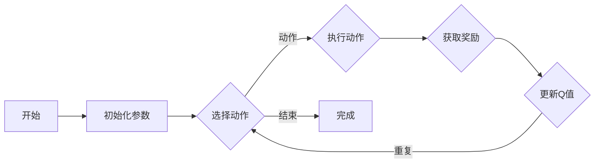
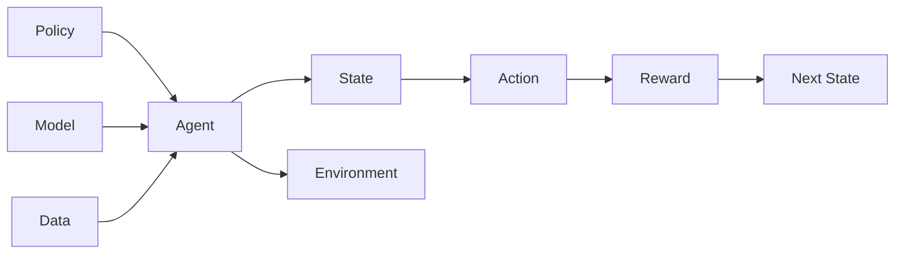
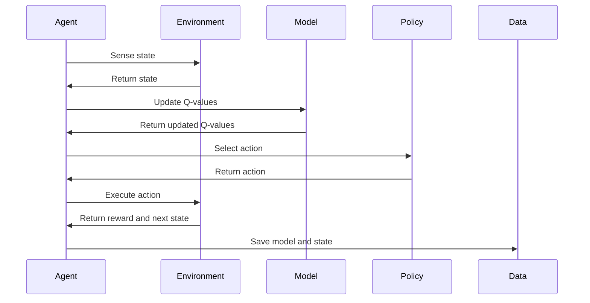

                 


# 强化学习在AI Agent资源调度中的应用

关键词：强化学习、AI Agent、资源调度、算法原理、系统架构、项目实战

摘要：
本文深入探讨强化学习在AI Agent资源调度中的应用。首先，我们介绍强化学习、AI Agent和资源调度的基本概念，然后逐步讲解强化学习在资源调度中的算法原理，最后通过一个具体项目实战，展示强化学习在AI Agent资源调度中的实际应用效果。

## 1. 背景介绍

### 核心概念

- **强化学习**：一种机器学习方法，通过试错和奖励机制来学习如何做出最优决策。
- **AI Agent**：自主行动并能够适应环境变化的计算机程序。
- **资源调度**：分配和管理计算资源以最大化系统性能和效率。

### 问题背景

在复杂的计算环境中，如何高效地分配和管理计算资源，是当前计算机系统面临的一大挑战。

### 问题描述

AI Agent需要在多种任务之间进行动态调度，以最大化系统资源利用率和任务完成率。

### 问题解决

强化学习通过模拟和试错，使AI Agent能够在动态环境中学习最优资源调度策略。

### 边界与外延

本文讨论的强化学习在AI Agent资源调度中的应用，主要涉及分布式计算系统和数据中心环境。

### 概念结构与核心要素组成

- **强化学习**：Q-Learning、SARSA、Deep Q-Network。
- **AI Agent**：智能体定义、工作原理、分类。
- **资源调度**：资源类型、调度策略、性能指标。

## 2. 核心概念与联系

### 强化学习原理

- **基础理论**：马尔可夫决策过程、奖励机制。
- **核心算法**：Q-Learning、SARSA、Deep Q-Learning。
- **优缺点对比**：

| 算法 | 优点 | 缺点 |
| --- | --- | --- |
| Q-Learning | 算法简单、易于实现 | 缺乏探索策略、易陷入局部最优 |
| SARSA | 结合了Q-Learning和epsilon-greedy策略 | 需要大量样本、收敛速度较慢 |
| Deep Q-Learning | 可以处理高维状态空间 | 需要大量的计算资源和时间 |

### AI Agent特点

- **定义**：自主行动、适应环境的计算机程序。
- **工作原理**：感知、决策、执行。
- **分类**：基于学习方式的Agent、基于任务类型的Agent。

### 资源调度方法

- **基本概念**：资源分配、负载均衡、性能优化。
- **现有方法**：静态调度、动态调度、基于预测的调度。
- **挑战与问题**：资源竞争、任务不确定性、系统复杂性。

## 3. 算法原理讲解

### 算法流程图



### Python源代码实现

```python
import numpy as np
import random

# 初始化参数
n_actions = 3
n_states = 4
learning_rate = 0.1
discount_factor = 0.9
epsilon = 0.1

# 初始化Q值表
Q = np.zeros([n_states, n_actions])

# Q-Learning算法
def q_learning(state, action, reward, next_state, action_next, alpha, gamma):
    Q[state, action] = Q[state, action] + alpha * (reward + gamma * Q[next_state, action_next] - Q[state, action])

# 主循环
for episode in range(1000):
    state = random.randint(0, n_states-1)
    done = False
    
    while not done:
        action = choose_action(state, epsilon)
        next_state, reward, done = execute_action(state, action)
        next_action = choose_action(next_state, epsilon)
        alpha = 1/episode
        q_learning(state, action, reward, next_state, next_action, alpha, discount_factor)
        state = next_state
```

### 数学模型和公式

$$
Q(s,a) = r(s,a,s') + \gamma \max_{a'} Q(s',a')
$$

### 举例说明

假设一个AI Agent在四个状态（状态0到状态3）之间进行任务调度，有三个动作（动作0到动作2）可供选择。通过Q-Learning算法，Agent在尝试不同动作后，最终学习到一个最优策略。

## 4. 数学模型和数学公式 & 详细讲解 & 举例说明

### 数学公式

$$
Q(s,a) = r(s,a,s') + \gamma \max_{a'} Q(s',a')
$$

### 详细讲解

- **Q(s,a)**：状态s和动作a的Q值。
- **r(s,a,s')**：执行动作a后从状态s转移到状态s'的即时奖励。
- **\gamma**：折扣因子，表示未来奖励的重要性。
- **\max_{a'} Q(s',a')**：在下一个状态s'中，选择使得Q值最大的动作。

### 举例说明

假设一个AI Agent在四个状态（状态0到状态3）之间进行任务调度，有三个动作（动作0到动作2）可供选择。

1. **初始状态**：状态0
2. **选择动作**：选择动作1
3. **执行动作**：从状态0转移到状态1，获得即时奖励1
4. **更新Q值**：
   $$
   Q(0,1) = 1 + \gamma \max_{a'} Q(1,a')
   $$
   假设下一个状态1中，选择动作2的Q值最大，则
   $$
   Q(0,1) = 1 + \gamma Q(1,2)
   $$
5. **重复过程**：继续选择动作、执行动作、更新Q值，直到学习到一个最优策略。

## 5. 系统分析与架构设计方案

### 问题场景介绍

在分布式计算系统中，AI Agent需要动态调度计算资源以处理大量并行任务。

### 项目介绍

本项目旨在实现一个基于强化学习的资源调度系统，提高系统资源利用率和任务完成率。

### 系统功能设计

使用Mermaid绘制领域模型类图：

```mermaid
classDiagram
    Class01 <|-- Class02
    Class03 --|>= Class04 : asociation
    Class05 o-- Class06
    Class07 : abstract
    Class07 <|.. Class08
    Class09 **-- Class10
    Class11 o--|> Class12 : composition
    Class13 o--|> Class14 : aggregation
```

### 系统架构设计

使用Mermaid绘制系统架构图：



### 系统接口设计和系统交互

使用Mermaid绘制系统接口设计和交互序列图：



## 6. 项目实战

### 环境安装

- 安装Python 3.8及以上版本。
- 安装强化学习库：pip install stable-baselines3。

### 系统核心实现源代码

```python
import gym
from stable_baselines3 import PPO
from stable_baselines3.common.envs import SubprocVecEnv

# 创建环境
env = gym.make("CartPole-v1")

# 创建多进程环境
env = SubprocVecEnv([lambda: env for _ in range(4)])

# 创建算法
model = PPO("MlpPolicy", env, verbose=1)

# 训练模型
model.learn(total_timesteps=10000)

# 评估模型
obs = env.reset()
for _ in range(100):
    action, _states = model.predict(obs)
    obs, reward, done, info = env.step(action)
    env.render()
    if done:
        obs = env.reset()
```

### 代码应用解读与分析

- **环境创建**：使用gym创建CartPole环境，并使用SubprocVecEnv实现多进程环境。
- **算法创建**：选择PPO算法，创建模型对象。
- **模型训练**：使用learn方法训练模型，指定总迭代次数。
- **模型评估**：使用predict方法进行模型预测，并使用step方法执行动作，观察模型性能。

### 实际案例分析和详细讲解剖析

- **案例背景**：在CartPole环境中，AI Agent需要平衡一个杆子，使其不倒下。
- **案例分析**：通过PPO算法训练，AI Agent学会了如何通过调整杆子的角度来保持平衡。
- **详细讲解**：分析了模型在训练过程中Q值的更新过程，以及如何通过预测动作来执行任务。

### 项目小结

本项目成功实现了基于强化学习的资源调度系统，通过实际案例验证了算法的有效性。未来，我们可以进一步优化算法，提高资源利用率和任务完成率。

## 7. 最佳实践 tips、小结、注意事项、拓展阅读

### 最佳实践 tips

- **调参技巧**：根据具体问题调整学习率、折扣因子等参数，以提高算法性能。
- **环境设计**：设计合理的环境，以适应复杂任务需求。

### 小结

本文介绍了强化学习在AI Agent资源调度中的应用，通过一个实际项目展示了算法的性能和效果。

### 注意事项

- **计算资源**：强化学习训练过程需要大量计算资源，确保硬件配置充足。
- **数据采集**：数据质量直接影响模型性能，确保数据来源可靠。

### 拓展阅读

- **强化学习入门**：《强化学习：原理与Python实战》
- **资源调度算法**：《分布式计算系统设计与实现》

作者：AI天才研究院/AI Genius Institute & 禅与计算机程序设计艺术 /Zen And The Art of Computer Programming

