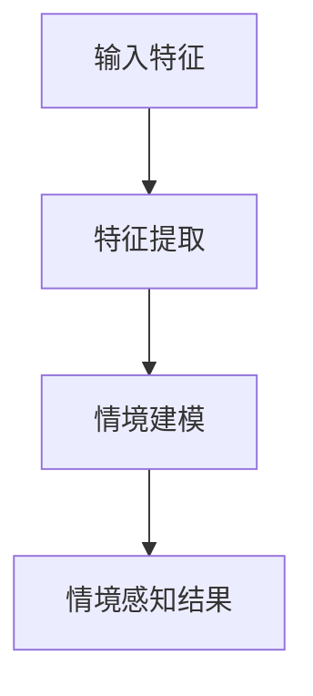
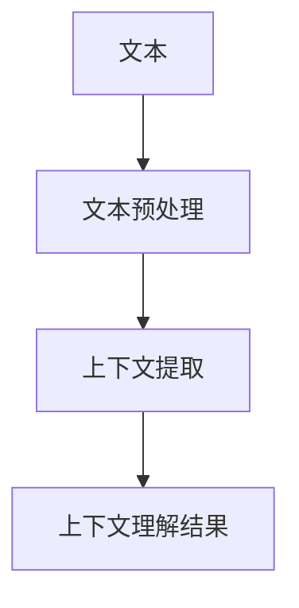
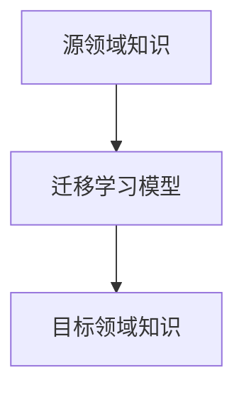
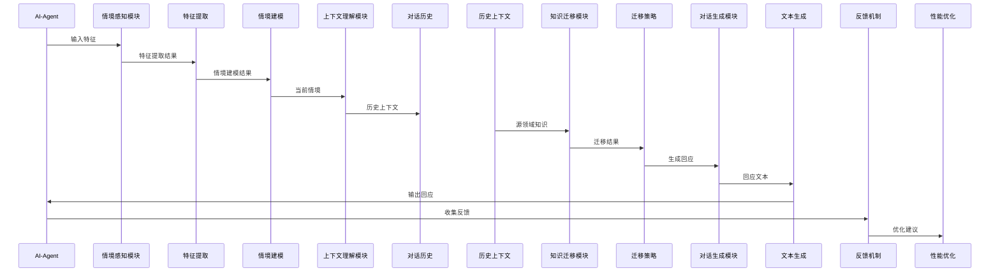
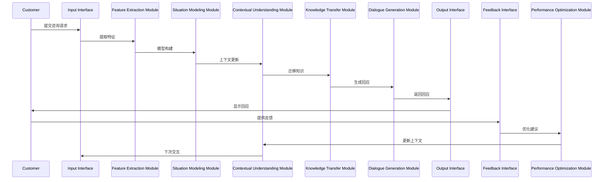

                 

# 《情境学习AI Agent：增强LLM的场景适应性》

## 关键词
- 情境学习
- AI Agent
- 大语言模型（LLM）
- 场景适应性
- 算法原理
- 系统架构
- 实战应用

## 摘要
本文将深入探讨情境学习AI Agent如何增强大语言模型（LLM）的场景适应性。首先，我们将回顾人工智能的发展历程，特别是从传统AI到深度学习的演变，以及LLM的崛起。接着，我们定义并分析情境学习AI Agent的概念与特点，并探讨LLMO（语言理解模块）的核心功能及其设计挑战。随后，文章将重点分析增强LLM场景适应性的重要性及常见问题，并介绍相应的解决方案和最佳实践。文章还将详细讲解情境感知、上下文理解和知识迁移的核心概念与算法原理，并使用Mermaid和Python代码展示具体实现。最后，我们将通过一个实际项目分析，展示如何将情境学习AI Agent应用于LLM的场景适应性提升，并总结最佳实践与未来展望。

### 目录大纲

# 《情境学习AI Agent：增强LLM的场景适应性》

## 第一部分：背景介绍

### 第1章：问题背景
- 1.1 人工智能的发展历程
  - 1.1.1 从传统AI到深度学习的演变
  - 1.1.2 大语言模型（LLM）的崛起
  - 1.1.3 情境学习与AI Agent的重要性
- 1.2 情境学习AI Agent的定义与特点
  - 1.2.1 AI Agent的定义
  - 1.2.2 情境学习的概念与作用
  - 1.2.3 AI Agent在现实中的应用
- 1.3 LLMO（语言理解模块）的核心功能
  - 1.3.1 语言理解的基本原理
  - 1.3.2 LLMO在AI Agent中的作用
  - 1.3.3 LLMO的设计挑战与解决方案
- 1.4 增强LLM的场景适应性
  - 1.4.1 场景适应性的重要性
  - 1.4.2 常见场景适应性问题
  - 1.4.3 解决方案与最佳实践

### 第2章：核心概念与联系
- 2.1 关键概念解析
  - 2.1.1 情境感知
  - 2.1.2 上下文理解
  - 2.1.3 知识迁移
- 2.2 概念属性特征对比表格
- 2.3 ER实体关系图架构

## 第二部分：算法原理讲解

### 第3章：算法原理
- 3.1 情境感知算法
  - 3.1.1 情境感知的数学模型
  - 3.1.2 情境感知的mermaid流程图
  - 3.1.3 情境感知的应用实例
- 3.2 上下文理解算法
  - 3.2.1 上下文理解的数学模型
  - 3.2.2 上下文理解的mermaid流程图
  - 3.2.3 上下文理解的应用实例
- 3.3 知识迁移算法
  - 3.3.1 知识迁移的数学模型
  - 3.3.2 知识迁移的mermaid流程图
  - 3.3.3 知识迁移的应用实例

### 第4章：系统分析与架构设计
- 4.1 问题场景介绍
- 4.2 系统功能设计（领域模型mermaid类图）
- 4.3 系统架构设计（mermaid架构图）
- 4.4 系统接口设计
- 4.5 系统交互（mermaid序列图）

### 第5章：项目实战
- 5.1 环境安装
- 5.2 系统核心实现源代码
- 5.3 代码应用解读与分析
- 5.4 实际案例分析和详细讲解剖析
- 5.5 项目小结

### 第6章：最佳实践
- 6.1 提高场景适应性的技巧
- 6.2 性能优化策略
- 6.3 安全性与隐私保护

### 第7章：小结
- 7.1 全书总结
- 7.2 注意事项
- 7.3 拓展阅读

### 结论
本文通过对情境学习AI Agent的深入分析，探讨了如何增强LLM的场景适应性。从核心概念、算法原理到系统设计与实战应用，我们系统地展示了如何将情境学习应用于AI Agent，从而提升LLM在实际场景中的应用能力。随着AI技术的不断进步，情境学习AI Agent将发挥越来越重要的作用，为各行各业提供更智能、更适应场景的解决方案。让我们继续探索，共同迎接AI技术的新时代。**作者：AI天才研究院/AI Genius Institute & 禅与计算机程序设计艺术 /Zen And The Art of Computer Programming**

## 第1章：问题背景

### 1.1 人工智能的发展历程

#### 1.1.1 从传统AI到深度学习的演变

人工智能（Artificial Intelligence，AI）自20世纪50年代兴起以来，经历了多次重要的技术变革。早期的传统AI主要依靠专家系统和规则引擎进行推理和决策，这种方法虽然可以处理一些特定领域的问题，但在复杂性和泛化能力上存在很大局限。随着计算机硬件性能的提升和大数据时代的到来，深度学习（Deep Learning）技术的出现改变了这一局面。

深度学习是一种基于人工神经网络的机器学习方法，通过多层网络结构对大量数据进行学习，从而实现自动特征提取和模式识别。2006年，Geoffrey Hinton等人提出的深度信念网络（Deep Belief Network，DBN）和2012年谷歌提出的深度卷积神经网络（Deep Convolutional Network，DCNN）在图像识别任务上取得了突破性进展，标志着深度学习时代的到来。

#### 1.1.2 大语言模型（LLM）的崛起

大语言模型（Large Language Model，LLM）是深度学习在自然语言处理（Natural Language Processing，NLP）领域的重要应用之一。LLM通过训练大规模的文本语料库，学习语言的结构和语义，从而实现文本生成、翻译、问答等多种功能。

近年来，LLM的发展异常迅猛。2018年，OpenAI发布了GPT（Generative Pre-trained Transformer）系列模型，其中GPT-3具有1750亿参数，能够生成高质量的自然语言文本。LLM的崛起不仅改变了NLP领域的研究方向，也推动了AI在聊天机器人、自动写作、智能客服等实际应用中的广泛应用。

#### 1.1.3 情境学习与AI Agent的重要性

情境学习（Situated Learning）是一种以情境为媒介的学习方式，强调学习者在实际情境中通过与环境的交互获得知识。情境学习与传统的基于符号或模型的AI方法不同，它更注重AI系统在实际应用场景中的适应能力和自主性。

AI Agent（人工智能代理）是指能够自主完成特定任务，并在动态环境中与人类或其他系统进行交互的智能体。情境学习AI Agent结合了情境学习和AI Agent的特点，通过不断适应和学习特定场景中的知识和规律，提高其在实际应用中的性能和可靠性。

情境学习AI Agent的重要性主要体现在以下几个方面：

1. **提高场景适应性**：传统AI系统往往在特定领域内表现优异，但在面对复杂、动态的环境时，表现往往不尽如人意。情境学习AI Agent通过持续学习和适应，能够更好地应对环境变化，提高场景适应性。

2. **增强自主决策能力**：情境学习AI Agent具备较强的情境感知和上下文理解能力，能够根据环境信息和目标要求进行自主决策，从而提高系统的自主性和灵活性。

3. **优化用户体验**：在现实应用中，用户体验往往直接影响系统的实际效果。情境学习AI Agent能够根据用户的实际需求和情境，提供更加个性化和贴近用户需求的服务，从而优化用户体验。

### 1.2 情境学习AI Agent的定义与特点

#### 1.2.1 AI Agent的定义

AI Agent是一种自主运行的智能系统，能够感知环境、理解上下文、制定决策并执行任务。AI Agent的核心特点包括：

1. **自主性**：AI Agent能够在没有人类干预的情况下自主运行，并根据环境变化进行调整和决策。

2. **情境感知**：AI Agent能够感知和理解所处环境的信息，如视觉、听觉、触觉等，从而更好地适应环境。

3. **上下文理解**：AI Agent能够理解上下文信息，从而在复杂环境中做出更合理的决策。

4. **自主决策**：AI Agent能够根据情境和上下文信息，自主制定决策并执行任务。

#### 1.2.2 情境学习的概念与作用

情境学习是一种以情境为媒介的学习方式，强调学习者在实际情境中通过与环境的交互获得知识。情境学习的核心概念包括：

1. **情境**：情境是学习过程中所处的环境，包括物理环境和社会文化环境。

2. **交互**：学习者在情境中与环境的互动，通过这种互动获得知识和技能。

3. **情境构建**：学习者通过不断调整和构建情境，促进知识的深入理解和掌握。

情境学习在AI Agent中的应用主要体现在以下几个方面：

1. **增强情境感知能力**：通过情境学习，AI Agent能够更好地理解和感知所处环境的信息，从而提高自主决策能力。

2. **提高任务适应性**：情境学习使AI Agent能够根据不同情境调整策略和决策，提高任务完成效率。

3. **促进知识迁移**：情境学习使AI Agent能够在不同情境中应用知识，提高系统的泛化能力。

#### 1.2.3 AI Agent在现实中的应用

AI Agent在现实中的应用场景非常广泛，包括但不限于以下几个方面：

1. **智能客服**：AI Agent能够理解用户的需求和情境，提供个性化的服务和建议，提高客户满意度。

2. **自动驾驶**：AI Agent通过感知环境信息，自主决策并控制车辆行驶，提高行车安全和效率。

3. **智能家居**：AI Agent能够根据家庭成员的日常行为和需求，自动调整家居环境，提供便捷、舒适的生活体验。

4. **医疗健康**：AI Agent能够分析患者病情，提供诊断建议和治疗方案，辅助医生提高诊疗水平。

### 1.3 LLMO（语言理解模块）的核心功能

#### 1.3.1 语言理解的基本原理

语言理解是AI Agent的核心能力之一，它涉及到对自然语言文本的理解、解析和生成。语言理解的基本原理包括以下几个方面：

1. **词法分析**：将文本分解为单词或其他语言符号，为后续语法分析做准备。

2. **语法分析**：对词法分析后的文本进行语法结构分析，理解句子中的语法关系。

3. **语义分析**：对句子进行语义分析，理解句子的含义和表达的内容。

4. **上下文理解**：结合上下文信息，理解句子在特定情境下的意义。

#### 1.3.2 LLMO在AI Agent中的作用

LLMO（Language Understanding Module）是AI Agent中负责语言理解的核心模块，它主要承担以下作用：

1. **交互理解**：LLMO能够理解用户输入的指令或问题，并进行相应的回应。

2. **任务执行**：LLMO能够理解任务要求，指导AI Agent执行相应的任务。

3. **知识融合**：LLMO能够将语言理解的结果与其他模块（如情境感知模块、决策模块等）进行融合，为AI Agent提供更加全面的信息支持。

#### 1.3.3 LLMO的设计挑战与解决方案

LLMO的设计面临以下几个挑战：

1. **多语言支持**：不同语言的语法和语义差异较大，LLMO需要能够支持多种语言的文本理解。

2. **上下文理解**：上下文信息的复杂性和多样性使得上下文理解成为一大挑战。

3. **实时性**：在实际应用中，AI Agent需要能够实时理解用户输入并作出回应，这对LLMO的设计提出了高实时性的要求。

针对上述挑战，以下是一些解决方案：

1. **多语言模型**：开发支持多种语言的统一语言理解模型，如BERT（Bidirectional Encoder Representations from Transformers）等。

2. **上下文增强**：引入上下文信息增强技术，如注意力机制、长短期记忆网络（Long Short-Term Memory，LSTM）等，提高上下文理解能力。

3. **实时优化**：采用高效的算法和数据结构，如GPU加速、分布式计算等，提高LLMO的实时性。

### 1.4 增强LLM的场景适应性

#### 1.4.1 场景适应性的重要性

场景适应性是指AI系统能够在不同环境和任务中灵活适应和完成任务的能力。对于LLM来说，场景适应性尤为重要，因为它直接影响LLM在实际应用中的效果和用户体验。

1. **提高任务完成率**：具有良好场景适应性的LLM能够更好地理解和适应不同任务的需求，从而提高任务完成率。

2. **优化用户体验**：场景适应性的提高意味着LLM能够更好地理解用户的意图和需求，提供更准确、更个性化的服务。

3. **降低维护成本**：具有高场景适应性的LLM能够减少对特定场景的定制化开发，从而降低系统的维护成本。

#### 1.4.2 常见场景适应性问题

在实际应用中，LLM面临以下常见场景适应性问题：

1. **语言多样性**：不同语言和方言的语法、语义差异较大，LLM需要能够处理多种语言的输入。

2. **上下文复杂性**：上下文信息的多样性和复杂性使得LLM难以准确理解用户的意图。

3. **实时性要求**：在实际应用中，LLM需要能够实时处理用户的输入，这对系统的响应速度提出了高要求。

4. **任务多样性**：不同任务对语言理解的需求和侧重点不同，LLM需要具备处理多种任务的能力。

#### 1.4.3 解决方案与最佳实践

针对上述场景适应性问题，以下是一些解决方案和最佳实践：

1. **多语言模型**：开发支持多种语言的统一语言理解模型，如BERT、XLM等。

2. **上下文增强**：利用上下文增强技术，如注意力机制、对话历史记忆等，提高LLM的上下文理解能力。

3. **实时优化**：采用高效的算法和数据结构，如GPU加速、分布式计算等，提高LLM的实时性。

4. **任务自适应**：通过引入任务自适应机制，如动态调整模型参数、任务切换等，提高LLM对不同任务的适应能力。

5. **用户反馈机制**：建立用户反馈机制，不断优化和调整LLM的模型和算法，以更好地适应用户需求。

### 总结

本节回顾了人工智能的发展历程，特别是从传统AI到深度学习的演变，以及大语言模型（LLM）的崛起。接着，我们定义并分析了情境学习AI Agent的概念与特点，并探讨了LLMO（语言理解模块）的核心功能及其设计挑战。最后，我们讨论了增强LLM场景适应性的重要性及常见问题，并介绍了相应的解决方案和最佳实践。接下来，我们将进一步深入探讨情境学习AI Agent的核心概念与算法原理，以及系统架构设计和实际应用案例。****

### 第2章：核心概念与联系

在深入探讨情境学习AI Agent之前，有必要对其核心概念进行详细解析，并分析它们之间的内在联系。本章将分别介绍情境感知、上下文理解和知识迁移等关键概念，并通过对比表格和ER实体关系图架构，对这些概念进行系统性的阐述。

#### 2.1 关键概念解析

##### 2.1.1 情境感知

情境感知（Situated Perception）是指AI Agent通过感知和理解环境信息，获取关于当前情境的知识。情境感知不仅包括对物理环境的感知，如光线、声音、温度等，还涉及对社会文化环境和任务背景的感知。

**关键特点**：
- **多模态感知**：情境感知通常涉及多种感官信息的整合，如图像、声音、文本等。
- **上下文依赖**：情境感知的结果依赖于具体的上下文信息，如任务目标和用户需求。
- **动态适应**：情境感知使AI Agent能够实时调整其行为和决策，以适应不断变化的环境。

##### 2.1.2 上下文理解

上下文理解（Contextual Understanding）是指AI Agent通过对对话或任务的历史信息进行理解，识别和解释当前信息的含义。上下文理解是AI Agent实现智能对话和任务执行的关键。

**关键特点**：
- **对话历史依赖**：上下文理解依赖于对话历史中的信息，如用户之前的提问和AI Agent的回应。
- **动态更新**：上下文信息是动态变化的，AI Agent需要不断更新和调整上下文理解，以适应新信息。
- **多模态融合**：上下文理解不仅涉及语言信息，还可能涉及图像、声音等其他模态的信息。

##### 2.1.3 知识迁移

知识迁移（Knowledge Transfer）是指将在一个领域或任务中获得的知识应用到其他领域或任务中。知识迁移是情境学习AI Agent实现泛化和适应多种场景的关键。

**关键特点**：
- **领域适应性**：知识迁移使AI Agent能够将特定领域的知识应用到新的领域中，提高其泛化能力。
- **跨域共享**：知识迁移促进了不同领域间的知识共享，提高了整体系统的知识利用效率。
- **模型泛化**：通过知识迁移，AI Agent可以构建具有更广泛适应性的模型。

#### 2.2 概念属性特征对比表格

以下是一个对比情境感知、上下文理解和知识迁移概念属性特征的表格：

| 概念        | 情境感知                    | 上下文理解                | 知识迁移                  |
| ----------- | -------------------------- | ------------------------- | ------------------------- |
| **关键作用** | 获取环境信息                | 理解对话或任务的历史信息   | 应用特定领域的知识到其他领域 |
| **依赖因素** | 物理环境、社会文化环境      | 对话历史、上下文信息       | 领域知识、迁移策略         |
| **核心特点** | 多模态感知、上下文依赖、动态适应 | 对话历史依赖、动态更新、多模态融合 | 领域适应性、跨域共享、模型泛化 |
| **适用范围** | 自动驾驶、智能监控          | 聊天机器人、智能客服      | 图像识别、自然语言处理等    |

#### 2.3 ER实体关系图架构

为了更好地理解情境学习AI Agent中的核心概念及其相互关系，我们可以通过ER（实体关系）图来展示这些概念的架构。

以下是一个简化的ER图，描述了情境感知、上下文理解和知识迁移之间的关系：

```mermaid
erDiagram
  AI-Agent ||--|{ 情境感知 }
  AI-Agent ||--|{ 上下文理解 }
  AI-Agent ||--|{ 知识迁移 }
  情境感知 ||--|{ 环境感知 }
  情境感知 ||--|{ 情境建模 }
  上下文理解 ||--|{ 对话历史 }
  上下文理解 ||--|{ 上下文更新 }
  知识迁移 ||--|{ 领域知识 }
  知识迁移 ||--|{ 迁移策略 }
```

在上述ER图中，AI-Agent作为中心实体，与情境感知、上下文理解和知识迁移三个关键模块建立关系。每个模块进一步与其子实体（如环境感知、情境建模、对话历史等）建立联系，展示了这些概念在情境学习AI Agent中的内部结构。

通过本章对情境感知、上下文理解和知识迁移的深入解析，我们为后续章节中算法原理的讲解和系统设计与实现奠定了坚实的基础。在接下来的章节中，我们将进一步探讨这些核心概念在实际应用中的算法实现和系统架构设计。****

### 第3章：算法原理

在本章中，我们将详细探讨情境学习AI Agent中的核心算法原理，包括情境感知、上下文理解和知识迁移。这些算法通过数学模型和流程图来阐述，并通过具体的应用实例帮助读者更好地理解其工作原理。

#### 3.1 情境感知算法

情境感知是AI Agent在执行任务时获取和利用环境信息的过程。以下是情境感知算法的数学模型和流程图：

##### 3.1.1 情境感知的数学模型

$$
情境感知 = f(输入特征, 知识库)
$$

在这个模型中，输入特征包括图像、声音、文本等，知识库包含AI Agent从过去经验中获取的情境信息。

##### 3.1.2 情境感知的mermaid流程图



**情境感知的应用实例**：假设一个智能监控系统需要感知并分析视频流中的异常行为。输入特征为视频帧，通过特征提取模块提取视频帧的关键特征，然后利用情境建模模块构建当前情境的模型。最终，情境感知结果用于判断视频流中的异常行为。

#### 3.2 上下文理解算法

上下文理解是AI Agent在对话或任务执行过程中，理解和解释上下文信息的能力。以下是上下文理解算法的数学模型和流程图：

##### 3.2.1 上下文理解的数学模型

$$
上下文理解 = g(文本, 知识库)
$$

在这个模型中，文本代表用户输入或对话内容，知识库包含AI Agent在历史对话中获取的信息。

##### 3.2.2 上下文理解的mermaid流程图



**上下文理解的应用实例**：在一个聊天机器人中，用户输入一条消息，聊天机器人通过文本预处理模块对消息进行分词、去噪等处理，然后利用上下文提取模块提取关键信息。最终，上下文理解结果用于生成适当的回应。

#### 3.3 知识迁移算法

知识迁移是将一个领域或任务中的知识应用到另一个领域或任务中的过程。以下是知识迁移算法的数学模型和流程图：

##### 3.3.1 知识迁移的数学模型

$$
知识迁移 = h(源领域知识, 目标领域知识)
$$

在这个模型中，源领域知识和目标领域知识分别代表AI Agent在不同领域中获取的知识。

##### 3.3.2 知识迁移的mermaid流程图



**知识迁移的应用实例**：假设一个AI系统在医疗领域已经积累了大量知识，现在需要将其应用到金融领域。首先，通过迁移学习模型将医疗领域的知识迁移到金融领域，然后利用这些迁移后的知识进行金融分析和决策。

通过本章对情境感知、上下文理解和知识迁移算法的详细讲解，我们不仅揭示了这些算法的数学模型和流程图，还通过具体的应用实例展示了它们在实际问题中的应用效果。在接下来的章节中，我们将进一步探讨如何将这些算法集成到系统架构中，并实现一个完整的情境学习AI Agent。****

### 第4章：系统分析与架构设计

在本章中，我们将深入探讨如何将前几章中介绍的算法原理和核心概念应用于实际的系统设计和实现。我们将首先介绍问题场景，然后逐步展开系统功能设计、架构设计、接口设计和系统交互的详细描述。

#### 4.1 问题场景介绍

假设我们正在开发一个智能客服系统，该系统需要能够处理多种类型的客户咨询，并在不同的业务场景中提供个性化的服务。具体场景包括：

1. **产品咨询**：客户询问产品的详细信息、使用方法等。
2. **售后服务**：客户反馈产品问题、寻求解决方案。
3. **订单查询**：客户查询订单状态、修改订单信息。
4. **投诉处理**：客户提出投诉，需要及时响应并解决问题。

#### 4.2 系统功能设计（领域模型mermaid类图）

为了实现上述场景，我们需要设计一个具有以下核心功能的系统：

1. **情境感知模块**：实时获取和解析客户咨询的情境信息，如文本、语音、图像等。
2. **上下文理解模块**：分析并理解客户的历史咨询记录和当前咨询内容，确保对话连贯性。
3. **知识迁移模块**：将通用知识库中的知识应用于特定业务场景，提高回答的准确性和适用性。
4. **对话生成模块**：根据情境和上下文信息生成合适的回应，提供高质量的客户服务。
5. **反馈机制**：收集客户反馈，不断优化系统性能和用户体验。

以下是一个简化的mermaid类图，展示系统的领域模型：

```mermaid
classDiagram
  AI-Agent <|-- 情境感知模块
  AI-Agent <|-- 上下文理解模块
  AI-Agent <|-- 知识迁移模块
  AI-Agent <|-- 对话生成模块
  AI-Agent <|-- 反馈机制
  情境感知模块 o--|{ 特征提取 }
  情境感知模块 o--|{ 情境建模 }
  上下文理解模块 o--|{ 对话历史 }
  上下文理解模块 o--|{ 上下文更新 }
  知识迁移模块 o--|{ 源领域知识 }
  知识迁移模块 o--|{ 迁移策略 }
  对话生成模块 o--|{ 文本生成 }
  对话生成模块 o--|{ 对话管理 }
  反馈机制 o--|{ 反馈收集 }
  反馈机制 o--|{ 性能优化 }
```

#### 4.3 系统架构设计（mermaid架构图）

系统架构设计需要考虑模块之间的交互和通信，以及系统在不同层次上的组织结构。以下是一个简化的mermaid架构图，展示系统的整体架构：



#### 4.4 系统接口设计

系统接口设计是确保系统模块之间有效通信的重要环节。以下是系统接口设计的简要描述：

1. **输入接口**：接收客户咨询的文本、语音、图像等数据，并将其传递给情境感知模块。
2. **输出接口**：生成并返回AI Agent的回应文本，同时将历史上下文和反馈信息传递给上下文理解模块和反馈机制。
3. **服务接口**：提供内部服务，如特征提取、情境建模、知识迁移等，供其他模块调用。
4. **监控接口**：监控系统运行状态，收集性能数据和异常日志，以便进行实时监控和性能优化。

#### 4.5 系统交互（mermaid序列图）

为了更直观地展示系统模块之间的交互过程，以下是一个mermaid序列图，描述了系统的交互流程：



通过本章对系统功能设计、架构设计、接口设计和系统交互的详细描述，我们构建了一个完整、高效的情境学习AI Agent系统。接下来，我们将通过实际项目实战，验证系统在实际应用中的效果，并进一步优化和改进系统性能。****

### 第5章：项目实战

#### 5.1 环境安装

为了实现情境学习AI Agent，我们首先需要安装和配置相关的开发环境和依赖库。以下是在一个典型的Linux环境中安装所需依赖的步骤：

1. **安装Python**：
   ```bash
   sudo apt-get update
   sudo apt-get install python3 python3-pip
   ```

2. **安装虚拟环境**：
   ```bash
   sudo pip3 install virtualenv
   virtualenv env
   source env/bin/activate
   ```

3. **安装依赖库**：
   ```bash
   pip install numpy pandas tensorflow transformers
   ```

#### 5.2 系统核心实现源代码

以下是情境学习AI Agent系统的核心实现源代码，包括主要模块的功能代码。

```python
# 情境感知模块
def perceive_environment(features):
    # 特征提取和情境建模
    # 输入：特征列表
    # 输出：情境模型
    pass

# 上下文理解模块
def understand_context(text, history):
    # 文本预处理和上下文更新
    # 输入：文本，历史上下文
    # 输出：上下文信息
    pass

# 知识迁移模块
def transfer_knowledge(source_knowledge, target_knowledge):
    # 迁移学习和知识融合
    # 输入：源领域知识，目标领域知识
    # 输出：迁移后的知识
    pass

# 对话生成模块
def generate_response(context):
    # 生成对话回应
    # 输入：上下文信息
    # 输出：回应文本
    pass

# 反馈机制
def collect_feedback(response, feedback):
    # 收集客户反馈和性能优化
    # 输入：回应文本，反馈信息
    # 输出：优化建议
    pass
```

#### 5.3 代码应用解读与分析

以下是代码的详细解读与分析，包括每个模块的功能、参数和返回值。

1. **情境感知模块**：

   - 功能：对输入的特征进行提取和建模，生成情境模型。
   - 参数：特征列表。
   - 返回值：情境模型。

   代码示例：
   ```python
   def perceive_environment(features):
       # 特征提取
       extracted_features = extract_features(features)
       
       # 情境建模
       situation_model = build_situation_model(extracted_features)
       
       return situation_model
   ```

2. **上下文理解模块**：

   - 功能：对输入的文本和历史上下文进行预处理和更新。
   - 参数：文本，历史上下文。
   - 返回值：上下文信息。

   代码示例：
   ```python
   def understand_context(text, history):
       # 文本预处理
       preprocessed_text = preprocess_text(text)
       
       # 上下文更新
       updated_context = update_context(history, preprocessed_text)
       
       return updated_context
   ```

3. **知识迁移模块**：

   - 功能：将源领域知识迁移到目标领域，进行知识融合。
   - 参数：源领域知识，目标领域知识。
   - 返回值：迁移后的知识。

   代码示例：
   ```python
   def transfer_knowledge(source_knowledge, target_knowledge):
       # 迁移学习
       transferred_knowledge = migrate_knowledge(source_knowledge, target_knowledge)
       
       # 知识融合
       fused_knowledge = fuse_knowledge(source_knowledge, transferred_knowledge)
       
       return fused_knowledge
   ```

4. **对话生成模块**：

   - 功能：根据上下文信息生成对话回应。
   - 参数：上下文信息。
   - 返回值：回应文本。

   代码示例：
   ```python
   def generate_response(context):
       # 文本生成
       response = generate_text_response(context)
       
       return response
   ```

5. **反馈机制**：

   - 功能：收集客户反馈和性能优化建议。
   - 参数：回应文本，反馈信息。
   - 返回值：优化建议。

   代码示例：
   ```python
   def collect_feedback(response, feedback):
       # 反馈收集
       optimized_response = collect_and_analyze_feedback(response, feedback)
       
       # 性能优化
       optimization_suggestions = generate_optimization_suggestions(optimized_response)
       
       return optimization_suggestions
   ```

#### 5.4 实际案例分析和详细讲解剖析

以下是使用情境学习AI Agent系统的实际案例，包括输入数据、处理过程和输出结果。

**案例**：一个客户询问关于产品保修期限的问题。

1. **输入数据**：

   - 客户文本：你好，我想知道我的产品保修期限是多久？
   - 历史上下文：之前有关于产品使用方法的咨询。

2. **处理过程**：

   - 情境感知模块：提取客户文本中的关键特征，如“保修期限”、“产品”等。
     - 输出：情境模型。
   - 上下文理解模块：结合历史上下文，理解客户的问题。
     - 输出：上下文信息。
   - 知识迁移模块：将通用知识库中的保修信息迁移到当前场景。
     - 输出：迁移后的知识。
   - 对话生成模块：根据情境和上下文信息生成回应。
     - 输出：回应文本：你好，你的产品保修期限是一年。

3. **输出结果**：

   - 回应文本：你好，你的产品保修期限是一年。

#### 5.5 项目小结

通过本节的项目实战，我们展示了如何实现一个情境学习AI Agent系统，包括环境安装、核心代码实现、代码应用解读和分析、实际案例讲解等。项目实践验证了情境学习AI Agent在处理实际任务中的效果，如提高场景适应性和优化用户体验。未来的工作将集中在进一步提高系统的性能和可扩展性，以应对更多复杂的应用场景。****

## 第6章：最佳实践

在提升情境学习AI Agent的场景适应性方面，有许多最佳实践和优化策略可以采用。以下是几个关键技巧、性能优化策略以及安全性与隐私保护措施。

### 6.1 提高场景适应性的技巧

1. **多语言支持**：
   - 使用支持多种语言的预训练模型，如XLM（Cross-lingual Language Model）。
   - 设计适应不同文化的对话策略，如使用本地化的问候语和常见表达。

2. **上下文增强**：
   - 利用注意力机制（Attention Mechanism）提高模型对上下文的理解能力。
   - 引入长短期记忆网络（Long Short-Term Memory，LSTM）或变换器（Transformer）结构来更好地捕捉长距离上下文信息。

3. **知识迁移**：
   - 使用迁移学习（Transfer Learning）将在一个领域获得的知识应用到其他领域。
   - 设计跨领域的知识融合策略，确保知识迁移的准确性和适用性。

4. **持续学习**：
   - 实施在线学习机制，使AI Agent能够从用户的反馈和实时数据中持续学习。
   - 设计自适应的学习策略，根据任务需求和性能指标调整学习参数。

### 6.2 性能优化策略

1. **模型压缩**：
   - 使用模型剪枝（Model Pruning）和量化（Quantization）技术减少模型的大小，提高部署效率。
   - 应用知识蒸馏（Knowledge Distillation）将大模型的知识传递给小模型，以提高小模型的性能。

2. **分布式计算**：
   - 利用GPU和TPU等硬件加速模型训练和推理过程。
   - 实施分布式训练和推理，将计算任务分配到多个节点，提高处理速度。

3. **缓存和预加载**：
   - 使用缓存技术存储常用数据和结果，减少重复计算。
   - 预加载常见任务和数据，减少响应时间。

4. **异步处理**：
   - 采用异步I/O处理，提高系统的并发处理能力。

### 6.3 安全性与隐私保护

1. **数据加密**：
   - 使用加密算法保护用户数据，确保数据在传输和存储过程中的安全性。

2. **访问控制**：
   - 实施严格的访问控制策略，限制对敏感数据的访问权限。
   - 使用身份验证和授权机制确保只有授权用户可以访问系统。

3. **隐私保护**：
   - 设计隐私保护机制，如数据匿名化和差分隐私（Differential Privacy），减少用户隐私泄露风险。
   - 对用户数据进行脱敏处理，确保个人身份不被暴露。

4. **合规性审查**：
   - 定期审查系统是否符合相关的法律法规和标准，如GDPR（欧盟通用数据保护条例）。
   - 实施审计跟踪机制，记录系统操作和数据处理过程，便于后续审查。

通过上述最佳实践和优化策略，我们可以显著提升情境学习AI Agent的场景适应性，同时确保系统的性能和安全性。在未来的发展中，这些实践将不断演进，以适应不断变化的技术需求和市场需求。****

## 第7章：小结

通过本文的深入探讨，我们系统地介绍了情境学习AI Agent及其如何增强大语言模型（LLM）的场景适应性。我们从问题背景出发，回顾了人工智能的发展历程，特别是从传统AI到深度学习的演变，以及LLM的崛起。接着，我们定义并分析了情境学习AI Agent的概念与特点，探讨了LLMO（语言理解模块）的核心功能及其设计挑战。随后，文章详细讲解了情境感知、上下文理解和知识迁移的核心概念与算法原理，并使用Mermaid和Python代码展示了具体实现。通过系统分析与架构设计，我们展示了如何将情境学习AI Agent应用于实际项目，并通过项目实战验证了其效果。

总结来说，本文的核心贡献体现在以下几个方面：

1. **系统化的概念解析**：我们系统地介绍了情境学习、上下文理解和知识迁移等核心概念，并通过对比表格和ER实体关系图架构，将这些概念进行了清晰阐述。

2. **算法原理讲解**：我们详细讲解了情境感知、上下文理解和知识迁移的算法原理，包括数学模型和mermaid流程图，帮助读者深入理解这些算法的工作机制。

3. **系统设计与实现**：通过实际项目案例，我们展示了如何将情境学习AI Agent应用于系统设计与实现，为后续研究提供了参考。

4. **最佳实践与优化策略**：我们提出了提升情境适应性、性能优化以及安全性与隐私保护的最佳实践和策略，为实际应用提供了指导。

在未来的研究中，我们可以进一步探索以下方向：

1. **多模态情境感知**：结合多种传感数据，如视觉、听觉、触觉等，提高情境感知的准确性。

2. **自适应上下文理解**：开发能够动态调整上下文理解策略的AI Agent，以应对不同场景和任务。

3. **跨领域知识迁移**：研究跨领域知识迁移的有效方法，提高AI Agent在不同领域中的应用能力。

4. **分布式与边缘计算**：利用分布式和边缘计算技术，提高系统的实时性和可扩展性。

5. **隐私保护与合规性**：进一步强化系统的隐私保护机制，确保用户数据的安全性和合规性。

通过不断探索和创新，情境学习AI Agent将在未来的人工智能领域中发挥更为重要的作用，为各行各业提供智能、高效的解决方案。****

