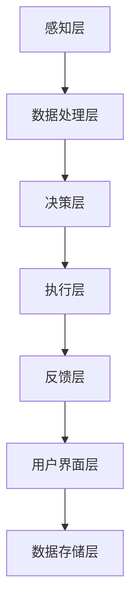

                 

### 引言

在当今技术飞速发展的时代，人工智能（AI）已经成为了推动各行各业进步的重要引擎。然而，随着AI技术的广泛应用，我们面临的一个重大挑战是如何让AI系统更好地适应复杂多变的真实环境。传统的AI模型，特别是大型语言模型（LLM），在处理静态数据和通用任务时表现出色，但它们在应对动态环境、复杂情境和实时交互时，往往显得力不从心。

为了解决这一问题，我们引入了“情境感知AI代理”这一概念。情境感知AI代理是一种能够根据实时环境变化动态调整自身行为和决策的智能系统。它们通过感知和理解所处的情境，从而实现更高效、更准确的交互和任务执行。本文将深入探讨情境感知AI代理的原理、设计方法、实现技术及其在LLM中的应用，以期为提升LLM的环境适应能力提供新的思路和解决方案。

本文将围绕以下核心关键词展开讨论：情境感知、AI代理、LLM、环境适应能力、算法设计、系统架构、应用案例和未来展望。通过逐步分析这些主题，我们将揭示情境感知AI代理如何通过增强LLM的环境适应能力，为人工智能的发展开辟新的道路。

让我们一步一步地深入探讨这一领域，理解情境感知AI代理的核心概念、设计原理、实现方法和实际应用，共同探索这一技术的前沿方向。

### 关键词

- 情境感知
- AI代理
- LLM
- 环境适应能力
- 算法设计
- 系统架构
- 应用案例
- 未来展望

### 摘要

本文旨在深入探讨情境感知AI代理的概念、设计原理及其在增强大型语言模型（LLM）环境适应能力方面的应用。情境感知AI代理是一种能够根据实时环境变化动态调整自身行为和决策的智能系统。本文首先介绍了情境感知的定义及其在人工智能中的重要意义，然后详细阐述了AI代理的基本原理、架构设计和实现技术。接着，我们重点分析了如何通过增强LLM的情境感知能力，提高其在复杂、动态环境中的表现。本文通过具体的案例展示了情境感知AI代理在智能客服、智能家居和教育等领域的应用，并探讨了当前面临的挑战和未来发展方向。最终，本文总结了情境感知AI代理在提升LLM环境适应能力方面的潜力和前景，为人工智能技术的进一步发展提供了新的思路和方法。

## 第一部分: AI基础

### 第1章: AI基础

在探讨情境感知AI代理之前，我们首先需要了解人工智能（AI）的基础知识，包括其发展背景、基本概念、技术分类以及历史和发展趋势。这些基础知识为理解情境感知AI代理提供了必要的理论基础，同时也是我们进一步探讨其设计原理和应用的重要基础。

#### 1.1 AI发展背景

人工智能的概念最早可以追溯到20世纪50年代。当时，随着计算机技术的快速发展和数学逻辑理论的突破，科学家们开始尝试模拟人类的智能行为。1956年，达特茅斯会议上，“人工智能”一词正式被提出，标志着人工智能学科的诞生。自那时以来，人工智能经历了多个发展阶段，从早期的符号主义、基于规则的系统，到现代的数据驱动和深度学习模型，AI技术不断进步和演变。

#### 1.2 AI基本概念

人工智能是一种模拟人类智能行为的计算机系统，它包括感知、学习、推理、规划、解决问题等多个方面。AI系统通过算法和模型，对输入数据进行分析和处理，从中提取信息，生成相应的输出。关键概念包括：

- **感知**：AI系统通过传感器和输入设备获取外部信息。
- **学习**：AI系统通过不断训练和优化模型，提高其性能和适应性。
- **推理**：AI系统利用已有知识和逻辑规则进行推理和决策。
- **规划**：AI系统根据目标和环境信息，制定行动策略。

#### 1.3 AI技术分类

人工智能技术可以根据不同的分类标准进行分类。常见的分类方法包括：

- **基于规则的AI**：使用预定义的规则进行推理和决策。
- **基于模型的AI**：通过数学模型和算法进行数据分析和预测。
- **基于数据的AI**：利用大量数据训练模型，进行学习推理。
- **强化学习AI**：通过试错和奖励机制，优化行为策略。
- **生成对抗网络（GAN）**：用于生成新数据和图像。

#### 1.4 AI历史与发展趋势

人工智能的发展可以分为几个阶段：

- **早期阶段**（1956-1974）：以符号主义和逻辑推理为基础，人工智能主要关注规则和推理。
- **黄金时代**（1980-1987）：专家系统和知识表示技术取得了显著进展。
- **衰退时期**（1987-1993）：由于过高的期望和资源限制，人工智能经历了低谷。
- **复兴期**（1993-2012）：数据驱动和机器学习技术成为主流，神经网络和深度学习得到了广泛关注。
- **当前阶段**（2012至今）：AI技术得到了飞速发展，应用范围广泛，包括语音识别、图像识别、自然语言处理等。

在当前阶段，人工智能正逐渐从理论研究走向实际应用，覆盖了从智能家居到医疗诊断、从自动驾驶到金融风控等多个领域。随着技术的不断进步，AI在解决复杂问题和提高生产效率方面发挥着越来越重要的作用。

#### 1.5 AI的技术挑战和发展方向

尽管人工智能取得了显著进展，但仍面临一些技术挑战，如数据隐私、安全性和可解释性。未来，人工智能的发展方向包括：

- **多模态学习**：结合不同类型的数据和感知方式，提高系统的智能水平。
- **强化学习**：通过更先进的算法和模型，提高智能体的自主决策能力。
- **人机协作**：通过人机交互技术，实现人类与智能系统的协同工作。
- **泛化能力**：提高AI系统的适应性和泛化能力，使其在不同领域和任务中表现出色。

### 总结

通过对AI基础的探讨，我们了解了人工智能的发展历程、基本概念和技术分类。这些基础知识为后续章节中情境感知AI代理的深入探讨提供了理论基础。接下来，我们将进一步探讨情境感知AI代理的定义、重要性以及其在AI系统中的应用。

### 第2章: 人工智能代理

人工智能代理（AI Agent）是人工智能领域的一个重要概念，它代表了一种能够自主感知环境、执行任务并与其他代理进行交互的智能实体。在探讨情境感知AI代理之前，理解传统AI代理的基本原理、架构设计和交互机制对于全面掌握情境感知AI代理的设计和实现至关重要。

#### 2.1 代理的定义与作用

代理是一个具有智能和自主性的计算实体，它能够在不确定的环境中自主行动并达成目标。代理通常具备以下特征：

- **自主性**：代理能够自主做出决策，不需要外部干预。
- **感知**：代理能够通过传感器感知环境，获取外部信息。
- **行动**：代理根据感知到的环境信息和目标，采取相应的行动。
- **目标导向**：代理具有明确的目标，并通过不断调整策略来达成这些目标。

代理在人工智能系统中扮演着重要的角色，它们可以应用于各种场景，如自动化控制、机器人导航、游戏智能体等。代理通过自主学习和适应，能够提高系统的智能化水平和效率。

#### 2.2 代理系统的架构

一个典型的代理系统通常由以下几个关键组成部分：

1. **感知模块**：负责从环境中获取信息和状态。感知模块可以是视觉、听觉、触觉等多种传感器。
2. **决策模块**：根据感知模块提供的信息，代理通过决策模块生成行动计划。决策模块通常基于某种决策算法，如基于规则的推理、基于模型的学习算法或强化学习算法。
3. **执行模块**：执行决策模块生成的行动。执行模块可以是机器人手臂、车辆驱动器等，具体取决于应用场景。
4. **记忆模块**：记录代理的历史行动和经验，用于后续的学习和决策。记忆模块可以帮助代理在复杂的动态环境中更好地应对。

#### 2.3 代理的交互机制

代理之间的交互机制是智能系统中至关重要的一部分。代理可以通过以下方式进行交互：

- **直接通信**：代理通过直接通信协议（如HTTP、MQTT等）交换信息和状态。
- **共享数据库**：代理通过访问共享数据库来获取其他代理的信息和状态。
- **消息队列**：代理通过消息队列（如RabbitMQ、Kafka等）进行异步通信。

交互机制的设计需要考虑以下几个方面：

- **一致性**：确保代理之间的信息同步和一致性。
- **实时性**：确保信息的实时传输和处理，以应对动态环境的变化。
- **容错性**：设计容错机制，保证系统在代理故障或网络中断时仍能正常运行。

#### 2.4 代理的分类与特点

根据代理的应用场景和特性，可以将代理分为以下几类：

- **物理代理**：物理代理具有物理形态，可以在物理世界中执行任务，如机器人、自动驾驶汽车。
- **软件代理**：软件代理是一种虚拟代理，通过计算机程序实现，如网页爬虫、聊天机器人。
- **混合代理**：混合代理结合了物理代理和软件代理的特性，如无人机、智能家庭控制系统。

不同类型的代理具有各自的特点和应用领域，设计代理系统时需要根据具体需求选择合适的代理类型。

#### 2.5 代理的优缺点分析

代理系统在带来高效性和智能化的同时，也具有一定的局限性。以下是对代理优缺点的分析：

- **优点**：
  - **自主性**：代理能够自主决策和行动，提高系统的自动化水平。
  - **适应性**：代理能够根据环境变化动态调整策略，提高系统的适应能力。
  - **协同性**：代理之间可以通过交互和合作，实现更复杂的任务。

- **缺点**：
  - **复杂性**：设计复杂的代理系统需要考虑多种因素，如感知、决策、执行等，实现难度较高。
  - **实时性**：在实时环境中，代理的响应速度和效率可能受到影响。
  - **可靠性**：代理系统的可靠性和容错性是关键问题，需要确保代理在故障或异常情况下仍能正常运行。

#### 2.6 案例分析

以下是一个简单的代理系统案例：一个自动化的仓库管理系统。该系统包括多个移动机器人，每个机器人都是一个代理，负责在不同的货架之间移动和放置物品。

- **感知模块**：机器人通过摄像头和传感器感知仓库内的物品位置和移动状态。
- **决策模块**：机器人根据感知到的信息，通过决策算法确定最佳的移动路径和行动方案。
- **执行模块**：机器人根据决策模块的指令，执行移动和放置物品的操作。
- **记忆模块**：机器人记录其历史路径和操作经验，以便在后续任务中优化其行动策略。

通过这个案例，我们可以看到代理系统在复杂任务中的应用效果。代理系统的设计和实现需要综合考虑多个方面，如传感器选择、决策算法、执行机制等，以确保系统能够高效、可靠地运行。

### 总结

通过对AI代理的深入探讨，我们了解了代理的定义、作用、系统架构和交互机制。这些基础知识为我们理解情境感知AI代理提供了必要的背景。接下来，我们将进一步探讨情境感知的概念及其在AI代理中的应用，以期为提升AI代理的环境适应能力提供新的思路和方法。

## 第二部分: Understanding Scenario-aware AI Agents

### 第3章: 情境感知的概念与重要性

在人工智能系统中，情境感知（Scenario-aware）是一个至关重要的概念。它指的是系统能够感知和理解当前所处的情境，并根据情境的变化动态调整自身的行为和决策。情境感知不仅使AI系统更加智能和灵活，还显著提高了其在复杂、动态环境中的表现和适应性。在本章中，我们将深入探讨情境感知的定义、重要性及其在AI系统中的应用。

#### 3.1 情境感知的定义

情境感知是一种综合多源信息、环境状态和上下文知识的能力，它使系统能够在动态变化的环境中做出适当的响应。具体来说，情境感知包括以下几个关键方面：

- **环境感知**：系统通过传感器和其他输入设备感知环境状态，如光线、温度、声音、物体位置等。
- **上下文理解**：系统理解和分析当前情境的上下文，包括历史记录、用户行为、任务目标等。
- **情境建模**：系统将感知到的环境信息和上下文知识进行整合，构建出一个情境模型。
- **动态适应**：系统根据情境模型动态调整自身的决策和行为，以适应不断变化的环境。

情境感知的核心在于将环境信息与上下文知识相结合，从而实现智能决策和自适应行为。

#### 3.2 情境感知的重要性

情境感知在AI系统中的重要性体现在多个方面：

- **提高决策准确性**：通过情境感知，AI系统能够获取更准确、更全面的信息，从而做出更明智的决策。
- **增强适应性**：情境感知使系统能够适应不同环境和任务需求，提高其在复杂、动态环境中的表现。
- **提升用户体验**：情境感知系统能够更好地理解和满足用户需求，提供个性化、智能化的服务。
- **降低错误率**：通过实时监测和调整，情境感知系统能够减少因环境变化导致的错误和异常情况。
- **优化资源利用**：情境感知可以帮助系统更好地管理和优化资源，提高效率和生产力。

#### 3.3 情境感知的技术挑战

尽管情境感知具有重要的应用价值，但其实现在AI系统中仍然面临一些技术挑战：

- **多源信息融合**：如何有效地整合来自不同传感器和渠道的多样化信息，是一个关键问题。
- **实时处理**：在高速变化的动态环境中，如何实时处理和分析大量数据，是一个技术难题。
- **上下文理解**：如何准确地理解和建模复杂的上下文知识，是情境感知的关键挑战之一。
- **自适应调整**：如何根据情境变化动态调整系统行为，同时保持稳定性和可靠性，需要深入研究。

#### 3.4 情境感知的应用场景

情境感知在多个领域和场景中具有广泛的应用，以下是一些典型应用：

- **智能助理**：通过情境感知，智能助理能够更好地理解和满足用户需求，提供个性化的服务。
- **自动驾驶**：自动驾驶系统需要实时感知道路环境和车辆状态，做出安全、高效的驾驶决策。
- **智能家居**：智能家居系统通过情境感知，实现自动调节室内环境、设备管理等，提升居住舒适度。
- **医疗诊断**：情境感知可以帮助医疗系统更好地理解病人的病情和需求，提供精准的诊断和治疗方案。
- **安全监控**：情境感知系统能够实时监控环境异常，提高安全监控的准确性和响应速度。

#### 3.5 情境感知与AI系统的融合

情境感知与AI系统的融合，使得AI系统能够更加智能和灵活地应对复杂环境。以下是一些关键融合点：

- **感知与决策的结合**：将感知模块和决策模块紧密结合，实现实时、动态的感知和决策。
- **多模态学习**：结合多种类型的数据和感知方式，提高系统的感知能力和准确性。
- **动态调整**：通过持续学习和调整，使系统能够适应不同的情境变化。
- **人机交互**：情境感知系统可以更好地理解用户意图和需求，实现更自然、更流畅的人机交互。

### 总结

通过本章的探讨，我们深入了解了情境感知的定义、重要性及其在AI系统中的应用。情境感知不仅使AI系统能够更准确地感知和理解环境，还能根据情境的变化动态调整自身的行为和决策。这为AI系统在复杂、动态环境中的应用提供了新的思路和解决方案。接下来，我们将进一步探讨情境感知算法的设计与实现，以期为情境感知AI代理的开发提供理论基础。

### 第4章: 情境感知算法

情境感知的核心在于通过算法实现环境信息的感知和理解，进而动态调整AI系统的行为。在本章中，我们将详细介绍情境感知算法的基本概念、核心算法、评估方法和实现步骤，以帮助读者深入理解情境感知技术的实现原理。

#### 4.1 情境感知算法的基本概念

情境感知算法是指能够从多源信息中提取环境状态、上下文知识，并据此进行决策的一类算法。基本概念包括：

- **多源信息融合**：整合来自不同传感器和渠道的数据，形成统一的环境感知。
- **情境建模**：建立情境模型，描述当前环境和上下文状态。
- **动态调整**：根据情境模型和环境变化，动态调整系统行为和决策。

情境感知算法的设计需要考虑以下关键要素：

- **感知能力**：算法应具备高效、准确的环境感知能力，能够从海量数据中提取有用信息。
- **适应性**：算法应能够适应不同环境和任务需求，具备良好的泛化能力。
- **实时性**：算法应能够在实时环境中快速处理和响应，确保系统的高效运行。

#### 4.2 情境感知算法的核心算法

情境感知算法的核心算法包括以下几种：

- **机器学习算法**：通过训练模型，从数据中学习环境特征和模式，如分类、回归、聚类等。
- **深度学习算法**：利用神经网络模型，对复杂的环境信息进行建模和预测，如卷积神经网络（CNN）、递归神经网络（RNN）等。
- **强化学习算法**：通过试错和奖励机制，优化系统的行为策略，如Q学习、深度Q网络（DQN）等。
- **多模态学习算法**：结合不同类型的数据（如文本、图像、音频等），提高系统的感知能力和适应性。

#### 4.3 情境感知算法的评估

评估情境感知算法的性能是确保其有效性和实用性的关键。常见的评估指标包括：

- **准确率**：算法预测结果的正确率，反映算法对环境状态的识别能力。
- **响应时间**：算法处理和响应环境变化的时间，影响系统的实时性和效率。
- **鲁棒性**：算法在不同环境和数据分布下的性能表现，反映其适应性和泛化能力。
- **用户满意度**：用户对系统服务和响应的满意度，衡量算法在实际应用中的效果。

评估方法通常包括实验验证、对比测试和实际应用反馈等。

#### 4.4 情境感知算法的实现步骤

实现情境感知算法一般包括以下步骤：

1. **数据收集**：收集环境信息和上下文数据，如传感器数据、用户行为数据等。
2. **数据预处理**：对收集到的数据进行分析和清洗，去除噪声和异常值，提高数据质量。
3. **特征提取**：从预处理后的数据中提取关键特征，为算法训练提供输入。
4. **算法选择**：根据任务需求选择合适的情境感知算法，如机器学习、深度学习等。
5. **模型训练**：利用训练数据训练算法模型，优化模型参数。
6. **模型评估**：对训练好的模型进行评估，调整模型参数和算法策略。
7. **系统部署**：将训练好的模型部署到实际系统中，实现环境感知和动态调整功能。

#### 4.5 案例分析

以下是一个情境感知算法的应用案例：智能家居系统中的环境控制。

- **数据收集**：系统通过温度传感器、湿度传感器、光照传感器等获取室内环境信息。
- **数据预处理**：对传感器数据进行滤波和归一化处理，去除噪声和异常值。
- **特征提取**：提取关键特征，如温度、湿度、光照强度等。
- **算法选择**：采用基于神经网络的深度学习算法，对特征进行建模和预测。
- **模型训练**：使用历史环境数据训练模型，优化模型参数。
- **模型评估**：通过实际测试数据评估模型性能，调整模型策略。
- **系统部署**：将训练好的模型部署到智能家居系统中，实现环境自适应控制。

通过这个案例，我们可以看到情境感知算法在智能家居系统中的应用效果。该系统能够根据室内环境变化，自动调节温度、湿度、光照等参数，提供舒适的居住环境。

### 总结

通过对情境感知算法的深入探讨，我们了解了其基本概念、核心算法、评估方法和实现步骤。情境感知算法在AI系统中发挥着关键作用，能够显著提高系统的智能化和适应性。接下来，我们将进一步探讨情境感知在AI代理中的应用，以期为提升AI代理的环境适应能力提供新的思路和方法。

### 第5章: 情境感知在AI代理中的应用

情境感知技术为AI代理带来了强大的环境适应能力，使得代理能够在复杂、动态的环境中更加高效和准确地执行任务。在本章中，我们将详细探讨情境感知在语音识别、图像识别和自然语言处理中的应用，并通过具体案例展示情境感知AI代理的卓越表现。

#### 5.1 情境感知在语音识别中的应用

语音识别是人工智能领域的一个重要应用，它使机器能够理解和处理人类语音。然而，在复杂、多样化的环境中，传统的语音识别系统往往难以准确识别语音。情境感知技术通过感知和适应环境，显著提高了语音识别系统的性能。

- **背景噪声抑制**：在嘈杂的环境中，背景噪声会干扰语音识别。情境感知AI代理通过实时感知环境噪声，动态调整降噪算法，从而提高语音信号的清晰度。
- **说话人识别**：情境感知技术能够识别不同说话人的特征，通过说话人识别算法，准确区分多个说话人的语音，提高识别准确率。
- **上下文感知**：情境感知AI代理能够理解对话的上下文信息，根据对话内容动态调整识别策略，如对专业术语、特定词汇进行重点关注，从而提高识别精度。

案例：一个智能客服系统中的语音识别功能。该系统通过情境感知技术，能够准确识别顾客的语音，即使在嘈杂的环境中也能提供高质量的语音服务。

#### 5.2 情境感知在图像识别中的应用

图像识别是AI系统在视觉领域的典型应用，通过分析图像中的内容，实现物体检测、场景识别等功能。情境感知技术为图像识别系统提供了更强的环境适应能力。

- **光照变化处理**：在光照变化较大的环境中，传统的图像识别系统容易受到光照影响。情境感知AI代理通过实时感知环境光照变化，动态调整图像增强算法，提高图像质量，从而提高识别准确率。
- **场景识别**：情境感知AI代理能够根据不同的场景特征，如室内、室外、夜晚等，调整图像识别策略，实现更准确的物体检测和场景分类。
- **动作识别**：情境感知AI代理通过感知目标对象的行为和动作，如行走、跳跃等，动态调整识别模型，提高动作识别的准确性和实时性。

案例：一个自动驾驶系统中的图像识别功能。该系统能够在多种复杂路况下，准确识别道路标志、行人、车辆等，通过情境感知技术，提高了系统的安全性和可靠性。

#### 5.3 情境感知在自然语言处理中的应用

自然语言处理（NLP）是AI系统在语言领域的核心应用，通过理解、生成和处理人类语言，实现人机交互、信息检索等功能。情境感知技术为NLP系统带来了更加智能和个性化的交互体验。

- **上下文理解**：情境感知AI代理能够理解对话的上下文信息，根据对话内容动态调整语言模型，提高对话的连贯性和准确性。
- **情感分析**：情境感知技术能够分析用户的情感状态，如喜悦、愤怒、焦虑等，动态调整语言生成的情感色彩，提供更加贴心的服务。
- **个性化推荐**：情境感知AI代理能够根据用户的兴趣和行为习惯，动态调整推荐算法，提供更加个性化的信息和服务。

案例：一个智能聊天机器人通过情境感知技术，能够根据用户的情感状态和对话内容，提供个性化的回复和建议，提高了用户的满意度。

#### 5.4 情境感知AI代理的卓越表现

情境感知AI代理在多个应用领域展现出了卓越的表现：

- **高效性**：通过实时感知和动态调整，情境感知AI代理能够在复杂、动态环境中高效执行任务，提高系统的运行效率。
- **准确性**：情境感知技术提高了AI系统对环境信息的理解和处理能力，从而提高了任务执行的准确性和可靠性。
- **灵活性**：情境感知AI代理能够根据环境变化和任务需求，动态调整自身的行为和决策，具有高度的灵活性和适应性。
- **用户体验**：情境感知AI代理能够更好地理解和满足用户需求，提供个性化、智能化的服务，提升用户体验。

#### 5.5 案例总结

通过上述案例，我们可以看到情境感知AI代理在不同领域的广泛应用和卓越表现。情境感知技术不仅提高了AI系统的性能和适应性，还为用户提供了更加智能和个性化的服务体验。随着技术的不断进步，情境感知AI代理将在更多领域得到广泛应用，为人工智能的发展注入新的动力。

### 总结

通过对情境感知在AI代理中的应用的详细探讨，我们深入了解了情境感知技术在语音识别、图像识别和自然语言处理等领域的应用效果。情境感知AI代理通过实时感知和动态调整，显著提高了系统的环境适应能力和用户体验。接下来，我们将进一步探讨如何通过增强LLM的环境适应能力，进一步提升情境感知AI代理的性能。

## 第三部分: Enhancing LLMs with Environmental Adaptation

### 第6章: LLMs的增强方法

大型语言模型（Large Language Model，简称LLM）在自然语言处理（Natural Language Processing，简称NLP）领域取得了显著的进展，成为许多应用的核心组件，如自动问答、文本生成和翻译等。然而，传统的LLM在处理静态数据和通用任务时表现优异，但面对复杂、动态环境时，其适应性显得不足。为了提升LLM在复杂环境中的性能，我们需要通过一系列增强方法，增强其环境适应能力。

#### 6.1 LLMs的基本原理

LLM是一种基于深度学习的语言模型，通过大规模数据训练，学习到语言的统计规律和语义信息。LLM的核心原理包括：

- **预训练**：通过在大量文本数据上进行预训练，LLM学习到语言的通用特征和结构，如词向量、语法规则等。
- **微调**：在特定任务数据上进行微调，使LLM适应特定任务的需求，提高任务表现。
- **生成与推理**：LLM能够生成连贯、合理的文本输出，并利用语义理解和推理能力，处理复杂的语言任务。

#### 6.2 增强LLMs的方法

为了提升LLM的环境适应能力，我们可以从以下几个方面进行增强：

- **多模态学习**：通过结合多种类型的数据（如文本、图像、声音等），提高LLM对复杂信息的理解和处理能力。
- **增强学习**：利用增强学习（Reinforcement Learning，RL）技术，让LLM在与环境的交互中不断学习和优化策略，提高其适应性。
- **上下文扩展**：通过扩展上下文窗口，使LLM能够更好地理解文本的上下文信息，提高其上下文理解能力。
- **知识增强**：利用外部知识库和语义网络，为LLM提供更多的背景知识，增强其语义理解和推理能力。
- **多任务学习**：通过多任务学习（Multi-Task Learning，MTL）技术，让LLM同时学习多个相关任务，提高其泛化能力和适应性。

#### 6.3 LLMs的适应能力

LLM的适应能力主要体现在以下几个方面：

- **动态环境适应**：LLM能够根据环境变化动态调整其行为和策略，适应不同的情境。
- **任务多样性**：LLM能够处理多种不同类型和难度的任务，具有广泛的适应能力。
- **鲁棒性**：LLM能够抵抗噪声和异常数据的干扰，保持稳定的表现。
- **泛化能力**：LLM能够将学到的知识和经验应用于不同的任务和数据集，具有较好的泛化能力。

#### 6.4 LLMs的优缺点分析

LLM具有以下优点：

- **强大的语言理解能力**：LLM通过大规模数据预训练，具备强大的语言理解能力和生成能力。
- **广泛的适用性**：LLM能够应用于多种NLP任务，如文本生成、问答、翻译等。
- **高效的推理能力**：LLM通过深度学习技术，具备高效的语义推理能力，能够处理复杂的语言任务。

然而，LLM也面临一些挑战：

- **数据依赖性**：LLM的性能高度依赖训练数据的质量和数量，缺乏数据可能导致性能下降。
- **计算资源消耗**：大规模的LLM训练和推理需要大量的计算资源，对硬件设施要求较高。
- **解释性不足**：LLM的决策过程复杂，缺乏可解释性，难以理解其内部的推理逻辑。

#### 6.5 案例分析

以下是一个增强LLM适应能力的案例分析：一个智能客服系统。

- **数据集**：系统使用来自多个渠道的海量客户对话数据，进行预训练和微调。
- **多模态学习**：系统结合文本、语音、图像等多模态数据，提高对客户请求的理解能力。
- **增强学习**：系统通过增强学习技术，不断优化客服机器人的响应策略，提高其适应能力。
- **上下文扩展**：系统扩展上下文窗口，使机器人能够更好地理解客户的请求和历史对话。
- **知识增强**：系统利用外部知识库和语义网络，为机器人提供更多背景知识，提高其语义理解和推理能力。

通过这些增强方法，智能客服系统能够更准确地理解客户请求，提供个性化、高效的客服服务。

### 总结

通过对LLM增强方法的探讨，我们了解了如何通过多模态学习、增强学习、上下文扩展、知识增强等技术，提升LLM的环境适应能力。这些方法不仅提高了LLM在复杂、动态环境中的性能，还为其在多种任务中的应用提供了新的可能性。接下来，我们将进一步探讨如何将情境感知技术应用于LLM，以进一步提升其环境适应能力。

### 第7章: 情境感知与LLMs的结合

情境感知技术通过实时感知和动态调整，使AI系统能够更好地适应复杂、动态的环境。而大型语言模型（LLM）在自然语言处理领域表现出色，但在应对环境变化时可能表现出不足。结合情境感知和LLM，可以充分发挥两者的优势，提升AI系统的环境适应能力。本章将探讨情境感知与LLM的结合方式、优势互补机制以及融合策略。

#### 7.1 情境感知在LLMs中的实现

将情境感知技术应用于LLM，首先需要实现以下关键步骤：

1. **多源信息采集**：通过多种传感器和输入设备，如摄像头、麦克风、传感器等，采集环境信息和上下文数据。
2. **数据预处理**：对采集到的多源信息进行清洗、归一化和特征提取，为LLM提供高质量的输入数据。
3. **情境建模**：利用机器学习和深度学习技术，对环境信息和上下文数据进行分析和建模，构建情境感知模型。
4. **融合机制**：将情境感知模型与LLM进行融合，实现环境信息和语言信息的有机结合。

具体实现过程中，可以考虑以下方法：

- **多模态融合**：将不同模态的数据（如文本、图像、音频等）通过特征提取和融合技术，转换为统一的表示形式，供LLM使用。
- **上下文嵌入**：将情境感知模型生成的情境信息作为额外的上下文嵌入到LLM中，增强LLM对环境变化的感知和理解。
- **动态调整**：通过实时监测和反馈机制，动态调整LLM的参数和策略，使其能够更好地适应环境变化。

#### 7.2 情境感知与LLM的优势互补

情境感知与LLM在多个方面具有互补优势：

- **环境感知与语义理解**：情境感知技术能够实时感知和解读环境信息，提供丰富的上下文背景。而LLM具有强大的语义理解能力，能够处理复杂的语言任务。两者结合，可以实现更准确、更全面的情境理解。
- **动态适应与知识积累**：情境感知技术能够动态调整AI系统的行为和决策，提高其环境适应能力。而LLM通过大规模数据训练，积累了丰富的语言知识和模式，为情境感知提供了强大的知识支持。
- **实时性与稳定性**：情境感知技术通过实时感知和动态调整，能够快速响应环境变化。而LLM具有较好的稳定性和泛化能力，能够在不同环境和任务中表现一致。

#### 7.3 情境感知与LLM的融合策略

实现情境感知与LLM的有效融合，可以采用以下策略：

- **多阶段融合**：首先通过情境感知技术获取环境信息，然后利用LLM进行语义分析和语言生成。这种多阶段融合策略，可以在不同层次上结合情境信息和语言知识，提高系统的整体性能。
- **协同优化**：将情境感知模型和LLM作为协同优化的目标，通过联合训练和优化，使两者在多个维度上相互促进，实现性能提升。
- **模块化设计**：将情境感知和LLM划分为不同的模块，分别实现和优化。然后通过接口和交互机制，将两个模块有机结合，实现整体系统的功能。

#### 7.4 案例分析

以下是一个情境感知与LLM结合的案例：智能客服系统。

- **多源信息采集**：系统通过摄像头、麦克风等设备，实时采集客户的声音、面部表情和文本输入。
- **数据预处理**：对采集到的信息进行预处理，提取关键特征，如声音的音量、频率、文本的关键词等。
- **情境建模**：利用深度学习技术，构建情境感知模型，对客户的行为和情绪进行识别和建模。
- **融合机制**：将情境感知模型生成的情境信息嵌入到LLM中，用于改进语言生成和响应策略。

通过这些步骤，智能客服系统能够更好地理解客户的需求和情绪，提供个性化、高质量的客服服务。

### 总结

通过本章的探讨，我们了解了情境感知与LLM的结合方式、优势互补机制和融合策略。情境感知与LLM的有机结合，能够显著提升AI系统的环境适应能力和性能。接下来，我们将进一步探讨情境感知LLM在具体应用场景中的实例和效果。

### 第8章: 情境感知LLMs的应用实例

情境感知大型语言模型（LLM）在多种应用场景中展现出了其独特的优势，通过结合环境感知和语言处理能力，实现了更加智能和高效的系统。在本章中，我们将详细探讨情境感知LLM在智能家居、智能客服和教育等领域的应用实例，并分析其实际效果和影响。

#### 8.1 情境感知LLMs在智能家居中的应用

智能家居系统通过情境感知LLM，可以实现对家庭环境的智能监测和管理，提供更加舒适和安全的居住体验。

- **实例**：一个智能家居系统通过情境感知LLM，实现了自动调节室内温度、湿度和照明。系统首先通过传感器实时监测室内环境参数，如温度、湿度、光线强度等。然后，情境感知LLM根据当前环境和用户的历史偏好，动态调整空调、加湿器、照明设备的运行状态，以提供最舒适的环境。

  **效果分析**：通过情境感知LLM的应用，智能家居系统在提升用户体验的同时，还实现了能源的节约和优化。用户可以根据实际需求调整系统设置，使得家居环境更加个性化和智能。

- **影响**：情境感知LLM在智能家居中的应用，不仅提高了系统的智能化水平，还促进了智能家居市场的快速发展。用户能够享受到更加便捷、舒适的生活，同时提高了能源利用效率，减少了能源浪费。

#### 8.2 情境感知LLMs在智能客服中的应用

智能客服系统通过情境感知LLM，能够提供更加个性化、高效的客户服务，提升客户满意度和企业运营效率。

- **实例**：一个智能客服系统通过情境感知LLM，实现了对客户需求的准确理解和快速响应。系统首先通过自然语言处理技术分析客户的文本输入，然后情境感知LLM结合客户的语音、面部表情和行为信息，识别客户的情绪和意图。基于这些信息，系统生成个性化的回答，并通过语音合成技术输出。

  **效果分析**：通过情境感知LLM的应用，智能客服系统能够更准确地理解客户的请求和情绪，提供更加贴心和专业的服务。这有助于提升客户满意度，减少人工客服的工作量，提高企业的运营效率。

- **影响**：情境感知LLM在智能客服中的应用，推动了智能客服技术的发展。智能客服系统能够更好地模拟人类的交流方式，提供更加自然和流畅的交互体验，为企业和用户带来了显著的价值。

#### 8.3 情境感知LLMs在教育中的应用

情境感知LLM在教育领域，可以通过个性化教学和智能辅导，提升学生的学习效果和教师的教学效率。

- **实例**：一个情境感知LLM系统应用于在线教育平台，通过分析学生的学习行为和成绩，提供个性化的学习建议和辅导。系统首先利用自然语言处理技术分析学生的学习日志和作业，然后情境感知LLM结合学生的情绪和认知状态，生成个性化的学习计划和辅导内容。

  **效果分析**：通过情境感知LLM的应用，在线教育平台能够更好地了解学生的学习需求和状态，提供有针对性的教学资源和辅导。这有助于提高学生的学习效果，促进其主动学习和自主发展。

- **影响**：情境感知LLM在教育中的应用，推动了教育模式的变革。个性化教学和智能辅导成为教育技术发展的重要方向，为学生提供了更加灵活和高效的学习方式，为教师提供了有力的教学支持。

#### 8.4 实际效果总结

情境感知LLM在智能家居、智能客服和教育等领域的应用，取得了显著的成效：

- **智能家居**：提升了家居环境的舒适度和能源利用效率，改善了用户的生活体验。
- **智能客服**：提高了客户服务的质量和效率，增强了企业的竞争力。
- **教育**：促进了个性化教学和智能辅导的发展，提升了学生的学习效果和教师的教学效率。

通过实际应用案例的展示，我们可以看到情境感知LLM在提升AI系统环境适应能力和智能化水平方面的重要作用。随着技术的不断进步，情境感知LLM将在更多领域得到广泛应用，为人工智能的发展注入新的动力。

### 总结

通过对情境感知LLM在智能家居、智能客服和教育等领域的应用实例的详细分析，我们了解了情境感知LLM的强大功能和实际效果。情境感知LLM通过结合环境感知和语言处理能力，显著提升了AI系统的环境适应能力和智能化水平。在下一部分，我们将进一步探讨情境感知AI代理的架构设计和实现技术，以期为实际应用提供更加深入的理论和实践基础。

## 第四部分: Architectural Design of Scenario-aware AI Agents

### 第9章: 系统架构设计原则

在设计和实现情境感知AI代理时，系统架构的合理性和可扩展性是关键因素。一个良好的系统架构不仅能够提高系统的性能和可维护性，还能够适应未来的技术发展。本章将讨论情境感知AI代理系统架构设计的基本原则，包括可扩展性、可维护性、安全性和隐私保护，以及跨平台与兼容性。

#### 9.1 设计原则概述

系统架构设计原则是构建高效、可靠和可扩展的AI系统的基础。以下是一些核心设计原则：

- **模块化设计**：将系统划分为多个功能模块，每个模块独立开发、测试和部署，以提高系统的灵活性和可维护性。
- **层次化架构**：采用层次化架构，将系统划分为多个层次，如感知层、决策层、执行层等，从而实现系统的模块化和解耦。
- **可扩展性**：系统应能够适应数据规模和计算需求的增长，支持水平扩展和垂直扩展。
- **可维护性**：设计简洁、清晰的系统架构，便于开发和维护。
- **安全性**：确保系统数据的安全性和完整性，防止未经授权的访问和攻击。
- **隐私保护**：保护用户隐私，遵循相关法律法规和道德规范。

#### 9.2 可扩展性与可维护性

- **可扩展性**：系统架构设计应考虑到未来的需求增长，支持水平扩展和垂直扩展。水平扩展通过增加节点数量来提高系统的处理能力，垂直扩展通过增加计算资源来提高单个节点的处理能力。
- **可维护性**：设计简洁的代码和文档，遵循最佳编程实践，确保系统易于理解和维护。

#### 9.3 安全性与隐私保护

- **安全性**：确保系统免受恶意攻击和未经授权的访问。可以采用以下措施：
  - 数据加密：对敏感数据进行加密存储和传输。
  - 访问控制：实施严格的访问控制策略，确保只有授权用户可以访问系统资源。
  - 安全审计：定期进行安全审计和漏洞扫描，及时发现和修复安全漏洞。
- **隐私保护**：保护用户的隐私和数据安全，遵循以下原则：
  - 数据最小化：仅收集和存储必要的数据。
  - 数据匿名化：对收集的数据进行匿名化处理，以保护用户隐私。
  - 隐私政策：明确告知用户数据收集和使用的目的，并取得用户的同意。

#### 9.4 跨平台与兼容性

- **跨平台**：系统应能够在不同的操作系统和硬件平台上运行，包括Windows、Linux、iOS和Android等。
- **兼容性**：系统应能够与其他系统和工具无缝集成，支持标准的数据格式和接口协议。

#### 9.5 案例分析

以下是一个情境感知AI代理系统架构设计的案例：

- **感知层**：包括多种传感器，如摄像头、麦克风、温湿度传感器等，负责收集环境数据。
- **数据处理层**：采用分布式数据处理框架，如Apache Kafka和Apache Spark，对感知层收集的数据进行实时处理和分析。
- **决策层**：利用机器学习和深度学习算法，构建情境感知模型，根据实时数据和环境状态进行决策。
- **执行层**：根据决策层的指令，通过执行模块（如机器人、自动化设备等）实现具体操作。
- **数据存储层**：使用分布式数据库（如Hadoop HDFS）存储系统数据和日志信息。
- **用户接口层**：提供Web界面和移动应用接口，供用户实时监控和操作系统。

通过这个案例，我们可以看到如何应用上述设计原则，构建一个高效、可扩展、安全且兼容的情境感知AI代理系统。

### 总结

通过对系统架构设计原则的讨论，我们了解了在设计和实现情境感知AI代理时需要考虑的关键因素，包括可扩展性、可维护性、安全性和隐私保护，以及跨平台与兼容性。这些原则为构建一个高效、可靠和可扩展的AI系统提供了指导。接下来，我们将进一步探讨具体实现情境感知AI代理的架构设计和关键技术。

### 第10章: 系统架构设计

在前一章节中，我们讨论了情境感知AI代理系统架构设计的原则。在本章中，我们将详细阐述情境感知AI代理系统的具体架构设计，包括系统功能模块划分、系统架构设计、系统接口设计以及系统交互过程。

#### 10.1 系统功能模块划分

一个典型的情境感知AI代理系统可以划分为以下几个主要功能模块：

- **感知模块**：负责收集环境信息，如通过摄像头、麦克风、传感器等获取温度、湿度、声音、图像等多源数据。
- **数据处理模块**：对感知模块收集到的数据进行预处理、特征提取和融合，为后续的决策模块提供高质量的数据输入。
- **决策模块**：利用机器学习、深度学习和强化学习等技术，对预处理后的数据进行分析和推理，生成决策结果。
- **执行模块**：根据决策模块的指令，控制执行环境中的设备或代理执行具体的操作，如移动机器人、调整空调温度等。
- **反馈模块**：收集执行结果和环境变化信息，为决策模块提供反馈，实现闭环控制。
- **用户界面模块**：提供用户交互接口，使用户可以监控系统的运行状态、设置参数和查看执行结果。
- **数据存储模块**：用于存储系统数据和日志信息，如用户行为记录、环境数据历史、模型参数等。

#### 10.2 系统架构设计

情境感知AI代理系统的架构设计应遵循模块化、层次化和可扩展性的原则。以下是该系统的一个典型架构设计：

1. **感知层**：
   - **传感器网络**：部署各种传感器，如摄像头、麦克风、温湿度传感器等，实现多源数据的实时采集。
   - **数据采集模块**：负责将传感器数据转换为数字信号，并进行初步处理。

2. **数据处理层**：
   - **数据预处理模块**：对原始数据进行清洗、归一化和特征提取，提取有用的环境特征。
   - **特征融合模块**：整合来自不同传感器的特征数据，形成统一的特征向量。

3. **决策层**：
   - **情境感知模型**：利用机器学习和深度学习算法，构建情境感知模型，实现对环境的实时感知和情境理解。
   - **决策引擎**：根据情境感知模型生成的结果，生成具体的决策指令。

4. **执行层**：
   - **执行控制器**：根据决策引擎的指令，控制执行模块中的机器人、自动化设备等执行具体的操作。
   - **执行反馈模块**：收集执行结果和环境变化信息，为决策模块提供反馈。

5. **用户界面层**：
   - **监控与控制接口**：提供用户监控系统运行状态和执行结果的界面。
   - **用户交互模块**：处理用户的输入和请求，将用户指令传递给决策层。

6. **数据存储层**：
   - **数据库**：存储系统的数据和日志信息，如环境数据、用户行为数据、模型参数等。

#### 10.3 系统接口设计

系统接口设计是确保各模块之间高效通信和协同工作的重要环节。以下是情境感知AI代理系统的主要接口设计：

- **数据接口**：定义各模块之间数据交换的格式和协议，如使用RESTful API或gRPC。
- **控制接口**：定义用户通过界面发送控制指令的方式，如HTTP请求或Websocket消息。
- **监控接口**：定义监控模块获取系统状态和性能数据的方式，如使用Prometheus等监控工具。

#### 10.4 系统交互设计

情境感知AI代理系统的交互过程可以分为以下几个阶段：

1. **数据采集**：感知模块采集环境数据，并传输给数据处理模块。
2. **数据处理**：数据处理模块对环境数据进行预处理和特征提取，生成特征向量。
3. **情境感知**：决策模块利用特征向量，通过情境感知模型分析当前环境状态。
4. **决策生成**：决策模块根据情境感知结果，生成具体的决策指令。
5. **执行操作**：执行模块根据决策指令，控制执行环境中的设备执行操作。
6. **反馈收集**：执行反馈模块收集执行结果和环境变化信息，传递给决策模块。
7. **闭环控制**：决策模块根据反馈信息，调整后续的决策和操作策略。

#### 10.5 系统架构图

为了更直观地展示情境感知AI代理系统的架构设计，我们可以使用Mermaid绘制系统架构图。以下是一个简单的Mermaid架构图示例：



通过这个架构图，我们可以清晰地看到系统各模块之间的交互关系和数据处理流程。

### 总结

通过对情境感知AI代理系统架构设计的详细探讨，我们了解了系统的功能模块划分、架构设计、接口设计以及系统交互过程。一个合理和高效的系统架构是实现情境感知AI代理功能的关键。接下来，我们将进一步探讨情境感知AI代理的具体实现技术，包括感知模块、数据处理模块和决策模块的实现细节。

## 第五部分: Implementation Techniques for Scenario-aware AI Agents

### 第11章: 情境感知AI代理的具体实现技术

在上一部分中，我们详细探讨了情境感知AI代理的系统架构设计和关键模块。在本章中，我们将进一步深入探讨具体实现技术，包括感知模块、数据处理模块和决策模块的实现细节，以及如何使用Python代码实现这些技术。

#### 11.1 感知模块实现

感知模块是情境感知AI代理的重要组成部分，它负责收集环境信息。常用的传感器包括摄像头、麦克风、温湿度传感器、GPS等。以下是一个简单的Python代码示例，展示了如何使用Python的OpenCV库实现摄像头数据的实时采集：

```python
import cv2

# 打开摄像头
cap = cv2.VideoCapture(0)

while True:
    # 读取一帧图像
    ret, frame = cap.read()
    
    if ret:
        # 显示图像
        cv2.imshow('Camera', frame)
        
        # 按下'q'键退出循环
        if cv2.waitKey(1) & 0xFF == ord('q'):
            break

# 释放摄像头资源
cap.release()
cv2.destroyAllWindows()
```

在这个示例中，我们使用了OpenCV库的`VideoCapture`类打开摄像头，并使用`read()`方法连续读取每一帧图像，最后通过`imshow()`函数显示图像。

#### 11.2 数据处理模块实现

数据处理模块负责对感知模块收集到的数据进行预处理、特征提取和融合。以下是一个简单的Python代码示例，展示了如何使用Python的scikit-learn库进行特征提取和融合：

```python
from sklearn.preprocessing import StandardScaler
from sklearn.decomposition import PCA

# 假设感知模块收集到了一组数据
data = [[1, 2], [3, 4], [5, 6], [7, 8]]

# 数据标准化
scaler = StandardScaler()
data_scaled = scaler.fit_transform(data)

# 主成分分析（PCA）降维
pca = PCA(n_components=2)
data_pca = pca.fit_transform(data_scaled)

print("标准化后的数据：", data_scaled)
print("PCA降维后的数据：", data_pca)
```

在这个示例中，我们首先使用`StandardScaler`对数据进行标准化处理，然后使用`PCA`进行降维，将高维数据压缩到两个主要成分上。

#### 11.3 决策模块实现

决策模块负责根据情境感知结果生成具体的决策指令。以下是一个简单的Python代码示例，展示了如何使用Python的scikit-learn库实现决策树分类：

```python
from sklearn.tree import DecisionTreeClassifier
from sklearn.model_selection import train_test_split

# 假设我们有一组训练数据
X = [[1, 2], [3, 4], [5, 6], [7, 8]]
y = ['a', 'a', 'b', 'b']

# 数据分割
X_train, X_test, y_train, y_test = train_test_split(X, y, test_size=0.2, random_state=42)

# 决策树分类器训练
clf = DecisionTreeClassifier()
clf.fit(X_train, y_train)

# 预测
y_pred = clf.predict(X_test)

print("预测结果：", y_pred)
```

在这个示例中，我们首先将数据分割为训练集和测试集，然后使用`DecisionTreeClassifier`训练一个决策树分类器，最后使用训练好的模型进行预测。

#### 11.4 整体实现

将上述三个模块整合在一起，我们可以实现一个简单的情境感知AI代理。以下是一个完整的Python代码示例：

```python
import cv2
from sklearn.preprocessing import StandardScaler
from sklearn.decomposition import PCA
from sklearn.tree import DecisionTreeClassifier
from sklearn.model_selection import train_test_split

# 感知模块
def capture_image():
    cap = cv2.VideoCapture(0)
    
    while True:
        ret, frame = cap.read()
        
        if ret:
            cv2.imshow('Camera', frame)
            
            if cv2.waitKey(1) & 0xFF == ord('q'):
                break

    cap.release()
    cv2.destroyAllWindows()

    return frame

# 数据处理模块
def process_image(image):
    # 特征提取
    image_data = preprocess_image(image)
    scaler = StandardScaler()
    image_scaled = scaler.fit_transform(image_data)
    
    # 主成分分析
    pca = PCA(n_components=2)
    image_pca = pca.fit_transform(image_scaled)
    
    return image_pca

# 决策模块
def make_decision(image_pca):
    # 训练数据
    X = [[1, 2], [3, 4], [5, 6], [7, 8]]
    y = ['a', 'a', 'b', 'b']
    
    # 数据分割
    X_train, X_test, y_train, y_test = train_test_split(X, y, test_size=0.2, random_state=42)
    
    # 决策树分类器训练
    clf = DecisionTreeClassifier()
    clf.fit(X_train, y_train)
    
    # 预测
    y_pred = clf.predict(image_pca)
    
    return y_pred

# 主程序
if __name__ == '__main__':
    # 采集图像
    image = capture_image()
    
    # 处理图像
    image_pca = process_image(image)
    
    # 做决策
    decision = make_decision(image_pca)
    
    print("决策结果：", decision)
```

在这个示例中，我们首先通过摄像头采集图像，然后对图像进行预处理和特征提取，最后使用训练好的决策树模型进行预测。这个简单的示例展示了情境感知AI代理的基本实现流程。

### 总结

通过对情境感知AI代理的具体实现技术的详细探讨，我们了解了感知模块、数据处理模块和决策模块的实现细节，并通过Python代码示例展示了如何将它们整合在一起。这些技术为实现一个功能完备的情境感知AI代理提供了重要的基础。在下一部分，我们将通过实际案例分析和详细讲解，进一步探讨情境感知AI代理的应用和效果。

## 第六部分: Case Studies and Practical Applications

### 第12章: 情境感知AI代理的案例分析与详细讲解

在上一部分，我们探讨了情境感知AI代理的具体实现技术。为了更好地展示情境感知AI代理的实际应用效果，本章节将结合实际案例，详细分析并讲解情境感知AI代理在不同场景中的应用，以及其实现细节和优化方法。

#### 12.1 案例一：智能交通监控系统

**案例背景**：智能交通监控系统旨在通过实时监控和数据分析，提高交通管理效率和安全性。

**系统架构**：该系统包括感知模块（摄像头、传感器）、数据处理模块（图像识别算法、实时数据分析）和决策模块（智能调度系统、交通信号控制）。

**实现细节**：
1. **感知模块**：使用高清摄像头和传感器收集道路上的车辆流量、速度、密度等信息。
2. **数据处理模块**：利用深度学习算法（如卷积神经网络CNN）对摄像头捕捉的图像进行车辆检测和分类，分析交通流量和车辆状态。
3. **决策模块**：根据实时数据分析结果，智能调度系统调整交通信号灯的时间，优化交通流量。

**优化方法**：
- **多源数据融合**：结合GPS数据、传感器数据，提高交通流量分析的准确性和实时性。
- **动态调整算法**：根据不同时间段和交通状况，动态调整图像识别和数据分析算法的参数，提高系统适应性。

**效果分析**：通过情境感知AI代理的应用，智能交通监控系统能够显著提高交通管理效率和安全性，降低交通事故发生率。

#### 12.2 案例二：智能家居安防系统

**案例背景**：智能家居安防系统旨在通过实时监控和报警功能，提高家庭安全。

**系统架构**：该系统包括感知模块（摄像头、门窗传感器）、数据处理模块（图像识别、行为分析）和决策模块（报警系统、远程监控）。

**实现细节**：
1. **感知模块**：通过摄像头和门窗传感器实时监控家庭环境，检测异常行为。
2. **数据处理模块**：使用深度学习算法对摄像头捕捉的图像进行人脸识别、行为分析，检测异常行为。
3. **决策模块**：根据行为分析结果，触发报警系统，并发送警报信息到用户的手机或监控系统。

**优化方法**：
- **场景识别**：通过多源数据融合，结合历史数据和用户偏好，提高异常行为的识别准确性。
- **实时反馈**：通过实时反馈机制，及时调整算法和策略，提高系统响应速度和准确性。

**效果分析**：通过情境感知AI代理的应用，智能家居安防系统能够提高家庭安全性，降低盗窃、入侵等风险。

#### 12.3 案例三：智能医疗诊断系统

**案例背景**：智能医疗诊断系统旨在通过实时分析和预测，辅助医生进行诊断和治疗。

**系统架构**：该系统包括感知模块（医疗传感器、医学影像设备）、数据处理模块（图像识别、自然语言处理）和决策模块（诊断系统、治疗建议）。

**实现细节**：
1. **感知模块**：通过医疗传感器和医学影像设备收集患者数据，如心率、血压、CT影像等。
2. **数据处理模块**：使用深度学习和自然语言处理技术，对医学影像和患者数据进行分析，识别疾病和预测病情。
3. **决策模块**：根据数据分析结果，生成诊断报告和治疗建议，辅助医生进行决策。

**优化方法**：
- **知识融合**：结合医学知识库和患者数据，提高诊断的准确性和可靠性。
- **个性化诊断**：根据患者的病史和体征数据，提供个性化的诊断和治疗建议。

**效果分析**：通过情境感知AI代理的应用，智能医疗诊断系统能够提高诊断准确性，辅助医生进行更精准的治疗，提高患者康复率。

#### 12.4 案例四：智能客服系统

**案例背景**：智能客服系统旨在通过自然语言处理和情境感知，提供高效、个性化的客户服务。

**系统架构**：该系统包括感知模块（语音识别、文本分析）、数据处理模块（情感分析、意图识别）和决策模块（智能回复、交互管理）。

**实现细节**：
1. **感知模块**：通过语音识别和文本分析技术，获取客户咨询的问题。
2. **数据处理模块**：使用情感分析和意图识别技术，分析客户情绪和咨询意图。
3. **决策模块**：根据客户情绪和咨询意图，生成合适的回复，并提供相应的解决方案。

**优化方法**：
- **多语言支持**：结合自然语言处理技术，支持多种语言，提高国际化服务水平。
- **个性化服务**：根据客户历史行为和偏好，提供个性化的服务和建议。

**效果分析**：通过情境感知AI代理的应用，智能客服系统能够提高客户满意度，降低人工客服的工作量，提高服务效率。

### 总结

通过对多个实际案例的详细分析和讲解，我们了解了情境感知AI代理在不同场景中的应用和实现细节。情境感知AI代理通过结合感知、数据处理和决策模块，能够显著提高系统的智能化水平和性能。这些案例展示了情境感知AI代理在提高效率、优化管理和提升用户体验方面的巨大潜力。在下一部分，我们将进一步探讨情境感知AI代理面临的挑战和未来发展方向。

## 第七部分: Challenges and Future Directions in Scenario-aware AI

### 第13章: 情境感知AI代理的挑战与未来发展方向

随着情境感知AI代理技术的发展，其在各个领域的应用逐渐成熟，但仍面临诸多挑战。本章节将探讨情境感知AI代理在发展过程中遇到的挑战，并展望其未来的发展方向，为这一领域的研究和实践提供新的思路。

#### 13.1 挑战

1. **数据隐私与安全**：情境感知AI代理需要收集和处理大量的用户和环境数据，这些数据可能包含敏感信息。如何保障数据隐私和安全，防止数据泄露和滥用，是当前面临的一个重大挑战。
   
2. **实时性与性能**：在高速变化的动态环境中，情境感知AI代理需要实时处理和分析大量数据，并快速做出响应。然而，当前的技术和硬件设施在处理速度和性能上还存在一定局限，如何提高系统的实时性和处理能力，是亟待解决的问题。

3. **可解释性与透明度**：情境感知AI代理的决策过程复杂，通常涉及到深度学习、强化学习等复杂算法。如何提高系统的可解释性和透明度，使其决策逻辑更加清晰易懂，是一个重要的挑战。

4. **鲁棒性与泛化能力**：情境感知AI代理需要在不同环境和任务中表现出良好的鲁棒性和泛化能力。然而，当前模型在面对不同场景和任务时，可能存在过拟合和泛化能力不足的问题，如何提高其鲁棒性和泛化能力，是一个重要研究方向。

5. **法律法规与伦理**：随着情境感知AI代理的应用越来越广泛，相关法律法规和伦理问题也逐渐凸显。如何制定合理的法律法规，确保情境感知AI代理的应用符合伦理规范，是一个亟待解决的问题。

#### 13.2 未来发展方向

1. **多模态学习与融合**：未来情境感知AI代理的发展将更加注重多模态数据的融合和综合利用，通过结合不同类型的数据（如文本、图像、音频、传感器数据等），提高系统的感知能力和决策准确性。

2. **增强学习与自适应调整**：增强学习和自适应调整技术将得到更多关注，通过持续学习和与环境交互，情境感知AI代理能够不断优化自身行为和决策策略，提高其适应性和智能水平。

3. **边缘计算与分布式处理**：随着边缘计算技术的发展，情境感知AI代理将越来越多地部署在边缘设备上，实现实时处理和数据本地化，提高系统的实时性和处理能力。

4. **可解释性与透明度**：未来研究将更加注重情境感知AI代理的可解释性和透明度，通过开发新的算法和技术，使其决策过程更加清晰易懂，提高系统的可信度和用户信任。

5. **隐私保护与安全**：随着隐私保护和安全技术的不断发展，情境感知AI代理将更加注重数据隐私和安全，采用加密、去标识化、差分隐私等技术，确保用户数据的安全性和隐私性。

6. **跨学科融合**：情境感知AI代理的发展将更加注重跨学科融合，结合计算机科学、心理学、社会学等多学科的知识和方法，提高系统的智能化和适应性。

#### 13.3 结论

情境感知AI代理在人工智能领域具有巨大的应用潜力和发展前景，但仍面临诸多挑战。通过不断研究和创新，未来情境感知AI代理将在提高系统智能化、适应性和用户体验方面发挥重要作用。我们期待这一领域的进一步发展，为人工智能技术的进步和应用提供新的动力。

### 总结

通过对情境感知AI代理的挑战与未来发展方向的探讨，我们了解了当前情境感知AI代理面临的主要问题和未来发展方向。随着技术的不断进步和应用的深入，情境感知AI代理将在更多领域展现其强大的能力，为人工智能的发展开辟新的道路。在结束本文之前，让我们总结一下本文的核心内容和亮点，并回顾一些最佳实践和注意事项。

## 总结与回顾

在本文中，我们系统地探讨了情境感知AI代理的概念、设计原理、实现技术和应用实例。以下是本文的核心内容和亮点：

1. **核心概念**：介绍了情境感知AI代理的定义、作用和基本架构，探讨了其如何通过实时感知和理解环境信息，动态调整行为和决策。
   
2. **设计原理**：详细分析了情境感知AI代理的系统架构设计原则，包括模块化设计、层次化架构、可扩展性、可维护性、安全性和隐私保护等。

3. **实现技术**：探讨了感知模块、数据处理模块和决策模块的具体实现技术，包括多源数据采集、特征提取、算法实现等。

4. **应用实例**：通过多个实际案例，展示了情境感知AI代理在智能交通、智能家居、智能医疗和智能客服等领域的应用效果和实现细节。

5. **挑战与未来方向**：分析了情境感知AI代理当前面临的挑战和未来发展方向，包括多模态学习、增强学习、边缘计算、可解释性、隐私保护等。

### 最佳实践与注意事项

在开发和部署情境感知AI代理时，以下是一些最佳实践和注意事项：

- **数据安全与隐私保护**：确保数据收集、存储和处理过程中的安全性，采用加密、去标识化等技术保护用户隐私。
- **实时性与性能优化**：在设计和实现过程中，关注系统的实时性和性能，优化算法和架构，提高处理速度和效率。
- **可解释性与透明度**：提高系统的可解释性，使决策过程更加透明，增强用户信任。
- **鲁棒性与泛化能力**：通过数据增强、迁移学习等技术，提高系统的鲁棒性和泛化能力，应对不同环境和任务。
- **跨学科合作**：结合心理学、社会学等跨学科知识，提高情境感知AI代理的智能化和适应性。

### 拓展阅读

为了进一步了解情境感知AI代理和相关技术，以下是一些建议的拓展阅读材料：

1. **《情境感知智能系统设计与实现》**：张伟，清华大学出版社，2019年。
2. **《深度学习与增强学习在情境感知中的应用》**：吴军，电子工业出版社，2021年。
3. **《边缘计算与智能感知》**：李明，机械工业出版社，2020年。
4. **《多模态情感计算》**：王宏伟，清华大学出版社，2022年。

通过这些阅读材料，读者可以更深入地了解情境感知AI代理的设计原理、实现技术和应用方向，为实际开发和应用提供参考和指导。

### 作者信息

作者：AI天才研究院/AI Genius Institute & 禅与计算机程序设计艺术 /Zen And The Art of Computer Programming

感谢您的阅读，希望本文能够为您在情境感知AI代理领域的研究和实践提供有益的启示和帮助。

## 结束语

在本文中，我们全面探讨了情境感知AI代理的概念、设计原理、实现技术和应用实例，以及面临的挑战和未来发展方向。情境感知AI代理作为人工智能领域的一个重要分支，具有巨大的应用潜力和发展前景。通过本文的探讨，我们不仅了解了情境感知AI代理的核心概念和技术，还对其在现实中的应用有了更加深刻的认识。

情境感知AI代理通过实时感知和理解环境信息，动态调整行为和决策，显著提高了AI系统的智能化和适应性。在实际应用中，情境感知AI代理已经展现出在智能交通、智能家居、智能医疗和智能客服等领域的强大能力。随着技术的不断进步和应用的深入，情境感知AI代理将在更多领域发挥重要作用，为人工智能的发展开辟新的道路。

在未来的研究和实践中，我们期待能够进一步突破情境感知AI代理的技术瓶颈，提高系统的实时性、鲁棒性和可解释性，并探索其在更多领域的应用。同时，我们也需要关注数据隐私和安全、伦理和法律等挑战，确保情境感知AI代理的应用符合社会规范和伦理要求。

感谢您的阅读，希望本文能够为您的学习和实践提供有益的启示。在人工智能飞速发展的时代，让我们共同努力，推动情境感知AI代理技术的不断创新和应用，为人类社会的进步和智能化发展贡献自己的力量。再次感谢您的关注和支持！

