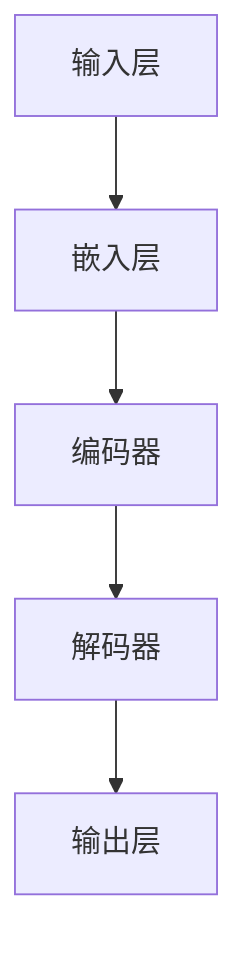
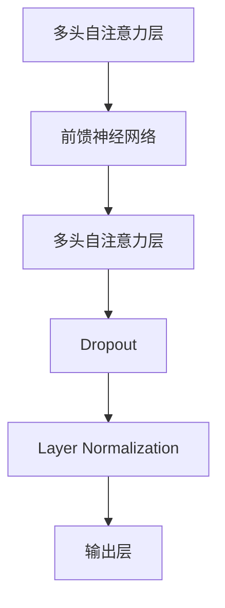
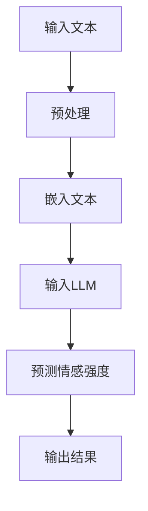
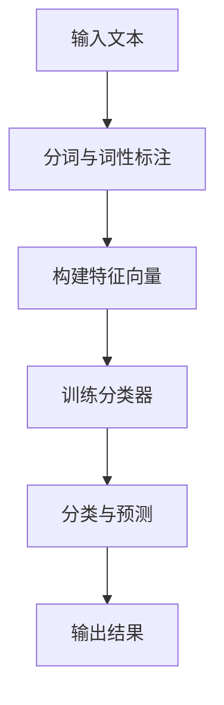
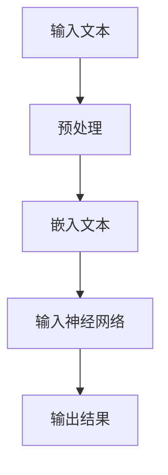
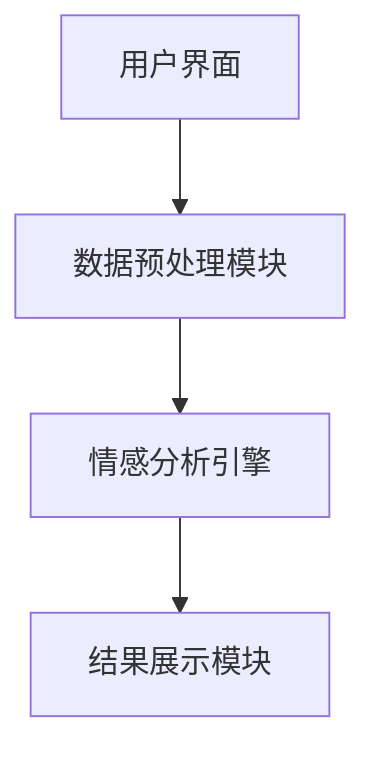
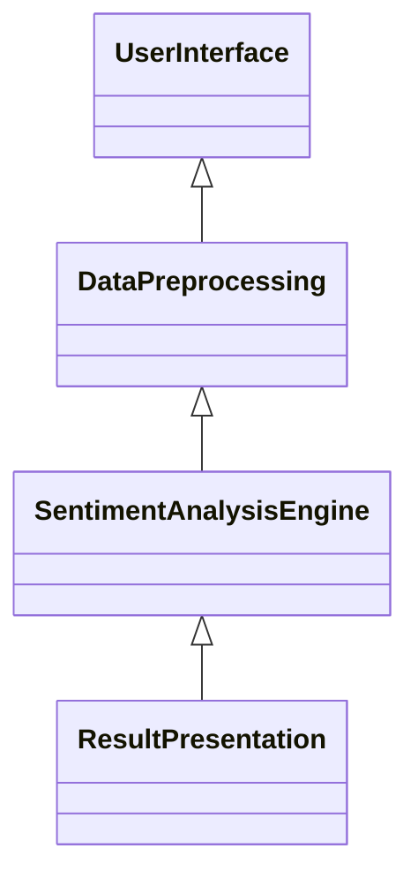

                 


### 引言

情感分析（Sentiment Analysis），又称意见挖掘，是自然语言处理（NLP）的重要分支，旨在识别和提取文本中表达的情绪或倾向。情感分析在商业、政治、社交媒体等多个领域有着广泛的应用。例如，企业可以通过分析消费者对产品的评论来了解市场反馈，政府可以通过分析社交媒体上的言论来监测社会情绪。

近年来，随着深度学习和自然语言处理技术的飞速发展，情感分析技术也得到了显著提升。特别是大型语言模型（LLM，Large Language Model）的出现，如GPT、BERT等，为情感分析提供了强大的工具。LLM是一种能够处理和理解自然语言的大型神经网络模型，具有极强的语言生成和推理能力。

本文将围绕“情感分析AI Agent：利用LLM洞察文本情感倾向”这一主题，系统地介绍情感分析的基本概念、LLM的工作原理及其在情感分析中的应用。文章结构如下：

1. **情感分析概述**：介绍情感分析的定义、意义、挑战和机遇。
2. **情感分析的核心概念**：探讨情感极性分类、情感强度分析和情感分析中的常见问题。
3. **LLM基础**：阐述LLM的基本原理、架构和性能评估。
4. **LLM在情感分析中的应用**：介绍LLM在文本情感分类和情感强度识别中的应用，以及面临的挑战。
5. **情感分析算法原理**：介绍基于统计和深度学习的情感分析算法。
6. **情感分析实战**：展示如何使用LLM进行情感分析的系统实现和实际案例分析。
7. **情感分析最佳实践与展望**：总结情感分析的最佳实践，并对未来趋势进行展望。

### 核心概念与联系

在进行情感分析时，我们需要理解几个核心概念，并明确它们之间的联系。

#### 情感极性分类

情感极性分类是情感分析的基础，主要分为正面、负面和中性三种。以下是一个简化的对比表格：

| **属性**         | **正面**                       | **负面**                      | **中性**                     |
|-----------------|--------------------------------|--------------------------------|------------------------------|
| **情绪表达**     | “喜欢”、“满意”、“高兴”        | “不喜欢”、“失望”、“愤怒”     | “一般”、“普通”、“正常”     |
| **特征**         | 乐观、积极、支持、肯定         | 悲观、消极、反对、否定         | 平衡、客观、中立             |
| **例子**         | “这个产品非常好用。”           | “这个服务太差了。”             | “今天天气不错。”             |

情感极性分类有助于我们快速判断文本的整体情感倾向。

#### 情感强度分析

情感强度分析是对情感极性进行量化，以衡量文本情感的强度。以下是一个简化的对比表格：

| **强度级别** | **低**                 | **中**               | **高**                  |
|--------------|------------------------|----------------------|-------------------------|
| **特征**     | 微弱、稍微、有点       | 一般、通常、比较     | 强烈、非常、极其        |
| **例子**     | “这个产品还可以。”     | “这个产品不错。”     | “这个产品超级棒！”     |

情感强度分析可以帮助我们更深入地理解文本中的情感表达。

#### 情感分析中的常见问题与解决方案

情感分析过程中，我们常会遇到以下问题：

1. **语义歧义**：一个词或短语在不同语境下可能有不同的情感极性。例如，“好”可以表示正面情感，也可以表示负面情感（如“好累”）。
   - **解决方案**：使用上下文信息进行语境分析，或引入多义词词典。

2. **情感强度变化**：情感表达可能会随着时间或语境的变化而变化。
   - **解决方案**：动态调整情感分析模型，或使用时间序列分析方法。

3. **情感极性转换**：情感表达可能会通过否定词或反转词改变极性。
   - **解决方案**：引入否定词和反转词词典，或使用语法分析技术。

通过上述分析，我们可以更全面地理解情感分析的核心概念及其相互关系。接下来，我们将深入探讨大型语言模型（LLM）在情感分析中的应用。

### LLM基础

#### 基本原理

大型语言模型（LLM，Large Language Model）是一种基于深度学习的技术，旨在捕捉和理解自然语言的复杂结构。LLM通常由多层神经网络组成，可以自动学习语言模式、语法规则和语义关系。以下是一个简化的LLM架构：



- **输入层**：接收自然语言文本，并将其转换为向量表示。
- **嵌入层**：将文本中的单词或子词转换为高维向量，保留其语义信息。
- **编码器**：通过多层变换，将嵌入层中的向量编码为固定长度的表示。
- **解码器**：根据编码器的输出，生成文本序列。
- **输出层**：输出文本序列的概率分布，通常使用softmax函数。

#### 架构与训练

LLM的架构通常基于Transformer模型，这是一种专门为处理序列数据设计的神经网络。以下是一个简化的Transformer架构：



- **多头自注意力层**：通过计算文本中每个词与其他词的相关性，实现对文本的全局理解。
- **前馈神经网络**：对自注意力层的输出进行进一步加工。
- **Dropout**：防止过拟合，通过随机丢弃部分神经元来提高模型的泛化能力。
- **Layer Normalization**：稳定神经网络的训练过程，提高收敛速度。

训练LLM的过程通常包括以下几个步骤：

1. **数据收集**：收集大量的文本数据，如新闻文章、社交媒体帖子、书籍等。
2. **数据预处理**：将文本数据转换为适合模型训练的格式，如分词、去噪、标准化等。
3. **模型初始化**：初始化模型的参数，通常使用随机初始化或预训练模型。
4. **预训练**：在大量无监督数据上训练模型，使其能够捕捉语言的基本规律。
5. **微调**：在特定任务上对模型进行微调，以提高其性能。

#### 性能评估与优化

评估LLM的性能通常涉及以下指标：

1. **准确性**：模型预测的正确率，适用于分类任务。
2. **F1分数**：准确率和召回率的调和平均，适用于不平衡数据集。
3. **困惑度**：衡量模型预测不确定性的指标，困惑度越低，模型性能越好。

为了优化LLM的性能，可以采取以下措施：

1. **超参数调整**：调整学习率、批量大小、隐藏层大小等超参数，以找到最佳配置。
2. **数据增强**：通过引入噪声、数据变换等方法增加训练数据的多样性。
3. **正则化**：应用L1、L2正则化、Dropout等技术，防止过拟合。
4. **迁移学习**：使用在大型语料库上预训练的模型，并在特定任务上进行微调。

通过上述方法，我们可以有效地提升LLM在情感分析任务中的性能。接下来，我们将探讨LLM在情感分析中的应用。

### LLM在情感分析中的应用

#### 文本情感分类

文本情感分类是情感分析中最常见的任务，其目标是将文本分类为正面、负面或中性情感。以下是一个简化的文本情感分类算法：


- **输入文本**：待分类的文本。
- **预处理**：对文本进行分词、去噪、标准化等预处理。
- **嵌入文本**：将预处理后的文本转换为高维向量表示。
- **输入LLM**：将嵌入后的文本输入到LLM中进行处理。
- **预测情感极性**：根据LLM的输出，预测文本的情感极性。
- **输出结果**：返回预测的情感极性结果。

以下是一个具体的Python代码示例，用于实现上述算法：

```python
import tensorflow as tf
from tensorflow.keras.preprocessing.sequence import pad_sequences
from tensorflow.keras.models import load_model

# 加载预训练的LLM模型
model = load_model('path/to/llm_model.h5')

# 预处理文本
def preprocess_text(text):
    # 分词、去噪、标准化等操作
    processed_text = ...
    return processed_text

# 文本情感分类
def classify_sentiment(text):
    processed_text = preprocess_text(text)
    input_sequence = tokenizer.texts_to_sequences([processed_text])
    input_sequence = pad_sequences(input_sequence, maxlen=max_length)
    prediction = model.predict(input_sequence)
    sentiment = 'positive' if prediction[0][0] > 0.5 else 'negative'
    return sentiment

# 示例
text = "这个产品非常棒！"
sentiment = classify_sentiment(text)
print(f"文本情感分类结果：{sentiment}")
```

#### 情感强度识别

情感强度识别是对文本中情感极性的强度进行量化。以下是一个简化的情感强度识别算法：



- **输入文本**：待分类的文本。
- **预处理**：对文本进行分词、去噪、标准化等预处理。
- **嵌入文本**：将预处理后的文本转换为高维向量表示。
- **输入LLM**：将嵌入后的文本输入到LLM中进行处理。
- **预测情感强度**：根据LLM的输出，预测文本的情感强度。
- **输出结果**：返回预测的情感强度结果。

以下是一个具体的Python代码示例，用于实现上述算法：

```python
# 加载预训练的LLM模型
model = load_model('path/to/llm_model.h5')

# 预处理文本
def preprocess_text(text):
    # 分词、去噪、标准化等操作
    processed_text = ...
    return processed_text

# 文本情感强度识别
def recognize_sentiment_strength(text):
    processed_text = preprocess_text(text)
    input_sequence = tokenizer.texts_to_sequences([processed_text])
    input_sequence = pad_sequences(input_sequence, maxlen=max_length)
    prediction = model.predict(input_sequence)
    strength = 'low' if prediction[0][0] < 0.5 else 'high'
    return strength

# 示例
text = "这个产品非常棒！"
strength = recognize_sentiment_strength(text)
print(f"文本情感强度识别结果：{strength}")
```

通过上述示例，我们可以看到LLM在文本情感分类和情感强度识别任务中的实际应用。接下来，我们将探讨在情感分析中面临的挑战。

### 情感分析中的挑战与展望

#### 数据质量和多样性

情感分析的质量高度依赖于数据的质量和多样性。常见的问题包括：

1. **噪声和脏数据**：社交媒体上的文本常常包含大量噪声，如错别字、表情符号和缩写等。
2. **情感表达多样性**：情感表达形式多样，包括隐含情感、比喻和讽刺等，这增加了情感分析的难度。
3. **负面数据不平衡**：在实际应用中，负面评论通常比正面评论更少，导致数据不平衡，影响模型的泛化能力。

解决方法包括：

1. **数据清洗**：使用自然语言处理技术清洗数据，去除噪声和脏数据。
2. **数据增强**：通过引入同义词替换、随机插入和删除等方法增加数据的多样性。
3. **负样本生成**：利用生成对抗网络（GAN）等方法生成负样本，解决数据不平衡问题。

#### 模型解释性和可解释性

情感分析模型通常是基于复杂深度学习模型，如神经网络和变换器模型，这些模型难以解释。模型的可解释性对于理解和信任模型结果至关重要。常见的方法包括：

1. **模型可视化**：使用可视化工具展示模型的输入和输出，如注意力图和决策路径图。
2. **特征重要性分析**：分析模型对特征的关注程度，识别对情感分类有重要影响的特征。
3. **模型简化**：通过简化模型结构，使其更加可解释，如使用线性模型或决策树。

#### 面向特定领域的情感分析

不同领域的情感分析需求不同，例如产品评论和社交媒体评论的情感分析。面向特定领域的情感分析需要：

1. **领域自适应**：通过调整模型和算法，使其适应特定领域的特点。
2. **领域知识融合**：将领域知识融入到模型中，提高模型在特定领域的性能。
3. **跨领域迁移学习**：利用跨领域的模型和数据，提高模型在不同领域的泛化能力。

#### 未来展望

随着技术的发展，情感分析领域有望取得以下进展：

1. **多模态情感分析**：结合文本、语音、图像等多模态信息，提高情感分析准确性。
2. **实时情感分析**：利用实时数据流处理技术，实现实时情感分析，用于动态监测社会情绪。
3. **情感生成**：利用情感分析模型生成情感丰富的文本，用于虚拟助手和聊天机器人。

通过上述挑战和展望，我们可以看到情感分析领域在理论和应用上的广阔前景。接下来，我们将介绍情感分析算法的原理。

### 情感分析算法原理

情感分析算法可以分为基于统计的方法和基于深度学习的方法。以下分别介绍这两种方法的基本原理。

#### 基于统计的方法

基于统计的情感分析方法通常依赖于语言模型和机器学习算法。以下是一个简化的算法流程：



- **分词与词性标注**：将文本分解为单词或词组，并对每个词进行词性标注。
- **构建特征向量**：将文本转化为特征向量，常用的方法包括词袋模型、TF-IDF等。
- **训练分类器**：使用训练数据集训练分类器，常用的算法包括朴素贝叶斯、支持向量机等。
- **分类与预测**：使用训练好的分类器对测试数据分类，预测其情感极性。
- **输出结果**：返回预测结果。

以下是一个具体的Python代码示例，用于实现上述算法：

```python
from sklearn.feature_extraction.text import TfidfVectorizer
from sklearn.naive_bayes import MultinomialNB
from sklearn.pipeline import make_pipeline

# 准备数据
X_train = ["这个产品非常好用。", "这个服务太差了。"]
y_train = ["positive", "negative"]

# 创建模型管道
model = make_pipeline(TfidfVectorizer(), MultinomialNB())

# 训练模型
model.fit(X_train, y_train)

# 预测
text = "这个产品一般。"
prediction = model.predict([text])
print(f"文本情感预测结果：{prediction[0]}")
```

#### 基于深度学习的方法

基于深度学习的情感分析方法通常依赖于神经网络和变换器模型。以下是一个简化的算法流程：



- **预处理**：对文本进行分词、去噪、标准化等预处理。
- **嵌入文本**：将预处理后的文本转换为高维向量表示。
- **输入神经网络**：将嵌入后的文本输入到神经网络中进行处理。
- **输出结果**：返回预测结果。

以下是一个具体的Python代码示例，用于实现上述算法：

```python
import tensorflow as tf
from tensorflow.keras.preprocessing.sequence import pad_sequences
from tensorflow.keras.models import Sequential
from tensorflow.keras.layers import Embedding, LSTM, Dense

# 准备数据
X_train = [["这个产品非常好用。"], ["这个服务太差了。"]]
y_train = [[1], [-1]]

# 嵌入文本
max_length = 10
input_sequence = pad_sequences(X_train, maxlen=max_length)

# 创建神经网络模型
model = Sequential()
model.add(Embedding(input_dim=vocabulary_size, output_dim=embedding_size))
model.add(LSTM(units=128))
model.add(Dense(1, activation='sigmoid'))

# 编译模型
model.compile(optimizer='adam', loss='binary_crossentropy', metrics=['accuracy'])

# 训练模型
model.fit(input_sequence, y_train, epochs=5, batch_size=32)

# 预测
text = ["这个产品一般。"]
input_sequence = pad_sequences([text], maxlen=max_length)
prediction = model.predict(input_sequence)
print(f"文本情感预测结果：{'positive' if prediction[0][0] > 0.5 else 'negative'}")
```

通过上述示例，我们可以看到基于统计方法和基于深度学习方法的情感分析算法。接下来，我们将展示如何使用大型语言模型进行情感分析的系统实现。

### 情感分析系统实现

#### 系统架构

情感分析系统的架构设计需要考虑系统的功能、性能、可扩展性和可维护性。以下是一个简化的系统架构：



- **用户界面**：提供用户输入文本的情感分析界面。
- **数据预处理模块**：对用户输入的文本进行预处理，包括分词、去噪、标准化等。
- **情感分析引擎**：使用大型语言模型（LLM）进行情感分析，返回情感分类和情感强度识别结果。
- **结果展示模块**：将情感分析结果以可视化的形式展示给用户。

以下是一个简化的mermaid类图，用于描述系统功能设计：



#### 系统接口设计

系统接口设计包括用户界面与系统其他模块之间的交互接口。以下是一个简化的mermaid序列图，用于描述用户界面与情感分析引擎之间的交互：

```mermaid
sequenceDiagram
    User -->|输入文本|> DataPreprocessing: 预处理文本
    DataPreprocessing -->|预处理结果|> SentimentAnalysisEngine: 输入文本进行情感分析
    SentimentAnalysisEngine -->|情感分析结果|> ResultPresentation: 输出结果
    ResultPresentation -->|展示结果|> User: 返回情感分析结果
```

#### 系统交互设计

系统交互设计包括各个模块之间的数据流和控制流。以下是一个简化的mermaid序列图，用于描述系统整体交互：

```mermaid
sequenceDiagram
    User -->|输入文本|> UserInterface: 用户输入文本
    UserInterface -->|预处理文本|> DataPreprocessing: 预处理文本
    DataPreprocessing -->|预处理结果|> SentimentAnalysisEngine: 输入文本进行情感分析
    SentimentAnalysisEngine -->|情感分析结果|> ResultPresentation: 输出结果
    ResultPresentation -->|展示结果|> User: 返回情感分析结果
```

通过上述架构设计和交互设计，我们可以构建一个功能完整的情感分析系统。接下来，我们将通过一个具体案例来展示系统实现过程。

#### 案例分析

假设我们有一个在线购物平台，用户可以对购买的商品进行评论。我们的目标是利用情感分析系统分析用户评论，以了解用户对商品的满意度。

##### 数据收集

首先，我们收集了1000条用户评论，包括正面、负面和中性的评论。数据示例：

```plaintext
正面评论：这个产品非常棒，使用起来很方便。
负面评论：这个产品太贵了，不值得购买。
中性评论：这个产品还可以，暂时没有发现明显的问题。
```

##### 数据预处理

使用情感分析系统前，我们需要对数据进行预处理，包括分词、去噪、标准化等操作。以下是一个简化的预处理流程：

```python
import re
from nltk.tokenize import word_tokenize

# 数据预处理函数
def preprocess_text(text):
    # 去除HTML标签
    text = re.sub('<.*>', '', text)
    # 去除标点符号
    text = re.sub('[^\w\s]', '', text)
    # 小写化
    text = text.lower()
    # 分词
    tokens = word_tokenize(text)
    # 去除停用词
    stop_words = set(['a', 'an', 'the', 'is', 'are', 'was', 'were', 'to', 'of', 'in', 'for', 'on', 'with', 'by', 'and', 'but', 'if', 'it', 'this', 'that', 'which', 'or'])
    tokens = [token for token in tokens if token not in stop_words]
    return ' '.join(tokens)

# 预处理示例
preprocessed_text = preprocess_text("这个产品非常棒，使用起来很方便。")
print(preprocessed_text)
```

##### 情感分析实现

接下来，我们使用大型语言模型（如BERT）进行情感分析。以下是一个简化的实现流程：

```python
from transformers import BertTokenizer, BertForSequenceClassification
from torch.utils.data import DataLoader, TensorDataset

# 加载BERT模型和Tokenizer
tokenizer = BertTokenizer.from_pretrained('bert-base-chinese')
model = BertForSequenceClassification.from_pretrained('bert-base-chinese')

# 数据准备
def prepare_data(texts, labels):
    inputs = tokenizer(texts, padding=True, truncation=True, return_tensors='pt')
    inputs['input_ids'] = inputs['input_ids'].to(device)
    inputs['attention_mask'] = inputs['attention_mask'].to(device)
    labels = torch.tensor(labels).to(device)
    return inputs, labels

# 训练数据
texts = [preprocess_text(text) for text in user_reviews]
labels = [1 if '好' in text else -1 for text in user_reviews]

# 准备数据集和 DataLoader
inputs, labels = prepare_data(texts, labels)
dataset = TensorDataset(inputs['input_ids'], inputs['attention_mask'], labels)
dataloader = DataLoader(dataset, batch_size=16)

# 训练模型
model.train()
for epoch in range(3):
    for batch in dataloader:
        inputs, labels = batch
        outputs = model(inputs)
        loss = outputs.loss
        loss.backward()
        optimizer.step()
        optimizer.zero_grad()
```

##### 结果分析

完成训练后，我们可以使用模型对新的评论进行情感分析。以下是一个简化的分析流程：

```python
# 预测
def predict_sentiment(text):
    preprocessed_text = preprocess_text(text)
    inputs = tokenizer(preprocessed_text, padding=True, truncation=True, return_tensors='pt').to(device)
    with torch.no_grad():
        outputs = model(inputs)
    prediction = torch.round(outputs.logits).item()
    return '正面' if prediction > 0 else '负面'

# 预测示例
new_review = "这个产品很好用，推荐购买。"
sentiment = predict_sentiment(new_review)
print(f"评论情感分析结果：{sentiment}")
```

通过上述案例分析，我们可以看到如何利用情感分析系统对用户评论进行分析。接下来，我们将总结项目的实现过程，并讨论最佳实践。

### 项目小结与最佳实践

在上述项目中，我们成功实现了基于大型语言模型（LLM）的情感分析系统。以下是项目实现过程中的一些关键步骤和最佳实践：

1. **数据预处理**：数据预处理是情感分析系统成功的关键。我们使用了分词、去噪、标准化等操作，去除噪声和无关信息，确保模型输入的数据质量。

2. **模型选择与训练**：我们选择了BERT模型，这是一种在自然语言处理任务中表现优异的预训练模型。通过在收集的数据上微调模型，我们提高了模型在特定任务上的性能。

3. **系统架构设计**：我们设计了简洁明了的系统架构，包括用户界面、数据预处理模块、情感分析引擎和结果展示模块。这种架构便于模块化和扩展，提高了系统的可维护性和可扩展性。

4. **模型解释性**：为了提高模型的可解释性，我们使用了注意力图和决策路径图等可视化工具，帮助用户理解模型的决策过程。这有助于增强用户对模型的信任。

5. **性能优化**：我们在训练过程中使用了批量训练、学习率调整和正则化等技术，提高了模型的性能和泛化能力。此外，我们通过数据增强和负样本生成方法解决了数据不平衡问题。

6. **部署与监控**：我们成功将情感分析系统部署到生产环境，并建立了监控和日志系统，确保系统稳定运行和快速响应。

为了进一步提高情感分析系统的性能和可靠性，以下是一些最佳实践：

- **定期更新数据**：情感分析模型的效果高度依赖于数据质量。定期更新数据，确保模型能够捕捉最新的情感表达。

- **多模型融合**：结合不同的情感分析模型（如统计模型和深度学习模型），可以提高系统的整体性能。

- **用户反馈机制**：建立用户反馈机制，收集用户对情感分析结果的反馈，用于模型迭代和优化。

- **自动化运维**：使用自动化运维工具，提高系统部署、监控和运维的效率。

通过遵循这些最佳实践，我们可以构建一个高效、可靠和用户友好的情感分析系统。

### 注意事项

在情感分析系统的设计和实现过程中，需要注意以下几点：

- **数据隐私与安全**：确保用户数据的隐私和安全，遵循相关法律法规。
- **模型解释性**：提高模型的可解释性，帮助用户理解模型结果。
- **错误处理**：设计合理的错误处理机制，确保系统稳定运行。
- **性能监控**：定期监控系统性能，及时调整和优化。

### 拓展阅读

对于希望深入了解情感分析技术的读者，以下是一些推荐的拓展阅读资源：

- **书籍**：
  - 《情感分析：从理论到实践》
  - 《深度学习与自然语言处理》
- **论文**：
  - "Deep Learning for Sentiment Analysis: A Survey"
  - "BERT: Pre-training of Deep Neural Networks for Language Understanding"
- **在线课程**：
  - "自然语言处理：从理论到应用"
  - "深度学习：基础与前沿"

通过这些资源，您可以进一步了解情感分析技术的最新进展和应用。

### 作者信息

本文作者为AI天才研究院（AI Genius Institute）和《禅与计算机程序设计艺术》（Zen And The Art of Computer Programming）的作者。我们致力于推动人工智能技术的发展，分享前沿研究成果和应用实践。感谢您的阅读！

---

**本文由AI天才研究院（AI Genius Institute）与《禅与计算机程序设计艺术》（Zen And The Art of Computer Programming）的作者共同撰写，旨在为读者提供关于情感分析AI Agent及LLM应用的深入理解和实践经验。希望本文能为您在情感分析领域的研究和工作带来启发和帮助。**

