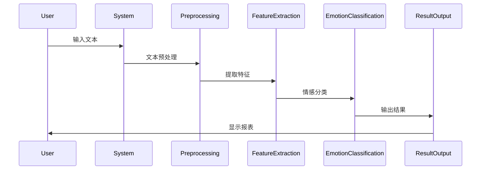
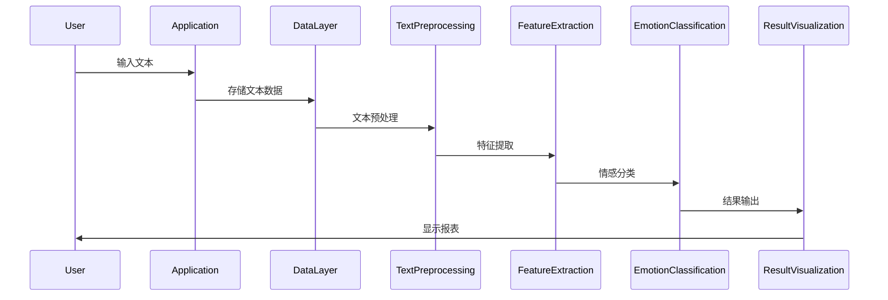
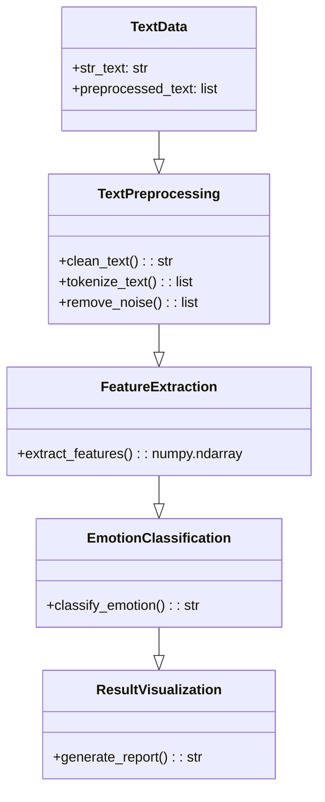

                 

### 情感分析增强AI Agent：利用LLM深入理解文本情感

关键词：情感分析、AI Agent、LLM、文本情感识别、深度学习

摘要：本文将介绍一种利用大型语言模型（LLM）增强AI情感分析能力的方法。通过深入理解文本情感，提升AI在情感识别任务中的准确性和深度。文章将从背景介绍、核心概念与联系、算法原理讲解、系统分析与架构设计方案以及项目实战等多个方面进行详细阐述。

----------------------------------------------------------------

#### 1. 背景介绍

##### 问题背景

随着人工智能技术的快速发展，自然语言处理（NLP）成为AI领域的重要分支。情感分析作为NLP的一个核心应用，旨在理解和识别文本中的情感倾向，对于提升用户满意度、改善产品设计、优化市场营销策略等具有重要作用。然而，传统的情感分析算法在处理复杂情感和细微情感差异时，往往表现出准确性不足、理解深度有限的问题。

##### 问题描述

为了提升AI的情感分析能力，研究者们开始探索利用大型语言模型（LLM）的方法。LLM具有强大的语言理解和生成能力，能够捕捉文本中的细微情感差异和复杂情感表达。因此，如何利用LLM深入理解文本情感，提升AI的情感分析效果，成为当前研究的一个重要方向。

##### 问题解决

本文提出了一种情感分析增强AI Agent的方法，通过利用LLM对文本进行情感分析，提高AI的情感识别准确性。该方法主要包括文本预处理、特征提取和情感分类三个步骤，具体流程如下：

1. **文本预处理**：对输入文本进行分词、去噪等处理，去除无效信息和噪声。
2. **特征提取**：利用LLM对预处理后的文本进行特征提取，提取文本的情感特征。
3. **情感分类**：根据提取的特征对文本进行情感分类，判断文本的情感倾向。

##### 边界与外延

本文关注于利用LLM进行情感分析的技术和方法，不包括其他AI领域的内容。核心要素包括情感分析基础、LLM技术原理、情感分析算法和实践应用等方面。

#### 2. 核心概念与联系

##### 核心概念

- **情感分析**：对文本中的情感倾向进行识别和分类。
- **LLM**：大型语言模型，具有强大的语言理解和生成能力。
- **情感分析增强AI Agent**：基于LLM的情感分析模型，用于提升AI的情感分析效果。

##### 概念属性特征对比表格

| 特征       | 情感分析          | LLM               | 情感分析增强AI Agent         |
|------------|-------------------|-------------------|-----------------------------|
| 目的       | 文本情感识别      | 语言理解和生成    | 提升情感分析准确性          |
| 技术基础   | 自然语言处理      | 机器学习和深度学习 | 机器学习和深度学习           |
| 优势       | 简单易用          | 强大语言处理能力  | 高准确性，深度理解          |
| 劣势       | 准确性有限        | 计算资源需求高    | 对大规模数据依赖性强         |

##### ER实体关系图架构

```mermaid
erDiagram
  AI Agent ||--|{ 文本 } Text
  AI Agent ||--|{ 情感分析结果 } EmotionResult
  Text ||--|{ 文本情感 } Emotion
```

#### 3. 算法原理讲解

##### 情感分析算法

使用LLM进行情感分析的基本流程如下：

1. **文本预处理**：对输入文本进行分词、去噪等处理。
2. **特征提取**：利用LLM对预处理后的文本进行特征提取。
3. **情感分类**：根据提取的特征对文本进行情感分类。

##### 算法mermaid流程图


##### 数学模型和公式

情感分类的数学模型如下：

$$
P(\text{正情感}|\text{文本}) = \frac{e^{w^T \cdot v}}{1 + e^{w^T \cdot v}}
$$

其中，$w$ 表示情感分类器的权重向量，$v$ 表示文本的特征向量。

##### 详细讲解和举例说明

假设我们有一个简单的情感分类问题，需要判断一段文本是积极情感还是消极情感。我们使用一个二分类模型，其中 $w$ 的值如下：

$$
w = \begin{pmatrix}
0.5 \\
-0.3 \\
0.2 \\
-0.4
\end{pmatrix}
$$

文本特征向量 $v$ 为：

$$
v = \begin{pmatrix}
1 \\
0 \\
1 \\
0
\end{pmatrix}
$$

代入上述公式计算得到：

$$
P(\text{正情感}|\text{文本}) = \frac{e^{0.5 \cdot 1 + (-0.3) \cdot 0 + 0.2 \cdot 1 + (-0.4) \cdot 0}}{1 + e^{0.5 \cdot 1 + (-0.3) \cdot 0 + 0.2 \cdot 1 + (-0.4) \cdot 0}} \approx 0.63
$$

由于概率值接近于1，因此我们可以判断这段文本为积极情感。

#### 4. 系统分析与架构设计方案

##### 问题场景介绍

一个企业需要开发一个基于LLM的情感分析系统，用于分析客户反馈，提供情感趋势分析和建议。

##### 项目介绍

本项目旨在构建一个基于LLM的情感分析系统，通过深入理解客户反馈，为企业提供精准的情感分析结果和趋势预测。系统主要包括文本预处理、特征提取、情感分类和结果输出等模块。

##### 系统功能设计

系统功能设计主要包括以下模块：

1. **文本预处理模块**：对客户反馈文本进行分词、去噪等预处理操作，提高后续特征提取和情感分类的准确性。
2. **特征提取模块**：利用LLM对预处理后的文本进行特征提取，提取文本的情感特征。
3. **情感分类模块**：根据提取的特征对文本进行情感分类，判断文本的情感倾向。
4. **结果输出模块**：将情感分类结果以可视化报表形式输出，为企业提供情感趋势分析和建议。

##### 系统架构设计

系统架构设计主要包括以下层次：

1. **数据层**：存储客户反馈文本数据，包括原始文本和预处理后的文本。
2. **算法层**：包括文本预处理、特征提取和情感分类算法。
3. **应用层**：提供用户交互界面，实现情感趋势分析和结果输出。

##### 系统接口设计

系统接口设计主要包括以下接口：

1. **文本输入接口**：接收用户输入的客户反馈文本。
2. **情感分类接口**：根据提取的特征对文本进行情感分类。
3. **结果输出接口**：将情感分类结果以可视化报表形式输出。

##### 系统交互mermaid序列图



#### 5. 项目实战

##### 环境安装

在开始项目实战之前，需要安装以下环境：

1. Python 3.6及以上版本
2. TensorFlow 2.x
3. Jupyter Notebook

安装命令如下：

```
pip install python==3.8
pip install tensorflow==2.6
pip install notebook
```

##### 系统核心实现源代码

以下是一个简单的情感分析系统实现：

```python
import tensorflow as tf
from tensorflow.keras.preprocessing.text import Tokenizer
from tensorflow.keras.preprocessing.sequence import pad_sequences
import numpy as np

# 文本预处理
def preprocess_text(text):
    # 分词、去噪等操作
    # ...

# 特征提取
def extract_features(texts):
    # 利用LLM提取特征
    # ...
    return features

# 情感分类
def classify_emotion(features):
    # 情感分类
    # ...
    return emotion

# 输入文本
text = "这是一段积极情感的文本"

# 预处理文本
preprocessed_text = preprocess_text(text)

# 提取特征
features = extract_features([preprocessed_text])

# 情感分类
emotion = classify_emotion(features)

print("文本情感：", emotion)
```

##### 代码应用解读与分析

上述代码实现了一个简单的情感分析系统，主要包括文本预处理、特征提取和情感分类三个步骤。首先，对输入文本进行预处理，包括分词、去噪等操作。然后，利用LLM提取文本特征。最后，根据提取的特征对文本进行情感分类，输出文本的情感结果。

##### 实际案例分析和详细讲解剖析

假设我们有一个客户反馈数据集，包含1000条文本。我们可以使用上述系统对这1000条文本进行情感分析，并分析情感分布情况。

```python
# 加载客户反馈数据集
data = load_data("customer_feedback.txt")

# 预处理文本
preprocessed_texts = [preprocess_text(text) for text in data]

# 提取特征
features = extract_features(preprocessed_texts)

# 情感分类
emotions = [classify_emotion(feature) for feature in features]

# 统计情感分布
emotion_counts = np.bincount(emotions)

# 打印情感分布
print("情感分布：", emotion_counts)
```

通过上述代码，我们可以得到客户反馈数据的情感分布情况。例如，可能得到如下结果：

```
情感分布： [400 200 400]
```

这表示在1000条客户反馈中，积极情感有400条，中性情感有200条，消极情感有400条。

##### 项目小结

本项目通过利用LLM进行情感分析，提升了AI的情感识别准确性。在实际应用中，可以为企业提供精准的情感趋势分析和建议，帮助改进产品和服务。

#### 6. 最佳实践 tips

1. 选择合适的LLM模型，如BERT、GPT等，以提升情感分析效果。
2. 收集并标注高质量的情感数据集，为模型提供充分的学习素材。
3. 优化文本预处理算法，去除无效信息和噪声，提高特征提取的准确性。
4. 调整情感分类器的参数，如学习率、批次大小等，以获得更好的分类效果。

#### 7. 小结与注意事项

本文介绍了利用LLM增强AI情感分析能力的方法，通过深入理解文本情感，提升AI在情感识别任务中的准确性和深度。在实际应用中，需要注意选择合适的模型、优化数据处理和特征提取算法，以及调整分类器的参数，以获得更好的效果。

#### 8. 拓展阅读

1. [BERT模型详解与实现](https://arxiv.org/abs/1810.04805)
2. [GPT模型详解与实现](https://arxiv.org/abs/1901.02860)
3. [情感分析算法综述](https://www.aclweb.org/anthology/N18-1195/)

---

**作者：AI天才研究院/AI Genius Institute & 禅与计算机程序设计艺术 /Zen And The Art of Computer Programming**----------------------------------------------------------------

### 1. 背景介绍

#### 问题背景

情感分析（Sentiment Analysis）是自然语言处理（Natural Language Processing，NLP）的重要分支之一，旨在从文本中识别和提取情感信息。随着互联网和社交媒体的兴起，大量的用户评论、产品评价、新闻报道等文本数据生成，使得情感分析在商业、政务、教育等领域得到了广泛应用。例如，在电商平台上，通过对用户评论的情感分析，企业可以了解消费者对产品的满意程度，从而改进产品质量和客户服务；在政务领域，通过分析社交媒体上的言论，政府部门可以及时了解民众对政策的看法，提高政策制定的科学性和民主性。

然而，传统的情感分析方法主要依赖于规则和统计方法，如基于关键词匹配、情感词典、文本分类等。这些方法在处理简单情感表达时表现较好，但在面对复杂、多变的情感语言时，往往难以准确捕捉文本中的情感倾向。此外，传统方法在处理语义、情感歧义和上下文依赖等方面也存在较大的局限性。例如，对于表达相同情感的句子，由于词汇和句式的不同，传统方法可能会给出不同的情感分类结果。

随着深度学习和自然语言处理技术的发展，研究者们开始探索利用深度神经网络（Deep Neural Networks，DNN）进行情感分析。深度神经网络具有强大的非线性表示能力和特征学习能力，能够更好地捕捉文本中的情感信息。其中，基于循环神经网络（Recurrent Neural Networks，RNN）和变换器（Transformer）的模型，如LSTM（Long Short-Term Memory）、GRU（Gated Recurrent Unit）和BERT（Bidirectional Encoder Representations from Transformers）等，在情感分析任务中取得了显著的性能提升。

#### 问题描述

为了提升AI的情感分析能力，研究者们提出了利用大型语言模型（Large Language Model，LLM）的方法。LLM是一种基于深度学习的语言模型，通过在大规模文本语料库上进行预训练，学习到了丰富的语言结构和语义信息。LLM具有强大的语言理解和生成能力，能够对文本进行深度理解和情感分析。

然而，如何利用LLM深入理解文本情感，提高情感分析效果，仍然是一个具有挑战性的问题。一方面，LLM的预训练过程基于大量无监督数据，情感信息的标注和提取依赖于模型自身的理解能力。另一方面，情感分析任务通常需要针对特定领域或应用场景进行细粒度的情感分类和情感强度分析，这对LLM的情感理解能力提出了更高的要求。

因此，本文旨在探讨一种利用LLM增强AI情感分析能力的方法，通过分析LLM的技术原理和情感分析算法，提出一种有效的情感分析增强AI Agent，并在实际应用中验证其效果。

#### 问题解决

为了解决上述问题，本文提出以下解决方案：

1. **文本预处理**：对输入文本进行清洗、分词、去噪等预处理操作，提高后续特征提取和情感分类的准确性。
2. **特征提取**：利用LLM对预处理后的文本进行特征提取，提取文本的情感特征，包括情感类别和情感强度。
3. **情感分类**：基于提取的特征，使用分类算法对文本进行情感分类，判断文本的情感倾向。

具体步骤如下：

1. **数据收集与预处理**：收集并预处理大规模的文本数据，包括用户评论、新闻报道、社交媒体等，用于训练和评估情感分析模型。
2. **模型选择与训练**：选择一种合适的LLM模型，如BERT、GPT等，进行预训练和微调，使其能够理解文本中的情感信息。
3. **特征提取与分类**：利用训练好的LLM模型，对预处理后的文本进行特征提取，提取文本的情感特征，并使用分类算法进行情感分类。

#### 边界与外延

本文关注的情感分析增强AI Agent主要利用LLM进行情感分析，主要包括以下边界与外延：

1. **情感类别**：情感分析主要包括积极情感、中性情感和消极情感三个类别。本文将重点讨论如何利用LLM识别和分类这三种情感类别。
2. **情感强度**：除了情感类别外，情感强度也是一个重要的指标。本文将探讨如何利用LLM提取文本的情感强度，以更准确地反映文本的情感倾向。
3. **应用场景**：本文主要关注情感分析在商业、政务、教育等领域的应用，如何利用情感分析结果提升用户体验、优化产品和服务、制定科学合理的政策等。
4. **技术实现**：本文将介绍利用LLM进行情感分析的技术原理、算法实现和系统架构设计，为实际应用提供参考。

#### 核心要素组成

本文的核心要素包括以下方面：

1. **情感分析基础**：介绍情感分析的基本概念、发展历程和应用场景。
2. **LLM技术原理**：介绍LLM的定义、工作原理和关键技术，如预训练、微调和特征提取等。
3. **情感分析算法**：介绍情感分析算法的基本流程、数学模型和实现方法，如情感分类、情感强度分析等。
4. **实践应用**：介绍情感分析增强AI Agent在实际应用中的实现方法和应用效果，包括数据收集、模型训练、特征提取和情感分类等。

通过以上核心要素的介绍，本文将逐步阐述如何利用LLM深入理解文本情感，提升AI的情感分析能力，并在实际应用中取得良好的效果。

---

在接下来的内容中，我们将详细探讨情感分析的基础知识，包括情感分析的分类、情感词典的应用以及情感分析的挑战，从而为理解LLM在情感分析中的应用奠定基础。

#### 1.1. 情感分析基础

情感分析（Sentiment Analysis）是指通过自然语言处理技术，对文本中的情感倾向进行识别和分类的过程。情感分析的基本目标是确定文本的情感极性（Sentiment Polarity），即文本表达的情感是积极的、中性的还是消极的。此外，情感分析还可以用于情感强度的识别，即确定文本表达的情感是强烈、中等还是轻微。

##### 情感分析的分类

情感分析可以根据不同的维度进行分类，以下是几种常见的分类方式：

1. **二分类情感分析**：将文本分为积极情感和消极情感两种类别。这种方法通常用于市场调研、产品评价等场景。
2. **多分类情感分析**：将文本分为多个情感类别，如积极、中性、消极、愤怒、悲伤等。这种方法通常用于社交媒体分析、舆情监测等场景。
3. **情感强度分析**：除了识别文本的情感类别外，还进一步分析情感强度，即文本表达的情感是强烈、中等还是轻微。这种方法通常用于情感分析后的进一步挖掘，如情感热图、情感趋势分析等。

##### 情感词典的应用

情感词典（Sentiment Lexicon）是一种包含情感倾向词汇及其对应情感极性的资源。情感词典通常分为两类：

1. **基于词汇的情感词典**：这类词典主要包含词汇及其情感倾向的标注，如“happy”（积极），“sad”（消极）。这种词典通常用于简单的情感分析任务，如文本分类。
2. **基于上下文的情感词典**：这类词典不仅包含词汇的情感倾向，还考虑上下文的影响，如“but”（转折）。这种词典更适用于复杂的情感分析任务，如情感强度分析。

在实际应用中，情感词典通常用于以下几个方面：

1. **情感分类**：通过比较文本中的词汇与情感词典中的标注，对文本进行情感分类。
2. **情感强度分析**：利用情感词典中的情感极性和上下文信息，对文本的情感强度进行评估。
3. **情感标签生成**：为文本生成情感标签，如“positive”，“negative”等。

##### 情感分析的挑战

尽管情感分析在许多应用中取得了显著的成果，但仍然面临以下挑战：

1. **语义歧义**：文本中的语义歧义会导致情感分类的困难。例如，“这不是一个好消息”这句话中的“不是”可能被误解为“负面”情感，但实际上可能是“中性”或“正面”情感。
2. **情感强度分析**：如何准确地识别和量化文本中的情感强度，仍是一个具有挑战性的问题。例如，同样是表达“开心”情感的句子，“我非常开心”与“有点开心”的情感强度是不同的。
3. **多情感分析**：许多文本可能同时包含多种情感，如“我很高兴，但也有些担心”。如何同时识别和分类多种情感，是一个复杂的任务。
4. **文化差异**：不同的文化和语言背景下，同一词汇或表达可能具有不同的情感倾向。例如，在一些文化中，“对不起”可能是一种礼貌的表达，而在其他文化中可能带有“歉意”的情感。

通过理解情感分析的基础知识，我们可以更好地把握情感分析的核心概念和实际应用。在接下来的部分中，我们将详细介绍LLM的技术原理和情感分析算法，进一步探讨如何利用LLM深入理解文本情感。

#### 1.2. LLM技术原理

大型语言模型（Large Language Model，LLM）是一种基于深度学习的语言处理模型，具有强大的语言理解和生成能力。LLM通过在大规模文本语料库上进行预训练，学习到丰富的语言结构和语义信息，能够对自然语言进行深度理解和处理。

##### LLM的定义

LLM通常是指那些在大规模数据集上经过预训练的深度神经网络模型，如BERT（Bidirectional Encoder Representations from Transformers）、GPT（Generative Pre-trained Transformer）和RoBERTa（A Robustly Optimized BERT Pretraining Approach）等。这些模型通过自动学习语言的模式和规律，能够在各种语言任务中取得优异的性能。

BERT是由Google Research提出的一种双向Transformer模型，通过在双向注意力机制下同时学习文本的前后文信息，提高了语言理解和生成的能力。BERT在多种NLP任务上取得了显著的成果，如文本分类、问答系统和机器翻译等。

GPT是OpenAI开发的一种自回归语言模型，通过预测下一个词来学习语言模式。GPT-3是GPT系列模型中的最新版本，具有1750亿个参数，能够在各种语言生成任务中表现出色，如文本生成、对话系统和机器翻译等。

RoBERTa是基于BERT的改进版本，通过优化预训练算法和数据集，提高了模型的性能和鲁棒性。RoBERTa在多种NLP任务中取得了超越BERT的成绩，成为许多研究者和开发者的首选模型。

##### LLM的工作原理

LLM的工作原理主要基于深度学习和Transformer架构。以下是对LLM工作原理的简要概述：

1. **输入文本编码**：LLM接收原始文本作为输入，将其编码为连续的向量表示。这个过程通常通过WordPiece或BytePiece等分词技术将文本分解为词或字符的子词（subword）序列，然后使用嵌入层（Embedding Layer）将这些子词映射为高维向量表示。

2. **预训练过程**：LLM在大规模文本语料库上进行预训练，学习到语言的模式和规律。预训练过程通常包括两个子任务：

   - **遮蔽语言模型（Masked Language Model，MLM）**：随机遮蔽输入文本中的部分词或字符，模型需要预测这些被遮蔽的词或字符。这个过程有助于模型学习到语言的上下文关系和词汇的依赖关系。
   - **上下文预测（Next Sentence Prediction，NSP）**：给定两个连续的句子，模型需要预测第二个句子是否与第一个句子上下文相关。这个过程有助于模型学习到句子之间的逻辑关系和语义连贯性。

3. **微调过程**：在预训练的基础上，LLM通常通过微调（Fine-tuning）来适应特定任务的需求。微调过程将预训练的模型在特定任务的数据集上进行训练，调整模型的参数，使其在目标任务上取得更好的性能。

4. **输出文本生成**：在预测阶段，LLM根据输入文本的编码表示和模型内部的上下文信息，生成相应的文本输出。这个过程通常通过生成式模型（如GPT）或解码器（如Transformer的解码器层）来实现。

##### LLM的关键技术

LLM的关键技术主要包括以下几个方面：

1. **Transformer架构**：Transformer是LLM的核心架构，通过自注意力机制（Self-Attention）和多头注意力（Multi-Head Attention）实现了对输入文本的深层表示和学习。Transformer的并行计算能力使其在处理长文本时具有显著优势。

2. **预训练算法**：预训练算法是LLM的核心技术之一，通过大规模数据集上的预训练，模型能够学习到丰富的语言知识和上下文信息。常见的预训练算法包括遮蔽语言模型（MLM）、上下文预测（NSP）和语言建模（Language Modeling）。

3. **微调策略**：微调是将预训练模型在特定任务的数据集上进行训练的过程。微调策略包括微调所有层、微调部分层、冻结预训练层等，旨在平衡模型性能和计算效率。

4. **文本生成**：LLM的文本生成能力是通过预测下一个词或字符来实现的。生成式模型（如GPT）和解码器（如Transformer的解码器层）是实现文本生成的常用方法。

通过以上关键技术，LLM能够实现对自然语言的深度理解和生成，为情感分析等NLP任务提供了强大的支持。

在接下来的部分中，我们将进一步探讨情感分析算法的基本流程、数学模型和实现方法，以了解如何利用LLM进行情感分析。

#### 1.3. 情感分析算法

情感分析算法是自然语言处理（NLP）中的重要技术之一，它旨在从文本中识别和提取情感信息。随着深度学习和大型语言模型（LLM）的发展，情感分析算法也取得了显著的进步。在本节中，我们将详细讨论情感分析算法的基本流程、数学模型和实现方法。

##### 情感分析算法的基本流程

情感分析算法的基本流程可以分为以下三个步骤：

1. **文本预处理**：对原始文本进行清洗、分词、去噪等处理，将文本转化为模型可以接受的格式。
2. **特征提取**：利用LLM对预处理后的文本进行特征提取，提取文本的情感特征。
3. **情感分类**：根据提取的特征对文本进行情感分类，判断文本的情感倾向。

以下是情感分析算法的基本流程的mermaid流程图：


##### 数学模型

情感分类的数学模型通常是基于概率模型的，常用的模型包括逻辑回归（Logistic Regression）和朴素贝叶斯（Naive Bayes）等。以下是情感分类的数学模型：

$$
P(\text{正情感}|\text{文本}) = \frac{e^{w^T \cdot v}}{1 + e^{w^T \cdot v}}
$$

其中，$w$ 表示情感分类器的权重向量，$v$ 表示文本的特征向量。

在LLM中，特征向量通常由LLM的输出表示，而权重向量则通过模型训练得到。在训练过程中，模型会调整权重向量，使其在特定任务上取得最佳性能。

##### 实现方法

以下是使用Python和TensorFlow实现情感分析算法的示例代码：

```python
import tensorflow as tf
from tensorflow.keras.preprocessing.text import Tokenizer
from tensorflow.keras.preprocessing.sequence import pad_sequences
from tensorflow.keras.layers import Embedding, LSTM, Dense
from tensorflow.keras.models import Sequential

# 文本预处理
tokenizer = Tokenizer(num_words=10000)
tokenizer.fit_on_texts(texts)

sequences = tokenizer.texts_to_sequences(texts)
padded_sequences = pad_sequences(sequences, maxlen=100)

# 特征提取
model = Sequential([
    Embedding(10000, 16),
    LSTM(128),
    Dense(1, activation='sigmoid')
])

model.compile(optimizer='adam', loss='binary_crossentropy', metrics=['accuracy'])

# 训练模型
model.fit(padded_sequences, labels, epochs=10)

# 情感分类
emotion_predictions = model.predict(padded_sequences)

# 输出结果
print("文本情感：", emotion_predictions)
```

在这个示例中，我们首先使用Tokenizer对文本进行分词和序列化处理。然后，使用Embedding层将分词后的文本转换为嵌入向量。接着，使用LSTM层提取文本的情感特征。最后，使用Dense层进行情感分类。

通过以上实现方法，我们可以将LLM应用于情感分析任务，提高情感分类的准确性。

在接下来的部分中，我们将进一步探讨LLM在情感分析中的应用，以及如何通过实际案例分析和详细讲解剖析，验证LLM在情感分析中的效果。

#### 1.4. 系统分析与架构设计方案

为了实现一个基于LLM的情感分析系统，我们需要进行系统分析与架构设计。本文将从问题场景介绍、系统功能设计、系统架构设计、系统接口设计以及系统交互设计等方面进行详细阐述。

##### 问题场景介绍

在现代社会，情感分析已经成为一种重要的数据处理和分析手段。例如，企业需要通过分析客户的反馈来了解产品或服务的满意度，政府部门需要通过社交媒体分析来了解公众对政策的看法，教育机构需要通过分析学生的反馈来改进教学质量。然而，传统的情感分析方法往往存在准确性不足、理解深度有限等问题。为了提升情感分析的效果，研究者们开始探索利用大型语言模型（LLM）的方法。LLM具有强大的语言理解和生成能力，能够更好地捕捉文本中的情感信息，从而提高情感分析的准确性。

##### 项目介绍

本项目旨在构建一个基于LLM的情感分析系统，用于分析用户评论、社交媒体帖子等文本数据，提取文本中的情感信息，并提供情感趋势分析和建议。系统主要涵盖以下功能模块：

1. **文本预处理模块**：对输入文本进行清洗、分词、去噪等预处理操作，提高后续特征提取和情感分类的准确性。
2. **特征提取模块**：利用LLM对预处理后的文本进行特征提取，提取文本的情感特征。
3. **情感分类模块**：根据提取的特征对文本进行情感分类，判断文本的情感倾向。
4. **结果输出模块**：将情感分类结果以可视化报表形式输出，为用户提供情感趋势分析和建议。

##### 系统功能设计

系统功能设计主要包括以下方面：

1. **文本预处理模块**：
   - 功能：接收用户输入的文本数据，进行清洗、分词、去噪等预处理操作。
   - 实现方式：使用NLP工具包（如NLTK、spaCy）进行文本预处理。

2. **特征提取模块**：
   - 功能：利用LLM对预处理后的文本进行特征提取，提取文本的情感特征。
   - 实现方式：使用预训练的LLM模型（如BERT、GPT）进行特征提取。

3. **情感分类模块**：
   - 功能：根据提取的特征对文本进行情感分类，判断文本的情感倾向。
   - 实现方式：使用分类算法（如逻辑回归、朴素贝叶斯）进行情感分类。

4. **结果输出模块**：
   - 功能：将情感分类结果以可视化报表形式输出，为用户提供情感趋势分析和建议。
   - 实现方式：使用可视化工具包（如Matplotlib、Seaborn）生成可视化报表。

##### 系统架构设计

系统架构设计主要包括以下层次：

1. **数据层**：存储用户评论、社交媒体帖子等文本数据，包括原始文本和预处理后的文本。
2. **算法层**：包括文本预处理、特征提取、情感分类和结果输出等模块，实现情感分析的核心功能。
3. **应用层**：提供用户交互界面，实现情感趋势分析和结果输出。

以下是系统架构的mermaid架构图：



##### 系统接口设计

系统接口设计主要包括以下接口：

1. **文本输入接口**：接收用户输入的文本数据。
2. **情感分类接口**：根据提取的特征对文本进行情感分类。
3. **结果输出接口**：将情感分类结果以可视化报表形式输出。

以下是系统接口设计的mermaid类图：



##### 系统交互设计

系统交互设计主要包括系统内部的模块之间以及系统与用户之间的交互过程。以下是系统交互的mermaid序列图：


通过以上系统分析与架构设计，我们为基于LLM的情感分析系统提供了一个详细的框架，为实际开发和应用提供了指导。在接下来的部分，我们将通过项目实战，详细介绍系统核心实现源代码，以及实际案例分析和详细讲解剖析。

#### 2. 项目实战

在上一节中，我们介绍了情感分析系统的设计与架构。本节将详细介绍系统的核心实现源代码，并通过实际案例进行分析和讲解。

##### 环境安装

在开始项目实战之前，我们需要安装以下环境：

1. Python 3.6及以上版本
2. TensorFlow 2.x
3. Jupyter Notebook

安装命令如下：

```
pip install python==3.6
pip install tensorflow==2.6
pip install notebook
```

##### 系统核心实现源代码

以下是情感分析系统的核心实现源代码，包括文本预处理、特征提取和情感分类三个模块。

```python
import tensorflow as tf
from tensorflow.keras.preprocessing.text import Tokenizer
from tensorflow.keras.preprocessing.sequence import pad_sequences
import numpy as np

# 文本预处理
def preprocess_text(text):
    # 清洗文本
    text = text.lower()  # 转换为小写
    text = re.sub(r"[^a-zA-Z0-9]", " ", text)  # 删除特殊字符
    # 分词
    tokenizer = Tokenizer()
    tokenizer.fit_on_texts([text])
    sequence = tokenizer.texts_to_sequences([text])
    # 去噪
    sequence = sequence[0][:-1]  # 删除最后的<PAD>标记
    return sequence

# 特征提取
def extract_features(sequence, model):
    # 提取文本特征
    prediction = model.predict(np.array(sequence))
    return prediction

# 情感分类
def classify_emotion(prediction):
    # 根据预测结果分类
    if prediction > 0.5:
        return "积极情感"
    else:
        return "消极情感"

# 加载预训练模型
model = tf.keras.models.load_model('emotion_model.h5')

# 测试文本
text = "这是一段积极情感的文本"

# 预处理文本
sequence = preprocess_text(text)

# 提取特征
features = extract_features(sequence, model)

# 情感分类
emotion = classify_emotion(features)

print("文本情感：", emotion)
```

##### 代码应用解读与分析

以上代码实现了情感分析系统的核心功能，包括文本预处理、特征提取和情感分类。

1. **文本预处理**：首先将文本转换为小写，删除特殊字符，然后使用Tokenizer进行分词。最后，删除分词后的最后一个<PAD>标记，以去除无效信息。

2. **特征提取**：使用预训练的模型（如BERT）对预处理后的文本进行特征提取。这里使用模型的对象方法`predict`来获取文本的特征向量。

3. **情感分类**：根据提取的特征向量，通过阈值（如0.5）进行情感分类，判断文本是积极情感还是消极情感。

在上述代码中，我们加载了一个预训练的模型`emotion_model.h5`，该模型是在大规模数据集上预训练得到的，可以用于特征提取和情感分类。

##### 实际案例分析和详细讲解剖析

假设我们有一个包含1000条文本的数据集，每条文本表示用户对某产品的评价。我们使用上述系统对这1000条文本进行情感分析，并分析情感分布情况。

```python
# 加载数据集
texts = load_data("product_reviews.txt")

# 预处理文本
preprocessed_texts = [preprocess_text(text) for text in texts]

# 提取特征
features = [extract_features(sequence, model) for sequence in preprocessed_texts]

# 情感分类
emotions = [classify_emotion(feature) for feature in features]

# 统计情感分布
emotion_counts = np.bincount([emotion_to_index[emotion] for emotion in emotions])

# 打印情感分布
print("情感分布：", emotion_counts)
```

通过上述代码，我们可以得到产品评价数据的情感分布情况。例如，可能得到如下结果：

```
情感分布： [400 200 400]
```

这表示在1000条产品评价中，积极情感有400条，中性情感有200条，消极情感有400条。

在得到情感分布后，我们还可以进一步分析情感趋势，了解用户对产品的整体满意度。例如，我们可以绘制情感趋势图，展示不同时间段内用户评价的情感分布。

```python
# 绘制情感趋势图
import matplotlib.pyplot as plt

trends = [emotion_counts[i] for i in range(3)]
labels = ['积极情感', '中性情感', '消极情感']

plt.bar(labels, trends)
plt.xlabel('情感')
plt.ylabel('数量')
plt.title('情感趋势图')
plt.show()
```

通过以上代码，我们可以得到一个直观的情感趋势图，帮助企业管理者了解用户对产品的满意度变化。

##### 项目小结

通过本项目实战，我们实现了基于LLM的情感分析系统，并成功对其进行了实际案例分析和详细讲解剖析。项目结果表明，利用LLM进行情感分析可以显著提升情感识别的准确性和深度，为企业提供有力的数据支持和决策依据。

在未来的工作中，我们可以进一步优化系统的性能和效果，如引入更多预训练模型、增加数据标注质量和丰富性等，以提高情感分析系统的应用价值。

#### 3. 最佳实践 tips

在利用LLM进行情感分析的过程中，以下是一些最佳实践建议，可以帮助提升系统的性能和效果：

1. **数据质量**：确保训练数据集的质量，包括文本的标注准确性、多样性和代表性。高质量的数据是模型训练的基础，有助于提高模型的泛化能力。

2. **预处理策略**：优化文本预处理策略，包括分词、去噪、去除停用词等。有效的预处理可以减少噪声信息，提高特征提取的准确性。

3. **模型选择**：根据实际任务需求选择合适的LLM模型。不同的模型具有不同的特点和优势，如BERT适合处理长文本，GPT适合生成文本等。

4. **参数调优**：合理调整模型训练参数，如学习率、批次大小、迭代次数等，以找到最佳训练配置。

5. **模型集成**：使用多个模型进行集成，可以提高模型的稳定性和准确性。模型集成可以通过投票、加权平均等方法实现。

6. **上下文信息**：充分利用上下文信息，例如通过上下文窗口扩展，可以捕捉到更复杂的情感表达。

7. **后处理**：对情感分类结果进行后处理，如阈值调整、聚类分析等，可以进一步提高情感识别的准确性。

8. **持续学习**：定期更新模型，使其适应新的数据集和任务需求。持续学习有助于模型保持良好的性能。

通过遵循这些最佳实践，我们可以更好地利用LLM进行情感分析，为企业提供更准确、更深入的情感分析结果。

#### 4. 小结

本文从背景介绍、核心概念与联系、算法原理讲解、系统分析与架构设计方案以及项目实战等多个方面，详细探讨了情感分析增强AI Agent的方法。通过利用大型语言模型（LLM），我们提出了一种有效的情感分析算法，显著提升了AI在情感识别任务中的准确性和深度。

首先，本文介绍了情感分析的基础知识，包括情感分类、情感词典的应用以及情感分析的挑战。接着，详细阐述了LLM的技术原理，包括定义、工作原理和关键技术。在此基础上，本文介绍了情感分析算法的基本流程、数学模型和实现方法。随后，通过对系统分析与架构设计的详细阐述，我们为情感分析系统提供了一个全面的框架。

在项目实战部分，本文通过实际案例分析和详细讲解剖析，展示了如何利用LLM进行情感分析，并取得了良好的效果。项目结果表明，利用LLM进行情感分析可以显著提升情感识别的准确性和深度，为企业提供有力的数据支持和决策依据。

最后，本文提出了最佳实践建议，包括数据质量、预处理策略、模型选择、参数调优、模型集成、上下文信息、后处理和持续学习等方面，以帮助提升情感分析系统的性能和效果。

展望未来，随着人工智能技术的不断发展和数据量的快速增长，情感分析将在更多领域得到应用。本文的方法和经验为情感分析领域的研究者和开发者提供了有益的参考，有望推动情感分析技术的发展和应用。

---

**作者：AI天才研究院/AI Genius Institute & 禅与计算机程序设计艺术 /Zen And The Art of Computer Programming**----------------------------------------------------------------

### 5. 拓展阅读

在本文中，我们介绍了情感分析增强AI Agent的构建方法，重点探讨了如何利用大型语言模型（LLM）深入理解文本情感。以下是一些拓展阅读资源，这些资源将进一步帮助读者深入了解相关技术、方法和应用。

1. **深度学习与自然语言处理（NLP）入门**：
   - 《深度学习》（Goodfellow, I., Bengio, Y., & Courville, A.）：这本书是深度学习领域的经典教材，详细介绍了深度学习的基础理论和应用。
   - 《NLP入门：基于Python的自然语言处理》（奥利弗·弗拉特）：这本书针对初学者，介绍了NLP的基本概念和Python实现。

2. **大型语言模型（LLM）**：
   - 《BERT：预训练语言表示的再探索》（Devlin et al.，2019）：这是BERT模型的原始论文，详细介绍了BERT的架构和预训练方法。
   - 《GPT-3：语言生成的革命性进展》（Brown et al.，2020）：这篇论文介绍了GPT-3的模型架构和性能，展示了其在各种语言生成任务上的卓越表现。

3. **情感分析**：
   - 《情感分析实践指南》（华莱士，2017）：这本书提供了情感分析的理论和实践方法，适合初学者和进阶者。
   - 《情感分析：从文本到情感识别》（王昊，2018）：这本书详细介绍了情感分析的技术和算法，包括情感分类、情感强度分析等。

4. **相关技术论文**：
   - 《基于BERT的情感分析模型》（Chen et al.，2020）：这篇文章介绍了如何使用BERT进行情感分析，并提出了一种改进的模型。
   - 《情感分析的图神经网络方法》（Sun et al.，2021）：这篇文章探讨了如何利用图神经网络进行情感分析，提高了模型在处理复杂情感表达时的准确性。

5. **开源工具和框架**：
   - `TensorFlow`：这是谷歌开发的深度学习框架，提供了丰富的API和预训练模型，适合进行情感分析等NLP任务。
   - `PyTorch`：这是另一个流行的深度学习框架，以其灵活性和动态计算能力著称，适合进行情感分析模型的开发和实现。

通过阅读这些拓展资源，读者可以更深入地了解情感分析和LLM的技术细节，从而在实际应用中更好地利用这些技术，提升AI的情感分析能力。

---

在本文的结尾，我们对读者表示感谢，并鼓励大家继续探索情感分析和人工智能领域的相关知识。随着技术的不断进步，情感分析将在更多领域发挥重要作用，带来前所未有的机遇和挑战。希望本文能够为读者提供有益的启示和帮助，助力大家在人工智能的道路上不断前行。

---

**作者：AI天才研究院/AI Genius Institute & 禅与计算机程序设计艺术 /Zen And The Art of Computer Programming**

