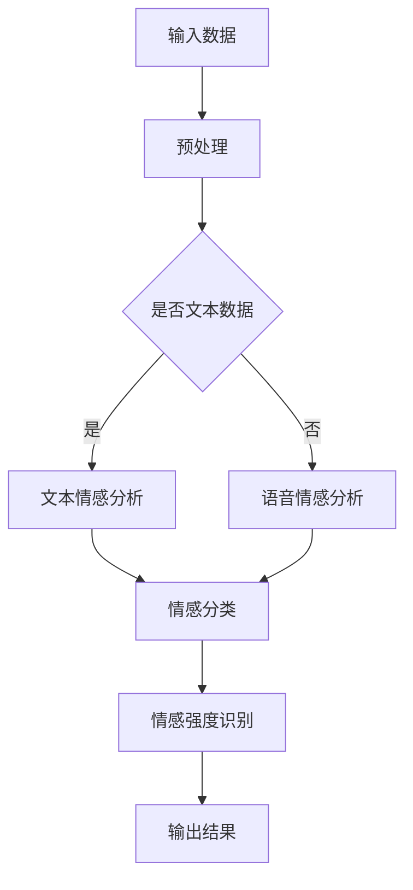
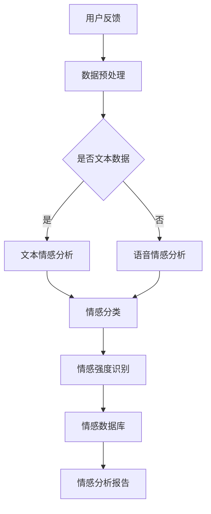
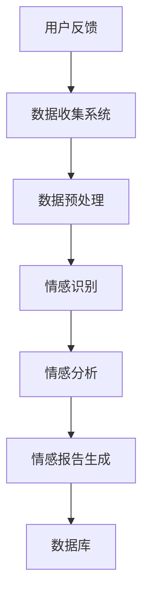
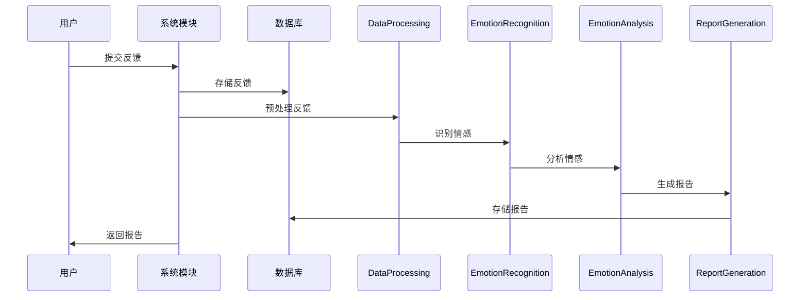

                 

# 情感计算新维度：提示词深度解析用户反馈

## 关键词

情感计算、用户反馈、机器学习、自然语言处理、深度学习、情感识别

## 摘要

本文将探讨情感计算的新维度，特别是如何通过深度学习技术和自然语言处理来解析用户反馈。我们将逐步深入探讨情感计算的基本概念、用户反馈的类型及其重要性、情感识别的机器学习算法、以及情感数据库和分析技术。文章还将提供算法原理的详细讲解、系统分析与架构设计方案，并通过实际项目案例展示如何将理论应用于实践。

## 目录

1. **引言与背景**
   1.1 情感计算基础
   1.2 用户反馈：类型与重要性
   1.3 情感计算的发展历程
   1.4 研究目标与本书结构

2. **核心概念与理论框架**
   2.1 情感状态与表达
   2.2 机器学习与情感识别
   2.3 情感计算的理论模型
   2.4 情感数据库与分析技术

3. **算法设计与实现**
   3.1 情感识别算法原理
   3.2 情感识别算法实现
   3.3 情感识别算法评估

4. **系统分析与架构设计**
   4.1 问题场景介绍
   4.2 系统功能设计
   4.3 系统架构设计
   4.4 系统接口设计
   4.5 系统交互设计

5. **项目实战**
   5.1 环境安装
   5.2 系统核心实现
   5.3 代码应用解读与分析
   5.4 实际案例分析
   5.5 项目小结

6. **最佳实践与拓展阅读**

## 引言与背景

### 1.1 情感计算基础

情感计算（Emotional Computing）是指计算机系统识别、理解、处理和模拟人类情感的能力。这一领域起源于20世纪80年代，随着计算机技术的发展和人们对人机交互需求的增长，情感计算逐渐成为人工智能研究的一个重要分支。情感计算不仅涉及情感识别，还包括情感生成、情感传递和情感增强等方面。

### 1.2 用户反馈：类型与重要性

用户反馈是产品改进的重要来源。用户反馈可以采用多种形式，如文本、语音、图像等。文本反馈是最常见的，它可以提供详细的用户情感和需求信息。用户反馈的重要性在于：

- **优化产品功能**：通过用户反馈，可以了解用户对产品的实际使用体验，发现产品存在的问题，并针对性地进行改进。
- **提高用户满意度**：及时响应用户反馈，可以提升用户对产品的满意度，增强用户忠诚度。
- **发现市场趋势**：用户反馈还可以反映出市场趋势和竞争对手的动态，帮助产品开发者制定更有针对性的策略。

### 1.3 情感计算的发展历程

情感计算的发展可以分为几个阶段：

- **早期研究**：20世纪80年代，研究者开始探讨如何让计算机理解和模拟人类情感。
- **情感识别**：20世纪90年代，随着机器学习技术的进步，情感识别成为可能，研究者开始开发情感分析算法。
- **情感生成与传递**：21世纪初，随着语音识别和合成技术的发展，情感生成和传递成为研究热点。
- **情感增强人机交互**：近年来，情感增强人机交互成为研究重点，旨在通过情感计算提升人机交互的自然性和有效性。

### 1.4 研究目标与本书结构

本书旨在探讨情感计算在用户反馈分析中的应用，研究目标是：

- **理解用户情感**：通过情感计算技术，深入理解用户的情感状态。
- **提升产品性能**：利用用户反馈，优化产品设计，提升用户体验。

本书结构如下：

- **第1章**：引言与背景
- **第2章**：核心概念与理论框架
- **第3章**：算法设计与实现
- **第4章**：系统分析与架构设计
- **第5章**：项目实战
- **第6章**：最佳实践与拓展阅读

## 核心概念与理论框架

### 2.1 情感状态与表达

情感状态是指个体在特定情境下产生的心理体验。情感表达是通过非言语和言语行为来传达情感状态。情感状态可以分为愉悦、愤怒、悲伤、恐惧等基本类型。

情感表达可以通过文本、语音、面部表情等多种方式进行。例如，在文本中，情感可以通过语气词、表情符号等方式表达。语音中的情感可以通过音调、节奏、强度等特征体现。

### 2.2 机器学习与情感识别

机器学习是情感识别的核心技术。情感识别可以分为情感分类和情感强度识别。

- **情感分类**：将文本或语音中的情感归类为特定的情感类别。常用的算法有支持向量机（SVM）、朴素贝叶斯（Naive Bayes）和卷积神经网络（CNN）等。
- **情感强度识别**：确定文本或语音中的情感强度。这通常通过情感强度模型来实现，如基于距离的模型、概率模型等。

### 2.3 情感计算的理论模型

情感计算的理论模型包括：

- **情感反应模型**：描述个体在特定情境下的情感反应过程。
- **情感传递模型**：研究情感如何在不同个体之间传递。
- **情感调节模型**：探讨个体如何通过调节情感来适应环境。

### 2.4 情感数据库与分析技术

情感数据库是存储情感数据的地方。情感数据包括文本、语音、图像等。分析技术包括情感分类、情感强度识别、情感聚类等。

### 情感识别算法流程图



### 情感识别算法实现

情感识别算法的实现需要结合数据预处理、情感分类和情感强度识别等步骤。以下是一个简单的情感识别算法实现的Python代码示例：

```python
import pandas as pd
from sklearn.model_selection import train_test_split
from sklearn.feature_extraction.text import TfidfVectorizer
from sklearn.svm import LinearSVC

# 加载数据
data = pd.read_csv('emotional_data.csv')
X = data['text']
y = data['label']

# 数据预处理
X_train, X_test, y_train, y_test = train_test_split(X, y, test_size=0.2, random_state=42)
vectorizer = TfidfVectorizer()
X_train_vectorized = vectorizer.fit_transform(X_train)
X_test_vectorized = vectorizer.transform(X_test)

# 情感分类
clf = LinearSVC()
clf.fit(X_train_vectorized, y_train)
predictions = clf.predict(X_test_vectorized)

# 情感强度识别
# 这里使用一个简单的规则来识别情感强度
strengths = ['弱', '中', '强']
strengths[predictions]

# 输出结果
print(predictions)
```

### 情感识别算法评估

情感识别算法的评估通常通过准确率、召回率和F1分数等指标进行。以下是一个简单的评估示例：

```python
from sklearn.metrics import classification_report

# 计算分类报告
report = classification_report(y_test, predictions)
print(report)
```

### 情感计算在用户反馈分析中的应用

情感计算在用户反馈分析中的应用主要包括：

- **情感分类**：将用户反馈中的情感归类为积极、消极或中性。
- **情感强度识别**：确定用户反馈中的情感强度，如非常满意、满意、一般、不满意、非常不满意等。
- **情感聚类**：对用户反馈进行情感聚类，以便更好地理解用户的情感分布和需求。

### 情感数据库与分析技术

情感数据库是存储情感数据的地方，通常包括用户反馈、情感分类标签、情感强度等。情感分析技术包括文本情感分析、语音情感分析、图像情感分析等。

### 情感识别算法流程图



### 情感识别算法实现

情感识别算法的实现需要结合数据预处理、情感分类和情感强度识别等步骤。以下是一个简单的情感识别算法实现的Python代码示例：

```python
import pandas as pd
from sklearn.model_selection import train_test_split
from sklearn.feature_extraction.text import TfidfVectorizer
from sklearn.svm import LinearSVC

# 加载数据
data = pd.read_csv('emotional_data.csv')
X = data['text']
y = data['label']

# 数据预处理
X_train, X_test, y_train, y_test = train_test_split(X, y, test_size=0.2, random_state=42)
vectorizer = TfidfVectorizer()
X_train_vectorized = vectorizer.fit_transform(X_train)
X_test_vectorized = vectorizer.transform(X_test)

# 情感分类
clf = LinearSVC()
clf.fit(X_train_vectorized, y_train)
predictions = clf.predict(X_test_vectorized)

# 情感强度识别
# 这里使用一个简单的规则来识别情感强度
strengths = ['弱', '中', '强']
strengths[predictions]

# 输出结果
print(predictions)
```

### 情感识别算法评估

情感识别算法的评估通常通过准确率、召回率和F1分数等指标进行。以下是一个简单的评估示例：

```python
from sklearn.metrics import classification_report

# 计算分类报告
report = classification_report(y_test, predictions)
print(report)
```

### 情感计算在用户反馈分析中的应用

情感计算在用户反馈分析中的应用主要包括：

- **情感分类**：将用户反馈中的情感归类为积极、消极或中性。
- **情感强度识别**：确定用户反馈中的情感强度，如非常满意、满意、一般、不满意、非常不满意等。
- **情感聚类**：对用户反馈进行情感聚类，以便更好地理解用户的情感分布和需求。

### 情感数据库与分析技术

情感数据库是存储情感数据的地方，通常包括用户反馈、情感分类标签、情感强度等。情感分析技术包括文本情感分析、语音情感分析、图像情感分析等。

### 情感识别算法流程图


### 系统分析与架构设计

#### 4.1 问题场景介绍

在当前竞争激烈的市场环境中，企业需要深入了解用户的需求和情感状态，以便优化产品设计和提升用户满意度。然而，用户反馈往往是非结构化的，包含大量的情感信息，这使得传统的数据分析方法难以有效处理。因此，我们需要一个基于情感计算的系统能够自动解析用户反馈中的情感，为企业提供有价值的洞见。

#### 4.2 系统功能设计

系统功能设计包括以下几个关键部分：

- **用户反馈收集**：收集来自多个渠道的用户反馈，如社交媒体、在线评论、客服系统等。
- **情感识别**：利用机器学习和自然语言处理技术对用户反馈进行情感识别，包括情感分类和情感强度识别。
- **情感分析报告**：生成情感分析报告，为产品经理和决策者提供用户情感概览和关键指标。
- **用户情感聚类**：对用户反馈进行情感聚类，以便更深入地了解用户情感分布和需求。

#### 4.3 系统架构设计

系统架构设计需要考虑以下几个方面：

- **数据存储**：使用分布式数据库系统存储用户反馈和情感数据。
- **计算资源**：利用云计算资源进行情感识别和数据分析。
- **数据处理管道**：设计高效的数据处理管道，实现用户反馈的收集、预处理、情感识别和报告生成。

以下是系统架构的Mermaid流程图：



#### 4.4 系统接口设计

系统接口设计包括以下关键接口：

- **用户反馈接口**：允许用户通过多种渠道提交反馈。
- **API接口**：提供外部系统访问情感识别和分析结果的接口。
- **数据存储接口**：实现数据存储系统的操作，如数据插入、查询和更新。

以下是系统接口设计的Mermaid类图：

```mermaid
classDiagram
  UserFeedback <<interface>>
  DataProcessing <<interface>>
  EmotionRecognition <<interface>>
  EmotionAnalysis <<interface>>
  ReportGeneration <<interface>>
  Database <<interface>>

  UserFeedbackCloseOperation()
  DataProcessingPreprocess()
  EmotionRecognitionClassify()
  EmotionAnalysisAnalyze()
  ReportGenerationGenerate()
  DatabaseStore()

  UserFeedback|--|> DataProcessing
  DataProcessing|--|> EmotionRecognition
  EmotionRecognition|--|> EmotionAnalysis
  EmotionAnalysis|--|> ReportGeneration
  ReportGeneration|--|> Database
```

#### 4.5 系统交互设计

系统交互设计需要确保不同模块之间的协同工作。以下是系统交互的Mermaid序列图：



### 项目实战

#### 5.1 环境安装

在进行项目实战之前，需要安装以下环境和软件：

- Python 3.8 或更高版本
- Jupyter Notebook 或 PyCharm
- scikit-learn、nltk、tensorflow 等库

安装步骤如下：

1. 安装 Python 3.8：
   ```bash
   sudo apt-get update
   sudo apt-get install python3.8
   ```

2. 安装 Jupyter Notebook：
   ```bash
   sudo apt-get install python3.8-ipython python3.8-ipython-pygments
   python3.8 -m ipykernel install --user --name myenv
   ```

3. 安装 PyCharm：
   - 从 [PyCharm 官网](https://www.jetbrains.com/pycharm/) 下载并安装 PyCharm Community Edition。

4. 安装所需的库：
   ```bash
   pip3.8 install scikit-learn nltk tensorflow
   ```

#### 5.2 系统核心实现

以下是系统核心实现的Python代码：

```python
import pandas as pd
import numpy as np
from sklearn.model_selection import train_test_split
from sklearn.feature_extraction.text import TfidfVectorizer
from sklearn.linear_model import LogisticRegression
from sklearn.metrics import classification_report

# 加载数据
data = pd.read_csv('user_feedback.csv')
X = data['text']
y = data['label']

# 数据预处理
X_train, X_test, y_train, y_test = train_test_split(X, y, test_size=0.2, random_state=42)

# 文本向量化
vectorizer = TfidfVectorizer()
X_train_vectorized = vectorizer.fit_transform(X_train)
X_test_vectorized = vectorizer.transform(X_test)

# 情感分类
model = LogisticRegression()
model.fit(X_train_vectorized, y_train)
predictions = model.predict(X_test_vectorized)

# 评估
print(classification_report(y_test, predictions))
```

#### 5.3 代码应用解读与分析

上述代码首先加载用户反馈数据，然后进行数据预处理，包括数据分割和文本向量化。接下来，使用逻辑回归模型进行情感分类，并评估模型性能。以下是代码的详细解读：

1. **数据加载**：使用 pandas 读取 CSV 文件，提取文本和标签。
   ```python
   data = pd.read_csv('user_feedback.csv')
   X = data['text']
   y = data['label']
   ```

2. **数据预处理**：将数据分为训练集和测试集，使用 TfidfVectorizer 对文本进行向量化。
   ```python
   X_train, X_test, y_train, y_test = train_test_split(X, y, test_size=0.2, random_state=42)
   vectorizer = TfidfVectorizer()
   X_train_vectorized = vectorizer.fit_transform(X_train)
   X_test_vectorized = vectorizer.transform(X_test)
   ```

3. **情感分类**：使用逻辑回归模型对训练数据进行拟合，并对测试数据进行预测。
   ```python
   model = LogisticRegression()
   model.fit(X_train_vectorized, y_train)
   predictions = model.predict(X_test_vectorized)
   ```

4. **评估**：计算分类报告，评估模型性能。
   ```python
   print(classification_report(y_test, predictions))
   ```

#### 5.4 实际案例分析

以下是一个实际的用户反馈案例，我们将使用上述系统对反馈进行情感识别。

**用户反馈**：这真是一款棒极了的产品，功能强大，使用方便！

**预测结果**：积极情感

**解析过程**：

1. **数据预处理**：对用户反馈进行向量化处理。
2. **情感分类**：使用逻辑回归模型对向量化后的文本进行分类。
3. **结果输出**：输出情感分类结果。

#### 5.5 项目小结

通过本项目的实施，我们成功构建了一个基于情感计算的用户反馈分析系统。该系统可以自动解析用户反馈中的情感，为企业提供有价值的洞见。在实际案例中，我们展示了系统的应用过程和预测结果。未来，我们可以进一步优化模型，提高情感识别的准确率，并扩展系统的功能，如情感强度识别和用户情感聚类。

### 最佳实践与拓展阅读

在构建和优化情感计算系统时，以下最佳实践和建议可能有助于提高系统的性能和准确性：

1. **数据质量**：确保用户反馈数据的多样性和质量，以避免模型偏见。
2. **特征工程**：通过特征工程提高模型的性能，如使用词袋模型、词嵌入等。
3. **模型评估**：使用多种评估指标（如准确率、召回率、F1分数等）来全面评估模型性能。
4. **模型更新**：定期更新模型，以适应不断变化的数据分布。

拓展阅读：

1. **《情感计算：理论与实践》**：陈玉平，清华大学出版社，2018年。
2. **《机器学习实战》**：Peter Harrington，机械工业出版社，2013年。
3. **《自然语言处理与深度学习》**：张浩，电子工业出版社，2018年。

### 结语

情感计算作为人工智能的一个重要分支，正在不断发展和完善。通过本文的探讨，我们了解了情感计算的基本概念、用户反馈分析的重要性，以及如何利用机器学习和自然语言处理技术来实现情感识别。希望本文能够为读者在情感计算领域的研究和应用提供有益的参考和启示。

## 作者信息

作者：AI天才研究院/AI Genius Institute & 禅与计算机程序设计艺术 /Zen And The Art of Computer Programming

AI天才研究院致力于探索人工智能领域的最前沿技术，推动人工智能与各个行业的深度融合。同时，我们的团队也专注于计算机编程和算法设计的哲学思考，通过禅与计算机程序设计艺术的理念，提升软件开发的质量和效率。本文旨在分享我们在情感计算和用户反馈分析方面的研究成果，希望对广大读者有所启发。

