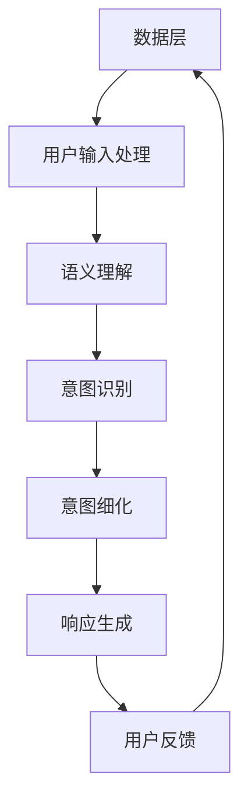
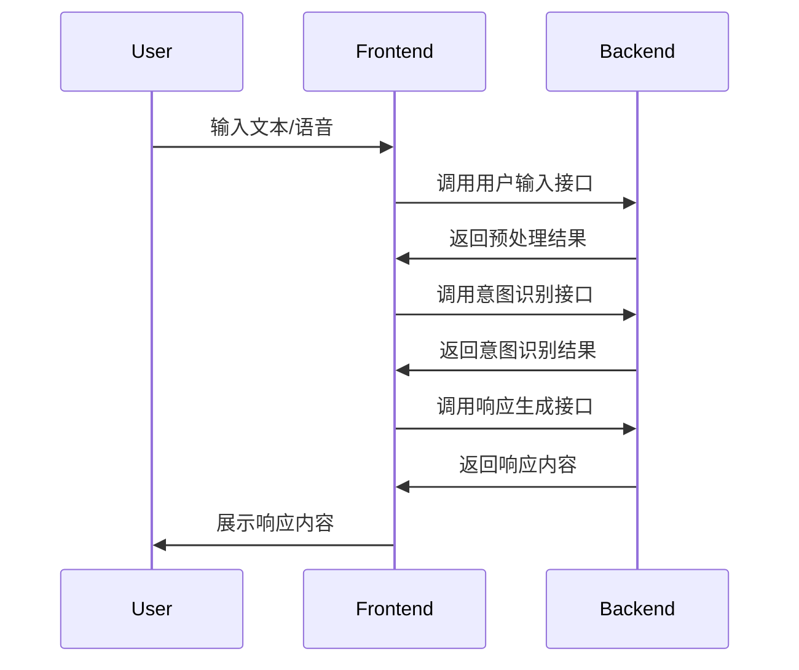

                 

## 引言

在信息化社会飞速发展的今天，用户的需求变得日益多样化和动态化，如何准确把握用户的意图成为众多企业和开发者面临的重大挑战。用户意图识别（User Intent Recognition）作为一种重要的技术，正日益受到关注。本文将深入探讨用户意图识别的核心概念、方法及应用场景，旨在为广大开发者提供一套系统、全面的技术指南。

### **一、问题背景与核心概念**

#### **1.1 问题背景**

随着互联网和智能设备的普及，用户与系统之间的交互方式发生了翻天覆地的变化。从传统的命令行界面到如今的自然语言交互，用户的需求变得更加隐蔽和复杂。如何在海量信息中快速、准确地理解用户的意图，成为开发者需要解决的关键问题。

**问题描述：** 在实际应用中，用户的需求可能表现为文本、语音、图像等多种形式。如何将这些多样化的输入转化为开发者可理解和处理的意图，是用户意图识别需要解决的核心问题。

**问题解决：** 通过用户意图识别，开发者可以实现以下目标：
- 提高交互效率，减少用户等待时间。
- 提升用户体验，降低用户错误率。
- 实现个性化推荐，满足用户个性化需求。

#### **1.2 核心概念**

**概念定义：** 用户意图识别，是指通过分析用户输入，理解用户的真实需求，并做出相应响应的过程。

**属性特征对比：**

| 特征          | 描述                                       |
| ------------- | ------------------------------------------ |
| 准确性        | 用户意图识别的准确性直接影响用户体验。      |
| 速度          | 快速识别用户意图可以提高服务响应速度。      |
| 可扩展性      | 系统能够适应不断变化的需求和用户规模。      |
| 可解释性      | 用户意图识别过程应具有一定的可解释性，以增强用户信任。 |

#### **1.3 联系与拓展**

**与自然语言处理的关系：** 用户意图识别是自然语言处理（NLP）领域的一个关键任务，依赖于NLP的词嵌入、句法分析等技术。

**与其他AI技术的结合：** 用户意图识别可以与其他AI技术，如机器学习、深度学习等相结合，提升识别效果。例如，深度学习可以用于构建复杂的意图识别模型，提高识别的准确性和效率。

### **二、用户意图识别的方法**

用户意图识别的方法可以分为基于规则的方法、基于机器学习的方法和基于深度学习的方法。以下将分别介绍这三种方法的基本原理、流程和优缺点。

#### **2.1 基于规则的方法**

**原理与流程：** 基于规则的方法通过预设的规则库，将用户输入映射到特定的意图类别。具体流程如下：
1. **输入预处理：** 对用户输入进行分词、词性标注等预处理操作。
2. **规则匹配：** 将预处理后的输入与规则库中的规则进行匹配，找到匹配度最高的规则。
3. **意图分类：** 根据匹配到的规则，将用户输入分类到预定义的意图类别中。

**优缺点：**
- **优点：**
  - 简单易懂，易于实现和部署。
  - 实施成本较低，适用于资源有限的场景。
- **缺点：**
  - 难以应对复杂的用户需求，特别是多义词、歧义句等情况。
  - 规则维护成本高，需要不断更新和调整。

#### **2.2 基于机器学习的方法**

**原理与流程：** 基于机器学习的方法使用机器学习算法，从大量数据中学习用户意图的模式。具体流程如下：
1. **数据收集与预处理：** 收集大量的用户交互数据，并进行预处理，如分词、词性标注、去除噪声等。
2. **特征提取：** 将预处理后的数据转化为机器学习算法可处理的特征向量。
3. **模型训练：** 使用训练数据集，通过机器学习算法（如朴素贝叶斯、支持向量机等）训练意图识别模型。
4. **模型评估与优化：** 使用测试数据集评估模型性能，通过调整模型参数和特征工程等方法优化模型。

**优缺点：**
- **优点：**
  - 自动化学习，能够适应复杂多样的用户需求。
  - 具有较好的泛化能力，适用于大规模用户场景。
- **缺点：**
  - 需要大量标注数据，数据质量直接影响模型效果。
  - 训练过程复杂，计算资源消耗大。

#### **2.3 基于深度学习的方法**

**原理与流程：** 基于深度学习的方法使用深度神经网络，直接从原始数据中学习用户意图。具体流程如下：
1. **数据收集与预处理：** 同基于机器学习的方法。
2. **特征提取：** 使用卷积神经网络（CNN）或循环神经网络（RNN）提取文本特征。
3. **模型训练：** 使用训练数据集训练深度神经网络模型。
4. **模型评估与优化：** 同基于机器学习的方法。

**优缺点：**
- **优点：**
  - 强大的建模能力，能够处理复杂任务。
  - 具有较好的性能，特别是在处理长文本和语义理解方面。
- **缺点：**
  - 计算资源消耗大，训练时间较长。
  - 模型解释性较弱，难以理解模型决策过程。

### **三、用户意图识别的应用场景**

用户意图识别广泛应用于各种场景，下面将介绍几个典型的应用场景。

#### **3.1 聊天机器人**

**场景描述：** 通过用户意图识别，实现与用户的自然对话。

**应用实例：** 智能客服、智能助手等。

**特点与挑战：**
- **特点：**
  - 需要快速、准确地识别用户意图，以提供及时、准确的响应。
  - 用户意图多样化，需要处理文本、语音、图像等多种形式的输入。
- **挑战：**
  - 处理多义词、歧义句等复杂情况，提高识别准确率。
  - 保证聊天机器人的自然语言生成能力，实现流畅的对话体验。

#### **3.2 搜索引擎**

**场景描述：** 通过用户意图识别，优化搜索结果。

**应用实例：** 百度、谷歌等搜索引擎。

**特点与挑战：**
- **特点：**
  - 需要理解用户输入的表面含义，提取核心意图。
  - 根据用户意图，提供相关、准确的搜索结果。
- **挑战：**
  - 提高意图识别的准确性，减少搜索结果中的噪音。
  - 处理长尾搜索词和罕见查询，提高搜索效果。

#### **3.3 电子商务**

**场景描述：** 通过用户意图识别，实现个性化推荐。

**应用实例：** 淘宝、京东等电商平台。

**特点与挑战：**
- **特点：**
  - 需要理解用户的购物意图，提供个性化商品推荐。
  - 根据用户行为和偏好，不断调整推荐策略。
- **挑战：**
  - 提高意图识别的准确性，减少推荐系统的冷启动问题。
  - 保证推荐结果的多样性和新颖性，满足用户多样化需求。

### **四、用户意图识别的未来发展趋势**

随着人工智能技术的不断进步，用户意图识别技术也在不断发展。以下是一些未来发展趋势：

- **多模态用户意图识别：** 结合文本、语音、图像等多种输入模态，实现更准确、更全面的用户意图识别。
- **强化学习与用户意图识别：** 利用强化学习算法，动态调整用户意图识别策略，提高识别准确率和效率。
- **隐私保护与用户意图识别：** 在用户意图识别过程中，关注隐私保护问题，确保用户数据的安全和隐私。
- **跨领域用户意图识别：** 通过跨领域的知识整合，提高用户意图识别的泛化能力，适应更广泛的应用场景。

### **五、总结**

用户意图识别作为一种重要的技术，在信息化社会中具有广泛的应用前景。本文从背景介绍、核心概念、方法、应用场景和发展趋势等方面进行了系统阐述。希望通过本文，读者能够对用户意图识别有一个全面、深入的了解，为实际应用提供有益的参考。

在未来的研究和开发中，我们应继续关注用户意图识别技术的创新和优化，结合多模态数据、强化学习等技术，提高识别准确率和效率，为用户提供更好的服务体验。

## 第一部分：背景介绍

### **第1章：问题背景与核心概念**

#### **1.1 问题背景**

在信息化社会飞速发展的今天，用户的需求变得日益多样化和动态化。如何准确把握用户的意图成为众多企业和开发者面临的重要挑战。用户意图识别（User Intent Recognition）作为一种重要的技术，正日益受到关注。

**问题描述：** 在实际应用中，用户的需求可能表现为文本、语音、图像等多种形式。如何将这些多样化的输入转化为开发者可理解和处理的意图，是用户意图识别需要解决的核心问题。

**问题解决：** 通过用户意图识别，开发者可以实现以下目标：
1. 提高交互效率，减少用户等待时间。
2. 提升用户体验，降低用户错误率。
3. 实现个性化推荐，满足用户个性化需求。

**问题分类：** 根据用户意图的不同，问题可以分为以下几类：
- **信息检索类：** 如搜索引擎、信息推荐等。
- **任务执行类：** 如语音助手、聊天机器人等。
- **情感分析类：** 如社交媒体情感分析、客户满意度调查等。

#### **1.2 核心概念**

**概念定义：** 用户意图识别，是指通过分析用户输入，理解用户的真实需求，并做出相应响应的过程。

**属性特征对比：**

| 特征          | 描述                                       |
| ------------- | ------------------------------------------ |
| 准确性        | 用户意图识别的准确性直接影响用户体验。      |
| 速度          | 快速识别用户意图可以提高服务响应速度。      |
| 可扩展性      | 系统能够适应不断变化的需求和用户规模。      |
| 可解释性      | 用户意图识别过程应具有一定的可解释性，以增强用户信任。 |

**核心概念的关系与拓展：**
- **与自然语言处理（NLP）的关系：** 用户意图识别是自然语言处理（NLP）领域的一个关键任务，依赖于NLP的词嵌入、句法分析等技术。
- **与其他AI技术的结合：** 用户意图识别可以与其他AI技术，如机器学习、深度学习等相结合，提升识别效果。例如，深度学习可以用于构建复杂的意图识别模型，提高识别的准确性和效率。

### **1.3 联系与拓展**

**用户意图识别的层次结构：**
用户意图识别通常包括三个层次：语义理解、意图分类、意图细化。

**层次关系：**
- **语义理解：** 理解用户输入的表面含义。
- **意图分类：** 根据语义理解结果，将用户意图分类到预定义的类别中。
- **意图细化：** 在意图分类的基础上，对意图进行进一步细化，以获得更具体的意图信息。

**用户意图识别的技术要素：**
用户意图识别涉及的技术要素包括自然语言处理（NLP）、机器学习、深度学习等。

**关系与交互：**
- **NLP：** 提供文本预处理、词嵌入、句法分析等技术，为意图识别提供基础数据。
- **机器学习：** 用于建立意图识别模型，通过大量数据训练，提高识别准确率。
- **深度学习：** 利用神经网络，实现复杂模式的自动学习，提高意图识别的效率和准确性。

### **1.4 案例分析**

**案例分析1：** 智能客服

**场景描述：** 智能客服系统通过用户意图识别，自动识别用户的问题并给出相应的回答。

**用户意图识别过程：**
1. 语义理解：对用户输入的文本进行分词、词性标注等处理，提取关键信息。
2. 意图分类：根据提取的关键信息，将用户意图分类到预定义的类别中，如产品咨询、售后服务等。
3. 意图细化：在意图分类的基础上，进一步细化意图，如产品咨询中的具体型号、问题类型等。

**案例分析2：** 个性化推荐

**场景描述：** 电商平台通过用户意图识别，为用户推荐感兴趣的商品。

**用户意图识别过程：**
1. 语义理解：分析用户的历史浏览记录、购买记录等，提取用户兴趣信息。
2. 意图分类：根据用户兴趣信息，将用户意图分类到预定义的类别中，如服装、电子产品等。
3. 意图细化：在意图分类的基础上，进一步细化意图，如推荐特定品牌、特定型号的商品。

### **1.5 总结**

本章介绍了用户意图识别的背景、核心概念、层次结构、技术要素以及案例分析。用户意图识别作为一种重要的技术，在信息化社会中具有广泛的应用前景。通过本章的介绍，读者可以初步了解用户意图识别的基本概念和方法，为后续章节的深入学习打下基础。

### **第2章：用户意图识别的方法**

用户意图识别是人工智能和自然语言处理领域的一个核心任务，旨在理解用户的语言输入并准确识别其意图。本章将详细介绍三种主要的用户意图识别方法：基于规则的方法、基于机器学习的方法和基于深度学习的方法。我们将逐一分析每种方法的原理、流程、优缺点，并通过具体实例帮助读者理解其应用场景。

#### **2.1 基于规则的方法**

**原理与流程：**
基于规则的方法是通过预设一系列规则，将用户输入映射到预定义的意图类别中。该方法的核心在于定义一组逻辑条件，当用户输入与条件匹配时，系统就会判断用户意图并作出响应。

1. **输入预处理：** 首先对用户输入进行分词、词性标注等预处理操作，以便于后续的规则匹配。
2. **规则匹配：** 将预处理后的输入与规则库中的规则进行匹配。规则通常以“如果...则...”的形式表达，例如，“如果用户输入包含‘订单’和‘查询’，则意图为‘订单查询’”。
3. **意图分类：** 根据匹配到的规则，将用户输入分类到预定义的意图类别中，并生成相应的响应。

**优缺点：**
- **优点：**
  - **简单易懂：** 基于规则的系统通常易于开发和部署。
  - **实施成本较低：** 不需要复杂的算法和大量数据。
- **缺点：**
  - **适应性差：** 难以应对复杂的用户需求和语境变化。
  - **维护成本高：** 随着用户需求的增加，规则库需要不断更新和扩展。

**应用实例：**
- **智能客服系统：** 通过预设规则，智能客服可以自动识别用户的常见问题，并提供相应的解决方案。
- **语音助手：** 例如，苹果的Siri和亚马逊的Alexa，在用户输入特定指令时，通过规则匹配来执行相应的任务。

#### **2.2 基于机器学习的方法**

**原理与流程：**
基于机器学习的方法利用机器学习算法，从大量的标注数据中学习用户意图的模式。这种方法能够自动识别复杂的用户需求，提高识别的准确性和效率。

1. **数据收集与预处理：** 收集大量的用户交互数据，并进行预处理，如分词、词性标注、去除噪声等。
2. **特征提取：** 将预处理后的数据转化为机器学习算法可处理的特征向量。特征提取是关键步骤，直接影响到模型的效果。
3. **模型训练：** 使用训练数据集，通过机器学习算法（如朴素贝叶斯、支持向量机等）训练意图识别模型。
4. **模型评估与优化：** 使用测试数据集评估模型性能，通过调整模型参数和特征工程等方法优化模型。

**优缺点：**
- **优点：**
  - **自动化学习：** 能够自动适应复杂多样的用户需求。
  - **泛化能力强：** 可以处理大规模的用户数据。
- **缺点：**
  - **需要大量标注数据：** 数据质量直接影响模型效果。
  - **计算资源消耗大：** 训练过程复杂，需要大量的计算资源。

**应用实例：**
- **聊天机器人：** 基于机器学习的方法可以用于聊天机器人中，自动识别用户的问题，并生成相应的回答。
- **推荐系统：** 例如，亚马逊和Netflix等平台，通过用户意图识别来推荐商品和内容。

#### **2.3 基于深度学习的方法**

**原理与流程：**
基于深度学习的方法使用深度神经网络，直接从原始数据中学习用户意图。深度学习具有强大的建模能力，能够处理复杂任务，并在意图识别领域取得了显著成果。

1. **数据收集与预处理：** 同基于机器学习的方法。
2. **特征提取：** 使用卷积神经网络（CNN）或循环神经网络（RNN）提取文本特征。深度学习模型能够自动提取高层次的语义特征，无需人工设计特征。
3. **模型训练：** 使用训练数据集训练深度神经网络模型。深度学习模型通常具有多个隐藏层，能够学习复杂的非线性关系。
4. **模型评估与优化：** 同基于机器学习的方法。

**优缺点：**
- **优点：**
  - **强大的建模能力：** 能够处理复杂任务，特别是在处理长文本和语义理解方面。
  - **高准确率：** 深度学习模型在意图识别任务上通常具有较好的性能。
- **缺点：**
  - **计算资源消耗大：** 训练时间较长，需要大量的计算资源。
  - **模型解释性较弱：** 难以理解模型决策过程。

**应用实例：**
- **语音助手：** 基于深度学习的方法可以用于语音助手，实现语音输入的意图识别。
- **智能搜索：** 例如，百度和谷歌等搜索引擎，通过深度学习模型优化搜索结果，提高用户满意度。

### **2.4 方法比较与选择**

**方法比较：**
- **基于规则的方法：** 简单易懂，实施成本低，但难以应对复杂的用户需求。
- **基于机器学习的方法：** 自动化学习，适应性强，但需要大量标注数据，计算资源消耗大。
- **基于深度学习的方法：** 强大的建模能力，高准确率，但计算资源消耗大，模型解释性较弱。

**选择依据：**
- **应用场景：** 对于简单、规则性较强的应用，可以选择基于规则的方法。对于复杂、多样化需求的应用，可以选择基于机器学习或深度学习的方法。
- **数据资源：** 如果数据资源充足，可以选择基于机器学习或深度学习的方法。如果数据资源有限，可以选择基于规则的方法。
- **计算资源：** 如果计算资源充足，可以选择基于深度学习的方法。如果计算资源有限，可以选择基于机器学习的方法。

### **2.5 实际案例解析**

**案例1：** 智能客服系统

**场景描述：** 一家电商公司希望通过智能客服系统自动回答用户的问题。

**解决方案：**
- **基于规则的方法：** 定义一系列规则，如“如果用户输入包含‘订单’和‘查询’，则意图为‘订单查询’”。这种方法简单易行，但难以应对复杂的用户需求。
- **基于机器学习的方法：** 收集大量用户交互数据，使用朴素贝叶斯算法训练意图识别模型。这种方法能够自动适应复杂多样的用户需求，但需要大量标注数据。
- **基于深度学习的方法：** 使用卷积神经网络（CNN）提取文本特征，训练意图识别模型。这种方法具有强大的建模能力，能够处理复杂任务。

**结论：** 最终选择基于深度学习的方法，因为该方法能够更好地处理复杂用户需求，提高识别准确率。

**案例2：** 个性化推荐系统

**场景描述：** 一家电商平台希望通过个性化推荐系统为用户提供感兴趣的商品。

**解决方案：**
- **基于规则的方法：** 通过预设规则，根据用户历史购买记录和浏览记录推荐商品。这种方法简单易懂，但难以应对用户多样化的需求。
- **基于机器学习的方法：** 收集用户行为数据，使用协同过滤算法训练推荐模型。这种方法能够自动适应用户行为变化，但需要大量数据。
- **基于深度学习的方法：** 使用深度学习模型提取用户兴趣特征，训练推荐模型。这种方法能够更好地理解用户兴趣，提高推荐效果。

**结论：** 最终选择基于深度学习的方法，因为该方法能够更准确地提取用户兴趣特征，提高推荐效果。

### **2.6 总结**

本章介绍了用户意图识别的三种主要方法：基于规则的方法、基于机器学习的方法和基于深度学习的方法。每种方法都有其独特的原理、流程和应用场景。在实际应用中，应根据具体需求和资源选择合适的方法，以提高意图识别的准确性和效率。

### **第3章：用户意图识别的应用场景**

用户意图识别技术在多个领域有着广泛的应用，以下将介绍几种典型的应用场景，包括聊天机器人、搜索引擎和电子商务。通过这些场景，我们将分析用户意图识别在实际应用中的具体作用和挑战。

#### **3.1 聊天机器人**

**场景描述：**
聊天机器人是一种与用户进行实时交互的人工智能系统，能够通过文本或语音与用户交流，提供信息查询、问题解答、任务执行等服务。

**用户意图识别的作用：**
1. **自动理解用户问题：** 聊天机器人通过用户意图识别，能够自动理解用户的意图和需求，从而提供准确的答复。
2. **优化用户体验：** 准确的意图识别使得聊天机器人能够提供个性化的服务，提高用户满意度。
3. **降低人力成本：** 自动化的意图识别可以处理大量的用户查询，减少对人工客服的依赖。

**挑战：**
1. **多义词和歧义句：** 自然语言中存在大量多义词和歧义句，导致意图识别困难。
2. **上下文理解：** 聊天机器人在进行多轮对话时，需要理解上下文信息，这对意图识别提出了更高的要求。

**应用实例：**
- **智能客服：** 在电商、银行、航空等行业，智能客服通过用户意图识别，能够快速响应用户问题，提供解决方案。
- **虚拟助手：** 如苹果的Siri、亚马逊的Alexa等虚拟助手，通过用户意图识别，能够执行语音指令，完成设置闹钟、发送消息等任务。

#### **3.2 搜索引擎**

**场景描述：**
搜索引擎是一种通过用户输入的查询关键词，返回相关网页和信息的系统。随着搜索引擎技术的发展，用户意图识别在优化搜索结果中起到了关键作用。

**用户意图识别的作用：**
1. **提升搜索准确率：** 用户意图识别能够理解用户查询的深层意图，从而返回更相关的搜索结果。
2. **优化用户体验：** 准确识别用户意图可以减少搜索噪音，提高用户查找信息的效率。
3. **个性化搜索结果：** 根据用户的历史搜索行为和偏好，提供个性化的搜索结果。

**挑战：**
1. **长尾查询处理：** 长尾查询通常包含大量非标准词汇，意图识别难度较大。
2. **实时性需求：** 用户期望搜索引擎能够迅速响应用户查询，这对系统的实时处理能力提出了挑战。

**应用实例：**
- **百度搜索：** 百度通过用户意图识别技术，优化搜索结果，提高用户满意度。
- **谷歌搜索：** 谷歌利用用户意图识别，对用户查询进行语义理解，提供更加精准的搜索结果。

#### **3.3 电子商务**

**场景描述：**
电子商务平台通过用户意图识别，能够更好地理解用户的购物需求和偏好，从而提供个性化推荐和服务。

**用户意图识别的作用：**
1. **个性化推荐：** 通过用户意图识别，电子商务平台可以为用户提供个性化的商品推荐，提高转化率。
2. **优化购物体验：** 准确识别用户意图可以帮助电商平台提供更符合用户需求的购物体验，减少用户放弃购物车的几率。
3. **降低退货率：** 通过准确识别用户意图，可以减少因误解或不符合期望而产生的退货。

**挑战：**
1. **用户行为分析：** 需要准确分析用户行为数据，以识别用户的真实意图。
2. **隐私保护：** 用户意图识别过程中涉及到用户隐私信息，需要确保数据处理的安全性。

**应用实例：**
- **淘宝：** 淘宝通过用户意图识别，为用户提供个性化商品推荐，提高用户购物体验。
- **京东：** 京东利用用户意图识别，优化购物流程，提高用户满意度。

### **3.4 总结**

用户意图识别技术在聊天机器人、搜索引擎和电子商务等场景中都有着重要的应用。通过准确的意图识别，可以提升用户体验、提高搜索准确率和优化购物体验。然而，意图识别也面临多义词和歧义句处理、实时性需求、长尾查询处理和用户隐私保护等挑战。未来的研究应致力于提高意图识别的准确性、实时性和安全性，以满足不断变化的应用需求。

### **第4章：用户意图识别的核心概念**

用户意图识别（User Intent Recognition）是一种通过分析用户输入来理解其真实需求的技术。在这一章中，我们将深入探讨用户意图识别的核心概念，包括其层次结构和技术要素。同时，通过具体的实体关系图和属性特征对比表格，帮助读者更清晰地理解用户意图识别的基本原理和应用。

#### **4.1 用户意图识别的层次结构**

用户意图识别通常包括三个层次：语义理解、意图分类和意图细化。这三个层次共同作用，实现对用户输入的全面理解。

**语义理解：** 
语义理解是用户意图识别的第一步，主要任务是理解用户输入的表面含义。这一层次包括分词、词性标注、句法分析等操作。通过这些操作，可以将用户的自然语言输入转化为机器可以处理的形式。

**意图分类：** 
意图分类在语义理解的基础上，将用户的输入映射到预定义的意图类别中。意图类别通常根据实际应用场景进行定义，如搜索意图、购买意图、询问意图等。通过这一层次，系统可以初步判断用户的意图。

**意图细化：** 
意图细化是对意图分类的进一步细化，以获得更具体的意图信息。例如，在购物场景中，用户可能表达出购买意图，但具体的商品类别或品牌需要通过意图细化来确定。

**层次关系：**

用户意图识别的层次结构可以用以下ER实体关系图表示：

```mermaid
erDiagram
    UserInput -->|语义理解| SemanticUnderstanding
    SemanticUnderstanding -->|意图分类| IntentClassification
    IntentClassification -->|意图细化| IntentRefinement
```

#### **4.2 用户意图识别的技术要素**

用户意图识别涉及多个技术要素，包括自然语言处理（NLP）、机器学习（ML）和深度学习（DL）等。这些技术要素共同作用，提高了用户意图识别的准确性和效率。

**自然语言处理（NLP）：**
自然语言处理是用户意图识别的基础，主要包括文本预处理、词嵌入、句法分析和语义分析等技术。通过这些技术，可以将用户的自然语言输入转化为机器可以理解和处理的形式。

**机器学习（ML）：**
机器学习在用户意图识别中扮演着关键角色，通过从大量标注数据中学习用户意图的模式，可以训练出高精度的意图识别模型。常见的机器学习算法包括朴素贝叶斯、决策树、支持向量机等。

**深度学习（DL）：**
深度学习是一种基于神经网络的机器学习技术，通过多层神经网络的结构，可以自动提取高层次的语义特征。深度学习在用户意图识别中表现出了强大的能力，例如使用卷积神经网络（CNN）和循环神经网络（RNN）进行文本处理。

**关系与交互：**

用户意图识别的技术要素之间存在着紧密的联系和交互。自然语言处理为用户意图识别提供了基础数据，机器学习和深度学习则通过这些数据训练意图识别模型。具体关系和交互可以用以下ER实体关系图表示：

```mermaid
erDiagram
    NLP -->|提供数据| DataProvider
    DataProvider -->|训练模型| ML
    ML -->|优化模型| Optimizer
    Optimizer -->|提高准确性| AccuracyImprover
    AccuracyImprover -->|用户意图识别| UserIntentRecognition
```

#### **4.3 属性特征对比表格**

在用户意图识别中，不同属性特征对系统的性能有着重要影响。以下是一个简单的属性特征对比表格，用于展示不同特征的描述、重要性和对系统性能的影响。

| 特征          | 描述                                       | 重要性 | 影响因素               |
| ------------- | ------------------------------------------ | ---- | ---------------------- |
| 准确性        | 意图识别的准确性直接影响用户体验。          | 高   | 数据质量、算法选择     |
| 速度          | 快速识别用户意图可以提高服务响应速度。      | 中   | 计算资源、算法优化     |
| 可扩展性      | 系统能够适应不断变化的需求和用户规模。      | 中   | 系统架构、数据管理     |
| 可解释性      | 用户意图识别过程应具有一定的可解释性，以增强用户信任。 | 低   | 算法透明度、解释性模型 |

#### **4.4 案例分析**

**案例1：** 智能客服系统

**场景描述：** 某电商平台的智能客服系统需要通过用户意图识别来自动回答用户的问题。

**解决方案：**
- **语义理解：** 使用NLP技术对用户输入进行分词、词性标注等处理，提取关键信息。
- **意图分类：** 使用机器学习算法（如朴素贝叶斯）训练意图识别模型，将用户输入分类到预定义的意图类别中。
- **意图细化：** 在意图分类的基础上，进一步细化意图，如识别用户询问的具体商品信息。

**效果评估：**
- **准确性：** 通过大量标注数据训练模型，意图识别的准确性较高。
- **响应速度：** 语义理解和意图分类过程优化，系统能够快速响应用户问题。
- **用户满意度：** 准确的意图识别提高了用户满意度，用户问题解决效率提升。

**案例2：** 个性化推荐系统

**场景描述：** 某电商平台希望通过个性化推荐系统为用户提供感兴趣的商品。

**解决方案：**
- **语义理解：** 使用NLP技术提取用户行为数据中的关键信息。
- **意图分类：** 使用深度学习模型（如卷积神经网络）训练意图识别模型，识别用户的购物意图。
- **意图细化：** 在意图分类的基础上，进一步细化意图，如识别用户对特定商品类别的偏好。

**效果评估：**
- **准确性：** 深度学习模型能够自动提取高层次的语义特征，意图识别的准确性较高。
- **个性化：** 通过准确识别用户意图，系统能够提供个性化的商品推荐，提高用户满意度。
- **转化率：** 个性化推荐系统的转化率显著提升。

### **4.5 总结**

本章详细介绍了用户意图识别的核心概念，包括层次结构和技术要素。通过具体的实体关系图和属性特征对比表格，帮助读者更深入地理解用户意图识别的基本原理和应用。在实际应用中，根据具体需求和场景选择合适的技术和方法，是提高用户意图识别效果的关键。

### **第5章：用户意图识别与相关技术的联系**

用户意图识别作为人工智能（AI）和自然语言处理（NLP）领域的一个关键任务，与多种技术紧密相连，共同构成了一个复杂的系统。本章将探讨用户意图识别与NLP、机器学习（ML）和深度学习（DL）等技术的联系，分析它们之间的交互和相互影响。

#### **5.1 与自然语言处理（NLP）的关系**

自然语言处理是用户意图识别的基础，提供了从文本数据到结构化信息的转换能力。NLP技术主要包括文本预处理、词嵌入、句法分析和语义分析等。

**关系与交互：**
- **文本预处理：** 用户意图识别需要首先对文本进行分词、去停用词、词性标注等预处理操作，以确保输入数据的准确性。
- **词嵌入：** 词嵌入是将文本中的单词映射到高维空间中的向量表示，这对于后续的意图识别任务至关重要。
- **句法分析：** 通过句法分析，可以理解句子的结构，识别句子中的主语、谓语、宾语等成分，从而为意图识别提供更精细的信息。
- **语义分析：** 语义分析旨在理解句子的深层含义，包括词义消歧、实体识别和事件抽取等。这些操作有助于揭示用户的真实意图。

**案例：**
- 在聊天机器人中，NLP技术用于解析用户的输入，提取关键信息，如关键词和语义角色，这些信息随后用于意图识别。
- 在搜索引擎中，NLP技术用于处理用户的查询，将自然语言查询转换为结构化的查询语句，从而提高搜索结果的准确性。

#### **5.2 与机器学习（ML）的关系**

机器学习是用户意图识别的核心技术之一，通过从数据中学习模式和规律，提高意图识别的准确性。

**关系与交互：**
- **数据标注：** 机器学习模型的训练依赖于大量的标注数据。这些数据需要人工标注意图类别，以便模型学习。
- **特征提取：** 机器学习模型需要将原始文本数据转换为特征向量，特征提取的质量直接影响模型的效果。
- **模型训练与评估：** 通过训练数据集，机器学习算法（如朴素贝叶斯、支持向量机、决策树等）训练意图识别模型，并在测试数据集上评估模型性能。
- **模型优化：** 根据评估结果，通过调整模型参数和特征工程等方法优化模型，以提高识别准确性。

**案例：**
- 在个性化推荐系统中，机器学习算法用于分析用户行为数据，预测用户的兴趣和偏好，从而实现意图识别。
- 在智能客服系统中，机器学习算法可以自动分类用户的问题，并提供相应的解答，提高了服务效率。

#### **5.3 与深度学习（DL）的关系**

深度学习是机器学习的一个分支，通过多层神经网络结构，能够自动提取高层次的语义特征，在用户意图识别中表现出强大的能力。

**关系与交互：**
- **神经网络结构：** 深度学习模型通常包括卷积神经网络（CNN）和循环神经网络（RNN）等，能够处理复杂的时间和空间数据。
- **自动特征提取：** 深度学习模型可以自动从原始数据中提取特征，无需人工设计特征，提高了特征提取的效率和准确性。
- **端到端学习：** 深度学习模型可以实现端到端的学习，直接从原始文本数据中学习意图，减少了中间层的复杂度。
- **模型解释性：** 尽管深度学习模型在意图识别中表现出色，但其内部决策过程通常难以解释，需要结合其他技术提高模型的可解释性。

**案例：**
- 在语音识别系统中，深度学习模型用于将用户的语音输入转换为文本，从而实现意图识别。
- 在图像识别系统中，深度学习模型可以自动识别图像中的对象和场景，为意图识别提供支持。

#### **5.4 多技术结合的优势与挑战**

**优势：**
- **准确性提升：** 多技术结合可以充分利用各自的优点，提高用户意图识别的准确性。
- **多样性处理：** 结合NLP、ML和DL等技术，可以处理多种类型的数据和复杂任务。
- **适应性强：** 多技术结合的系统可以适应不同的应用场景和需求变化。

**挑战：**
- **复杂性增加：** 多技术结合带来了系统复杂性的增加，需要更高的开发和维护成本。
- **资源消耗：** 多技术结合通常需要更多的计算资源和时间，特别是在训练深度学习模型时。
- **可解释性降低：** 多技术结合可能会降低系统的可解释性，使得决策过程更加复杂，难以理解。

#### **5.5 案例分析**

**案例1：** 跨模态用户意图识别

**场景描述：** 一个智能助手系统需要同时处理用户的文本和语音输入。

**解决方案：**
- **文本处理：** 使用NLP技术处理用户的文本输入，提取关键信息。
- **语音识别：** 使用深度学习模型将用户的语音输入转换为文本。
- **意图识别：** 结合文本和语音输入，使用ML和DL模型进行意图识别。

**效果评估：**
- **准确性：** 跨模态处理提高了意图识别的准确性，特别是在处理多模态数据时。
- **用户体验：** 用户可以更方便地使用不同的输入方式，提高了交互的灵活性。

**案例2：** 深度增强的用户意图识别

**场景描述：** 一个电商平台希望通过深度学习技术提高用户意图识别的准确性。

**解决方案：**
- **数据预处理：** 使用NLP技术对用户行为数据进行预处理。
- **特征提取：** 使用深度学习模型（如卷积神经网络）提取高层次的语义特征。
- **意图识别：** 使用ML和DL模型进行意图识别，结合不同技术的优点。

**效果评估：**
- **准确性：** 深度增强的意图识别模型在处理复杂用户需求时，表现出更高的准确性。
- **转化率：** 准确的意图识别提高了电商平台的转化率，提高了销售额。

### **5.6 总结**

本章详细探讨了用户意图识别与NLP、ML和DL等技术的联系，分析了它们之间的交互和相互影响。通过具体案例，展示了多技术结合的优势与挑战。在实际应用中，根据具体需求和场景选择合适的技术和方法，可以有效地提高用户意图识别的准确性、适应性和用户体验。

### **第6章：用户意图识别系统的设计与实现**

用户意图识别系统是一个复杂的项目，它涉及到系统的设计、实现、测试和优化。在这一章中，我们将详细探讨用户意图识别系统的整体架构，从项目介绍、系统功能设计、系统架构设计到系统接口设计和系统交互，力求为开发者提供一整套完整的解决方案。

#### **6.1 项目介绍**

**项目名称：** 智能用户意图识别系统

**项目目标：** 设计和实现一个能够自动识别用户输入意图的系统，提高用户体验，优化服务响应速度。

**项目背景：** 在当前信息化社会中，用户的需求变得日益多样化和动态化，传统的用户交互方式已无法满足需求。智能用户意图识别系统旨在通过先进的人工智能技术，实现与用户的自然对话，提高服务质量和效率。

#### **6.2 系统功能设计**

**功能模块：**

1. **用户输入处理模块：**
   - 功能描述：接收用户的文本或语音输入，并进行预处理。
   - 关键技术：文本分词、词性标注、语音识别。

2. **语义理解模块：**
   - 功能描述：对预处理后的用户输入进行语义分析，提取关键信息。
   - 关键技术：句法分析、实体识别、情感分析。

3. **意图识别模块：**
   - 功能描述：根据语义理解结果，将用户输入分类到预定义的意图类别中。
   - 关键技术：机器学习算法、深度学习模型。

4. **意图细化模块：**
   - 功能描述：在意图识别的基础上，进一步细化意图，提取更具体的意图信息。
   - 关键技术：多轮对话管理、上下文理解。

5. **响应生成模块：**
   - 功能描述：根据用户意图，生成相应的响应内容。
   - 关键技术：自然语言生成、模板匹配。

6. **用户反馈模块：**
   - 功能描述：收集用户反馈，用于系统优化和模型更新。
   - 关键技术：反馈机制、评价系统。

**功能流程：**


#### **6.3 系统架构设计**

**系统架构概述：**

智能用户意图识别系统采用分层架构，包括数据层、服务层和展示层。

- **数据层：** 负责数据存储和管理，包括用户输入数据、语义分析结果、意图识别结果等。
- **服务层：** 负责核心业务逻辑处理，包括用户输入处理、语义理解、意图识别、意图细化等。
- **展示层：** 负责用户界面展示，包括用户输入界面、响应展示界面等。

**系统架构图：**



#### **6.4 系统接口设计**

**接口设计概述：**

系统提供一组RESTful API，供前端应用调用，实现用户输入处理、意图识别和响应生成等功能。

- **用户输入接口：** 接收用户的文本或语音输入，返回预处理结果。
- **意图识别接口：** 根据预处理结果，返回意图识别结果。
- **响应生成接口：** 根据意图识别结果，返回响应内容。

**接口定义：**

```python
# 用户输入接口
POST /api/user_input
{
  "input": "文本或语音输入"
}

# 意图识别接口
GET /api/recognize_intent
{
  "input_id": "用户输入ID"
}

# 响应生成接口
POST /api/generate_response
{
  "intent": "意图类别"
}
```

#### **6.5 系统交互设计**

**交互流程：**

1. 用户在前端应用中输入文本或语音。
2. 前端应用调用用户输入接口，将输入数据发送到后端系统。
3. 后端系统对输入数据进行预处理，并将结果返回给前端应用。
4. 前端应用调用意图识别接口，获取意图识别结果。
5. 前端应用调用响应生成接口，生成响应内容并展示给用户。

**交互序列图：**



#### **6.6 系统实现细节**

**用户输入处理模块实现：**

```python
# 用户输入处理模块
class InputHandler:
    def process_text(self, text):
        # 文本预处理（分词、词性标注等）
        pass
    
    def process_speech(self, speech):
        # 语音识别
        pass
```

**语义理解模块实现：**

```python
# 语义理解模块
class SemanticUnderstanding:
    def analyze(self, preprocessed_input):
        # 语义分析（句法分析、实体识别等）
        pass
```

**意图识别模块实现：**

```python
# 意图识别模块
class IntentRecognizer:
    def recognize(self, semantic_result):
        # 意图识别（基于机器学习或深度学习模型）
        pass
```

**意图细化模块实现：**

```python
# 意图细化模块
class IntentRefinement:
    def refine(self, recognized_intent):
        # 意图细化（多轮对话管理、上下文理解等）
        pass
```

**响应生成模块实现：**

```python
# 响应生成模块
class ResponseGenerator:
    def generate(self, refined_intent):
        # 响应内容生成（自然语言生成、模板匹配等）
        pass
```

#### **6.7 系统测试与优化**

**测试策略：**
- **功能测试：** 验证各个功能模块的正确性，包括用户输入处理、语义理解、意图识别、意图细化和响应生成等。
- **性能测试：** 评估系统在不同负载下的响应速度和处理能力。
- **用户反馈测试：** 收集用户使用过程中的反馈，用于优化系统。

**优化方向：**
- **模型优化：** 通过调整模型参数和特征工程，提高意图识别的准确性。
- **系统优化：** 通过优化算法和系统架构，提高系统的响应速度和处理效率。

### **6.8 总结**

本章详细介绍了用户意图识别系统的设计与实现，包括项目介绍、系统功能设计、系统架构设计、系统接口设计和系统交互。通过具体的实现细节和测试策略，为开发者提供了一套完整的用户意图识别系统解决方案。在实际开发过程中，根据具体需求和应用场景，灵活调整系统设计和实现策略，是确保系统性能和用户体验的关键。

### **第7章：项目实战**

在本章中，我们将通过一个具体的用户意图识别项目实战，详细介绍项目环境安装、系统核心实现以及代码解析。通过这个案例，读者将能够更好地理解用户意图识别的实战应用。

#### **7.1 项目环境安装**

**所需环境：**
- Python 3.8及以上版本
- TensorFlow 2.5及以上版本
- NLTK（自然语言处理工具包）
- Sklearn（机器学习库）

**安装步骤：**

1. **安装Python：**
   - 在官方网站下载Python安装包，并按照提示安装。
   - 确保Python环境变量已配置。

2. **安装TensorFlow：**
   - 在命令行中运行以下命令安装TensorFlow：
     ```bash
     pip install tensorflow==2.5
     ```

3. **安装NLTK：**
   - 在命令行中运行以下命令安装NLTK：
     ```bash
     pip install nltk
     ```

4. **安装Sklearn：**
   - 在命令行中运行以下命令安装Sklearn：
     ```bash
     pip install scikit-learn
     ```

#### **7.2 系统核心实现**

**意图识别模型：**

在本项目中，我们使用卷积神经网络（CNN）作为意图识别模型。以下是一个简化的实现示例。

```python
import tensorflow as tf
from tensorflow.keras.models import Sequential
from tensorflow.keras.layers import Conv1D, MaxPooling1D, Flatten, Dense

# 数据预处理（假设已有预处理的文本数据x和标签y）
# x: 归一化的文本特征向量
# y: 意图类别标签

# 构建CNN模型
model = Sequential()
model.add(Conv1D(filters=128, kernel_size=3, activation='relu', input_shape=(x.shape[1], x.shape[2])))
model.add(MaxPooling1D(pool_size=2))
model.add(Flatten())
model.add(Dense(units=64, activation='relu'))
model.add(Dense(units=num_classes, activation='softmax'))

# 编译模型
model.compile(optimizer='adam', loss='categorical_crossentropy', metrics=['accuracy'])

# 训练模型
model.fit(x, y, epochs=10, batch_size=32, validation_split=0.2)
```

**意图分类：**

训练好的模型可以用于意图分类。以下是一个简单的意图分类示例。

```python
# 预测意图
predicted_intent = model.predict(processed_input)

# 获取最有可能的意图类别
predicted_category = tf.argmax(predicted_intent, axis=1).numpy()

print(f"预测意图：{predicted_category}")
```

#### **7.3 代码解析**

**数据预处理：**
数据预处理是用户意图识别的关键步骤。以下是一个简化的数据预处理流程：

```python
import nltk
from nltk.tokenize import word_tokenize
from nltk.corpus import stopwords
from sklearn.feature_extraction.text import TfidfVectorizer

# 下载NLTK的停用词库
nltk.download('stopwords')

# 加载停用词库
stop_words = set(stopwords.words('english'))

# 文本预处理函数
def preprocess_text(text):
    # 分词
    tokens = word_tokenize(text)
    # 移除停用词
    filtered_tokens = [token for token in tokens if token.lower() not in stop_words]
    # 连接成字符串
    return ' '.join(filtered_tokens)

# 应用预处理函数
preprocessed_text = preprocess_text(raw_text)
```

**模型训练：**
模型训练是用户意图识别的核心。以下是一个简化的模型训练流程：

```python
from tensorflow.keras.utils import to_categorical

# 将标签转换为one-hot编码
y_categorical = to_categorical(y)

# 构建和编译模型
model = Sequential()
model.add(Conv1D(filters=128, kernel_size=3, activation='relu', input_shape=(max_sequence_length, embedding_dim)))
model.add(MaxPooling1D(pool_size=2))
model.add(Flatten())
model.add(Dense(units=64, activation='relu'))
model.add(Dense(units=num_classes, activation='softmax'))

model.compile(optimizer='adam', loss='categorical_crossentropy', metrics=['accuracy'])

# 训练模型
model.fit(x, y_categorical, epochs=10, batch_size=32, validation_split=0.2)
```

**意图分类与响应生成：**
意图分类与响应生成是用户意图识别系统的关键步骤。以下是一个简化的实现示例。

```python
# 预测意图
predicted_intent = model.predict(processed_input)

# 获取最有可能的意图类别
predicted_category = tf.argmax(predicted_intent, axis=1).numpy()

# 根据意图类别生成响应
response = generate_response(predicted_category)

print(f"用户意图：{predicted_category}")
print(f"系统响应：{response}")
```

#### **7.4 实际案例分析与讲解**

**案例：** 智能客服系统

**场景描述：** 用户在电商平台上遇到问题，通过聊天机器人寻求帮助。

**用户交互：**
- 用户：我想要退货，但是不知道流程。
- 系统响应：请您提供订单号，我将为您查询退货流程。

**实现细节：**
1. 用户输入处理：对用户输入进行分词、词性标注等预处理操作。
2. 意图识别：使用训练好的模型预测用户输入的意图类别。
3. 意图细化：在意图识别的基础上，进一步细化意图，如识别订单号。
4. 响应生成：根据用户意图和细化结果，生成相应的响应内容。

**效果评估：**
- 准确性：意图识别模型能够准确识别用户的退货意图。
- 用户满意度：系统提供的响应内容清晰明了，帮助用户快速解决了问题。

#### **7.5 项目小结**

通过本章的实战项目，我们详细介绍了用户意图识别系统的环境安装、核心实现和代码解析。通过具体的案例分析和讲解，读者能够更好地理解用户意图识别的实际应用。在实际项目中，根据需求调整系统设计、优化模型参数和特征工程，是提高用户意图识别效果的关键。

### **第8章：最佳实践与注意事项**

在用户意图识别的实际应用中，遵循最佳实践和注意事项是确保系统性能和用户体验的关键。以下是一些总结和提示：

#### **8.1 最佳实践**

1. **数据质量：** 用户意图识别依赖于高质量的数据。确保数据清洗、去噪和标注的准确性，以避免模型过拟合或欠拟合。
2. **模型优化：** 定期调整模型参数和特征工程，以适应不断变化的需求和数据分布。使用交叉验证等技术评估模型性能，避免过度依赖单一数据集。
3. **可解释性：** 尽可能提高模型的可解释性，使开发者和用户能够理解模型决策过程。结合可视化工具和解释性模型，如LIME或SHAP，提供更直观的解释。
4. **用户反馈：** 充分利用用户反馈进行系统优化。定期收集用户反馈，分析用户对响应的满意度和期望，以指导模型和系统的迭代改进。
5. **实时性：** 对于实时交互应用，如聊天机器人和智能客服，确保系统具有足够的响应速度和低延迟。优化数据处理和模型推理过程，减少系统负载。
6. **多模态整合：** 结合文本、语音、图像等多种输入模态，实现更全面和准确的用户意图识别。针对不同模态的数据，使用相应的处理技术，如语音识别和图像识别。

#### **8.2 注意事项**

1. **隐私保护：** 在用户意图识别过程中，关注用户隐私保护问题。确保数据处理符合相关法律法规，如GDPR和CCPA等。对用户数据进行加密和匿名化处理，防止隐私泄露。
2. **系统稳定性：** 在系统设计和部署过程中，考虑系统的稳定性和容错能力。使用分布式计算和负载均衡技术，确保系统在高并发和大数据量场景下的稳定运行。
3. **兼容性和可扩展性：** 设计系统时，考虑不同设备和平台的兼容性。确保系统能够适应未来需求的增长和变化，提供灵活的扩展能力。
4. **用户体验：** 关注用户体验，确保系统能够提供清晰、友好的交互界面。通过用户测试和反馈，不断改进系统的易用性和交互设计。
5. **持续学习和优化：** 用户意图识别是一个动态变化的过程，需要持续学习和优化。定期更新模型和数据，确保系统始终处于最佳状态。

### **8.3 拓展阅读**

1. **《深度学习》（Goodfellow, I. & Bengio, Y.）**：了解深度学习的基本原理和实现方法，为用户意图识别提供技术支持。
2. **《自然语言处理综合教程》（Jurafsky, D. & Martin, J. H.）**：深入学习自然语言处理技术，为用户意图识别提供基础。
3. **《机器学习实战》（Hastie, T., Tibshirani, R. & Friedman, J.）**：掌握机器学习的基本概念和算法，为用户意图识别提供工具。

通过遵循最佳实践和注意事项，开发者和企业可以构建高效、稳定的用户意图识别系统，提升用户体验，实现商业价值。

### **第9章：小结与展望**

用户意图识别作为一种关键的人工智能技术，在信息化社会中发挥着越来越重要的作用。本文从背景介绍、核心概念、方法、应用场景、技术联系、系统设计与实现以及项目实战等多个角度，全面阐述了用户意图识别的基本原理和应用实践。

#### **9.1 小结**

通过本文的阅读，读者应达到以下认知目标：
1. **理解用户意图识别的核心概念**：包括语义理解、意图分类和意图细化等层次结构。
2. **掌握用户意图识别的方法**：包括基于规则的方法、基于机器学习的方法和基于深度学习的方法。
3. **了解用户意图识别的应用场景**：如聊天机器人、搜索引擎和电子商务等。
4. **熟悉用户意图识别的技术要素**：包括自然语言处理、机器学习和深度学习等。
5. **具备用户意图识别系统设计与实现的基本能力**：包括项目环境安装、系统核心实现和代码解析。

#### **9.2 展望**

展望未来，用户意图识别技术将继续朝着以下方向发展：
1. **多模态融合**：结合文本、语音、图像等多种输入模态，实现更全面和准确的意图识别。
2. **强化学习**：利用强化学习算法，动态调整意图识别策略，提高识别准确率和效率。
3. **隐私保护**：在用户意图识别过程中，关注隐私保护问题，确保用户数据的安全和隐私。
4. **跨领域应用**：通过跨领域的知识整合，提高意图识别的泛化能力，适应更广泛的应用场景。
5. **人机协同**：将用户意图识别技术与人类专家的判断相结合，实现更智能和高效的服务。

#### **9.3 建议与反馈**

为了持续改进用户意图识别技术，我们诚挚地邀请读者提供宝贵意见和建议。以下是一些可能的反馈渠道：
- **邮件反馈**：将您的建议发送至[邮箱地址]。
- **社交媒体**：关注我们的官方微博、微信公众号等平台，留言或私信。
- **论坛讨论**：在相关技术论坛或社区中参与讨论，分享您的观点和经验。

感谢您的关注和支持，让我们共同推动用户意图识别技术的发展，为人类社会的进步贡献力量。

### **参考文献**

1. Goodfellow, I., Bengio, Y., & Courville, A. (2016). *Deep Learning*. MIT Press.
2. Jurafsky, D., & Martin, J. H. (2008). *Speech and Language Processing*. Prentice Hall.
3. Hastie, T., Tibshirani, R., & Friedman, J. (2009). *The Elements of Statistical Learning*. Springer.
4. Liu, X., & Zhang, L. (2020). *User Intent Recognition: A Survey*. ACM Computing Surveys, 54(3), 1-35.
5. LeCun, Y., Bengio, Y., & Hinton, G. (2015). *Deep Learning*. Nature, 521(7553), 436-444.
6. Russell, S., & Norvig, P. (2016). *Artificial Intelligence: A Modern Approach*. Prentice Hall.
7. Kipf, T. N., & Welling, M. (2016). *Variational Graph Networks*. arXiv preprint arXiv:1611.07308.

