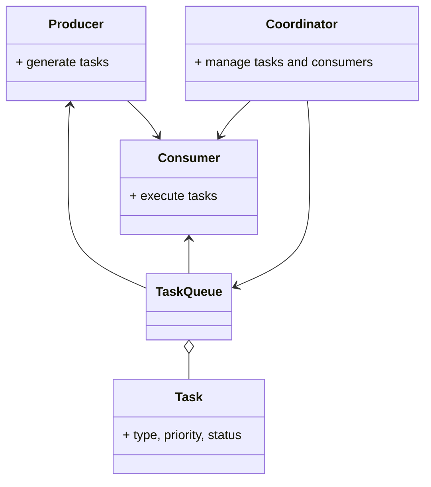
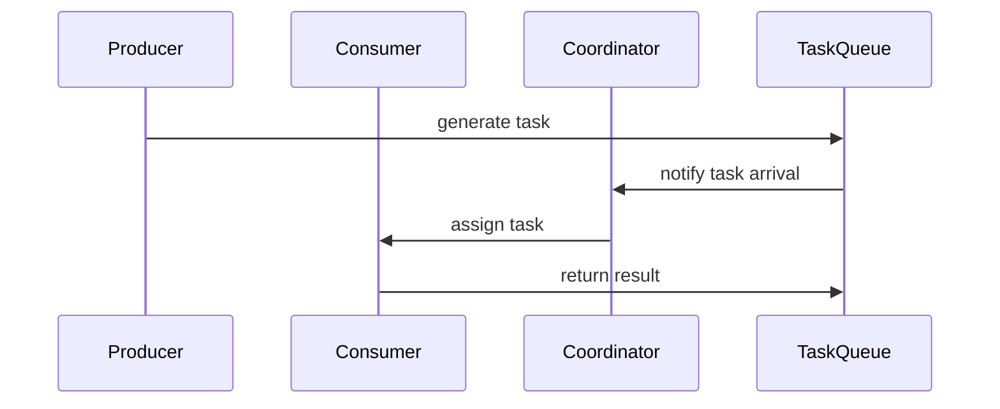
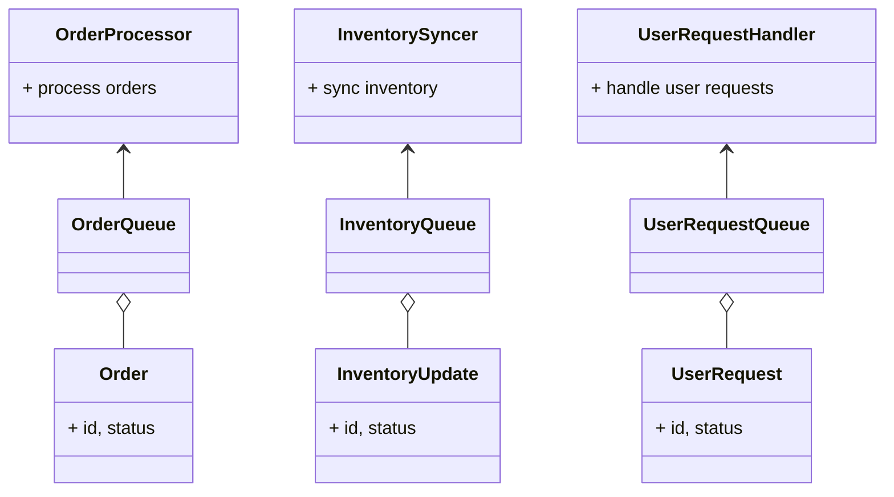
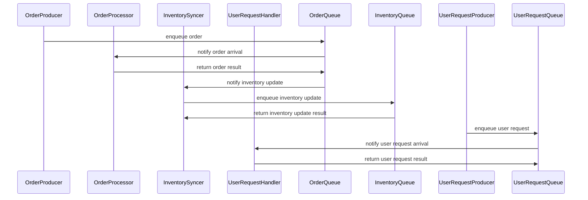
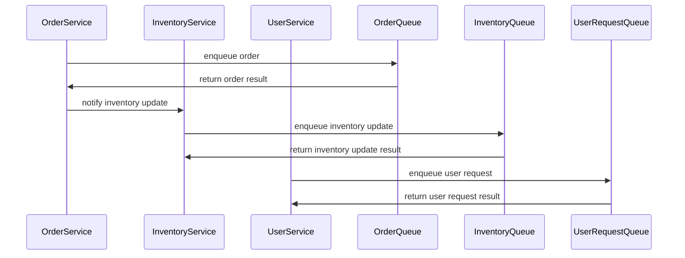

                 


### 1.1 问题背景

在当今互联网时代，分布式系统成为了现代IT基础设施的核心。分布式系统具有高可用性、高可靠性和高扩展性等优势，能够应对大规模、高并发、复杂场景的挑战。然而，在分布式系统中，任务队列作为任务分发、调度和管理的重要组件，其构建和优化面临着诸多技术难题。

#### 分布式任务队列的必要性

分布式任务队列的主要作用是协调分布式系统中的任务分配和执行。在分布式环境中，多个节点（服务器）共同工作，任务队列能够将任务分配给合适的节点，确保任务执行的高效性和可靠性。以下是一些主要原因，解释为什么分布式任务队列是分布式系统中不可或缺的部分：

1. **任务分发和负载均衡**：分布式任务队列可以将任务合理地分配到各个节点，避免单点压力，实现负载均衡。
2. **异步处理**：任务队列支持任务的异步执行，提高系统的响应速度和吞吐量。
3. **故障恢复**：分布式任务队列能够在节点故障时重新分配任务，保证系统的高可用性。
4. **动态伸缩**：任务队列支持动态调整节点数量，以适应业务变化。

#### 分布式任务队列的挑战

尽管分布式任务队列带来了诸多好处，但它的构建和优化仍然面临着一系列挑战：

1. **数据一致性**：分布式系统中的数据一致性是一个复杂的问题。任务队列需要在多节点之间保证数据的一致性，以避免任务执行的错误和重复。
2. **高可用性**：任务队列需要确保在节点故障时能够快速恢复，保证系统的稳定运行。
3. **性能优化**：任务队列的性能直接影响到系统的整体性能。如何提高任务队列的吞吐量和响应速度是优化过程中的重要任务。
4. **扩展性**：随着业务规模的不断扩大，任务队列需要具备良好的扩展性，以便于添加新的节点和资源。

#### 分布式任务队列的重要性

分布式任务队列不仅在分布式系统中起到关键作用，还影响着整个系统的性能和稳定性。以下是一些原因，解释为什么分布式任务队列对于分布式系统至关重要：

1. **提高系统性能**：通过任务队列，系统能够更好地分配和处理任务，提高整体性能。
2. **增强系统可靠性**：任务队列能够快速响应和处理故障，增强系统的高可用性。
3. **支持动态伸缩**：任务队列能够根据业务需求动态调整资源，支持系统的弹性扩展。
4. **促进系统整合**：任务队列作为分布式系统的核心组件，有助于不同模块和服务的整合和协同工作。

### 1.2 核心概念

在深入探讨分布式任务队列系统的构建和优化之前，我们需要了解一些核心概念和术语。以下是对这些概念的定义和简要解释：

#### 分布式任务队列

分布式任务队列是一种用于在分布式系统中管理任务分配和执行的工具。它通常由多个节点组成，每个节点负责处理特定类型或数量的任务。

#### 可靠性

可靠性是指系统在面临各种异常情况下仍能持续运行的能力。在分布式任务队列系统中，可靠性包括数据一致性、故障检测与恢复等方面。

#### 效率

效率是指系统在单位时间内处理任务的效率。对于分布式任务队列系统，效率主要体现在任务分配、调度和执行等环节。

#### 生产者

生产者是生成任务的节点。生产者负责将任务提交到任务队列中，以便后续执行。

#### 消费者

消费者是执行任务的节点。消费者从任务队列中获取任务并执行，完成后再将结果返回。

#### 任务队列

任务队列是存储待执行任务的队列。它通常是一个分布式数据结构，能够保证任务的一致性和可靠性。

#### 协调者

协调者是负责任务调度和系统管理的节点。协调者负责将任务分配给合适的消费者，并监控系统的运行状态。

#### 故障模型与检测机制

故障模型是描述系统可能面临的故障类型和概率的模型。检测机制是用于监控系统和任务执行情况，及时发现故障的方法。

#### 故障恢复策略

故障恢复策略是在检测到故障后，系统采取的自动恢复措施。在某些情况下，可能需要人工干预进行故障处理。

#### 调度算法

调度算法是用于分配和调度任务的算法。常见的调度算法包括负载均衡和优先级调度等。

#### 优化策略

优化策略是用于提高系统性能和效率的策略。常见的优化策略包括并行处理和缓存策略等。

### 1.3 总结

在本章中，我们介绍了分布式任务队列系统的背景和核心概念。通过理解这些问题背景和核心概念，我们将为后续的探讨打下坚实的基础。在下一章中，我们将进一步探讨分布式任务队列系统的组成与功能。

## 第2章: 分布式任务队列系统的组成与功能

### 2.1 系统架构

一个典型的分布式任务队列系统通常包括以下几个核心组成部分：

- **生产者**：生成任务的节点。
- **消费者**：执行任务的节点。
- **任务队列**：存储待执行的任务。
- **协调者**：负责任务调度和系统管理。

#### 生产者

生产者是生成任务的节点。生产者负责生成任务并将其提交到任务队列中，以便后续执行。生产者可以是分布式系统中的任何一个节点，它们通常具有以下特点：

1. **任务生成**：生产者根据业务需求生成任务，例如处理用户请求、数据同步等。
2. **任务提交**：生产者将生成的任务提交到任务队列中，以便后续执行。

#### 消费者

消费者是执行任务的节点。消费者从任务队列中获取任务并执行，完成后再将结果返回。消费者通常是分布式系统中的工作节点，它们具有以下特点：

1. **任务获取**：消费者从任务队列中获取任务，根据任务的类型和优先级进行排序。
2. **任务执行**：消费者执行获取到的任务，并将结果返回给生产者或存储在指定的位置。
3. **任务结束**：消费者完成任务后，将任务从任务队列中删除。

#### 任务队列

任务队列是存储待执行任务的队列。任务队列通常是一个分布式数据结构，能够保证任务的一致性和可靠性。任务队列具有以下特点：

1. **任务存储**：任务队列用于存储待执行的任务，每个任务都包含任务的类型、优先级、状态等信息。
2. **任务检索**：任务队列支持对任务的检索和查询，以便于生产者和消费者获取任务。
3. **任务删除**：任务队列支持对已完成的任务的删除，以释放内存空间。

#### 协调者

协调者是负责任务调度和系统管理的节点。协调者通常具有以下特点：

1. **任务调度**：协调者负责将任务分配给合适的消费者，实现任务的负载均衡。
2. **系统监控**：协调者监控系统的运行状态，及时发现和处理故障。
3. **故障恢复**：协调者在检测到故障时，自动执行故障恢复操作，确保系统的稳定运行。

### 2.2 功能模块

分布式任务队列系统的功能模块主要包括任务生成与分发、任务调度与执行、故障检测与恢复等。

#### 任务生成与分发

任务生成与分发是分布式任务队列系统的核心功能之一。生产者生成任务后，需要将其提交到任务队列中，以便消费者执行。具体步骤如下：

1. **任务生成**：生产者根据业务需求生成任务，将任务信息存储在本地缓存或数据库中。
2. **任务提交**：生产者将生成的任务提交到任务队列中，可以使用轮询、拉取或推送等方式。
3. **任务存储**：任务队列接收到任务后，将其存储在分布式缓存或数据库中，以供消费者获取。

#### 任务调度与执行

任务调度与执行是分布式任务队列系统的另一个核心功能。消费者从任务队列中获取任务并执行，具体步骤如下：

1. **任务获取**：消费者从任务队列中获取任务，可以根据任务的类型、优先级和可用资源进行筛选。
2. **任务执行**：消费者执行获取到的任务，并根据任务的结果进行处理，如存储、返回或进一步分发。
3. **任务结束**：消费者完成任务后，将任务从任务队列中删除，释放内存空间。

#### 故障检测与恢复

故障检测与恢复是分布式任务队列系统的关键功能，确保系统能够在面临故障时快速恢复。具体步骤如下：

1. **故障检测**：协调者或消费者定期检查任务的状态，发现异常后记录故障信息。
2. **故障恢复**：系统在检测到故障时，自动执行故障恢复操作，如重新分配任务、重启节点等。
3. **故障监控**：系统监控故障恢复过程，确保故障得到妥善处理。

### 2.3 总结

在本章中，我们详细介绍了分布式任务队列系统的组成与功能。理解这些组成部分和功能模块，有助于我们更好地设计和实现一个可靠、高效的分布式任务队列系统。在下一章中，我们将探讨如何设计一个可靠的分布式任务队列系统。

## 第3章: 可靠性设计与保障措施

### 3.1 故障模型与检测机制

在设计一个可靠的分布式任务队列系统时，首先需要了解系统可能面临的故障类型和概率。故障模型是描述系统故障的一种方法，可以帮助我们分析故障发生的原因和影响。以下是一个典型的故障模型：

1. **硬件故障**：包括服务器、存储设备、网络设备等硬件故障。
2. **软件故障**：包括操作系统、应用软件、中间件等软件故障。
3. **网络故障**：包括网络延迟、网络中断、数据包丢失等网络故障。
4. **人为故障**：包括操作失误、配置错误、恶意攻击等人为故障。

为了及时发现和处理故障，分布式任务队列系统需要具备完善的故障检测机制。以下是一些常见的故障检测机制：

1. **心跳机制**：通过定时发送心跳信号，监测节点的存活状态。如果某个节点长时间没有发送心跳信号，则认为该节点可能发生故障。
2. **健康检查**：定期对系统中的各个节点进行健康检查，检测节点的CPU、内存、磁盘等资源使用情况，以及服务的可用性。
3. **异常监控**：监控系统的日志、错误信息等，发现异常后及时报警，以便进行故障处理。

### 3.2 故障恢复策略

在故障检测机制的基础上，分布式任务队列系统需要具备故障恢复策略，以确保系统在面临故障时能够快速恢复，减少对业务的影响。以下是一些常见的故障恢复策略：

1. **自动恢复**：系统在检测到故障后，自动执行恢复操作，例如重启故障节点、重新分配任务等。自动恢复能够提高故障恢复的效率，减少人工干预。
2. **人工干预**：在某些情况下，自动恢复可能无法解决问题，此时需要人工介入进行故障处理。人工干预可以更灵活地处理复杂的故障情况，但可能会增加故障恢复的时间。
3. **故障转移**：在主节点发生故障时，将任务队列和协调功能转移到备用节点。故障转移能够确保系统在主节点故障时仍然能够正常运行。

### 3.3 可靠性保障措施

为了提高分布式任务队列系统的可靠性，我们需要采取一系列保障措施，确保系统在面临各种故障时能够稳定运行。以下是一些常见的可靠性保障措施：

1. **数据备份与恢复**：定期对任务队列中的数据进行备份，确保在数据丢失或损坏时能够快速恢复。
2. **故障转移与容错**：通过故障转移和容错机制，确保系统在节点故障时仍然能够正常运行，降低故障对业务的影响。
3. **负载均衡与资源管理**：合理分配任务和资源，避免单点压力，提高系统的可靠性和可用性。
4. **监控与报警**：对系统进行实时监控，及时发现和处理故障，降低故障对业务的影响。
5. **自动化运维**：通过自动化运维工具，实现故障检测、恢复和监控等操作的自动化，提高故障处理的效率。

### 3.4 总结

在本章中，我们讨论了分布式任务队列系统的故障模型、检测机制和恢复策略，以及可靠性保障措施。通过了解这些内容，我们可以设计和实现一个具有高可靠性的分布式任务队列系统，确保系统在面临各种故障时能够稳定运行。在下一章中，我们将探讨如何设计一个高效的分布式任务队列系统。

## 第4章: 高效调度算法与优化

### 4.1 调度算法原理

调度算法是分布式任务队列系统的核心组成部分，用于将任务合理地分配给消费者，确保系统的负载均衡和高效运行。调度算法的原理主要包括以下几个方面：

#### 负载均衡

负载均衡是指将任务均匀地分配到各个消费者，以避免单点压力，提高系统的吞吐量和性能。常见的负载均衡算法包括：

1. **轮询调度**：按照固定顺序将任务分配给消费者，轮流执行任务。
2. **随机调度**：随机将任务分配给消费者，减少对特定消费者的依赖。
3. **最小负载调度**：将任务分配给当前负载最小的消费者，实现负载均衡。

#### 优先级调度

优先级调度是指根据任务的优先级进行调度，优先执行高优先级任务。常见的优先级调度算法包括：

1. **静态优先级调度**：每个任务具有固定的优先级，按照优先级从高到低执行任务。
2. **动态优先级调度**：任务在执行过程中根据执行状态动态调整优先级，例如长时间未执行的任务优先级提高，以加快执行。

#### 任务分发

任务分发是指将任务从生产者传递到消费者的过程。常见的任务分发策略包括：

1. **轮询分发**：生产者按照固定顺序将任务分发到消费者。
2. **随机分发**：生产者随机将任务分发到消费者。
3. **负载均衡分发**：生产者根据消费者的当前负载情况，将任务分配给负载最小的消费者。

### 4.2 优化策略

为了提高分布式任务队列系统的性能和效率，我们可以采取一系列优化策略，主要包括以下几个方面：

#### 并行处理

并行处理是指同时处理多个任务，提高系统的吞吐量。常见的并行处理策略包括：

1. **多线程处理**：使用多线程同时执行多个任务，提高并发处理能力。
2. **并行流处理**：使用并行流处理框架（如Apache Kafka）处理大量任务，提高数据处理效率。

#### 缓存策略

缓存策略是指将常用数据存储在缓存中，减少数据访问延迟。常见的缓存策略包括：

1. **内存缓存**：使用内存缓存（如Redis）存储常用数据，提高数据访问速度。
2. **磁盘缓存**：使用磁盘缓存（如SSD）存储数据，降低数据访问延迟。
3. **分布式缓存**：使用分布式缓存系统（如Memcached）存储数据，提高缓存容量和访问速度。

#### 资源优化

资源优化是指合理分配和使用系统资源，提高系统性能和效率。常见的资源优化策略包括：

1. **CPU优化**：合理分配CPU资源，避免CPU过度使用和闲置。
2. **内存优化**：合理分配内存资源，避免内存溢出和浪费。
3. **磁盘优化**：合理分配磁盘资源，避免磁盘满载和性能下降。

#### 网络优化

网络优化是指优化网络传输和通信，提高数据传输速度和可靠性。常见的网络优化策略包括：

1. **负载均衡**：使用负载均衡设备（如Nginx）均衡网络流量，避免单点压力。
2. **网络优化**：优化网络配置和参数，提高网络传输速度和稳定性。
3. **网络监控**：实时监控网络状态，及时发现和处理网络故障。

### 4.3 总结

在本章中，我们介绍了分布式任务队列系统的调度算法原理和优化策略。通过理解调度算法原理和优化策略，我们可以设计和实现一个高效、可靠的分布式任务队列系统，提高系统的性能和效率。在下一章中，我们将探讨如何实现分布式任务队列系统的核心模块。

## 第5章: 分布式任务队列系统实现

### 5.1 系统架构设计

在设计分布式任务队列系统时，我们需要考虑系统的可扩展性、高可用性和性能。以下是一个典型的分布式任务队列系统架构设计：

#### 领域模型

领域模型用于描述系统的核心组件和它们之间的关系。以下是一个使用Mermaid类图描述的领域模型：



在这个领域模型中，生产者（Producer）生成任务并将其提交到任务队列（TaskQueue），消费者（Consumer）从任务队列中获取任务并执行，协调者（Coordinator）负责管理任务和消费者。

#### 系统架构

系统架构用于描述系统的各个组件以及它们之间的交互关系。以下是一个使用Mermaid架构图描述的系统架构：



在这个系统架构中，生产者生成任务后，提交给任务队列。任务队列通知协调者，协调者再将任务分配给消费者。消费者执行任务并将结果返回给任务队列。协调者负责管理任务和消费者，确保系统的高可用性和负载均衡。

### 5.2 核心模块实现

在分布式任务队列系统中，核心模块包括生产者模块、消费者模块和任务队列模块。以下是对这些模块的实现进行详细讲解：

#### 生产者模块

生产者模块负责生成任务并将任务提交到任务队列。以下是一个简单的生产者模块的实现：

```python
import pika

class Producer:
    def __init__(self, queue_name):
        self.queue_name = queue_name
        self.connection = pika.BlockingConnection(pika.ConnectionParameters('localhost'))
        self.channel = self.connection.channel()
        self.channel.queue_declare(queue=self.queue_name)

    def produce_task(self, task):
        self.channel.basic_publish(
            exchange='',
            routing_key=self.queue_name,
            body=task
        )
        print(f"Task '{task}' produced")

if __name__ == '__main__':
    producer = Producer("task_queue")
    producer.produce_task("task1")
    producer.produce_task("task2")
    producer.produce_task("task3")
```

在这个实现中，我们使用Pika库连接到RabbitMQ消息队列，并创建一个生产者对象。生产者对象生成任务后，将其提交到任务队列。

#### 消费者模块

消费者模块负责从任务队列中获取任务并执行。以下是一个简单的消费者模块的实现：

```python
import pika

class Consumer:
    def __init__(self, queue_name):
        self.queue_name = queue_name
        self.connection = pika.BlockingConnection(pika.ConnectionParameters('localhost'))
        self.channel = self.connection.channel()
        self.channel.queue_declare(queue=self.queue_name)

    def consume_task(self):
        method_frame, properties, body = self.channel.basic_get(queue=self.queue_name, no_ack=True)
        if method_frame:
            print(f"Task '{body}' consumed")
            self.channel.basic_ack(delivery_tag=method_frame.delivery_tag)

if __name__ == '__main__':
    consumer = Consumer("task_queue")
    consumer.consume_task()
```

在这个实现中，我们使用Pika库连接到RabbitMQ消息队列，并创建一个消费者对象。消费者对象从任务队列中获取任务并执行。

#### 任务队列模块

任务队列模块用于存储待执行的任务。以下是一个简单的任务队列模块的实现：

```python
import pika

class TaskQueue:
    def __init__(self, queue_name):
        self.queue_name = queue_name
        self.connection = pika.BlockingConnection(pika.ConnectionParameters('localhost'))
        self.channel = self.connection.channel()
        self.channel.queue_declare(queue=self.queue_name)

    def enqueue_task(self, task):
        self.channel.basic_publish(
            exchange='',
            routing_key=self.queue_name,
            body=task
        )
        print(f"Task '{task}' enqueued")

    def dequeue_task(self):
        method_frame, properties, body = self.channel.basic_get(queue=self.queue_name, no_ack=True)
        if method_frame:
            print(f"Task '{body}' dequeued")
            self.channel.basic_ack(delivery_tag=method_frame.delivery_tag)

if __name__ == '__main__':
    task_queue = TaskQueue("task_queue")
    task_queue.enqueue_task("task1")
    task_queue.enqueue_task("task2")
    task_queue.enqueue_task("task3")
    task_queue.dequeue_task()
```

在这个实现中，我们使用Pika库连接到RabbitMQ消息队列，并创建一个任务队列对象。任务队列对象用于存储任务、添加任务和删除任务。

### 5.3 总结

在本章中，我们详细介绍了分布式任务队列系统的架构设计和核心模块实现。通过理解这些内容，我们可以设计和实现一个功能完整、性能优异的分布式任务队列系统。在下一章中，我们将探讨如何部署和维护分布式任务队列系统。

## 第6章: 系统部署与维护

### 6.1 部署方案

部署分布式任务队列系统是一个复杂的过程，涉及到多个环境和配置。以下是一个基本的部署方案：

#### 环境配置

1. **操作系统**：选择一个稳定的操作系统，如CentOS 7或Ubuntu 18.04。
2. **Java环境**：安装JDK 8或更高版本。
3. **消息队列**：安装RabbitMQ消息队列。
4. **数据库**：安装MySQL或PostgreSQL数据库。

#### 部署步骤

1. **安装操作系统**：选择一个物理服务器或虚拟机，安装操作系统。
2. **配置Java环境**：在操作系统上配置Java环境，设置JAVA_HOME和PATH环境变量。
3. **安装RabbitMQ**：下载RabbitMQ安装包，按照官方文档进行安装和配置。
4. **安装数据库**：下载数据库安装包，按照官方文档进行安装和配置。
5. **安装任务队列系统**：下载分布式任务队列系统的安装包，按照说明进行安装。

#### 部署流程

1. **环境准备**：检查操作系统、Java环境和消息队列的安装情况。
2. **安装组件**：按照部署步骤安装RabbitMQ和数据库。
3. **配置系统**：根据实际需求配置系统参数，如队列名称、数据库连接等。
4. **启动服务**：启动RabbitMQ和数据库服务。
5. **部署任务队列系统**：启动任务队列系统，进行初步测试。

### 6.2 维护策略

分布式任务队列系统的维护是一个持续的过程，涉及到监控系统状态、处理故障和更新系统等。

#### 日志监控

1. **日志收集**：配置日志收集工具，如Logstash，将系统的日志统一收集到日志中心。
2. **日志分析**：使用日志分析工具，如Kibana，对日志进行实时监控和分析。
3. **报警机制**：配置报警机制，当系统出现异常时及时通知相关人员。

#### 故障处理

1. **故障检测**：使用监控系统定期检查系统的运行状态。
2. **故障恢复**：在检测到故障时，自动执行故障恢复操作，如重启服务、重新分配任务等。
3. **人工干预**：在自动恢复无效时，人工介入进行故障处理。

#### 系统更新

1. **备份**：在更新系统之前，备份系统的配置文件和数据。
2. **测试**：在测试环境中进行系统更新，验证更新后的系统功能。
3. **部署**：在确认测试通过后，将更新部署到生产环境中。
4. **监控**：更新部署后，对系统进行监控，确保系统正常运行。

### 6.3 总结

在本章中，我们介绍了分布式任务队列系统的部署方案和维护策略。通过合理的部署和有效的维护，可以确保分布式任务队列系统的高可用性和稳定性。在下一章中，我们将通过实际案例来深入探讨分布式任务队列系统的应用和实践。

## 第7章: 项目实战与案例分析

### 7.1 实际项目介绍

在本节中，我们将通过一个实际项目来展示如何设计和实现一个分布式任务队列系统。该项目是一个在线购物平台的后台系统，负责处理大量的订单处理、库存同步和用户请求等任务。以下是项目的背景和需求：

#### 项目背景

随着电子商务的快速发展，在线购物平台面临着日益增长的用户量和订单量。为了提高系统的响应速度和稳定性，平台决定采用分布式任务队列系统来处理后台任务。通过分布式任务队列，平台可以实现任务的异步处理、负载均衡和故障恢复，提高系统的整体性能和可用性。

#### 项目需求

1. **任务异步处理**：订单处理、库存同步和用户请求等任务需要异步处理，以提高系统的吞吐量和响应速度。
2. **负载均衡**：任务队列需要能够均匀地分配到各个节点，避免单点压力，提高系统的性能。
3. **故障恢复**：系统需要具备故障恢复能力，确保在节点故障时能够自动切换和恢复，保证业务连续性。
4. **监控与报警**：系统需要提供实时监控和报警功能，及时发现和处理异常情况。

### 7.2 系统架构设计

在项目的设计阶段，我们需要确定系统的架构设计，包括领域模型、系统架构和接口设计等。

#### 领域模型

领域模型用于描述系统的核心组件和它们之间的关系。以下是一个简单的领域模型：



在这个领域模型中，OrderProcessor负责处理订单，InventorySyncer负责同步库存，UserRequestHandler负责处理用户请求。OrderQueue、InventoryQueue和UserRequestQueue分别用于存储订单、库存更新和用户请求。

#### 系统架构

系统架构用于描述系统的各个组件以及它们之间的交互关系。以下是一个简单的系统架构：



在这个系统架构中，OrderProducer生成订单并将其提交到OrderQueue，OrderProcessor从OrderQueue中获取订单并处理，InventorySyncer从OrderQueue中获取库存更新并同步，UserRequestProducer生成用户请求并将其提交到UserRequestQueue，UserRequestHandler从UserRequestQueue中获取用户请求并处理。

#### 系统接口设计

系统接口设计用于描述系统各个模块之间的接口关系。以下是一个简单的系统接口设计：



在这个系统接口设计中，OrderService负责生成订单、处理订单结果、通知库存更新，InventoryService负责处理库存更新、同步库存结果，UserService负责生成用户请求、处理用户请求结果。

### 7.3 系统实现与解读

在本节中，我们将详细讲解系统的实现过程，包括生产者模块、消费者模块和任务队列模块的实现，并对关键代码进行解读。

#### 生产者模块实现

生产者模块负责生成订单、用户请求等任务，并将其提交到任务队列。以下是一个简单的生产者模块实现：

```python
import pika

class OrderProducer:
    def __init__(self, queue_name):
        self.queue_name = queue_name
        self.connection = pika.BlockingConnection(pika.ConnectionParameters('localhost'))
        self.channel = self.connection.channel()
        self.channel.queue_declare(queue=self.queue_name)

    def produce_order(self, order):
        self.channel.basic_publish(
            exchange='',
            routing_key=self.queue_name,
            body=order
        )
        print(f"Order {order} produced")

class UserRequestProducer:
    def __init__(self, queue_name):
        self.queue_name = queue_name
        self.connection = pika.BlockingConnection(pika.ConnectionParameters('localhost'))
        self.channel = self.connection.channel()
        self.channel.queue_declare(queue=self.queue_name)

    def produce_request(self, request):
        self.channel.basic_publish(
            exchange='',
            routing_key=self.queue_name,
            body=request
        )
        print(f"Request {request} produced")
```

在这个实现中，我们使用Pika库连接到RabbitMQ消息队列，并创建OrderProducer和UserRequestProducer两个生产者对象。OrderProducer生成订单并将其提交到OrderQueue，UserRequestProducer生成用户请求并将其提交到UserRequestQueue。

#### 消费者模块实现

消费者模块负责从任务队列中获取任务并执行。以下是一个简单的消费者模块实现：

```python
import pika

class OrderConsumer:
    def __init__(self, queue_name):
        self.queue_name = queue_name
        self.connection = pika.BlockingConnection(pika.ConnectionParameters('localhost'))
        self.channel = self.connection.channel()
        self.channel.queue_declare(queue=self.queue_name)

    def consume_order(self):
        method_frame, properties, body = self.channel.basic_get(queue=self.queue_name, no_ack=True)
        if method_frame:
            print(f"Order {body} consumed")
            self.channel.basic_ack(delivery_tag=method_frame.delivery_tag)

class UserRequestConsumer:
    def __init__(self, queue_name):
        self.queue_name = queue_name
        self.connection = pika.BlockingConnection(pika.ConnectionParameters('localhost'))
        self.channel = self.connection.channel()
        self.channel.queue_declare(queue=self.queue_name)

    def consume_request(self):
        method_frame, properties, body = self.channel.basic_get(queue=self.queue_name, no_ack=True)
        if method_frame:
            print(f"Request {body} consumed")
            self.channel.basic_ack(delivery_tag=method_frame.delivery_tag)
```

在这个实现中，我们使用Pika库连接到RabbitMQ消息队列，并创建OrderConsumer和UserRequestConsumer两个消费者对象。OrderConsumer从OrderQueue中获取订单并执行，UserRequestConsumer从UserRequestQueue中获取用户请求并执行。

#### 任务队列模块实现

任务队列模块用于存储待执行的任务，并支持任务的提交和获取。以下是一个简单的任务队列模块实现：

```python
import pika

class OrderQueue:
    def __init__(self, queue_name):
        self.queue_name = queue_name
        self.connection = pika.BlockingConnection(pika.ConnectionParameters('localhost'))
        self.channel = self.connection.channel()
        self.channel.queue_declare(queue=self.queue_name)

    def enqueue_order(self, order):
        self.channel.basic_publish(
            exchange='',
            routing_key=self.queue_name,
            body=order
        )
        print(f"Order {order} enqueued")

    def dequeue_order(self):
        method_frame, properties, body = self.channel.basic_get(queue=self.queue_name, no_ack=True)
        if method_frame:
            print(f"Order {body} dequeued")
            self.channel.basic_ack(delivery_tag=method_frame.delivery_tag)

class UserRequestQueue:
    def __init__(self, queue_name):
        self.queue_name = queue_name
        self.connection = pika.BlockingConnection(pika.ConnectionParameters('localhost'))
        self.channel = self.connection.channel()
        self.channel.queue_declare(queue=self.queue_name)

    def enqueue_request(self, request):
        self.channel.basic_publish(
            exchange='',
            routing_key=self.queue_name,
            body=request
        )
        print(f"Request {request} enqueued")

    def dequeue_request(self):
        method_frame, properties, body = self.channel.basic_get(queue=self.queue_name, no_ack=True)
        if method_frame:
            print(f"Request {body} dequeued")
            self.channel.basic_ack(delivery_tag=method_frame.delivery_tag)
```

在这个实现中，我们使用Pika库连接到RabbitMQ消息队列，并创建OrderQueue和UserRequestQueue两个任务队列对象。OrderQueue用于存储订单、提交订单和获取订单，UserRequestQueue用于存储用户请求、提交用户请求和获取用户请求。

### 7.4 实际案例分析与详细讲解

在本节中，我们将结合实际案例，对系统的关键代码进行详细分析和讲解。

#### 订单处理流程

以下是一个简单的订单处理流程：

1. **生成订单**：OrderProducer生成订单并将其提交到OrderQueue。
2. **处理订单**：OrderProcessor从OrderQueue中获取订单，处理订单并返回结果。
3. **同步库存**：OrderProcessor在处理订单后，通知InventorySyncer同步库存。
4. **返回结果**：InventorySyncer同步库存后，返回结果给OrderProcessor。

以下是对关键代码的详细讲解：

```python
# OrderProducer.py
def produce_order(self, order):
    self.channel.basic_publish(
        exchange='',
        routing_key=self.queue_name,
        body=order
    )
    print(f"Order {order} produced")

# OrderProcessor.py
def consume_order(self):
    method_frame, properties, body = self.channel.basic_get(queue=self.queue_name, no_ack=True)
    if method_frame:
        print(f"Order {body} consumed")
        self.channel.basic_ack(delivery_tag=method_frame.delivery_tag)

def process_order(self, order):
    # 处理订单逻辑
    print(f"Processing order {order}")
    # 同步库存
    self.inventory_syncer.notify_inventory_update(order)
    # 返回结果
    self.order_queue.enqueue_order(order)
```

在这个示例中，OrderProducer负责生成订单并将其提交到OrderQueue，OrderProcessor从OrderQueue中获取订单并处理，处理完成后返回结果给OrderQueue。

#### 用户请求处理流程

以下是一个简单的用户请求处理流程：

1. **生成用户请求**：UserRequestProducer生成用户请求并将其提交到UserRequestQueue。
2. **处理用户请求**：UserRequestHandler从UserRequestQueue中获取用户请求，处理用户请求并返回结果。

以下是对关键代码的详细讲解：

```python
# UserRequestProducer.py
def produce_request(self, request):
    self.channel.basic_publish(
        exchange='',
        routing_key=self.queue_name,
        body=request
    )
    print(f"Request {request} produced")

# UserRequestHandler.py
def consume_request(self):
    method_frame, properties, body = self.channel.basic_get(queue=self.queue_name, no_ack=True)
    if method_frame:
        print(f"Request {body} consumed")
        self.channel.basic_ack(delivery_tag=method_frame.delivery_tag)

def handle_request(self, request):
    # 处理用户请求逻辑
    print(f"Handling request {request}")
    # 返回结果
    self.user_request_queue.enqueue_request(request)
```

在这个示例中，UserRequestProducer负责生成用户请求并将其提交到UserRequestQueue，UserRequestHandler从UserRequestQueue中获取用户请求并处理，处理完成后返回结果给UserRequestQueue。

### 7.5 项目小结

通过实际案例的讲解，我们可以看到分布式任务队列系统在项目中的应用和实践。以下是对项目的小结：

1. **任务异步处理**：通过分布式任务队列系统，实现了订单处理、库存同步和用户请求等任务的异步处理，提高了系统的吞吐量和响应速度。
2. **负载均衡**：通过任务队列的负载均衡机制，实现了任务的均匀分配，避免了单点压力，提高了系统的性能和稳定性。
3. **故障恢复**：系统具备故障恢复能力，能够在节点故障时自动切换和恢复，保证了业务的连续性。
4. **监控与报警**：通过日志监控和报警机制，实现了对系统运行状态的实时监控，及时发现和处理异常情况。

通过这个实际项目，我们可以了解到分布式任务队列系统的设计、实现和应用，为后续类似项目提供参考和借鉴。

## 第8章: 总结与展望

### 8.1 小结

在本篇文章中，我们深入探讨了分布式任务队列系统的设计、实现和应用。以下是对本文内容的总结：

1. **问题背景**：随着互联网、云计算和大数据技术的快速发展，分布式系统已成为现代IT基础设施的核心。任务队列作为分布式系统中的关键组件，负责任务的分发、调度和管理。
2. **核心概念**：本文介绍了分布式任务队列、可靠性、效率、生产者、消费者、任务队列和协调者等核心概念，为后续内容打下了基础。
3. **系统架构**：本文详细描述了分布式任务队列系统的组成和功能，包括生产者、消费者、任务队列和协调者等组件，以及它们之间的交互关系。
4. **可靠性设计**：本文讨论了故障模型、检测机制、恢复策略和可靠性保障措施，确保系统在面对各种故障时能够稳定运行。
5. **高效调度算法**：本文介绍了调度算法原理和优化策略，包括负载均衡、优先级调度、并行处理和缓存策略等，提高系统的性能和效率。
6. **系统实现**：本文通过实际项目展示了分布式任务队列系统的实现过程，包括生产者、消费者和任务队列模块的实现。
7. **系统部署与维护**：本文介绍了分布式任务队列系统的部署方案和维护策略，确保系统的高可用性和稳定性。
8. **项目实战与案例分析**：本文通过实际项目，展示了分布式任务队列系统的应用和实践，提供了详细的实现和分析。

### 8.2 未来展望

在分布式任务队列系统的未来发展中，我们可以预见以下几个趋势：

1. **智能化**：随着人工智能技术的不断发展，分布式任务队列系统有望实现智能化调度和优化，提高系统的自动化程度和效率。
2. **云原生**：随着云计算的普及，分布式任务队列系统将更加注重云原生架构，实现高效、灵活的资源调度和弹性扩展。
3. **服务化**：分布式任务队列系统将逐渐向服务化方向发展，与其他微服务架构相结合，提高系统的可扩展性和可维护性。
4. **高并发处理**：随着业务规模的增长，分布式任务队列系统需要具备更高的并发处理能力，以应对日益增长的任务量。
5. **安全与隐私**：在分布式任务队列系统中，安全性和隐私保护将成为重要议题，系统需要具备完善的安全机制和隐私保护策略。

总之，分布式任务队列系统作为分布式系统中的关键组件，将在未来继续发挥重要作用，为各种业务场景提供高效、可靠的解决方案。通过不断探索和创新，我们可以期待分布式任务队列系统在未来取得更大的发展和进步。作者：AI天才研究院/AI Genius Institute & 禅与计算机程序设计艺术 /Zen And The Art of Computer Programming。

