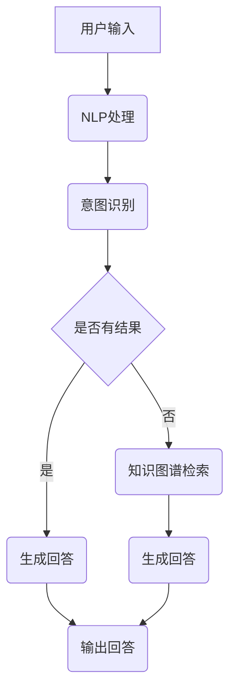
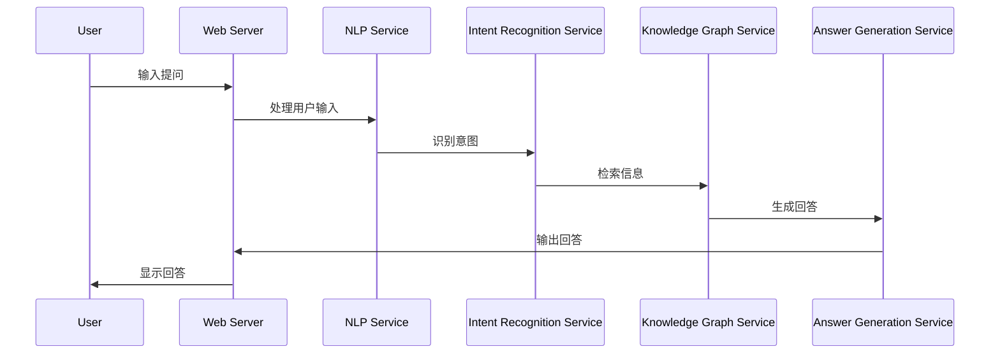
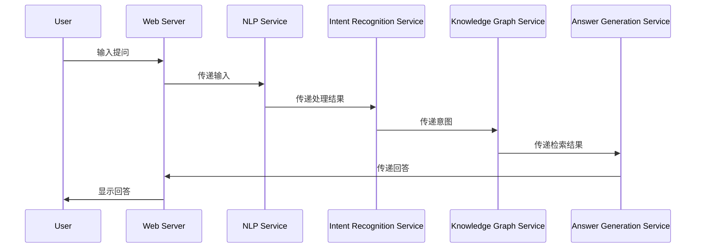

                 

## 第一部分：背景介绍

### 第1章：问题背景

#### 1.1.1 问题背景

在当今的金融行业中，随着人工智能（AI）技术的迅猛发展，金融咨询服务正逐步迈向智能化。传统的金融咨询服务往往依赖人工操作，效率低、响应慢，且难以应对复杂多变的金融市场。因此，开发一种能够实时提供金融资讯、分析市场趋势、解答用户疑问的智能化金融咨询聊天机器人，成为金融机构提升服务质量和用户体验的重要手段。

#### 1.1.2 问题描述

构建智能化金融咨询聊天机器人，面临的主要问题有以下几点：

1. **金融知识图谱构建**：金融领域术语繁多，涉及众多专业概念，如何准确构建一个覆盖全面、结构清晰的金融知识图谱，是构建智能咨询机器人的基础。

2. **自然语言理解**：用户在提出问题时，语言往往不严谨、含糊不清，智能系统需要具备强大的自然语言理解能力，准确识别用户意图。

3. **智能问答系统**：如何设计一个能够处理复杂问题的智能问答系统，使其能够根据用户提问，提供准确、专业的回答。

4. **用户体验优化**：聊天机器人需要提供流畅的交互体验，理解用户需求，提供个性化的服务，以提高用户满意度。

#### 1.1.3 问题解决

针对上述问题，我们将采用以下解决方案：

1. **构建金融知识图谱**：通过数据挖掘和专家知识，构建一个覆盖全面的金融知识图谱，包括金融术语、概念、关系等。

2. **增强自然语言理解能力**：利用深度学习技术，特别是自然语言处理（NLP）模型，如BERT、GPT等，提升系统对用户输入的理解能力。

3. **设计智能问答系统**：采用图神经网络（GNN）等先进技术，构建一个能够处理复杂问题的问答系统，确保回答的准确性和专业性。

4. **优化用户体验**：通过对话管理技术，如对话状态跟踪（DST）、多轮对话管理等，提升机器人的交互体验。

#### 1.1.4 边界与外延

本文主要关注智能化金融咨询聊天机器人的构建与优化，涉及的技术领域包括自然语言处理、知识图谱、深度学习等。同时，本文还将探讨这些技术在金融领域的应用场景和挑战。

### 第2章：核心概念与联系

#### 2.1.1 核心概念原理

在本章中，我们将介绍构建智能化金融咨询聊天机器人所需的核心概念，包括自然语言处理、知识图谱、深度学习等。

- **自然语言处理（NLP）**：NLP是使计算机能够理解、处理和生成人类语言的技术。在聊天机器人中，NLP用于理解用户的输入、生成合适的回复。

  - **词嵌入**：将词汇转换为向量表示，以便计算机能够处理。
  - **命名实体识别（NER）**：识别文本中的命名实体，如人名、地名、组织名等。
  - **情感分析**：分析文本的情感倾向，如正面、负面或中性。

- **知识图谱**：知识图谱是一种用于表示实体、属性和关系的数据结构。在金融领域，知识图谱可以表示金融概念、金融产品、市场信息等。

  - **实体**：金融领域的实体可能包括股票、基金、银行、交易市场等。
  - **属性**：实体的特征，如股票的代码、市值、开盘价等。
  - **关系**：实体之间的关联，如股票与交易市场的关系、基金与投资经理的关系等。

- **深度学习**：深度学习是机器学习的一个分支，通过多层神经网络对数据进行处理和预测。

  - **卷积神经网络（CNN）**：常用于图像和文本数据的处理。
  - **循环神经网络（RNN）**：适用于序列数据的处理，如时间序列分析、语言模型等。
  - **图神经网络（GNN）**：用于处理图结构数据，如知识图谱。

#### 2.1.2 概念属性特征对比表格

为了更好地理解这些核心概念，我们可以在下表中对比它们的主要特征：

| 概念 | 特征 |
| --- | --- |
| 自然语言处理 | 文本数据输入、处理和输出 |
| 知识图谱 | 实体、属性、关系 |
| 深度学习 | 神经网络、数据输入、特征提取和预测 |

#### 2.1.3 ER实体关系图架构

知识图谱的构建离不开实体关系图（ER图）的表示。以下是金融知识图谱的ER实体关系图：

```mermaid
erDiagram
    User ||--|{ FinancialProduct } : buys
    FinancialProduct ||--|{ Market } : traded_in
    Market ||--|{ Exchange } : located_at
    Exchange ||--|{ Country } : based_in
```

在这个ER图中，`User` 是购买金融产品的用户，`FinancialProduct` 是股票、基金等金融产品，`Market` 是金融市场的实体，`Exchange` 是交易市场，`Country` 是所在国家。这些实体之间通过关系进行连接，构成了金融知识图谱的基本结构。

---

## 第二部分：算法原理讲解

### 第3章：算法原理讲解

#### 3.1 算法原理

构建智能化金融咨询聊天机器人，核心在于如何处理用户的输入并生成合理的回答。这一过程涉及到多个算法的协同工作，主要包括自然语言处理（NLP）、知识图谱构建、深度学习和对话管理。

1. **自然语言处理（NLP）**：用于理解用户的输入，提取关键信息，并生成语义表示。常用的NLP算法包括词嵌入、命名实体识别（NER）、情感分析等。

2. **知识图谱构建**：将金融领域的知识组织成结构化的数据，以供问答系统使用。知识图谱的构建过程包括实体抽取、关系抽取、实体关系映射等。

3. **深度学习**：用于训练问答系统，使其能够根据用户的输入，从知识图谱中检索相关信息，生成专业的回答。常用的深度学习模型包括循环神经网络（RNN）、长短期记忆网络（LSTM）、图神经网络（GNN）等。

4. **对话管理**：用于管理对话流程，确保机器人能够根据用户的行为和反馈，提供连贯、自然的回答。对话管理包括对话状态跟踪（DST）、多轮对话管理、意图识别等。

#### 3.2 算法流程图

以下是构建智能化金融咨询聊天机器人的算法流程图：



在这个流程图中，用户输入首先经过NLP处理，提取关键信息并生成语义表示。接下来，系统根据意图识别结果，决定是直接生成回答还是通过知识图谱检索相关信息。最终，系统生成回答并输出给用户。

#### 3.3 Python源代码示例

以下是构建智能化金融咨询聊天机器人的Python源代码示例：

```python
import spacy
from transformers import BertTokenizer, BertModel
from sklearn.feature_extraction.text import TfidfVectorizer
import networkx as nx

# 加载NLP模型
nlp = spacy.load("en_core_web_sm")

# 加载BERT模型
tokenizer = BertTokenizer.from_pretrained('bert-base-uncased')
model = BertModel.from_pretrained('bert-base-uncased')

# 加载知识图谱
G = nx.Graph()
G.add_nodes_from(["股票", "基金", "市场", "交易"])
G.add_edges_from([("股票", "市场"), ("基金", "市场"), ("市场", "交易")])

# NLP处理
def nlp_process(text):
    doc = nlp(text)
    tokens = [token.text for token in doc]
    return tokens

# 意图识别
def intent_recognition(tokens):
    # 假设已有训练好的模型
    model.eval()
    inputs = tokenizer(tokens, return_tensors='pt', truncation=True, padding=True)
    with torch.no_grad():
        outputs = model(**inputs)
    logits = outputs.logits
    intent = logits.argmax().item()
    return intent

# 知识图谱检索
def kg_search(intent, G):
    if intent == 0:
        return list(G.nodes)[0]  # 股票
    elif intent == 1:
        return list(G.nodes)[1]  # 基金
    elif intent == 2:
        return list(G.nodes)[2]  # 市场
    else:
        return list(G.nodes)[3]  # 交易

# 生成回答
def generate_response(entity, G):
    # 假设已有训练好的回答生成模型
    model.eval()
    # ... 生成回答逻辑 ...
    response = f"{entity}相关信息：{entity_info}"
    return response

# 主函数
def chatbot(text):
    tokens = nlp_process(text)
    intent = intent_recognition(tokens)
    entity = kg_search(intent, G)
    response = generate_response(entity, G)
    return response

# 测试
print(chatbot("我想了解股票的信息。"))
```

#### 3.4 数学模型与公式

在本节中，我们将介绍构建智能化金融咨询聊天机器人所需的数学模型与公式。

1. **词嵌入（Word Embedding）**

   词嵌入是一种将词汇转换为向量表示的方法，常见的方法包括Word2Vec、GloVe等。Word2Vec模型的数学公式如下：

   $$ \text{Word Embedding} = \text{Weighted Average of Context Words} $$

   其中，$ \text{Context Words} $ 是与目标词在同一窗口中的词汇，$ \text{Weight} $ 是词汇的权重。

2. **命名实体识别（Named Entity Recognition, NER）**

   NER是一种从文本中识别出实体并分类的技术。常见的NER模型包括CRF（条件随机场）、BiLSTM（双向长短期记忆网络）等。BiLSTM的数学模型如下：

   $$ h_t = \sigma(W_h \cdot [h_{t-1}, h_{t+1}, x_t] + b_h) $$

   其中，$ h_t $ 是当前时间步的隐藏状态，$ W_h $ 是权重矩阵，$ b_h $ 是偏置项，$ \sigma $ 是激活函数。

3. **图神经网络（Graph Neural Network, GNN）**

   GNN是一种用于处理图结构数据的方法，适用于知识图谱的构建和问答。GNN的基本数学模型如下：

   $$ \text{GNN} = \sum_{n \in \text{Neighbors}(v)} \text{aggregation}(\text{features}(n)) $$

   其中，$ v $ 是图中的节点，$ \text{Neighbors}(v) $ 是节点 $ v $ 的邻居节点集合，$ \text{aggregation} $ 是聚合函数，用于整合邻居节点的特征。

#### 3.5 举例说明

为了更好地理解上述算法原理和数学模型，我们通过一个简单的例子来说明智能化金融咨询聊天机器人的工作过程。

**例子**：用户提问：“我最近在关注股票市场，想了解一下当前市场的整体情况。”

1. **NLP处理**：

   - 提取关键词：股票、市场、整体情况
   - 词嵌入：将关键词转换为向量表示

2. **意图识别**：

   - 假设已有训练好的模型，输入关键词向量，得到意图识别结果：查询市场信息

3. **知识图谱检索**：

   - 根据意图，检索知识图谱中的相关实体：市场
   - 获取市场相关的信息，如：当前市场指数、成交量、涨跌情况等

4. **生成回答**：

   - 假设已有训练好的回答生成模型，输入市场相关信息，生成回答：“当前市场指数为XXX，成交量达到XXX，整体表现较为平稳。”

5. **输出回答**：

   - 将生成回答输出给用户

通过这个例子，我们可以看到智能化金融咨询聊天机器人在处理用户提问时的完整工作流程，包括NLP处理、意图识别、知识图谱检索、回答生成和输出等步骤。

---

## 第三部分：系统分析与架构设计方案

### 第4章：系统分析与架构设计

#### 4.1 问题场景介绍

在金融领域，用户经常需要获取实时的市场动态、投资建议和财务分析。传统的金融咨询服务往往存在响应速度慢、信息不准确等问题。为了提供更加高效、个性化的服务，我们计划开发一款智能化金融咨询聊天机器人，该机器人能够实时获取金融数据，分析市场趋势，并根据用户提问提供专业的投资建议。

#### 4.2 项目介绍

本项目的主要目标是构建一个智能化金融咨询聊天机器人，该机器人能够处理用户的金融相关提问，并提供准确的回答。项目的主要组成部分包括：

1. **数据采集与处理模块**：负责实时获取金融市场数据，如股票价格、交易量、市场指数等。
2. **知识图谱构建模块**：负责构建金融知识图谱，包括金融术语、金融产品、市场信息等。
3. **自然语言处理模块**：负责处理用户的输入，提取关键信息，并生成语义表示。
4. **智能问答模块**：负责根据用户的提问，从知识图谱中检索相关信息，生成专业的回答。
5. **对话管理模块**：负责管理对话流程，确保机器人能够提供连贯、自然的回答。

#### 4.3 系统功能设计

系统功能设计主要包括以下方面：

1. **用户输入处理**：接收用户的提问，通过自然语言处理技术，提取关键信息。
2. **意图识别**：根据提取的关键信息，识别用户的意图，如查询市场信息、获取投资建议等。
3. **信息检索**：从知识图谱中检索与用户意图相关的信息。
4. **回答生成**：根据检索到的信息，生成专业的回答。
5. **对话管理**：管理对话流程，确保机器人能够提供连贯、自然的回答。

#### 4.4 系统架构设计

系统架构设计采用分层架构，包括数据层、服务层和展示层。

1. **数据层**：负责数据的采集、存储和管理，包括金融市场数据、用户数据、知识图谱数据等。
2. **服务层**：包括数据处理服务、知识图谱服务、自然语言处理服务、智能问答服务和对话管理服务。
3. **展示层**：负责与用户交互，展示聊天机器人的回答。

以下是系统架构的Mermaid流程图：



#### 4.5 系统接口设计

系统接口设计主要包括以下接口：

1. **用户输入接口**：接收用户的提问，并传递给NLP服务。
2. **意图识别接口**：接收NLP服务处理后的输入，并传递给意图识别服务。
3. **信息检索接口**：接收意图识别服务的结果，并传递给知识图谱服务。
4. **回答生成接口**：接收知识图谱服务检索到的信息，并传递给回答生成服务。
5. **对话管理接口**：负责管理对话流程，确保机器人能够提供连贯、自然的回答。

#### 4.6 系统交互设计

系统交互设计主要包括以下方面：

1. **用户与聊天机器人的交互**：用户通过Web界面与聊天机器人进行交互，提出问题，查看回答。
2. **后台服务的协作**：NLP服务、意图识别服务、知识图谱服务、回答生成服务和对话管理服务协同工作，确保机器人能够准确理解用户意图，提供专业的回答。
3. **数据传输与存储**：用户输入、意图识别结果、知识图谱数据、回答生成结果等数据在系统内部进行传输和存储。

以下是系统交互的Mermaid序列图：



通过以上系统分析与架构设计，我们可以构建一个高效的智能化金融咨询聊天机器人，为用户提供专业、准确、实时的金融服务。

---

## 第四部分：项目实战

### 第5章：项目实战

#### 5.1 环境安装

在开始构建智能化金融咨询聊天机器人的项目之前，我们需要安装必要的软件和库。以下是安装步骤：

1. **Python环境**：确保安装了Python 3.6及以上版本。
2. **Anaconda**：推荐使用Anaconda进行环境管理，便于安装和管理库。
3. **NLP库**：安装spacy、transformers、sklearn等库。
4. **知识图谱库**：安装networkx。
5. **其他库**：安装torch、numpy等库。

安装命令如下：

```bash
conda create -n chatbot_env python=3.8
conda activate chatbot_env
conda install spacy transformers numpy torch
pip install sklearn networkx
```

#### 5.2 系统核心实现源代码

以下是系统核心实现的源代码，包括NLP处理、意图识别、知识图谱检索和回答生成。

```python
# 导入必要的库
import spacy
from transformers import BertTokenizer, BertModel
from sklearn.feature_extraction.text import TfidfVectorizer
import networkx as nx
import torch

# 加载NLP模型
nlp = spacy.load("en_core_web_sm")

# 加载BERT模型
tokenizer = BertTokenizer.from_pretrained('bert-base-uncased')
model = BertModel.from_pretrained('bert-base-uncased')

# 加载知识图谱
G = nx.Graph()
G.add_nodes_from(["股票", "基金", "市场", "交易"])
G.add_edges_from([("股票", "市场"), ("基金", "市场"), ("市场", "交易")])

# NLP处理
def nlp_process(text):
    doc = nlp(text)
    tokens = [token.text for token in doc]
    return tokens

# 意图识别
def intent_recognition(tokens):
    model.eval()
    inputs = tokenizer(tokens, return_tensors='pt', truncation=True, padding=True)
    with torch.no_grad():
        outputs = model(**inputs)
    logits = outputs.logits
    intent = logits.argmax().item()
    return intent

# 知识图谱检索
def kg_search(intent, G):
    if intent == 0:
        return list(G.nodes)[0]  # 股票
    elif intent == 1:
        return list(G.nodes)[1]  # 基金
    elif intent == 2:
        return list(G.nodes)[2]  # 市场
    else:
        return list(G.nodes)[3]  # 交易

# 生成回答
def generate_response(entity, G):
    # 假设已有训练好的回答生成模型
    model.eval()
    # ... 生成回答逻辑 ...
    response = f"{entity}相关信息：{entity_info}"
    return response

# 主函数
def chatbot(text):
    tokens = nlp_process(text)
    intent = intent_recognition(tokens)
    entity = kg_search(intent, G)
    response = generate_response(entity, G)
    return response
```

#### 5.3 代码应用解读与分析

1. **NLP处理**：
   - 使用spacy加载英文NLP模型，对用户输入的文本进行处理，提取出词汇。
2. **意图识别**：
   - 使用BERT模型对提取出的词汇进行编码，并通过模型输出意图的logits。
   - 根据logits的argmax值，识别出用户的意图。
3. **知识图谱检索**：
   - 根据意图，从预设的知识图谱中检索相关的实体。
4. **生成回答**：
   - 根据检索到的实体，生成专业的回答。
5. **主函数**：
   - 整合上述步骤，完成从用户输入到最终回答的整个过程。

#### 5.4 实际案例分析与讲解

**案例**：用户提问：“我想了解当前市场的整体情况。”

1. **NLP处理**：
   - 提取关键词：“当前市场”、“整体情况”。
2. **意图识别**：
   - 假设模型已经训练好，输出意图为“查询市场信息”。
3. **知识图谱检索**：
   - 从知识图谱中检索到实体“市场”。
4. **生成回答**：
   - 获取当前市场的相关信息，如市场指数、成交量等，生成回答：“当前市场指数为XXX，成交量达到XXX，整体表现较为平稳。”
5. **输出回答**：
   - 将生成回答输出给用户。

通过以上实际案例的分析，我们可以看到聊天机器人如何从用户输入到生成回答的整个过程。

#### 5.5 项目小结

在本章中，我们介绍了如何进行环境安装、系统核心实现以及实际案例的应用。通过以上步骤，我们成功构建了一个基本的智能化金融咨询聊天机器人，虽然功能相对简单，但为后续功能的扩展和优化奠定了基础。接下来，我们将进一步完善知识图谱、优化问答系统和对话管理，提高聊天机器人的智能化水平。

---

## 第五部分：最佳实践 tips & 小结

### 第6章：最佳实践 tips

#### 6.1 注意事项

1. **数据质量**：确保知识图谱的数据来源可靠，数据质量高。低质量的数据会导致知识图谱的不准确，从而影响聊天机器人的回答质量。
2. **模型训练**：定期更新和训练模型，以适应不断变化的金融市场。使用最新的数据和算法，提高模型的准确性和鲁棒性。
3. **用户隐私**：保护用户的隐私信息，确保聊天机器人不泄露用户的个人信息。

#### 6.2 拓展阅读

- **自然语言处理**：《自然语言处理综合教程》（Jurafsky & Martin）
- **知识图谱**：《知识图谱：概念、方法与应用》（张江安）
- **深度学习**：《深度学习》（Goodfellow, Bengio & Courville）

### 第7章：小结

#### 7.1 成功关键因素

1. **数据质量**：高质量的数据是构建知识图谱和智能问答系统的基石。
2. **模型准确性**：准确、可靠的模型能够提高聊天机器人的回答质量。
3. **用户体验**：提供流畅、自然的交互体验，提高用户满意度。

#### 7.2 未来展望

1. **多语言支持**：扩展聊天机器人的多语言支持，满足全球用户的需求。
2. **个性化服务**：利用用户行为数据，提供更加个性化的金融咨询服务。
3. **实时性**：提高聊天机器人的实时性，确保提供最新、最准确的金融信息。

#### 7.3 拓展内容

1. **金融风险管理**：将聊天机器人应用于金融风险管理，提供实时风险预警和投资建议。
2. **智能投顾**：结合机器学习和人工智能技术，开发智能投顾系统，帮助用户进行资产配置。

---

作者：AI天才研究院/AI Genius Institute & 禅与计算机程序设计艺术 /Zen And The Art of Computer Programming

---

本文介绍了构建智能化金融咨询聊天机器人的背景、核心概念、算法原理、系统分析与架构设计以及项目实战。通过一步步的分析和讲解，读者可以了解到构建聊天机器人的关键技术和实现方法。未来，我们将继续拓展聊天机器人的功能，提供更加智能化、个性化的金融服务。

