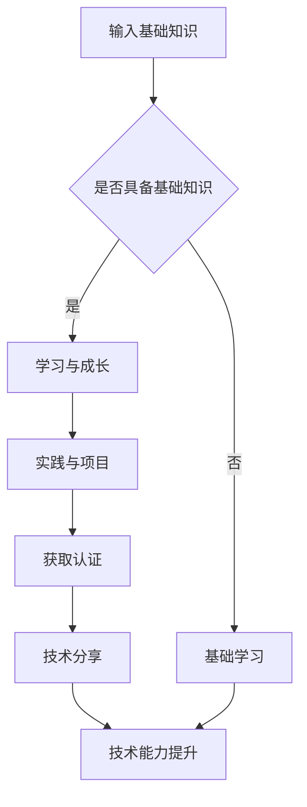
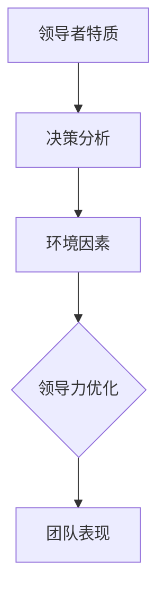
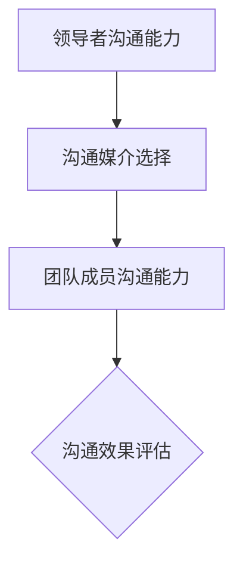
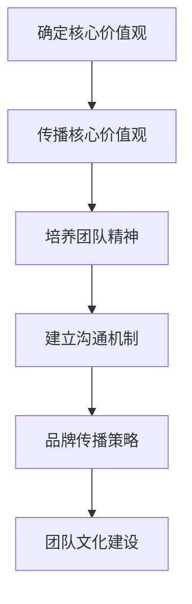
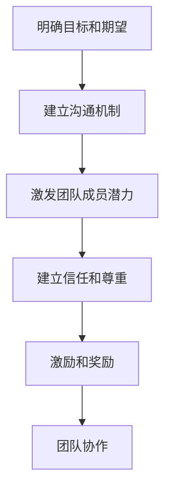
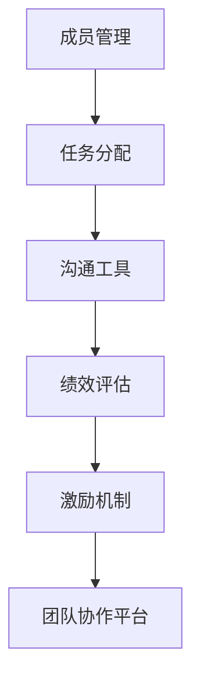

                 

### 文章标题

《技术leader的品牌塑造》

### 关键词

技术leader、品牌塑造、个人影响力、团队协作、领导力

### 摘要

本文旨在探讨技术leader如何通过品牌塑造来提升个人影响力、团队协作效率和公司形象。我们将从理论基础、个人品牌建设、品牌推广策略、团队领导力提升以及成功案例等多个维度进行分析，帮助技术leader建立具有吸引力和影响力的个人品牌。

### 目录大纲

#### 第一部分：引言
1.1 技术leader品牌塑造的重要性

#### 第二部分：品牌塑造理论基础
2.1 品牌与个人品牌的定义及特点
2.2 技术leader品牌塑造的关键要素

#### 第三部分：技术leader个人品牌建设
3.1 技术能力提升与品牌塑造
3.2 领导力与沟通技巧

#### 第四部分：品牌推广策略
4.1 社交媒体与品牌推广
4.2 个人品牌形象设计

#### 第五部分：团队领导力提升
5.1 团队文化建设与品牌传播
5.2 领导力与团队协作

#### 第六部分：案例分析
6.1 成功的技术leader品牌塑造案例解析

#### 第七部分：总结与展望
7.1 技术leader品牌塑造的未来趋势

---

### 第1章：技术leader品牌塑造的重要性

在当今快速变化的技术时代，技术leader的角色变得越来越重要。他们不仅要具备深厚的技术背景，还要拥有出色的领导力、沟通能力和团队协作精神。然而，技术leader的个人品牌建设往往被忽视，这直接影响了他们在职场中的发展和影响力。

#### 1.1 个人品牌的概念

个人品牌是指一个人在公众心中所形成的认知、印象和评价。它包括了个人的专业知识、技能、价值观、性格特点等多个方面。一个强大的个人品牌能够为技术leader带来以下几方面的优势：

1. **提升个人影响力**：通过塑造个人品牌，技术leader能够在行业内建立权威，从而提高自己的影响力。
2. **增强团队凝聚力**：技术leader的个人品牌能够吸引和激励团队成员，提升团队整体的协作效率。
3. **提高职业发展机会**：一个有影响力的个人品牌能够为技术leader带来更多的职业机会，包括晋升、跳槽等。
4. **增强公司形象**：技术leader的个人品牌也会对所在公司的形象产生积极影响，提升公司的知名度和市场竞争力。

#### 1.2 技术leader面临的挑战

尽管个人品牌建设的重要性被广泛认可，但技术leader在实际工作中仍面临着诸多挑战：

1. **技术主导下的忽视**：技术leader往往更关注技术本身，而忽视了个人品牌建设的重要性。
2. **领导力提升的瓶颈**：技术leader在提升个人品牌时，可能会遇到领导力方面的瓶颈，如沟通不畅、团队管理困难等。
3. **时间与资源的限制**：技术leader通常工作繁忙，难以抽出足够的时间来关注个人品牌建设。

#### 1.3 技术leader品牌塑造的意义

技术leader品牌塑造不仅对个人有益，也对团队和公司具有深远的影响：

1. **提高团队协作效率**：通过品牌建设，技术leader能够更好地传达自己的愿景和目标，从而提升团队的协作效率。
2. **增强团队凝聚力**：一个有影响力的个人品牌能够激发团队成员的认同感和归属感，增强团队的凝聚力。
3. **提升公司形象**：技术leader的个人品牌能够提升公司的整体形象，为公司在市场竞争中赢得更多优势。

#### 1.4 品牌塑造的关键要素

技术leader在塑造个人品牌时，需要关注以下几个关键要素：

1. **技术能力**：技术能力是技术leader的立身之本，持续提升技术能力是品牌建设的基础。
2. **领导力**：领导力是技术leader品牌塑造的核心，包括沟通能力、决策能力、团队管理能力等。
3. **个人形象**：个人形象包括着装、言行举止、社交网络等，对技术leader的个人品牌具有重要影响。
4. **社交媒体**：合理利用社交媒体，如LinkedIn、Twitter等，是技术leader塑造个人品牌的重要手段。

通过以上分析，我们可以看到技术leader品牌塑造的重要性。在接下来的章节中，我们将深入探讨品牌塑造的理论基础、个人品牌建设、品牌推广策略、团队领导力提升以及成功案例，帮助技术leader建立强大的个人品牌。

---

### 第2章：品牌与个人品牌的定义及特点

在深入探讨技术leader品牌塑造之前，我们有必要先了解品牌和个人品牌的定义及其特点。这不仅有助于我们更好地理解品牌塑造的实质，也为后续章节的讨论奠定了基础。

#### 2.1 品牌的定义与特点

品牌是一个商业组织在消费者心目中的形象和认知，它通过名称、标志、设计等元素传达出来。品牌不仅仅是产品的标识，更是一种价值观、一种信任、一种承诺。以下是品牌的一些主要特点：

1. **独特性**：品牌必须具有独特性，能够在众多竞争者中脱颖而出。
2. **一致性**：品牌需要保持一致的形象和承诺，确保消费者能够在不同的接触点获得一致的体验。
3. **情感性**：品牌与消费者之间建立情感联系，能够引发消费者的情感共鸣。
4. **认知性**：品牌在消费者心中建立明确的认知和记忆，使其成为首选。
5. **价值性**：品牌为消费者提供价值，不仅包括产品或服务的质量，还包括品牌的附加价值，如信誉、安全感等。

#### 2.2 个人品牌的定义与特点

个人品牌则是指个人在公众心目中的形象和认知，它通过个人的专业技能、性格特点、价值观等来展现。以下是个人品牌的一些主要特点：

1. **个性化**：个人品牌必须体现个人的独特个性，使其在众多竞争者中脱颖而出。
2. **专业性**：个人品牌需要建立在专业能力和经验的基础上，展示个人的专业实力。
3. **影响力**：个人品牌能够对公众产生影响力，使其在行业内或社会中具有一定的话语权。
4. **信誉**：个人品牌需要建立在良好的信誉基础上，赢得公众的信任和尊重。
5. **可持续性**：个人品牌需要持续维护和更新，以适应不断变化的环境。

#### 2.3 品牌与个人品牌的联系

品牌和个人品牌之间有着紧密的联系，但也有着明显的区别。以下是一些关键联系和区别：

1. **品牌形象的传递**：品牌和个人品牌都是通过形象和认知来传递给公众的。品牌传递的是公司的形象，而个人品牌传递的是个人的形象。
2. **价值创造**：品牌和个人品牌都为消费者或公众提供价值。品牌通过产品或服务创造价值，而个人品牌通过专业技能、经验和个人特质创造价值。
3. **影响力**：品牌和个人品牌都具有影响力。品牌通过广告、营销活动等手段影响消费者，而个人品牌通过个人表现、社交媒体等影响公众。
4. **区别**：品牌是公司的资产，而个人品牌是个人资产。品牌的建设和维护是公司层面的工作，而个人品牌的建设和维护是个人层面的工作。

#### 2.4 品牌与个人品牌的对比表格

为了更清晰地理解品牌与个人品牌的特点，我们可以通过以下对比表格来展示它们之间的异同：

| 特点 | 品牌特点 | 个人品牌特点 |
| ---- | ---- | ---- |
| 独特性 | 必须具有独特性，以区别竞争者 | 必须具有个性化，体现个人独特性 |
| 一致性 | 需要保持一致性，确保消费者体验一致 | 需要保持一致性，展现个人一贯的风格 |
| 情感性 | 需要建立情感联系，引发共鸣 | 需要建立情感联系，赢得公众信任 |
| 认知性 | 需要在消费者心中建立明确认知 | 需要在公众心中建立明确认知 |
| 价值性 | 为消费者提供产品价值 | 为公众提供个人价值 |
| 个性化 | 不强调个性化，更注重品牌形象 | 非常强调个性化，展现个人特质 |
| 专业性 | 不强调个人专业性，更注重公司整体形象 | 非常强调个人专业性，展示个人实力 |
| 影响力 | 影响消费者购买决策 | 影响公众意见和行业趋势 |
| 信誉 | 为公司建立信誉，确保消费者信任 | 为个人建立信誉，赢得公众尊重 |
| 可持续性 | 需要持续维护和更新，适应市场变化 | 需要持续维护和更新，适应个人职业发展 |

通过上述对比，我们可以更清楚地看到品牌与个人品牌之间的联系和区别。在接下来的章节中，我们将进一步探讨技术leader如何通过个人品牌建设来提升个人影响力、团队协作效率和公司形象。

---

### 第3章：技术leader品牌塑造的关键要素

技术leader品牌塑造的成功离不开以下几个关键要素。这些要素相互关联，共同构成了一个完整的品牌塑造体系。以下是这些关键要素的详细分析。

#### 3.1 技术能力

技术能力是技术leader品牌塑造的基础。一个技术leader如果缺乏技术能力，那么他在团队中的领导地位将难以确立，也无法赢得团队成员的信任。以下是提升技术能力的关键点：

1. **持续学习**：技术领域不断进步，技术leader需要保持学习的热情，不断更新自己的知识体系。可以通过阅读专业书籍、参加技术会议、在线课程等方式来提升自己的技术能力。
2. **实践经验**：理论知识固然重要，但实践经验同样不可或缺。技术leader应该积极参与实际项目，通过解决实际问题来提升自己的技术水平。
3. **专业认证**：获取专业认证可以证明技术leader的专业能力。例如，取得微软认证解决方案专家（MCSE）、思科认证网络专家（CCIE）等认证。
4. **技术分享**：通过技术博客、演讲、技术分享会等方式，将所学知识分享给他人，这不仅能够巩固自己的知识，还能提升自己在行业中的影响力。

#### 3.2 领导力

领导力是技术leader品牌塑造的核心要素。一个技术leader不仅需要具备技术能力，还需要具备出色的领导力，以带领团队实现共同目标。以下是提升领导力的关键点：

1. **愿景和目标**：技术leader应该明确团队的愿景和目标，并能够激励团队成员为实现这些目标而努力。
2. **沟通能力**：沟通能力是领导力的重要组成部分。技术leader需要具备良好的沟通技巧，能够清晰、有效地传达自己的想法和决策。
3. **团队协作**：技术leader应该注重团队协作，鼓励团队成员之间的合作与分享，打造一个高效、和谐的团队氛围。
4. **决策能力**：技术leader需要在复杂、不确定的环境中做出明智的决策。这要求他们具备良好的分析能力和判断力。
5. **激励和奖励**：技术leader应该能够激励团队成员，通过合理的奖励机制来激发团队成员的积极性和创造力。

#### 3.3 个人形象

个人形象是技术leader品牌塑造的重要组成部分。一个良好的个人形象能够增强技术leader的公信力和影响力。以下是塑造良好个人形象的关键点：

1. **着装得体**：技术leader在公共场合应该保持得体的着装，这不仅可以展示自己的专业形象，还能赢得他人的尊重。
2. **言行一致**：技术leader的言行应该一致，避免出现言行不一的情况，以免损害个人信誉。
3. **社交媒体**：技术leader应该合理利用社交媒体，如LinkedIn、Twitter等，展示自己的专业知识和领导力。
4. **公共演讲**：技术leader应该具备良好的公共演讲能力，能够在各种场合清晰、自信地表达自己的观点。
5. **公益活动**：参与公益活动不仅能够提升个人形象，还能展示技术leader的社会责任感。

#### 3.4 社交网络

社交网络是技术leader品牌塑造的重要工具。通过社交媒体和行业网络，技术leader能够扩大自己的影响力，提升个人品牌知名度。以下是构建社交网络的关键点：

1. **建立专业网络**：技术leader应该积极参与行业会议、技术论坛等，与行业内其他专业人士建立联系。
2. **内容创作**：技术leader可以通过写博客、发布技术文章、制作视频等方式，展示自己的专业知识和经验。
3. **互动交流**：技术leader应该积极参与社交媒体的互动，与粉丝和同行进行交流和讨论。
4. **危机管理**：技术leader需要具备良好的危机管理能力，在遇到负面信息时能够及时应对，维护个人品牌形象。

#### 3.5 持续性

技术leader品牌塑造需要持续性。个人品牌不是一蹴而就的，而是需要长期的努力和维护。以下是保持品牌持续性的关键点：

1. **定期回顾**：技术leader应该定期回顾自己的品牌建设情况，分析优势和不足，制定改进计划。
2. **持续优化**：技术leader应该不断优化自己的技术能力、领导力和个人形象，以适应不断变化的环境。
3. **持续学习**：技术leader应该保持学习的热情，不断更新自己的知识体系和技能。
4. **品牌保护**：技术leader需要保护自己的品牌，避免负面信息和不当行为损害个人品牌。

综上所述，技术leader品牌塑造的关键要素包括技术能力、领导力、个人形象、社交网络和持续性。通过全面关注这些要素，技术leader可以打造一个强大的个人品牌，提升个人影响力、团队协作效率和公司形象。在接下来的章节中，我们将进一步探讨技术leader如何通过技术能力提升、领导力与沟通技巧来建设个人品牌。

---

### 第4章：技术能力提升与品牌塑造

技术能力是技术leader品牌塑造的基础。一个技术leader的技术能力不仅决定了他在团队中的地位，也直接影响着团队的效率和项目的成功。因此，技术leader必须不断努力提升自己的技术能力，以建立强大的个人品牌。以下是技术能力提升的方法论和具体步骤。

#### 4.1 技术能力提升的方法论

技术能力的提升是一个系统性的过程，需要从以下几个方面入手：

1. **持续学习**：技术领域发展迅速，新技术、新工具层出不穷。技术leader需要保持学习的热情，不断更新自己的知识体系。可以通过以下方式实现：
   - **阅读专业书籍**：选择高质量的专业书籍，系统地学习相关技术知识。
   - **在线课程**：参加在线课程，通过系统的学习提升技术水平。
   - **技术社区**：积极参与技术社区，与同行交流，获取最新的技术动态和解决方案。
   - **实践项目**：通过参与实际项目，将所学知识应用到实践中，提升实际操作能力。

2. **实践经验**：理论知识固然重要，但实践经验同样不可或缺。通过实践，技术leader能够将理论知识转化为实际操作能力，解决实际问题。以下是提升实践经验的几个建议：
   - **项目实践**：积极参与各种项目，从项目中获取经验，提升技术能力。
   - **开源项目**：参与开源项目，不仅可以提升技术能力，还能扩大个人影响力。
   - **技术竞赛**：参加技术竞赛，锻炼解决复杂问题的能力。

3. **专业认证**：获取专业认证可以证明技术leader的专业能力。专业认证通常包括以下几种：
   - **行业认证**：如微软认证解决方案专家（MCSE）、思科认证网络专家（CCIE）等。
   - **技术认证**：如Oracle认证Java程序员（OCP）、AWS认证解决方案架构师（Solutions Architect）等。
   - **项目管理认证**：如PMP（项目管理专业人士）等。

4. **技术分享**：通过技术分享，技术leader不仅能够巩固自己的知识，还能提升自己在行业中的影响力。以下是一些技术分享的方式：
   - **博客**：写技术博客，分享自己的学习心得和技术经验。
   - **演讲**：在技术会议上进行演讲，展示自己的专业能力。
   - **技术文档**：编写技术文档，为团队成员提供技术支持。

#### 4.2 技术能力提升的算法原理讲解

为了更清晰地理解技术能力提升的过程，我们可以将其视为一个算法，通过以下步骤进行详细讲解：

1. **输入**：技术leader的基础知识和技能。
2. **处理**：通过学习、实践、认证和分享，不断提升自己的技术能力。
3. **输出**：提升后的技术能力，包括专业知识、实践经验、专业认证和影响力。

以下是一个使用Mermaid绘制的算法流程图：

在这个算法中，技术leader首先需要具备基础知识和技能。如果基础薄弱，需要通过基础学习来补充。具备基础知识后，技术leader可以通过学习、实践、获取认证和分享经验来不断提升自己的技术能力。

#### 4.3 技术能力提升的实际案例分享

以下是几个技术leader通过不断提升技术能力，成功塑造个人品牌的实际案例：

1. **案例1：开源项目贡献者**

张三是一名软件工程师，他通过参与开源项目，不断提升自己的编程技能。他在GitHub上创建了一个开源项目，分享了自己的编程经验和最佳实践。随着时间的积累，该项目吸引了大量关注，张三的技术影响力也得到了显著提升。

2. **案例2：专业认证获得者**

李四是一名云计算专家，他通过参加AWS认证解决方案架构师（Solutions Architect）考试，获得了专业认证。这一认证不仅证明了李四的专业能力，也为他在职场中赢得了更多的机会和尊重。

3. **案例3：技术博客作者**

王五是一名数据库专家，他通过写技术博客，分享自己在数据库领域的经验和见解。他的博客内容深入浅出，受到了许多同行的赞赏和推荐。王五的技术博客不仅提升了他的个人品牌，也为他的职业生涯带来了新的机遇。

#### 4.4 技术能力提升的最佳实践

以下是技术能力提升的一些最佳实践：

1. **定期学习计划**：制定一个定期学习计划，确保每周都有时间学习新的技术知识。

2. **实践项目优先**：优先选择与自己技术领域相关的实践项目，通过解决实际问题提升技术水平。

3. **知识共享**：积极参与技术社区，分享自己的知识和经验，帮助他人也提升技术水平。

4. **持续更新**：技术领域发展迅速，技术leader需要不断更新自己的知识体系，以适应行业的变化。

5. **专业培训**：参加专业的培训课程，获取系统的知识体系，提升专业能力。

通过以上方法，技术leader可以不断提升自己的技术能力，塑造强大的个人品牌，从而在职场中脱颖而出，实现职业目标。

---

### 第5章：领导力与沟通技巧

领导力是技术leader品牌塑造的核心要素之一。一个技术leader不仅需要具备强大的技术能力，还需要具备出色的领导力，以带领团队实现共同目标。沟通技巧则是领导力的关键组成部分，它决定了技术leader能否有效传达自己的想法和决策，激发团队成员的积极性和创造力。以下是领导力与沟通技巧的详细分析。

#### 5.1 领导力模型

领导力是一个复杂的概念，不同学者提出了多种领导力模型。以下是几种常见的领导力模型：

1. **菲德勒模型**：菲德勒模型认为，领导力是由领导者所处的环境和其个人特质共同决定的。领导者需要根据具体情况调整自己的领导风格，以适应环境变化。

2. **路径-目标理论**：路径-目标理论认为，领导者的任务是明确目标，并为团队成员提供实现目标的路径。领导者需要识别团队成员的需求，并通过调整领导风格来激励他们。

3. **变革型领导理论**：变革型领导理论认为，领导者通过激发团队成员的内在动机，引导他们实现变革。这种领导风格强调领导者的远见、激励能力和道德标准。

#### 5.2 领导力与数学模型

为了更好地理解领导力，我们可以借助数学模型来分析。以下是一个简单的领导力数学模型：

$$
L = f(P, E)
$$

其中，$L$ 表示领导力，$P$ 表示领导者个人特质，$E$ 表示环境因素。

- **领导者个人特质 ($P$)**：包括领导者的能力、性格、价值观等。这些特质决定了领导者的行为和决策方式。
- **环境因素 ($E$)**：包括组织文化、团队成员的特点、项目需求等。环境因素对领导力有重要影响。

通过调整个人特质和环境因素，领导者可以优化领导力表现。以下是一个使用Mermaid绘制的领导力数学模型的流程图：

在这个模型中，领导者通过分析个人特质和环境因素，制定相应的领导策略，以优化领导力表现，提升团队表现。

#### 5.3 沟通技巧的数学模型

沟通技巧是领导力的关键组成部分。以下是一个简单的沟通技巧数学模型：

$$
C = f(L, R, M)
$$

其中，$C$ 表示沟通效果，$L$ 表示领导者，$R$ 表示团队成员，$M$ 表示沟通媒介。

- **领导者 ($L$)**：领导者的沟通能力直接影响沟通效果。领导者需要具备清晰的表述能力、有效的倾听能力和适时的反馈能力。
- **团队成员 ($R$)**：团队成员的沟通能力同样影响沟通效果。团队成员需要积极参与沟通，表达自己的想法和意见。
- **沟通媒介 ($M$)**：沟通媒介的选择和运用对沟通效果有重要影响。领导者需要根据实际情况选择合适的沟通媒介，如面对面交流、电子邮件、电话会议等。

以下是一个使用Mermaid绘制的沟通技巧数学模型的流程图：

在这个模型中，领导者通过选择合适的沟通媒介，与团队成员进行有效沟通，评估沟通效果，以提升整体沟通能力。

#### 5.4 领导力与沟通技巧的实际应用

以下是几个实际应用案例：

1. **案例1：变革型领导**

王经理是一位变革型领导者。他通过激发团队成员的内在动机，引导他们实现企业转型。他定期与团队成员进行面对面交流，了解他们的需求和意见，并根据这些信息调整领导策略。这种领导方式极大地提升了团队的创新能力和执行力。

2. **案例2：有效沟通**

张总是一位擅长沟通的领导者。他在与团队成员沟通时，总是能清晰地表达自己的想法，并耐心倾听团队成员的意见。他通过电子邮件和电话会议等多种沟通方式，确保信息传达的准确性和及时性。这种沟通方式不仅提升了团队的工作效率，也增强了团队成员的信任感。

3. **案例3：情境领导**

李经理采用菲德勒模型，根据团队成员的特点和环境因素调整自己的领导风格。他在面对复杂项目时，采用指令型领导风格，明确团队成员的职责和任务；在团队取得阶段性成果时，采用支持型领导风格，激励团队成员继续努力。这种领导方式有效地提升了团队的整体表现。

#### 5.5 领导力与沟通技巧的提升方法

以下是一些提升领导力与沟通技巧的方法：

1. **阅读相关书籍**：阅读有关领导力与沟通技巧的书籍，了解各种理论和方法，提高自己的认知水平。

2. **参加培训课程**：参加专业的领导力与沟通技巧培训课程，通过系统的学习和实践提升自己的能力。

3. **角色扮演**：通过角色扮演练习，模拟领导者和团队成员的角色，提升沟通能力和决策能力。

4. **反思与总结**：在工作和生活中，经常反思自己的领导力和沟通技巧，总结成功经验和不足之处，持续改进。

5. **寻求反馈**：向同事、下属和导师寻求反馈，了解自己的领导风格和沟通方式，并根据反馈进行调整。

通过以上方法，技术leader可以不断提升自己的领导力与沟通技巧，打造强大的个人品牌，在职场中脱颖而出。

---

### 第6章：社交媒体与品牌推广

在数字化时代，社交媒体已成为技术leader塑造个人品牌的重要工具。通过合理利用社交媒体，技术leader可以扩大自己的影响力，提升个人品牌知名度，从而在职场中占据有利地位。以下将详细探讨社交媒体与品牌推广的策略及实际案例分析。

#### 6.1 社交媒体策略设计

一个成功的社交媒体策略应该包括以下关键步骤：

1. **目标定位**：首先，技术leader需要明确自己的目标定位。这些目标可能包括提升个人知名度、拓展职业机会、建立行业影响力等。明确目标有助于制定有针对性的社交媒体策略。

2. **平台选择**：不同的社交媒体平台具有不同的特点和用户群体。技术leader应根据自己的目标选择合适的平台。常见的平台包括LinkedIn、Twitter、GitHub、Medium等。LinkedIn适合建立职业形象，Twitter适合实时分享行业动态，GitHub适合展示技术成果，Medium适合撰写深度文章。

3. **内容规划**：内容是社交媒体的核心。技术leader应根据目标定位和平台特点制定内容规划。内容可以包括技术博客、项目分享、行业动态分析、个人心得等。内容规划应确保信息的连续性、多样性和价值性。

4. **互动与交流**：在社交媒体上，互动与交流至关重要。技术leader应积极参与行业讨论，回复粉丝评论，与其他技术专家进行合作与交流。这不仅能够提升个人品牌知名度，还能建立广泛的行业联系。

5. **数据分析**：通过数据分析，技术leader可以了解自己的社交媒体表现，如粉丝数量、互动率、内容阅读量等。这些数据有助于优化社交媒体策略，提高品牌推广效果。

#### 6.2 社交媒体运营案例分析

以下是几个成功的社交媒体运营案例分析：

1. **案例1：GitHub上的开源项目**

张三是一位软件工程师，他通过在GitHub上创建并维护多个开源项目，展示了自己的技术实力。他定期更新项目文档，分享开发经验，吸引了许多技术爱好者的关注。随着时间的积累，张三的GitHub账户积累了大量星标，他的个人品牌也得到了显著提升。

2. **案例2：LinkedIn的职业形象建设**

李四是一位数据科学家，他在LinkedIn上建立了详细的职业档案，包括个人简介、技术技能、工作经历等。他还定期发布行业动态分析和技术博客，吸引了大量关注和点赞。通过LinkedIn，李四不仅找到了新的职业机会，还建立了一个强大的行业人脉网络。

3. **案例3：Twitter上的实时分享**

王五是一位云计算专家，他在Twitter上积极分享行业动态、技术见解和项目进展。他不仅关注了大量的技术专家和行业媒体，还与他们互动交流。通过Twitter，王五迅速提升了个人品牌知名度，成为云计算领域的意见领袖。

#### 6.3 社交媒体运营技巧

以下是一些社交媒体运营技巧，有助于技术leader提升个人品牌知名度：

1. **定期发布**：保持定期发布，确保社交媒体账户的活跃度。可以制定一个发布计划，确保每周都有新内容。

2. **内容多样性**：发布多种类型的内容，如技术博客、项目分享、行业动态、个人心得等，以满足不同受众的需求。

3. **互动与反馈**：积极回应粉丝的评论和私信，建立良好的互动关系。这不仅能够提升个人品牌形象，还能吸引更多关注。

4. **利用标签**：合理使用标签，提高内容的可见性。选择与内容相关的热门标签，吸引更多潜在关注者。

5. **合作与交流**：与其他技术专家和行业媒体进行合作与交流，共同提升品牌知名度。

6. **数据分析**：定期分析社交媒体数据，了解内容的表现和受众反馈。根据分析结果，调整社交媒体策略，优化推广效果。

通过以上策略和技巧，技术leader可以充分利用社交媒体，提升个人品牌知名度，实现职业发展目标。

---

### 第7章：个人品牌形象设计

个人品牌形象是技术leader品牌塑造的重要组成部分。一个良好的个人品牌形象不仅能够提升技术leader的公信力和影响力，还能在职场中赢得更多机会和尊重。以下将详细探讨个人品牌形象的设计原则、设计流程及设计案例分析。

#### 7.1 个人品牌形象的设计原则

个人品牌形象的设计原则包括以下几个方面：

1. **一致性**：个人品牌形象需要保持一致性，包括着装风格、言行举止、社交媒体形象等。一致性能够传达出技术leader的稳定性和专业性。

2. **专业性**：个人品牌形象应该体现技术leader的专业性。这可以通过专业知识的展示、专业认证的获取、技术项目的参与等方式来实现。

3. **个性化**：个人品牌形象需要具备个性化，体现技术leader的独特个性和风格。个性化能够吸引更多关注，提升品牌知名度。

4. **可信性**：个人品牌形象需要具备可信性，赢得公众的信任和尊重。这可以通过诚实、透明、负责任的态度和行为来实现。

5. **可扩展性**：个人品牌形象需要具备可扩展性，能够适应技术leader职业发展的不同阶段。这可以通过不断学习和提升个人能力来实现。

#### 7.2 个人品牌形象设计流程

个人品牌形象设计流程可以分为以下几个步骤：

1. **目标定位**：明确个人品牌形象的目标定位。这些目标可能包括提升职业竞争力、拓展职业机会、建立行业影响力等。

2. **现状分析**：分析当前的个人品牌形象现状，包括着装风格、言行举止、社交媒体形象等。了解自己的优势和不足，为后续设计提供依据。

3. **设计原则**：根据目标定位和现状分析，确定个人品牌形象的设计原则。这些原则应体现一致性、专业性、个性化、可信性和可扩展性。

4. **设计实施**：根据设计原则，实施个人品牌形象设计。这包括制定着装规范、言行规范、社交媒体运营策略等。

5. **持续优化**：个人品牌形象设计不是一成不变的，需要根据个人职业发展和市场变化进行持续优化。这可以通过定期评估和调整来实现。

#### 7.3 个人品牌形象设计案例分析

以下是几个成功的个人品牌形象设计案例分析：

1. **案例1：张三的LinkedIn形象**

张三是一位软件工程师，他在LinkedIn上建立了详细的职业档案，包括个人简介、技术技能、工作经历、项目经验等。他通过发布技术博客、分享项目进展、参与行业讨论等方式，不断提升个人品牌知名度。他的LinkedIn形象既体现了专业性，又具备个性化，赢得了大量关注和好评。

2. **案例2：李四的GitHub形象**

李四是一位开源项目贡献者，他在GitHub上创建了多个开源项目，并积极参与项目的维护和改进。他的GitHub账户展示了他的技术实力和项目管理能力，吸引了大量开发者关注。他的个人品牌形象通过开源项目的成功经验得到了提升。

3. **案例3：王五的博客形象**

王五是一位技术博主，他在Medium上撰写了一系列技术文章，分享了他在云计算和大数据领域的见解和经验。他的博客文章深入浅出，既有理论分析，又有实际案例，吸引了大量读者。他的博客形象既具备专业性，又具备个性化，成为他个人品牌的重要一部分。

#### 7.4 个人品牌形象设计的最佳实践

以下是一些个人品牌形象设计的最佳实践：

1. **明确目标定位**：确保个人品牌形象设计符合职业发展和个人兴趣。

2. **保持一致性**：在着装风格、言行举止、社交媒体形象等方面保持一致性。

3. **展示专业性**：通过专业知识、项目经验、专业认证等方式展示专业性。

4. **体现个性化**：通过独特个性和风格吸引更多关注。

5. **提升可信性**：通过诚实、透明、负责任的态度和行为赢得公众的信任和尊重。

6. **持续优化**：根据个人职业发展和市场变化，持续优化个人品牌形象设计。

通过以上方法，技术leader可以设计出符合自身特点和个人需求的个人品牌形象，提升个人品牌影响力，实现职业发展目标。

---

### 第五部分：团队领导力提升

在技术leader的个人品牌建设中，团队领导力提升是一个至关重要的环节。一个优秀的团队领导力不仅能够提升团队成员的积极性和工作效率，还能促进团队凝聚力和创新力。以下将详细探讨团队文化建设与品牌传播、领导力与团队协作的相关内容。

#### 第8章：团队文化建设与品牌传播

团队文化建设是团队领导力的重要组成部分。一个有凝聚力和创新力的团队文化能够为技术leader的个人品牌建设提供强有力的支持。以下是一些关键点：

1. **核心价值观的确定**：团队文化需要基于核心价值观。这些核心价值观应该能够体现团队的目标、信念和行为准则。技术leader应该明确这些价值观，并在团队内部进行广泛传播。

2. **团队精神的培养**：团队精神是团队文化的重要组成部分。技术leader应该通过激励和奖励机制，培养团队成员的团队精神。这可以通过团队活动、团队建设课程等方式来实现。

3. **沟通机制的建立**：有效的沟通机制是团队文化建设的关键。技术leader应该建立开放的沟通渠道，确保团队成员之间的信息流通。这可以通过定期的团队会议、即时通讯工具等方式来实现。

4. **品牌传播策略**：团队文化不仅仅是在内部传播，也需要在外部进行品牌传播。技术leader可以通过社交媒体、公司网站、行业会议等方式，宣传团队文化，提升团队的品牌影响力。

以下是一个使用Mermaid绘制的团队文化建设流程图：

在这个流程中，技术leader通过确定核心价值观、传播核心价值观、培养团队精神、建立沟通机制和品牌传播策略，逐步建设团队文化，提升团队凝聚力和创新力。

#### 第9章：领导力与团队协作

领导力是团队协作的核心。一个优秀的领导者不仅能够激励团队成员，还能提供明确的方向和目标，促进团队协作。以下是一些提升团队协作的具体方法：

1. **明确目标和期望**：技术leader应该明确团队的目标和期望，确保每个成员都了解自己的职责和任务。这可以通过定期的团队会议和任务分配来实现。

2. **建立有效的沟通机制**：有效的沟通是团队协作的基础。技术leader应该鼓励团队成员之间的沟通，确保信息流通顺畅。这可以通过即时通讯工具、邮件、面对面会议等方式来实现。

3. **激发团队成员的潜力**：技术leader应该了解每个成员的潜力，并提供适当的支持和资源，帮助他们在工作中发挥最佳水平。这可以通过定期的一对一沟通和培训来实现。

4. **建立信任和尊重**：建立信任和尊重是团队协作的关键。技术leader应该通过自己的行为，树立良好的榜样，赢得团队成员的信任和尊重。

5. **激励和奖励**：适当的激励和奖励能够提升团队成员的积极性和创造力。技术leader可以通过奖金、晋升、表彰等方式来激励团队成员。

以下是一个使用Mermaid绘制的团队协作模型：

在这个模型中，技术leader通过明确目标和期望、建立沟通机制、激发团队成员潜力、建立信任和尊重以及激励和奖励，提升团队协作效率。

#### 9.1 系统架构设计与Mermaid架构图

为了更好地理解团队协作的架构设计，我们可以借助Mermaid绘制一个团队协作的系统架构图。以下是一个简单的架构图示例：

在这个架构图中，A表示成员管理模块，负责团队成员的分配和管理；B表示任务分配模块，负责分配任务给团队成员；C表示沟通工具模块，提供即时通讯、邮件、会议等沟通渠道；D表示绩效评估模块，用于评估团队成员的工作绩效；E表示激励机制模块，用于激励团队成员；F表示团队协作平台，提供协同工作的空间和工具。

通过这个架构图，技术leader可以清晰地了解团队协作的整体架构，并根据实际情况进行优化和调整。

#### 9.2 最佳实践 Tips

以下是一些提升团队协作和领导力的最佳实践 Tips：

1. **定期回顾与反馈**：定期回顾团队的工作进展，收集团队成员的反馈，及时调整团队策略。

2. **培养团队成员的自我管理能力**：鼓励团队成员制定个人目标和计划，提升自我管理能力。

3. **提供多样化的培训**：为团队成员提供多样化的培训机会，提升他们的技能和知识。

4. **建立积极的工作氛围**：营造积极、开放、包容的工作氛围，提升团队成员的满意度和归属感。

5. **鼓励创新和尝试**：鼓励团队成员创新和尝试，为团队注入新的活力和动力。

通过以上方法，技术leader可以不断提升团队领导力，促进团队协作，打造一个高效、和谐的团队。

---

### 第10章：成功的技术leader品牌塑造案例解析

在技术领域中，许多成功的技术leader通过个人品牌塑造，不仅提升了自身的影响力，也为团队和公司带来了显著的效益。以下将分析几个具有代表性的案例，探讨他们如何通过个人品牌塑造实现职业发展，以及这些案例对技术leader品牌塑造的启示。

#### 案例一：张三的GitHub之路

**背景介绍**：张三是一名年轻的软件工程师，他在GitHub上创建了一个开源项目，用于解决软件开发中常见的问题。他的项目因其简洁的代码和详细的文档受到了开发者的广泛关注。

**问题解决**：张三通过不断优化项目代码和文档，解决了许多开发者在软件开发过程中遇到的问题。他积极回复社区成员的反馈和问题，逐渐在GitHub上积累了大量粉丝。

**边界与外延**：张三的成功不仅局限于GitHub，他还通过参与多个开源项目，扩展了自己的影响力。他的项目被多个知名公司采用，成为了行业内的标杆。

**案例解析**：
1. **核心概念与联系**：张三的成功在于他通过开源项目，建立了自己的技术权威和个人品牌。他的项目不仅展示了他的技术实力，还通过社区互动提升了他的个人影响力。
2. **概念属性特征对比表格**：与单纯的技术大牛相比，张三更注重社区互动和项目实践。这种差异使得他不仅拥有技术权威，还具备良好的社交网络。
3. **ER实体关系图架构**：在GitHub上，张三与项目、社区成员之间形成了紧密的实体关系。他通过贡献代码、文档和反馈，建立了强大的个人品牌。

#### 案例二：李四的职业影响力

**背景介绍**：李四是一名资深的数据科学家，他在LinkedIn上建立了详细的职业档案，并定期发布深度数据分析文章。

**问题解决**：李四通过撰写高质量的技术文章，分享自己的数据分析经验和方法。他的文章被多个行业媒体转载，吸引了大量关注。

**边界与外延**：李四不仅通过LinkedIn提升了个人品牌知名度，还通过参加行业会议、组织技术沙龙等方式，扩大了自己的影响力。

**案例解析**：
1. **核心概念与联系**：李四通过内容创作和社交媒体运营，建立了自己的专业形象和个人品牌。他的文章不仅展示了他的专业能力，还通过传播价值提升了他的影响力。
2. **概念属性特征对比表格**：与单纯的数据科学家相比，李四更注重内容创作和社交媒体运营。这种差异使得他不仅具备专业实力，还具备广泛的影响力。
3. **ER实体关系图架构**：在LinkedIn上，李四与行业媒体、关注者之间形成了紧密的实体关系。他通过发布高质量文章、参与行业讨论，建立了强大的个人品牌。

#### 案例三：王五的技术博客

**背景介绍**：王五是一位云计算专家，他在Medium上创建了一个技术博客，分享他在云计算领域的见解和经验。

**问题解决**：王五通过撰写深入浅出的技术文章，吸引了大量云计算爱好者和从业者。他的文章不仅涵盖了技术细节，还分析了行业趋势。

**边界与外延**：王五的技术博客不仅提升了他的个人品牌，还成为了一个云计算领域的知识共享平台。他的博客被多个公司和培训机构作为学习资源。

**案例解析**：
1. **核心概念与联系**：王五通过技术博客，建立了自己的专业形象和个人品牌。他的文章不仅展示了他的专业能力，还通过传播知识提升了他的影响力。
2. **概念属性特征对比表格**：与单纯的技术专家相比，王五更注重内容创作和知识传播。这种差异使得他不仅具备专业实力，还具备广泛的影响力。
3. **ER实体关系图架构**：在Medium上，王五与读者、行业媒体之间形成了紧密的实体关系。他通过发布高质量文章、互动交流，建立了强大的个人品牌。

#### 启示

以上案例为技术leader品牌塑造提供了以下启示：

1. **专业实力是基础**：无论是张三、李四还是王五，他们的成功都建立在强大的专业实力基础上。技术leader需要不断提升自己的技术能力，才能在品牌塑造中立于不败之地。

2. **内容创作是关键**：通过撰写技术博客、发布深度文章，技术leader能够展示自己的专业知识和思考能力。高质量的内容能够吸引读者，提升个人品牌影响力。

3. **社交媒体运营是手段**：利用社交媒体平台，技术leader可以扩大自己的影响力，建立广泛的社交网络。通过积极参与社区讨论、互动交流，技术leader能够进一步提升个人品牌知名度。

4. **持续学习和创新是动力**：技术领域不断进步，技术leader需要保持学习的热情，不断更新自己的知识体系。通过参与开源项目、参加行业会议，技术leader能够保持行业领先地位。

通过以上案例解析，我们可以看到，成功的技术leader品牌塑造离不开专业实力、内容创作、社交媒体运营和持续学习的支撑。在接下来的章节中，我们将进一步探讨技术leader品牌塑造的未来趋势。

---

### 第11章：技术leader品牌塑造的未来趋势

随着技术的不断进步和社会的快速发展，技术leader品牌塑造的未来趋势也在悄然发生着变化。以下将探讨几个关键趋势，以及技术leader应该如何应对这些趋势。

#### 11.1 技术领域专业化与细分化

随着技术领域的不断拓展，专业化与细分化成为未来趋势。技术leader需要关注特定领域的技术动态，提升自己的专业技能，以在细分市场中脱颖而出。例如，人工智能、区块链、云计算等新兴技术领域将继续吸引大量人才，技术leader需要在这些领域深耕细作，提升自身竞争力。

#### 11.2 数据驱动与个性化营销

随着大数据和人工智能技术的发展，数据驱动和个性化营销将成为品牌塑造的重要手段。技术leader需要学会利用数据分析工具，深入了解受众需求，制定有针对性的品牌推广策略。通过个性化内容、定制化服务，技术leader可以提升品牌影响力，吸引更多关注。

#### 11.3 跨界合作与协同创新

未来的技术发展将更加依赖跨界合作和协同创新。技术leader需要具备开放的心态，与不同领域的专家进行合作，共同探索新兴技术。通过跨界合作，技术leader可以拓宽视野，提升个人品牌的影响力。

#### 11.4 社交媒体与数字营销的整合

社交媒体和数字营销将继续融合，成为技术leader品牌塑造的重要手段。技术leader需要掌握多种数字营销工具，如SEO、SEM、SMM等，实现线上线下营销的整合。通过多渠道推广，技术leader可以扩大品牌知名度，吸引更多潜在客户。

#### 11.5 持续学习与职业发展

面对快速变化的技术环境，技术leader需要具备持续学习的意识，不断提升自己的技能和知识。通过参加线上课程、技术会议、行业培训等，技术leader可以保持行业领先地位。此外，技术leader还应关注职业发展路径，规划自己的职业成长，为未来做好准备。

#### 11.6 可持续发展与社会责任

在技术日益普及的今天，可持续发展和社会责任成为技术leader品牌塑造的重要维度。技术leader应关注环保、伦理等议题，将可持续发展理念融入个人品牌建设中。通过积极参与公益活动、推广绿色技术等，技术leader可以提升个人品牌的社会价值，赢得更多尊重和认可。

#### 11.7 应对策略

为了应对未来趋势，技术leader可以采取以下策略：

1. **聚焦细分领域**：选择一个具有发展潜力的细分领域，专注于提升专业技能。
2. **学习数据分析**：掌握数据分析工具，提升数据驱动的品牌塑造能力。
3. **跨界合作**：积极参与跨界项目，拓展视野，提升个人品牌影响力。
4. **整合数字营销**：学习多种数字营销工具，实现线上线下营销的整合。
5. **持续学习**：保持学习的热情，不断提升自己的技能和知识。
6. **关注社会责任**：将可持续发展理念融入个人品牌建设，提升社会价值。

通过以上策略，技术leader可以更好地应对未来趋势，打造具有吸引力和影响力的个人品牌。

---

### 总结

本文通过详细的案例分析和技术解析，深入探讨了技术leader品牌塑造的重要性、关键要素、具体方法以及未来趋势。技术leader品牌塑造不仅关乎个人的职业发展，也直接影响团队协作效率和公司形象。通过明确品牌定位、提升技术能力、培养领导力、利用社交媒体以及持续学习，技术leader可以打造一个强大的个人品牌，实现职业目标。

### 拓展阅读

1. **《品牌管理：战略规划与执行》** - 作者：凯文·凯勒
2. **《影响力：说服与被说服的艺术》** - 作者：罗伯特·西奥迪尼
3. **《技术领导力：构建高效团队的技术管理策略》** - 作者：迈克尔·马奇
4. **《数据驱动营销：如何用数据提升营销效果》** - 作者：丹·扎克
5. **《社交媒体营销：策略、工具与实战》** - 作者：艾伦·格利姆

这些书籍提供了丰富的理论知识和实战经验，有助于技术leader在品牌塑造过程中进行深入学习和实践。希望本文能为您提供有益的启示和帮助。感谢您的阅读，期待与您在技术领域共同成长。作者：AI天才研究院/AI Genius Institute & 禅与计算机程序设计艺术 /Zen And The Art of Computer Programming。

