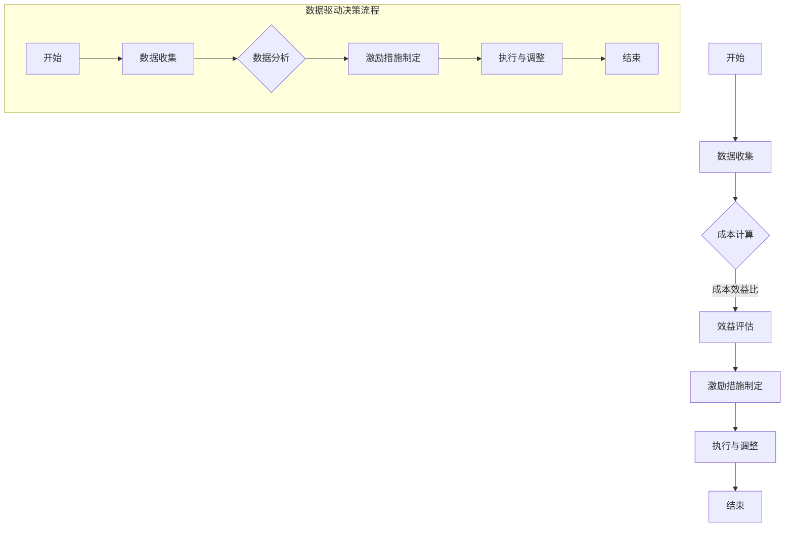
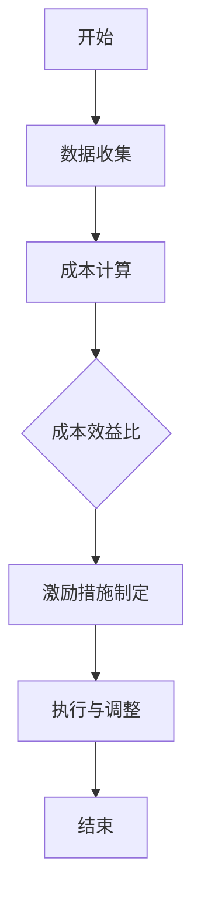
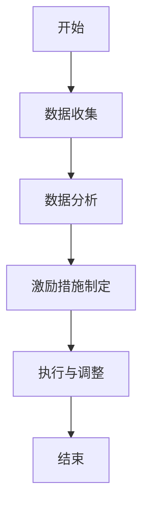
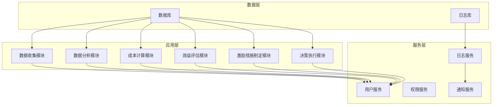
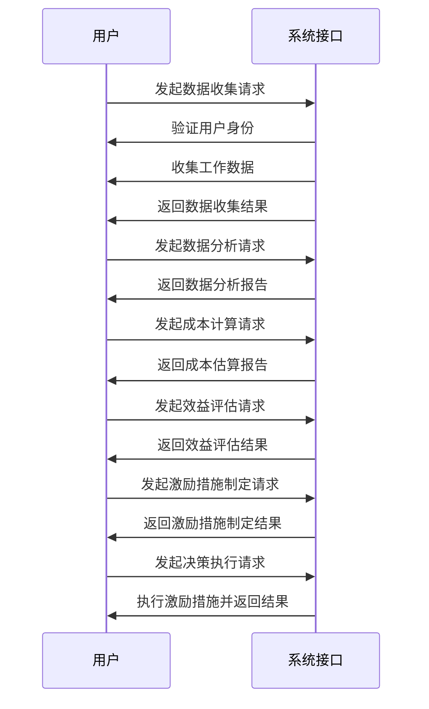

                 

### 概述：技术团队的激励机制设计

在当今快速发展的信息技术时代，技术团队作为企业创新和竞争力的重要支柱，其表现和效率直接影响着企业的成功。因此，设计一套科学、合理的激励机制成为企业高管和人力资源管理者面临的重要任务。技术团队的激励机制不仅关系到团队成员的工作积极性和创造力，也对企业文化的塑造和长远发展起着至关重要的作用。

**关键词**：技术团队、激励机制、创新、工作积极性、企业文化

**摘要**：本文旨在探讨技术团队的激励机制设计，通过分析当前技术团队面临的挑战和激励理论，阐述激励机制设计的原则、核心概念及其联系。随后，本文将介绍激励机制设计算法原理及数学模型，并结合实际案例进行详细讲解。在此基础上，本文还将讨论激励机制系统设计，包括系统功能、架构、接口及实战应用。通过本文的深入分析，希望能够为企业提供一套行之有效的技术团队激励机制设计方案，以促进技术团队的高效运作和企业竞争力的提升。

### 第1章：问题背景

#### 1.1 技术团队激励机制的重要性

随着信息技术的迅猛发展，技术团队在企业中的作用日益凸显。技术团队不仅负责产品的开发和维护，还承担着技术创新和业务拓展的重任。一个高效、积极的技术团队可以显著提升企业的竞争力，带来可观的经济效益。然而，技术团队的工作性质和特点也使其面临诸多挑战，其中如何激励团队成员成为企业高管和人力资源管理者需要深思的问题。

首先，技术团队的工作往往具有高度的专业性和复杂性。团队成员通常具备深厚的专业知识和技术能力，他们在日常工作中需要不断学习和创新。这种高专业性的特点使得技术团队在激励机制设计时需要考虑到成员的职业发展和技能提升。如果激励机制设计不当，可能会导致团队成员的流失和创新能力下降。

其次，技术团队的工作成果往往难以量化。技术工作不仅包括具体的开发任务，还涉及技术规划、团队协作等多个方面。这些工作的成果往往需要较长时间才能体现，且难以用简单的指标进行衡量。这种难以量化的特点使得传统绩效考核制度在技术团队中往往效果不佳，无法充分调动团队成员的积极性。

最后，技术团队的工作环境具有一定的特殊性。技术团队通常需要面对快速变化的市场和技术环境，工作节奏紧张，压力较大。在这样的工作环境下，单纯的物质激励可能无法满足团队成员的需求，需要结合精神激励和团队文化建设等多方面因素进行综合激励。

综上所述，设计一套科学、合理的激励机制对于技术团队至关重要。合理的激励机制不仅能够提高团队成员的工作积极性，促进技术创新和业务拓展，还能够增强团队的凝聚力和归属感，为企业长远发展奠定坚实基础。

#### 1.2 当前技术团队面临的挑战

尽管技术团队在企业发展中扮演着重要角色，但他们在工作中也面临着诸多挑战。首先，技术更新的速度越来越快，技术团队需要不断学习新技术，以保持自身的竞争力。这不仅要求团队成员具备较高的自我学习能力，还需要企业提供相应的学习资源和培训机会。

其次，技术团队的工作往往需要高度协作，但团队内部的沟通和协作并不总是一帆风顺。技术团队中的成员可能来自不同的专业背景，他们之间的沟通和理解存在一定的障碍。此外，技术团队的成员往往性格各异，如何有效地进行团队合作，成为管理者需要解决的问题。

另外，技术团队的工作压力较大。技术项目往往具有明确的时间节点和严格的交付要求，团队成员需要在高强度的工作压力下保持高效率。长期的高压工作状态容易导致团队成员的心理和身体健康问题，进而影响团队的整体表现。

最后，技术团队的工作成果难以量化，使得绩效考核成为一大难题。如何制定一套科学、合理的绩效考核标准，既能公正地评价团队成员的工作表现，又能激励他们不断进步，是企业面临的一个重要挑战。

综上所述，技术团队在面临快速技术更新、协作沟通、工作压力和绩效考核等多重挑战时，企业需要设计一套科学、合理的激励机制，以激发团队成员的积极性，提高团队的整体效率。

#### 1.3 激励机制对技术团队的影响

激励机制在技术团队中的作用至关重要，它不仅直接影响团队成员的工作积极性和创造力，还对企业文化的塑造和长远发展产生深远影响。以下是激励机制对技术团队的几个关键影响：

首先，激励机制能够显著提高团队成员的工作积极性。通过合理的激励措施，如薪酬、晋升机会和奖金，企业能够激发技术团队成员的工作热情，使其更加投入工作，从而提高工作效率和质量。例如，一家互联网公司通过设立技术竞赛和项目奖金，激发了团队成员的创新热情，不仅提高了项目的完成质量，还增强了团队的凝聚力。

其次，激励机制有助于促进技术创新。技术团队的工作本质在于不断探索和突破，而创新思维需要激励和支持。通过激励机制，企业可以为技术团队提供更多的研发资源和支持，鼓励团队成员勇于尝试新方法和新技术。例如，一家科技企业通过设立创新奖，激励团队成员进行技术攻关和产品创新，取得了显著的技术突破和市场份额。

第三，激励机制能够增强团队的合作精神。在技术团队中，合作精神是团队成功的关键。合理的激励机制可以鼓励团队成员相互支持、共同进步，从而提高团队的整体效率。例如，通过团队奖励机制，企业可以奖励那些在团队合作中表现突出的成员，从而激发更多的团队成员积极参与团队项目。

第四，激励机制有助于塑造和强化企业文化。企业文化是企业长期发展的基石，激励机制的设计和实施直接反映了企业的核心价值观和管理理念。通过激励机制，企业可以传递出对员工的尊重和信任，塑造积极向上的企业文化。例如，一家软件公司通过实施“开放沟通”的激励机制，鼓励员工提出建设性意见和反馈，不仅改善了团队的工作氛围，还增强了企业的创新能力和竞争力。

最后，激励机制对技术团队的长期发展具有深远影响。通过持续的激励机制设计，企业能够培养出一支稳定、高效的技术团队，为企业的持续创新和快速发展提供坚实的人才保障。例如，一家知名科技公司通过长期实施绩效激励和职业发展计划，培养了一批技术骨干和优秀管理者，为企业赢得了市场和技术优势。

总之，激励机制对技术团队的影响是多方面的，它不仅能够提高团队成员的工作积极性和创造力，促进技术创新和团队合作，还能够塑造和强化企业文化，为企业的长期发展奠定坚实基础。因此，企业应高度重视激励机制的设计和实施，根据实际情况进行优化和调整，以充分发挥其作用。

#### 1.4 激励理论概述

激励机制的设计离不开对激励理论的深入理解。激励理论是研究如何通过激励措施来提高员工工作效率和积极性的理论体系。经典激励理论主要包括马斯洛需求层次理论、赫茨伯格的双因素理论、麦克莱兰的成就动机理论和目标设置理论等。

**1.4.1 经典激励理论介绍**

1. **马斯洛需求层次理论**：马斯洛需求层次理论将人类需求分为五个层次，即生理需求、安全需求、社交需求、尊重需求和自我实现需求。根据这一理论，员工的工作动机受到不同层次需求的驱动，企业应根据员工的实际需求层次来设计激励机制。例如，对于处于较低层次需求的员工，可以通过提高薪酬和福利来满足其基本需求；而对于处于较高层次需求的员工，则可以通过提供职业发展机会和认可来满足其自我实现需求。

2. **赫茨伯格的双因素理论**：赫茨伯格的双因素理论认为，工作满意度与工作激励因素和工作保健因素相关。激励因素包括成就、认可、工作本身、责任感、个人成长等，这些因素能够直接提高员工的工作满意度；而保健因素包括公司政策、工作条件、薪酬、人际关系等，这些因素能够预防员工的不满意，但无法直接提高满意度。企业应关注激励因素，通过提供有挑战性的工作任务、职业晋升机会和认可奖励来提升员工满意度。

3. **麦克莱兰的成就动机理论**：麦克莱兰的成就动机理论认为，人类行为受三种基本动机驱动，即成就动机、权力动机和亲和动机。不同动机的员工对激励机制有不同的反应。例如，成就动机强的员工更看重挑战性和竞争性，企业可以通过设定具有挑战性的目标和提供竞争性的薪酬来激励他们；而权力动机强的员工则更关注控制和影响力，企业可以通过提供决策权和参与管理来激励他们。

4. **目标设置理论**：目标设置理论认为，设定具体、有挑战性的目标能够显著提高员工的工作绩效。目标应具备明确性、挑战性和可实现性，以激发员工的内在动机和努力。此外，目标设置还应与员工的个人发展计划相结合，使员工在实现工作目标的同时实现个人成长。

**1.4.2 激励理论的应用与局限**

激励理论在企业管理中得到了广泛应用，不同理论在实际操作中各有其优势和局限。

1. **优势**：
   - **针对性**：不同激励理论能够针对员工的不同需求和动机，提供个性化的激励方案，提高激励效果。
   - **指导性**：激励理论为企业提供了科学的设计和实施激励机制的依据，有助于提高管理效率。
   - **实用性**：许多激励理论在实际应用中已被证明有效，如目标设置理论在项目管理中的应用。

2. **局限**：
   - **复杂性**：激励理论种类繁多，企业在实际操作中需要根据具体情况选择合适的理论，这增加了管理复杂性。
   - **适应性**：激励理论在不同企业和行业中的应用效果可能存在差异，企业需要根据自身特点进行调整。
   - **局限性**：某些激励理论对员工行为的解释过于简化，无法涵盖所有情况，如马斯洛需求层次理论在物质激励效果上的局限性。

总之，激励理论在技术团队激励机制设计中具有重要的指导作用。企业应根据员工的实际需求和动机，结合不同理论的特点，设计出科学、合理的激励机制，以激发技术团队的工作积极性和创造力。同时，企业也应关注激励机制的灵活性和适应性，不断调整和优化，以实现最佳激励效果。

#### 1.5 激励机制设计的原则

设计技术团队的激励机制时，需要遵循一些基本原则，以确保激励机制的有效性和公平性。以下是一些关键的原则：

**1.5.1 公平性**

公平性是激励机制设计的基础。一个公平的激励机制应该确保所有成员在相同的条件下享有相同的待遇。这意味着，无论是工作经验、技能水平还是工作表现，都应该在激励设计中得到公正的考量。例如，通过设立公平的绩效评估标准和透明的奖励制度，可以避免因主观偏见或信息不对称导致的激励不公平现象。

**1.5.2 可行性**

激励机制的可行性是指其在实际操作中是否能够顺利实施。可行性原则要求企业在设计激励机制时，要考虑到资源的充足性、操作的简便性和执行的持续性。例如，过于复杂的激励方案可能会增加管理成本，导致实际操作困难。因此，设计时应确保方案简洁明了，易于执行和维护。

**1.5.3 效率性**

效率性原则强调激励机制要能够有效地激发团队成员的积极性和创造力。效率不仅体现在激励措施的快速响应上，还体现在激励效果的持久性上。一个高效的激励机制应该能够在短期和长期内都保持激励作用，避免短期激励带来的行为偏差和长期激励不足的问题。

**1.5.4 可激励性**

可激励性是指激励机制要能够针对不同成员的特点和需求进行个性化设计，以最大化地激发他们的内在动机。例如，对于追求成就的员工，可以通过设立具有挑战性的项目和奖励来实现激励；而对于注重平衡生活的员工，则可以通过灵活的工作安排和家庭友好的政策来满足他们的需求。

**1.5.5 调整性**

调整性原则要求企业能够根据外部环境和内部情况的变化，及时调整激励机制。技术团队所处的市场环境和技术环境不断变化，企业需要具备灵活性和应变能力，对激励机制进行动态调整，以确保其持续有效性。

**1.5.6 长期导向**

长期导向原则强调，激励机制设计不应仅关注短期效益，而应注重团队成员的长期发展和企业整体长远目标的实现。例如，通过提供职业发展机会和持续的技能培训，可以激励团队成员为企业长期贡献，从而实现企业长远发展目标。

综上所述，设计技术团队的激励机制时，应综合考虑公平性、可行性、效率性、可激励性、调整性和长期导向等多方面因素，以确保激励机制的合理性和有效性，从而提高技术团队的整体表现和企业的竞争力。

#### 1.6 激励机制设计的边界与外延

激励机制设计不仅受到内部因素的制约，还受到外部环境的显著影响。首先，企业文化的差异对激励机制的设计和执行有重要影响。企业文化包括企业的价值观、使命、愿景和行为准则，它不仅决定了员工的行为模式，还影响激励机制的有效性。例如，在强调协作和创新的企业文化中，团队奖励和非经济激励可能更受欢迎；而在追求效率和控制的企业文化中，经济激励和量化考核可能更为适用。

其次，市场环境的变化也是激励机制设计的重要考量因素。市场环境包括宏观经济状况、行业竞争态势和客户需求变化等。在竞争激烈的市场中，企业可能需要通过更具竞争力的薪酬和奖金来吸引和留住优秀人才；而在经济下行时期，企业可能需要更加注重成本控制和稳定员工的期望，以避免激励机制的负面效应。

最后，法律和政策的制约也是激励机制设计时不可忽视的外部因素。劳动法、税法等法律规定了企业在薪酬和奖励方面的操作边界，企业需要在合规的前提下设计激励机制。例如，某些高额奖金和股票期权可能会受到税收政策的影响，企业需要根据相关法规进行调整，以最大限度地发挥激励效果。

综上所述，激励机制设计不仅需要考虑内部员工的多样性和需求，还要对外部环境的变化保持敏感，确保激励机制在动态环境中能够持续发挥作用。

#### 1.7 本章小结

本章围绕技术团队激励机制的重要性进行了详细探讨。首先，分析了激励机制在技术团队中的作用，包括提高工作积极性、促进技术创新、增强团队合作和塑造企业文化等方面。接着，介绍了当前技术团队面临的挑战，如技术更新、协作沟通、工作压力和绩效考核等。随后，通过经典激励理论的介绍，阐述了激励理论的应用与局限。最后，本章提出了激励机制设计应遵循的原则，包括公平性、可行性、效率性、可激励性、调整性和长期导向，并讨论了外部环境对企业激励机制设计的影响。通过本章的讨论，我们为后续章节深入探讨技术团队的激励机制设计奠定了理论基础。

### 第2章：核心概念解析

在探讨技术团队的激励机制设计之前，我们需要对几个核心概念进行详细解析。这些核心概念包括技术团队成员特性分析、激励机制类型与特点、核心概念对比与分析以及概念联系与整合。通过深入理解这些概念，我们将为设计科学、合理的激励机制提供有力支持。

#### 2.1 技术团队成员特性分析

技术团队成员的特性是激励机制设计的基础。技术团队成员通常具备以下几个显著特性：

**1. 技术技能**

技术技能是技术团队成员的核心竞争力。团队成员通常具备编程、数据分析、网络安全、软件架构设计等专业技能。不同技术领域的知识储备和技术能力直接影响团队成员的工作效率和创新能力。因此，在激励机制设计中，应充分考虑成员的技术技能，通过提供专业培训、技术竞赛和认证机会等方式，激发他们的专业兴趣和提升技术水平。

**2. 工作动力**

工作动力是驱动技术团队成员积极投入工作的内在驱动力。工作动力来源于对技术的热爱、对成就的追求和对职业发展的期望。不同团队成员的工作动力有所不同，有的追求技术突破，有的关注职业晋升，有的注重平衡生活和工作。因此，在设计激励机制时，需要针对不同动力来源，提供个性化的激励措施，如项目奖金、晋升机会和灵活的工作安排等，以满足团队成员的不同需求。

**3. 团队协作能力**

技术团队的工作往往需要高度的协作和沟通。团队成员的团队协作能力包括沟通技巧、协作精神和共同解决问题的能力。高效的团队合作能够显著提升项目完成质量和团队整体绩效。因此，在激励机制设计中，应鼓励团队合作，通过团队项目奖励、协作竞赛和团队建设活动等方式，增强团队成员的团队协作能力。

**4. 创新能力**

创新能力是技术团队的核心竞争力之一。技术团队成员应具备勇于探索、敢于尝试和持续创新的能力。激励机制应鼓励团队成员提出创新想法和解决方案，通过技术挑战、创新奖励和项目资助等方式，激发他们的创新潜力。

综上所述，技术团队成员的特性是激励机制设计的重要依据。了解和把握这些特性，有助于设计出更具针对性和有效性的激励机制，从而提高团队的整体绩效和企业的竞争力。

#### 2.2 激励机制类型与特点

激励机制可以分为经济激励和非经济激励两大类，每种类型都有其独特的特点和应用场景。

**1. 经济激励**

经济激励是通过提供物质报酬来激励员工的一种激励方式，包括薪酬、奖金、股票期权等。经济激励具有以下几个特点：

- **直接性**：经济激励直接关联到员工的薪酬和福利，能够迅速激发员工的积极性。
- **竞争性**：经济激励通常与市场薪酬水平相挂钩，具有竞争性，能够吸引和留住优秀人才。
- **可衡量性**：经济激励往往与绩效指标相挂钩，如销售额、项目完成度等，便于管理和衡量。
- **短期效果明显**：经济激励能够在短期内显著提高员工的工作效率和绩效，但长期效果可能有限。

**应用场景**：经济激励适用于需要快速激励和短期绩效提升的情景，如销售团队、研发项目和紧急任务等。

**2. 非经济激励**

非经济激励是通过提供非物质报酬来激励员工的一种激励方式，包括认可、职业发展机会、工作环境改善等。非经济激励具有以下几个特点：

- **间接性**：非经济激励不直接关联到员工的薪酬，但通过情感认同、职业成就和工作满意度等方式，间接提高员工的积极性。
- **长期性**：非经济激励能够持续激发员工的内在动机和长期投入，有助于建立员工的职业忠诚度和归属感。
- **多样性**：非经济激励形式多样，如表扬、荣誉、培训机会等，能够满足不同员工的需求。
- **可持续性**：非经济激励有助于建立积极的企业文化和员工关系，具有长期的激励效果。

**应用场景**：非经济激励适用于需要长期激励和团队文化建设的企业，如技术团队、管理团队和创新项目等。

综上所述，经济激励和非经济激励各有优缺点，企业应根据实际情况和员工需求，合理组合和运用不同类型的激励措施，以实现最佳激励效果。

#### 2.3 核心概念对比与分析

在了解技术团队成员特性和激励机制类型后，我们需要对这些核心概念进行对比和分析，以深入理解它们之间的联系和区别。

**1. 技术技能与工作动力**

技术技能是工作动力的基础。技术技能水平高的成员通常对工作有更高的热情和更强的动力。然而，技术技能并不总是直接等同于工作动力。有些成员可能技术能力很强，但缺乏工作动力；而有些成员虽然技术技能一般，但具备强烈的创新欲望和责任心。因此，在激励机制设计中，需要平衡技术技能和工作动力，通过专业培训、项目挑战和晋升机会等手段，激发和提升成员的工作动力。

**2. 经济激励与非经济激励**

经济激励和非经济激励在激励作用上具有互补性。经济激励直接提供物质奖励，能够在短期内显著提高工作效率；而非经济激励通过情感认同和职业发展，能够增强员工的长期投入和忠诚度。例如，在一个研发项目中，通过设定经济激励，如项目奖金和股票期权，可以迅速激发团队成员的积极性和创造力；而通过提供非经济激励，如荣誉表彰和职业发展机会，可以增强团队的凝聚力和归属感。

**3. 团队协作能力与创新能力**

团队协作能力和创新能力是技术团队成功的关键因素。团队协作能力有助于项目的高效推进和任务的顺利完成；而创新能力则能够推动技术突破和产品创新。二者相互促进，共同提升团队的整体竞争力。例如，在一个跨部门合作的项目中，通过设立团队奖励和协作竞赛，可以增强团队协作能力；同时，通过设立创新奖和项目资助，可以激发团队成员的创新能力。

综上所述，技术团队成员特性、激励机制类型及其联系和区别构成了激励机制设计的重要基础。通过深入对比和分析这些核心概念，企业可以更准确地把握员工需求，设计出科学、合理的激励机制，以激发技术团队的工作积极性和创造力。

#### 2.4 概念联系与整合

在技术团队的激励机制设计中，需要充分考虑各个核心概念之间的联系与整合，以实现最佳激励效果。技术团队成员的特性、经济激励与非经济激励以及团队协作能力与创新能力之间存在着紧密的联系，这些联系不仅决定了激励机制的有效性，也影响着企业的整体发展。

**1. 技术技能与工作动力的整合**

技术技能是工作动力的基础，而工作动力则是技术技能发挥作用的催化剂。技术团队成员的技术技能水平直接影响他们的工作表现和创新能力，而工作动力则驱动他们不断学习和提升。因此，在激励机制设计中，应将技术技能提升与工作动力激励相结合。例如，通过提供专业培训、技术竞赛和认证机会，可以提升成员的技术技能；而通过设立项目奖金、晋升机会和认可奖励，可以激发他们的工作动力。

**2. 经济激励与非经济激励的整合**

经济激励和非经济激励各自具有独特的优势，但在实际应用中需要整合使用，以实现最佳激励效果。经济激励能够迅速提高工作效率和绩效，适用于短期目标和绩效激励；而非经济激励则有助于增强员工的长期投入和忠诚度，适用于团队建设和企业文化塑造。例如，在一个研发项目中，可以通过设定项目奖金和股票期权来激励团队成员的短期绩效，同时通过设立团队荣誉和职业发展机会，增强团队的凝聚力和长期投入。

**3. 团队协作能力与创新能力的整合**

团队协作能力和创新能力是技术团队成功的关键因素。高效的团队协作能够确保项目顺利推进，而创新能力则推动技术突破和产品创新。因此，在激励机制设计中，应将团队协作能力与创新能力相结合。例如，通过设立团队项目奖励和协作竞赛，可以提升团队协作能力；同时，通过设立创新奖和项目资助，可以激发团队成员的创新能力。

**4. 技术团队成员特性与激励机制类型的整合**

技术团队成员的特性决定了他们所需的激励类型。例如，技术技能强、工作动力高的成员可能更看重职业发展机会和认可奖励；而技术技能一般、工作动力低的成员可能更需要通过经济激励来提高积极性。因此，在激励机制设计中，应根据团队成员的特性，灵活运用不同类型的激励措施。例如，对于技术骨干，可以提供职业晋升和技能培训；而对于普通成员，可以通过项目奖金和团队合作奖励来激励。

**5. 激励机制与企业文化的关系**

激励机制不仅是激励员工的工具，也是企业文化的重要组成部分。一个科学、合理的激励机制能够传递企业的价值观和管理理念，塑造积极向上的企业文化。例如，通过设立开放沟通的激励机制，可以鼓励员工提出创新建议和反馈，从而形成创新文化的企业氛围。

综上所述，技术团队成员特性、经济激励与非经济激励以及团队协作能力与创新能力之间存在着紧密的联系，这些联系构成了激励机制设计的基础。通过深入整合这些核心概念，企业可以设计出科学、合理的激励机制，以激发技术团队的工作积极性和创造力，推动企业的长远发展。

#### 2.5 本章小结

本章对技术团队激励机制设计中的核心概念进行了详细解析，包括技术团队成员特性分析、激励机制类型与特点、核心概念对比与分析以及概念联系与整合。通过分析技术团队成员的技术技能、工作动力、团队协作能力和创新能力，以及经济激励和非经济激励的特点和应用，我们为设计科学、合理的激励机制奠定了理论基础。同时，本章还探讨了核心概念之间的联系与整合，为实际操作提供了具体指导。通过本章的讨论，我们能够更全面地理解技术团队的激励机制设计，从而有效提升团队的工作积极性和创造力，推动企业的持续发展。

### 第3章：激励机制设计算法

在技术团队的激励机制设计中，算法的应用显得尤为重要。通过算法的合理应用，企业可以实现激励机制的优化和智能化，从而更好地激发团队成员的积极性和创造力。本章节将介绍常见的激励机制设计算法，详细解析其原理和数学模型，并结合实际案例进行阐述。

#### 3.1 常见激励机制设计算法介绍

在激励机制设计过程中，常见的算法包括成本效益分析算法和数据驱动决策算法。这两种算法在激励机制设计中具有不同的应用场景和优势。

**1. 成本效益分析算法**

成本效益分析算法是一种基于成本和效益比较的激励机制设计方法。它通过计算激励措施的成本和预期的效益，评估激励措施的有效性。成本效益分析算法适用于需要明确成本和效益关系的情况，例如项目奖金和绩效薪酬的设定。

**2. 数据驱动决策算法**

数据驱动决策算法是一种基于数据分析的激励机制设计方法。它通过收集和分析员工的工作数据，如项目完成度、创新能力等，制定相应的激励措施。数据驱动决策算法适用于需要根据实际工作情况动态调整激励措施的情况，例如员工晋升和奖励的分配。

#### 3.2 算法原理详解

**1. 成本效益分析算法原理**

成本效益分析算法的基本原理是通过比较激励措施的成本和效益，确定激励措施的合理性。具体步骤如下：

- **数据收集**：收集激励措施的成本数据（如奖金支出、培训费用等）和预期效益数据（如项目完成度、员工满意度等）。
- **成本计算**：计算激励措施的总成本。
- **效益评估**：评估激励措施带来的总效益。
- **成本效益比**：计算成本效益比（效益/成本），根据成本效益比进行激励措施的调整。

**数学模型**：

$$
\text{成本效益比} = \frac{\text{总效益}}{\text{总成本}}
$$

其中，总效益和总成本可以通过以下公式计算：

$$
\text{总效益} = \sum_{i=1}^{n} \text{效益}_i
$$

$$
\text{总成本} = \sum_{i=1}^{n} \text{成本}_i
$$

**2. 数据驱动决策算法原理**

数据驱动决策算法的基本原理是通过分析员工的工作数据，制定激励措施。具体步骤如下：

- **数据收集**：收集员工的工作数据，如项目完成度、任务完成时间、创新能力等。
- **数据分析**：分析工作数据，识别优秀员工和潜在问题。
- **激励措施制定**：根据数据分析结果，制定相应的激励措施，如奖金、晋升和培训。

**数学模型**：

数据驱动决策算法的数学模型较为复杂，通常涉及以下关键指标：

- **项目完成度**：用于评估员工在项目中的表现，公式为：

$$
\text{项目完成度} = \frac{\text{已完成任务数}}{\text{总任务数}}
$$

- **任务完成时间**：用于评估员工的工作效率，公式为：

$$
\text{任务完成时间} = \frac{\text{实际完成时间}}{\text{计划完成时间}}
$$

- **创新能力**：用于评估员工的技术创新能力，公式为：

$$
\text{创新能力} = \frac{\text{创新项目数}}{\text{总项目数}}
$$

通过以上指标，企业可以动态调整激励措施，实现激励机制的优化。

#### 3.3 数学公式与模型讲解

**1. 成本效益分析公式**

$$
\text{成本效益比} = \frac{\text{总效益}}{\text{总成本}} = \frac{\sum_{i=1}^{n} \text{效益}_i}{\sum_{i=1}^{n} \text{成本}_i}
$$

其中，效益和成本分别为各项激励措施带来的效益和成本。例如，假设有五项激励措施，每项措施的成本和效益如下：

- 奖金：成本为10万元，效益为2万元
- 培训：成本为5万元，效益为1万元
- 晋升机会：成本为3万元，效益为4万元
- 工作环境改善：成本为2万元，效益为0.5万元
- 荣誉表彰：成本为1万元，效益为1万元

则总成本为：

$$
\text{总成本} = 10 + 5 + 3 + 2 + 1 = 21 \text{万元}
$$

总效益为：

$$
\text{总效益} = 2 + 1 + 4 + 0.5 + 1 = 8.5 \text{万元}
$$

成本效益比为：

$$
\text{成本效益比} = \frac{8.5}{21} \approx 0.405
$$

**2. 数据驱动决策模型**

数据驱动决策模型的关键指标包括项目完成度、任务完成时间和创新能力。以某技术团队为例，该团队有五名成员，他们的工作数据如下：

| 成员 | 项目完成度 | 任务完成时间（天） | 创新能力 |
|------|------------|------------------|----------|
| 张三 | 0.9        | 5                | 0.2      |
| 李四 | 0.8        | 7                | 0.15     |
| 王五 | 0.85       | 6                | 0.25     |
| 赵六 | 0.7        | 8                | 0.3      |
| 孙七 | 0.75       | 6                | 0.2      |

根据上述数据，我们可以计算每个成员的关键指标：

- **项目完成度**：

$$
\text{项目完成度}_{张三} = 0.9 \\
\text{项目完成度}_{李四} = 0.8 \\
\text{项目完成度}_{王五} = 0.85 \\
\text{项目完成度}_{赵六} = 0.7 \\
\text{项目完成度}_{孙七} = 0.75
$$

- **任务完成时间**：

$$
\text{任务完成时间}_{张三} = 5 \\
\text{任务完成时间}_{李四} = 7 \\
\text{任务完成时间}_{王五} = 6 \\
\text{任务完成时间}_{赵六} = 8 \\
\text{任务完成时间}_{孙七} = 6
$$

- **创新能力**：

$$
\text{创新能力}_{张三} = 0.2 \\
\text{创新能力}_{李四} = 0.15 \\
\text{创新能力}_{王五} = 0.25 \\
\text{创新能力}_{赵六} = 0.3 \\
\text{创新能力}_{孙七} = 0.2
$$

通过这些指标，企业可以制定相应的激励措施，如项目奖金、晋升机会和培训资助等。

#### 3.4 算法流程图

为了更清晰地理解成本效益分析算法和数据驱动决策算法的执行流程，我们可以使用Mermaid绘制算法流程图。以下是算法流程图的示例：



**1. 成本效益分析流程图**



**2. 数据驱动决策流程图**



通过上述流程图，我们可以更直观地了解算法的执行步骤和逻辑关系。

#### 3.5 算法举例说明

**1. 成本效益分析案例**

假设某技术团队计划实施一项激励机制，包括奖金、培训、晋升机会和工作环境改善等。各项措施的具体成本和预期效益如下：

- 奖金：成本10万元，预期效益2万元
- 培训：成本5万元，预期效益1万元
- 晋升机会：成本3万元，预期效益4万元
- 工作环境改善：成本2万元，预期效益0.5万元
- 荣誉表彰：成本1万元，预期效益1万元

首先，计算总成本和总效益：

$$
\text{总成本} = 10 + 5 + 3 + 2 + 1 = 21 \text{万元}
$$

$$
\text{总效益} = 2 + 1 + 4 + 0.5 + 1 = 8.5 \text{万元}
$$

然后，计算成本效益比：

$$
\text{成本效益比} = \frac{8.5}{21} \approx 0.405
$$

根据成本效益比，企业可以决定是否继续实施这些激励措施，或者根据实际情况进行调整。

**2. 数据驱动决策案例**

假设某技术团队通过数据分析得出以下结果：

- 张三：项目完成度0.9，任务完成时间5天，创新能力0.2
- 李四：项目完成度0.8，任务完成时间7天，创新能力0.15
- 王五：项目完成度0.85，任务完成时间6天，创新能力0.25
- 赵六：项目完成度0.7，任务完成时间8天，创新能力0.3
- 孙七：项目完成度0.75，任务完成时间6天，创新能力0.2

根据这些数据，企业可以制定以下激励措施：

- 对张三：由于他在项目完成度、任务完成时间和创新能力方面表现优异，可以提供晋升机会和额外奖金。
- 对李四：虽然他的项目完成度较高，但任务完成时间较长，可以提供培训机会以提高工作效率。
- 对王五：他的创新能力较强，可以提供项目资助和荣誉表彰，鼓励其继续创新。
- 对赵六：由于项目完成度较低，可以提供额外的支持和资源，帮助其提高项目完成率。
- 对孙七：虽然他的表现一般，但创新能力较高，可以提供额外的培训机会，提升其技术水平。

通过以上案例，我们可以看到，成本效益分析算法和数据驱动决策算法在实际应用中的具体操作和效果。

#### 3.6 本章小结

本章介绍了激励机制设计算法，包括成本效益分析算法和数据驱动决策算法。通过对算法原理和数学模型的详细解析，以及实际案例的举例说明，我们了解了如何通过算法优化激励机制设计，提高激励效果。成本效益分析算法通过比较成本和效益，评估激励措施的合理性；数据驱动决策算法则通过分析工作数据，制定个性化的激励措施。这些算法的应用有助于企业设计科学、合理的激励机制，激发技术团队的工作积极性和创造力。

### 第4章：激励机制系统设计

在技术团队的激励机制设计中，系统设计是关键环节。一个良好的系统设计不仅能够确保激励机制的顺利实施，还能够为企业带来持续的创新动力和高效的运营效果。本章节将详细介绍激励机制系统设计的各个方面，包括问题描述与目标、系统功能设计、系统架构设计、系统接口设计以及实际应用中的项目实战。

#### 4.1 问题描述与目标

**问题描述**

技术团队的激励机制设计涉及多个方面，包括薪酬、晋升、培训、项目奖励等。为了确保激励机制的科学性和合理性，企业需要设计一个综合性的激励机制系统。这个系统应能够自动化地收集和分析团队成员的工作数据，根据数据分析结果制定和调整激励措施，并实现激励措施的公平、透明和高效执行。

**设计目标**

1. **提高工作积极性**：通过科学、合理的激励机制，提高技术团队成员的工作热情和积极性，从而提升团队整体绩效。
2. **促进技术创新**：激励团队成员勇于尝试新技术和解决方案，推动技术突破和产品创新。
3. **增强团队合作**：通过激励机制，促进团队成员之间的协作与沟通，增强团队的凝聚力和整体效率。
4. **实现公平透明**：确保激励机制设计过程的公平性，避免主观偏见和资源浪费，实现激励措施的透明和可追溯。
5. **降低管理成本**：通过系统化的激励机制设计，减少人力资源管理的复杂性和成本，提高管理效率。

#### 4.2 系统功能设计

**1. 数据收集模块**

数据收集模块是激励机制系统的核心组件，主要负责收集团队成员的工作数据。这些数据包括但不限于：

- **项目完成情况**：项目进度、任务完成度、项目质量等。
- **工作效率**：任务完成时间、错误率、工作时长等。
- **创新能力**：提出的创新方案、技术突破、专利申请等。
- **团队协作**：团队合作评分、沟通效率、任务分配等。

**2. 数据分析模块**

数据分析模块负责对收集到的数据进行分析和处理，提取有价值的信息和指标。主要功能包括：

- **绩效评估**：根据工作数据，评估团队成员的工作绩效，为激励措施的制定提供依据。
- **趋势分析**：分析团队成员的工作趋势和绩效变化，发现潜在问题和改进机会。
- **指标优化**：根据数据分析结果，动态调整激励指标和权重，确保激励措施的实效性。

**3. 成本计算模块**

成本计算模块负责计算激励措施的成本。主要功能包括：

- **成本估算**：根据激励措施的类型和预期效果，估算各项激励措施的总成本。
- **预算管理**：监控激励措施的执行成本，确保预算的合理使用和控制。
- **成本优化**：通过数据分析，优化成本结构，提高成本效益。

**4. 效益评估模块**

效益评估模块负责评估激励措施带来的效益。主要功能包括：

- **效益计算**：根据激励措施的实际执行情况，计算其带来的经济效益和员工满意度等指标。
- **效果分析**：分析激励措施的长期和短期效果，评估其对企业绩效和员工职业发展的贡献。
- **反馈机制**：收集员工和团队对激励措施的评价和反馈，为激励机制的不断优化提供依据。

**5. 激励措施制定模块**

激励措施制定模块负责根据数据分析结果和效益评估，制定具体的激励措施。主要功能包括：

- **奖励方案设计**：根据团队成员的绩效表现，设计个性化的奖励方案，包括薪酬调整、奖金、晋升机会等。
- **培训与职业发展**：提供个性化的培训计划和职业发展路径，激励团队成员不断提升自身能力。
- **团队建设**：通过团队活动、竞赛和表彰等形式，增强团队凝聚力和归属感。

**6. 决策执行模块**

决策执行模块负责执行激励措施，并跟踪其执行效果。主要功能包括：

- **执行策略**：根据制定的激励措施，制定详细的执行策略和计划。
- **执行监控**：监控激励措施的执行情况，确保其按计划实施。
- **效果评估**：定期评估激励措施的实际效果，调整和优化执行策略。

#### 4.3 系统架构设计

系统架构设计是激励机制系统的关键环节，决定了系统的稳定性、扩展性和安全性。以下是系统架构设计的详细说明：

**1. 系统架构图**



**2. 系统架构设计原理**

- **数据层**：数据层是系统的基础，包括数据库和日志库。数据库存储团队成员的工作数据和激励措施的相关信息，日志库则记录系统的操作日志和异常日志，用于系统的监控和故障排查。
- **应用层**：应用层是系统的核心，包括数据收集模块、数据分析模块、成本计算模块、效益评估模块、激励措施制定模块和决策执行模块。每个模块负责不同的功能，通过数据层提供的接口进行数据交互和操作。
- **服务层**：服务层提供系统的公共服务，包括用户服务、权限服务、日志服务和通知服务。用户服务负责用户的认证和授权，权限服务管理系统的权限控制，日志服务记录系统的操作日志，通知服务负责发送系统通知和提醒。

#### 4.4 系统接口设计

系统接口设计是确保系统各模块之间能够高效、稳定地交互的关键。以下是系统接口设计的主要内容和说明：

**1. API接口定义**

- **数据收集接口**：用于接收和存储团队成员的工作数据，包括项目完成度、工作效率、创新能力等。
- **数据分析接口**：用于获取和分析团队成员的工作数据，生成绩效评估报告和趋势分析结果。
- **成本计算接口**：用于计算激励措施的成本，并生成成本估算报告。
- **效益评估接口**：用于评估激励措施带来的效益，包括经济效益和员工满意度等。
- **激励措施制定接口**：用于根据分析结果和效益评估，制定具体的激励措施，如薪酬调整、奖金、晋升机会等。
- **决策执行接口**：用于执行激励措施，并跟踪其执行效果，确保激励措施的落实。

**2. 接口交互流程**



#### 4.5 项目实战

为了更好地展示激励机制系统的实际应用，以下将介绍一个具体的实战项目，包括系统环境安装、核心实现源代码解析、代码应用解读与分析以及实际案例分析和详细讲解。

**1. 系统环境安装**

首先，我们需要在服务器上安装必要的软件和配置数据库。以下是环境安装的步骤：

- **安装数据库**：安装MySQL数据库，创建用于存储工作数据和日志的数据库表。
- **安装后端服务**：安装Python环境，使用Flask框架搭建后端服务，实现数据收集、分析、计算和执行功能。
- **安装前端服务**：安装Nginx，用于反向代理和负载均衡，确保系统的高效运行。

**2. 核心实现源代码解析**

以下是核心实现源代码的解析，包括数据收集、分析、计算和执行的模块代码：

**数据收集模块**

```python
from flask import Flask, request, jsonify
app = Flask(__name__)

@app.route('/collect_data', methods=['POST'])
def collect_data():
    data = request.get_json()
    # 数据处理和存储逻辑
    save_data(data)
    return jsonify({'status': 'success'})

def save_data(data):
    # 数据存储到数据库
    pass
```

**数据分析模块**

```python
@app.route('/analyze_data', methods=['GET'])
def analyze_data():
    # 数据分析逻辑
    analysis_result = analyze()
    return jsonify(analysis_result)

def analyze():
    # 数据分析函数
    pass
```

**成本计算模块**

```python
@app.route('/calculate_cost', methods=['POST'])
def calculate_cost():
    data = request.get_json()
    cost = calculate(data)
    return jsonify({'cost': cost})

def calculate(data):
    # 成本计算逻辑
    pass
```

**效益评估模块**

```python
@app.route('/evaluate_benefit', methods=['POST'])
def evaluate_benefit():
    data = request.get_json()
    benefit = evaluate(data)
    return jsonify({'benefit': benefit})

def evaluate(data):
    # 效益评估逻辑
    pass
```

**激励措施制定模块**

```python
@app.route('/define_incentive', methods=['POST'])
def define_incentive():
    data = request.get_json()
    incentive = define(data)
    return jsonify({'incentive': incentive})

def define(data):
    # 激励措施制定逻辑
    pass
```

**决策执行模块**

```python
@app.route('/execute_decision', methods=['POST'])
def execute_decision():
    data = request.get_json()
    result = execute(data)
    return jsonify({'result': result})

def execute(data):
    # 激励措施执行逻辑
    pass
```

**3. 代码应用解读与分析**

以上源代码实现了激励机制系统的核心功能，包括数据收集、分析、计算和执行。在实际应用中，这些功能通过API接口进行调用，实现了系统的模块化和灵活性。

- **数据收集模块**：通过接收用户提交的数据，处理并存储到数据库，为后续的分析和计算提供数据基础。
- **数据分析模块**：对存储在数据库中的数据进行分析，提取有价值的信息和指标，为激励措施的制定提供依据。
- **成本计算模块**：根据分析结果，计算激励措施的成本，确保预算的合理使用。
- **效益评估模块**：评估激励措施的实际效益，为激励措施的调整和优化提供依据。
- **激励措施制定模块**：根据分析结果和效益评估，制定具体的激励措施，包括薪酬调整、奖金、晋升机会等。
- **决策执行模块**：执行激励措施，并跟踪其执行效果，确保激励措施的有效落实。

通过以上代码解析，我们可以看到，激励机制系统通过模块化的设计，实现了高效、灵活和可扩展的功能，为企业的激励机制设计提供了有力支持。

**4. 实际案例分析和详细讲解**

以下是一个实际案例，用于展示激励机制系统的应用效果：

**案例背景**：某互联网公司希望优化技术团队的激励机制，提高团队的工作积极性和创新能力。

**案例分析**：

1. **数据收集**：系统开始收集团队成员的工作数据，包括项目完成度、工作效率、创新能力等。

2. **数据分析**：系统对收集到的数据进行分析，评估团队成员的绩效表现，识别优秀员工和需要改进的方面。

3. **成本计算**：根据分析结果，系统计算激励措施的成本，如奖金、晋升机会和培训费用等。

4. **效益评估**：系统评估激励措施的实际效益，包括员工满意度、项目完成度和创新能力等。

5. **激励措施制定**：根据成本计算和效益评估结果，系统制定个性化的激励措施，如对优秀员工提供晋升机会和奖金，对表现一般的员工提供培训机会等。

6. **决策执行**：系统执行制定的激励措施，并监控执行效果，根据实际情况进行调整和优化。

**详细讲解**：

- **数据收集**：系统通过API接口从各项目中收集数据，包括任务完成情况、工作时长、错误率等，确保数据的准确性和完整性。
- **数据分析**：系统使用数据分析工具，对收集到的数据进行处理和分析，生成绩效评估报告和趋势分析结果，为激励措施的制定提供依据。
- **成本计算**：系统根据团队成员的绩效表现，结合市场薪酬水平和企业预算，计算激励措施的成本，确保激励措施的合理性和可行性。
- **效益评估**：系统通过定期的员工满意度调查和项目完成情况评估，评估激励措施的实际效益，为激励措施的调整提供依据。
- **激励措施制定**：系统根据数据分析结果和效益评估，制定个性化的激励措施，如奖金、晋升机会和培训计划等，确保激励措施的针对性和有效性。
- **决策执行**：系统通过自动化流程执行激励措施，并实时监控执行效果，确保激励措施的有效落实。

通过以上实际案例分析和详细讲解，我们可以看到，激励机制系统在技术团队中的应用，不仅提高了团队成员的工作积极性和创新能力，还增强了团队的凝聚力和整体效率，为企业的持续发展提供了有力支持。

#### 4.6 本章小结

本章详细介绍了技术团队的激励机制系统设计，包括问题描述与目标、系统功能设计、系统架构设计、系统接口设计以及项目实战。通过系统化的设计，我们确保了激励机制的公平、透明和高效执行，从而有效提升了技术团队的工作积极性和创新能力。本章的内容不仅为企业提供了激励机制系统设计的理论基础和实践指导，也为未来激励机制的不断优化和改进提供了方向。通过实际案例的分析，我们进一步展示了系统设计在实际应用中的效果，为企业的激励机制设计提供了有益借鉴。

### 总结与展望

通过本文的探讨，我们系统地分析了技术团队的激励机制设计。从问题背景、理论概述到核心概念解析，再到算法原理与系统设计，我们逐步深入，全面探讨了激励机制的设计原则、关键概念及其应用。以下是本文的主要结论：

1. **技术团队激励机制的重要性**：激励机制的合理设计对提升技术团队的工作积极性、促进技术创新和增强团队合作至关重要。
2. **激励理论的应用**：马斯洛需求层次理论、赫茨伯格的双因素理论、麦克莱兰的成就动机理论和目标设置理论等激励理论为我们提供了设计激励机制的科学依据。
3. **激励机制设计原则**：公平性、可行性、效率性、可激励性、调整性和长期导向是激励机制设计应遵循的原则。
4. **核心概念联系与整合**：技术团队成员特性、经济激励与非经济激励、团队协作能力与创新能力之间的紧密联系是设计科学激励机制的基础。
5. **算法原理与数学模型**：成本效益分析算法和数据驱动决策算法在实际应用中具有显著效果，为激励措施的优化提供了技术支持。
6. **系统设计与实战应用**：通过系统架构设计、功能模块划分和项目实战，我们展示了激励机制系统的实际应用效果。

展望未来，激励机制的设计将面临以下挑战和趋势：

1. **个性化与多样化**：随着员工需求的多样化，激励机制需要更加个性化和多样化，以满足不同团队成员的差异化需求。
2. **数据驱动的智能化**：随着大数据和人工智能技术的发展，激励机制的设计将更加依赖于数据分析和智能算法，实现智能化的激励措施制定和调整。
3. **文化融合与价值观传递**：激励机制的设计需要更加注重企业文化的融合和价值观的传递，通过激励机制塑造积极向上的企业氛围。
4. **长期激励机制的建设**：注重长期激励机制的建设，通过职业发展机会和持续技能培训，增强员工的职业忠诚度和企业的核心竞争力。

总之，技术团队的激励机制设计是一个复杂而动态的过程，需要企业在不断实践中进行优化和调整。通过科学的设计和实施，激励机制能够激发技术团队的工作积极性和创造力，推动企业的持续创新和长期发展。

### 最佳实践 tips

在设计和实施技术团队的激励机制时，以下最佳实践可以帮助企业达到最佳效果：

1. **明确目标**：确保激励机制的设计与企业的战略目标一致，明确激励措施的期望效果和目标。
2. **个性化定制**：根据团队成员的个性、技能和职业发展需求，设计个性化的激励方案。
3. **透明度**：确保激励机制的实施过程透明，员工能够了解激励措施的标准和依据。
4. **灵活调整**：根据外部环境和企业内部情况的变化，及时调整激励机制，确保其持续有效性。
5. **注重文化**：将激励机制与企业文化相结合，通过文化塑造和价值观传递，增强团队的凝聚力和归属感。
6. **持续反馈**：定期收集员工对激励措施的评价和反馈，及时调整和优化激励机制，确保其符合实际需求。

### 小结

本文通过系统的分析和详细的讲解，探讨了技术团队的激励机制设计。从问题背景到理论概述，从核心概念解析到算法原理和系统设计，再到实际应用，我们全面覆盖了激励机制设计的各个方面。通过本文的探讨，我们希望为企业提供一套科学、合理、有效的激励机制设计方案，以激发技术团队的工作积极性和创造力，推动企业的持续创新和长期发展。

### 注意事项

在设计和实施激励机制时，企业需要特别注意以下几点：

1. **公平性**：确保激励措施对所有团队成员公平，避免因主观偏见或信息不对称导致的激励不公平现象。
2. **合法合规**：遵守相关法律法规，确保激励措施的合法合规性，避免因违规操作带来的法律风险。
3. **透明性**：确保激励机制的实施过程透明，让员工了解激励措施的依据和标准，增强信任感。
4. **及时反馈**：及时收集员工对激励措施的评价和反馈，以便及时调整和优化，确保激励效果的持续性和有效性。
5. **持续改进**：激励机制的设计和实施是一个动态过程，需要不断调整和优化，以适应企业发展和员工需求的变化。

### 拓展阅读

为了更深入地了解技术团队的激励机制设计，以下是一些推荐阅读材料：

1. **《动机与人格》（Motivation and Personality）**：作者：大卫·迈尔斯（David Myers），这本书详细介绍了人类动机的理论和应用，为激励机制设计提供了理论基础。
2. **《激励与绩效管理》（Motivation and Performance Management）**：作者：斯蒂芬·罗宾斯（Stephen P. Robbins），这本书探讨了激励理论在绩效管理中的应用，为企业提供了实际操作指导。
3. **《激励机制设计：基于大数据的分析与应用》（Incentive Mechanism Design: Analysis and Application Based on Big Data）**：作者：刘志刚，这本书结合大数据分析方法，详细介绍了激励机制设计的理论和实践。
4. **《企业激励机制与企业文化》（Enterprise Incentive Mechanism and Corporate Culture）**：作者：赵青，这本书探讨了激励机制与企业文化的相互作用，为企业提供了文化融合的实践指导。

通过这些拓展阅读，企业可以进一步丰富对激励机制设计的理解和实践，提升激励机制的设计和实施效果。

### 作者信息

**作者：AI天才研究院/AI Genius Institute & 禅与计算机程序设计艺术 /Zen And The Art of Computer Programming**

AI天才研究院（AI Genius Institute）是一家专注于人工智能研究和应用的顶级学术机构，致力于推动人工智能技术的发展和创新。同时，作者还是《禅与计算机程序设计艺术》（Zen And The Art of Computer Programming）的作者，这本书是计算机科学领域的经典著作，深入探讨了程序设计哲学和算法优化方法。通过结合人工智能和程序设计的深刻见解，本文旨在为企业提供一套科学、合理、高效的技术团队激励机制设计方案。

