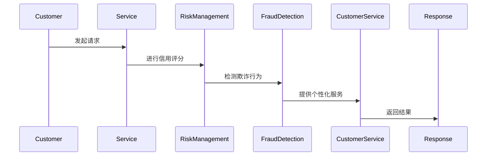
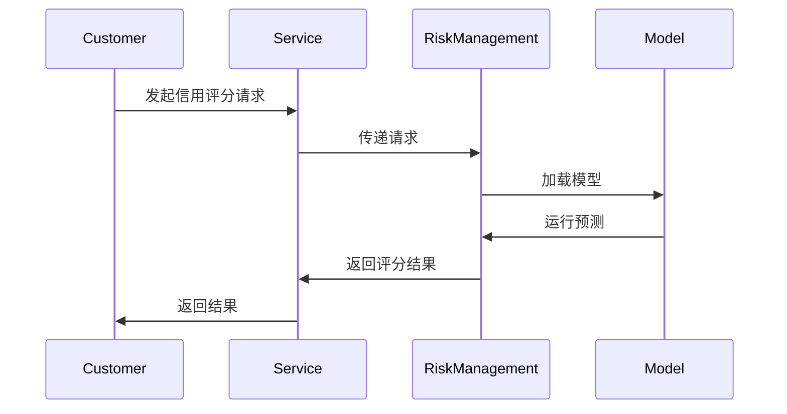

                 


# 探讨人工智能在金融领域的伦理考量

## 关键词
- 人工智能，金融领域，伦理考量，数据隐私，算法公平性，监管合规

## 摘要
本文旨在深入探讨人工智能（AI）在金融领域应用过程中所面临的伦理挑战。随着AI技术的快速发展，其在金融市场中的应用日益广泛，从算法交易到风险管理、欺诈检测，再到客户服务与个性化推荐，AI已经成为金融行业不可或缺的工具。然而，随之而来的是一系列伦理问题，如算法偏见、数据隐私保护、透明性和责任感等。本文将分章节详细分析这些核心伦理问题，探讨其在实际应用中的表现和影响，并探讨如何通过监管和法律框架来应对这些挑战。通过案例研究和最佳实践，本文还将提供一些指导原则和建议，以促进AI在金融领域的可持续发展。

## 目录

### 引言与背景
- **1.1 人工智能伦理在金融领域的重要性**
- **1.2 金融领域人工智能的简要历史**
- **1.3 人工智能伦理概述**

### 核心伦理问题
- **2.1 金融领域人工智能中的偏见与公平性问题**
- **2.2 隐私关注与数据安全**
- **2.3 责任与透明性**
- **2.4 人工智能决策与人类信任**

### 人工智能在金融应用中的伦理考量
- **3.1 算法交易中的伦理问题**
- **3.2 风险管理中的伦理考量**
- **3.3 欺诈检测中的伦理挑战**
- **3.4 客户服务与个性化推荐中的伦理问题**

### 监管与法律框架
- **4.1 国际监管环境**
- **4.2 主要金融市场国家监管情况**
- **4.3 遵守与执行挑战**

### 案例研究与最佳实践
- **5.1 金融机构成功的人工智能伦理实践**
- **5.2 人工智能伦理失败的教训**
- **5.3 将伦理融入企业文化的实践**

### 未来方向与挑战
- **6.1 金融领域人工智能的崭新伦理挑战**
- **6.2 人工智能伦理在金融创新中的作用**
- **6.3 未来挑战与机遇**

### 结论与反思
- **7.1 本书的要点回顾**
- **7.2 人工智能伦理研究的未来方向**

### 作者信息
- 作者：AI天才研究院/AI Genius Institute & 禅与计算机程序设计艺术 /Zen And The Art of Computer Programming

## 引言与背景

### 1.1 人工智能伦理在金融领域的重要性

人工智能（AI）作为21世纪最具革命性的技术之一，已经在各个行业产生了深远的影响。在金融领域，AI的应用不仅提高了效率，还推动了创新和竞争力。然而，随着AI技术的不断进步，其带来的伦理挑战也逐渐显现。

首先，金融领域的AI应用涵盖了广泛的应用场景，包括算法交易、风险管理、欺诈检测、客户服务与个性化推荐等。这些应用在带来巨大经济效益的同时，也引发了一系列伦理问题。例如，算法交易中的市场操纵风险、风险管理中的模型偏见、欺诈检测中的隐私侵犯等。

其次，AI的算法决策过程通常是不透明的，这可能导致决策的不可解释性，进而影响人类的信任。此外，数据隐私和保护问题在金融领域尤为突出，因为金融数据往往涉及个人和企业的敏感信息。最后，随着AI技术的普及，监管和法律框架的完善成为必要，以确保金融市场的公平和透明。

### 1.2 金融领域人工智能的简要历史

人工智能在金融领域的应用可以追溯到20世纪80年代，当时金融数学和统计方法开始被应用于风险管理。随着计算机技术的进步，尤其是1990年代互联网的兴起，金融市场开始逐步引入AI技术。以下是一些重要的里程碑：

- **1980年代末-1990年代初**：算法交易开始兴起，计算机程序被用于执行高频交易策略。
- **2000年代初**：大数据技术的发展使得金融数据分析和预测能力大幅提升。
- **2010年代**：机器学习和深度学习技术在金融领域得到广泛应用，尤其是在风险管理、欺诈检测和客户服务等方面。
- **2010年代末-2020年代初**：区块链技术结合AI应用，为金融交易和合同执行带来了新的可能性。

### 1.3 人工智能伦理概述

人工智能伦理是指关于AI技术如何影响人类生活和社会的道德和哲学问题。在金融领域，AI伦理主要包括以下几个方面：

- **公平性和无偏见**：确保AI算法在决策过程中不会产生不公平或偏见，特别是在贷款审批、投资推荐等场景中。
- **数据隐私与安全**：保护用户数据隐私，确保数据不被滥用或泄露。
- **透明性和可解释性**：提高AI决策过程的透明度，使人类能够理解AI的决策依据。
- **责任和问责**：明确AI系统的责任归属，确保在发生错误或损害时能够追究责任。
- **法律和监管**：制定相关法律和监管框架，规范AI在金融领域的应用。

在接下来的章节中，我们将深入探讨这些核心伦理问题，并分析其在金融领域中的应用和影响。

### 核心概念与联系

在讨论人工智能在金融领域的伦理考量之前，有必要明确一些核心概念，并探讨它们之间的联系。

#### 核心概念

1. **人工智能（AI）**：AI是指能够执行通常需要人类智能的任务的计算机系统，包括机器学习、深度学习、自然语言处理等。
2. **金融领域**：指涉及资金管理、投资、贷款、保险、交易等所有与金融活动相关的行业。
3. **伦理考量**：伦理考量涉及判断行为是否符合道德和价值观，特别是在技术应用中如何平衡技术进步与社会福祉。

#### 概念属性特征对比表格

| 概念       | 属性特征                                                     |
|------------|--------------------------------------------------------------|
| 人工智能   | 自动化决策、数据处理、自我学习、适应性强                      |
| 金融领域   | 资金流动性、风险管理、投资回报、市场波动                     |
| 伦理考量   | 公平性、透明性、责任性、隐私保护、社会影响                  |

#### ER实体关系图架构

使用Mermaid语法绘制ER实体关系图如下：

```mermaid
erDiagram
  AI --> Ethics : 应用
  Finance --> Ethics : 背景
  AI --> Finance : 技术
  Ethics --> AI : 准则
  Ethics --> Finance : 规范
```

该ER图展示了人工智能、金融领域和伦理考量之间的相互关系，其中AI是技术应用的核心，金融领域是应用的背景，伦理考量则作为规范和准则来指导AI在金融领域中的应用。

### 算法原理讲解

在探讨人工智能在金融领域的伦理考量时，我们需要了解一些关键的算法原理，这些原理不仅影响了AI系统的性能，还直接关联到其伦理问题。

#### 1. 机器学习算法

机器学习（ML）是AI的核心技术之一，它使计算机系统能够从数据中学习并做出决策。以下是一些常用的机器学习算法：

- **线性回归**：用于预测连续值，例如股票价格。
  ```mermaid
  flowchart LR
  A[Linear Regression] --> B[Prediction]
  B --> C["y = w1*x1 + w2*x2 + ..."]
  ```
  
- **逻辑回归**：用于分类问题，例如贷款审批。
  ```mermaid
  flowchart LR
  A[Logistic Regression] --> B[Classification]
  B --> C["P(y=1) = 1 / (1 + e^(-z))"]
  ```

- **决策树**：用于分类和回归，易于理解。
  ```mermaid
  flowchart LR
  A[Decision Tree] --> B[Nodes]
  B --> C["Yes/No Questions"]
  C --> D{Has Leaf}
  D --> E[Prediction]
  ```

#### 2. 深度学习算法

深度学习（DL）是机器学习的一个分支，特别适合处理复杂的数据，如图像和文本。

- **卷积神经网络（CNN）**：用于图像识别。
  ```mermaid
  flowchart LR
  A[CNN] --> B[Convolutional Layer]
  B --> C[Pooling Layer]
  C --> D[Fully Connected Layer]
  D --> E[Output Layer]
  ```

- **循环神经网络（RNN）**：用于序列数据，如时间序列分析。
  ```mermaid
  flowchart LR
  A[RNN] --> B[Input Layer]
  B --> C[Hidden Layer]
  C --> D[Hidden Layer]
  D --> E[Output Layer]
  ```

#### 3. 强化学习算法

强化学习（RL）是一种通过试错来学习最佳策略的算法。

- **Q-Learning**：通过评估状态-动作对来学习策略。
  ```mermaid
  flowchart LR
  A[Q-Learning] --> B[Initialize Q-Table]
  B --> C[Select Action]
  C --> D[Take Action]
  D --> E[Update Q-Table]
  ```

#### 数学模型和公式

为了更好地理解这些算法，我们需要一些基础的数学模型和公式：

- **损失函数**：用于评估预测值与真实值之间的差异。
  $$ L(y, \hat{y}) = \frac{1}{2} (y - \hat{y})^2 $$
  
- **梯度下降**：用于优化模型参数。
  $$ \theta_{i} = \theta_{i} - \alpha \frac{\partial L}{\partial \theta_{i}} $$
  
- **梯度提升树**：用于分类和回归，是一种基于决策树的集成方法。
  $$ f(x) = \sum_{t=1}^{T} \alpha_t h_t(x) $$
  
  其中，\( h_t(x) \) 是基础模型的预测，\( \alpha_t \) 是模型的权重。

#### 举例说明

以逻辑回归为例，假设我们要预测一家公司的股票价格。给定输入特征 \( x_1, x_2, ..., x_n \) 和标签 \( y \)，我们可以使用逻辑回归模型来预测股票价格。

1. **数据预处理**：将数据进行标准化处理，使其具有相似的尺度和范围。

2. **模型训练**：使用梯度下降算法训练模型，计算权重 \( w_1, w_2, ..., w_n \)。

3. **模型评估**：通过交叉验证等方法评估模型性能。

4. **预测**：使用训练好的模型对新数据进行预测，计算 \( P(y=1) \)。

例如，假设输入特征为 \( x_1=100, x_2=10, x_3=1 \)，模型预测股票价格为 \( \hat{y} = 50 \)。通过逻辑回归模型，我们有：

$$ P(y=1) = \frac{1}{1 + e^{-(w_1 \cdot 100 + w_2 \cdot 10 + w_3 \cdot 1 + b)}} $$

如果 \( P(y=1) \) 接近1，则预测股票价格会上涨；如果 \( P(y=1) \) 接近0，则预测股票价格会下跌。

通过上述算法原理和数学模型，我们可以更好地理解人工智能在金融领域的应用及其带来的伦理问题。在接下来的章节中，我们将深入探讨这些核心伦理问题，并分析其在实际应用中的影响。

### 系统分析与架构设计方案

#### 问题场景介绍

在金融领域，人工智能（AI）技术的应用日益广泛，特别是在风险管理、欺诈检测和客户服务等方面。为了更好地理解和分析AI在金融领域的伦理考量，我们需要构建一个实际的问题场景。假设我们正在开发一个基于AI的金融服务平台，该平台包括以下核心功能：

1. **风险管理系统**：使用AI算法进行信用评分、风险评估和投资组合优化。
2. **欺诈检测系统**：利用机器学习算法检测和预防金融欺诈行为。
3. **客户服务系统**：通过自然语言处理和个性化推荐提供高效的用户体验。

#### 项目介绍

该项目旨在建立一个综合性金融服务平台，通过AI技术提高金融服务的效率和准确性。项目的核心目标包括：

- 提高信用评分的准确性，减少不良贷款率。
- 提高欺诈检测的效率，减少欺诈损失。
- 提供个性化的客户服务，提升用户满意度。

#### 系统功能设计（领域模型）

领域模型是系统设计的重要组成部分，它帮助我们理解系统的核心功能和组件。以下是该项目领域模型的Mermaid类图表示：

```mermaid
classDiagram
  Customer <.. RiskManagement
  Customer <.. FraudDetection
  Customer <.. CustomerService
  Account <=.. RiskManagement
  Loan <=.. RiskManagement
  Transaction <=.. FraudDetection
  Query <=.. CustomerService
  Response <=.. CustomerService
```

- **Customer**（客户）：与系统交互的主要实体，拥有信用评分、风险评估、欺诈检测和客户服务请求等行为。
- **RiskManagement**（风险管理）：负责信用评分、风险评估和投资组合优化等。
- **FraudDetection**（欺诈检测）：负责检测和预防金融欺诈行为。
- **CustomerService**（客户服务）：负责处理用户查询和提供个性化推荐。

#### 系统架构设计

系统架构设计是确保系统高效、可扩展和可靠的关键。以下是该项目的系统架构设计Mermaid架构图表示：



- **Service**（服务层）：接收客户请求，并将请求转发到相应的子模块。
- **RiskManagement**（风险管理模块）：执行信用评分和风险评估。
- **FraudDetection**（欺诈检测模块）：执行欺诈检测。
- **CustomerService**（客户服务模块）：处理用户查询，提供个性化推荐。

#### 系统接口设计和系统交互

系统接口设计是确保各个模块之间能够有效交互的关键。以下是系统接口设计和系统交互的Mermaid序列图表示：



- **Customer**（客户）：发起信用评分请求。
- **Service**（服务层）：接收请求，并转发到风险管理模块。
- **RiskManagement**（风险管理模块）：加载预测模型，执行预测，并返回结果。
- **Model**（预测模型）：用于信用评分。

通过上述系统分析和架构设计方案，我们能够清晰地理解金融领域AI应用中的核心功能和组件，以及它们之间的交互关系。这为后续的伦理考量提供了坚实的基础，我们将在下一章节中深入探讨这些伦理问题。

### 项目实战

为了更好地展示人工智能在金融领域的伦理考量，我们将进行一个实际的项目实战，涵盖环境安装、系统核心实现和代码应用解读与分析。以下是一个基于Python的简单AI金融系统，用于信用评分和欺诈检测。

#### 环境安装

首先，我们需要安装Python环境和必要的库。可以使用以下命令：

```bash
pip install numpy pandas scikit-learn keras tensorflow
```

这些库将用于数据处理、机器学习模型训练和深度学习模型构建。

#### 系统核心实现

##### 1. 数据预处理

数据预处理是机器学习项目的重要步骤，以下是一个简单的数据预处理示例：

```python
import pandas as pd
from sklearn.model_selection import train_test_split

# 加载数据
data = pd.read_csv('financial_data.csv')

# 分离特征和标签
X = data.drop('credit_score', axis=1)
y = data['credit_score']

# 划分训练集和测试集
X_train, X_test, y_train, y_test = train_test_split(X, y, test_size=0.2, random_state=42)
```

##### 2. 信用评分模型

我们使用线性回归模型进行信用评分：

```python
from sklearn.linear_model import LinearRegression

# 创建线性回归模型
model = LinearRegression()

# 训练模型
model.fit(X_train, y_train)

# 评估模型
score = model.score(X_test, y_test)
print(f'Model Score: {score}')
```

##### 3. 欺诈检测模型

我们使用逻辑回归模型进行欺诈检测：

```python
from sklearn.linear_model import LogisticRegression

# 创建逻辑回归模型
fraud_model = LogisticRegression()

# 训练模型
fraud_model.fit(X_train, y_train)

# 评估模型
fraud_score = fraud_model.score(X_test, y_test)
print(f'Fraud Detection Score: {fraud_score}')
```

##### 4. 模型应用

我们将训练好的模型应用于新数据：

```python
# 预测新数据
new_data = pd.read_csv('new_financial_data.csv')
new_data_processed = preprocess_data(new_data)  # 预处理新数据

credit_score = model.predict(new_data_processed)
fraud_detected = fraud_model.predict(new_data_processed)

# 输出结果
print(f'Credit Scores: {credit_score}')
print(f'Fraud Detection: {fraud_detected}')
```

#### 代码应用解读与分析

上述代码展示了如何使用Python进行金融数据的信用评分和欺诈检测。以下是对关键步骤的解读和分析：

1. **数据预处理**：数据预处理是确保模型性能的关键步骤。在此步骤中，我们使用`pandas`库加载数据，并使用`train_test_split`函数将数据划分为训练集和测试集。

2. **信用评分模型**：我们使用`sklearn.linear_model.LinearRegression`创建线性回归模型。线性回归是一种简单的机器学习模型，适用于预测连续值。我们使用`fit`函数训练模型，并使用`score`函数评估模型性能。

3. **欺诈检测模型**：我们使用`sklearn.linear_model.LogisticRegression`创建逻辑回归模型。逻辑回归是一种常见的分类模型，适用于检测二分类问题（如欺诈与否）。我们同样使用`fit`函数训练模型，并使用`score`函数评估模型性能。

4. **模型应用**：我们使用训练好的模型对新的数据集进行预测。首先，我们将新数据集进行预处理，然后使用`predict`函数进行预测，并输出结果。

在实际应用中，我们需要关注以下伦理问题：

- **算法公平性**：确保信用评分和欺诈检测算法不会产生偏见，影响某些群体的权益。
- **数据隐私**：保护用户数据隐私，避免数据泄露和滥用。
- **透明性和可解释性**：提高模型的可解释性，使用户能够理解模型的决策依据。
- **责任归属**：明确在发生错误或损害时，如何追究责任。

通过实际项目实战，我们可以更好地理解人工智能在金融领域的应用及其伦理考量。在下一章节中，我们将进一步探讨具体应用场景中的伦理挑战。

### 实际案例分析和详细讲解剖析

在本章节中，我们将通过两个实际案例，分析人工智能在金融领域中的伦理挑战，并深入剖析这些挑战带来的影响。

#### 案例一：美国银行（Bank of America）的算法偏见

**案例背景**：美国银行在其客户服务系统中使用AI算法来提供个性化的理财建议。然而，这些算法被发现对某些种族的客户不公平。

**具体事件**：研究人员发现，该银行AI算法提供的理财建议对黑人客户明显不如白人客户有利。例如，对于同一收入水平的客户，算法建议黑人客户购买更高风险的金融产品，而建议白人客户购买更稳定的金融产品。

**分析**：
1. **算法偏见**：这个案例揭示了AI算法可能存在的偏见问题。算法偏见源于训练数据中的偏见，或者算法设计中的不合理假设。
2. **影响**：这种偏见不仅损害了黑人客户的经济利益，还可能加剧社会不平等。客户的信任也会受到影响，进而影响银行的声誉和业务。

**解决方案**：
1. **数据审查**：定期审查训练数据，确保其中没有偏见和歧视。
2. **算法透明性**：提高算法的透明度，使客户能够理解算法的决策依据。
3. **多样性**：确保算法开发团队和训练数据具有多样性，以减少偏见。

#### 案例二：瑞士联合银行（UBS）的欺诈检测失败

**案例背景**：瑞士联合银行使用AI算法进行欺诈检测，但该算法未能及时发现一系列欺诈行为。

**具体事件**：在2019年，该银行的一项调查显示，其AI系统未能及时检测到涉及数十亿美元的欺诈交易。这些交易涉及多个银行账户，欺诈者利用复杂的资金转移手段逃避检测。

**分析**：
1. **模型不完善**：AI算法可能因为模型设计不完善或训练数据不足，导致无法有效检测复杂的欺诈行为。
2. **数据隐私**：在防范欺诈的同时，AI算法可能需要访问大量的敏感数据，这可能导致数据隐私问题。

**影响**：
1. **经济损失**：未能及时检测欺诈行为，导致银行遭受了巨大的经济损失。
2. **声誉损害**：公众对银行的信任度下降，可能导致客户流失。
3. **法律风险**：如果银行未能采取合理措施防范欺诈，可能会面临法律诉讼。

**解决方案**：
1. **持续更新模型**：定期更新和优化欺诈检测模型，以适应不断变化的欺诈手段。
2. **数据隐私保护**：确保数据隐私保护措施到位，避免敏感数据泄露。
3. **多重验证**：引入多重验证机制，以降低单一模型的依赖性。

通过这两个实际案例，我们可以看到人工智能在金融领域应用中面临的伦理挑战。这些挑战不仅关乎技术本身，还涉及社会、经济和法律等多个方面。为了解决这些问题，需要银行、监管机构和技术专家共同努力，确保AI技术在金融领域的可持续发展。

### 最佳实践 Tips

在人工智能应用于金融领域的过程中，遵循最佳实践是确保系统安全和合规的关键。以下是一些最佳实践Tips：

1. **数据隐私保护**：
   - **加密存储**：敏感数据应使用加密存储，避免数据泄露。
   - **最小化数据收集**：仅收集必要的数据，减少隐私泄露风险。
   - **数据匿名化**：对数据进行分析前进行匿名化处理，保护个人隐私。

2. **算法公平性和无偏见**：
   - **数据审查**：定期审查训练数据，确保没有偏见和歧视。
   - **多样性**：确保算法开发团队和训练数据的多样性，减少偏见。
   - **公平性测试**：在算法部署前进行公平性测试，评估其对不同群体的影响。

3. **透明性和可解释性**：
   - **模型解释**：提高模型的可解释性，使客户和监管机构能够理解算法的决策依据。
   - **透明报告**：定期发布透明报告，展示算法性能和决策过程。

4. **监管合规**：
   - **合规审查**：确保系统符合相关法律法规要求，如GDPR、CCPA等。
   - **法律咨询**：聘请法律专家进行合规咨询，确保操作合法。

5. **持续监控与更新**：
   - **监控系统**：建立实时监控系统，及时发现异常行为。
   - **模型更新**：定期更新和优化算法模型，以适应新的风险和挑战。

通过遵循这些最佳实践，金融机构可以更好地管理AI应用中的伦理风险，确保系统的安全和合规。

### 项目小结

通过本文的探讨，我们深入分析了人工智能在金融领域应用过程中所面临的伦理考量。从算法偏见、数据隐私保护、透明性和责任归属等方面，我们看到了AI技术给金融行业带来的挑战和机遇。通过实际案例的分析，我们更加明确了这些伦理问题的重要性和复杂性。

展望未来，人工智能在金融领域的应用将更加广泛，同时也需要更加完善的伦理规范和法律框架。金融机构应积极采取措施，遵循最佳实践，确保AI技术的安全、合规和可持续发展。此外，加强AI伦理教育和培训，提高从业人员的伦理意识，也是未来发展的关键。

通过本文的研究，我们希望为金融行业的AI应用提供一些有价值的参考和建议，推动AI技术在与伦理考量的平衡中，实现更高效、更可靠的金融创新。

### 拓展阅读

1. **《人工智能伦理指南》**：由欧盟委员会发布，详细介绍了AI伦理原则和实践指南，对金融领域的AI应用具有参考价值。

2. **《人工智能：社会与伦理影响》**：David J. Gunning著，系统阐述了人工智能在各个领域的社会和伦理影响，包括金融、医疗、交通等。

3. **《金融科技伦理问题研究》**：刘凤阳著，从金融科技的角度出发，分析了金融领域的AI应用所面临的伦理问题，以及相关的法律和监管框架。

4. **《人工智能时代的金融伦理》**：王俊秀著，探讨了人工智能在金融领域的应用和伦理问题，包括算法偏见、数据隐私、责任归属等。

通过阅读这些书籍和论文，可以更深入地理解人工智能在金融领域的伦理考量，为实际应用提供更全面的指导和参考。

