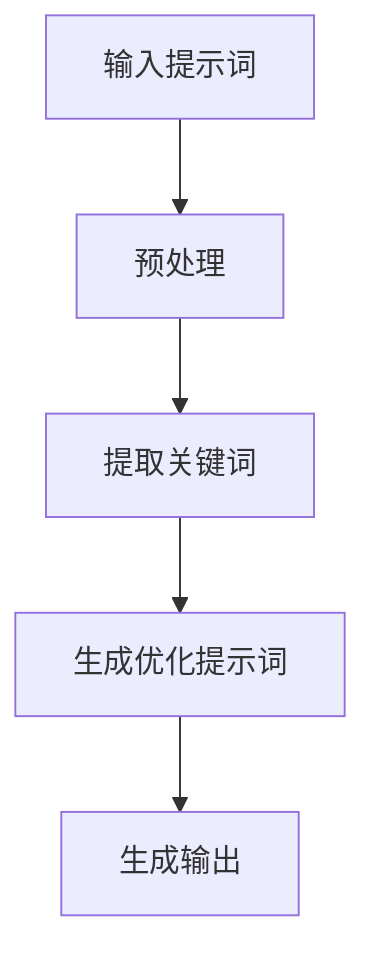
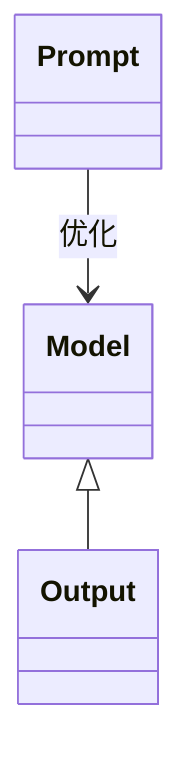
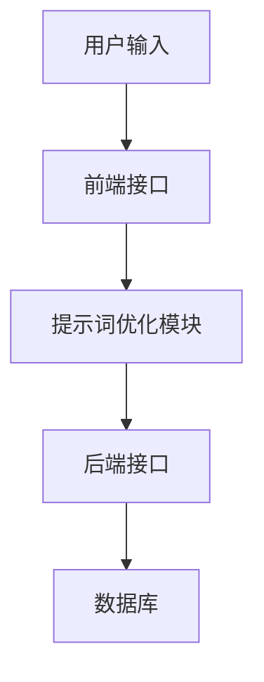
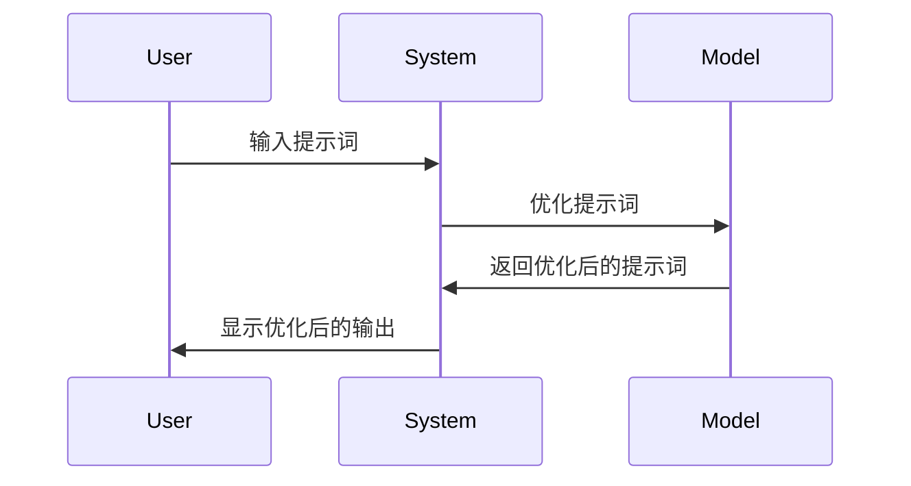

                 

### 文章标题：提示词优化技巧：提升AI输出质量的艺术

#### 关键词：人工智能，自然语言处理，提示词优化，输出质量，算法原理，系统设计

#### 摘要：
本文旨在深入探讨提示词优化的技术方法和艺术，通过系统分析和实践，为提升人工智能（AI）输出质量提供实用的技巧和策略。我们将首先回顾AI与自然语言处理（NLP）的基础知识，然后逐步介绍提示词优化的核心概念、算法原理和系统设计，最终通过实际案例分析和项目实战，展示如何将提示词优化应用于实践，提升AI系统的整体性能和用户体验。

---

### 第一部分：背景与基础

#### 第1章：AI与自然语言处理概述

##### 1.1 人工智能的发展历程
在探讨AI与NLP的结合之前，了解人工智能的发展历程是至关重要的。人工智能从早期的理论探讨到如今的广泛应用，经历了多次技术变革和突破。

**问题背景：** 人工智能的起源可以追溯到20世纪50年代，当时科学家们开始探索机器能否模拟人类智能。

**问题描述：** 随着计算机技术的发展，人工智能领域面临的问题是，如何使计算机能够理解自然语言，进行有效的交流。

**问题解决：** 科学家们通过机器学习、神经网络等技术的不断探索，逐步解决了这一难题。

**边界与外延：** 人工智能的边界包括机器学习、深度学习、自然语言处理等多个领域，外延则涵盖从自动化系统到智能助手等各种应用场景。

##### 1.2 自然语言处理的核心概念
自然语言处理的核心概念包括语言模型、词汇表、语义分析等。

**核心概念：**
- **语言模型：** 是描述自然语言概率分布的数学模型。
- **词汇表：** 是包含自然语言中所有单词及其相关信息的数据库。
- **语义分析：** 是理解文本中词语和句子意义的过程。

**属性特征对比表格：**
| 特征          | 语言模型         | 词汇表         | 语义分析         |
| ------------- | ---------------- | -------------- | ---------------- |
| **功能**      | 生成文本         | 存储单词信息   | 理解文本语义     |
| **应用场景**  | 文本生成         | 语言翻译       | 问答系统         |

##### 1.3 人工智能在自然语言处理中的应用
人工智能在自然语言处理中的应用非常广泛，包括但不限于：

- **文本分类：** 使用AI技术对大量文本进行分类，如新闻分类、情感分析等。
- **机器翻译：** 使用AI技术实现不同语言之间的翻译，如谷歌翻译、百度翻译等。
- **问答系统：** 使用AI技术构建智能问答系统，如苹果的Siri、亚马逊的Alexa等。

**应用场景：** AI在自然语言处理中的应用场景多种多样，涵盖了从文本生成到智能客服等多个领域。

**现状与趋势：** 当前，AI在自然语言处理领域的应用正在迅速发展，随着深度学习和神经网络技术的进步，未来的发展趋势将更加智能化和个性化。

#### 第2章：提示词优化的意义与目标

##### 2.1 提示词优化的定义与重要性
**定义：** 提示词优化是指通过对输入提示词进行处理和改进，以提高AI输出质量的过程。

**重要性分析：** 提示词优化的关键在于提升AI输出文本的准确性、流畅性和用户满意度。

- **提升AI输出准确度：** 通过优化提示词，可以减少误解和歧义，提高AI输出的准确性。
- **提升AI输出流畅性：** 通过优化提示词，可以使AI生成的文本更加连贯和自然。
- **提升用户体验：** 通过优化提示词，可以增强用户对AI系统的信任和满意度。

##### 2.2 提示词优化在AI输出质量中的作用
**提升AI输出准确度：** 通过对提示词的精确理解和处理，AI可以生成更准确的输出文本。

**提升AI输出流畅性：** 通过优化提示词，AI可以生成更加自然和流畅的文本。

**提升用户体验：** 优质的AI输出能够提升用户对AI系统的满意度，增强用户粘性。

##### 2.3 提示词优化的目标
**精准度：** 提高AI对输入提示词的理解和解析能力，确保输出文本的准确性。

**流畅度：** 提高AI输出文本的连贯性和自然度，使其更易于理解。

**用户满意度：** 通过提升AI输出质量，增强用户对AI系统的满意度和信任感。

---

### 第二部分：核心概念与联系

#### 第3章：提示词优化的核心概念

##### 3.1 提示词的类型
**开放式提示词：** 指那些具有广泛含义、不具体、模糊的提示词，如“谈谈未来科技”。

**封闭式提示词：** 指那些含义明确、具体的提示词，如“请描述2023年的人工智能发展”。

**示例：**
- **开放式提示词：** “请写一篇关于人工智能的文章。”
- **封闭式提示词：** “请写一篇关于2023年人工智能在医疗领域的应用的文章。”

##### 3.2 提示词优化的方法
**文本清洗：** 清除文本中的噪声和无关信息，如标点符号、停用词等。

**提取关键词：** 从文本中提取出核心关键词，如使用TF-IDF算法。

**提示词组合：** 将多个提示词组合成更具体的提示词，以提高AI的输出质量。

##### 3.3 提示词优化工具
**开源工具：** 如NLTK、spaCy等，适用于文本处理和自然语言理解。

**商业工具：** 如IBM Watson、Google Cloud Natural Language等，提供专业的文本处理和分析服务。

---

### 第三部分：算法原理与实现

#### 第4章：核心概念之间的关系

##### 4.1 提示词优化与自然语言理解
**关系说明：** 提示词优化是自然语言理解的一个重要环节，它直接影响AI对输入文本的理解和生成。

**实例分析：**
- **示例1：** 使用NLTK对一段文本进行分词和词频统计，以优化提示词。
- **示例2：** 利用spaCy进行语义分析，以提取出关键概念和关系，进一步优化提示词。

##### 4.2 提示词优化与机器学习模型
**关系说明：** 提示词优化与机器学习模型密切相关，优化后的提示词可以提高模型的输入质量，进而提升输出质量。

**实例分析：**
- **示例1：** 使用Word2Vec模型对文本进行向量表示，优化提示词。
- **示例2：** 利用BERT模型对文本进行深度理解，以优化提示词。

##### 4.3 提示词优化与用户反馈
**关系说明：** 用户反馈是提示词优化的重要依据，通过分析用户反馈，可以不断优化提示词，提高AI系统的用户体验。

**实例分析：**
- **示例1：** 收集用户对AI输出的评价，分析优化点。
- **示例2：** 基于用户反馈，调整提示词优化策略。

---

### 第四部分：系统设计与实现

#### 第5章：提示词优化算法原理

##### 5.1 提示词优化算法的数学模型
**数学模型介绍：** 提示词优化算法的数学模型主要包括概率模型和神经网络模型。

**数学公式：**
$$
P(\text{output}|\text{prompt}) = \text{sigmoid}(W \cdot \text{prompt} + b)
$$

**解释：** 上式表示在给定提示词prompt的情况下，输出output的概率分布。其中，W是权重矩阵，b是偏置项。

##### 5.2 算法原理讲解
**算法流程图：**


**解释：** 流程图描述了提示词优化算法的基本步骤，包括输入提示词的预处理、关键词提取、优化提示词生成和输出生成。

##### 5.3 算法举例说明
**举例说明：** 假设输入提示词为“请描述一下2023年的人工智能发展”，通过优化后，可以生成更具体的输出文本。

- **优化前：** “请描述一下2023年的人工智能发展。”
- **优化后：** “2023年，人工智能在医疗领域取得了显著的进展，例如通过深度学习技术提高了疾病诊断的准确性。”

---

### 第五部分：项目实战

#### 第6章：提示词优化系统的设计与实现

##### 6.1 系统概述
**问题场景：** 在一个智能问答系统中，用户输入的问题往往不够具体，导致AI输出质量不佳。

**系统目标：** 通过提示词优化，提高AI输出文本的准确性、流畅性和用户满意度。

##### 6.2 系统功能设计
**领域模型：**


**解释：** 领域模型描述了提示词优化系统的基本组成，包括输入提示词、优化模型和输出结果。

##### 6.3 系统架构设计
**系统架构：**


**解释：** 系统架构图展示了用户输入、前端接口、提示词优化模块、后端接口和数据库之间的交互关系。

##### 6.4 系统接口设计
**接口设计：** 系统提供了API接口，方便开发者集成和调用。

**接口示例：**
```python
from prompt_optimization import optimize_prompt

def optimize_prompt_text(prompt):
    optimized_prompt = optimize_prompt(prompt)
    return optimized_prompt
```

##### 6.5 系统交互设计
**系统交互：**


**解释：** 系统交互图描述了用户输入提示词、系统优化提示词并返回优化后的输出的过程。

---

### 第六部分：最佳实践与拓展

#### 6.1 最佳实践Tips
- **定期更新词汇库：** 保持词汇库的更新，以适应新出现的技术和术语。
- **分析用户反馈：** 及时分析用户反馈，根据反馈调整提示词优化策略。
- **优化算法模型：** 定期对算法模型进行评估和优化，以提高输出质量。

#### 6.2 小结
本文通过系统分析和实践，详细介绍了提示词优化的技术方法和艺术。从基础概念到算法原理，再到系统设计，我们逐步展示了如何提升AI输出质量，为AI系统的实际应用提供了实用的策略和技巧。

#### 6.3 注意事项
- 提示词优化需要综合考虑准确性、流畅性和用户满意度，三者之间需要平衡。
- 算法模型的优化是一个持续的过程，需要根据实际应用场景进行不断调整。
- 用户反馈是优化的重要依据，要及时收集和分析用户反馈，以指导优化工作。

#### 6.4 拓展阅读
- [自然语言处理入门教程](https://www.nltk.org/)
- [深度学习与自然语言处理](https://www.deeplearningbook.org/)
- [人工智能应用案例集](https://ai.stanford.edu/)

